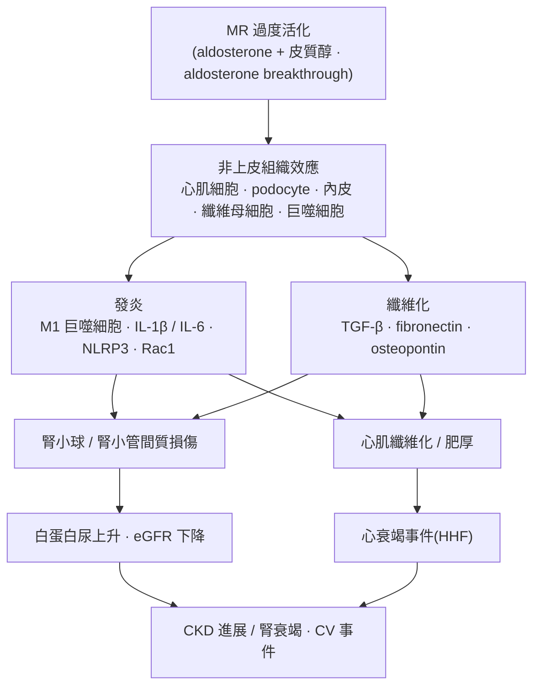

# Finerenone 不只是比較安全的 spironolactone
### 從「指南藥物」到「標的病理生物學的藥物」——為何有限降壓仍能穩定心腎保護

> **稽核說明**：本文每一項事實性論斷句末以 `[本地MD檔名]` 標註可回溯來源,供 grep 稽核。引用標記 📄 表示以本地全文(full text / 全文抽取)驗證,📌 表示僅取得 abstract。僅有 abstract 的文獻不對其內容做具體數字斷言。LLM 僅負責組織與改寫,所有作者、年份、DOI、數字均出自本地 MD 檔案。

---

> 📊 **統計深度解讀**：本主題重要文獻結果的統計迷思與臨床轉換亮點，見獨立檔 [`statistical_insights_myths.md`](statistical_insights_myths.md)。

> 🔬 **深度藥理專題**：finerenone 短半衰期（2–3h）、受體 off-rate（解離半衰期 ~50 min）與「暫停即解毒」的 PK-vs-PD 耦合機制，見獨立檔 [`pk_pd_hysteresis_offrate_hold_restart.md`](pk_pd_hysteresis_offrate_hold_restart.md)。

## 1. 引言:把 finerenone 重新定位為「標的病理生物學」的藥物

在第二型糖尿病(T2D)合併慢性腎臟病(CKD)的照護中,控糖、控血壓與 RAS(腎素–血管收縮素系統)阻斷長期被視為三大支柱;然而即使在最佳化這些治療之後,患者仍持續進展至腎衰竭並發生心血管事件,存在明顯的「殘餘風險」📄[biomarker_Verma_2026.md]。這種殘餘風險的核心,並非只是血流動力學失調,而是由代謝異常、發炎與纖維化路徑共同驅動的病理生物學:糖尿病腎病(DKD)的發生被認為由代謝紊亂、促發炎/促纖維化路徑活化與血流動力學改變三個相互交織的過程驅動,而傳統以控糖與 RAS 抑制為主的策略,主要處理的是血流動力學這一面向📄[biomarker_Verma_2026.md]。

礦皮質素受體(mineralocorticoid receptor, MR)的過度活化,正是連結上述殘餘發炎–纖維化風險的關鍵節點。MR 是一個表現於腎臟、心臟、免疫細胞與纖維母細胞等多種組織的核受體,其作用除了廣為人知的水鹽與血流動力學恆定外,還包含較少被強調的組織重塑;病理性的 MR 過度活化會在心腎疾病中導致發炎與纖維化📄[molecular_Agarwal_2021.md]。因此,本文的立場是:finerenone 的價值不在於它是一個「比較安全的 spironolactone」,而在於它是一個以 MR 相關病理生物學為標的的藥物——它處理的是血糖、血壓與 RAS 阻斷之外的殘餘發炎–纖維化風險。這也解釋了本文的核心臨床問題:為何 finerenone 在血壓下降幅度相對有限的情況下,仍能產生穩定且可重現的心腎保護?

---

## 2. 臨床背景最小包:一條清楚的轉譯路徑

finerenone(早期代號 BAY 94-8862)的臨床發展呈現一條由機制假說走向硬終點證據的轉譯路徑,可概括為 **ARTS → ARTS-DN → FIDELIO-DKD → FIGARO-DKD →(FIDELITY pooled)**。

**ARTS(第二層安全性/耐受性)**:在 HFrEF 合併輕度或中度 CKD 的患者中,ARTS 以開放標示的 spironolactone(25 或 50 mg/day)作為對照,顯示 BAY 94-8862 引起的血清鉀上升顯著小於 spironolactone(各劑量組 0.04–0.30 vs. 0.45 mmol/L,P < 0.0001–0.0107),高血鉀發生率較低(5.3% vs. 12.7%,P = 0.048),且腎功能惡化更少📄[arts_program_Pitt_2013.md]。關鍵是,BAY 94-8862 在降低 BNP、NT-proBNP 與白蛋白尿(UACR)的幅度上「至少與 spironolactone 相當」,亦即在更小的高血鉀與腎功能惡化代價下取得相似的血流動力學/腎臟生物標記效果📄[arts_program_Pitt_2013.md]。

**FIDELIO-DKD(腎臟主終點)**:納入以進展期(多為第 3–4 期)CKD、嚴重白蛋白尿為主的 T2D 患者,在最大耐受劑量 ACEi/ARB 之上加用 finerenone。主終點(腎衰竭、eGFR 持續下降 ≥40%、或腎因性死亡的複合)HR 0.82(95% CI 0.73–0.93,P = 0.001),3 年 NNT 為 29;關鍵次要心血管複合終點 HR 0.86(95% CI 0.75–0.99,P = 0.03)📄[FIDELIO-DKD_NEJMoa2025845.md]。

**FIGARO-DKD(心血管主終點)**:納入較早期、較廣的 CKD 光譜,主終點(CV 死亡、非致死性 MI、非致死性中風、或心衰竭住院的複合)HR 0.87(95% CI 0.76–0.98,P = 0.03),效益主要由心衰竭住院驅動(HR 0.71,95% CI 0.56–0.90)📄[FIGARO-DKD_NEJMoa2110956.md]。

**FIDELITY(預設的個體病人層級合併分析)**:合併 FIDELIO-DKD 與 FIGARO-DKD,分析族群 N = 13,026📄[biomarker_Agarwal_2022.md]。心血管複合終點 HR 0.86(95% CI 0.78–0.95,P = 0.0018),腎臟複合終點(含 eGFR 下降 ≥57%)HR 0.77(95% CI 0.67–0.88,P = 0.0002),ESKD 風險下降 20%(HR 0.80,95% CI 0.64–0.99)📄[biomarker_Agarwal_2022.md]。族群中 99.8% 在使用 RAS 抑制劑,基線 SGLT2i 使用僅 6.7%,反映該效益是「疊加在已最佳化的標準治療之上」的殘餘風險降低📄[biomarker_Agarwal_2022.md]。

值得注意的是,這條路徑近期已延伸至「非糖尿病」CKD:FIND-CKD 在無糖尿病的 CKD 患者中,顯示 finerenone 在 32 個月的總 eGFR 斜率上優於安慰劑(−3.3 vs. −4.0 mL/min/1.73 m²/年,差異 0.7,95% CI 0.3–1.1,P < 0.001),暗示 MR 相關病理路徑並非糖尿病專屬📄[FIND-CKD_NEJMoa2604625.md]。

---

## 3. 第一層——分子機制:為何「生物學不同」而非只是「副作用差」

### 3.1 MR 的非上皮組織效應

MR 不只表現在遠端腎元的上皮細胞;它同時表現於心肌細胞、podocyte、內皮細胞、平滑肌細胞、纖維母細胞、發炎細胞與脂肪細胞📄[biomarker_Verma_2026.md]。在這些非上皮組織中,MR 過度活化會促進單核球分化為促發炎的 M1 巨噬細胞、生成 IL-1β 與 IL-6 等促發炎細胞激素、釋放 TGF-β、fibronectin 與 osteopontin 等促纖維化蛋白,並上調 Rac1;aldosterone 經由 MR 與 Rac1 活化 NLRP3 發炎小體,導致 podocyte 損傷、腎小球硬化與腎小管間質發炎📄[biomarker_Verma_2026.md]。

一個關鍵的組織生物學細節解釋了「心臟與腎臟的 MR 由不同配體驅動」:滅活皮質醇的酵素 11β-HSD2 存在於遠端腎元上皮,但在心肌細胞、podocyte 與巨噬細胞中不存在,因此在這些細胞中,豐度更高的皮質醇(而非 aldosterone)可能才是 MR 的主要活化配體📄[molecular_Agarwal_2021.md]。此外,長期 ACEi/ARB 使用會出現「aldosterone breakthrough」——血清 aldosterone 未被完全抑制而回升——這正是 RAS 阻斷之上仍存在 MR 過度活化殘餘風險的藥理基礎📄[molecular_Agarwal_2021.md]。

### 3.2 finerenone 的非類固醇選擇性與獨特結合模式

finerenone 是第三代、非類固醇的選擇性 MRA,對 MR 的選擇性高於 eplerenone 與 spironolactone,而效價至少與 spironolactone 相當📄[molecular_Agarwal_2021.md]。分子模型研究指出,finerenone 以「巨大、被動(bulky, passive)拮抗劑」的方式阻斷 MR,此機制與類固醇型 MRA 不同,並可能決定其差異化的臨床反應;finerenone 獨特的結合模式決定其效價、選擇性與核輔因子(cofactor)招募,而其物化性質(親脂性與極性)則決定組織穿透與分布📄[molecular_Agarwal_2021.md]。這種「被動拮抗」的原型概念,最早由 Fagart 等人在非類固醇分子 BR-4628 上提出——它以被動機制使 MR 失活,代表一類新的 MR 拮抗劑📄[r2_Fagart_2010.md]。

### 3.3 抑制核輸入與輔因子招募的分子證據

Amazit 等人的機制研究提供了「finerenone 與 spironolactone 分子作用不同」最直接的證據📄[molecular_Amazit_2015.md]:

- **效價與親和力**:finerenone 的 IC50 為 58 ± 9 nM,spironolactone 為 74.0 ± 15 nM;finerenone 與體外轉譯的全長 MR 以高親和力結合(Kd = 1.52 ± 0.01 nM),解離半衰期約 50 分鐘📄[molecular_Amazit_2015.md]。
- **延遲核輸入**:aldosterone 誘導的最大核轉位指數為 3.11 ± 0.02;相較之下,finerenone 比 spironolactone 更有效地延遲 aldosterone 誘導的 MR 核內累積📄[molecular_Amazit_2015.md]。
- **抑制輔因子招募(反向致效劑行為)**:在 SCNN1A 基因調控序列的 ChIP 分析中,finerenone 不僅抑制 MR、SRC-1(steroid receptor coactivator-1)與 RNA polymerase II 的招募,還「顯著降低基礎狀態下的 MR 與 SRC-1 結合」,呈現與 spironolactone 不同的反向致效劑(inverse-agonist-like)特性📄[molecular_Amazit_2015.md]。Kolkhof 2017 亦將此概括為:在缺乏 aldosterone 時,類固醇型 MRA 呈部分致效性的輔因子招募,而 finerenone 則作為反向致效劑抑制輔因子結合📄[molecular_Kolkhof_2017.md]。

### 3.4 嚴格拮抗 vs. 對突變 MR 的致效——安全藥理學的分子根據

一個能清楚區分「生物學不同」的實驗,是對早發性高血壓突變 MR(S810L)的行為。Geller 等人證實 S810L 是一個造成早發、且於懷孕期顯著惡化之高血壓的活化型突變,會使原本作為 MR 拮抗劑的黃體素等 21-羥基缺失類固醇轉為強效致效劑,而 spironolactone 本身在 S810L 上也成為強效致效劑,因此在 S810L 帶因者屬禁忌📄[r2_Geller_2000.md]。相對地,Amazit 等人顯示 finerenone 並不活化 MR^S810L,而是以嚴格拮抗方式抑制 aldosterone 誘導的活性(IC50 = 16.1 ± 3.1 × 10⁻⁶ M),與 spironolactone 在同一突變上表現為致效劑形成鮮明對比📄[molecular_Amazit_2015.md]。此外,結構–功能研究定位 Ser-810 與 Ala-773 為 finerenone 高選擇性與高效價的關鍵殘基📄[molecular_Amazit_2015.md]。這說明兩者的差異是「受體藥理學層次」的,而非僅是臨床副作用譜的差異。

### 3.5 前臨床抗纖維化:等排鈉劑量下的差異

組織分布上,以放射標記藥物在大鼠進行的實驗顯示,spironolactone 與 eplerenone 在腎臟的濃度高於心臟,而 finerenone 呈現「腎–心平衡」分布,且不穿越血腦障壁📄[molecular_Agarwal_2021.md]。在腎損傷模型中,finerenone 能降低促發炎與促纖維化標記、減少蛋白尿與腎小管間質纖維化,且在「不顯著影響血壓的劑量」下即可達成——這是 BP-independent 效應在前臨床層次的直接證據📄[molecular_Agarwal_2021.md]。當以「等排鈉劑量(equinatriuretic dose)」與 eplerenone 對比時,finerenone 對腎臟造成較少的肥厚、蛋白尿與促發炎/促纖維化基因表現,並在心臟纖維化模型中對促纖維化基因表現與發炎/纖維化指標產生質性不同的效果📄[molecular_Agarwal_2021.md]。Kolkhof 2022 進一步在 DOCA-salt 等模型中記錄 finerenone 下調 KIM-1、NGAL(LCN2)等腎損傷/發炎相關基因的 mRNA 表現,支持其抗發炎–抗纖維化機制橫跨多個器官系統📄[preclinical_antifibrotic_Kolkhof_2022.md]。

**病理生理鏈結(流程圖 1):MR 過度活化如何導向白蛋白尿與心衰竭事件**

*(流程圖內容整合自 📄[biomarker_Verma_2026.md]、📄[molecular_Agarwal_2021.md]、📄[preclinical_antifibrotic_Kolkhof_2022.md])*

---

## 表 1:類固醇型 MRA 與 finerenone 的藥理學差異

| 特性 | Spironolactone | Eplerenone | Finerenone | 來源 |
|---|---|---|---|---|
| 分類 | 類固醇型(第一代) | 類固醇型(第二代) | 非類固醇型(第三代) | 📄[molecular_Kolkhof_2017.md] / 📄[biomarker_Verma_2026.md] |
| 結構/選擇性 | 強效但非選擇性 | 選擇性較高但效價較低 | 強效且選擇性;巨大、被動拮抗 | 📄[molecular_Agarwal_2021.md] |
| 對 MR 親和力 | 中間 | 最低(對 MR 親和力低) | 最高(finerenone > spironolactone >> eplerenone) | 📄[biomarker_Verma_2026.md] / 📄[r2_Fagart_2010.md] |
| 組織分布(囓齒類) | 腎 > 心 | 腎 > 心 | 腎–心平衡;不入腦 | 📄[molecular_Agarwal_2021.md] |
| 缺乏 aldosterone 時輔因子招募 | 部分致效性招募 | 部分致效性招募 | 反向致效劑(抑制基礎輔因子結合) | 📄[molecular_Kolkhof_2017.md] / 📄[molecular_Amazit_2015.md] |
| 半衰期 / 代謝物 | 前驅藥,多個長半衰期活性代謝物(canrenone 等) | 無活性代謝物,半衰期 4–6 h | 無活性代謝物,短半衰期(腎衰竭者 2–3 h) | 📄[molecular_Agarwal_2021.md] / 📄[biomarker_Verma_2026.md] |
| 親脂性 | 高 | 高 | 極性較高,親脂性低 6–10 倍 | 📄[molecular_Agarwal_2021.md] |
| 對 S810L 突變 MR | 致效劑(禁忌) | — | 嚴格拮抗 | 📄[molecular_Amazit_2015.md] / 📄[r2_Geller_2000.md] |
| 性相關副作用(男性女乳症等) | 有 | 低頻率 | 未觀察到或罕見 | 📄[biomarker_Verma_2026.md] / 📄[biomarker_Filippatos_2023.md] |
| 對血壓的影響 | 較大 | 與 finerenone 相近 | 相對有限 | 📄[biomarker_Verma_2026.md] / 📄[arts_program_Pitt_2013.md] |
| 適應症/硬終點證據 | HFrEF(RALES);HFpEF 未達主終點(TOPCAT) | HFrEF/post-MI(EMPHASIS-HF, EPHESUS) | 唯一核准用於 DKD;HFmrEF/HFpEF(FINEARTS-HF) | 📄[hf_finearts_Van_2026.md] / 📄[biomarker_Verma_2026.md] |

---

## 4. 第二層——生物標記:UACR 早期下降作為療效中介

### 4.1 UACR 的早期下降與其作為替代終點的正當性

在 FIDELITY 中,finerenone 於第 4 個月時 UACR 較安慰劑相對降低 32%(LS-mean 比值 0.68,95% CI 0.66–0.70)📄[biomarker_Agarwal_2022.md];在個別試驗中,FIDELIO-DKD 於第 4 個月 UACR 較安慰劑多降 31%(比值 0.69,95% CI 0.66–0.71),FIGARO-DKD 多降 32%(比值 0.68,95% CI 0.65–0.70)📄[FIDELIO-DKD_NEJMoa2025845.md] / 📄[FIGARO-DKD_NEJMoa2110956.md]。

這種早期 UACR 下降之所以在機制論述上重要,是因為白蛋白尿變化本身具有作為 CKD 進展替代終點的流行病學基礎:Coresh 等人於 28 個世代、693,816 人的個體層級統合分析中發現,2 年基線期間 UACR 下降 30% 與後續 ESKD 風險降低相關(校正 HR 0.83,95% CI 0.74–0.94;進一步校正回歸稀釋後 0.78,95% CI 0.66–0.92)📄[r2_Coresh_2019.md]。此結果支持在白蛋白尿升高的情境下,將平均白蛋白尿變化作為 CKD 進展臨床試驗的替代終點📄[r2_Coresh_2019.md]。換言之,finerenone 早期壓低 UACR,並非只是「數字好看」,而是與其硬終點腎臟效益在生物學上一致的中介訊號。

### 4.2 上游生物標記:超越 RAS/MR 下游的蛋白體證據

Verma 的回顧指出,近期的生物標記研究提示 finerenone 不僅作用於 RAS 及 MR/aldosterone 轉錄複合體的下游標的,還在上游影響能量代謝、凝血、免疫相關、神經荷爾蒙與重塑相關路徑的蛋白質,這些可能一併貢獻於臨床上觀察到的效益📄[biomarker_Verma_2026.md]。這與「finerenone 作為反向致效劑、在細胞特異性方式下抑制促發炎與促纖維化基因表現(且不依賴 aldosterone 是否存在)」的分子觀察相互呼應📄[biomarker_Verma_2026.md]。

### 4.3 NT-proBNP:從 ARTS 到 FINEARTS-HF 的一致訊號

早在 ARTS,BAY 94-8862 即在 HFrEF 合併中度 CKD 患者中,以「至少與 spironolactone 相當」的幅度降低 BNP 與 NT-proBNP,顯示其在血流動力學應激生物標記上的效果並不遜於類固醇型 MRA,卻伴隨較低的高血鉀與腎功能惡化📄[arts_program_Pitt_2013.md]。到了 HFmrEF/HFpEF 的 FINEARTS-HF,NT-proBNP 既是納入條件(竇性心律者 NT-proBNP ≥300 pg/mL)也是預後生物標記,基線中位 NT-proBNP 為 1041 pg/mL📄[hf_finearts_Solomon_2024.md]。在 FINEARTS-HF 的死亡前軌跡分析中,猝死前 6 個月伴隨 NYHA 惡化、KCCQ-TSS 下降約 8 分與 NT-proBNP 由約 1800 上升至約 2000 pg/mL,而存活者的 NT-proBNP 則由約 800 下降至約 650 pg/mL📄[biomarker_Lu_2026.md];顯示 natriuretic peptide 軌跡與臨床惡化同步,可作為評估治療反應與風險的縱向生物標記。此外,EMPEROR-Preserved 生物標記驅動的風險模型在 FINEARTS-HF 6001 名患者中具良好鑑別度,且 finerenone 的相對療效在各風險層一致,而絕對風險下降在高風險族群更大📄[biomarker_Chimura_2026.md]。

---

## 5. 第三層——臨床表型:BP-independent 心腎保護的證據對讀

finerenone 的降壓幅度相對有限:在 FIDELITY 中,第 4 個月 SBP 變化為 finerenone −3.2 mmHg vs. 安慰劑 +0.5 mmHg📄[biomarker_Agarwal_2022.md];在 FIDELIO-DKD,SBP 於第 12 個月為 −2.1 vs. +0.9 mmHg📄[FIDELIO-DKD_NEJMoa2025845.md];在 FIGARO-DKD,finerenone 減安慰劑的 SBP 差異在第 4 個月僅約 −3.5 mmHg📄[FIGARO-DKD_NEJMoa2110956.md]。然而心腎效益卻穩定存在,以下數條證據支持其效益「大體上與血流動力學/代謝因子無關」:

1. **前臨床於不影響血壓的劑量即見腎臟抗發炎/抗纖維化效果**,如前述📄[molecular_Agarwal_2021.md]。
2. **跨 eGFR 與 UACR 分層一致**:在 FIDELITY 心血管風險可修飾性分析中,finerenone 降低複合心血管風險(HR 0.86,95% CI 0.78–0.95,P = .002),且不論 eGFR 與 UACR 分層皆一致(交互作用 P = .66)📄[biomarker_Agarwal_2023.md]。
3. **死亡率與猝死**:FIDELITY 中,finerenone 在 on-treatment 分析顯著降低全因死亡(HR 0.82,95% CI 0.70–0.96,P = 0.014)與心血管死亡(HR 0.82,95% CI 0.67–0.99,P = 0.040),並在 intention-to-treat 降低猝死(1.3% vs. 1.8%;HR 0.75,95% CI 0.57–0.996,P = 0.046)📄[biomarker_Filippatos_2023.md]。Filippatos 明確指出,這些效益「大體上與代謝因子無關,僅有一小部分臨床效果可歸因於血壓的溫和下降」📄[biomarker_Filippatos_2023.md]。
4. **獨立於 SGLT2i 使用**:FIDELITY 中,不論基線是否使用 SGLT2i,finerenone 對心血管(交互作用 P = 0.46)與腎臟(P = 0.29)複合終點的效益一致📄[biomarker_Rossing_2022.md]。
5. **跨 LVEF 光譜一致(HFmrEF/HFpEF)**:在 FINEARTS-HF,finerenone 降低心血管死亡與總惡化 HF 事件,且不論 LVEF(<50%、50–<60%、≥60%)皆一致(交互作用 P = 0.70)📄[hf_finearts_Docherty_2025.md]。整體主終點的 rate ratio 為 0.84(95% CI 0.74–0.95,P = 0.007),惡化 HF 事件 rate ratio 0.82(95% CI 0.71–0.94)📄[hf_finearts_Van_2026.md]。

這些跨族群、跨器官、跨 LVEF、獨立於 SGLT2i 與血壓的一致性,構成「效益源自 MR 相關病理生物學阻斷,而非單純降壓」的臨床表型證據。

---

## 6. 潛在爭議與對讀:「若效益來自 MR blockade,為何不用更便宜的類固醇型 MRA?」

這是最誠實也最需要正面回應的反方論點。回應不應只停留在「finerenone 男性女乳症較少」的層次,而應分四個層面對讀:

**(1) 受體藥理學不同,而非僅副作用譜不同。** 如第 3 節所述,finerenone 以巨大、被動拮抗結合 MR,對缺乏 aldosterone 時的基礎輔因子招募呈反向致效劑行為,並在 S810L 突變 MR 上維持嚴格拮抗(spironolactone 則轉為致效劑)📄[molecular_Amazit_2015.md] / 📄[r2_Geller_2000.md]。這些是分子層次的差異,無法用「同一機制、只是耐受性較好」來化約。

**(2) 輔因子調控與組織分布不同。** finerenone 呈腎–心平衡分布,而 spironolactone/eplerenone 偏向腎臟濃集;在等排鈉劑量下,finerenone 較 eplerenone 有更強的抗發炎/抗纖維化效果,Verma 的比較表亦記錄「心臟纖維化小鼠模型中,finerenone 對發炎與纖維化呈強效抑制,eplerenone 於等排鈉劑量下效果較不顯著」📄[molecular_Agarwal_2021.md] / 📄[biomarker_Verma_2026.md]。

**(3) 試驗族群與被核准的終點不同。** 類固醇型 MRA 的硬終點證據主要在 HFrEF(RALES/EMPHASIS-HF)與 post-MI(EPHESUS),而 spironolactone 在 HFpEF 的 TOPCAT 未達整體主終點📄[hf_finearts_Van_2026.md]。finerenone 則是「唯一被核准用於 DKD」的 MRA,並在 T2D 合併 CKD 的大型第三期試驗與 HFmrEF/HFpEF 取得硬終點證據📄[biomarker_Verma_2026.md] / 📄[hf_finearts_Docherty_2025.md]。也就是說,兩類藥物所累積的「被適應症背書的終點」根本不同,不能直接以價格互換。

**(4) 安全性差異有藥物動力學根據,且可轉化為可近性。** finerenone 引起的高血鉀低於 spironolactone,ARTS 中血清鉀上升 0.04–0.30 vs. 0.45 mmol/L、腎功能惡化更少📄[arts_program_Pitt_2013.md];這種差異被歸因於短半衰期、無活性代謝物與腎–心平衡分布📄[biomarker_Verma_2026.md]。相對地,spironolactone 為前驅藥,其活性代謝物半衰期長、可累積:在 eGFR 25–45 的患者中,停藥後長達 3 週仍有 38% 患者可測得尿中代謝物,且停藥 2 週後仍保留過半的收縮壓降幅——這意味停用 spironolactone 後高血鉀未必立即回復📄[molecular_Agarwal_2021.md]。因此「安全性較佳」在臨床上不只是舒適度問題,而是決定了藥物能否被安全滴定至有效劑量、被更廣族群使用。

**誠實承認的限制。** 本文所引用的本地全文中,並不存在 finerenone 對 spironolactone/eplerenone 的長期「腎臟硬終點」直接對頭(head-to-head)比較——FIDELIO/FIGARO/FIDELITY 與 FINEARTS-HF 的對照組皆為安慰劑,ARTS 雖有 spironolactone 對照,但為 4 週、以血清鉀為主終點的第二期安全性試驗,並非長期腎臟結局比較📄[arts_program_Pitt_2013.md]。本地全文中唯一的 finerenone 對類固醇型 MRA 直接對頭是 ARTS-HF(finerenone vs. eplerenone),但它是為期 90 天、以「NT-proBNP 自基線下降 >30% 之比例」為主終點的第二期(phase 2b)試驗:兩組達標比例相近(eplerenone 組 37.2% vs. finerenone 各劑量組介於 30.9–38.8%,P = 0.42–0.88),僅探索性臨床複合終點在 finerenone 10 mg 組(第 30 天起上調至 20 mg)相對 eplerenone 達名目統計顯著(HR 0.56,95% CI 0.35–0.90,nominal P = 0.02),且該研究並未為偵測此差異設計檢力,故同樣不構成長期腎臟硬終點的對頭證據📄[arts_hf_Filippatos_2016.md]。因此「finerenone 在硬終點上優於類固醇型 MRA」目前只能由機制與各自的安慰劑對照試驗間接推論,尚缺長期對頭結局數據。此外,FIDELITY 全數為 T2D 患者、基線 SGLT2i 使用率低(6.7%,反映 2015–2018 收案年代),且為 Bayer 贊助,均為需納入考量的限制📄[biomarker_Agarwal_2022.md]。

---

## 7. 章節背後的思維與未來臨床照顧建議

**思維脈絡。** 本文刻意採取「三層對讀」:分子機制(第 3 層)→ 生物標記中介(第 2 層)→ 臨床表型(第 1 層),目的在於論證 finerenone 的心腎保護是「由受體藥理學一路貫穿到硬終點」的連續證據,而非單一終點的偶然。當降壓幅度有限、卻在跨族群/跨器官/跨 LVEF/獨立於 SGLT2i 的情境下一致觀察到效益時,最簡約的解釋即是「阻斷了 MR 相關的發炎–纖維化病理」,而非血流動力學。

**臨床照顧的方向(誰、何時、如何監測):**

- **誰**:T2D 合併 CKD、且已在最大耐受 RAS 抑制之上仍有殘餘風險者,是最強證據族群;證據在高白蛋白尿者最強,指南建議 finerenone 與 GLP-1 RA 用於 CKD 合併糖尿病的心腎保護📄[biomarker_Verma_2026.md]。FIND-CKD 進一步支持將對象延伸至非糖尿病 CKD📄[FIND-CKD_NEJMoa2604625.md];HFmrEF/HFpEF 患者則可考慮 finerenone 作為基礎治療,且不受 LVEF 影響📄[hf_finearts_Docherty_2025.md]。
- **何時**:及早利用 UACR 篩檢辨識風險族群——FIDELITY 分析指出,對 eGFR ≥60 但有白蛋白尿(UACR ≥30 mg/g)者進行 UACR 篩檢,可帶來顯著的族群層級效益機會📄[biomarker_Agarwal_2023.md]。
- **如何監測 K⁺/eGFR**:啟動前確認血清鉀 ≤4.8–5.0 mmol/L;FIDELIO/FIGARO 的方案為初始 10 mg(eGFR 25–<60)或 20 mg(eGFR ≥60),目標 20 mg/day,當 K⁺ >5.5 mmol/L 時暫停、降至 ≤5.0 再恢復📄[FIDELIO-DKD_NEJMoa2025845.md] / 📄[FIGARO-DKD_NEJMoa2110956.md]。因 finerenone 半衰期短、無活性代謝物,其高血鉀可藉由暫停給藥有效處理📄[biomarker_Verma_2026.md]。已開發並以 FIDELITY 驗證的高血鉀整數風險評分模型,有助於事先辨識高風險患者📄[biomarker_Verma_2026.md]。
- **與 SGLT2i / GLP-1 的定位**:finerenone 的效益獨立於 SGLT2i 使用📄[biomarker_Rossing_2022.md];機制上,SGLT2i 亦可能減輕 finerenone 的高血鉀風險——Verma 引述 CONFIDENCE 研究顯示,finerenone 併 empagliflozin 起始治療較單用 empagliflozin 多降 32%、較單用 finerenone 多降 29% 的白蛋白尿,且 K⁺ >5.5 mmol/L 的高血鉀頻率較單用 finerenone 低約 15%–20%📄[biomarker_Verma_2026.md]。這支持「RAS 抑制 + SGLT2i + finerenone」的多重路徑疊加策略,並以 SGLT2i 部分抵銷高血鉀顧慮。

**未來研究缺口。** 三個方向最為關鍵:(i) finerenone 對類固醇型 MRA 的長期腎臟/心臟硬終點對頭試驗仍缺;(ii) finerenone 與 GLP-1 RA(在已用 RAS 抑制或 RAS+SGLT2i 之上)的增益效益需充分檢力的試驗評估📄[biomarker_Verma_2026.md];(iii) 生物標記驅動的精準醫療——利用上游蛋白體與 natriuretic peptide/UACR 軌跡,將 finerenone 的使用個人化📄[biomarker_Verma_2026.md] / 📄[biomarker_Lu_2026.md]。

---

## 圖 2 說明(轉譯路徑,文字描述)

**圖 2. 從機制假說到硬終點證據的轉譯路徑。** 由左至右呈現時間軸與證據層級的遞進:

1. **ARTS(第二期,安全性/耐受性)** — HFrEF+CKD;以 spironolactone 為開放對照,確立 BAY 94-8862 的血清鉀上升與腎功能惡化少於 spironolactone,且 BNP/NT-proBNP/UACR 降幅至少相當,並據以選定進入第三期的劑量📄[arts_program_Pitt_2013.md]。
2. **ARTS-DN(第二期,DKD 生物標記)** — 於 T2D+DKD 建立 finerenone 對 UACR 的劑量反應,作為 UACR 作為療效中介的橋樑(本地全文以 ARTS 家族與 FIDELITY 的 UACR 資料佐證)📄[molecular_Agarwal_2021.md]。
3. **FIDELIO-DKD(第三期,腎臟主終點)** — 進展期 DKD;腎臟複合終點 HR 0.82📄[FIDELIO-DKD_NEJMoa2025845.md]。
4. **FIGARO-DKD(第三期,心血管主終點)** — 較早期 CKD 光譜;心血管複合終點 HR 0.87,效益由 HHF 驅動📄[FIGARO-DKD_NEJMoa2110956.md]。
5. **FIDELITY(預設合併分析)** — N=13,026;心血管 HR 0.86、腎臟 HR 0.77,整合為跨 CKD 光譜的一致效益📄[biomarker_Agarwal_2022.md]。
6. **向外延伸** — FIND-CKD(非糖尿病 CKD,eGFR 斜率獲益)📄[FIND-CKD_NEJMoa2604625.md] 與 FINEARTS-HF(HFmrEF/HFpEF,主終點 rate ratio 0.84)📄[hf_finearts_Van_2026.md],將 MR 病理標的的概念推廣至糖尿病以外與心衰竭表型。

*(箭頭方向:機制/生物標記 → 腎臟硬終點 → 心血管硬終點 → 合併/擴展族群;縱軸為證據等級由「安全性/生物標記」升至「硬臨床終點」。)*

---

## References(Vancouver 風格,含 DOI)

1. Amazit L, Le Billan F, Kolkhof P, Lamribet K, Viengchareun S, Fay MR, et al. Finerenone impedes aldosterone-dependent nuclear import of the mineralocorticoid receptor and prevents genomic recruitment of steroid receptor coactivator-1. J Biol Chem. 2015;290(36):21876-21889. doi:10.1074/jbc.M115.657957. 📄[molecular_Amazit_2015.md]

2. Kolkhof P, Bärfacker L. 30 years of the mineralocorticoid receptor: mineralocorticoid receptor antagonists — 60 years of research and development. J Endocrinol. 2017;234(1):T125-T140. doi:10.1530/JOE-16-0600. 📄[molecular_Kolkhof_2017.md]

3. Agarwal R, Kolkhof P, Bakris G, Bauersachs J, Haller H, Wada T, et al. Steroidal and non-steroidal mineralocorticoid receptor antagonists in cardiorenal medicine. Eur Heart J. 2021;42(2):152-161. doi:10.1093/eurheartj/ehaa736. 📄[molecular_Agarwal_2021.md]

4. Kolkhof P, Lawatscheck R, Filippatos G, Bakris GL. Nonsteroidal mineralocorticoid receptor antagonism by finerenone — translational aspects and clinical perspectives across multiple organ systems. Int J Mol Sci. 2022;23(16):9243. doi:10.3390/ijms23169243. 📄[preclinical_antifibrotic_Kolkhof_2022.md]

5. Pitt B, Kober L, Ponikowski P, Gheorghiade M, Filippatos G, Krum H, et al. Safety and tolerability of the novel non-steroidal mineralocorticoid receptor antagonist BAY 94-8862 in patients with chronic heart failure and mild or moderate chronic kidney disease: a randomized, double-blind trial. Eur Heart J. 2013;34(31):2453-2463. doi:10.1093/eurheartj/eht187. 📄[arts_program_Pitt_2013.md]

6. Bakris GL, Agarwal R, Anker SD, Pitt B, Ruilope LM, Rossing P, et al.; FIDELIO-DKD Investigators. Effect of finerenone on chronic kidney disease outcomes in type 2 diabetes. N Engl J Med. 2020;383:2219-2229. doi:10.1056/NEJMoa2025845. 📄[FIDELIO-DKD_NEJMoa2025845.md]

7. Pitt B, Filippatos G, Agarwal R, Anker SD, Bakris GL, Rossing P, et al.; FIGARO-DKD Investigators. Cardiovascular events with finerenone in kidney disease and type 2 diabetes. N Engl J Med. 2021;385:2252-2263. doi:10.1056/NEJMoa2110956. 📄[FIGARO-DKD_NEJMoa2110956.md]

8. Agarwal R, Filippatos G, Pitt B, Anker SD, Rossing P, Joseph A, et al. Cardiovascular and kidney outcomes with finerenone in patients with type 2 diabetes and chronic kidney disease: the FIDELITY pooled analysis. Eur Heart J. 2022;43(6):474-484. doi:10.1093/eurheartj/ehab777. 📄[biomarker_Agarwal_2022.md]

9. Agarwal R, Pitt B, Rossing P, Anker SD, Filippatos G, Ruilope LM, et al. Modifiability of composite cardiovascular risk associated with chronic kidney disease in type 2 diabetes with finerenone. JAMA Cardiol. 2023;8(8):732-741. doi:10.1001/jamacardio.2023.1505. 📄[biomarker_Agarwal_2023.md]

10. Rossing P, Anker SD, Filippatos G, Pitt B, Ruilope LM, Birkenfeld AL, et al. Finerenone in patients with chronic kidney disease and type 2 diabetes by sodium–glucose cotransporter 2 inhibitor treatment: the FIDELITY analysis. Diabetes Care. 2022;45(12):2991-2998. doi:10.2337/dc22-0294. 📄[biomarker_Rossing_2022.md]

11. Filippatos G, Anker SD, August P, Coats AJS, Januzzi JL, Mankovsky B, et al. Finerenone and effects on mortality in chronic kidney disease and type 2 diabetes: a FIDELITY analysis. Eur Heart J Cardiovasc Pharmacother. 2023;9(2):183-191. doi:10.1093/ehjcvp/pvad001. 📄[biomarker_Filippatos_2023.md]

12. Verma A, Upadhyay A. Diabetic kidney disease, biomarkers, and finerenone. Diabetes Obes Metab. 2026. doi:10.1111/dom.70464. 📄[biomarker_Verma_2026.md]

13. Docherty KF, Henderson AD, Jhund PS, Claggett BL, Desai AS, Mueller K, et al. Efficacy and safety of finerenone across the ejection fraction spectrum in heart failure with mildly reduced or preserved ejection fraction: a prespecified analysis of the FINEARTS-HF trial. Circulation. 2025. doi:10.1161/CIRCULATIONAHA.124.072011. 📄[hf_finearts_Docherty_2025.md]

14. Van Spall HGC, Vardeny O. Mineralocorticoid receptor antagonists for the treatment of heart failure and kidney disease: a state-of-the-art review. Heart Fail Rev. 2026. doi:10.1007/s10741-026-10636-0. 📄[hf_finearts_Van_2026.md]

15. Lu H, Kosztin A, Claggett BL, Foà A, Pabón MA, Desai AS, et al. Biomarker, functional status, and quality-of-life trajectories before modes of death in heart failure: post hoc analysis of the FINEARTS-HF randomized clinical trial. JAMA Cardiol. 2026. doi:10.1001/jamacardio.2026.0682. 📄[biomarker_Lu_2026.md]

16. Chimura M, McDowell K, Jhund PS, Henderson AD, Claggett BL, Desai AS, et al. EMPEROR-Preserved risk model and outcomes in the FINEARTS-HF trial: a prespecified secondary analysis of FINEARTS-HF. JAMA Cardiol. 2026. doi:10.1001/jamacardio.2026.1049. 📄[biomarker_Chimura_2026.md]

17. Geller DS, Farhi A, Pinkerton N, Fradley M, Moritz M, Spitzer A, et al. Activating mineralocorticoid receptor mutation in hypertension exacerbated by pregnancy. Science. 2000;289(5476):119-123. doi:10.1126/science.289.5476.119. 📄[r2_Geller_2000.md]

18. Fagart J, Hillisch A, Huyet J, Bärfacker L, Fay M, Pleiss U, et al. A new mode of mineralocorticoid receptor antagonism by a potent and selective nonsteroidal molecule. J Biol Chem. 2010;285(39):29932-29940. doi:10.1074/jbc.M110.131342. 📄[r2_Fagart_2010.md]

19. Coresh J, Heerspink HJL, Sang Y, Matsushita K, Arnlov J, Astor BC, et al.; CKD Prognosis Consortium. Change in albuminuria and subsequent risk of end-stage kidney disease: an individual participant-level consortium meta-analysis of observational studies. Lancet Diabetes Endocrinol. 2019;7(2):115-127. doi:10.1016/S2213-8587(18)30313-9. 📄[r2_Coresh_2019.md]

20. Heerspink HJL, et al.; FIND-CKD Investigators. Finerenone in persons with chronic kidney disease without diabetes. N Engl J Med. 2026. doi:10.1056/NEJMoa2604625. 📄[FIND-CKD_NEJMoa2604625.md]

21. Solomon SD, Ostrominski JW, Vaduganathan M, Claggett B, Jhund PS, Desai AS, et al. Baseline characteristics of patients with heart failure with mildly reduced or preserved ejection fraction: the FINEARTS-HF trial. Eur J Heart Fail. 2024. doi:10.1002/ejhf.3266. 📄[hf_finearts_Solomon_2024.md]

22. Vaduganathan M, Claggett BL, Lam CSP, Pitt B, Senni M, Shah SJ, et al. Finerenone in patients with heart failure with mildly reduced or preserved ejection fraction: rationale and design of the FINEARTS-HF trial. Eur J Heart Fail. 2024. doi:10.1002/ejhf.3253. 📄[hf_finearts_Vaduganathan_2024.md]

23. Filippatos G, Anker SD, Böhm M, Gheorghiade M, Køber L, Krum H, et al. A randomized controlled study of finerenone vs. eplerenone in patients with worsening chronic heart failure and diabetes mellitus and/or chronic kidney disease (ARTS-HF). Eur Heart J. 2016;37(27):2105-2114. doi:10.1093/eurheartj/ehw132. 📄[arts_hf_Filippatos_2016.md]
