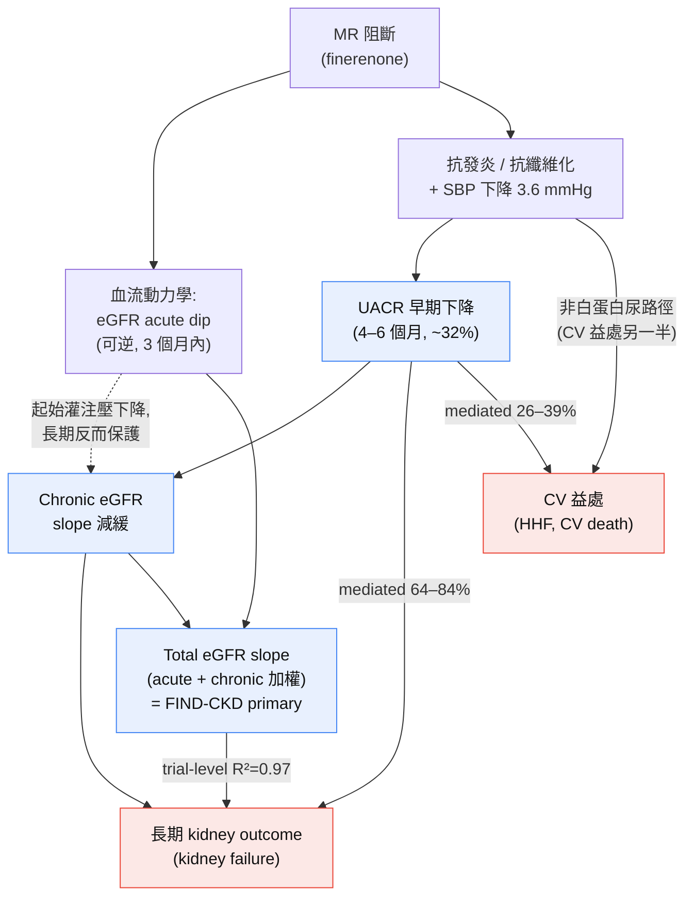

# 從白蛋白尿到硬終點:finerenone 故事中的 surrogate 邏輯

> 本文為內分泌科醫師撰寫的深度文獻回顧。假設讀者已熟悉 FIDELIO-DKD、FIGARO-DKD、FIDELITY、FIND-CKD 的名稱與 finerenone 的基本心腎益處。重點放在「白蛋白尿降幅」與「eGFR slope」在證據鏈中扮演的角色——它們究竟是 companion biomarker,還是 mechanism-linked surrogate?
>
> **引用標記**:📄 = 本地全文可稽核;📌 = 僅取得 abstract(其數字為結構化摘要內容,已逐字轉錄但無全文交叉驗證)。每個事實句末的 `[檔名]` 供 grep 稽核。

---

## 1. 核心臨床問題:UACR 是陪襯,還是替代?

finerenone 的三期試驗全部以「白蛋白尿」作為納入條件,並在治療 4 個月內即產生穩定的 UACR 下降——FIDELITY 匯總分析中,finerenone 使第 4 個月 UACR 相對 placebo 下降約 32%(least-squares mean 比值 0.68,95% CI 0.66–0.70),且此效應在試驗期間持續維持 [📄 albuminuria_mediation_Agarwal_2022]。問題在於:這個早期 UACR 訊號,對長期硬終點(kidney failure、eGFR 持續下降、CV death/HHF)究竟只是「同時發生的伴隨變化」,還是「效應必經之路」?

這個問題在 2026 年後變得更迫切,因為監管與試驗設計已把答案「內建」進終點選擇:FIND-CKD 首度把 **total eGFR slope** 設為 primary endpoint,在非糖尿病 CKD 族群中以 surrogate 為主要療效判準 [📄 FIND-CKD_NEJMoa2604625]。對內分泌科醫師而言,這代表未來的適應症擴張,將愈來愈少用「硬終點事件計數」拍板,愈來愈多用「biomarker 軌跡」。要判斷哪些擴張值得提前採用、哪些須保留 methodological humility,就必須先懂 surrogate validation 的邏輯。

---

## 2. 精煉背景回顧(既有試驗)

### 2.1 ARTS-DN:UACR 的 dose-dependent 訊號

finerenone 的「白蛋白尿降幅」從第二期就是主結局。ARTS-DN(N=823 隨機、821 接受藥物)以「第 90 天 UACR / 基線 UACR 比值」為 primary outcome,呈現清楚的劑量相依降幅 [📄 arts_dn_dosefinding_Bakris_2015]:placebo-corrected UACR 比值在 7.5 mg 為 0.79(90% CI 0.68–0.91)、10 mg 為 0.76(0.65–0.88)、15 mg 為 0.67(0.58–0.77)、20 mg 為 0.62(0.54–0.72)[📄 arts_dn_dosefinding_Bakris_2015]。值得注意:在 90 天內,eGFR 下降 ≥30% 的比例與不良事件在各組間無顯著差異 [📄 arts_dn_dosefinding_Bakris_2015]。ARTS-DN 因此把「UACR 降幅」確立為 finerenone 劑量選擇的橋樑——但它是 biomarker 試驗,無法回答硬終點問題 [📄 arts_dn_dosefinding_Ruilope_2014]。

### 2.2 FIDELIO / FIGARO / FIDELITY:硬終點確立

- **FIDELIO-DKD**(偏 stage 3–4、severely increased albuminuria):primary composite(kidney failure、eGFR 持續下降 ≥40%、renal death)HR 0.82(95% CI 0.73–0.93;P=0.001)[📄 FIDELIO-DKD_NEJMoa2025845]。
- **FIGARO-DKD**(較早期、moderately increased albuminuria 為主):primary CV composite HR 0.87(95% CI 0.76–0.98;P=0.03),主要由 HHF 驅動(HR 0.71,95% CI 0.56–0.90)[📄 FIGARO-DKD_NEJMoa2110956]。
- **FIDELITY**(N=13,026 匯總):CV composite HR 0.86(95% CI 0.78–0.95;P=0.0018);以 ≥57% eGFR 下降為主的 kidney composite HR 0.77(95% CI 0.67–0.88;P=0.0002),其中 ≥57% eGFR 下降此單一成分風險降 30%(HR 0.70,0.60–0.83)[📄 albuminuria_mediation_Agarwal_2022]。

這些是 **guideline-routine** 等級的硬終點證據。以下才是本文的重點——把「知道試驗名稱」升級成「懂 endpoint logic」的深度內容。

---

## 3. 方法學支柱:兩個 surrogate 如何被「資格化」

### 3.1 白蛋白尿作為 surrogate:三條互補證據線

Surrogate validation 不能只靠生物合理性,還需要(a)observational 層級的個體關聯、(b)trial 層級的「治療效應對治療效應」關聯、(c)一致性與門檻 [📄 editorial_endpoints_Matyjek_2026]。白蛋白尿三者兼備:

1. **Observational(個體層級)**:CKD-PC 的 693,816 人分析顯示,2 年內 UACR 下降 30% 對應後續 ESKD 的校正 HR 0.83(95% CI 0.74–0.94),校正 regression dilution 後強化為 0.78(0.66–0.92);關聯在較高 ACR 者更強 [📄 egfr_slope_surrogate_Coresh_2019]。
2. **Trial 層級(舊)**:Heerspink 2019 的 41 個治療比較(29,979 人)顯示,治療使 UACR 幾何平均下降 30% 對應 clinical endpoint 風險平均降 27%(95% BCI 5–45%),但整體 median R²=0.47(0.02–0.96,屬「弱」);限制在基線 ACR >30 mg/g 者後 R² 升至 0.72(0.05–0.99)[📄 editorial_endpoints_Heerspink_2019]。
3. **Trial 層級(新,CKD Clinical Trials Consortium)**:48 個 RCT、85,681 人的 IPD 分析顯示,每 30% UACR 降幅對應 clinical endpoint 風險平均降 19%(95% BCI 5–30%),median R²=0.66(0.06–0.98);且此關聯不因 CKD 病因而明顯異動 [📌 r2_Heerspink_2025]。同一分析被 editorial 進一步拆解:效應被 UACR 解釋的比例隨藥物類別而異——RAASi/ETA 這類「靠 albuminuria pathway」的藥物可解釋 82%,而 SGLT2i 僅 45%、免疫抑制劑僅 41%,顯示 UACR 主要適用於**白蛋白尿族群**與**經白蛋白尿路徑作用的介入** [📄 editorial_endpoints_Matyjek_2026]。

> **教育重點**:白蛋白尿作為 surrogate 的效力**依藥物機轉而定**。finerenone 屬 ns-MRA,理論上部分經 albuminuria pathway,但——如第 4 節所示——mediation 只有一部分,提示還有其他機轉。

### 3.2 eGFR slope:為何監管接受 total slope?

eGFR slope 是 CKD 領域「first-in-class」的已驗證 surrogate,FDA 與 EMA 均已接受其作為 CKD 試驗的 primary endpoint [📄 egfr_slope_surrogate_Taylor_2025]。其 trial-level 證據極強:

- **Inker 2019**(47 RCT、60,620 人):治療對 3 年 total slope 的效應與對 clinical endpoint 的效應,median R²=0.97(95% BCI 0.78–1.00);chronic slope R²=0.96 [📄 egfr_slope_surrogate_Inker_2019]。
- **Inker 2023**(66 studies、186,312 人):total slope R²=0.97(95% BCI 0.82–1.00),而 **chronic slope 僅 R²=0.55(0.25–0.77)**;無跨病因異質性,結論明確支持 total slope 作 primary endpoint [📄 egfr_slope_surrogate_Inker_2023]。

關鍵在於 **total slope vs chronic slope 的差異**,這正是 acute dip 的核心議題。

### 3.3 Acute dip vs chronic slope:total slope 為何勝出

RAAS 阻斷(以及 finerenone)在起始 3 個月常造成 **急性、血流動力學性、可逆的 eGFR 下降(acute dip)**。Holtkamp 2011 的 RENAAL post-hoc 是經典證據:losartan 組 3 個月急性 eGFR 下降大於 placebo(−2.3 vs −1.6 ml/min/1.73 m²,P=0.031),但其後長期 slope 反而較緩(−4.2 vs −5.0 ml/min/1.73 m²/年,P<0.001);急性下降愈大者,長期下降愈慢 [📄 r2_Holtkamp_2011]。

問題:若只用 **chronic slope**(忽略 acute dip),會低估某些藥物的真實益處;若只用 **acute-inclusive total slope**,則急性血流動力學效應會「灌水」。Greene 2025 用 66 studies 的多變量 Bayesian meta-regression 一次拆解兩者,發現 acute 與 chronic slope **各自獨立**預測 clinical endpoint(joint R²=0.95,0.79–1.00):固定 chronic slope 下,每多 1 ml/min/1.73 m²/3 個月的急性下降,clinical endpoint 的 HR 上升 11.4%(7.9–15.0%);而 acute 對 chronic 的最佳權重比為 0.078(0.055–0.105),恰與「3 個月 / 33 個月 = 0.09」的 3-year total slope 定義吻合 [📄 egfr_slope_surrogate_Greene_2025]。**這就是監管接受 3-year total slope 作 primary endpoint 的方法學根據**——它以正確權重同時納入 acute 與 chronic 成分。

NKF-FDA-EMA workshop 進一步定調:UACR 下降 30% 或 eGFR slope 減緩 0.5–1.0 ml/min/1.73 m²/年,均與較低的硬終點風險一致相關,但對 GFR slope 的支持強於 albuminuria,且實施時須排除藥物急性效應的干擾 [📄 egfr_slope_surrogate_Levey_2020]。

---

## 4. 深度新見解:finerenone 的 mediation 與 slope 資料

### 4.1 Finerenone-induced albuminuria reduction 的 mediation 分析(核心)

Agarwal 2023 對 FIDELIO+FIGARO(N=12,512)做 post-hoc mediation:以「基線→第 4 個月 log UACR 變化」為 mediator,追蹤約 4 年的 kidney 與 CV composite [📌 albuminuria_mediation_Agarwal_2023]。

> ⚠️ 本篇僅取得結構化 abstract(全文封閉取用),以下數字為 abstract 逐字轉錄、無全文交叉驗證,解讀請保留餘裕。

- 基線 median UACR 514 mg/g;**≥30% UACR 降幅**在 finerenone 組 3338 人(53.2%)vs placebo 1684 人(27.0%)[📌 albuminuria_mediation_Agarwal_2023]。
- UACR(連續變項)mediated **kidney outcome 效應的 84%**、**CV outcome 效應的 37%**;若改以「是否達 ≥30% 門檻」的二元變項,則分別為 **64%** 與 **26%** [📌 albuminuria_mediation_Agarwal_2023]。

**解讀**:早期 UACR 下降解釋了 kidney 益處的**絕大部分**(84%),但只解釋 CV 益處的**一小部分**(26–37%)。這與 3.1 節「UACR 是 albuminuric-CKD 與 albuminuria-pathway 介入的合理 surrogate」完全吻合——finerenone 的 renal protection 高度經白蛋白尿路徑,但其 CV 益處(尤其 HHF)另有他途。

### 4.2 補上 SBP:CV 益處的另一半

Agarwal 2026 對 FIDELITY(N=12,143)做 causal mediation,同時放入 UACR、SBP、體重、血鉀四個 mediator [📌 albuminuria_mediation_Agarwal_2026]。第 4 個月 finerenone 使 UACR 降 32.2%、SBP 降 3.6 mmHg、體重降 0.23 kg、血鉀升 0.19 mEq/L;但只有 **UACR(mediated 39%,95% CI 7–71)與 SBP(21%,3–40)**顯著 mediated CV outcome,體重與血鉀則否;UACR+SBP **合計 mediated CV 益處的 50%(95% CI 21–100)**[📌 albuminuria_mediation_Agarwal_2026]。這解釋了為何單看 UACR 只能捕捉約三分之一的 CV 益處——另一個可觀測 mediator 是 SBP,而兩者相加後仍有約一半 CV 益處來自「未被這些 biomarker 捕捉」的機轉。

### 4.3 跨到心衰:FINEARTS-HF 的低白蛋白尿族群

Mc Causland 2025(FINEARTS-HF,HFmrEF/HFpEF,N=5,086 有資料者)在**基線白蛋白尿很低**(median UACR 17 mg/g)的族群中做同型 mediation [📌 albuminuria_mediation_Mc_2025]。finerenone 在 3 個月使 UACR 降 26%;連續分析下,UACR 變化 mediated composite(CV death 或首次 HF 事件)的 34%(95% CI 16–132)、首次 HF 事件的 29%(14–82);以 >30% 降幅二元化則僅 mediated 15% 與 11% [📌 albuminuria_mediation_Mc_2025]。

> **臨床啟示**:即使在幾乎沒有白蛋白尿的心衰族群,早期 UACR 變化仍能中介**部分**(而非全部)finerenone 的 CV 益處——這強化了「UACR 是 mechanism-linked、但非完整」的 surrogate 定位。

### 4.4 FIND-CKD:total eGFR slope 首度作 primary endpoint,並延伸到非糖尿病 CKD

FIND-CKD(N=1,584,非糖尿病 CKD,eGFR 25–<90、UACR 200–≤3500 mg/g,均已用 RASi)以 **total eGFR slope(基線→第 32 個月,two-slope linear spline mixed model,knot 固定於第 3 個月)** 為 primary endpoint [📄 note_find_ckd_extract]。

**Primary(total slope)**:finerenone −3.34 vs placebo −4.02 ml/min/1.73 m²/年,difference 0.68(95% CI 0.32–1.05;摘要報 0.7,0.3–1.1,P<0.001)[📄 FIND-CKD_NEJMoa2604625] [📄 note_find_ckd_extract]。

**Slope 成分**(教科書級的 acute dip 示範)[📄 note_find_ckd_extract]:
- **Acute slope(基線→3 個月)**:finerenone −2.0 vs placebo −0.8 /3 個月;difference −1.2(95% CI −1.7 to −0.6)——finerenone **造成初期 eGFR dip**。
- **Chronic slope(3 個月→治療結束)**:finerenone −2.9 vs placebo −4.1 /年;difference **1.2(95% CI 0.9–1.6)**——真正的長期保護。
- 若只看 chronic slope,益處(1.2)大於 total slope 益處(0.68);total slope 因納入不利的 acute dip 而較保守——這正是 3.3 節理論的實地演示。停藥後(基線→停藥後 4 週)eGFR 變化 −8.7 vs −11.1,difference 2.4(1.2–3.5),支持 chronic 益處為結構性、acute dip 為可逆 [📄 note_find_ckd_extract]。

**次要硬終點(hierarchical)**:composite kidney–CV HR 0.77(95% CI 0.60–0.99;P=0.04);composite kidney HR 0.78(0.60–1.01);composite CV HR 0.60(0.27–1.33,事件數少)[📄 note_find_ckd_extract]。**探索性 UACR**:第 6 個月相對變化 −41.3% vs −9.1%(相對差 35.4%);≥30% UACR 降幅 56.0% vs 24.4%,OR 3.99(3.22–4.95)[📄 note_find_ckd_extract]。

> **意義**:FIND-CKD 一次做到三件事——(1)把 finerenone 益處延伸到**非糖尿病 CKD**(含 IgA nephropathy、FSGS 等);(2)在 hard composite 事件數不足以單獨定案的族群,用 **total eGFR slope** 提供 primary 級證據;(3)完整重現 acute-dip / chronic-slope 的雙相結構。這是 surrogate-based 適應症擴張的範例。

---

## 5. 建議表格與圖

### 表 1. 三個候選/確立終點的層級與角色

| 終點 | 類型 | 時間尺度 | 在 finerenone 證據中的角色 | 監管定位 |
|---|---|---|---|---|
| UACR 早期變化(≥30% 降幅) | Biomarker / 候選 surrogate | 4–6 個月 | mediator + 治療反應標記;kidney 益處主要路徑 | surrogate,限白蛋白尿族群/albuminuria-pathway 藥物 [📄 editorial_endpoints_Matyjek_2026] |
| Total eGFR slope | 已驗證 surrogate | 2–3 年 | FIND-CKD primary endpoint | FDA/EMA 接受為 primary [📄 egfr_slope_surrogate_Taylor_2025] |
| Hard kidney composite(kidney failure / ≥57% eGFR ↓ / renal death) | 硬終點 | 3–5 年 | FIDELIO/FIDELITY primary/次要 | guideline-routine [📄 albuminuria_mediation_Agarwal_2022] |

### 表 2. 腎臟/心腎效應量對照(概念性森林圖)

| 試驗(族群) | 終點 | HR 或 slope 差 | 95% CI | 稽核 |
|---|---|---|---|---|
| FIDELIO(T2D, stage 3–4) | Kidney composite(≥40%) | 0.82 | 0.73–0.93 | [📄 FIDELIO-DKD_NEJMoa2025845] |
| FIGARO(T2D, 早期) | CV composite | 0.87 | 0.76–0.98 | [📄 FIGARO-DKD_NEJMoa2110956] |
| FIDELITY(T2D 匯總) | Kidney composite(≥57%) | 0.77 | 0.67–0.88 | [📄 albuminuria_mediation_Agarwal_2022] |
| FIDELITY(T2D 匯總) | CV composite | 0.86 | 0.78–0.95 | [📄 albuminuria_mediation_Agarwal_2022] |
| FIND-CKD(非糖尿病) | Total eGFR slope 差(ml/min/1.73 m²/年) | +0.68 | 0.32–1.05 | [📄 note_find_ckd_extract] |
| FIND-CKD(非糖尿病) | Composite kidney–CV | 0.77 | 0.60–0.99 | [📄 note_find_ckd_extract] |

### 圖 1(概念). UACR responder vs non-responder 的事件軌跡

概念呈現(非本地實測曲線):在 FIDELITY,達 ≥30% UACR 早期降幅者(finerenone 組 53.2% vs placebo 27.0%)後續 kidney composite 累積發生率較低——因 UACR 變化 mediated kidney 效應達 64–84% [📌 albuminuria_mediation_Agarwal_2023]。**警示**:non-responder 不等於無效,因 CV 益處僅 26–37% 經 UACR 中介,尚有 SBP 與未知路徑 [📌 albuminuria_mediation_Agarwal_2026]。

### 圖 2. MR blockade → UACR → 長期腎終點的 surrogate pathway

*註:R²=0.97 為 Inker 2023 對 total slope 的 trial-level 關聯 [📄 egfr_slope_surrogate_Inker_2023];mediation 百分比見 §4.1–4.2(📌 abstract 來源)。*

---

## 6. Discussion:三個必須對讀的爭議

### 爭議一:白蛋白尿下降是否足以推定 long-term kidney protection?

**支持**:個體層級(Coresh 2019,ESKD HR 0.78)、trial 層級(Heerspink 2025,每 30% 降幅對應 19% 較低風險,R²=0.66)、以及 finerenone 專屬 mediation(kidney 效應 64–84% 經 UACR)三線一致 [📄 egfr_slope_surrogate_Coresh_2019] [📌 r2_Heerspink_2025] [📌 albuminuria_mediation_Agarwal_2023]。

**保留**:R² 的可信區間極寬(0.06–0.98),precision 有限;且效力**依藥物機轉而定**(RAASi 82% vs SGLT2i 45%)[📄 editorial_endpoints_Matyjek_2026]。Matyjek/Fernández-Fernández 的 editorial 明白指出:「缺乏 UACR 下降」對應「幾乎不會有臨床益處」的**陰性預測**很強,但一個正向的 UACR 反應**不能取代**長期 eGFR 監測與硬終點追蹤 [📄 editorial_endpoints_Matyjek_2026]。**臨床落地**:≥30% UACR 早期降幅可作為 albuminuric CKD 的治療反應指標,但不是停止監測的許可證。

### 爭議二:適應症擴張的終點是否「愈來愈軟」?

finerenone 的擴張版圖同時使用不同「硬度」的終點:FIND-CKD 用 total eGFR slope(已驗證 surrogate,R²=0.97),另有以 UACR 為主要終點的擴張計畫(如 finerenone 於第 1 型糖尿病的方向)。**表面上**這像是把 primary endpoint 從「事件」換成「biomarker」的軟化。

**對讀**:須區分兩種 surrogate 的成熟度。**eGFR slope 是 first-in-class、監管已接受的 surrogate**(FDA/EMA),trial-level R²≈0.97,且在 FIND-CKD 用最保守的 total slope(納入不利 acute dip)——這不是軟化,而是在硬終點事件不足的早期/非糖尿病族群取得合理證據的正當方法 [📄 egfr_slope_surrogate_Inker_2023] [📄 egfr_slope_surrogate_Taylor_2025]。**UACR 則不同**:其 surrogate 效力有條件(限白蛋白尿、限 albuminuria-pathway 藥物),R² 較低且 CI 寬 [📄 editorial_endpoints_Matyjek_2026]。因此「用 UACR」的擴張,證據等級確實低於「用 eGFR slope」的擴張——內分泌科醫師應對前者保留更多 humility,對後者(如 FIND-CKD 的非糖尿病 CKD)可較積極採用。此外,HTA/給付機構對 surrogate 的接受度普遍低於監管機構,可能造成「上市但給付受限」的落差 [📄 egfr_slope_surrogate_Taylor_2025]。

> **註(誠實揭露)**:本輪未取得第 1 型糖尿病 finerenone 試驗(FINE-ONE)的本地全文,故本文不對其具體數字作斷言;上述僅為終點方法學層級之對讀。

### 爭議三:mediation analysis 能否等同 mechanistic explanation?

**不能。** Mediation 是統計性歸因,不是因果機轉證明。三點須留意:

1. **殘餘效應**:即便 UACR+SBP 合計 mediated CV 益處 50%,仍有約一半來自未觀測路徑 [📌 albuminuria_mediation_Agarwal_2026];finerenone 的抗發炎/抗纖維化直接效應無法由這些 biomarker 完全捕捉。
2. **時間性弔詭**:Agarwal 2026 指出 CV 益處在數月內出現、**早於可測得的腎保護**,提示以「4 個月 mediator → 後續事件」的框架可能低估或錯配真實時序 [📌 albuminuria_mediation_Agarwal_2026]。
3. **不可外推**:Agarwal 2023 自陳結果「不易外推到其他藥物」[📌 albuminuria_mediation_Agarwal_2023]——finerenone 的 84% kidney mediation 不代表任何降 UACR 的藥都有等量腎保護。這與 Matyjek editorial 的藥物類別差異(SGLT2i 僅 45%)互相印證 [📄 editorial_endpoints_Matyjek_2026]。

**因此**:mediation 支持「UACR 是 finerenone 效應鏈上的重要中繼」,但不等於「finerenone 只靠降 UACR 護腎」;把 mediation % 讀成「機轉佔比」是常見的過度詮釋。

---

## 7. Take-home:從「知道試驗名稱」到「懂 endpoint logic」

1. **UACR 對 finerenone 是 mechanism-linked surrogate,但只在腎臟端接近完整**(mediated 64–84%),在 CV 端只是部分(26–39%),需與 SBP 併看 [📌 albuminuria_mediation_Agarwal_2023] [📌 albuminuria_mediation_Agarwal_2026]。
2. **Total eGFR slope 是成熟 surrogate**(R²≈0.97),FIND-CKD 用它取得非糖尿病 CKD 的 primary 級證據,屬**可較積極採納**的擴張 [📄 egfr_slope_surrogate_Inker_2023] [📄 note_find_ckd_extract]。
3. **看到 finerenone 的 acute eGFR dip 別驚慌**:FIND-CKD 中 acute −1.2、chronic +1.2 的雙相結構,與 Holtkamp/Greene 的理論一致——初期 dip 是可逆血流動力學,長期是真保護;total slope 已把兩者正確加權 [📄 r2_Holtkamp_2011] [📄 egfr_slope_surrogate_Greene_2025] [📄 note_find_ckd_extract]。
4. **判斷擴張的準則**:以 **eGFR slope** 為 primary 的擴張(FIND-CKD)證據較硬,值得提前關注;以 **UACR** 為 primary 的擴張證據較軟、且有機轉/族群條件,須保留 methodological humility。
5. **臨床操作**:≥30% 早期 UACR 降幅可作為 albuminuric CKD 的治療反應指標,但**不取代**長期 eGFR 監測 [📄 editorial_endpoints_Matyjek_2026]。

### 證據分級標示

- **Guideline-routine(硬終點已定案)**:FIDELIO/FIGARO/FIDELITY 的 kidney 與 CV composite [📄 albuminuria_mediation_Agarwal_2022]。
- **Evidence expansion / surrogate-based(較新、須留意等級)**:FIND-CKD 非糖尿病 CKD(total eGFR slope primary)[📄 note_find_ckd_extract];以及所有 UACR-based 的擴張推論。
- **Mediation-derived / abstract-only(詮釋須保留)**:Agarwal 2023、Agarwal 2026、Mc 2025——均僅取得結構化 abstract,數字未經全文交叉驗證 [📌 albuminuria_mediation_Agarwal_2023] [📌 albuminuria_mediation_Agarwal_2026] [📌 albuminuria_mediation_Mc_2025]。

---

## References(Vancouver)

1. Bakris GL, Agarwal R, Chan JC, Cooper ME, Gansevoort RT, Haller H, et al. Effect of finerenone on albuminuria in patients with diabetic nephropathy: a randomized clinical trial. JAMA. 2015;314(9):884–94. doi:10.1001/jama.2015.10081.
2. Ruilope LM, Agarwal R, Chan JC, Cooper ME, Gansevoort RT, Haller H, et al. Rationale, design, and baseline characteristics of ARTS-DN: a randomized study to assess the safety and efficacy of finerenone in patients with type 2 diabetes mellitus and a clinical diagnosis of diabetic nephropathy. Am J Nephrol. 2014;40(6):572–81. doi:10.1159/000371497.
3. Bakris GL, Agarwal R, Anker SD, Pitt B, Ruilope LM, Rossing P, et al. Effect of finerenone on chronic kidney disease outcomes in type 2 diabetes (FIDELIO-DKD). N Engl J Med. 2020;383(23):2219–29. doi:10.1056/NEJMoa2025845.
4. Pitt B, Filippatos G, Agarwal R, Anker SD, Bakris GL, Rossing P, et al. Cardiovascular events with finerenone in kidney disease and type 2 diabetes (FIGARO-DKD). N Engl J Med. 2021;385(24):2252–63. doi:10.1056/NEJMoa2110956.
5. Agarwal R, Filippatos G, Pitt B, Anker SD, Rossing P, Joseph A, et al. Cardiovascular and kidney outcomes with finerenone in patients with type 2 diabetes and chronic kidney disease: the FIDELITY pooled analysis. Eur Heart J. 2022;43(6):474–84. doi:10.1093/eurheartj/ehab777.
6. Agarwal R, Tu W, Farjat AE, Farag YMK, Toto R, Kaul S, et al. Impact of finerenone-induced albuminuria reduction on chronic kidney disease outcomes in type 2 diabetes: a mediation analysis. Ann Intern Med. 2023;176(12):1606–16. doi:10.7326/M23-1023.
7. Agarwal R, Pandey A, Solomon SD, Vaduganathan M, Zannad F. Systolic blood pressure and albuminuria reduction mediate cardiovascular benefits of finerenone in type 2 diabetes and CKD. Nephrol Dial Transplant. 2026;advance article. doi:10.1093/ndt/gfag150.
8. Mc Causland FR, Vaduganathan M, Claggett BL, Desai AS, Jhund P, Brinker MD, et al. Changes in albuminuria and the effect of finerenone on cardiovascular outcomes: insights from FINEARTS-HF (abstract #3019). Nephrol Dial Transplant. 2025;40(Suppl 3). doi:10.1093/ndt/gfaf116.0475.
9. Heerspink HJL, Neuen BL, Agarwal R, Cherney DZI, Lam CSP, Tuttle KR, et al. Finerenone in persons with chronic kidney disease without diabetes (FIND-CKD). N Engl J Med. 2026. doi:10.1056/NEJMoa2604625.
10. Heerspink HJL, Agarwal R, Bakris GL, Cherney DZI, Lam CSP, Neuen BL, et al. Design and baseline characteristics of the FIND-CKD randomized trial. (Design paper). doi:10.1093/ndt/gfae132. [本地檔:find_ckd_nondiab_Heerspink_2024]
11. Inker LA, Heerspink HJL, Tighiouart H, Levey AS, Coresh J, Gansevoort RT, et al. GFR slope as a surrogate end point for kidney disease progression in clinical trials: a meta-analysis of treatment effects of randomized controlled trials. J Am Soc Nephrol. 2019;30(9):1735–45. doi:10.1681/ASN.2019010007.
12. Inker LA, Collier W, Greene T, Miao S, Chaudhari J, Appel GB, et al. A meta-analysis of GFR slope as a surrogate endpoint for kidney failure. Nat Med. 2023;29(7):1867–76. doi:10.1038/s41591-023-02418-0.
13. Greene T, Collier W, Haaland B, Zhang C, Badve SV, Caravaca-Fontán F, et al. Clinical implications of the slope of GFR in clinical trials of CKD progression. Clin J Am Soc Nephrol. 2025;20(5):632–41. doi:10.2215/CJN.0000000662.
14. Levey AS, Gansevoort RT, Coresh J, Inker LA, Heerspink HL, Grams ME, et al. Change in albuminuria and GFR as end points for clinical trials in early stages of CKD: a scientific workshop sponsored by the National Kidney Foundation in collaboration with the US FDA and EMA. Am J Kidney Dis. 2020;75(1):84–104. doi:10.1053/j.ajkd.2019.06.009.
15. Coresh J, Heerspink HJL, Sang Y, Matsushita K, Arnlov J, Astor BC, et al. Change in albuminuria and subsequent risk of end-stage kidney disease: an individual participant-level consortium meta-analysis of observational studies. Lancet Diabetes Endocrinol. 2019;7(2):115–27. doi:10.1016/S2213-8587(18)30313-9.
16. Heerspink HJL, Greene T, Tighiouart H, Gansevoort RT, Coresh J, Chan TM, et al. Change in albuminuria as a surrogate endpoint for progression of kidney disease: a meta-analysis of treatment effects in randomised clinical trials. Lancet Diabetes Endocrinol. 2019;7(2):128–39. doi:10.1016/S2213-8587(18)30314-0.
17. Heerspink HJL, Collier WH, Chaudhari J, Miao S, Tighiouart H, Appel GB, et al. A meta-analysis of albuminuria as a surrogate endpoint for kidney failure. Nat Med. 2025. doi:10.1038/s41591-025-04057-z.
18. Matyjek A, Fernández-Fernández B. Validation of albuminuria as a surrogate endpoint in chronic kidney disease: clinical context and implications. Clin Kidney J. 2026;19(5):sfag054. doi:10.1093/ckj/sfag054.
19. Taylor RS, Heerspink HJL, Buyse M, Ciani O, Detournay B, Gallego D, et al. Use of surrogate endpoints in health technology assessment and reimbursement of treatments for the management of chronic kidney disease. eClinicalMedicine. 2025;88:103465. doi:10.1016/j.eclinm.2025.103465. [本地檔:egfr_slope_surrogate_Taylor_2025]
20. Holtkamp FA, de Zeeuw D, Thomas MC, Cooper ME, de Graeff PA, Hillege HJL, et al. An acute fall in estimated glomerular filtration rate during treatment with losartan predicts a slower decrease in long-term renal function. Kidney Int. 2011;80(3):282–7. doi:10.1038/ki.2011.79.

*(其他稽核用本地檔:egfr_slope_surrogate_Greene_2019、Collier_2023、Collier_2024、Coresh_2014、r2_Grams_2023;FIDELITY_Agarwal_2022;biomarker_Rossing_2022。)*

---

### 未取得全文而受限的預期論文(誠實揭露)

- **Ortiz A, Fernández-Fernández B.《Finerenone: kidney protection beyond type 2 diabetes》Lancet 2026;407(10546):2348–50**(brief 指定的「2026 Lancet editorial」)——本地檔 `find_ckd_nondiab_Ortiz_2026.md` 標記 status: FAILED,下載回傳為污染 PDF(不同論文),**全文與 abstract 均未取得**,故本文改以 Matyjek 2026(Clinical Kidney Journal editorial)承擔方法學/臨床對讀角色。
- **Agarwal 2023 mediation(Ann Intern Med)** —— 核心 mediation 論文,僅取得結構化 abstract(全文封閉取用),數字均標 📌 並加保留註記。
- **Agarwal 2026(NDT)、Mc Causland 2025 FINEARTS-HF(NDT abstract #3019)、Heerspink 2025 Nat Med albuminuria surrogate、FIND-CKD NEJM 主文** —— 均為 abstract-only 或付費牆;FIND-CKD 之細部數字改引本地全文擷取檔 `note_find_ckd_extract.md`。
- **FINE-ONE(第 1 型糖尿病 finerenone,UACR 終點)** —— 無本地全文,本文僅於終點方法學層級提及,未作任何具體數字斷言。
