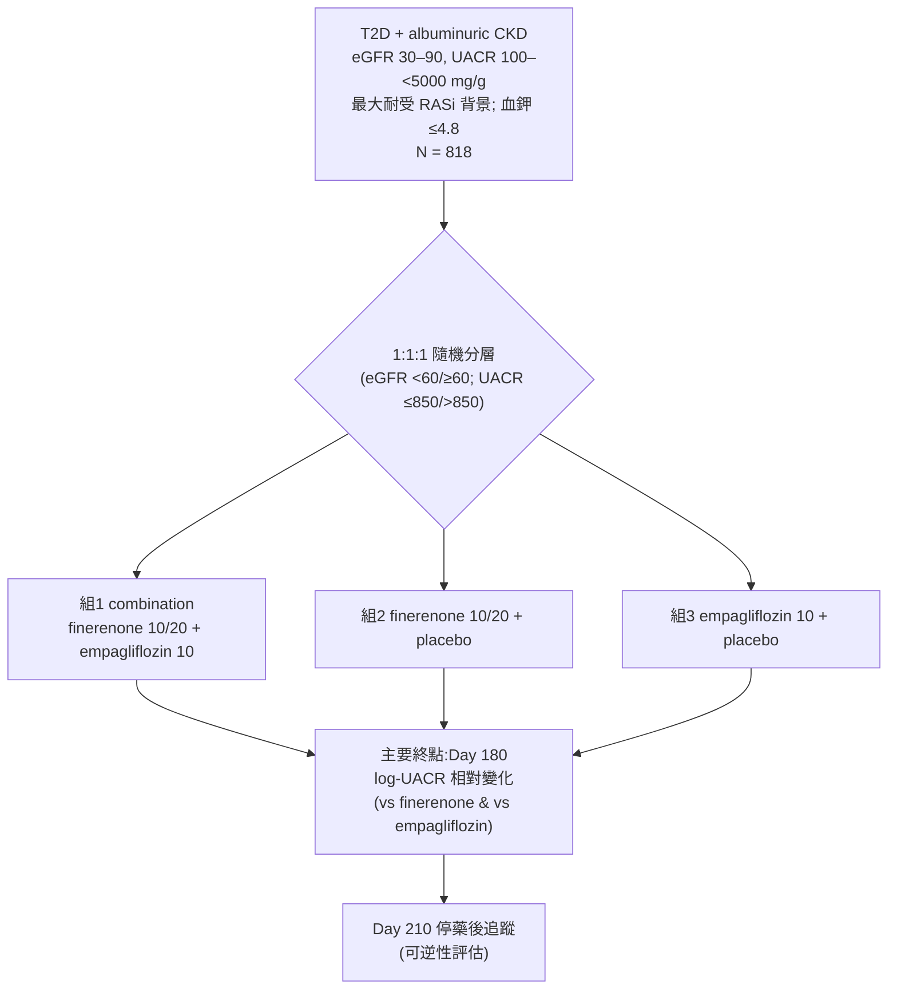
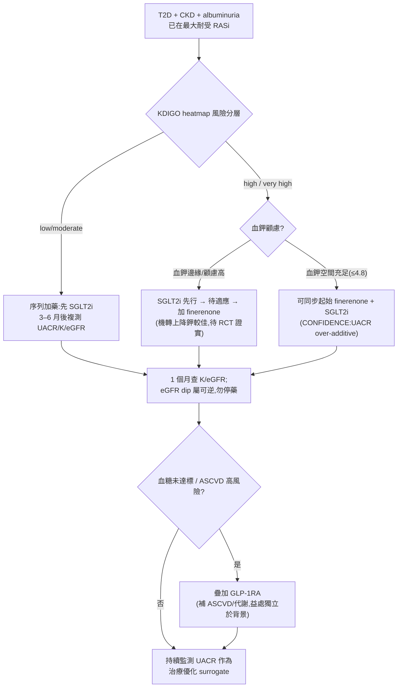

# 第四支柱還是提早聯用？——finerenone 與 SGLT2i 在心腎共病中的「序列加藥 vs 同步起始」之爭

> **給讀者的方法學說明**：本文所有事實性數字均可回溯至本地全文或 abstract。引用標記 `📄` 代表本地握有經查核之全文、`📌` 代表僅有 abstract。依稽核規則,對 `📌` 來源不做其獨有數字之具體斷言,凡涉及具體數值一律改由已握全文之次級來源(secondary paper 或 editorial)交叉引用。每一事實句末以 `[本地MD檔名]` 標註供 grep 稽核。文末並誠實標示哪些結論屬 **surrogate-based evidence expansion**、哪些已是 **guideline routine**。

---

## 1. 背景:從「四支柱」到「加藥節奏」的真問題(約 30%)

對本文讀者而言,finerenone 的基本心腎益處已無需複述。FIDELITY 匯總分析(13,026 名 T2D+CKD、全部在最大耐受 RASi 背景下)顯示心血管複合終點 HR 0.86(95% CI 0.78–0.95)、腎臟複合終點 HR 0.77(95% CI 0.67–0.88),第 4 個月 UACR 較安慰劑降低 32%,而導致永久停藥的高血鉀率僅 finerenone 1.7% vs placebo 0.6% [note_fidelity]。真正尚未解決的臨床問題不在「要不要用 finerenone」,而在 **加藥的節奏**:當 RASi 與 SGLT2i 已成標準,finerenone 究竟應「序列加上」(sequential add-on)還是「同步起始」(simultaneous initiation)?GLP-1RA 又在這個結構中補什麼?

### 1.1 指引把 nsMRA 放在哪裡——一個仍偏保守的位置

KDIGO 2024 CKD 指引將 finerenone 列為 Recommendation 3.8.1(**2A**,「suggest」):建議用於 T2D、eGFR >25 mL/min/1.73 m²、血鉀正常、且在最大耐受 RASi 下仍有 albuminuria >30 mg/g 者;Practice Point 3.8.2 進一步指出 nsMRA 可加在 RASi 加 SGLT2i 之上 [note_kdigo2024]。值得注意的是,2024 CKD 指引本身並未對 MRA 段落納入新的系統性回顧,而是把 nsMRA 的證據整體 defer 給 KDIGO 2022 糖尿病指引;其 2A(而非 SGLT2i 的 1A)強度,反映了三項被明列的證據缺口:非糖尿病 CKD 缺 RCT、與 SGLT2i 併用的資料有限、以及 eGFR 25–45 區間的血鉀安全性不確定 [note_kdigo2024]。換言之,**「finerenone 疊加在 SGLT2i 之上」這個當代最常見的臨床情境,恰恰不是 FIDELIO/FIGARO 當年的試驗脈絡**(FIDELITY 中僅 6.7% 於基線使用 SGLT2i)[note_fidelity][hyperkalemia_combo_Rossing_2022]。

**(KDIGO 2026 糖尿病與 CKD 指引更新・公開審查草案,尚未定稿)之變化**:此一保守定位在 2026 草案中出現實質翻轉,惟須強調**該文件目前僅為 2026 年 3 月公開審查草案(僅含 Chapter 1/2/4),尚未定稿、內容可能因回饋而改變**。草案 Chapter 4 將 nsMRA 由 KDIGO 2024 的 **Recommendation 3.8.1(2A/suggest)升級為 Recommendation 4.4.1(1A/recommend)**:「We recommend adding a nonsteroidal mineralocorticoid receptor antagonist (nsMRA) with proven kidney or cardiovascular benefit for people with T2D, an eGFR ≥25 ml/min per 1.73 m², normal serum potassium concentration, and albuminuria (UACR ≥30 mg/g) while on maximum tolerated dose of RAS inhibitor (1A)」[KDIGO_2026_Diabetes_CKD_draft]。Work Group 明言升級理由為「與前一版指引相比,nsMRA 的可用性與熟悉度已提高(greater availability and familiarity),多數知情的醫療人員與病人會選擇使用」[KDIGO_2026_Diabetes_CKD_draft]。此升級的證據基礎為草案為本次更新新做的統合分析(7 studies、finerenone 或 esaxerenone vs placebo、T2D+CKD):腎臟複合終點 HR 0.84(0.77–0.92)、kidney failure HR 0.84(0.71–0.99)、HF/HHF HR 0.78(0.66–0.92)為高度確定性;而 all-cause mortality RR 0.90(0.81–1.00)、CV mortality RR 0.88(0.76–1.02)、nonfatal stroke RR 1.01(0.83–1.22)、nonfatal MI RR 0.92(0.75–1.13)未達顯著;高血鉀風險顯著增加(hyperkalemia RR 2.09〔1.82–2.39〕、K≥5.5 RR 2.18〔1.98–2.40〕)[KDIGO_2026_Diabetes_CKD_draft]。草案的照護架構(Figure 19,「comprehensive strategy」)將 SGLT2i+RASi+statin 列為 **foundational pharmacotherapy**,而把 nsMRA 與 GLP-1RA 列為 **additional risk-based pharmacotherapy**[KDIGO_2026_Diabetes_CKD_draft]。此外,草案首度納入 **T1D 的 nsMRA 建議——Recommendation 4.7.1(2C,全新)**:「We suggest adding an nsMRA…for people with T1D, eGFR ≥25…normal serum potassium…and albuminuria (UACR ≥200 mg/g) while on maximum tolerated dose of RASi (2C)」[KDIGO_2026_Diabetes_CKD_draft]。

ADA/KDIGO 2022 consensus 則確立了 **layered therapy(疊層治療)** 的框架:在健康生活型態的地基上,「疊上」已證實能改善腎臟與心血管硬終點的藥物,並選加達成血糖、血壓、血脂中介目標的治療;共識明言 finerenone 與 SGLT2i、GLP-1RA 的效益「based on preclinical studies 應為 additive,但仍需臨床研究」[guideline_position_de_2022]。這句話正是本主題的核心張力:**「additive」是被假設的,而非被 head-to-head 證實的**。值得並置的是,KDIGO 2026 草案(公開審查草案,尚未定稿)已把這層「同步/序列」的選擇正式寫成敘述:除保留 layered/foundational 架構外,新增 **Practice Point 4.4.2**——「For people with T2D treated with RASi who have persistent albuminuria and normal serum potassium, an SGLT2i and nsMRA can be initiated simultaneously」,並直接引 CONFIDENCE 作為依據(合併治療 day 180 UACR 較 finerenone 單藥多降 29%〔LSM ratio 0.71;0.61–0.82〕、較 empagliflozin 多降 32%〔0.68;0.59–0.79〕)[KDIGO_2026_Diabetes_CKD_draft]。換言之,本主題核心的「同步起始」在 2026 草案中已由「被假設的 additive」推進為「(草案)明列的實務要點」——但須誠實標明:(a) 仍屬**公開審查草案**;(b) CONFIDENCE 的依據仍以 UACR 替代終點為主,尚無 hard-outcome 直接比較,草案本身亦註明「Direct head-to-head comparisons were not available to test nsMRA compared with SGLT2i on composite cardiovascular or kidney outcomes」[KDIGO_2026_Diabetes_CKD_draft]。

### 1.2 四支柱各自守哪一段——事件型態的分工

Agarwal 與 Fouque 提出「地基(生活型態)+ 四支柱」的比喻:ARB/ACEi、SGLT2i、finerenone、GLP-1RA,分別針對血流動力學、代謝、發炎/纖維化等交錯的通路 [r2_Agarwal_2023]。關鍵在於**四支柱防的事件型態並不相同**,這決定了它們是互補而非互斥:

- SGLT2i 與 finerenone 對 **心衰住院與腎臟終點** 效果最顯著;兩者皆使 HHF 風險降低約 25–35% [r2_Agarwal_2023]。
- GLP-1RA 主要補的是 **動脈粥狀硬化事件**(MI 降約 11%),對心衰**幾乎不提供保護**——這與 SGLT2i/finerenone 形成鮮明對比 [r2_Agarwal_2023]。
- Neuen 等的跨試驗 actuarial 分析清楚量化了這種分工:單獨看 HHF,SGLT2i(HR 0.64)與 nsMRA(HR 0.78)遠優於 GLP-1RA(HR 0.89);而三藥合用估計可把 HHF 降至 HR 0.45(95% CI 0.34–0.58)、CKD 進展降至 HR 0.42(95% CI 0.31–0.56)、MACE 降至 HR 0.65(95% CI 0.55–0.76)[glp1_cardiorenal_Neuen_2024]。

**表 3｜心腎四支柱的作用層次與主要事件型態對照**

| 支柱 | 主要作用機轉層次 | 代表試驗 | 最受益的事件型態 | 對血鉀 / 急性 eGFR 的影響 |
|---|---|---|---|---|
| ACEi / ARB(RASi) | 血流動力學(降球內壓、efferent 擴張) | RENAAL、IDNT | ESKD、蛋白尿、HHF | ↑血鉀;初期 eGFR dip |
| SGLT2i | 血流動力學 + 代謝(tubuloglomerular feedback、natriuresis、抗發炎) | CREDENCE、DAPA-CKD、EMPA-KIDNEY | 腎臟進展、**HHF**、CV death | **↓血鉀**(kaliuresis);初期 eGFR dip |
| finerenone(nsMRA) | 抗發炎、抗纖維化(非血流動力學為主) | FIDELIO、FIGARO、FIDELITY、FINEARTS-HF | 腎臟進展、**HHF**、CV composite | **↑血鉀**(主要驅動者);輕度 eGFR dip |
| GLP-1RA | 代謝(血糖、體重、血壓)+ 抗動脈硬化 | FLOW、LEADER、SUSTAIN-6 | **ASCVD(MI/stroke)**、腎臟(FLOW) | 血鉀影響小;eGFR dip 機轉未明 |

> 分工依據:HHF/ASCVD 分配見 [glp1_cardiorenal_Neuen_2024] 與 [r2_Agarwal_2023];SGLT2i kaliuresis 見 [hyperkalemia_combo_Wen_2026];finerenone 為血鉀主要驅動者見 [hyperkalemia_combo_Wen_2026][combination_editorial_Cheng_2025]。

這張表解釋了為何 CONFIDENCE 選擇 finerenone 加 SGLT2i(而非 finerenone 加 GLP-1RA)作為第一個「同步起始」的直接對照:兩者**在事件型態上高度重疊(腎臟、HHF)**,additive 假說最需要被檢驗;而血鉀方向相反(finerenone ↑ vs SGLT2i ↓),又衍生出「SGLT2i 能否抵消 finerenone 高血鉀」這個誘人的次假說。

---

## 2. CONFIDENCE:第一個直接檢驗「同步起始」的試驗(核心資料,約 45%)

### 2.1 三臂設計與族群

CONFIDENCE(NCT05254002)是隨機、雙盲、double-dummy、三臂平行的 **Phase 2** 試驗,把已在最大耐受 RASi 背景下的 T2D+albuminuric CKD 患者以 **1:1:1** 隨機分入:(i)finerenone(10/20 mg)+ empagliflozin(10 mg);(ii)finerenone + 安慰劑;(iii)empagliflozin + 安慰劑,治療 **180 天** [confidence_trial_Green_2023][confidence_trial_Vaduganathan_2025]。納入 eGFR 30–90 mL/min/1.73 m²、UACR ≥100 至 <5000 mg/g,隨機分層依 eGFR(<60 vs ≥60)與 UACR(≤850 vs >850)[confidence_trial_Vaduganathan_2025]。共 818 人於 14 國、143 站點於 2022/7–2024/8 隨機化 [confidence_baseline_Agarwal_2025_NDT]。

**基線特徵**(強調族群為中重度、真實世界):平均 eGFR 54.2±17.1、中位 UACR 583(IQR 292–1140)mg/g、平均 HbA1c 7.3±1.2%、平均血鉀 4.48±0.42 mmol/L;GLP-1RA 使用率 **23%**、statin **39.1%**(313/801)、ACEi/ARB 98.4% [confidence_baseline_Agarwal_2025_NDT]。(註:Vaduganathan 的 KDIGO 風險分層次分析另報「>70% 使用 statin」,係依風險層加總後的另一種計算——各層 87.5%/74.0%/72.3%——其分母與分層方式與全體基線表不同,兩數字不可互換陳述 [confidence_trial_Vaduganathan_2025]。)這是一個**已被良好治療、殘餘 albuminuria 仍高**的族群——正是加藥節奏之爭的主戰場。

**圖 4｜CONFIDENCE 三臂 trial schema**

### 2.2 主要療效:同步起始的 albuminuria 益處是「over-additive」

Day 180 時,**combination 使 UACR 自基線降約 52%**,對比 finerenone 單藥約 32%、empagliflozin 單藥約 29% [combination_editorial_Cheng_2025]。以組間比而言,combination 較 finerenone 單藥多降 **29%**(LS mean ratio 0.71;95% CI 0.61–0.82;P<0.001)、較 empagliflozin 單藥多降 **32%**(LS mean ratio 0.68;95% CI 0.59–0.79;P<0.001)[combination_editorial_Cheng_2025][combination_editorial_Georgianos_2025][confidence_trial_Vaduganathan_2025]。這個差距**在治療前 30 天內就出現**,並在停藥後(Day 180→210)雖回升但仍低於基線 [combination_editorial_Georgianos_2025]。

**跨 KDIGO 風險層的一致性(Vaduganathan 預設次分析)**:781 名有資料者中 11.3% 為 low/moderate、29.6% high、59.2% very high risk。combination 的 UACR 降幅在各層一致(low/mod −61.7%、high −60.7%、very high −52.4%),且各層皆優於任一單藥(very high 層 combination vs finerenone LS mean ratio 0.72 [0.59–0.89]、vs empagliflozin 0.75 [0.61–0.91];P_interaction >.05)[confidence_trial_Vaduganathan_2025]。達到臨床有意義(>30% UACR 下降)者在 combination 各層皆過半(low/mod 58.1%、high 74.2%、very high 70.6%)[confidence_trial_Vaduganathan_2025]。**臨床意涵**:同步起始的相對益處不因基線腎風險高低而改變,支持「不必等到極高風險才聯用」的論點。

### 2.3 機轉的解剖:急性 eGFR dip 與「非血流動力學」的加成

一個對內分泌科醫師特別重要的深層問題:combination 多出來的 albuminuria 益處,是「額外壓低球內壓(血流動力學)」還是「真正的另一條抗纖維化通路」?CONFIDENCE 的 eGFR-mediation 分析(JASN,📌 僅 abstract;以下中介百分比為其結構式摘要中可 grep 回溯之明列數字)顯示:急性 eGFR 下降在 combination 最明顯,且在基線 eGFR 較高與使用利尿劑者更顯著、可逆;更關鍵的是,**「把 empagliflozin 加到 finerenone 上」的 UACR 益處,急性 eGFR 變化僅中介其中 28%(其餘 72% 由未歸因機轉驅動);而「把 finerenone 加到 empagliflozin 上」的益處,eGFR 變化僅中介 5.2%,顯示其加成幾乎全屬非血流動力學** [confidence_egfr_mediation_Agarwal_2026]。此方向與 FIDELITY-Singh 全文一致:finerenone 對 UACR 與 eGFR slope 的益處在有無 SGLT2i / GLP-1RA 下都存在,佐證其為獨立於 SGLT2i 血流動力學之外的第二條機轉 [hyperkalemia_combo_Singh_2026]。

在急性安全面,可量化的全文數字來自 editorial 與次分析:combination 在前 30 天 **≥30% eGFR 下降** 發生率 6.3%,高於 finerenone 單藥 3.8% 與 empagliflozin 單藥 1.1%,且完全可逆 [combination_editorial_Georgianos_2025];Vaduganathan 次分析進一步顯示,這種急性 dip **主要落在 low/moderate 與 high risk 層(combination 12.1% 與 8.2%),very high risk 層反而最少(4.4%)**——因為極高風險者基線 eGFR 已低,可壓縮的「hyperfiltration 空間」較小 [confidence_trial_Vaduganathan_2025]。

**圖 5｜UACR 益處 vs 急性 eGFR dip 對照(combination 為中心)**

| 指標 | Combination | Finerenone 單藥 | Empagliflozin 單藥 |
|---|---|---|---|
| UACR 自基線變化(Day 180) | 約 −52% | 約 −32% | 約 −29% |
| >30% UACR 下降比例(very high risk 層) | 70.6% | 對照較低 | 對照較低 |
| ≥30% eGFR 下降(前 30 天,整體) | 6.3% | 3.8% | 1.1% |
| ≥30% eGFR 下降(low/mod risk 層) | 12.1% | 4.3% | 0% |
| 症狀性低血壓 | 3 人(整體) | 罕見 | 罕見 |

> UACR 全文數字 [combination_editorial_Cheng_2025];分層 [confidence_trial_Vaduganathan_2025];eGFR dip 整體率 [combination_editorial_Georgianos_2025]。**判讀重點**:eGFR dip 是血流動力學可逆現象、非腎損傷,不應觸發停藥;dip 最大者恰是基線腎功能最好、最禁得起的族群。

### 2.4 血鉀:同步起始「並沒有」抵消 finerenone 的高血鉀(關鍵反直覺結果)

臨床上最誘人的假說是「SGLT2i 的 kaliuresis 能中和 finerenone 的高血鉀」。CONFIDENCE 的高血鉀次分析(JACC,📌 僅 abstract)之**定性結論**由 Sinclair 的 editorial 全文轉述最為清楚:**隨機分入 combination 者的血鉀上升與高血鉀風險,和分入 finerenone 單藥者相似,顯示「同步起始 finerenone 與 SGLT2i 並不能防止 MRA 介導的高血鉀」** [hyperkalemia_combo_Sinclair_2026]。可量化的全文數字見 Cheng:高血鉀(K >5.5 mmol/L)在 combination 15.3% vs finerenone 單藥 18.6%——**僅為數值上略低,並非統計上被抵消** [combination_editorial_Cheng_2025]。

這個「數值略低但未消除」的落差極其重要,因為它把兩種對照拆開:

- **相對於 finerenone 單藥**:combination 高血鉀無顯著差異(Wen 統合:combination vs finerenone 單藥 OR 1.09;95% CI 0.52–2.28)[hyperkalemia_combo_Wen_2026]。
- **相對於 SGLT2i 單藥**:combination 高血鉀顯著較高(Wen:OR 3.00;95% CI 2.50–3.61;Muhammad:RR 1.91;95% CI 1.10–3.33)[hyperkalemia_combo_Wen_2026][hyperkalemia_combo_Muhammad_2025]。

**因果面**:CONFIDENCE 的 mediation 分析結論是高血鉀**不在** UACR 下降的因果路徑上——療效與是否發生高血鉀無關 [hyperkalemia_combo_Sinclair_2026]。這消除了「療效靠血鉀升高」的疑慮,但也拿掉了「SGLT2i 讓 finerenone 更安全」的短期證據。

**圖(平衡圖)｜Albuminuria 益處 vs 高血鉀負擔**

| 面向 | Combination 相對 finerenone 單藥 | Combination 相對 SGLT2i 單藥 |
|---|---|---|
| UACR 額外下降 | 多降 29%(LSMR 0.71) | 多降 32%(LSMR 0.68) |
| 高血鉀風險 | 無顯著增加(OR 1.09) | 顯著增加(OR 3.00) |
| 淨評估 | **益處明確、血鉀不惡化 → 傾向支持** | **益處在硬終點未證實、血鉀惡化 → 保留** |

> 數字:[hyperkalemia_combo_Wen_2026][combination_editorial_Cheng_2025]。這張圖是後文三大爭議之(2)的量化基礎。

---

## 3. 真實臨床的 combination logic:FIDELITY / FINEARTS-HF / FLOW 的旁證(約 15%)

CONFIDENCE 只有 180 天、只測 albuminuria。要理解「聯用在硬終點上是否 additive、以及 GLP-1RA 的角色」,需借助更長期試驗的 subgroup / post-hoc。

**FIDELITY(finerenone × SGLT2i,Rossing 2022)**:基線 SGLT2i 使用僅 877/13,026(6.7%),但 finerenone 的心血管(有 SGLT2i HR 0.67 vs 無 0.87;P_interaction 0.46)與腎臟益處(0.42 vs 0.80;P_interaction 0.29)不因 SGLT2i 而異;安全面上,基線併用 SGLT2i 者的任何高血鉀事件率(finerenone 10.3% vs placebo 2.7%)低於未併用者(14.3% vs 7.2%),暗示 SGLT2i 在**慢性(非同步)**背景下可能減少 finerenone 高血鉀 [hyperkalemia_combo_Rossing_2022]。

**FIDELITY 三藥旁證(Singh 2026)**:同時基線使用 SGLT2i+GLP-1RA 者僅 167 人(1.3%),但此組在 Month 4 的 finerenone vs placebo UACR 降幅最大(38%),Month 24 LS-mean 治療比 0.43(95% CI 0.31–0.59);SBP 降幅也以三藥組最大(−5.77 mmHg)[hyperkalemia_combo_Singh_2026]。安全面:併用 SGLT2i(含三藥)者實驗室確認 K >5.5 的比率反而較低(SGLT2i-only 7.9% vs 無 SGLT2i/GLP-1RA 17.7%),再次支持**慢性 SGLT2i 背景**的降鉀效應 [hyperkalemia_combo_Singh_2026]。

**FINEARTS-HF(HFmrEF/HFpEF,Vaduganathan 2025)**:6001 人中 13.6% 基線用 SGLT2i,finerenone 對主要終點的益處不因 SGLT2i 而異(有 SGLT2i RR 0.83 vs 無 0.85;P_interaction 0.76);1 個月時 finerenone 使血鉀上升 +0.19 mmol/L,**有無 SGLT2i 完全相同(P_interaction 1.00)**——與 CONFIDENCE 「同步起始不抵消血鉀」的結論方向一致 [hyperkalemia_combo_Vaduganathan_2025]。

**GLP-1RA 的角色(FLOW 次分析)**:在 FLOW 中,semaglutide 對主要腎臟終點的益處不因基線 SGLT2i(有 HR 1.07 vs 無 0.73;P_interaction 0.109,惟 SGLT2i 組僅 550 人、事件少)或基線 MRA(有 HR 0.51 vs 無 0.79;P_interaction 0.12)而改變 [glp1_cardiorenal_Mann_2024][glp1_cardiorenal_Rossing_2025]。這說明 **GLP-1RA 在心腎分工中「三者兼補」**:補糖代謝與體重(其本業)、補 ASCVD(MI/stroke,SGLT2i/finerenone 較弱之處),且 FLOW 已證實其**也參與腎保護**——但機轉與 SGLT2i/finerenone 不同、可疊加。Neuen 的 lifetime 模型即據此估計:一名 50 歲患者三藥合用相較傳統照護,可多獲 CKD 進展 free survival **5.5 年**(95% CI 4.0–6.7)、MACE free survival 3.2 年;即使保守假設只有 50% additivity,CKD 進展仍多 4.5 年 [glp1_cardiorenal_Neuen_2024]。

> **證據層級誠實標示**:上述 subgroup/post-hoc 皆為**探索性、非為交互作用而 power**,且 FIDELITY 的 SGLT2i/GLP-1RA 使用者基線腎功能較好(confounding by indication),CONFIDENCE 的隨機化才是唯一無此偏誤的設計 [hyperkalemia_combo_Rossing_2022][hyperkalemia_combo_Sinclair_2026]。此偏誤在新補之 FIDELITY 全文的基線表中可被具體量化:基線使用 SGLT2i 者相較未使用者,平均 eGFR 較高(66.3 ± 21.1 vs 57.0 ± 21.6 mL/min/1.73 m²)、中位 UACR 較低(448 vs 521 mg/g),且 GLP-1RA 使用率高出約三倍(19.0% vs 6.4%)——這正是 with-SGLT2i 亞組安慰劑事件率偏低、須以 P_interaction 而非組間點估計解讀的原因 📄[sglt2i_subgroup_FIDELITY_Rossing_2022]。

---

## 4. Discussion:三大爭議與對讀(善用 editorial)

### 爭議(1):主終點是 UACR,不是 hard renal outcome

**正方(Georgianos / Cheng)**:一個為偵測硬腎終點(kidney failure、doubling creatinine、renal death)差異而 power 的 Phase 3 試驗,估計需隨機化**約 41,000 人**,可預見的未來不會有這種 outcome trial [combination_editorial_Georgianos_2025]。而早期 albuminuria 下降是 SGLT2i 與 finerenone 長期硬腎益處的主要 mediator:2019 年 41 試驗、29,979 人的 patient-level 統合顯示,前 6 個月 **≥30% albuminuria 下降對應長期複合腎終點風險降 27%**(HR 0.73;95% CI 0.67–0.81),在高基線 albuminuria 者更強 [combination_editorial_Georgianos_2025]。CONFIDENCE 過半數受試者在各風險層達到此門檻 [confidence_trial_Vaduganathan_2025]。Georgianos 因此下結論:「改變日常臨床實務的時機就是現在」[combination_editorial_Georgianos_2025];Cheng 則把它整合進「pillar risk-based」框架,主張以 KDIGO heatmap 導引、對高風險者同步或快速序列起始,以打破 therapeutic inertia [combination_editorial_Cheng_2025]。

**保留方**:UACR 終究是 surrogate。Wen 統合明確指出,相較 **SGLT2i 單藥**,combination 在 mortality、MACE、MAKE 上**均無顯著額外益處**(分別 OR 0.73、0.77、0.87,皆不顯著),硬終點的 additivity 仍未被證實;且 CONFIDENCE 僅 180 天,長期硬終點屬 under-ascertained [hyperkalemia_combo_Wen_2026]。Trial sequential analysis 顯示 mortality/MACE/MAKE 的累積 Z 曲線尚未越過 monitoring boundary,**仍需足夠 power 的 RCT** [hyperkalemia_combo_Wen_2026]。

### 爭議(2):SGLT2i 未能在短期顯著抵消 finerenone 的高血鉀

這是本主題最重要、也最常被行銷話術過度簡化的一點。**CONFIDENCE 的隨機化證據明白顯示:同步起始並未減少 finerenone 介導的高血鉀**——Sinclair 與 Edmonston 的 editorial 全文定性轉述為「隨機分入 combination 者的血鉀上升與高血鉀風險,與分入 finerenone 單藥者相似」,亦即同步加上 SGLT2i 並未防止 MRA 介導的高血鉀 [hyperkalemia_combo_Sinclair_2026]。(按全文既定政策,CONFIDENCE 高血鉀次分析屬 📌 abstract-only [confidence_trial_Agarwal_2026],其血鉀變化與高血鉀 odds 之具體 P 值不在此直接斷言,僅採 editorial 之定性方向。)Sinclair 與 Edmonston 的 editorial 提出關鍵的**時序假說**來調和 CONFIDENCE 與觀察性/慢性資料的矛盾:在 FIVE-STAR 次分析中,對**已慢性使用 SGLT2i** 者再加 finerenone,血鉀僅升 0.13 mEq/L,遠低於未用 SGLT2i 者的 0.37 mEq/L(P_interaction 0.02)[hyperkalemia_combo_Sinclair_2026]。其機轉推測為 SGLT2i 需時間誘導遠端小管鉀處理的適應(preclinical 中 dapagliflozin 保留近端 Kcnk1 表現),**同步起始時 finerenone 的升鉀在 SGLT2i 尚未「適應」前就發生,故無法被抵消**;而序列(SGLT2i 先行)則讓適應先建立 [hyperkalemia_combo_Sinclair_2026]。Sinclair 因此呼籲一個直接的三臂 sequencing RCT(finerenone-first / 同步 / SGLT2i-first),以血鉀變化為主要終點 [hyperkalemia_combo_Sinclair_2026]。

**臨床啟示**:若醫師的首要顧慮是血鉀,「SGLT2i 先行、finerenone 後加」在機轉上可能比「同步起始」更安全——這恰好與純粹追求 albuminuria 最大快速下降的「同步」策略形成張力。但需誠實指出:此時序假說目前仍屬 **hypothesis-generating**,FIVE-STAR 為非隨機的 SGLT2i 使用、存在 confounding by indication [hyperkalemia_combo_Sinclair_2026]。

### 爭議(3):費用、複方負擔與依從性

Cheng 的 narrative review 直言 pillar risk-based approach 的兩大代價:**更高的費用、以及同時起始多藥導致的同時副作用與 pill burden** [combination_editorial_Cheng_2025]。Agarwal 與 Fouque 也點出「築牆(疊加支柱)容易,但成本從第一到第四支柱遞增」,且 access(美國多數保險仍需 prior authorization)、adherence 與 education 才是實踐的真正瓶頸 [r2_Agarwal_2023]。CONFIDENCE 為短期、嚴格納入的 Phase 2,其 generalizability 受限於 stringent inclusion/exclusion,對更廣、更低風險族群的成本效益仍未知 [confidence_trial_Vaduganathan_2025]。從實作角度,借鏡 HFrEF 的 GDMT 經驗(低劑量、多藥、快速序列,如 STRONG-HF)或許比「一次全開」更務實 [combination_editorial_Cheng_2025]。

---

## 5. Take-home messages

1. **最強訊息不是「所有人都該同步三藥起始」**,而是:finerenone 應被視為與 SGLT2i **互補、而非互斥** 的 cardiorenal pillar——兩者事件型態重疊(腎、HHF)卻機轉相異(finerenone 的加成主要是**非血流動力學**),CONFIDENCE 已在 surrogate 層面證實其 albuminuria 益處 over-additive 且跨風險層一致 [confidence_trial_Vaduganathan_2025][confidence_egfr_mediation_Agarwal_2026]。

2. **「同步起始」正處於一個關鍵的時態轉折點**。在**已定稿**的指引層級,它仍是 surrogate-based 的 evidence expansion:KDIGO 2024 仍給 finerenone **2A**、情境為「加在 RASi±SGLT2i 之上」[note_kdigo2024][hyperkalemia_combo_Wen_2026]。但在**尚未定稿的 KDIGO 2026 公開審查草案**中,情勢已改變——nsMRA 升級為 **Recommendation 4.4.1(1A)**,且新增 **Practice Point 4.4.2** 明確表示「SGLT2i 與 nsMRA 可同步起始(依 CONFIDENCE)」;這實質上把「同步起始」從「證據擴張」推進為「(草案)指引已納入的實務要點」[KDIGO_2026_Diabetes_CKD_draft]。務必誠實標明兩點:(a) 該文件**仍是公開審查草案(2026 年 3 月,僅 Chapter 1/2/4),尚未定稿、可能因回饋而改變**;(b) CONFIDENCE 仍以 **UACR 替代終點**為主、無 hard-outcome 直接比較,故「同步起始成為普遍標準」的長期硬終點確認仍屬未竟 [KDIGO_2026_Diabetes_CKD_draft][hyperkalemia_combo_Wen_2026]。

3. **血鉀策略應與加藥節奏綁在一起思考**:同步起始不會抵消 finerenone 高血鉀(隨機證據);若以血鉀安全為優先,「SGLT2i 先行、finerenone 後加」在機轉上可能更佳,但此時序假說待專門 RCT 驗證 [hyperkalemia_combo_Sinclair_2026]。

4. **GLP-1RA 的分工是「三者兼補」**:補糖代謝/體重、補 ASCVD、也參與腎保護(FLOW),且益處不因 SGLT2i/MRA 背景而異——支持其作為第四支柱疊加,而非取代 SGLT2i/finerenone 的腎/HHF 角色 [glp1_cardiorenal_Mann_2024][glp1_cardiorenal_Rossing_2025][glp1_cardiorenal_Neuen_2024]。

**Mermaid｜cardiorenal 四支柱的「同步 vs 序列」決策流程**

> **證據性質標示**:綠色路徑中「同步起始壓 UACR」為 **RCT surrogate 證實**(CONFIDENCE);「SGLT2i 先行以降鉀」為 **hypothesis-generating**(Sinclair/FIVE-STAR);三藥硬終點益處為 **模型與 subgroup 外推**(Neuen/Singh),尚待 outcome trial。加 finerenone 於 RASi±SGLT2i 之上、以 UACR 導引優化,則已是 **guideline routine**(KDIGO 2024〔2A〕/ ADA-KDIGO 2022 consensus 之 layered therapy)[note_kdigo2024][guideline_position_de_2022]。**須補注時態變化**:在 **KDIGO 2026 公開審查草案(尚未定稿)** 中,此加藥不僅為 routine,更升級為 **Recommendation 4.4.1(1A)**;而流程中「同步起始 finerenone + SGLT2i」亦已由該草案的 **Practice Point 4.4.2** 正式納為可選實務要點(依 CONFIDENCE 之 UACR 證據),惟仍待定稿與 hard-outcome 佐證 [KDIGO_2026_Diabetes_CKD_draft]。

---

## References(Vancouver 風格,含 DOI)

1. Agarwal R, Green JB, Heerspink HJL, et al. Finerenone with empagliflozin in chronic kidney disease and type 2 diabetes (CONFIDENCE). N Engl J Med. 2025;393(6):533–543. doi:10.1056/NEJMoa2410659. 📌 *(本地僅 abstract)*
2. Green JB, Mottl AK, Bakris G, et al. Design of the COmbinatioN effect of FInerenone anD EmpaglifloziN in participants with chronic kidney disease and type 2 diabetes using a UACR Endpoint study (CONFIDENCE). Nephrol Dial Transplant. 2023;38(4):894–903. doi:10.1093/ndt/gfac198. 📄
3. Agarwal R, Green JB, Heerspink HJL, et al. CONFIDENCE trial: baseline clinical characteristics. Nephrol Dial Transplant. 2025;40(8):1559–1569. doi:10.1093/ndt/gfaf022. 📄
4. Vaduganathan M, Green JB, Heerspink HJL, et al. Simultaneous initiation of finerenone and empagliflozin across the spectrum of kidney risk in the CONFIDENCE trial. Nephrol Dial Transplant. 2026;41(1):161–170. doi:10.1093/ndt/gfaf160. 📄
5. Agarwal R, Correa-Rotter R, Navaneethan SD, et al. Acute eGFR changes and their mediation of albuminuria reduction with empagliflozin and finerenone (CONFIDENCE). J Am Soc Nephrol. 2026. doi:10.1681/ASN.0000001071. 📌 *(本地僅 abstract)*
6. Agarwal R, Green JB, Heerspink HJL, et al. Risk of hyperkalemia with empagliflozin, finerenone, or both: secondary analysis of the CONFIDENCE randomized trial. J Am Coll Cardiol. 2026;87(7):772–784. doi:10.1016/j.jacc.2025.10.049. 📌 *(本地僅 abstract)*
7. Rossing P, Anker SD, Filippatos G, et al. Finerenone in patients with chronic kidney disease and type 2 diabetes by SGLT2 inhibitor treatment: the FIDELITY analysis. Diabetes Care. 2022;45(12):2991–2998. doi:10.2337/dc22-0294. 📄
8. Agarwal R, Filippatos G, Pitt B, et al. Cardiovascular and kidney outcomes with finerenone in patients with type 2 diabetes and chronic kidney disease: the FIDELITY pooled analysis. Eur Heart J. 2022;43(6):474–484. doi:10.1093/eurheartj/ehab777. 📄
9. Singh AK, Anker SD, Pitt B, et al. A FIDELITY analysis on finerenone with SGLT-2i and GLP-1RA in CKD. Kidney Int Rep. 2026. doi:10.1016/j.ekir.2025.10.032. 📄
10. Vaduganathan M, Claggett BL, Kulac IJ, et al. Effects of the nonsteroidal MRA finerenone with and without concomitant SGLT2 inhibitor use in heart failure (FINEARTS-HF). Circulation. 2025;151(2):149–158. doi:10.1161/CIRCULATIONAHA.124.072055. 📄
11. Wen CF, Chuang MH, Wu VC, Chen JY. Efficacy of combined SGLT2 inhibitors and finerenone in chronic kidney disease: a systematic review and meta-analysis. Front Pharmacol. 2026;17:1803971. doi:10.3389/fphar.2026.1803971. 📄
12. Daniyal SM, Ajaz H, Riaz M, Khatoon NM, Aftab Z, Gondal HT, et al. Combination therapy with mineralocorticoid receptor antagonists and SGLT2 inhibitors versus SGLT2 inhibitor monotherapy in chronic kidney disease: an updated meta-analysis of randomized controlled trials. BMC Nephrol. 2025;27:69. doi:10.1186/s12882-025-04710-2. 📄
13. Sinclair MR, Edmonston D. It's about time: potassium risk with combination guideline-directed medical therapy. Kidney Int Rep. 2026;11:106609. doi:10.1016/j.ekir.2026.106609. 📄
14. Georgianos PI, Koufakis T, Arampatzis S, Liakopoulos V. CONFIDENCE in the safety and efficacy of dual therapy with an SGLT-2 inhibitor and finerenone in patients with chronic kidney disease and type 2 diabetes. Diabetes Obes Metab. 2025;27(11):6097–6100. doi:10.1111/dom.70026. 📄
15. Cheng AYY, Mottl A, Magwire M. Pillar risk-based treatment for chronic kidney disease in people with type 2 diabetes: a narrative review. Diabetes Ther. 2025;16(11):2083–2099. doi:10.1007/s13300-025-01796-7. 📄
16. Agarwal R, Fouque D. The foundation and the four pillars of treatment for cardiorenal protection in people with chronic kidney disease and type 2 diabetes. Nephrol Dial Transplant. 2023;38(2):253–257. doi:10.1093/ndt/gfac331. 📄
17. Neuen BL, Heerspink HJL, Vart P, et al. Estimated lifetime cardiovascular, kidney, and mortality benefits of combination treatment with SGLT2 inhibitors, GLP-1 receptor agonists, and nonsteroidal MRA compared with conventional care in patients with type 2 diabetes and albuminuria. Circulation. 2024;149(6):450–462. doi:10.1161/CIRCULATIONAHA.123.067584. 📄
18. Mann JFE, Rossing P, Bakris G, et al. Effects of semaglutide with and without concomitant SGLT2 inhibitor use in participants with type 2 diabetes and chronic kidney disease in the FLOW trial. Nat Med. 2024;30(10):2849–2856. doi:10.1038/s41591-024-03133-0. 📄
19. Rossing P, Bakris G, Perkovic V, et al. Effects of semaglutide with or without concomitant mineralocorticoid receptor antagonist use in participants with type 2 diabetes and chronic kidney disease: a FLOW trial prespecified secondary analysis. Diabetes Care. 2025. doi:10.2337/dc25-0472. 📄
20. Kidney Disease: Improving Global Outcomes (KDIGO) CKD Work Group. KDIGO 2024 Clinical Practice Guideline for the Evaluation and Management of Chronic Kidney Disease. Kidney Int. 2024;105(4S):S117–S314. doi:10.1016/j.kint.2023.10.018. 📄
21. de Boer IH, Khunti K, Sadusky T, et al. Diabetes management in chronic kidney disease: a consensus report by the American Diabetes Association (ADA) and Kidney Disease: Improving Global Outcomes (KDIGO). Kidney Int. 2022;102(5):974–989. doi:10.1016/j.kint.2022.08.012. 📄
22. Kidney Disease: Improving Global Outcomes (KDIGO) Diabetes Work Group. KDIGO 2026 Clinical Practice Guideline for Diabetes and Chronic Kidney Disease — Chapter 1/2/4 Update. **Public Review Draft, March 2026(公開審查草案,尚未定稿,內容可能因回饋而改變)**. [本主題引用之 Recommendation 4.4.1(T2D,1A)、Practice Point 4.4.2(SGLT2i+nsMRA 可同步起始)、Practice Point 4.4.3/4.4.4/4.4.7、Recommendation 4.7.1(T1D,2C)、nsMRA vs placebo 統合分析與 Figure 19 架構均出自本草案 Chapter 4] 📄 *(本地握有全文:KDIGO_2026_Diabetes_CKD_draft.md)*

---

*本文為 medical-literature-review 流程之 drafter 產出。硬規則遵循:LLM 僅組織與改寫,所有作者/年份/DOI/數字/HR/OR/樣本數均可回溯至上列本地來源。凡 📌(僅 abstract)之三篇 CONFIDENCE 次分析(NEJM 主文、JASN eGFR-mediation、JACC 高血鉀),其具體數值一律改由已握全文之 editorial 或次級論文交叉引用陳述,未對 abstract 專有數字直接斷言。*
