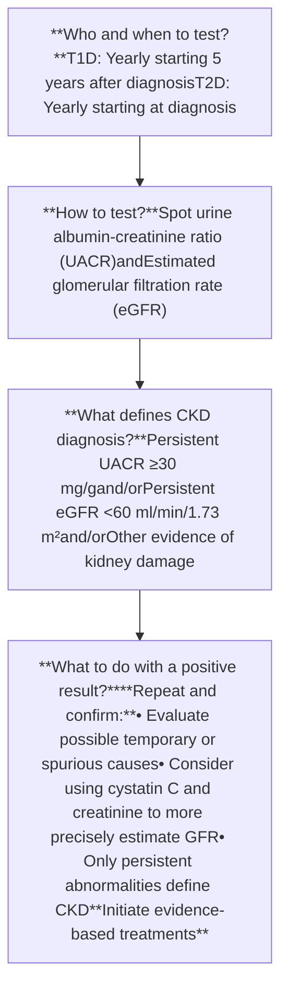
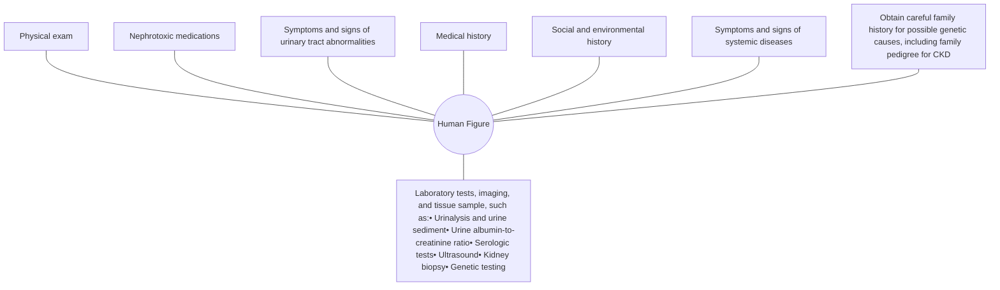
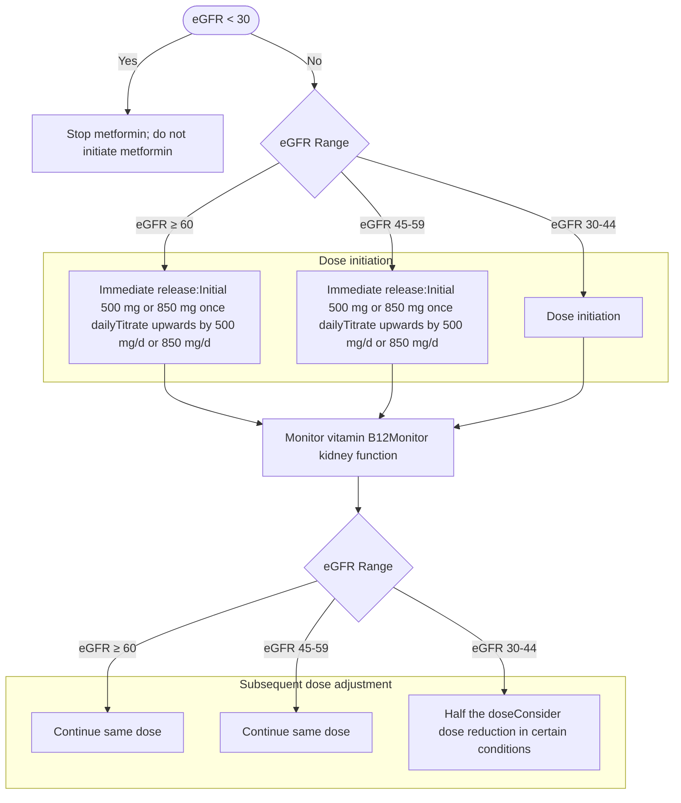
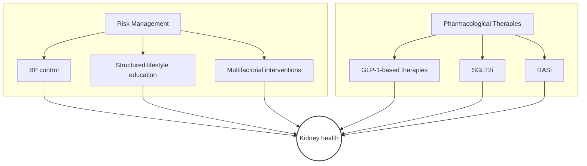
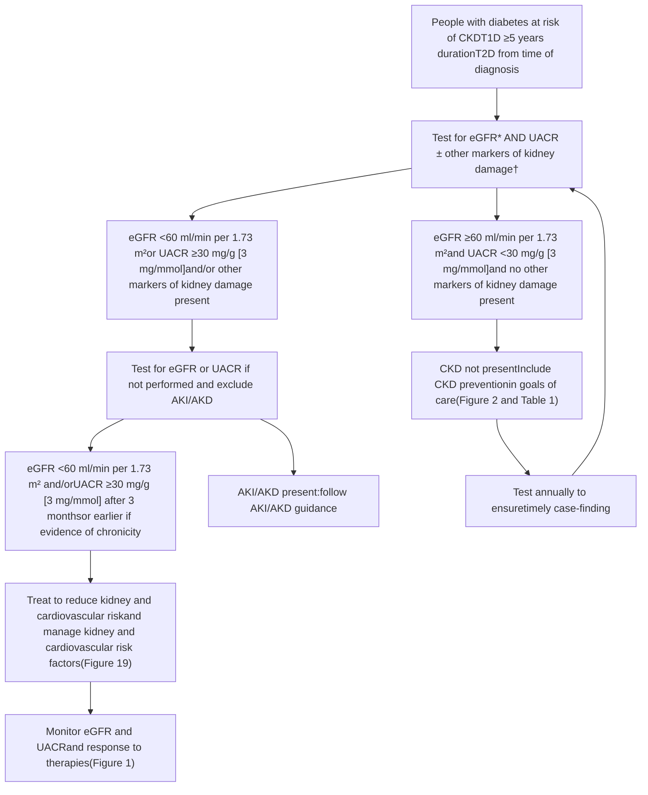
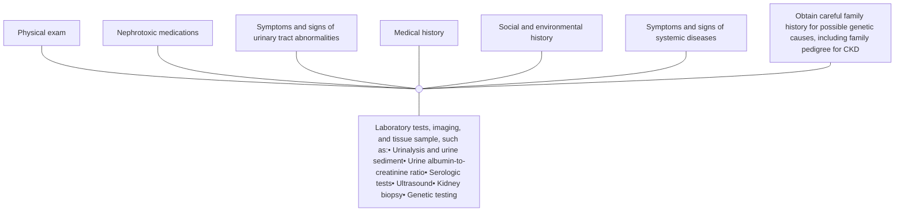
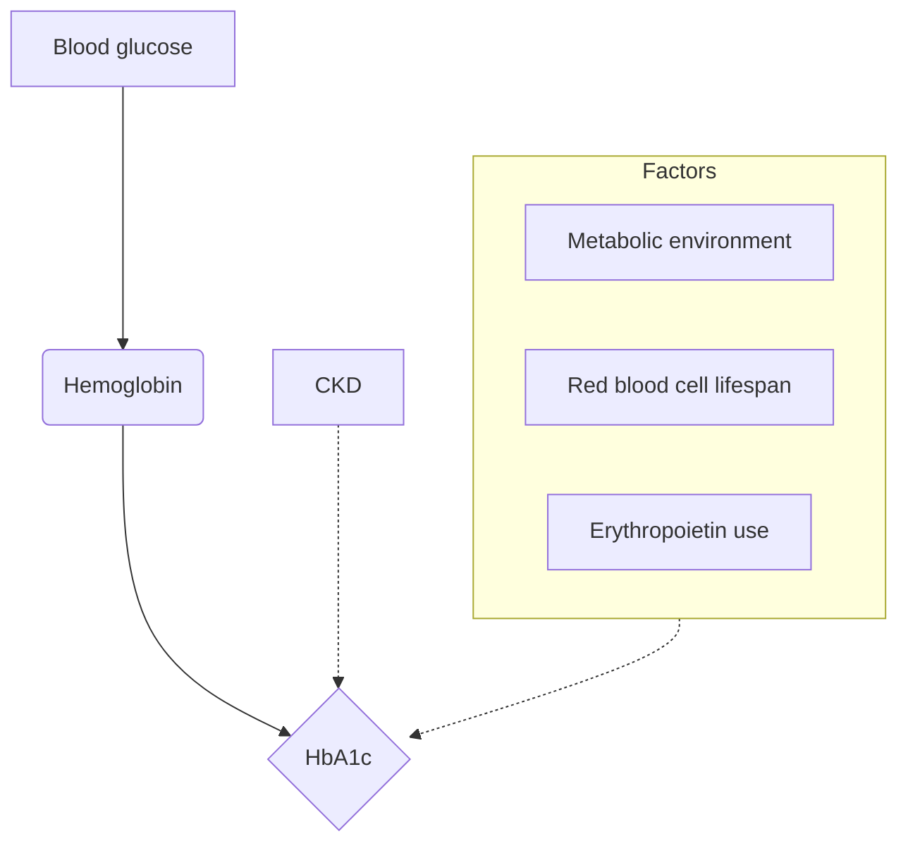
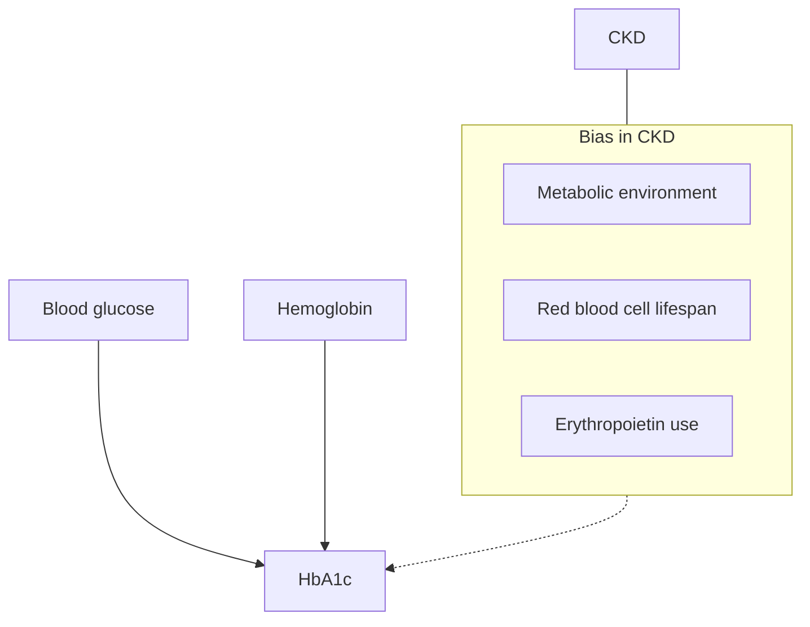
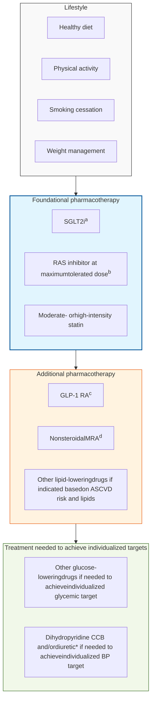
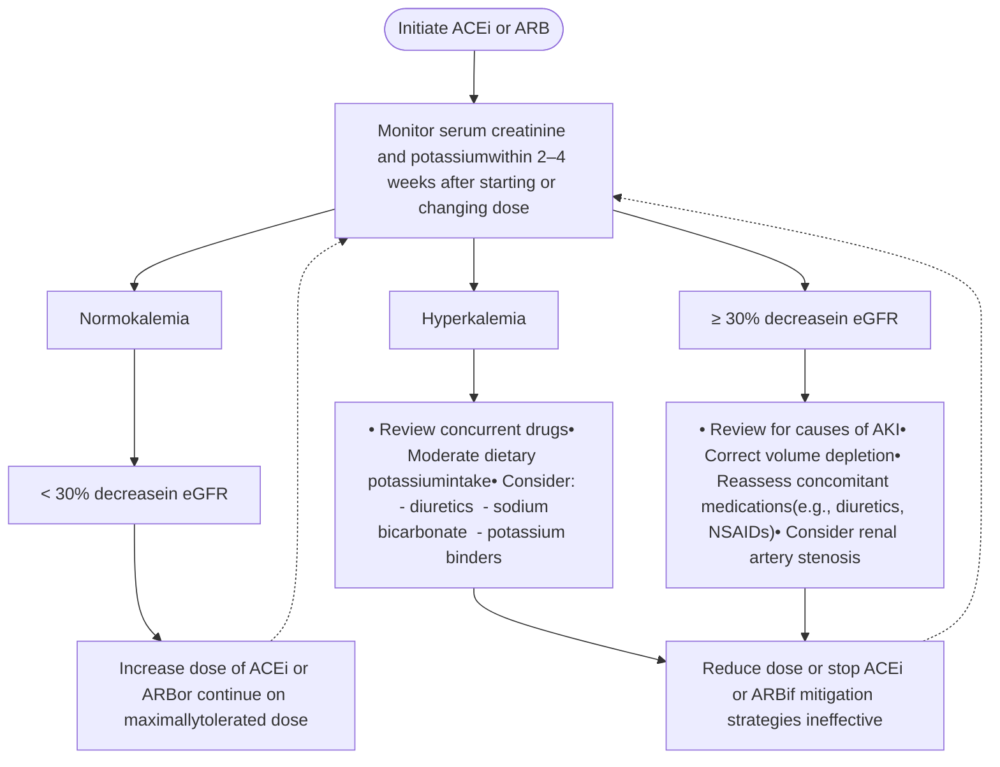

# KDIGO 2026 CLINICAL PRACTICE GUIDELINE FOR DIABETES AND CHRONIC KIDNEY DISEASE (CKD)

## DRAFT CHAPTER 1, CHAPTER 2, & CHAPTER 4 UPDATE

### PUBLIC REVIEW DRAFT
### MARCH 2026

> <mark>**This is a draft document shared for public review and feedback only. The content of this draft will change based on the feedback received and should not be used for any other purpose beyond its original intent.**</mark>

i

# TABLE OF CONTENTS

Tables, figures, and supplementary materials ii
Abbreviations and acronyms vi
Notice viii
Work Group membership x
Abstract xi
Summary of recommendation statements and practice points 1
Chapter 1. Definitions, prevention, case-finding, staging, and cardiovascular risk assessment 16
Chapter 2. Glycemic monitoring and targets in people with diabetes and CKD 32
Chapter 4. Pharmacotherapy in people with diabetes and CKD 45
Methods for guideline development 112
References 126


ii

# TABLES

Table 1. ADA/KDIGO consensus statements on the prevention of CKD in people with diabetes without clinical evidence of CKD 19
Table 2. Effects of relevant interventions on prevention of CKD among people with T1D or T2D without prevalent clinical manifestations of CKD 21
Table 3. Reasons to consider concomitant causes for CKD in people with diabetes requiring additional actions 28
Table 4. Potential glycemic targets for people with diabetes and CKD who use CGM 39
Table 5. Principles of comprehensive care for people with diabetes and CKD 46
Table 6. Clinical questions and systematic review topics in PICOS format 115
Table 7. Classification for certainty of the evidence 123
Table 8. GRADE system for grading the certainty of evidence 123
Table 9. KDIGO nomenclature and description for grading of recommendations 124
Table 10. Determinants of the strength of recommendation 125

# FIGURES

Figure 1. Figure 1. KDIGO 2024 Clinical Practice Guideline for Diabetes Management in Chronic Kidney Disease 17
Figure 2. Effects of relevant interventions on prevention of CKD among people with T1D or T2D without prevalent clinical manifestations of CKD 21
Figure 3. Reasons to consider concomitant causes for CKD in people with diabetes requiring additional actions 28
Figure 4. Potential glycemic targets for people with diabetes and CKD who use CGM 39
Figure 5. Principles of comprehensive care for people with diabetes and CKD 46
Figure 6. Clinical questions and systematic review topics in PICOS format 115
Figure 7. Classification for certainty of the evidence 123
Figure 8. GRADE system for grading the certainty of evidence 123
Figure 9. KDIGO nomenclature and description for grading of recommendations 124
Figure 10. Determinants of the strength of recommendation 125
Figure 11. Screening for CKD in people with diabetes 18
Figure 12. Monitoring of CKD in people with diabetes 20
Figure 13. Relationship between HbA<sub>1c</sub> and risk of complications in T1D and T2D 32
Figure 14. Factors guiding the individualization of HbA<sub>1c</sub> targets 34
Figure 15. CGM metrics 38
Figure 16. CGM-derived glucose management indicator (GMI) 40
Figure 17. CGM-derived time in range (TIR) 41
Figure 18. CGM-derived glucose variability (GV) 42
Figure 19. CGM-derived hypoglycemia 43
Figure 20. CGM-derived hyperglycemia 44
Figure 21. Comprehensive care for people with diabetes and CKD 47
Figure 22. Nutrition for people with diabetes and CKD 51
Figure 23. Physical activity for people with diabetes and CKD 55
Figure 24. Smoking cessation for people with diabetes and CKD 58
Figure 25. SGLT2i for people with diabetes and CKD 63
Figure 26. Metformin for people with diabetes and CKD 71
Figure 27. GLP-1 RA for people with diabetes and CKD 78
Figure 28. nsMRA for people with diabetes and CKD 85
Figure 29. Effects on a. kidney failure, b. kidney disease progression, c. major adverse cardiovascular events, d. heart failure comparing a GLP-1-based therapy with placebo among adults with T2D and CKD 92
Figure 30. Dosing for available GLP-1-based therapies and dose modification for CKD 98
Figure 31. Different formulations of metformin 104

iii

Figure 32. Suggested approach in using metformin based on the level of kidney function 106
Figure 37. Search yield and study flow diagram 121

# DRAFT

iv

# SUPPLEMENTARY MATERIAL

**Appendix A. Search strategies**
Table S1. Search strategies for systematic review topics S1

**Appendix B. Concurrence with Institute of Medicine (IOM) standards for guideline development**
Table S2. Guideline development checklist—IOM standards for development of trustworthy clinical practice guidelines S16
Table S3. Adapted systematic review reporting standards checklist—IOM standards for systematic reviews S17

**Appendix C. Data supplement—Summary of findings (SoF) tables cited in the guideline text**
*Chapter 2. Glycemic monitoring and targets in people with diabetes and chronic kidney disease*
Table S4. SoF table: Continuous glucose monitoring versus Standard of care for monitoring of blood glucose—critical outcomes S18

*Chapter 4. Pharmacotherapy in people with diabetes and CKD*
Table S5. SoF table: Renin-angiotensin system inhibitors versus placebo or standard of care—critical outcomes S19
Table S6. SoF table: Renin-angiotensin system inhibitors versus placebo or standard of care—important outcomes S21
Table S7. SoF table: Sodium-glucose cotransporter 2 inhibitors versus placebo or standard of care—critical outcomes S23
Table S8. SoF table: Sodium-glucose cotransporter 2 inhibitors versus placebo or standard of care—important outcomes S25
Table S9. SoF table: Glucagon-like peptide-1 receptor agonists versus placebo or standard of care—critical outcomes S27
Table S10. SoF table: Glucagon-like peptide-1 receptor agonists versus placebo or standard of care—important outcomes S29
Table S11. SoF table: Dipeptidyl peptidase-4 inhibitors versus placebo or standard of care—critical outcomes S31
Table S12. SoF table: Dipeptidyl peptidase-4 inhibitors versus placebo or standard of care—important outcomes S33

**Appendix D. PRISMA diagrams for clinical questions**
Figure S1. PRISMA diagram for the clinical question “In people with CKD G1-G5 not receiving dialysis and type 2 diabetes, what are the effects of continuous glucose monitoring on clinically relevant outcomes”? S34
Figure S2. PRISMA diagram for the clinical question “In people with CKD G1-G5 not receiving dialysis and type 2 diabetes, what are the effects of continuous glucose monitoring on clinically relevant harms”? S35
Figure S3. PRISMA diagram for the clinical question “In people with CKD G1-G5 not receiving dialysis and type 2 diabetes, what are the effects of metformin on clinically relevant outcomes”? S36
Figure S4. PRISMA diagram for the clinical question “In people with CKD G1-G5 not receiving dialysis and type 2 diabetes, what are the effects of metformin on clinically relevant harms”? S37
Figure S5. PRISMA diagram for the clinical question “In people with CKD G1-G5 not receiving dialysis and type 2 diabetes, what are the effects of SGLT2 inhibitors on clinically relevant outcomes”? S38
Figure S6. PRISMA diagram for the clinical question “In people with CKD G1-G5 not receiving dialysis and type 2 diabetes, what are the effects of SGLT2 inhibitors on clinically relevant harms”? S39

v

# ABBREVIATIONS AND ACRONYMS

*   **ACEi**: angiotensin-converting enzyme inhibitor(s)
*   **AKI**: acute kidney injury
*   **ARB**: angiotensin II receptor blocker
*   **ASCVD**: atherosclerotic cardiovascular disease
*   **BP**: blood pressure
*   **CGM**: continuous glucose monitoring
*   **CI**: confidence interval
*   **CKD**: chronic kidney disease
*   **CKM**: cardio-kidney-metabolic
*   **CVD**: cardiovascular disease
*   **CVOT**: cardiovascular outcome trial
*   **DBP**: diastolic blood pressure
*   **DKD**: diabetic kidney disease
*   **DPP-4**: dipeptidyl peptidase-4
*   **eGFR**: estimated glomerular filtration rate
*   **ERT**: Evidence Review Team
*   **FDA**: Food and Drug Administration
*   **GFR**: glomerular filtration rate
*   **GIP**: glucose-dependent insulinotropic polypeptide
*   **GLP-1 RA**: glucagon-like peptide-1 receptor agonist(s)
*   **GMI**: glucose management index
*   **GRADE**: Grading of Recommendations Assessment, Development and Evaluation
*   **HbA1c**: hemoglobin A1c
*   **HF**: heart failure
*   **HR**: hazard ratio
*   **KDIGO**: Kidney Disease: Improving Global Outcomes
*   **KRT**: kidney replacement therapy
*   **LDL-C**: low-density lipoprotein cholesterol
*   **MACE**: major adverse cardiovascular events
*   **MD**: mean difference
*   **MRA**: mineralocorticoid receptor antagonist
*   **NHANES**: National Health and Nutrition Examination Survey
*   **nsMRA**: nonsteroidal mineralocorticoid receptor antagonist
*   **PCSK9**: proprotein convertase subtilisin/kexin type 9
*   **RAS(i)**: renin–angiotensin system (inhibition/inhibitors)
*   **RCT**: randomized controlled trial
*   **RR**: relative risk
*   **SBP**: systolic blood pressure
*   **SCr**: serum creatinine
*   **SGLT2i**: sodium–glucose cotransporter-2 inhibitor(s)
*   **SMBG**: self-monitoring of blood glucose


vi

<table>
  <thead>
    <tr>
      <th>T1D</th>
      <th>type 1 diabetes</th>
    </tr>
  </thead>
  <tbody>
    <tr>
      <td>T2D</td>
      <td>type 2 diabetes</td>
    </tr>
    <tr>
      <td>UACR</td>
      <td>urine albumin–creatinine ratio</td>
    </tr>
    <tr>
      <td>UK</td>
      <td>United Kingdom</td>
    </tr>
    <tr>
      <td>UKPDS</td>
      <td>United Kingdom Prospective Diabetes Study Group</td>
    </tr>
    <tr>
      <td>U.S.</td>
      <td>United States</td>
    </tr>
    <tr>
      <td>WHO</td>
      <td>World Health Organization</td>
    </tr>
  </tbody>
</table>


<table>
  <tbody>
    <tr>
        <td>T2D</td>
        <td>type 2 diabetes</td>
    </tr>
    <tr>
        <td>UACR</td>
        <td>urine albumin—creatinine ratio</td>
    </tr>
    <tr>
        <td>UK</td>
        <td>United Kingdom</td>
    </tr>
    <tr>
        <td>UKPDS</td>
        <td>United Kingdom Prospective Diabetes Study Group</td>
    </tr>
    <tr>
        <td>U.S.</td>
        <td>United States</td>
    </tr>
    <tr>
        <td>WHO</td>
        <td>World Health Organization</td>
    </tr>
  </tbody>
</table>


# DRAFT

vii

# NOTICE

## SECTION I: USE OF THE CLINICAL PRACTICE GUIDELINE

This Clinical Practice Guideline document is based upon literature searches last conducted in July 2025. It is designed to assist decision-making. It is not intended to define a standard of care and should not be interpreted as prescribing an exclusive course of management. Variations in practice will inevitably and appropriately occur when clinicians consider the needs of individual patients, available resources, and limitations unique to an institution or type of practice. Healthcare professionals using these recommendations should decide how to apply them to their own clinical practice.

## SECTION II: DISCLOSURE

Kidney Disease: Improving Global Outcomes (KDIGO) makes every effort to avoid any actual or reasonably perceived conflicts of interest that may arise from an outside relationship or a personal, professional, or business interest of a member of the Work Group. All members of the Work Group are required to complete, sign, and submit a disclosure and attestation form showing all such relationships that might be perceived as or are actual conflicts of interest. This document is updated annually, and information is adjusted accordingly. All reported information is published in its entirety at the end of this document in the Work Group members’ Disclosure section and is kept on file at KDIGO.

viii

# WORK GROUP MEMBERSHIP

## Work Group Co-Chairs

**Ian H. de Boer, MD, MS**
Kidney Research Institute
University of Washington
Seattle, WA, USA

**Peter Rossing, MD, DMSc**
Steno Diabetes Center Copenhagen
University of Copenhagen
Copenhagen, Denmark

*The Work Group consisted of a geographically diverse group of experts including the following specialties: nephrology, cardiology, clinical trials, endocrinology, nursing, pharmacology, primary care, and people with lived experience. Their names will be provided in the final publication of this clinical practice guideline.*

## Methods Chair

**Chris Carmona, PhD**
University of Sheffield
Sheffield, UK

**Amara Sarwal, MD, MSCI**
University of Utah,
Salt Lake City, UT, USA

## Evidence Review Team

The Johns Hopkins University Evidence-based Practice Center

**Karen Robinson, PhD**
**Liza Gill, MPH**
**Casey M. Rebholz, PhD, MS, MNSP, MPH**
**S. Michelle S. Chiu, MPH**
**Dante Macaluso, BS**
**Zhuun-Yee (Zoe) Khoo, BS**

ix

# ABSTRACT

The Kidney Disease: Improving Global Outcomes (KDIGO) 2026 Clinical Practice Guideline for *Diabetes Management in Chronic Kidney Disease* (CKD) represents a focused update of the KDIGO 2022 guideline on the topic. The guideline targets a broad audience of healthcare professionals treating diabetes and CKD. Topic areas for which recommendations are updated include a new Chapter 1 focusing on definitions, prevention, case-finding, staging, and cardiovascular risk assessment, Chapter 2 on glycemic monitoring and targets in people with diabetes and CKD, and Chapter 4 on pharmacotherapy in people with diabetes and CKD. Previous chapters on lifestyle interventions in people with diabetes and CKD (Chapter 3) and approaches to management of people with diabetes and CKD (Chapter 5) have been deemed current and their content has remained unchanged. Development of this guideline update followed an explicit process of evidence review and appraisal. Treatment approaches and guideline recommendations are based on systematic reviews of relevant studies, and appraisal of the certainty of the evidence and the strength of recommendations followed the “Grading of Recommendations Assessment, Development and Evaluation” (GRADE) approach. Limitations of the evidence are discussed, and areas of future research are also presented.

**Keywords:** angiotensin-converting enzyme inhibitor; angiotensin II receptor blocker; chronic kidney disease; dialysis; evidence-based; GLP-1 receptor agonist; glycemia; glycemic monitoring; glycemic targets; guideline; HbA1c; hemodialysis; KDIGO; lifestyle; metformin; models of care; nutrition; renin-angiotensin system; self-management; SGLT2 inhibitor; systematic review; team-based care

DRAFT

x

# SUMMARY OF RECOMMENDATION STATEMENTS AND PRACTICE POINTS

## CHAPTER 1: DEFINITIONS, PREVENTION, CASE-FINDING, STAGING, AND CARDIOVASCULAR RISK ASSESSMENT

### 1.1 Definitions

**Practice Point 1.1.1.** Use "diabetes and chronic kidney disease (CKD)", "CKD in diabetes", or "diabetic kidney disease" to identify people with type 1 diabetes (T1D) or type 2 diabetes (T2D) who have clinical evidence of CKD, with implications for treatment as evaluated in clinical trials enrolling similarly-defined populations.

### 1.2 Maintaining kidney health in diabetes

**Practice Point 1.2.1.** Use effective lifestyle, pharmacologic, and multifactorial interventions to prevent CKD in people with T1D and T2D (Table 1 and Figure 2).

Table 1 | ADA/KDIGO consensus statements on the prevention of CKD in people with diabetes without clinical evidence of CKD – <mark>REDACTED UNTIL FINAL PUBLICATION</mark>

> [!IMPORTANT]
> **DRAFT**
>
> [Content redacted in original document]

1


**Figure 2 | Interventions to prevent CKD and preserve kidney health among people with diabetes.** BP, blood pressure; CKD, chronic kidney disease; GFR, glomerular filtration rate; GLP-1, glucagon-like peptide-1; RASi, renin-angiotensin system inhibitor; SGLT2i, sodium-glucose cotransporter-2 inhibitor; T1D, type 1 diabetes; T2D, type 2 diabetes

## 1.3 Case-finding and diagnosis

**Practice Point 1.3.1:** Test all adults and children with diabetes for CKD using both urine albumin-to-creatinine ratio (UACR) and an estimation of glomerular filtration rate (eGFR) (Figure 4).

**Practice Point 1.3.2:** Use the following measurements for initial testing of albuminuria (in descending order of preference) (Figure 4).

i. **UACR (spot urine sample)**

ii. **Point-of-care reagent test strip with automated and semiquantitative measurement of UACR**



**Figure 4 | A summary of CKD testing, diagnosis, and action for people with diabetes.** CKD, chronic kidney disease; GFR, glomerular filtration rate

2

**Practice Point 1.3.3: Begin testing people with T1D ≥5 years after diagnosis; test people with T2D from the time of diabetes diagnosis (Figure 5).**

**Practice Point 1.3.4: If eGFR ≥60 ml/min per 1.73 m² and UACR <30 mg/g [3 mg/mmol] and there are no other markers of kidney damage, repeat annually (Figure 5).**

```mermaid
graph TD
    A[People with diabetes at risk of CKDT1D ≥5 years durationT2D from time of diagnosis] --> B["Test for eGFR* AND UACR ± other markers of kidney damage†"]
    B --> C1["eGFR <60 ml/min per 1.73 m²or UACR ≥30 mg/g [3 mg/mmol]and/or other markers of kidney damage present"]
    B --> C2["eGFR ≥60 ml/min per 1.73 m²and UACR <30 mg/g [3 mg/mmol]and no other markers of kidney damage present"]
    
    C1 --> D[Test for eGFR or UACR if not performed and exclude AKI/AKD]
    
    D --> E1["eGFR <60 ml/min per 1.73 m² and/orUACR ≥30 mg/g [3 mg/mmol] after 3 monthsor earlier if evidence of chronicity"]
    D --> E2[AKI/AKD present:follow AKI/AKD guidance]
    
    E1 --> F[Treat to reduce kidney and cardiovascular riskand manage kidney and cardiovascular risk factors(Figure 19)]
    F --> G[Monitor eGFR and UACRand response to therapies(Figure 1)]
    
    C2 --> H[CKD not presentInclude CKD preventionin goals of care(Figure 2 and Table 1)]
    H --> I[Test annually to ensuretimely case-finding]
    I --> B
```

**Figure 5 | Screening algorithm and staging for CKD using UACR and eGFR with risk assessment and management to prevent and treat people with CKD and diabetes.** AKD, acute kidney disease; AKI, acute kidney injury; CKD, chronic kidney disease; eGFR, estimated glomerular filtration rate; T1D, type 1 diabetes; T2D, type 2 diabetes; UACR, urine albumin-to-creatinine ratio

**Practice Point 1.3.5: Establish the causes of CKD taking into consideration clinical context, personal and family history, life course, lifestyle, social and environmental factors, medications, physical examination, laboratory measures, imaging, and genetic and pathologic diagnosis (Figure 6).**

3



**Figure 6 | Evaluation of cause of CKD.** CKD, chronic kidney disease

**Practice Point 1.3.6: When indicated, refer people with diabetes and CKD to nephrologists for evaluation of concomitant or other causes of kidney disease which require specific treatment (Table 3).**

**Table 3 | Reasons to consider concomitant causes for CKD in people with diabetes requiring additional actions**

* **Type 1 diabetes (T1D) duration <5 years**
* **Active urine sediment (e.g., containing red blood cells or cellular casts or sterile pyuria)**
* **Clinically well-managed blood glucose**
* **Rapidly declining estimated glomerular filtration rate (eGFR)**
* **Rapidly increasing or very high urine albumin-to-creatinine ratio (UACR), urine protein, or serum creatinine level**
* **No retinopathy, especially in people with T1D**
* **Presence of other systematic features (e.g., polyarthritis, gouty arthritis)**

CKD, chronic kidney disease

The Work Group concurs with the following recommendation from *<u>KDIGO 2024 Clinical Practice Guideline for the Evaluation and Management of Chronic Kidney Disease:</u>*<sup>1</sup>

> **Recommendation 1.3.1: We suggest performing a kidney biopsy as an acceptable, safe, diagnostic test to evaluate causes of kidney disease to guide treatment decisions when clinically appropriate (2D).**

### 1.4 Staging of CKD

**Practice Point 1.4.1: Use both eGFR and UACR for staging of CKD (Figure 1).**

### 1.5 Prediction of cardiovascular-kidney risk in people with diabetes and CKD

**Practice Point 1.5.1: Use externally validated models that are either developed within CKD populations or that incorporate eGFR and albuminuria to assess future risk of cardiovascular events (atherosclerotic and/or heart failure [HF]) and risk of kidney failure.**

4

# CHAPTER 2: GLYCEMIC MONITORING AND TARGETS IN PEOPLE WITH DIABETES AND CKD

## 2.1 Glycemic monitoring

### Hemoglobin A1c

**Recommendation 2.1.1: We recommend using hemoglobin A1c (HbA1c) to monitor glycemic control in people with diabetes and CKD (1C).**

**Practice Point 2.1.1:** Monitoring long-term glycemic control by HbA1c twice per year is reasonable for people with diabetes and CKD. HbA1c may be measured as often as 4 times per year if the glycemic target is not met or after a change in glucose-lowering therapy.

**Practice Point 2.1.2:** Accuracy and precision of HbA1c measurement declines with advanced CKD (G4–G5), particularly among people treated by dialysis, in whom HbA1c measurements have low reliability.

### Continuous glucose monitoring

**Practice Point 2.1.3:** Offer continuous glucose monitoring (CGM) to all people with T1D.

**Practice Point 2.1.4:** CGM may be offered to people with T2D especially those receiving insulin therapy and at risk of hypoglycemia.

**Practice Point 2.1.5:** Daily glycemic monitoring with CGM or self-monitoring of blood glucose (SMBG) may help prevent hypoglycemia and improve glycemic control for people with diabetes and CKD.

**Practice Point 2.1.6:** CGM devices are rapidly evolving with multiple functionalities (e.g., real-time CGM, alerts for hypo- and hyperglycemia and connection to insulin delivery devices). Newer CGM devices offering real-time glucose monitoring may offer advantages for certain people, depending on their values, goals, and preferences.

**Practice Point 2.1.7:** Support from a healthcare professional with specialist expertise in diabetes technology can help people with diabetes and CKD navigate blood glucose monitoring options and select a CGM system that best meets their clinical needs, preferences, and goals.

**Practice Point 2.1.8:** Consider the following glycemic targets for people with diabetes and CKD using CGM (Table 4).

5

Table 4 | Potential glycemic targets for people with diabetes and CKD who use CGM


<table>
  <thead>
    <tr>
        <th>CKD stage</th>
        <th>Time in range (TIR %)</th>
        <th>Time below range (TBR %)</th>
        <th>Time above range (TAR %)</th>
    </tr>
  </thead>
  <tbody>
    <tr>
        <td>CKD G1–G3b</td>
        <td>≥70% of time between 70–180 mg/dl (3.9–10.0 mmol/l)</td>
        <td>* &lt;4% of time &lt;70 mg/dl (&lt;3.9 mmol/l)<br/>* &lt;1% of time &lt;54 mg/dl (&lt;3.0 mmol/l)</td>
        <td>* &lt;25% of time &gt;180 mg/dl (&gt;10.0 mmol/l)<br/>* &lt;5% of time &gt;250 mg/dl (&gt;13.9 mmol/l)</td>
    </tr>
    <tr>
        <td>CKD G4–G5</td>
        <td>≥50% of time between 70–180 mg/dl (3.9–10.0 mmol/l)</td>
        <td>&lt;1% of time &lt;70 mg/dl (&lt;3.9 mmol/l)</td>
        <td>* &lt;35% of time &gt;180 mg/dl (&gt;10.0 mmol/l)<br/>* &lt;14% of time &gt;250 mg/dl (&gt;13.9 mmol/l)</td>
    </tr>
  </tbody>
</table>


CKD, chronic kidney disease; CGM, continuous glucose monitoring. In addition to CKD stage, other factors may also influence choice of targets, including factors that affect both anticipated benefits of intensive glycemic management with regards to multiple diabetes complications and anticipated risks of hypoglycemia.

**Practice Point 2.1.9: A glucose management indicator (GMI) derived from CGM data can be used to monitor glycemia for people with diabetes and CKD in whom HbA1c is not concordant with directly measured glycemia.**


6

# CHAPTER 4: PHARMACOTHERAPY IN PEOPLE WITH DIABETES AND CKD

## 4.1. Comprehensive diabetes and CKD management

### Goals of comprehensive care

**Practice Point 4.1.1: Treat people with diabetes and CKD with a comprehensive strategy to reduce risks of kidney disease progression and cardiovascular disease (Figure 19).**


**Figure 19 | Comprehensive strategy to reduce risk of kidney disease progression and cardiovascular disease.** GLP-1, glucagon-like peptide-1; nsMRA, nonsteroidal mineralocorticoid receptor antagonist; RAS, renin-angiotensin system; SGLT2, sodium-glucose cotransporter-2

### Principles of comprehensive care

**Practice Point 4.1.2: Use a personalized approach to implement combinations of lifestyle and pharmacologic interventions for individual people with diabetes and CKD with a goal to maximize kidney and cardiovascular protection as quickly as possible.**

**Practice Point 4.1.3: Use a personalized approach to determine the best treatment plan, based on baseline and ongoing reassessments of risk factors. Prioritize interventions that are expected to provide the greatest benefit early on, optimize doses, and sequence treatments in a way that minimizes adverse effects and supports long-term adherence.**

7

**Practice Point 4.1.4: Assess adherence at each clinical encounter to maximize benefits of effective lifestyle and pharmacologic interventions. Identify and mitigate barriers to adherence, including access to treatments and adverse effects, whenever possible.**

### Combination therapy

**Practice Point 4.1.5: Initiating multiple interventions simultaneously may accelerate achievement of optimal individualized combination regimens when adverse effect profiles are nonoverlapping or studies suggest safety of simultaneous initiation.**

### Multidisciplinary care

*[No recommendations or practice points]*

### Lipid management

**Practice Point 4.1.6: In people with diabetes and CKD, initiate statin-based regimens for atherosclerotic cardiovascular disease (ASCVD) risk reduction with more intensive low-density lipoprotein cholesterol (LDL-C) targets for people with diabetes and CKD at higher ASCVD risk.**

**Practice Point 4.1.7: Add non-statin, lipid-lowering therapy with proven cardiovascular benefit, alone or in combination, to people with diabetes and CKD who are unable to achieve their risk-based LDL-C targets with maximally tolerated statin alone.**

**Practice Point 4.1.8: Consider measuring lipoprotein (a) (Lp(a)) cholesterol levels at least once, as higher Lp(a) levels are associated with higher cardiovascular risk and help guide intensity of preventive therapies.**

### Antiplatelet therapy

An updated systematic review on antiplatelet therapy was not conducted at this time, however, the Work Group agrees with the following recommendation and practice point from the <u>*KDIGO 2024 Clinical Practice Guideline for the Evaluation and Management of CKD*</u>:<sup>1</sup>

> **Recommendation 4.1.4: We recommend oral low dose aspirin for prevention of recurrent ischemic cardiovascular disease events (i.e., secondary prevention) in people with CKD and established ischemic cardiovascular disease (*1C*).**
>
> **Practice Point 4.1.9: Consider other antiplatelet therapy (e.g., P2Y12 inhibitors) when there is aspirin intolerance.**

## 4.2 Renin-angiotensin system (RAS) blockade

**Recommendation 4.2.1: We recommend that treatment with an angiotensin-converting enzyme inhibitor (ACEi) or an angiotensin II receptor blocker (ARB) be initiated in people with diabetes, hypertension, and albuminuria, and that these medications be titrated to the highest approved dose that is tolerated (*1B*).**

**Practice Point 4.2.1: It may be reasonable to treat people with diabetes, hypertension, and no albuminuria with renin-angiotensin system inhibitors (RASi [i.e., ACEi or ARB]).**

**Practice Point 4.2.2: For people with diabetes, albuminuria, and normal blood pressure, treatment with an ACEi or ARB may be considered.**

8

**Practice Point 4.2.3: Monitor for changes in blood pressure, GFR, and serum potassium within 2–4 weeks of initiation or increase in the dose of an ACEi or ARB (Figure 22).**

```mermaid
graph TD
    A[Initiate ACEi or ARB] --> B[Monitor serum creatinine and potassium(within 2-4 weeks after starting or changing dose)]
    B --> C[Normokalemia]
    B --> D[Hyperkalemia]
    B --> E[≥ 30% decreasein eGFR]
    
    C --> F[< 30% decreasein eGFR]
    F --> G[Increase dose of ACEi or ARBor continue on maximallytolerated dose]
    
    D --> H["• Review concurrent drugs• Moderate dietary potassiumintake• Consider:- diuretics- sodium bicarbonate- potassium binders"]
    
    E --> I["• Review for causes of AKI• Correct volume depletion• Reassess concomitant medications(e.g., diuretics, NSAIDs)• Consider renal artery stenosis"]
    
    H --> J[Reduce dose or stop ACEi or ARBif mitigation strategies ineffective]
    I --> J
    
    G -.-> B
    J -.-> B
```

**Figure 22 | Monitoring of serum creatinine and potassium during ACEi or ARB treatment—dose adjustment and monitoring of side effects.** ACEi, angiotensin-converting enzyme inhibitor; AKI, acute kidney injury; ARB, angiotensin II receptor blocker; NSAID, nonsteroidal anti-inflammatory drug.

**Practice Point 4.2.4: Continue ACEi or ARB therapy unless GFR declines by more than 30% within 4 weeks following initiation of treatment or an increase in dose (Figure 22).**

**Practice Point 4.2.5: Advise contraception in women who are receiving ACEi or ARB therapy and discontinue these agents in women who are considering pregnancy or who become pregnant.**

**Practice Point 4.2.6: Hyperkalemia associated with the use of an ACEi or ARB can often be managed by measures to reduce serum potassium levels rather than decreasing the dose or stopping the ACEi or ARB immediately (Figure 22).**

**Practice Point 4.2.7: Reduce the dose or discontinue ACEi or ARB therapy in the setting of either symptomatic hypotension or uncontrolled hyperkalemia despite the medical treatment outlined in Practice Point 4.2.6, or to reduce uremic symptoms while treating kidney failure (eGFR <15 ml/min per 1.73 m²).**

**Practice Point 4.2.8: Combining an ACEi with an ARB or combining either an ACEi or an ARB with a direct renin inhibitor is potentially harmful.**

9

# 4.3 Sodium–glucose cotransporter-2 inhibitors (SGLT2i)

**Recommendation 4.3.1: We recommend treating adults with type 2 diabetes (T2D), CKD, and an eGFR ≥20 ml/min per 1.73 m² with a sodium-glucose cotranporter-2 inhibitor (SGLT2i) (*1A*).**

**Practice Point 4.3.1:** In people with T2D and CKD, SGLT2i should be used primarily for cardio-kidney protection as they significantly reduce mortality, HF hospitalizations, and kidney failure, even with modest glycemic effects. Therefore, an SGLT2i should be added to existing glucose-lowering therapy specifically for its cardiovascular and kidney benefits.

**Practice Point 4.3.2:** Prioritize agents with documented cardiorenal outcome data.

**Practice Point 4.3.3:** It is reasonable to withhold SGLT2i during prolonged fasting, major surgery, or critical illness when risk of ketosis or hypovolemia is increased; restart once the patient is clinically stable and oral intake is adequate.

**Practice Point 4.3.4:** For people at risk of hypovolemia, consider reducing background diuretic dose before initiating an SGLT2i; counsel people about signs of volume depletion and orthostatic symptoms; reassess volume status and blood pressure within 1–4 weeks after initiation.

**Practice Point 4.3. 5:** Usually it is not necessary to add additional laboratory testing after starting SGLT2i. When eGFR is measured, an early, generally reversible decline in eGFR after SGLT2i initiation is common and not by itself an indication to stop therapy.

**Practice Point 4.3.6:** Once an SGLT2i is initiated, it is reasonable to continue an SGLT2i even if the eGFR falls below 20 ml/min per 1.73 m², unless it is not tolerated or kidney replacement therapy is initiated.

**Practice Point 4.3.7:** SGLT2i have not been adequately studied in kidney transplant recipients, who may benefit from SGLT2i treatment, but are immunosuppressed and potentially at increased risk for infections; therefore, the recommendation to use SGLT2i does not apply to kidney transplant recipients.

**Practice Point 4.3.8:** Monitor serum electrolytes (including potassium) and albuminuria per usual CKD care.

# 4.4 Mineralocorticoid receptor antagonists (MRA)

**Recommendation 4.4.1: We recommend adding a nonsteroidal mineralocorticoid receptor antagonist (nsMRA) with proven kidney or cardiovascular benefit for people with T2D, an eGFR ≥25 ml/min per 1.73 m², normal serum potassium concentration, and albuminuria (UACR ≥30 mg/g [≥3 mg/mmol]) while on maximum tolerated dose of RAS inhibitor (RASi) (*1A*).**

**Practice Point 4.4.1:** Nonsteroidal MRA are most appropriate for people with T2D who are at high risk of CKD progression and cardiovascular events, as demonstrated by persistent albuminuria despite other foundational therapies.

**Practice Point 4.4.2.** For people with T2D treated with RASi who have persistent albuminuria and normal serum potassium, an SGLT2i and nsMRA can be initiated simultaneously.

10

**Practice Point 4.4.3: To mitigate risk of hyperkalemia, select people with consistently normal serum potassium concentration and monitor serum potassium regularly after initiation of an nsMRA.**

**Practice Point 4.4.4: The choice of an nsMRA should prioritize agents with documented kidney or cardiovascular benefits.**

**Practice Point 4.4.5. Nonsteroidal MRA should be considered in people with T2D and CKD who have HF with left ventricular ejection fraction ≥40%.**

**Practice Point 4.4.6: A steroidal MRA should be used for treatment of HF with reduced ejection fraction (HFrEF), hyperaldosteronism, or refractory hypertension, but may cause hyperkalemia or a reversible decline in GFR.**

**Practice Point 4.4.7: Do not use steroidal and nsMRA concurrently.**

## 4.5 Glucagon-like peptide-1-based therapies

***

**Recommendation 4.5.1: We recommend a GLP-1-based therapy with proven CV or kidney benefits for people with T2D and CKD who are at high risk of major adverse cardiovascular or kidney events or who have not achieved individualized glycemic targets (1A).**

***

**Practice Point 4.5.1: Use GLP-1-based therapy to people with T2D and CKD who have established ASCVD or UACR ≥100 mg/g despite foundational therapies for diabetes and CKD.**

**Practice Point 4.5.2: Use GLP-1-based therapy to people with T2D and CKD who have not met individualized HbA1c- or CGM-based glycemic targets or who have met such targets using less desirable glucose-lowering drugs, which could be dose-reduced or discontinued in favor of GLP-1-based therapy.**

**Practice Point 4.5.3: The choice of GLP-1-based therapy should prioritize agents with documented cardiovascular and kidney benefits.**

**Practice Point 4.5.4: To minimize gastrointestinal side effects, start with a low dose of GLP-1-based therapy, and titrate up slowly (Figure 30).**

11

<table>
  <thead>
    <tr>
        <th>GLP-1 RA</th>
        <th>Dose</th>
        <th>CKD adjustment</th>
    </tr>
  </thead>
  <tbody>
    <tr>
        <td>Dulaglutide</td>
        <td>0.75 mg and 4.5 mg once weekly</td>
        <td>No dosage adjustment<br/>Use with eGFR &gt;15 ml/min per 1.73 m²</td>
    </tr>
    <tr>
        <td>Exenatide</td>
        <td>10 μg twice daily</td>
        <td>Use with CrCl &gt;30 ml/min</td>
    </tr>
    <tr>
        <td>Exenatide extended-release</td>
        <td>2 mg once weekly</td>
        <td>Use with CrCl &gt;30 ml/min</td>
    </tr>
    <tr>
        <td>Liraglutide</td>
        <td>Up to 1.8 mg once daily for diabetes;<br/>3.0 mg once daily for weight management</td>
        <td>No dosage adjustment<br/>Limited data for severe CKD</td>
    </tr>
    <tr>
        <td>Lixisenatide</td>
        <td>10 μg and 20 μg once daily</td>
        <td>No dosage adjustment<br/>Limited data for severe CKD</td>
    </tr>
    <tr>
        <td>Semaglutide (injection)</td>
        <td>Up to 2.0 mg once weekly for diabetes;<br/>2.7 mg once weekly for weight management</td>
        <td>No dosage adjustment<br/>Limited data for severe CKD</td>
    </tr>
    <tr>
        <td>Semaglutide (oral)</td>
        <td>Maximum 9 mg once daily for diabetes;<br/>25 mg once daily for weight management</td>
        <td>No dosage adjustment<br/>Limited data for severe CKD</td>
    </tr>
    <tr>
        <td>Tirzepatide</td>
        <td>15 mg weekly</td>
        <td>No dosage adjustment</td>
    </tr>
  </tbody>
</table>


**Figure 30 | Dosing for available GLP-1-based therapies and dose modification for CKD.** CKD, chronic kidney disease; CrCl, creatinine clearance; eGFR, estimated glomerular filtration rate; GLP-1, glucagon-like peptide-1

**Practice Point 4.5.5: GLP-1-based therapies should not be used in combination with dipeptidyl peptidase-4 (DPP-4) inhibitors.**

**Practice Point 4.5.6: The risk of hypoglycemia is generally low with GLP-1-based therapies when used alone, but risk is increased when GLP-1-based therapies are used concomitantly with other medications such as sulfonylureas or insulin. The doses of sulfonylurea and/or insulin may need to be reduced.**

**Practice Point 4.5.7: GLP-1-based therapies may be preferentially used in people living with obesity, T2D, and CKD to promote intentional weight loss.**

**Practice Point 4.5.8: People with T2D and CKD on GLP-1-based therapy who are at risk for sarcopenia should be encouraged to pursue structured resistance-based training to preserve muscle mass and function.**

**Practice Point 4.5.9: GLP-1-based therapy may be initiated or continued for people with kidney failure who are on dialysis to facilitate weight loss and listing for kidney transplantation.**

**Practice Point 4.5.10: A consultation with a renal dietitian or accredited nutrition provider may be considered to address the nutritional requirements in the setting of T2D, CKD, and GLP-1-based therapy use.**

**Practice Point 4.5.11: Provide brief, structured education on injectable therapies, addressing correct technique, dosing, site rotation, storage, disposal, and recognition of side effects, to support safe and effective self-management of GLP-1-based therapy.**

12

# 4.6 Metformin

**Recommendation 4.6.1: We recommend metformin for people with T2D, CKD, and eGFR ≥30 ml/min per 1.73 m² who have not achieved individualized glycemic targets despite use of SGLT2i and GLP-1-based therapies, or who are unable to use those medications (1B).**

**Practice Point 4.6.1:** Treat kidney transplant recipients with T2D and an eGFR ≥30 ml/min per 1.73 m² with metformin according to algorithms for people with T2D and CKD.

**Practice Point 4.6.2:** Monitor eGFR in people treated with metformin and increase the frequency of monitoring when the eGFR is <60 ml/min per 1.73 m² (Figure 32).



Figure 32. Metformin use in people with T2D and CKD.

13

# 4.7 Type 1 diabetes

T1D and T2D have distinct underlying pathophysiology that directly impact diagnosis, prognosis, and treatment. While some recommendations for the management of diabetes and CKD vary for people with T1D or T2D, many recommendations for CKD assessment and diagnosis (Chapter 1), glycemic monitoring (Chapter 2), lifestyle interventions (Chapter 3), pharmacotherapy (Chapter 4), and approaches to management (Chapter 5) apply to people with both T1D and T2D. These recommendations are summarized below. Please refer to each of these chapters to review practice points that apply to both people with T1D and T2D.

**Recommendation 1.3.1: We suggest performing a kidney biopsy as an acceptable, safe, diagnostic test to evaluate causes of kidney disease to guide treatment decisions when clinically appropriate (2D).**

**Recommendation 2.1.1: We recommend using hemoglobin A1c (HbA1c) to monitor glycemic control in people with diabetes and CKD (1C).**

**Recommendation 2.2.1: We recommend an individualized HbA1c target ranging from <6.5% to <8.0% in people with diabetes and CKD not treated with dialysis (Figure 10) (1C).**

**Recommendation 3.1.1: We suggest maintaining a protein intake of 0.8 g protein/kg (weight)/d for those with diabetes and CKD not treated with dialysis (2C).**

**Recommendation 3.1.2: We suggest that sodium intake be <2 g of sodium per day (or <90 mmol of sodium per day, or <5 g of sodium chloride per day) in people with diabetes and CKD (2C).**

**Recommendation 3.2.1: We recommend that people with diabetes and CKD be advised to undertake moderate-intensity physical activity for a cumulative duration of at least 150 minutes per week, or to a level compatible with their cardiovascular and physical tolerance (1D).**

**Recommendation 3.3.1: We recommend advising people with diabetes and CKD who use tobacco to quit using tobacco products (1D).**

**Recommendation 4.1.4: We recommend oral low dose aspirin for prevention of recurrent ischemic cardiovascular disease events (i.e., secondary prevention) in people with CKD and established ischemic cardiovascular disease (1C).**

**Recommendation 4.2.1: We recommend that treatment with an angiotensin-converting enzyme inhibitor (ACEi) or an angiotensin II receptor blocker (ARB) be initiated in people with diabetes, hypertension, and albuminuria, and that these medications be titrated to the highest approved dose that is tolerated (1B).**

**Recommendation 4.7.1: We suggest adding an nsMRA with proven kidney or cardiovascular benefit for people with T1D, eGFR ≥25 ml/min per 1.73 m², normal serum potassium concentration, and albuminuria (UACR ≥200 mg/g [≥20 mg/mmol]) while on maximum tolerated dose of RASi (2C).**

**Recommendation 5.1.1: We recommend that a structured self-management educational program be implemented for care of people with diabetes and CKD (Figure 33) (1C).**

**Recommendation 5.2.1: We suggest that policymakers and institutional decision-makers implement team-based, integrated care focused on risk evaluation and patient empowerment to provide comprehensive care in people with diabetes and CKD (2B).**

\*Please refer to the respective chapters which provide additional practice points for the clinical care of people with T1D.

14

**Recommendation 4.7.1: We suggest adding an nsMRA with proven kidney or cardiovascular benefit for people with T1D, eGFR ≥25 ml/min per 1.73 m², normal serum potassium concentration, and albuminuria (UACR ≥200 mg/g [≥20 mg/mmol]) while on maximum tolerated dose of RASi (2C).**

# DRAFT

15

# CHAPTER 1: DEFINITIONS, PREVENTION, CASE-FINDING, STAGING, AND CARDIOVASCULAR RISK ASSESSMENT

## 1.1 Definitions

The kidneys perform myriad critical functions to maintain homeostasis, including removal of products from the body through filtration and secretion; regulation of electrolyte, acid-base, and water balance; and synthesis of bioactive molecules and systemic fuels. The kidneys are also susceptible to many causes of damage; genome-wide association studies have identified more than 1000 single nucleotide polymorphisms associated with kidney traits,² and multiple clinical risk factors for kidney disease have been identified, including demographic characteristics, obesity, hyperglycemia, and hypertension.³ Therefore, the clinical, pathologic, and molecular presentations of kidney disease are heterogenous in diabetes. Characteristic pathologic features such as glomerular basement membrane thickening and mesangial expansion correlate with measures of kidney damage and function, albuminuria and glomerular filtration rate (GFR), respectively.⁴⁻⁶ However, variability exists in features of kidney diseases as well as clinical outcomes and responses to therapies in type 1 diabetes (T1D) and type 2 diabetes (T2D).⁴, ⁷⁻⁹

Chronic kidney disease (CKD), defined as persistent abnormalities of kidney structure or function present for ≥3 months with major implications for health, is a diagnosis that captures a wide range of pathologic and mechanistic processes.³ While various clinical, laboratory, radiographic, and pathological abnormalities may define CKD, the diagnosis is usually based on two biomarkers, namely, albuminuria and estimated GFR (eGFR). Albuminuria and eGFR do not capture all aspects of kidney damage, nor are they entirely sensitive markers of CKD; changes in albuminuria and eGFR within the "normal range" may represent disease, and other biomarkers and kidney pathology may be abnormal when urine albumin excretion and eGFR are normal.¹⁰, ¹¹ In addition, albuminuria and eGFR are not specific for any particular cause of CKD. Nonetheless, albuminuria and eGFR are clinically useful tests for diagnosing and monitoring CKD because they are standardized, readily available, related to prognosis, and actionable. Diagnosis and classification of CKD based on cause, eGFR, and albuminuria have been recommended across international contexts (Figure 1).³

16


**Figure 1 | KDIGO heatmap with risk categories for cardiovascular disease, progression of CKD, and mortality with proposed action plans and advised annual frequency for screening.** CKD, chronic kidney disease; GFR, glomerular filtration rate.

In diabetes, CKD can have various presentations. Prior to the current era of treatment, a “classic” presentation in which hyperfiltration, progressive albuminuria, and progressive GFR decline proceeded sequentially was well-described, particularly in T1D.<sup>12</sup> Clinical manifestations of CKD in diabetes have changed over time with application of improved glycemic control, blood pressure (BP) control, and renin-angiotensin system (RAS) inhibition.<sup>13</sup> Differing presentations likely reflect combinations of genetic predisposition, cumulative clinical risk factor exposure, and treatments that result in varying molecular, pathologic, and functional abnormalities. Deeper understanding of this heterogeneity and its implications, or kidney precision medicine, is a focus of current research and an opportunity to advance the diagnosis and treatment of CKD.<sup>9, 14</sup>

In addition to heterogenous presentations, people with diabetes can also have other types of kidney diseases not attributable to diabetes. In a series of people with diabetes who underwent kidney biopsy for clinical indications, usually for clinical presentations that raised concerns for a cause of CKD other than diabetes, one third to two thirds of those evaluated had primary histologic diagnoses other than traditional diabetic nephropathy.<sup>15, 16</sup> Such diagnoses were less common in less-selected research kidney biopsy series, which nonetheless showed substantial heterogeneity of pathology.<sup>8, 9</sup>

**Practice Point 1.1.1. Use “diabetes and chronic kidney disease (CKD)”, “CKD in diabetes”, or “diabetic kidney disease” to identify people with type 1 diabetes (T1D) or type 2 diabetes (T2D) who have clinical evidence of CKD, with implications for treatment as evaluated in clinical trials enrolling similarly-defined populations.**

What should we call the heterogenous group of clinical and pathologic kidney findings observed among people with diabetes? In this guideline, we primarily use a conservative terminology, “CKD in diabetes” or “diabetes and CKD.” This reflects a pragmatic application of the term (CKD) to well-defined

17

populations (T1D and T2D). It makes no judgement regarding the underlying cause(s) or predominant mechanism(s) of CKD, which are usually not known. “Diabetic kidney disease (DKD)” is a term that is commonly used as a synonym for CKD in diabetes, also with the understanding that underlying causes vary and may not all be driven specifically by diabetes. Often people who have a clear cause(s) of kidney disease other than diabetes are excluded from “CKD in diabetes” and “DKD,” when such causes are known.

The term “diabetic nephropathy” has been variably applied to albuminuria attributed to diabetes,<sup>12</sup> classic histologic features of kidney damage in diabetes,<sup>17</sup> or other aspects of kidney disease in diabetes. With widespread acceptance of the KDIGO classification system for CKD, we feel that the best current application of this term is to histologic features on kidney biopsy. In this context, “diabetic nephropathy” has been defined using its characteristic glomerular, tubular, and vascular features.<sup>17</sup>

“CKD in diabetes” and “DKD” are useful terms that have allowed evaluation of the epidemiology of CKD, helped raise awareness of this potentially devastating condition, and facilitated application of evidence-based treatments. Notably, most clinical trials evaluating people with diabetes and CKD used clinical definitions of “CKD in diabetes” and “DKD” as outlined here. Therefore, indications for most treatments appropriately utilize these definitions. It is possible that the effectiveness of some treatments varies according to underlying pathology and disease mechanisms. On the other hand, some therapies, such as sodium-glucose cotransporter-2 inhibitors (SGLT2i), appear to be effective across a broad range of underlying disease pathologies.<sup>18, 19</sup> Ultimately, more advanced approaches to precision medicine may usher in a new approach to disease diagnosis and treatment.<sup>9, 14</sup> Presently, identifying CKD and selecting therapy based on the clinical diagnosis of CKD in diabetes is standard-of-care.<sup>3, 20</sup> In fact, this approach is critical for broad, effective, and accessible application of therapies to improve the clinical outcomes of people with diabetes and CKD.

## 1.2 Maintaining kidney health in diabetes

**Practice Point 1.2.1. Use effective lifestyle, pharmacologic, and multifactorial interventions to prevent CKD in people with T1D and T2D (Table 1 and Figure 2).**

The conventional focus of CKD care has been on early diagnosis through effective case-finding followed by managing CKD progression, CKD complications, and kidney failure.<sup>1</sup> However, promoting kidney health and preventing the onset of CKD could reduce cumulative exposure to CKD over the lifespan, improve quality of life, reduce premature mortality, and reduce healthcare costs (Figure 3).<sup>21</sup> The cluster of common risk factors in diabetes including hyperglycemia, hypertension, and obesity<sup>22</sup> plays a causal role in the development of CKD.<sup>23, 24</sup> These established CKD risk factors provide opportunities to intervene early in the course of diabetes to prevent CKD before it manifests clinically. The American College of Cardiology (ACC), American Diabetes Association (ADA), European Association for the Study of Diabetes (EASD), and KDIGO published a consensus statement on CKD prevention in diabetes, guided by a systematic review focusing on clinical trials.<sup>21</sup> Few clinical trials were primarily designed to assess CKD prevention as an outcome, but 65 trials reported in 73 publications were identified that addressed the effects of relevant interventions on CKD prevention among people with T1D or T2D who did not have clinical manifestations of CKD at trial entry, often evaluated in subgroups of study populations or as secondary study outcomes (Table 2). Sufficient data were available to perform meta-analyses for effects of SGLT2i and renin-angiotensin system inhibitors (RASi). Based on these studies, the consensus statement included 8 statements on CKD prevention in diabetes (Table 1). In the future, similar analyses from additional studies could be used to develop graded evidence-based recommendation statements.

18

Table 1 | ADA/KDIGO consensus statements on the prevention of CKD in people with diabetes without clinical evidence of CKD - <mark>REDACTED UNTIL FINAL PUBLICATION</mark>




* **Interventions with beneficial effects on both prevention of albuminuria and preservation of GFR in T1D and T2D**
* **Interventions with beneficial effects on both prevention of albuminuria and preservation of GFR in T2D**
* **Interventions with beneficial effects on prevention of albuminuria in T2D**

Figure 2 | Interventions to prevent CKD and preserve kidney health among people with diabetes. BP, blood pressure; CKD, chronic kidney disease; GFR, glomerular filtration rate; GLP-1, glucagon-like peptide-1; RASi, renin-angiotensin system inhibitor; SGLT2i, sodium-glucose cotransporter-2 inhibitor; T1D, type 1 diabetes; T2D, type 2 diabetes

19

<table>
  <thead>
    <tr>
        <th>Category</th>
        <th>Kidney health (Relative)</th>
    </tr>
  </thead>
  <tbody>
    <tr>
        <td>CKD prevention</td>
        <td>High</td>
    </tr>
    <tr>
        <td>CKD treatment</td>
        <td>Moderate</td>
    </tr>
    <tr>
        <td>Untreated CKD</td>
        <td>Low</td>
    </tr>
  </tbody>
</table>


**Figure 3 | Conceptual model of a paradigm shift from CKD diagnosis and treatment to primary prevention of CKD in diabetes, leading to sustained kidney health over the lifespan.** CKD, chronic kidney disease


20

**Table 2. Effects of relevant interventions on prevention of CKD among people with T1D or T2D without prevalent clinical manifestations of CKD**


<table>
  <thead>
    <tr>
        <th rowspan="2">Population</th>
        <th rowspan="2">Intervention</th>
        <th rowspan="2">Comparator</th>
        <th colspan="3">Findings— Evidence of Intervention Favoring CKD Prevention</th>
    </tr>
    <tr>
        <th>Development of albuminuria</th>
        <th>eGFR decline</th>
        <th>eGFR &lt;60 ml/min per 1.73 m²</th>
    </tr>
  </thead>
  <tbody>
    <tr>
        <td>T1D</td>
        <td rowspan="2">More intensive glycemic management</td>
        <td rowspan="2">Less intensive glycemic management</td>
        <td>Yes</td>
        <td>Yes</td>
        <td>Yes</td>
    </tr>
    <tr>
        <td>T2D</td>
        <td>Yes</td>
        <td>Yes</td>
        <td>N/A</td>
    </tr>
    <tr>
        <td>T2D</td>
        <td>SGLT2i</td>
        <td>Placebo, other glucose-lowering agents</td>
        <td>Yes</td>
        <td>Yes, ✓</td>
        <td>Yes</td>
    </tr>
    <tr>
        <td>T2D</td>
        <td>GLP-1-based therapy</td>
        <td>Placebo, other glucose-lowering agents</td>
        <td>Yes</td>
        <td>Yes</td>
        <td>No</td>
    </tr>
    <tr>
        <td>T2D</td>
        <td>DPP4i</td>
        <td>Placebo, other glucose-lowering agents</td>
        <td>Yes</td>
        <td>No</td>
        <td>No</td>
    </tr>
    <tr>
        <td>T2D</td>
        <td>Sulfonylureas</td>
        <td>Placebo, other glucose-lowering agents</td>
        <td>No</td>
        <td>No</td>
        <td>No</td>
    </tr>
    <tr>
        <td>T1D</td>
        <td rowspan="2">More intensive BP management</td>
        <td rowspan="2">Less intensive BP management</td>
        <td>N/A</td>
        <td>N/A</td>
        <td>N/A</td>
    </tr>
    <tr>
        <td>T2D</td>
        <td>Yes</td>
        <td>N/A</td>
        <td>No</td>
    </tr>
    <tr>
        <td>T1D</td>
        <td rowspan="2">RASi or MRA</td>
        <td rowspan="2">Placebo</td>
        <td>No</td>
        <td>No</td>
        <td>N/A</td>
    </tr>
    <tr>
        <td>T2D</td>
        <td>Yes✓</td>
        <td>No</td>
        <td>No</td>
    </tr>
    <tr>
        <td>T2D</td>
        <td>Lipid-lowering therapiesᵃ</td>
        <td>Placebo</td>
        <td>Yesᵃ</td>
        <td>No</td>
        <td>N/A</td>
    </tr>
    <tr>
        <td>T1D</td>
        <td rowspan="2">Structured lifestyle education</td>
        <td rowspan="2">Standard care</td>
        <td>N/A</td>
        <td>N/A</td>
        <td>N/A</td>
    </tr>
    <tr>
        <td>T2D</td>
        <td>Yes</td>
        <td>No</td>
        <td>N/A</td>
    </tr>
    <tr>
        <td>T2D</td>
        <td>Other pharmacological weight loss interventions</td>
        <td>Placebo, other medical management</td>
        <td>N/A</td>
        <td>N/A</td>
        <td>N/A</td>
    </tr>
    <tr>
        <td>T2D</td>
        <td>Metabolic/weight loss surgery</td>
        <td>Other medical management</td>
        <td>N/A</td>
        <td>N/A</td>
        <td>N/A</td>
    </tr>
    <tr>
        <td>T2D</td>
        <td>Multifactorial management to low targets</td>
        <td>Usual care</td>
        <td>Yes</td>
        <td>Yes</td>
        <td>No</td>
    </tr>
  </tbody>
</table>


ᵃEvidence available only for fibrates, N/A for statins; without CKD defined as: eGFR ≥60 ml/min/1.73 m² in ≥85% of people, or mean eGFR (minus 1 standard deviation [SD]) ≥60 ml/min/1.73 m²; and urinary albumin-to-creatinine ratio (UACR) <30 mg/g in ≥85% of people, or upper limit of interquartile range (IQR) <30 mg/g. ✓Based on new meta-analysis versus placebo. BP, blood pressure; DPP4i, dipeptidyl peptidase-4 inhibitors; eGFR, estimated glomerular filtration rate; GLP-1, glucagon-like peptide-1, KQ, key question; MRA, mineralocorticoid receptor

21

antagonist; N/A, no evidence identified; No, evidence of no benefit; RASi, renin-angiotensin system inhibitors; SGLT2i, sodium-glucose cotransporter-2 inhibitors; T1D, type 1 diabetes; T2D, type 2 diabetes ratio

# DRAFT

22

*Intensive glycemic management.* Intensive glycemic management is a foundation of quality diabetes care that prevents diabetes complications, including kidney disease, retinopathy, neuropathy, and cardiovascular diseases (CVDs), and improves quality of life. In T1D, the strongest evidence for benefits of intensive glycemic management comes from the Diabetes Control and Complications Trial (DCCT) and its long-term follow-up, the Epidemiology of Diabetes Interventions and Complications Study (EDIC) study. During the DCCT, intensive glycemic management therapy reduced the risk of developing incident albuminuria (initially defined as albumin excretion rate $\ge$40 mg/24 h) by 39% (95% confidence interval [CI]: 21%–52%).<sup>25, 26</sup> Further, for participants who did not develop moderately increased albuminuria (persistent albumin excretion rate >30 mg/24h mg/g) during the DCCT, the risk of developing incident moderately increased albuminuria during observational follow-up in the EDIC study was 45% lower among participants previously assigned to intensive glycemic management (95% CI: 26%–59%), a phenomenon referred to as “metabolic memory”.<sup>27</sup> Over a median 22 years of combined DCCT/EDIC follow-up, risk of incident eGFR <60 ml/min per 1.73 m<sup>2</sup> was reduced by 50% among participants assigned to intensive glycemic management (95% CI: 18%–69%).<sup>28</sup> In T2D, larger clinical trials of intensive versus standard glycemic management have consistently demonstrated reduced risks of developing incident albuminuria.<sup>29</sup> Available evidence on preventing reduced eGFR was less consistent across T2D trials. Nonetheless, the overall benefit of intensive glycemic control in both T1D and T2D for CKD prevention is expected to be substantial considering lifelong exposure to hyperglycemia and consequent deterioration of kidney function over time. For these reasons, the ADA recommends optimizing glucose management to reduce the risk or slow the progression of CKD.

*Intensive blood pressure management.* Available evidence suggests a trend favoring more versus less intensive BP lowering to reduce the risk for progression to albuminuria in T2D.<sup>30–32</sup> A systematic review of 9 RCTS with 11,005 participants with T2D reported a significant reduction in severely increased albuminuria (hazard ratio [HR]: 0.77; 95% CI: 0.63–0.93) with post-treatment BP control of 125/73 mm Hg suggesting a target BP of <130/80 mm Hg.<sup>30</sup> Insufficient evidence is available to make a conclusion on the impact of BP-lowering intensity on eGFR decline over time.

*Structured lifestyle interventions.* The Look Action for Health in Diabetes (AHEAD) trial and the Diabetes Prevention Program/Outcomes Study (DPP/DPPOS) assessed effects of structured lifestyle interventions involving healthy nutrition, physical activity, and weight management on indicators of CKD onset in T2D.<sup>33, 34</sup>. In Look AHEAD, the proportion with urine albumin-to-creatinine ratio (UACR) $\ge$30 mg/g was significantly lower in the intervention group compared to the standard group at 1 year, but no eGFR differences between groups were observed by 10 years.<sup>33</sup> The DPP/DPPOS studied participants at risk for diabetes over a median of 21 years.<sup>34</sup> Among those who developed T2D, the incidence of UACR $\ge$30 mg/g or kidney failure was very low (0.95–0.98 per 100 person-years) across intervention groups. While long-term data on kidney health are limited, the available evidence offers reassurance about safety and metabolic advantages of healthy lifestyle interventions for T2D. A systematic review of 104 studies identified a number of modifiable lifestyle factors associated with significantly reduced risk of CKD including higher dietary potassium, higher vegetable intake, lower salt intake, physical activity, smoking cessation, and moderate intake of alcohol.<sup>35</sup> However, the systematic review did not distinguish between those with and without diabetes.

*Multifactorial interventions.* In people with T2D of <1 year duration who were randomized to either the intensive management (systolic BP [SBP] target <130 mm Hg, diastolic BP [DBP] target <85 mm Hg, hemoglobin A1c [HbA1c] target <7.0%, low-density lipoprotein-cholesterol [LDL-C- target <100 mg/dl, and aspirin) or conventional management (SBP target <160 mm Hg, DBP target <95 mm Hg, HbA1c target $\le$8.0%, LDL-C target <170 mg/dl with no aspirin use),<sup>36</sup>

23

12% and 28% of participants in the intensive and conventional arms respectively developed UACR ≥30 mg/g (HR: 0.37; 95% CI: 0.19–0.70) after 7 years. eGFR decreased by 13 ml/min per 1.73 m² in the intensive group and 15 ml/min per 1.73 m² in the conventional group, with a between-group difference of –2 ml/min per 1.73 m² (95% CI: –3.1 to –0.9). Similarly, the Japan Diabetes Optimal Integrated Treatment for three major risk factors of cardiovascular diseases (J-DOIT3) trial randomly assigned people with T2D to intensive management (mean achieved values were HbA1c: 6.79%, SBP: 123.4 mm Hg, DBP: 71.5 mm Hg, and LDL-C: 85.5 mg/dl) or conventional management (mean achieved values were HbA1c: 7.20%, SBP: 128.7 mm Hg, DBP: 74.4 mm Hg, and LDL-C: 103.7 mg/dl) for a median of 8.5 years.³⁷ Participants in the more aggressively managed intensive treatment group were significantly less likely to progress to moderately increased albuminuria (UACR 30–300 mg/g) versus the conventional treatment group, with 15.2 versus 22.3 cases per 1000 person-years, respectively (HR: 0.69; 95% CI: 0.56–0.86). Overall, these multifactorial intervention studies suggest that comprehensive risk factor management to achieve generally recommended targets for glucose, BP, and LDL-C reduces incident albuminuria and may slow eGFR decline. Effects cannot be ascribed to management of any single risk factor but provide additional support for intensive glycemic management and BP management.

*SGLT2i.* In secondary analyses of large cardiovascular outcome trials (CVOTs), SGLT2i decreased adverse kidney outcomes, slowed the decline of eGFR and decreased the development of albuminuria in people with T2D with either established CVD or at high risk for CVD. Many participants in these trials did not have CKD with eGFR ≥60 ml/min per 1.73 m² and UACR <30 mg/g, thus providing crucial information on the potential efficacy of these agents in primary prevention of CKD.²¹ A systematic review and meta-analysis demonstrated a statistically significant risk reduction in developing UACR ≥30 mg/g with SGLT2i compared to placebo (risk ratio [RR]: 0.87, 95% CI 0.80–0.95) in people without CKD at baseline.³⁸ Data on development of >40% decrease to eGFR <60 ml/min per 1.73 m², kidney failure, or death were reported only in Dapagliflozin Effect on Cardio-vascular Events–Thrombolysis in Myocardial Infarction 58 (DECLARE-TIMI), in which 0.8% of participants assigned to dapagliflozin compared to 1.6% in those assigned to placebo reached this outcome over a follow-up period of up to 48 months (HR: 0.54; 95% CI: 0.38–0.77).³⁹ Changes in eGFR using slope data showed statistically significant differences in favor of SGLT2i compared to placebo for both chronic eGFR slope (mean difference [MD]: 0.95; 95% CI: 0.84–1.07) and total eGFR slope (MD: 0.76; 95% CI: 0.50–1.03). In the CANagliflozin Treatment And Trial Analysis versus SUlphonylurea (CANTATA-SU) trial, participants were randomly assigned to canagliflozin 100 mg, canagliflozin 300 mg, or glimepiride.⁴⁰ The chronic annual mean eGFR slope (week 4–104) was 0.1 ml/min per 1.73 m² per year (95% CI: –0.5 to 0.6), 0.1 ml/min per 1.73 m² per year (95% CI: –0.5 to 0.6), and –2.7 ml/min per 1.73 m² per year (95% CI: –3.3 to –2.1), respectively, with an absolute difference of 2.8 ml/min per 1.73 m² per year in the setting of similar glycemic management. In summary, based on data available from subgroups of participants without prevalent CKD at baseline, SGLT2i reduce the incidence of albuminuria and reduced eGFR and slow eGFR decline.

*Glucagon-like peptike-1 (GLP-1)-based therapies.* The available evidence is derived from secondary outcomes or *post hoc* analyses of clinical trials designed to test GLP-1-based therapies for glycemic management or cardiovascular safety in people with T2D. As such, the available data comes from subgroup analyses of studies that were designed for another purpose and are underpowered for kidney outcomes. Nevertheless, in people with T2D without CKD at baseline, GLP-1-based therapy compared to other glucose-lowering drugs or placebo, is likely to prevent onset of moderately elevated albuminuria and eGFR decline. The effects of GLP-based therapies on kidney health differ by agents. Neither liraglutide nor exenatide (short-acting GLP-1 receptor agonists [GLP-1 RA]) prevented development of albuminuria or decline in eGFR whether assessed as a discrete change or by slope.⁴¹⁻⁴³ Conversely, onset of moderately elevated

24

albuminuria was less frequent, and eGFR declined less over time, with semaglutide (long-acting GLP-1 RA) treatment.<sup>44, 45</sup> eGFR also declined less over time with tirzepatide (long-acting dual GLP-1/glucose-dependent insulinotropic polypeptide [GIP] RA) treatment.<sup>46</sup> Effects of GLP-1 RAs alone versus a dual GLP-1 RA/GIP RA cannot be determined from the available data. The effects of GLP-based therapies on the kidney in T2D also differ by study populations. The clinical trials conducted for glycemic management had low event rates and did not show benefit on albuminuria or eGFR outcomes. However, the CVOTs had substantially higher event rates for albuminuria and eGFR outcomes. These trials showed lower risks of developing moderately increased albuminuria and preventing eGFR decline with GLP-1-based therapies.<sup>44–46</sup> Notably, participants in the trials for glycemia were younger and had shorter diabetes duration than participants in the CVOTs.

*RASi.* Many studies have evaluated angiotensin-converting enzyme inhibitors (ACEi) or angiotensin II receptor blocker (ARB) therapy in T1D and T2D. Most T1D studies included participants with normal BP, whereas studies in T2D included participants predominantly, but not exclusively, with hypertension. Additionally, some reported outcomes using a threshold ≥30 mg/g, while others used a more specific range, such as 30–300 mg/g. In T1D, RASi did not have a significant effect on incident albuminuria. In the meta-analysis of event counts, 5 studies in T1D were included, with a pooled RR of 0.98 (95% CI: 0.66–1.47). The time-to-event analyses were in accordance with the event count data. In T2D, RASi reduced the incidence of albuminuria, evaluated by both event count (risk ratio) and hazard ratio. Seven studies with combination arms in T2D were included in the meta-analysis of event counts, with a pooled RR of 0.83 (95% CI: 0.76–0.91); single-drug only trials had similar results.

*Partnerships between people with diabetes and healthcare professionals.* A strong foundation for preventing CKD includes effective communication between people living with diabetes and healthcare professionals. Effective communication requires that professionals and people with diabetes work actively together as a team. For professionals, this includes providing clear translation of complex medical concepts into language patients understand. Patients can best engage by asking questions, offering opinions, and taking the initiative to learn about their condition. Education helps people with diabetes understand critical elements of their care. Professionals can enable patient care by providing education on a regular basis regarding medications, nutrition, exercise, tests, and healthy lifestyle choices. People with diabetes can have a healthy lifestyle by making choices that align with professional recommendations while making sure they understand the purpose of the guidance. Understanding how to maintain a healthy BP, blood glucose, and weight are important along with making lifestyle changes that help to prevent CKD. Coordination of care across specialties is necessary to ensure that those providing care for people living with diabetes are fully informed of diagnoses and treatments. People with diabetes should also be encouraged to be involved by maintaining accurate records as well as sharing and tracking their health status. In addition, people with diabetes should understand the details of their treatment plan and participate in making healthcare decisions.

## 1.3 Case-finding and diagnosis

Globally, 589 million adults aged 20–70 are living with diabetes, and of these, 20%–40% have CKD.<sup>47</sup> Left untreated, CKD can lead to kidney failure, amplification of total cardiovascular risk (atherosclerotic cardiovascular disease [ASCVD] and heart failure [HF]), and premature mortality. Diabetes remains the leading cause of CKD and kidney failure worldwide. Variable access to kidney replacement therapy (KRT), particularly in low- and middle-resource settings, underscores the importance of early diagnosis and treatment, predominantly occurring in primary care setting.

25

**Practice Point 1.3.1: Test all adults and children with diabetes for CKD using both urine albumin-to-creatinine ratio (UACR) and an estimation of glomerular filtration rate (eGFR) (Figure 4).**

**Practice Point 1.3.2: Use the following measurements for initial testing of albuminuria (in descending order of preference) (Figure 4).**

iii. **UACR (spot urine sample)**
iv. **Point-of-care reagent test strip with automated and semiquantitative measurement of UACR**


**Figure 4 | A summary of CKD testing, diagnosis, and action for people with diabetes.** CKD, chronic kidney disease; GFR, glomerular filtration rate

**Practice Point 1.3.3: Begin testing people with T1D ≥5 years after diagnosis; test people with T2D from the time of diabetes diagnosis (Figure 5).**

**Practice Point 1.3.4: If eGFR ≥60 ml/min per 1.73 m² and UACR <30 mg/g [3 mg/mmol] and there are no other markers of kidney damage, repeat annually (Figure 5).**

26



**Figure 5 | Screening algorithm and staging for CKD using UACR and eGFR with risk assessment and management to prevent and treat people with CKD and diabetes.** AKD, acute kidney disease; AKI, acute kidney injury; CKD, chronic kidney disease; eGFR, estimated glomerular filtration rate; T1D, type 1 diabetes; T2D, type 2 diabetes; UACR, urine albumin-to-creatinine ratio

**Practice Point 1.3.5: Establish the causes of CKD taking into consideration clinical context, personal and family history, life course, lifestyle, social and environmental factors, medications, physical examination, laboratory measures, imaging, and genetic and pathologic diagnosis (Figure 6).**

27



**Figure 6 | Evaluation of cause of CKD.** CKD, chronic kidney disease

**Practice Point 1.3.6: When indicated, refer people with diabetes and CKD to nephrologists for evaluation of concomitant or other causes of kidney disease which require specific treatment (Table 3).**

DRAFT

**Table 3 | Reasons to consider concomitant causes for CKD in people with diabetes requiring additional actions**

* **Type 1 diabetes (T1D) duration <5 years**
* **Active urine sediment (e.g., containing red blood cells or cellular casts or sterile pyuria)**
* **Clinically well-managed blood glucose**
* **Rapidly declining estimated glomerular filtration rate (eGFR)**
* **Rapidly increasing or very high urine albumin-to-creatinine ratio (UACR), urine protein, or serum creatinine level**
* **No retinopathy, especially in people with T1D**
* **Presence of other systematic features (e.g., polyarthritis, gouty arthritis)**

CKD, chronic kidney disease

The Work Group concurs with the following recommendation from <u>*KDIGO 2024 Clinical Practice Guideline for the Evaluation and Management of Chronic Kidney Disease*</u>:<sup>1</sup>

> **Recommendation 1.3.1: We suggest performing a kidney biopsy as an acceptable, safe, diagnostic test to evaluate causes of kidney disease to guide treatment decisions when clinically appropriate (2D).**

In most people, CKD is asymptomatic and only identified through laboratory testing. We refer to routine testing of asymptomatic people with diabetes as case-finding, which reflects testing among a high-risk population and is distinct from screening a population that is not selected for CKD risk (i.e., the general public). Routine testing of people with diabetes for CKD (case-finding) is encouraged by many professional organizations because of the high prevalence of CKD in people with diabetes and effective available interventions to reduce risks of CKD

28

progression and complications.⁴⁸ In T1D, screening can start 5 years after diabetes diagnosis, because diabetes onset is well delineated and CKD rarely occurs within 5 years, and should continue annually thereafter. Because T2D can go undetected for variable periods of time, damage to the kidneys may have already occurred and become detectable at the time of diagnosis. Case-finding should therefore start at the time of diagnosis of T2D and continue annually thereafter (Figures 3 and 4).

Testing, including both case-finding for people with diabetes who do not have known CKD and monitoring of people with diabetes who do have known CKD, should be done using a UACR combined with an estimation of GFR using creatinine or other relevant markers.¹ For the UACR, a first void morning midstream sample is preferred in adults and children although a random spot urine is also acceptable. Special attention should be given to people at increased risk for CKD (e.g., family history of KRT or kidney failure, long disease duration, multiple cardiometabolic risk factors especially if poor control, smokers, and certain occupations).

Some people may need additional investigations to rule out other etiologies of abnormal kidney function. Factors that may indicate the need for additional testing include T1D with <5 years duration, presence of active urine sediment (e.g., red or white blood cells, casts), rapidly increasing albuminuria, rapidly declining eGFR, chronically well-managed blood glucose and lack of retinopathy, especially for people with T1D (Table 3 and Figure 6).

Additional tests include imaging to evaluate for urinary obstruction (including bladder outlet obstruction, ureteral obstruction, and kidney stones), cystic disease, and reflux disease; laboratory tests to evaluate potential immune causes of CKD and systemic diseases that cause CKD when suggested by history; and genetic testing in appropriate cases.¹ Use of nephrotoxic drugs should always be ascertained, including prescription, complementary, and alternative treatments. Referral to nephrologists may be considered for biopsy to exclude other causes of CKD when these evaluations suggest they may be present.

# 1.4 Staging of CKD

**Practice Point 1.4.1: Use both eGFR and UACR for staging of CKD (Figure 1).**

The UACR and eGFR are taken together and serve as the basis for diagnosis and staging of CKD using the KDIGO heatmap (Figure 1).¹ If eGFR $\ge$60 ml/min per 1.73m² and UACR <30 mg/g [3 mg/mmol] and there are no other markers of kidney damage, then CKD is not present. If either eGFR is <60ml/min per 1.73m² or UACR $\ge$30 mg/g [3 mg/mmol] or both are persistent for >3 months, then CKD is present and the results can be used for staging for prognostication and monitoring (Figure 1). The stage at the time of diagnosis and annual assessment can be used to dictate subsequent treatment as well as the need for referral to other specialists such as nephrologists, cardiologists, or endocrinologists for investigation or review of management.

A UACR of <30 mg/g [3 mg/mmol] is considered within the normal limits, $\ge$30–300 mg/g (3–30 mg/mmol) is moderately increased, and $\ge$300 mg/g (30 mg/mmol) is severely increased. Due to intraindividual and day-to-day variability, KDIGO and the ADA Standards of Care recommends using 2 abnormal readings out of 3 specimens collected within 3–6 months to confirm whether a person has moderately or severely increased albuminuria.

A validated estimating equation should be used to derive eGFR from serum filtration markers, rather than relying on the serum filtration markers alone.¹ Factors other than kidney function influence serum creatinine (SCr) concentrations, including extremes of body size, and cystatin C concentration can be incorporated with SCr concentration to more accurately and precisely estimate GFR when this is important to support treatment decisions. Potential indications for using cystatin C include unusual body habitus or changes in muscle mass (e.g., body builders,

29

class III obesity, eating disorders, amputations, paraplegia/paraparesis or quadriplegia/quadriparesis); smoking; very low- or high-protein diets; systemic illnesses associated with muscle wasting (cancer, HF, cirrhosis, malnutrition); and use of medications that affect muscle mass or kidney tubular secretion.¹

## 1.5 Prediction of cardiovascular-kidney risk in people with diabetes and CKD

**Practice Point 1.5.1: Use externally validated models that are either developed within CKD populations or that incorporate eGFR and albuminuria to assess future risk of cardiovascular events (atherosclerotic and/or heart failure [HF]) and risk of kidney failure.**

People with both diabetes and CKD are at high risk for a cardiovascular event, as well as development of kidney failure.⁴⁹⁻⁵¹ Thus, a key rationale for CKD screening is the availability of many effective therapies that delay both CKD progression and reduce cardiovascular risk in this population.⁵² Therefore, in addition to using a validated risk score to evaluate the risk for the progression to kidney failure (such as the Kidney Failure Risk Equation [KFRE]),⁵³ the use of validated risk scores to predict the risk of ASCVD and/or HF events is recommended for people without established CVD to help guide intensity of preventive therapies in the primary prevention setting.⁵⁴ We advise using risk prediction models that are externally validated for the target population and either developed within populations with CKD or diabetes or incorporate eGFR and/or albuminuria in the model.

DRAFT
In 2023, the American Heart Association (AHA) developed and validated the Predicting Risk of Cardiovascular Disease Events (PREVENT) risk score which estimates 10-year risk of ASCVD or HF or combined (total) CVD for adults ages 30–79 years and 30-year risk for those age 30-59 for persons without established CVD.⁵⁵, ⁵⁶ This PREVENT risk score incorporates diabetes status and eGFR in the base risk model with option of including HbA1c and/or UACR values when available for further risk refinement. Application of the PREVENT score to non-U.S. populations requires additional validation. Other CVD risk models such as the Systematic Coronary Risk Evaluation 2 (SCORE2) model are used to predict CVD risk in a European population.⁵⁷ While the base SCORE2 algorithms can be applied to adults ages 40–69 without CVD or diabetes, there are specific adaptions for people with diabetes⁵⁸ and for older adults.⁵⁹ The baseline SCORE2 models do not include eGFR or albuminuria, but a revised SCORE2 model has been proposed with CKD add-on variables to improve cardiovascular risk prediction among people living with CKD.⁶⁰ Notably, the SCORE2 model for diabetes does include eGFR in the model.⁵⁸ Similarly, the QRISK cardiovascular risk prediction algorithms developed for the United Kingdom also include diabetes and CKD status in their model.⁶¹ Other validated region-specific CVD risk scores⁶² are available, including outcome models for multiple endpoints such as the United Kingdom Prospective Diabetes Study (UPKDS) Outcome Model⁶³ and Chinese Diabetes Outcome Model.⁶⁴

In the primary prevention setting, lipid management and BP management recommendations are tied to 10-year CVD risk estimations⁶⁵⁻⁶⁸ although people with diabetes and/or CKD are considered higher risk and recommended for statin therapy and a BP target of <130/80 mmHg, regardless of 10-year risk score. People with established ASCVD and/or HF are already considered to be at very high risk for which intensive secondary prevention strategies are already indicated for the prevention of recurrent events as outlined in other professional society guidelines.⁶⁹⁻⁷²

ASCVD exists across a continuum of risk, from the presence of risk factors (“primary prevention”), to the detection of subclinical atherosclerotic disease on imaging (“prevention and a half” or “high risk primary prevention”), to having a history of an overt cardiovascular event

30

(“secondary prevention”).⁷³ Similarly, a framework for HF includes stage A (risk factors), stage B (subclinical HF), stage C (symptomatic or clinical overt HF), and stage D (advanced HF).⁶⁹, ⁷⁴ Risk stratification helps match the intensity of treatment to people at the highest absolute risk for a CVD event.⁷⁵

In 2023, the AHA introduced the cardiovascular-kidney-metabolic (CKM) framework to highlight that cardiovascular, kidney, and metabolic risk frequently coexist and are present across a continuum of risk, emphasizing the importance of early detection and intervention to mitigate progression down the CKM pathway (from Stage 0 with the absence of risk factors through Stage 4 with clinical CVD).⁷⁶ People with diabetes or moderate-to-high-risk CKD are considered Stage 2 of the CKM framework, whereas subclinical CVD or risk equivalents of subclinical CVD such as very high-risk CKD (CKD G4 or G5 or very high risk per KDIGO classification) or high predicted 10-year CVD risk are considered Stage 3 CKM. Stage 4 CKM represents people with established CVD (ASCVD or HF). Therapies such as ACEi/ARB, SGLT2i, and nonsteroidal mineralocorticoid receptor antagonists (nsMRAs) are recommended in that framework for people at high CKM risk for the purposes of reducing cardiovascular events,⁷⁶ as discussed further in Chapter 4 of this guideline.

## Research recommendations

* Granular assessment and staging of CKD based on structural or molecular characteristics should be pursued to determine whether precision medicine approaches are useful to inform prognosis and treatment for individuals living with diabetes and CKD.
* There remains a critical need for clinical trials designed to determine which therapies most effectively prevent the onset of CKD in people with diabetes.
* Completed clinical trials conducted among people with diabetes should be re-analyzed to determine effects of relevant interventions on incident CKD.
* Additional research is needed to evaluate the use of traditional kidney biopsies or biomarker surrogates of kidney biopsies to inform the diagnosis and treatment of people with diabetes who do not have traditional clinical indications for kidney biopsy.
* Studies are needed to determine whether algorithms incorporating kidney and cardiovascular risk can help optimize the benefits, risks, and population-level costs of treatments available for people with diabetes and CKD.

31

# CHAPTER 2: GLYCEMIC MONITORING AND TARGETS IN PEOPLE WITH DIABETES AND CKD

## 2.1 Glycemic monitoring

**Hemoglobin A1c**

**Recommendation 2.1.1: We recommend using hemoglobin A1c (HbA1c) to monitor glycemic control in people with diabetes and CKD (1C).**

*This recommendation places a higher value on the potential benefits that may accrue through accurate assessment of long-term glycemic control, which in turn may maximize the benefits and minimize the harms of glucose-lowering treatment. The recommendation places a lower value on inaccuracy of the HbA1c measurement as compared with directly measured blood glucose in advanced CKD. This recommendation applies to people with T1D or T2D.*

# DRAFT

### Key information

#### Balance of benefits and harms

HbA1c measurement is the standard of care for long-term glycemic monitoring in T1D and T2D. Long-term monitoring of glycemic control over time enables people with diabetes to understand how well their blood glucose levels are being managed. Setting and achieving glycemic targets is essential for preventing diabetes-related complications. Randomized controlled trials (RCTs) have shown that targeting lower HbA1c levels reduces the risk of microvascular complications (such as kidney disease, retinopathy, and neuropathy) and, in some studies, also the risk of macrovascular complications, including cardiovascular events.<sup>29, 77-80</sup> However, HbA1c measurement does not provide information about acute glycemic excursions and the acute complications of hypo- and hyperglycemia. HbA1c also fails to identify the magnitude and frequency of intra- and inter-day blood glucose variation.

Glycated albumin and fructosamine have been proposed as candidates for alternative long-term glycemic monitoring. These biomarkers reflect glycemia in a briefer timeframe (2–4 weeks) than HbA1c due to their shorter survival time in blood. In observational studies, glycated albumin is associated with all-cause and cardiovascular mortality in people treated by chronic hemodialysis.<sup>81</sup> However, compared with blood glucose levels, the glycated albumin assay is biased by hypoalbuminemia, a common condition in people with CKD due to protein losses in the urine, malnutrition, or peritoneal dialysis.<sup>82</sup> Fructosamine may also be biased by hypoalbuminemia and other factors.

Two systematic reviews of observational studies in people with diabetes and CKD found that HbA1c correlated moderately with measures of glucose obtained by fasting or morning blood levels, or the mean of values observed using continuous glucose monitoring (CGM), particularly among people with an eGFR ≥30 ml/min per 1.73 m².<sup>83, 84</sup> Although glycated albumin correlated with HbA1c, correlations with measures of glucose by fasting or morning blood levels or mean of CGM varied widely, from strong to no association. In most cases, correlations of glycated

32

albumin with glycemia were worse than correlations of HbA1c with glycemia. The influence of CKD severity on the association of glycated albumin with blood glucose also varied, but most studies found no or weak correlations in people with advanced CKD (G4–G5), especially those treated by dialysis. Correlations of fructosamine with HbA1c and mean blood glucose were examined in 4 observational studies.<sup>81, 85-87</sup> Although fructosamine correlated with HbA1c in people with CKD, correlations with mean blood glucose were indeterminate because of weak or absent correlations in advanced CKD, especially among those treated by dialysis. Correlations of directly measured glucose with all 3 glycemic biomarkers: HbA1c, glycated albumin, and fructosamine were progressively weaker with more advanced CKD stages.

## Certainty of evidence

No clinical trials or eligible systematic reviews were identified that assessed the correlation of HbA1c, glycated albumin, or albumin with mean blood glucose in people with CKD and either T1D or T2D.

In the 2022 version of the guideline, two systematic reviews of observational studies in diabetes and CKD populations were identified: one comparing blood glucose measures with HbA1c, and another comparing alternative biomarkers with blood glucose measures. Each included 13 studies, with 3 overlapping across both reviews. The overall certainty of evidence was difficult to determine due to limited reporting in the included studies and was rated as low. Evidence supporting the use of CGM over HbA1c for glycemic monitoring in CKD, as well as evidence supporting alternative biomarkers, was rated as low-to-very low certainty because it was derived from observational studies and showed inconsistency in findings. These studies were assessed using an adapted Quality Assessment of Diagnostic Accuracy Studies (QUADAS)-2 tool, as no standard tool exists for evaluating evidence of this type. An updated evidence review was not conducted as part of the 2026 update to this guideline.

## Values and preferences

The Work Group judged that people with T1D or T2D and CKD would consider the benefits of detecting clinically relevant hyperglycemia or overtreatment to low glycemic levels through long-term glycemic monitoring by HbA1c as critically important. The Work Group also judged that the limitations of HbA1c, including underestimation or overestimation of the actual degree of glycemic control compared to directly measured blood glucose levels, would be important to people with diabetes and CKD. In the judgment of the Work Group, most but not all people with diabetes and CKD would choose long-term glycemic monitoring by HbA1c despite these limitations. The strength of the recommendation is Level 1; however, some people may choose not to monitor by HbA1c or follow the suggested schedule of testing, particularly if there is concern that HbA1c is not an accurate reflection of long-term glycemic control in their individual situation. Such inaccuracies may be more common for those with advanced CKD (especially people treated with dialysis), anemia, or treatment by red blood cell transfusions, erythropoiesis-stimulating agents, or iron supplements.

## Resource use and costs

Long-term glycemic monitoring by HbA1c is relatively inexpensive and widely available. To the extent that HbA1c measurement aids in achieving diabetes control in people with CKD, including those with kidney failure treated by dialysis or kidney transplant, this recommendation is likely cost-effective, but economic analyses have not been performed and would be influenced by testing frequency and consequent resource utilization and clinical outcomes.

33

### Considerations for implementation

The National Glycated Hemoglobin Standardization Program (NGSP) established a certification process to benchmark calibration of HbA1c measurements.⁸⁸ The International Federation of Clinical Chemistry Working Group on HbA1c Standardization developed a reference method for HbA1c. Participating laboratories that use these methods provide results within 6% of the target values of the NGSP.⁸⁹ HbA1c is also often measured by point-of-care instruments, for which proficiency testing data are not sufficient to provide such assurance.

Certain conditions such as hemoglobinopathies⁹⁰ and glucose-6-phosphate dehydrogenase (G6PD) deficiency⁹¹ impact the accuracy of HbA1c measurements due to altered red blood cell lifespan or variant hemoglobin types interfering with the assay. In advanced CKD, HbA1c measurement consistently underestimates glycemic levels due to altered red blood cell lifespan, erythropoietin use, and the effects of the uremic environment.

People with T1D or T2D and CKD likely benefit from glycemic monitoring by HbA1c. This recommendation is applicable to adults and children of all race/ethnicity groups, both sexes, and to people with kidney failure treated by dialysis or kidney transplant.

### Rationale

DRAFT Hyperglycemia produces glycation of proteins and other molecular structures that eventuate in permanently glycated forms termed advanced glycation end-products.⁹² HbA1c is an advanced glycation end-product of hemoglobin, a principal protein in red blood cells. HbA1c reflects average glycemia over the preceding 2–3 months, the average lifespan of a red blood cell.⁹³ HbA1c is the standard for monitoring glycemic control in people with diabetes and is a strong predictor of diabetes complications.⁹⁴



*(Note: The visual diagram is represented below as a conceptual flow based on the text and visual elements)*




**Figure 11 | Factors affecting HbA1c in CKD.**

34

HbA1c measurement is a standard of care for long-term glycemic monitoring in the general population of people with T1D or T2D, but inaccuracy of HbA1c measurement in advanced CKD reduces its reliability. However, in the judgment of the Work Group, HbA1c monitoring is prudent, and most people would make this choice. This recommendation applies to people who have T1D or T2D and CKD, with the caveat that reliability of HbA1c level for glycemic monitoring is low at more advanced CKD stages (Figure 8).


<table>
  <thead>
    <tr>
        <th rowspan="2">Population</th>
        <th colspan="3">HbA1c</th>
        <th colspan="2">Continuous glucose monitoring</th>
    </tr>
    <tr>
        <th>Measure</th>
        <th>Frequency</th>
        <th>Reliability</th>
        <th>Daily real-time monitoring</th>
        <th>Intermittent real-time or blinded monitoring</th>
    </tr>
  </thead>
  <tbody>
    <tr>
        <td>CKD G1–G3b</td>
        <td>Yes</td>
        <td>• Twice per year<br/>• Up to four times per year if not achieving target or change in therapy</td>
        <td>High</td>
        <td>Standard of care for T1D and often useful for people with T2D who use insulin</td>
        <td>Occasionally useful to accurately assess long-term glycemia</td>
    </tr>
    <tr>
        <td>CKD G4–G5 including treatment by dialysis or kidney transplant</td>
        <td>Yes</td>
        <td>• Twice per year<br/>• Up to four times per year if not achieving target or change in therapy</td>
        <td>Low</td>
        <td>Standard of care for T1D and often useful for people with T2D who use insulin</td>
        <td>Likely useful to accurately assess long-term glycemia</td>
    </tr>
  </tbody>
</table>


**Figure 8 | Frequency of HbA1c measurement and use of GMI in CKD.** CKD, chronic kidney disease GMI, glucose management indicator; HbA1c, hemoglobin A1c

**Practice Point 2.1.1: Monitoring long-term glycemic control by HbA1c twice per year is reasonable for people with diabetes and CKD. HbA1c may be measured as often as 4 times per year if the glycemic target is not met or after a change in glucose-lowering therapy.**

HbA1c monitoring facilitates control of diabetes to achieve glycemic targets that prevent diabetic complications. In both T1D or T2D, lower achieved levels of HbA1c <7% (<53 mmol/mol) versus 8%–9% (64–75 mmol/mol) reduce risk of overall microvascular complications, including nephropathy and retinopathy, and macrovascular complications in some RCTs.<sup>29, 77-80</sup> The potential harm of monitoring by HbA1c is that it may underestimate (more commonly) or overestimate (less commonly) the actual degree of glycemia control compared to directly measured blood glucose in advanced CKD. No advantages of glycated albumin or fructosamine over HbA1c are known for glycemic monitoring in CKD. Frequency of HbA1c testing is recommended as often as 4 times per year to align with a 10–12-week period for which it reflects ambient glycemia according to normal duration of red blood cell survival. In the judgment of the Work Group, it is reasonable to test HbA1c twice per year in many people with diabetes and CKD who are stable and achieving glycemic goals. Measuring HbA1c more frequently would be reasonable in people with adjustments in glucose-lowering medication, changes in lifestyle factors, or marked changes in measured blood glucose values, or those who are less concerned about the burden or costs of more frequent laboratory testing.<sup>95</sup>

**Practice Point 2.1.2: Accuracy and precision of HbA1c measurement declines with advanced CKD (G4–G5), particularly among people treated by dialysis, in whom HbA1c measurements have low reliability.**

Correlations of directly measured blood glucose levels with 3 glycemic biomarkers—HbA1c, glycated albumin, and fructosamine—were progressively weaker with advanced CKD stages (G4–G5), especially for people receiving dialysis.<sup>81, 82, 96-98</sup> However, HbA1c remains the glycemic biomarker of choice in advanced CKD because glycated albumin and fructosamine provide no advantages over HbA1c and have clinically relevant assay biases to the low and high levels, respectively, with hypoalbuminemia, a common condition among people with proteinuria, malnutrition, or treated by peritoneal dialysis.<sup>99</sup>

35

# Continuous glucose monitoring

**Practice Point 2.1.3: Offer continuous glucose monitoring (CGM) to all people with T1D.**

**Practice Point 2.1.4: CGM may be offered to people with T2D especially those receiving insulin therapy and at risk of hypoglycemia.**

Evidence from RCTs and real-world studies demonstrates that CGM use is associated with improved glycemic control, increased time in range, reduced hypoglycemia, and improved treatment satisfaction compared with self-monitoring of blood glucose (SMBG).<sup>100-103</sup> These benefits are particularly evident among people using intensive insulin regimens, where real-time glucose data support timely insulin dose adjustments and safer glycemic management.

Benefits of CGM observed in diabetes populations without CKD plausibly extend to people with diabetes and CKD, given that CGM technology is accurate in the CKD population and glycemic management strategies are similar overall. Furthermore, people with diabetes who have CKD may have additional reasons to use CGM, including inaccuracy of HbA1c and increased risk of severe hypoglycemia that can be detected, mitigated, or averted using CGM.

In people with diabetes undergoing dialysis, evidence from scoping reviews suggests that CGM provides a more accurate assessment of glycemic exposure than HbA1c, reliably detecting glycemic variability, and identifying hypoglycemia.<sup>104</sup> Accuracy studies of CGM in people on dialysis have shown good performance. A proof-of-concept trial and a subgroup analysis of a larger RCT suggest that CGM coupled with automated insulin delivery can improve time in range without increasing glycemia among outpatients and inpatients with diabetes treated with dialysis.

36

# Glossary of glucose monitoring terms


**Figure 9 | Glossary of glucose-monitoring terms.** Adapted from Battelino T *et al.* Clinical targets for continuous glucose monitoring data interpretation: recommendations from the international consensus on time in range, American Diabetes Association, 2019. Copyright and all rights reserved. Material from this publication has been used with the permission of American Diabetes Association.<sup>107</sup>

In addition to long-term glycemic control, minute-to-minute glycemic variability and episodes of hypoglycemia are important therapeutic targets for people with diabetes and CKD, especially those with T1D and those treated with hypoglycemic medications such as insulin. For daily glycemic monitoring, CGM and SMBG are frequently used but relatively high-cost options to assess real-time blood glucose. Real-time assessments of glucose promote effective self-management. Advanced CKD substantially increases the risk of severe hypoglycemia in people with diabetes treated by agents increasing insulin levels (exogenous insulin, sulfonylureas, meglitinides).<sup>108-111</sup> Daily monitoring improves the safety of glucose-lowering therapy by identifying fluctuations in glucose as a means to avoid hypoglycemia. CGM can also aid in achieving glycemic targets when used to help optimize glycemic management in general or when integrated with insulin delivery in closed-loop systems.<sup>100-103</sup> SMBG was emphasized in previous clinical practice guidelines for daily glycemic monitoring in people with diabetes and CKD.<sup>112, 113</sup> The potential advantages of the CGM may make it preferable to SMBG among people in whom daily monitoring is desired.

CGM devices measure interstitial glucose and enable the direct observation of daily glucose profiles, providing information that can support immediate therapeutic decisions and lifestyle adjustments (Figure 9). CGM also allows for the assessment of glucose variability and the identification of hypo- and hyperglycemic patterns. CGM metrics such as time in range (TIR), time above range (TAR), time below range (TBR), and glucose management indicator (GMI) have been proposed as a complementary set of biomarkers, offering several advantages over HbA1c. They reflect glycemic variability, capturing both hypoglycemia and hyperglycemia,

37

respond rapidly to changes in treatment, and are not influenced by pathological factors that can impact HbA1c measurement.

An updated evidence review for the ERT found only a single RCT that compared CGM with standard of care for glucose monitoring (Supplementary Table S4¹¹⁴). This study did not report time in, above, or below range, so was not able to support a recommendation regarding use of CGM; therefore, the Work Group developed a research recommendation on this issue.

In a recent scoping review of 13 studies involving approximately 397 people receiving dialysis, HbA1c was found to consistently underestimate average glucose levels when compared with CGM.¹⁰⁴ Correlations between HbA1c and CGM were only moderate, while CGM more accurately identified poor glycemic control. The scoping review also examined 18 studies involving 483 participants receiving dialysis assessing CGM accuracy and clinical utility compared with capillary or laboratory glucose measurements. Most studies reported mean absolute relative difference values between 10% and 20% (range 8.1%–29%), with high correlations to reference glucose values (r² 0.77–0.936).¹⁰⁴ Accuracy decreased during or immediately after dialysis, with significant differences observed between dialysis and non-dialysis days. Nevertheless, error grid analyses showed that more than 97% of readings fell within clinically acceptable zones, supporting the reliability of CGM devices in this population. In additional more recent observational studies of people treated with dialysis, CGM has revealed substantial hyperglycemia (high mean glucose, low time in range) that is not evident from HbA1c alone.<sup>115, 116</sup>

DRAFT

**Practice Point 2.1.6: CGM devices are rapidly evolving with multiple functionalities (e.g., real-time CGM, alerts for hypo- and hyperglycemia and connection to insulin delivery devices). Newer CGM devices offering real-time glucose monitoring may offer advantages for certain people, depending on their values, goals, and preferences.**

CGM technology has significantly advanced diabetes self-management by enabling continuous, real-time assessment of glycaemia, supporting timely decisions in glycemia management. The technology is rapidly evolving, with a range of systems now offering features such as alerts for hypo- and hyperglycemia, smartphone connectivity, factory calibration, and integration with closed-loop insulin delivery systems.<sup>117, 118</sup>

Initially, CGM systems were divided into 2 categories: real-time CGM, which automatically streams glucose data and trends to a device or pump, and "flash" CGM, which requires the user to manually scan the sensor for a reading. However, flash systems have largely been replaced by real-time technology. These devices differ in accuracy, calibration requirements, sensor placement and lifespan, warm-up time, transmitter type, display options, data-sharing capabilities, cost, and insurance coverage. Many systems allow data storage, export, and sharing, direct communication with insulin pumps, and alerts for glucose thresholds and rates of change.

As with SMBG devices, CGM device sensor interference by substances or medications administered to people with diabetes and CKD must regularly be reviewed to ensure reading accuracy.

**Practice Point 2.1.7: Support from a healthcare professional with specialist expertise in diabetes technology can help people with diabetes and CKD navigate blood glucose monitoring options and select a CGM system that best meets their clinical needs, preferences, and goals.**

**Practice Point 2.1.8: Consider the following glycemic targets for people with diabetes and CKD using CGM (Table 4).**

38

**Table 4 | Potential glycemic targets for people with diabetes and CKD who use CGM**


<table>
  <thead>
    <tr>
        <th>CKD stage</th>
        <th>Time in range<br/>(TIR %)</th>
        <th>Time below range<br/>(TBR %)</th>
        <th>Time above range<br/>(TAR %)</th>
    </tr>
  </thead>
  <tbody>
    <tr>
        <td>CKD G1–G3b</td>
        <td>* ≥70% of time between 70–180 mg/dl (3.9–10.0 mmol/l)</td>
        <td>* &lt;4% of time &lt;70 mg/dl (&lt;3.9 mmol/l)<br/>* &lt;1% of time &lt;54 mg/dl (&lt;3.0 mmol/l)</td>
        <td>* &lt;25% of time &gt;180 mg/dl (&gt;10.0 mmol/l)<br/>* &lt;5% of time &gt;250 mg/dl (&gt;13.9 mmol/l)</td>
    </tr>
    <tr>
        <td>CKD G4–G5</td>
        <td>* ≥50% of time between 70–180 mg/dl (3.9–10.0 mmol/l)</td>
        <td>* &lt;1% of time &lt;70 mg/dl (&lt;3.9 mmol/l)</td>
        <td>* &lt;35% of time &gt;180 mg/dl (&gt;10.0 mmol/l)<br/>* &lt;14% of time &gt;250 mg/dl (&gt;13.9 mmol/l)</td>
    </tr>
  </tbody>
</table>


CKD, chronic kidney disease. In addition to CKD stage, other factors may also influence choice of targets, including factors that affect both anticipated benefits of intensive glycemic management with regards to multiple diabetes complications and anticipated risks of hypoglycemia.

In line with the International Consensus on Clinical Targets for Continuous Glucose Monitoring, these targets use TIR, TBR, and TAR to guide individualized glycemic management.<sup>119</sup> Maintaining higher TIR reduces the risk of diabetes-related complications, while limiting TBR is critical to prevent hypoglycemia and its adverse consequences.

Different targets may be appropriate for earlier (CKD G1–G3b) versus advanced CKD (G4–G5 or dialysis) because advanced CKD is associated with reduced insulin clearance and increased risk of severe hypoglycemia.<sup>108–111</sup> For people with diabetes and CKD, other factors may also influence individualized targets, including factors that affect both anticipated benefits of intensive glycemic management with regards to multiple diabetes complications and anticipated risks of hypoglycemia (see Figure 10). Therefore, like HbA1c targets, CGM-based treatment targets need to be personalized and optimized through shared decision-making.

**Practice Point 2.1.9: A glucose management indicator (GMI) derived from CGM data can be used to monitor glycemia for people with diabetes and CKD in whom HbA1c is not concordant with directly measured blood glucose levels or clinical symptoms.**

Where there is a clinical concern that HbA1c may be yielding biased estimates of long-term glycemia (e.g., discordant with SMBG, random blood glucose levels, or hypoglycemic or hyperglycemic symptoms), it is reasonable to use CGM to generate a GMI.<sup>99</sup> The GMI can be derived from CGM that is performed with results either blinded to the person during monitoring (“professional” version) or available to the person in real time. The GMI is a measure of average blood glucose that is calculated from CGM and expressed in the units of HbA1c (%), facilitating interpretation of the HbA1c values. For example, if HbA1c is lower than a concurrent GMI measure, the HbA1c can be interpreted to underestimate average blood glucose by the difference in measurements, allowing adjustment of HbA1c targets accordingly.<sup>112, 113</sup> GMI may be useful for people with advanced CKD, including those treated with dialysis, for whom reliability of HbA1c is low. It should be noted that the assay bias of HbA1c relative to GMI could potentially change over time within a person, particularly when there are clinical changes that affect red blood cell turnover or protein glycation. In these situations, GMI needs to be re-established regularly.

**Practice Point 2.1.10: For people with T2D and CKD who choose not to do daily glycemic monitoring by CGM or SMBG, glucose-lowering agents that pose a lower risk of hypoglycemia are preferred and should be administered in doses that are appropriate for the level of eGFR.**

39

People with diabetes and more advanced CKD stages are at increased risk of hypoglycemia. Selecting glucose-lowering agents with very low or no hypoglycemia risk should be considered, especially for people who cannot perform or choose not to perform daily blood glucose monitoring.

Risk of hypoglycemia is high in people with advanced CKD who are treated by glucose-lowering agents that raise blood insulin levels (exogenous insulin, sulfonylureas, meglitinides). Therefore, without daily glycemic monitoring, it is often difficult to avoid hypoglycemic episodes. This risk can be averted by using glucose-lowering agents that are not inherently associated with occurrence of hypoglycemia (metformin, SGLT2i, GLP-1-based therapies, dipeptidyl peptidase-4 [DPP-4] inhibitors), when appropriate.

### *Research recommendations*

In people with diabetes (T1D or T2D) and CKD, especially advanced or kidney failure receiving dialysis or kidney transplant, research is needed to:

*   Develop methods to identify people at high risk of hypoglycemia or poor glycemic control who may benefit from CGM or SMBG.
*   Develop and validate alternative biomarkers for long-term glycemic monitoring.
*   Define optimal CGM metrics for monitoring glycemia in CKD.
*   Conduct RCTs to test whether use of CGM improves glycemia, time in range, time above range, or time below range, and clinical outcomes. exogenous insulin, sulfonylureas, meglitinides
*   Test whether automated insulin delivery systems improve glycaemia and clinical outcomes in people with diabetes and CKD

DRAFT

## 2.2 Glycemic targets

<mark>**[These statements have not been updated as part of the 2026 update; comments on this section will not be considered]**</mark>

***

*Recommendation 2.2.1: We recommend an individualized HbA1c target ranging from <6.5% to <8.0% in people with diabetes and CKD not treated with dialysis (Figure 10) (1C).*

***

*This recommendation places a higher value on the potential benefits of an individualized target aimed at balancing the long-term benefits of glycemic control with the short-term risks of hypoglycemia. The recommendation places a lower value on the simplicity of a single target that is recommended for all people with diabetes and CKD. For people for whom prevention of complications is the key goal, a lower HbA1c target (e.g., <6.5% or <7.0%) might be preferred. For those with multiple comorbidities or increased burden of hypoglycemia, a higher HbA1c target (e.g., <7.5% or <8.0%) might be preferred (Figure 10). This recommendation applies to people with T1D or T2D.*

## **Key information**

**Balance of benefits and harms**

40

HbA1c targets are central to guide glucose-lowering treatment. In the general diabetes population, higher HbA1c levels have been associated with increased risk of microvascular and macrovascular complications. Moreover, in clinical trials, targeting lower HbA1c levels has reduced the rates of chronic diabetes complications in patients with T1D or T2D. The main harm associated with lower HbA1c targets is hypoglycemia. In the Action to Control Cardiovascular Risk in Diabetes (ACCORD) trial of T2D, mortality was also higher among participants assigned to the lower HbA1c target, perhaps due to hypoglycemia and related cardiovascular events.

Among people with diabetes and CKD, a U-shaped association of HbA1c with adverse health outcomes has been observed, suggesting risks with both inadequately controlled blood glucose and excessively lowered blood glucose. However, the benefits and harms for the proposed HbA1c targets on people with T2D are derived mostly from studies that used glucose-lowering agents known to increase hypoglycemia risk. Participants randomized to lower HbA1c levels had increased rates of severe hypoglycemia in these studies. Notably, however, lower HbA1c targets may not necessarily lead to a significant increase in hypoglycemia rates when attained using medications with a lower risk of hypoglycemia.

Data from RCTs support the recommendation of targeting an individualized HbA1c level of <6.5% to <8.0% in people with diabetes and CKD, compared with higher HbA1c targets. HbA1c targets in this range are associated with better overall survival and cardiovascular outcomes, along with decreased incidence of moderately increased albuminuria and other microvascular outcomes, such as retinopathy. HbA1c levels in this range may also be associated with lower risk of progression to advanced CKD and kidney failure.

However, the benefits of more-stringent glycemic control (i.e., lower HbA1c targets) compared with less-stringent glycemic control (i.e., higher HbA1c targets) manifest over many years of treatment. In addition, more-stringent glycemic control compared with less-stringent glycemic control increases the risk of hypoglycemia. Individual patient factors modify both anticipated benefits and anticipated risks of more-stringent glycemic control (Figure 10). For example, younger patients with few comorbidities, mild-to-moderate CKD, and longer life expectancy may anticipate substantial cumulative long-term benefits of stringent glycemic control and therefore prefer a lower HbA1c target. Patients who are treated with medications that do not cause substantial hypoglycemia, who have preserved hypoglycemia awareness and resources to detect and intervene early in the course of hypoglycemia, and who have demonstrated an ability to attain stringent HbA1c targets without hypoglycemia may also prefer a lower HbA1c target. Patients with opposite characteristics may prefer higher HbA1c targets. A flexible approach allows each patient to optimize these tradeoffs, whereas a "one-size-fits-all" single HbA1c target may offer insufficient long-term organ protection for some patients and place others at undue risk of hypoglycemia. Therefore, individualization of HbA1c targets in people with diabetes and CKD should be an interactive process that includes individual assessment of risk, life expectancy, disease/therapy burden, and patient preferences.

## Certainty of evidence

A systematic review with 3 comparisons examining the effects of lower (≤7.0%, ≤6.5%, and ≤6.0%) versus higher (standard of care) HbA1c targets in people with diabetes and CKD was undertaken.

The updated Cochrane systematic review identified 11 studies that compared a target HbA1c <7.0% to higher HbA1c targets (standard glycemic control). Three studies were also identified but were not eligible for inclusion in the meta-analysis. The review found that a target of HbA1c <7.0% decreased the incidence of nonfatal myocardial infarction and onset and progression of moderately increased albuminuria, but the certainty of the evidence was downgraded because of

41

study limitations and inconsistency in effect estimates. However, there was little to no effect on other outcomes, such as all-cause mortality, cardiovascular mortality, and kidney failure.

Six studies compared a target HbA1c of ≤6.5% to higher HbA1c targets (standard glycemic control) and found that an HbA1c target of ≤6.5% probably decreased the incidence of moderately increased albuminuria, and kidney failure. The certainty of the evidence was rated as moderate for these 2 outcomes, with downgrading due to study limitations. There was little or no difference or inconclusive data on other outcomes, and the certainty of the evidence was low to very low because of study limitations, heterogeneity, and serious imprecision.

Two studies comparing a target HbA1c of ≤6.0% to higher HbA1c targets (standard glycemic control) found that the lower HbA1c target probably increased all-cause mortality. There was little or no effect on cardiovascular mortality (RR: 1.65; 95% CI: 0.99–2.75). Similarly, the lower HbA1c target of ≤6.0% decreased the incidence of nonfatal myocardial infarction and moderately increased albuminuria compared to standard glycemic control. The certainty of the evidence was rated as moderate to low for these outcomes, because of study limitations, and serious imprecision.

The certainty of the evidence base overall was graded as low because of either study limitations, the inconsistency of results, or imprecision. However, for onset of moderately increased albuminuria, and nonfatal myocardial infarction, the certainty of evidence was rated as moderate. Additionally, the majority of the evidence was extrapolated from subgroups of the RCTs in the general population of people with diabetes. However, some studies included only patients with diabetes and moderately increased albuminuria. Due to indirectness, risk of bias, and heterogeneity, the certainty of the evidence was rated as low.

## Values and preferences

The Work Group judged that the most important outcomes for patients related to HbA1c targets are the reduced risk of microvascular and possibly macrovascular complications versus the increased burden and possible harms associated with such strategies (Figure 10). People with diabetes and CKD are at higher risk of hypoglycemia with traditional glucose-lowering drugs, and thus a single stringent target may not be appropriate for many patients. On the other hand, there is clear potential for more-stringent targets to improve clinically relevant outcomes (all-cause mortality, cardiovascular mortality, and progression to more advanced CKD) in certain patients. Therefore, the Work Group judged that a range of targets is more suitable than a single target for all patients. In the judgment of the Work Group, all or nearly all well-informed patients would choose an HbA1c target within the recommended range, as compared to a more-stringent or less-stringent target.

A lower HbA1c target (e.g., <6.5% or <7%) may be selected for patients for whom there are more significant concerns regarding onset and progression of moderately increased albuminuria and nonfatal myocardial infarction, and for patients who are able to achieve such targets easily and without hypoglycemia (e.g., people treated with fewer glucose-lowering agents and with agents that are less likely to cause hypoglycemia). A higher HbA1c target (e.g., <7.5% or <8%) may be selected for people at higher risk for hypoglycemia (e.g., those with low GFR and/or those treated with drugs associated with hypoglycemia, such as insulin or sulfonylureas). However, it is the Work Group’s opinion that patients would value the use of agents with a lower risk of hypoglycemia when possible, rather than selecting a higher HbA1c target. In addition, HbA1c targets may also be relaxed (e.g., <7.5% or <8%, perhaps higher in some cases) in patients with a shorter life expectancy and multiple comorbidities. Considerations regarding life expectancy are also relevant when considering potential beneficial effects of glucose-lowering

42

therapy. In randomized clinical trials, it has taken a number of years for benefits of intensive glycemic control to manifest as improved clinical outcomes.

## Resource use and costs

Lower blood glucose targets may increase costs for monitoring of blood glucose and impose an additional burden on the patient. Use of specific glucose-lowering agents, such as SGLT2i and GLP-1 RA, may have a greater impact on kidney and cardiovascular outcomes in people with T2D and CKD than on reaching specific HbA1c targets.

## Considerations for implementation

The proposed HbA1c targets are applicable to all adults and children of all races/ethnicities and both sexes and people with kidney failure treated by kidney transplant. The suggested range for HbA1c targets does not apply to people with kidney failure treated by dialysis; the HbA1c range in the dialysis population is unknown.

## Rationale

HbA1c targets should be individualized, as benefits and harms of targeting specific HbA1c levels vary according to key patient characteristics. These include patient preferences, severity of CKD, presence of comorbidities, life expectancy, hypoglycemia burden, choice of glucose-lowering agent, available resources, and presence of a support system. RCTs in people with diabetes (not specifically recruited with CKD) suggested that the benefits and harms are relatively balanced at the proposed individualized HbA1c targets.

HbA1c targets ≤6.0% were associated with greater risk of hypoglycemia and increased mortality in people with T2D and increased cardiovascular risk. In the judgment of the Work Group, the high rate of hypoglycemic events observed in the lower HbA1c range may be related to the strategies used to reach these targets rather than to the targets per se.

**Practice Point 2.2.1: Safe achievement of lower HbA1c targets (e.g., <6.5% or <7.0%) may be facilitated by CGM or SMBG and by selection of glucose-lowering agents that are not associated with hypoglycemia.**

Glucose monitoring strategies that may aid in safe achievement of lower HbA1c targets include use of CGM and SMBG, which are not known to be biased by CKD or its treatments, including dialysis or kidney transplant (Section 2.1). A GMI may be generated as a proxy for long-term glycemia in conjunction with the HbA1c measurement in individual people, allowing adjustment of glycemic goals accordingly. GMI may commonly be useful for people with advanced CKD, including those treated with dialysis, for whom the reliability of HbA1c is low.

**Practice Point 2.2.2: CGM metrics, such as time in range and time in hypoglycemia, may be considered as alternatives to HbA1c for defining glycemic targets in some people with diabetes and CKD.**

Although the accuracy and precision of HbA1c among people with CKD and an eGFR ≥30 ml/min per 1.73 m² are similar to those in the general diabetes population, on average, HbA1c may be inaccurate for an individual patient and does not reflect glycemic variability and hypoglycemia (see above). In addition, the accuracy and precision of HbA1c are reduced among people with CKD and an eGFR <30 ml/min per 1.73 m². Thus, for some people with diabetes and CKD, CGM may be used to index HbA1c by demonstrating the association between mean glucose and HbA1c (GMI) and adjust HbA1c targets accordingly, as noted above. Alternatively, CGM metrics themselves can be used to guide glucose-lowering therapy. In particular, glucose time in range (70–180 mg/dl [3.9–10.0 mmol/l]) and time in hypoglycemia (<70 mg/dl [3.9

43

mmol/l] and <54 mg/dl [3.0 mmol/l]) have been used as outcomes for clinical trials and have been endorsed as appropriate metrics for clinical care. To date, CGM metrics such as time in range and time in hypoglycemia have been studied most often among people with T1D, who tend to have greater glycemic variability than people with T2D and are at higher risk of hypoglycemia (Figure 9).

## *Research recommendations*

* Evaluate the value of CGM and metrics such as “time in range” and mean glucose levels as alternatives to HbA1c level for adjustment of glycemic treatment and for predicting risk for long-term complications in CKD patients with diabetes.

* Establish the safety of a lower glycemic target when achieved by using glucose-lowering agents not associated with increased hypoglycemia risk.

* Establish whether a lower glycemic target is associated with slower progression of established CKD.

* Establish optimal glycemic targets in the dialysis population with diabetes.


44

# CHAPTER 4: PHARMACOTHERAPY IN PEOPLE WITH DIABETES AND CKD

## 4.1. Comprehensive diabetes and CKD management

### Goals of comprehensive care

Practice Point 4.1.1: Treat people with diabetes and CKD with a comprehensive strategy to reduce risks of kidney disease progression and cardiovascular disease (Figure 19).


Figure 19 | Comprehensive strategy to reduce risk of kidney disease progression and cardiovascular disease. GLP-1, glucagon-like peptide-1; nsMRA, nonsteroidal mineralocorticoid receptor antagonist; RAS, renin-angiotensin system; SGLT2, sodium-glucose cotransporter-2

People who have both diabetes and CKD carry elevated risks of a number of adverse outcomes, particularly progression to kidney failure and cardiovascular events. Heightened cardiovascular risk extends to both ASCVD (e.g., myocardial infarction, stroke, and peripheral artery disease) and heart failure. The interconnectedness of these risks has been highlighted in the concept cardiovascular-kidney-metabolic syndrome.<sup>120</sup> Magnitudes of kidney and cardiovascular risk are directly related to CKD stage (Figure 1), diabetes-related risk factors (e.g., diabetes duration, obesity, and glycemic

45

management), and other common kidney and cardiovascular risk factors (e.g., hypertension and dyslipidemia).

The central goal of care for people with diabetes and CKD is to improve long-term health and optimize quality of life by mitigating kidney and cardiovascular risks. Accomplishing this goal requires a comprehensive approach that addresses multiple disease processes and multiple co-occurring risk factors simultaneously using combinations of lifestyle and pharmacologic interventions. An intentional strategy that integrates evaluation and treatment in a personalized and evidence-based manner is essential to successfully accomplishing this goal.

Fortunately, the number of effective tools available to improve health outcomes for people with diabetes and CKD has markedly expanded. These include new classes of drugs that have proven benefits for both kidney and cardiovascular protection and are therefore particularly fit for purpose in treating this population. In addition, numerous advances in the primary and secondary prevention of cardiovascular disease, such as lipid-lowering therapies and antiplatelet therapies, are available to people with diabetes and CKD. Use of these pharmacotherapies should build upon a foundation of lifestyle modification, as outlined in Chapter 3.

## Principles of comprehensive care

**Practice Point 4.1.2: Use a personalized approach to implement combinations of lifestyle and pharmacologic interventions for individual people with diabetes and CKD with a goal to maximize kidney and cardiovascular protection as quickly as possible.**

**Practice Point 4.1.3: Use a personalized approach to determine the best treatment plan, based on baseline and ongoing reassessments of risk factors. Prioritize interventions that are expected to provide the greatest benefit early on, optimize doses, and sequence treatments in a way that minimizes adverse effects and supports long-term adherence.**

**Practice Point 4.1.4: Assess adherence at each clinical encounter to maximize benefits of effective lifestyle and pharmacologic interventions. Identify and mitigate barriers to adherence, including access to treatments and adverse effects, whenever possible.**

This guideline offers an approach to applying the expanded toolbox of evidence-based interventions to individual people with diabetes and CKD that is based on personalization, accelerated implementation, and iterative reassessment and optimization (Table 5).

Table 5 | Principles of comprehensive care for people with diabetes and CKD


<table>
  <thead>
    <tr>
        <th>Personalized</th>
        <th>Accelerated</th>
        <th>Iterative</th>
    </tr>
  </thead>
  <tbody>
    <tr>
        <td>Consider:</td>
        <td>Proactively plan to:</td>
        <td>Reassess:</td>
    </tr>
    <tr>
        <td>* Underlying processes driving disease presentations<br/>* Absolute risks of kidney and cardiovascular events<br/>* Vulnerabilities to adverse drug effects<br/>* Cultural, socioeconomic, and support environments<br/>* Personal healthcare priorities<br/>* Capacity for lifestyle changes</td>
        <td>* Intervene early, at most amenable disease stages<br/>* Minimize cumulative exposure to complications of advanced disease<br/>* Reduce health care disparities<br/>* Maximize population health</td>
        <td>* Behaviors<br/>* Comorbidities<br/>* Disease manifestations<br/>* Residual risk<br/>* Treatment indications<br/>* Access to treatment<br/>* Adherence</td>
    </tr>
  </tbody>
</table>


CKD, chronic kidney disease

46

First and foremost, care strategies should be personalized. Every person with diabetes and CKD is unique, with different underlying processes driving their disease presentations; different absolute risks of kidney and cardiovascular events; different vulnerabilities to adverse drug effects; different cultural, socioeconomic, and support environments; and different personal healthcare priorities. Needs for lifestyle modifications and the capacity to undertake changes in lifestyle vary widely. Absolute benefits and risks of specific pharmacotherapies vary depending on clinical disease manifestations and prevailing absolute risks of kidney disease progression and cardiovascular events. Some pharmacotherapies have been evaluated only in subsets of people with diabetes and CKD who have high risk of CKD progression or cardiovascular events, and absolute benefits of most pharmacotherapies are greatest for those with high absolute risks of adverse outcomes. On the other hand, early prevention for those at risk for, or intervention with early stages of CKD with lower absolute risk may provide significant benefit over a life course. Optimal care offers people a tailored package of treatment that matches effective, evidence-based interventions to individual priorities.

Implementation of optimal care should be accelerated. On the individual level, initiation of proven therapies at the earliest possible disease stage may be most effective and offers an opportunity to prevent or reduce cumulative exposure to complications of advanced disease stages. On the societal level, efforts to implement care expeditiously and broadly most effectively offer opportunities to improve public health and reduce health care disparities. Inertia is a major barrier to early and accelerated application of optimal care. Complacency should be avoided, and proactive programs to identify people who benefit from effective interventions are critical (Chapter 5).

DRAFT
Care strategies should be refined iteratively. People’s behaviors, comorbidities, disease manifestations, and treatment indications evolve over time. These changes merit re-evaluation of the comprehensive strategy used to improve kidney and cardiovascular health. People treated with effective regimens may have or develop signs of high residual kidney or cardiovascular risk that indicate a need for additional therapy. If GFR declines, changes to types and doses of medications may be needed, and management of additional complications may be necessary (e.g., anemia, CKD-bone and mineral disorder, fluid and electrolyte disturbances, and kidney replacement therapy or conservative care education). Moreover, adverse effects, adherence, and access to medications can vary over time. Cohort studies have documented high rates of discontinuation of evidence-based medications.<sup>121, 122</sup> Prescribing an effective medication does not guarantee its benefits will be fulfilled. Barriers to taking effective medications should be sought and mitigated at the time of prescription and iteratively thereafter.

This guideline offers a paradigm of care for people with diabetes and CKD that is grounded in the principles of personalization, accelerated implementation, and iterative reassessment (Figure 19). The paradigm is represented as a cyclical “windmill” because patient journeys are rarely defined by a single starting line, “usual” trajectory, or linear course. The cyclical nature emphasizes the importance of continuous re-evaluation of all components of care. The “windmill” is driven by iterative reassessments of risk factors and adherence, self-management, and shared decision-making. Importantly, the process centers on individual priorities. A flow diagram comparable to the “windmill” is also provided to guide application for those who are initiating care (Figure 20). To organize the many facets of optimal care for people with diabetes and CKD, the paradigm defines four categories of interventions: lifestyle, foundational pharmacotherapy, additional risk-based pharmacotherapy, and treatments to attain intermediate risk factor targets.

47



**Figure 20 | Holistic approach for improving outcomes in people with diabetes and CKD**

<sup>a</sup>Initiate if estimated glomerular filtration rate (eGFR) ≥20 ml/min per 1.73 m² and continue until dialysis or transplant. <sup>b</sup>If there is hypertension. <sup>c</sup>Indicated for achieving individualized glycemic target, residual urine albumin-to-creatinine ratio (UACR) ≥200 mg/g, or for cardiovascular benefit. <sup>d</sup>Indicated for people with eGFR ≥25 ml/min per 1.73 m², normal serum potassium concentration, and UACR ≥30 mg/g despite maximum tolerated dose of RAS inhibitor. *Preferably a long-acting thiazide-like diuretic. ASCVD, atherosclerotic cardiovascular disease; BP, blood pressure; CCB, calcium channel blocker; CKD, chronic kidney disease; GLP-1 RA, glucagon-like peptide-1 receptor agonist; MRA, mineralocorticoid receptor antagonist; SGLT2i, sodium-glucose cotransporter-2 inhibitor; T1D, type 1 diabetes; T2D, type 2 diabetes.

Lifestyle management is fundamental to long-term management of both diabetes and CKD. The certainty of evidence varies for various lifestyle interventions, as outlined in Chapter 3. Nonetheless, diet, exercise, weight management, and smoking cessation are core components of all care to optimize kidney and cardiovascular health.

Foundational pharmacotherapy constitutes drug classes for which benefits substantially outweigh risks and costs in most people with diabetes and CKD. These include SGLT2i, RAS inhibitors, and statins. SGLT2i have been shown to reduce the risk of CKD progression and heart failure in people with T2D and CKD, and their use is recommended for those with eGFR ≥20 ml/min per 1.73 m². RAS inhibitors (ACEi or ARB) are recommended at the maximum tolerated dose for people with diabetes, hypertension, and albuminuria. Statins are recommended for primary and secondary prevention of ASCVD in most people with diabetes and CKD.

diabetes and CKD should be treated with all drug classes. For example, people with T1D are excluded from the recommendation to treat people with T2D and CKD with an SGLT2i, and people with CKD who have normal or mildly increased UACR (<30 mg/g) do not have a strong indication for RASi.

Additional risk-based pharmacotherapy constitutes drug classes that should be prioritized for addition to foundational pharmacotherapy based on strong evidence of benefits for large subsets of people with diabetes and CKD. Notably, drugs in this group generally apply to people with particularly high risk of adverse kidney and cardiovascular outcomes, such as those with clinically evident cardiovascular disease or albuminuria despite other therapies (“residual albuminuria”). Iterative reassessment of risk is essential for identifying people who will benefit from this group of treatments.

Treatments targeting glycemia, BP, lipids, and obesity<sup>22</sup> have been shown to improve kidney and cardiovascular outcomes. In addition, treating to target values of these risk factors has been demonstrated to improve outcomes,<sup>123-129</sup> though not specifically among people with diabetes and CKD. Therefore, iteratively assessing attainment of risk factor targets and refining treatment accordingly offers an opportunity to optimize care. How these targets are attained matters. Many foundational and additional risk-based pharmacotherapies affect glycemia, BP, or lipids and should be prioritized to attain these targets. For example, GLP-1 RAs potently lower HbA1c, promote weight loss, and also significantly improve kidney and cardiovascular outcomes for people with T2D and CKD. Foundational and additional risk-based pharmacotherapies should be prioritized to attain risk factor targets, including considering substituting these pharmacotherapies for other drug classes that are used for risk factor management but do not have proven benefits with regard to clinical outcomes.

DRAFT

## **Combination therapy**

**Practice Point 4.1.5: Initiating multiple interventions simultaneously may accelerate achievement of optimal individualized combination regimens when adverse effect profiles are nonoverlapping or studies suggest safety of simultaneous initiation.**

Combinations of lifestyle management and pharmacotherapies are needed for all people with diabetes and CKD. In some instances, combinations have been explicitly evaluated as multifactorial interventions. For example, in the Steno2 trial, a step-wise, target-driven intervention addressing glycemia, BP, lipid-lowering, RASi use for albuminuria, aspirin, diet and exercise modification, and smoking cessation reduced cardiovascular events, CKD progression, retinopathy, and autonomic neuropathy, compared with conventional therapy.<sup>126, 127</sup> However, for most interventions, pivotal clinical trials tested benefits and risks one drug at a time. For such interventions, the clinical effects of combinations must be considered based on less direct information, such as whether mechanisms of action are complementary, cotreatment occurred during pivotal clinical trials, subgroup analyses of pivotal clinical trials according to cotreatment, and, when available, prospective trials of cotreatment that assess intermediate outcomes. Notably, pooled analyses and meta-analyses provide particularly valuable data to assess cotreatment and subgroup analyses when they provide large sample size, power to detect heterogeneity, and enhanced external validity. Evidence for specific combinations of pharmacotherapy are addressed within chapters for specific drug classes, especially as they relate to combining with foundational pharmacotherapies.

Optimal combinations vary for people with diabetes and CKD. In addition, it is impossible to address all aspects of optimal care for diabetes and CKD at one time. Therefore, optimal combinations should be personalized, and sequencing of care should be prioritized based on individual factors.

49

When initiating or refining a treatment regimen, there are advantages and disadvantages to initiating multiple interventions simultaneously. The main advantage is accelerating attainment of an optimal care regimen, which is an important priority. Increased risk of adverse effects is one potential disadvantage. SGLT2i, RASi, and mineralocorticoid receptor antagonists (MRAs) all reduce intraglomerular pressure and cause hemodynamic reductions in eGFR, and RASi and MRA raise serum potassium. Therefore, initiation and dose titration of these drug classes is often sequenced to reduce risk of acute kidney injury (AKI) and electrolyte abnormalities, particularly for people with low eGFR, who are more susceptible to these adverse effects. A risk of this approach is slow or incomplete implementation of an optimal care regimen. The Combination Effect of Finerenone and Empagliflozin in Participants with Chronic Kidney Disease and Type 2 Diabetes Using a Urinary Albumin-to-Creatinine Ratio Endpoint (CONFIDENCE) trial demonstrated that an SGLT2i and an nsMRA could be safely initiated concurrently among selected people with T2D and CKD already treated with a RASi,<sup>130</sup> and this approach may be useful to accelerate implementation for appropriate patients. Notably, pharmacotherapies with differing mechanisms of action and non-overlapping adverse effect profiles may be less likely to increase adverse effects when initiated simultaneously. Another potential disadvantage of simultaneous initiation is increased challenge for the person. People with diabetes and CKD may struggle to understand and implement multiple interventions simultaneously (particularly lifestyle interventions). If adverse effects are experienced, it may be difficult to ascribe them to a specific intervention, resulting in discontinuation of multiple new interventions. Perhaps most importantly, long-term adherence and access should be considered when initiating multiple new medications, since this is required for sustained benefit.

For pharmacotherapy, multiple paradigms for initiation of combination therapy have been put forward. These range from a deliberate sequential stepwise approach to all-at-once simultaneous initiation of multiple drugs.<sup>131</sup> The deliberate sequential stepwise approach offers safety and iterative refinement but risks slow implementation and inertia. On the other hand, the all-at-once simultaneous initiation of multiple drugs offers timely initiation but risks adverse effects and adherence. In general, a "middle-ground" approach may be optimal, in which an accelerated approach to iterative reassessment and intensification of therapy is applied, with concurrent initiation or titration of interventions when safe and practical. The goal of such an approach is to achieve an optimal personalized treatment regimen in the shortest possible time.

## Multidisciplinary care

Optimal management of CKD in diabetes is a complex, multidisciplinary, cross-functional team effort. It bridges from diabetes management in general practice or diabetology settings to CKD management in the nephrology setting. Since multiple associated conditions are common among people with diabetes and CKD, care usually involves many other specialties, including but not limited to ophthalmology, neurology, orthopedic surgery, and cardiology. With the person with diabetes and CKD at the center, the team includes medical doctors, nurses, dietitians, pharmacists, social workers, educators, lab technicians, podiatrists, family members, and potentially many others, depending on local organization and structure. In this guideline, the background and organization of this chronic care model are described in Section 5.2: Team-based integrated care.

Structured education is critical to engage people with diabetes and CKD to self-manage their disease and participate in the necessary shared decision-making regarding the management plan. Several models have been proposed, as outlined in Chapter 5. It is essential that education be structured, monitored, individualized, and evaluated in order for it to be effective.

People with diabetes and CKD are at risk for acute diabetes-related complications such as hypoglycemia and diabetic ketoacidosis; long-term complications of diabetes such as retinopathy,

50

neuropathy, and foot complications; risk of kidney failure with a need for dialysis or transplantation; and in particular, risk of cardiovascular complications, including myocardial infarction, ischemia, arrhythmia, and HF. Comprehensive diabetes care, therefore, includes regular screening for these complications and management of the many cardiovascular risk factors in addition to hyperglycemia, such as hypertension, dyslipidemia, obesity, and lifestyle factors, including diet, smoking, and physical activity.

## Lipid management

In line with recent recommendations from different relevant societies, the Work Group provides the following additional guidance:

**Practice Point 4.1.6: In people with diabetes and CKD, initiate statin-based regimens for atherosclerotic cardiovascular disease (ASCVD) risk reduction with more intensive low-density lipoprotein cholesterol (LDL-C) targets for people with diabetes and CKD at higher ASCVD risk.**

**Practice Point 4.1.7: Add non-statin, lipid-lowering therapy with proven cardiovascular benefit, alone or in combination, to people with diabetes and CKD who are unable to achieve their risk-based LDL-C targets with maximally tolerated statin alone.**

**Practice Point 4.1.8: Consider measuring lipoprotein (a) (Lp(a)) cholesterol levels at least once, as higher Lp(a) levels are associated with higher cardiovascular risk and help guide intensity of preventive therapies.**

Statin therapy is strongly advised for people with diabetes >40 years of age for ASCVD prevention, and most people age >50 years with CKD not receiving dialysis would benefit from a statin as well, regardless of estimated 10-year CVD risk. However, there has been a shift in other professional society guidelines (i.e., the ADA,<sup>132</sup> the ACC/American Heart Association (AHA),<sup>133</sup> the European Society of Cardiology [ESC]<sup>67, 134</sup>) away from a simple "fire and forget" strategy of statin-only implementation towards achieving more intensive risk-based LDL-C targets and incorporating non-statin therapeutic options for lipid lowering for people unable to achieve LDL-C goals on maximally tolerated statin therapy alone. Priority should be given to agents with proven cardiovascular benefits.

The benefit of lowering LDL-C to reduce the risk of ASCVD is well-established, including in people with diabetes<sup>135</sup> and CKD<sup>136</sup>, with recommendations to match the intensity of treatment to the absolute risk of the person.<sup>66, 67</sup> Across all professional society guidelines, statin therapy is still the first-line pharmacotherapy for lipid-lowering management. However, subsequent RCTs have also clearly demonstrated the benefit of non-statin lipid-lowering therapies for ASCVD prevention with risk reduction directly proportional to the degree of LDL-C lowering.

Recent guidelines have now incorporated non-statin therapies into recommendations to achieve risk-based LDL-C targets.<sup>66, 67</sup> For example, in the primary prevention setting (without clinical ASCVD), the ADA Standards of Care,<sup>132</sup> and the ACC/AHA Guideline<sup>133</sup> state that for people with diabetes aged 40–75 years at higher cardiovascular risk, including those with one or more additional ASCVD risk factors such as CKD or albuminuria, high-intensity statin therapy is recommended to reduce LDL-C by ≥50% of baseline and to obtain an LDL-C goal of <70 mg/dl (<1.8 mmol/l). For people with diabetes and high-risk ASCVD (secondary prevention), treatment with high-intensity statin therapy is recommended to obtain an LDL-C reduction of ≥50% from baseline and an LDL-C goal of <55 mg/dl (<1.4 mmol/l). The 2026 ACC/AHA Guideline<sup>133</sup> recommends the addition of ezetimibe and/or bempedoic acid or a proprotein convertase subtilisin/kexin type 9 (PCSK9) inhibitor (monoclonal antibody) with proven benefit to achieve risk-based LDL-C targets if goals are not achieved on maximum tolerated statin therapy alone.

51

The ACC/AHA also give the consideration of PCSK9 inhibition with a small interfering ribonucleic acid (RNA; inclisiran), instead of the PCSK9 monoclonal antibodies, as an additional option to achieve LDL-C targets if PCSK9 monoclonal antibodies are not tolerated or accessible, although no cardiovascular outcome data are available yet for this agent.<sup>133</sup> These LDL-C goals are similar to the risk-based LDL-C thresholds for intensifying lipid-lowering therapy with the use of non-statin therapy as outlined in the ADA Standards of Care,<sup>137</sup> the 2026 ACC/AHA Guideline,<sup>133</sup> and the ESC Lipid Management Guideline.<sup>67</sup> These recommendations do not differ for people with CKD, with the exception of less evidence for people on dialysis.

Although people with CKD benefit from LDL-C lowering, there are some considerations of the choice of lipid-lowering medications based on kidney function. It should be noted that the high-intensity dosing of rosuvastatin (i.e., 20–40 mg) should not be used in advanced CKD due to clearance of the drug by the kidney. In people with severe CKD (eGFR <30 ml/min per 1.73 m²) not on dialysis, the starting dose of rosuvastatin is 5 mg and maximum dose is 10 mg; however, no dose adjustment is needed for mild-to-moderate abnormal kidney function. In contrast, atorvastatin, an alternative high-intensity statin, does not need dose-adjustment in abnormal kidney function and can be used at all severities of CKD. Bempedoic acid also should not be used in people with eGFR <30 ml/min per 1.73 m² including those on dialysis given insufficient data on efficacy and safety in this population. In contrast, ezetimibe and the PCSK9 inhibitors (evolocumab, alirocumab, inclisiran) generally do not require dose adjustments in mild, moderate, or severe CKD due to minimal clearance by the kidney.

Additionally, many professional society guidelines have also recommended that all adults be screened for Lp(a) at least once in a lifetime,<sup>133, 138-140</sup> as elevated Lp(a) is associated with elevated CVD risk independently of LDL-C and other metabolic risk factors. Therefore, the detection of elevated Lp(a) identifies a person at higher risk that may warrant more intensive preventive strategies for risk mitigation.<sup>139, 140</sup> While Lp(a) levels are primarily genetically determined, abnormal kidney function can lead to acquired higher levels of Lp(a).<sup>141</sup> Notably, elevated levels of Lp(a) are associated with increased CVD risk among people with CKD,<sup>142, 143</sup> making screening of Lp(a) relevant for this population.

### Antiplatelet therapy

An updated systematic review on antiplatelet therapy was not conducted at this time, however, the Work Group agrees with the following recommendation and practice point from the *<u>KDIGO 2024 Clinical Practice Guideline for the Evaluation and Management of CKD</u>*:<sup>1</sup>

> > **Recommendation 4.1.4: We recommend oral low dose aspirin for prevention of recurrent ischemic cardiovascular disease events (i.e., secondary prevention) in people with CKD and established ischemic cardiovascular disease (1C).**
>
> > **Practice Point 4.1.9: Consider other antiplatelet therapy (e.g., P2Y12 inhibitors) when there is aspirin intolerance.**

In secondary prevention (people with established ASCVD), trials have clearly shown that the absolute benefits of low-dose aspirin substantially exceed the potential for bleeding complications, creating certainty about net benefits when treating this population.<sup>144</sup> These trials included people with CKD. However, in people with CKD without prior ischemic CVD, the balance of benefits and harms are less uncertain and may be counterbalanced.

While aspirin is not recommended in people with diabetes at low ASCVD risk, the presence of CKD does increase a person’s risk. The ADA 2025 Standards of Care suggests aspirin could be considered as primary prevention include in men and women aged ≥50 years with diabetes and at

52

least one additional major risk factor (family history of premature ASCVD, hypertension, dyslipidemia, smoking, CKD, or albuminuria) who are not at increased risk of bleeding (e.g., older age, anemia, or advanced kidney disease).¹³² The Standards of Care mention that imaging detection of coronary atherosclerosis such as coronary calcium may help tailor aspirin recommendations. Both the ADA statement¹³² and the prior ACC/AHA primary prevention guideline⁶⁵ emphasizes that the use of aspirin in the primary prevention setting needs to be carefully considered as part of shared decision-making, weighing the cardiovascular benefits with the fairly comparable increase in risk of bleeding. Aspirin is not recommended broadly for primary prevention but may be considered in the context of high cardiovascular risk with low bleeding risk but generally not in older adults.

Other antiplatelet therapy such as the P2Y12 inhibitors (clopidogrel, prasugrel, and ticagrelor) and the use of low dose antithrombotic therapy (rivaroxaban 2.5 mg) with aspirin therapy for CVD risk reduction, as well as the use of dual antiplatelet therapy versus single antiplatelet therapy, is beyond the scope of this guideline and covered in other professional society guidelines.<sup>71, 72, 145, 146</sup>

### Research recommendations

* Implementation studies achieving fast and safe implementation of multiple interventions while maintaining high long-term adherence are needed.

DRAFT

## 4.2 Renin-angiotensin system (RAS) blockade

**Recommendation 4.2.1: We recommend that treatment with an angiotensin-converting enzyme inhibitor (ACEi) or an angiotensin II receptor blocker (ARB) be initiated in people with diabetes, hypertension, and albuminuria, and that these medications be titrated to the highest approved dose that is tolerated (1B).**

*This recommendation places a high value on the potential benefits of RAS blockade with ACEi or ARBs for slowing the progression of CKD in people with diabetes, while it places a relatively lower value on the side effects of these drugs and the need to monitor kidney function and serum potassium. This recommendation applies to people with T1D or T2D.*

### Key information

#### Balance of benefits and harms

Moderately or severely increased albuminuria is related to increased kidney and cardiovascular risk compared to normal albumin excretion. The Irbesartan in Patients With Type 2 Diabetes and Microalbuminuria 2 (IRMA-2)¹⁴⁷ and The Incipient to Overt: Angiotensin II Blocker, Telmisartan, Investigation on Type 2 Diabetic Nephropathy (INNOVATION)¹⁴⁸ studies were placebo-controlled trials enrolling people with T2D and moderately increased albuminuria (UACR: 30–300 mg/g [3–30 mg/mmol]). They were designed to determine whether RAS blockade reduced the risk of progression and CKD in diabetes, defined as the development of severely increased albuminuria (UACR: >300 mg/g [>30 mg/mmol]). The IRMA-2 study showed

53

that treatment with irbesartan, an ARB, was associated with a dose-dependent reduction in the risk of progression of CKD, with an almost 3-fold risk reduction with the highest dose (300 mg per day) at 2 years of follow-up.<sup>147</sup> This effect was independent of the BP–lowering properties of irbesartan. In the INNOVATION trial, the ARB telmisartan was associated with a lower transition rate to overt nephropathy than placebo after 1 year of follow-up.<sup>148</sup> In this trial, telmisartan also significantly reduced BP levels. However, after adjustment for the difference in BP levels between the placebo and treatment groups, the beneficial effect of telmisartan in delaying progression to overt nephropathy persisted.

Furthermore, the beneficial effects of RAS blockade were shown to extend to people with severely increased albuminuria. Two landmark trials, the Irbesartan Diabetic Nephropathy (IDNT)<sup>149</sup> and the Reduction of Endpoints in NIDDM (non-insulin-dependent diabetes mellitus) with the Angiotensin II Antagonist Losartan (RENAAL)<sup>150</sup> studies, were conducted in people with T2D and CKD, having severely increased albuminuria. In the IDNT trial, treatment with irbesartan compared with placebo resulted in a 20% decrease in the risk of doubling of SCr concentration, kidney failure or death compared to placebo, which was independent of BP. In the RENAAL trial, losartan significantly reduced the composite outcome of doubling of SCr, kidney failure, and death by 16% compared with placebo, in combination with “conventional” antihypertensive treatment. The kidney protective effect conferred by losartan also exceeded the effect attributable to the small differences in BP between the treatment groups.

Consequently, an update to a Cochrane systematic review<sup>151</sup> performed by the Evidence Review Team (ERT) concurred with the original findings that the use of ACEi or ARB treatment in people with diabetes and CKD was associated with a reduction in the progression of CKD with regard to the kidney composite outcome (HR: 0.78; 95% CI: 0.61–1.00; Supplementary Tables S5<sup>149, 152, 153</sup>) or development of severely increased albuminuria (HR: 0.48; 95% CI: 0.36–0.64; Supplementary Table S6<sup>154-156</sup>).

ACEi and ARBs are generally well-tolerated. The systematic reviews performed suggested that ACEi and ARB treatment may cause little or no difference in the occurrence of serious adverse events. However, angioedema has been associated with the use of ACEi, with a weighted incidence of 0.30% (95% CI: 0.28–0.32) reported in 1 systematic review.<sup>157</sup> Dry cough is also a known adverse effect of ACEi treatment. It has been postulated that angioedema and cough are due to the inhibition of ACE-dependent degradation of bradykinin, and consideration can be given to switching affected patients to an ARB, with which the incidence of angioedema is not significantly different from that of placebo (ARB: 0.11%; 95% CI: 0.09–0.13 vs. placebo: 0.07%; 95% CI: 0.05–0.09).

Similar dose dependency of the albuminuria-lowering effect, as described for IRMA-2, has been demonstrated in several studies with ACEi and ARB treatments, but the side effects increase with increasing doses. Thus, initiation should begin at a low dose with up-titration to the highest approved dose the patient can tolerate. Post hoc analyses of randomized trials and observational cohorts have demonstrated that an initial larger albuminuria reduction is associated with better long-term outcomes.<sup>158, 159</sup>

### Certainty of evidence

The overall certainty of the evidence was rated as moderate. From RCTs that compared an ACEi or ARB with placebo/standard of care, the certainty of the evidence for critical outcomes, such as all-cause mortality, myocardial infarction, and HF or hospitalizations for HF, was moderate (Supplementary Table S5<sup>147, 149, 152-154, 156, 160-183</sup>). The certainty of the evidence was downgraded to moderate because of serious study limitations, with unclear allocation concealment across the studies. For cardiovascular mortality and stroke, the CIs crossed 1,

54

indicating imprecision. Therefore, the certainty of evidence was rated as low because of study limitations and imprecision.<sup>149, 152, 154, 161-165, 168, 170-173, 175, 177-183</sup> The results for kidney failure and kidney composite outcome were inconsistent (i.e., there was substantial statistical heterogeneity). The certainty of the evidence was low for kidney composite outcome (study limitations and inconsistent) and very low for kidney failure (study limitations, inconsistent, and imprecise).<sup>149, 152, 153</sup>

## Values and preferences

The progression of CKD to kidney failure, the avoidance or delay in initiating dialysis therapy, and the antecedent risks associated with dialysis were judged to be critically important to people with diabetes and CKD. In addition, the side effects with ACEi or ARB therapy, and the need for monitoring of BP, SCr, and potassium, were judged to be important and acceptable to the majority of people with diabetes and CKD. The Work Group, therefore, judged that most, if not all, people with diabetes and CKD would choose to receive RAS blockade treatment with either an ACEi or ARB for kidney protection effects, compared to receiving no treatment. This recommendation applies to people with either T1D or T2D, as well as kidney transplant recipients; however, this recommendation does not apply to people receiving dialysis.

The evidence does not demonstrate superior efficacy of ACEi over ARB treatment or vice versa, and the choice between these 2 drug classes will depend on other factors, including patient preferences, cost, availability of generic formulations, and side-effects profiles of individual drugs. ACEi-induced cough is the predominant symptom of intolerance to this class of drug, affecting about 10% of people.<sup>184</sup> In clinical practice, affected people are often switched to an ARB so as not to lose the kidney protective effects of RAS blockade, although the improvement in tolerability has not been evaluated in an RCT.

## Resource use and costs

Generic formulations of both ACEi and ARBs are widely available at low cost in many parts of the world. Moreover, both have been included in the World Health Organization (WHO) list of essential medicines.<sup>185</sup>

## Considerations for implementation

ACEi and ARBs are potent medications that can cause hypotension, hyperkalemia, and a rise in SCr. The inhibition of aldosterone action and its effect on efferent arteriole dilatation could result in hyperkalemia and a rise in SCr in people with renal artery stenosis. Consequently, BP, serum potassium, and SCr should be monitored in people who are started on RAS blockade or whenever there is a change in the dose of the drug. The changes in BP, potassium, and kidney function are usually reversible if medication is stopped or doses are reduced.

Figure 21 outlines the common types of ACEi and ARBs available and the respective recommended starting and maximum doses based on their BP–lowering effects, including the need for dose adjustment with decline in kidney function. This is only a suggested guide, and formulations and doses may differ among different regulatory authorities.

The use of ACEi and ARB treatment has been associated with an increased risk of adverse effects to the fetus during pregnancy. Women who are planning for pregnancy or who are pregnant while on RAS blockade treatment should have the drug discontinued (see Practice Point 4.2.5).

55

<table>
  <thead>
    <tr>
        <th>Drug</th>
        <th> </th>
        <th>Starting dose</th>
        <th>Maximum daily dose</th>
        <th>Kidney impairment</th>
    </tr>
  </thead>
  <tbody>
    <tr>
        <td rowspan="9">ACE inhibitors</td>
        <td>Benazepril</td>
        <td>10 mg once daily</td>
        <td>80 mg</td>
        <td>CrCl ≥30 ml/min: No dosage adjustment needed. CrCl &lt;30 ml/min: Reduce initial dose to 5 mg PO once daily for adults. Parent compound not removed by hemodialysis</td>
    </tr>
    <tr>
        <td>Captopril</td>
        <td>12.5 mg to 25 mg<br/>2 to 3 times daily</td>
        <td>Usually 50 mg 3 times daily (may go up to 450 mg/day)</td>
        <td>Half-life is increased in patients with kidney impairment CrCl 10–50 ml/min: administer 75% of normal dose every 12–18 hours. CrCl &lt;10 ml/min: administer 50% of normal dose every 24 hours. Hemodialysis: administer after dialysis. About 40% of drug is removed by hemodialysis</td>
    </tr>
    <tr>
        <td>Enalapril</td>
        <td>5 mg once daily</td>
        <td>40 mg</td>
        <td>CrCl ≤30 ml/min: In adult patients, reduce initial dose to 2.5 mg PO once daily. 2.5 mg PO after hemodialysis on dialysis days; dosage on non-dialysis days should be adjusted based on clinical response</td>
    </tr>
    <tr>
        <td>Fosinopril</td>
        <td>10 mg once daily</td>
        <td>80 mg</td>
        <td>No dosage adjustment necessary<br/>Poorly removed by hemodialysis</td>
    </tr>
    <tr>
        <td>Lisinopril</td>
        <td>10 mg once daily</td>
        <td>40 mg</td>
        <td>CrCl 10–30 ml/min: Reduce initial recommended dose by 50% for adults. Max: 40 mg/day<br/>CrCl &lt;10 ml/min: Reduce initial dosage to 2.5 mg PO once daily. Max: 40 mg/day</td>
    </tr>
    <tr>
        <td>Perindopril</td>
        <td>4 mg once daily</td>
        <td>16 mg</td>
        <td>Use is not recommended when CrCl &lt;30 ml/min<br/>Perindopril and its metabolites are removed by hemodialysis</td>
    </tr>
    <tr>
        <td>Quinapril</td>
        <td>10 mg once daily</td>
        <td>80 mg</td>
        <td>CrCl 61–89 ml/min: start at 10 mg once daily. CrCl 30–60 ml/min: start at 5 mg once daily. CrCl 10–29 ml/min: start at 2.5 mg once daily. CrCl &lt;10 ml/min: insufficient data for dosage recommendation</td>
    </tr>
    <tr>
        <td>Ramipril</td>
        <td>2.5 mg once daily</td>
        <td>20 mg</td>
        <td>Administer 25% of normal dose when CrCl &lt;40 ml/min<br/>Minimally removed by hemodialysis</td>
    </tr>
    <tr>
        <td>Trandolapril</td>
        <td>1 mg once daily</td>
        <td>4 mg</td>
        <td>CrCl &lt;30 ml/min: reduce initial dose to 0.5 mg/day</td>
    </tr>
    <tr>
        <td rowspan="7">Angiotensin receptor blockers</td>
        <td>Azilsartan</td>
        <td>20–80 mg once daily</td>
        <td>80 mg</td>
        <td>Dose adjustment is not required in patients with mild-to-severe kidney impairment or kidney failure</td>
    </tr>
    <tr>
        <td>Candesartan</td>
        <td>16 mg once daily</td>
        <td>32 mg</td>
        <td>In patients with CrCl &lt;30 ml/min, AUC and Cmax were approximately doubled with repeated dosing. Not removed by hemodialysis</td>
    </tr>
    <tr>
        <td>Irbesartan</td>
        <td>150 mg once daily</td>
        <td>300 mg</td>
        <td>No dosage adjustment necessary. Not removed by hemodialysis</td>
    </tr>
    <tr>
        <td>Losartan</td>
        <td>50 mg once daily</td>
        <td>100 mg</td>
        <td>No dosage adjustment necessary. Not removed by hemodialysis</td>
    </tr>
    <tr>
        <td>Olmesartan</td>
        <td>20 mg once daily</td>
        <td>40 mg</td>
        <td>AUC is increased 3-fold in patients with CrCl &lt;20 ml/min. No initial dosage adjustment is recommended for patients with moderate to marked kidney impairment (CrCl &lt;40 ml/min). Has not been studied in dialysis patients</td>
    </tr>
    <tr>
        <td>Telmisartan</td>
        <td>40 mg once daily</td>
        <td>80 mg</td>
        <td>No dosage adjustment necessary. Not removed by hemodialysis</td>
    </tr>
    <tr>
        <td>Valsartan</td>
        <td>80 mg once daily</td>
        <td>320 mg</td>
        <td>No dosage adjustment available for CrCl &lt;30 ml/min – to use with caution. Not removed significantly by hemodialysis</td>
    </tr>
  </tbody>
</table>


**Figure 21 | Different formulations of ACEi and ARBs.** Dosage recommendations are obtained from the Physician Desk Reference and/or the US Food and Drug Administration, which are based on information from package inserts registered in the US. Dosage recommendations may differ across countries and regulatory authorities. ACEi, angiotensin-converting enzyme inhibitors; ARB, angiotensin II receptor blocker; AUC, area under the curve; Cmax, maximum or peak concentration; CrCl, creatinine clearance; GFR, glomerular filtration rate; PO, oral.

# Rationale

The presence of albuminuria is associated with an increased risk of progression of CKD and the development of kidney failure in people with diabetes and CKD. It has also been demonstrated that the degree of albuminuria correlates with the risks for kidney failure and that both ACEi and ARBs are effective in the reduction of albuminuria and even reversal of moderately increased albuminuria. It has been documented that the albuminuria-lowering effect is dose-related (but has side effects as well). Thus, for maximal effect, start at a low dose and then uptitrate to the highest tolerated and recommended dose. Notwithstanding their antialbuminuric effects, improvement in kidney outcomes has been demonstrated in multiple RCTs. In addition, both drug classes are well-tolerated, and the benefits of treatment outweigh the inconvenience of needing to monitor kidney function and serum potassium level after initiation or change in the dose of the drug. This recommendation, therefore, places a high value on the moderate-certainty evidence demonstrating that RAS blockade with ACEi or ARBs slows the rate of kidney function loss in people with diabetes and CKD. It places a relatively lower value on the side effects of these drugs and the need to monitor kidney function and serum potassium level.

This is a Level 1 recommendation, as the Work Group judged that the retardation of CKD progression and prevention of kidney failure would be critically important to people with diabetes and CKD, and the majority of, if not all, suitable people would be willing to start treatment with

56

an ACEi or ARB. The Work Group also judged that a large majority of healthcare professionals would be comfortable initiating RAS blockade treatment and titrating it to the maximum approved or tolerated dose because of its benefits in kidney protection, their familiarity with this drug, and its good safety profile.

**Practice Point 4.2.1: It may be reasonable to treat people with diabetes, hypertension, and no albuminuria with renin-angiotensin system inhibitors (RASi [i.e., ACEi or ARB]).**

This practice point aligns with the <u>KDIGO Clinical Practice Guideline for the Management of Blood Pressure in CKD.</u><sup>186</sup> Compared to people with moderately or severely increased albuminuria, those with normal albuminuria, CKD, and high BP are at lower risk of CKD progression. In this subpopulation, existing evidence does not demonstrate clear clinical benefits of RASi for CKD progression, However, some people would put a large value on the cardiovascular protection from RASi and would be willing to tolerate the potential harms, particularly people with higher GFR.

The Heart Outcomes Prevention Evaluation (HOPE) study reported cardiovascular benefits with an ACEi (ramipril) versus placebo in people at high cardiovascular risk with or without high BP.<sup>187</sup> In a prespecified CKD subgroup (creatinine clearance <65 ml/min by the Cockcroft-Gault formula) of 3394 participants with normal or mildly increased albuminuria (approximately one-third of whom had diabetes), ramipril reduced the risk for all-cause mortality by 20% (HR: 0.80; 95% CI: 0.67–0.96), myocardial infarction by 26% (HR: 0.74; 95% CI: 0.61–0.91), and stroke by 31% (HR: 0.69; 95% CI: 0.49–0.90) during a mean follow-up of 4.5 years. The Prevention of Events with Angiotensin Converting Enzyme Inhibition (PEACE) confirmed this notion in a subgroup of participants with CKD.<sup>188</sup>

It is clinically reasonable to initiate treatment with either a thiazide-like diuretic or a dihydropyridine calcium channel blocker to provide cardiovascular protection in people with diabetes and hypertension who do not present with albuminuria.

**Practice Point 4.2.2: For people with diabetes, albuminuria, and normal blood pressure, treatment with an ACEi or ARB may be considered.**

The benefits of RAS blockade have been studied less in people with diabetes and CKD without hypertension. Although the IDNT<sup>149</sup> and IRMA-2<sup>147</sup> studies recruited exclusively participants with T2D and hypertension, a small percentage (3.5%) of participants in the RENAAL trial, and 30.9% (163 of 527) of randomized participants in the INNOVATION study were normotensive, suggesting that use of RAS blockade may be beneficial in people without hypertension.<sup>148, 150</sup> Moreover, due to the strong correlation between the severity of albuminuria and the risk of kidney failure in this population, and given that RAS blockade reduces the severity of albuminuria, the Work Group judged that ACEi and ARB treatment may be beneficial in people with diabetes and albuminuria but without hypertension. Available data suggest that ACEi and ARB treatments are not beneficial for people with neither albuminuria nor elevated BP. In T1D with neither albuminuria nor elevated BP, neither an ACEi nor an ARB either slowed the progression of histologic features of diabetes and CKD or reduced the incidence of albuminuria over 5 years.<sup>189</sup> In T2D with neither albuminuria nor elevated BP (normal or well-treated), moderately increased albuminuria was observed less frequently with an ARB, but cardiovascular events were increased.<sup>190</sup> A review found 6 studies in participants with T2D without albuminuria showing benefit on albuminuria progression by RAS blockade, but most participants had hypertension.<sup>191</sup>

People with diabetes and hypertension are at low risk of CKD progression when urine albumin excretion is normal (<30 mg/g [<3 mg/mmol]), and existing evidence does not demonstrate clear clinical benefit of RAS inhibition for CKD progression in this population. Cardiovascular risk

57

reduction is the most important goal of BP management with normal urine albumin excretion, and multiple classes of antihypertensive agents (including RASi, diuretics, and dihydropyridine calcium channel blockers) are appropriate in this setting.

**Practice Point 4.2.3: Monitor for changes in blood pressure, GFR, and serum potassium within 2–4 weeks of initiation or increase in the dose of an ACEi or ARB (Figure 22).**

ACEi and ARBs are potent antihypertensive agents that counteract the vasoconstrictive effects of angiotensin II. Moreover, blocking the action of angiotensin II causes selectively greater vasodilatation of the efferent arterioles of the glomeruli, resulting in a decline of the intraglomerular pressure, and expectedly, a decrease in the GFR and a rise in SCr. In addition, RAS blockade inhibits the action of aldosterone, leading to a greater propensity for hyperkalemia. A decrease in GFR, if it occurs, will typically happen during the first 2 weeks of treatment initiation, and it should stabilize within 2–4 weeks in the setting of normal sodium and fluid intake.<sup>192</sup> Therefore, people should be monitored for symptomatic hypotension, hyperkalemia, and excessive decline in GFR within 2–4 weeks after initiating or making a change in the dose of the drug, depending on resource availability and patient preferences. Earlier laboratory monitoring (e.g., within 1 week) may be indicated for people at high risk of hyperkalemia due to low eGFR, history of hyperkalemia, or borderline high serum potassium concentration. Conversely, a longer time period for laboratory monitoring (e.g., after initiation but not dose titration) may be considered for people at low risk of hyperkalemia (e.g., people with normal eGFR and serum potassium level).



**Figure 22 | Monitoring of serum creatinine and potassium during ACEi or ARB treatment—dose adjustment and monitoring of side effects.** ACEi, angiotensin-converting enzyme inhibitor; AKI, acute kidney injury; ARB, angiotensin II receptor blocker; NSAID, nonsteroidal anti-inflammatory drug.

58

**Practice Point 4.2.4: Continue ACEi or ARB therapy unless GFR declines by more than 30% within 4 weeks following initiation of treatment or an increase in dose (Figure 22).**

The decline in GFR should not prevent the use of ACEi or ARB therapy in people with diabetes and CKD, including those with preexisting kidney disease.<sup>174</sup> Moreover, there were suggestions in clinical trials that the greatest slowing of kidney disease progression occurred in people with the lowest eGFR at study initiation.<sup>153, 193</sup> A review of 12 RCTs that evaluated kidney disease progression among people with preexisting kidney disease demonstrated a strong association between acute declines in GFR of up to 30% from baseline that stabilized within 2 months of ACEi therapy initiation and long-term preservation of kidney function.<sup>192</sup>

The most common cause of an acute decline in GFR following the use of a RAS blockade agent results from a decreased effective arterial blood volume, which often occurs in the setting of volume depletion with aggressive diuretic use and low cardiac output seen in HF, or with the use of nonsteroidal anti-inflammatory drugs.<sup>194</sup> In addition, bilateral renal artery stenosis (or stenosis of a single renal artery for people with a single functioning kidney, including kidney transplant recipients) might also be a cause of low GFR following initiation of RAS blockade treatment, especially in people with extensive ASCVD or who are smokers.<sup>192</sup> Therefore, in people with an acute excessive decline in GFR (>30%), the healthcare professionals should evaluate the potential contributing factors highlighted above, sometimes including imaging for bilateral renal artery stenosis aiming to continue ACEi or ARB treatment after these risk factors have been managed.

**Practice Point 4.2.5: Advise contraception in women who are receiving ACEi or ARB therapy and discontinue these agents in women who are considering pregnancy or who become pregnant.**

The use of drugs that block the RAS is associated with adverse fetal and neonatal effects, especially with exposure during the second and third trimester. The association with exposure during the first trimester, however, is less consistent.

A systematic review of 72 published case reports and case series that included 186 cases of intrauterine exposure to RAS blockade agents found that 48% of newborns exposed to an ACEi, and 87% of those exposed to an ARB, developed complications,<sup>195</sup> with long-term outcomes occurring in 50% of the exposed children. Across exposure to both ACEi and ARBs, the prevalence of neonatal complications was greater with exposure during the second and third trimesters of pregnancy. The most common complications are related to impaired fetal or neonatal kidney function resulting in oligohydramnios during pregnancy and kidney failure after delivery.<sup>196, 197</sup> Other problems include pulmonary hypoplasia, respiratory distress syndrome, persistent patent ductus arteriosus, hypocalvaria, limb defects, cerebral complications, fetal growth restrictions, and miscarriages or perinatal death.<sup>195</sup>

The data regarding first-trimester exposure and the association with fetal or neonatal complications are less consistent. The first possible report of harm came from an epidemiologic evaluation of Medicaid data of 29,507 infants born between 1985 and 2000,<sup>198</sup> which demonstrated that the risks of major congenital malformations, predominantly cardiovascular and neurologic abnormalities, were significantly increased among infants exposed to an ACEi in the first trimester compared to those without exposure to antihypertensive drugs. However, there were other studies that did not demonstrate such an association with ACEi use in the first trimester, after adjusting for underlying disease characteristics, particularly first-trimester hypertension.<sup>199</sup> However, the limitation of most of the studies that showed a negative association with first-trimester exposure is that they did not account for malformations among miscarriages, pregnancy terminations, or stillbirth. Therefore, the possibility of teratogenesis with first-

59

trimester exposure to an ACEi or ARB cannot be confidently refuted, and caution must be undertaken in prescribing these drugs to women of childbearing age.

It is, therefore, the judgment of the Work Group that for women who are considering pregnancy, ACEi and ARB treatment should be avoided. Likewise, women of childbearing age should be counseled appropriately regarding the risks of ACEi and ARB exposure during pregnancy and the need for effective contraception. Women who become pregnant while on RAS blockade treatment should stop ACEi/ARB treatment immediately and should be monitored for fetal and neonatal complications.

**Practice Point 4.2.6: Hyperkalemia associated with the use of an ACEi or ARB can often be managed by measures to reduce serum potassium levels rather than decreasing the dose or stopping the ACEi or ARB immediately (Figure 22).**

The cardiovascular and kidney benefits of ACEi and ARB treatment in people with CKD and diabetes, hypertension, and albuminuria warrant efforts to maintain patients on these drugs, when possible. Hyperkalemia is a known complication with RAS blockade and occurs in up to 10% of outpatients<sup>200</sup> and up to 38% of people in hospital<sup>201</sup> receiving an ACEi. Risk factors for the development of hyperkalemia with the use of drugs that inhibit the RAS included CKD, diabetes, decompensated congestive HF, volume depletion, advanced age, and use of concomitant medications that interfere with kidney potassium excretion.<sup>202</sup> People with these risk factors, however, are also the same population who would be expected to derive the greatest cardiovascular and kidney benefits from these drugs. Although there are no RCTs testing the benefits and harms of mitigating hyperkalemia in order to continue RAS blockade therapy, stopping RAS blockers or reducing the RAS blocker dose has been associated with increased risk of cardiovascular events in observational studies.<sup>203, 204</sup>

Therefore, identifying people at risk of hyperkalemia and instituting preventive measures should allow these people to benefit from RAS blockade.

Measures to control high potassium levels include the following<sup>205</sup>:

*   Moderate potassium intake, with specific counseling to avoid potassium-containing salt substitutes<sup>206</sup> or food products containing the salt substitutes.

*   Review the patient’s current medication and avoid drugs that can impair kidney excretion of potassium. History of the use of over-the-counter nonsteroidal anti-inflammatory drugs, supplements, and herbal treatments should be pursued, and people should be counseled to discontinue these remedies if present.

*   General measures to avoid constipation should include sufficient fluid intake and exercise.

*   Initiate diuretics treatment to enhance the excretion of potassium in the kidneys.<sup>200, 207-212</sup> Diuretics can precipitate AKI and electrolyte abnormalities, and the hypokalemic response to diuretics is diminished with low eGFR and depends on the type of diuretic used. Diuretics are most compelling for hyperkalemia management when there is concomitant volume overload or hypertension.

*   Treatment with oral sodium bicarbonate is an effective strategy in minimizing the risk of hyperkalemia in people with CKD and metabolic acidosis.<sup>213</sup> Concurrent use with diuretics will reduce the risk of fluid overload that can occur from sodium bicarbonate treatment.

*   Treatment with potassium binders, such as patiromer or sodium zirconium cyclosilicate, where each has been used to treat hyperkalemia associated with RAS blockade therapy

60

for up to 12 months.<sup>214, 215</sup> Such treatment may be considered when the above measures fail to control serum potassium levels. Both studies demonstrated the effectiveness of achieving normokalemia and that treatment with RAS blockade agents can be continued without treatment-related serious adverse effects. However, clinical outcomes were not evaluated; efficacy and safety data beyond 1 year of treatment are not available; and cost and inaccessibility to the drugs in some countries remain barriers to their utilization.

For the various interventions to control high potassium, preexisting polypharmacy, costs, and patient preferences should be considered when choosing among the options.

**Practice Point 4.2.7: Reduce the dose or discontinue ACEi or ARB therapy in the setting of either symptomatic hypotension or uncontrolled hyperkalemia despite the medical treatment outlined in Practice Point 4.2.6, or to reduce uremic symptoms while treating kidney failure (eGFR <15 ml/min per 1.73 m²).**

The dose of an ACEi or ARB should be reduced or discontinued only as a last resort in people with hyperkalemia after the measures outlined above have failed to achieve a normal serum potassium level. Similar efforts should be made to discontinue other concurrent BP medication before attempting to reduce the ACEi or ARB dose in people who experience symptomatic hypotension.

When these drugs are used in people with eGFR <30 ml/min per 1.73 m², close monitoring of serum potassium level is required. Withholding these drugs solely on the basis of the level of kidney function will unnecessarily deprive many people of the cardiovascular benefits they otherwise would receive, particularly when measures could be undertaken to mitigate the risk of hyperkalemia. However, in people with advanced CKD who are experiencing uremic symptoms or dangerously high serum potassium levels, it is reasonable to discontinue ACEi and ARB treatment temporarily with the aim of resolving any hemodynamic reductions in eGFR and reducing symptoms to allow time for KRT preparation.

**Practice Point 4.2.8: Combining an ACEi with an ARB or combining either an ACEi or an ARB with a direct renin inhibitor is potentially harmful.**

Combination therapy with ACEi, ARBs, or direct renin inhibitors reduces BP and albuminuria to a larger extent than does monotherapy with these agents. Long-term outcome trials in people with diabetes and CKD demonstrated no kidney or cardiovascular benefit of RAS blockade with combined therapy to block the RAS versus the single use of RASi. However, combination therapy was associated with a higher rate of hyperkalemia and AKI,<sup>216, 217</sup> and thus only one agent at a time should be used to block the RAS.

## Research recommendations

RCTs are needed to evaluate the following:

*   The effect of ACEi or ARB treatment in people with diabetes, elevated albuminuria, and normal BP on the outcomes of albuminuria reduction, progression of diabetes and CKD, and development of kidney failure.

*   Clinical benefits and harms of mitigating hyperkalemia during RAS blockade, compared with forgoing RAS blockade.

*   Decision aids for hyperkalemia risk and testing during initiation and dose titration of RAS blockers would inform monitoring algorithms.

61

# 4.3 Sodium–glucose cotransporter-2 inhibitors (SGLT2i)

People with T2D and CKD are at increased risk of both cardiovascular events and progression to kidney failure. Thus, preventive treatment strategies that reduce the risk of both adverse kidney and cardiovascular outcomes are paramount. There is substantial evidence confirming that SGLT2i confer significant kidney- and heart-protective effects in these people.

SGLT2i lower blood glucose levels by inhibiting kidney tubular reabsorption of glucose. They also have a diuretic effect, as the induced glycosuria leads to osmotic diuresis and increased urine output. In a prior meta-analysis, SGLT2i conferred modest lowering of glycated hemoglobin (HbA1c; MD: 0.7%), lowering of SBP (4.5 mm Hg), and weight loss (–1.8 kg).²¹⁸ However, despite these relatively modest, albeit favorable, improvements in cardiovascular risk factors, SGLT2i demonstrated substantial reductions in both composite cardiovascular outcomes and composite kidney outcomes. The cardiovascular and kidney benefits appear independent of glucose lowering, suggesting other mechanisms for organ protection, such as reduction in intraglomerular pressure and single-nephron hyperfiltration leading to preservation of kidney function.²¹⁹

Updated evidence from 46 trials (112 reports) now provides a consistent and robust body of data demonstrating that SGLT2i substantially reduce major adverse clinical outcomes, including kidney failure, cardiovascular death, heart-failure hospitalization, and all-cause mortality.<sup>39, 220-330</sup>

> **Recommendation 4.3.1: We recommend treating adults with type 2 diabetes (T2D), CKD, and an eGFR ≥20 ml/min per 1.73 m² with a sodium-glucose cotranporter-2 inhibitor (SGLT2i) (1A).**

*This recommendation places high value on the kidney- and heart-protective effects of using an SGLT2i in people with T2D and CKD, and a lower value on the costs and adverse effects of this class of drug. The recommendation is Level 1 because in the judgment of the Work Group, all or nearly all well-informed people with diabetes and CKD would choose to receive treatment with an SGLT2i. Evidence is currently insufficient to support routine use of SGLT2i in adults with type 1 diabetes (T1D) and CKD. Safety analyses confirm no increase in AKI with SGLT2i and demonstrate a reduced risk of hyperkalemia.*

## Key information

### Balance of benefits and harms

<u>**Clinical trial evidence**</u>

Several studies conducted in the general T2D population have demonstrated the benefits of SGLT2i among people with preexisting CKD. In the updated systematic review conducted for the KDIGO 2026 Guideline, over 40 randomized and quasi-randomized trials comparing an SGLT2i with placebo or standard of care among participants with diabetes and CKD were identified, including multiple large cardiovascular and kidney outcome trials and their CKD subanalyses (Figure 23).<sup>39, 220-330</sup> A substantial proportion of these trials and reports have been published since the original KDIGO 2020 Diabetes Guideline, substantially expanding the evidence base.<sup>220, 221,</sup>

62

<sup>225-227, 229, 231, 233, 235, 236, 241, 245-247, 257, 262, 264, 266, 279, 281, 282, 290, 299, 301, 309, 317, 320, 324, 328, 330</sup> The majority of included studies enrolled participants with T2D and CKD, while a smaller number included participants without diabetes; no trials were designed exclusively for participants with T1D. Several trials included participants with advanced CKD, although individuals receiving maintenance dialysis were generally excluded.

There are now multiple large, well-conducted randomized controlled trials (RCTs) examining cardiovascular and kidney outcomes with SGLT2i, including trials conducted predominantly in participants with T2D at high cardiovascular risk as well as trials enrolling exclusively CKD populations. Key CVOTs include Empagliflozin Cardiovascular Outcome Event Trial in Type 2 Diabetes Mellitus Patients–Removing Excess Glucose (EMPA-REG) OUTCOME,<sup>219, 238, 244, 256, 258, 275, 283-285, 295, 311</sup> CANagliflozin cardioVascular Assessment Study (CANVAS) Program,<sup>268, 270, 272, 274, 286, 297, 331</sup> Dapagliflozin Effect on CardiovascuLAR Events (DECLARE-TIMI 58),<sup>39, 229, 266, 267, 304, 332, 333</sup> and Evaluation of Ertugliflozin Efficacy and Safety Cardiovascular Outcomes Trial (VERTIS-CV),<sup>234-237, 240, 241, 326, 334</sup> all of which demonstrated cardiovascular safety, with consistent reductions in hospitalization for HF and, in some trials, reductions in cardiovascular and all-cause mortality. Dedicated kidney outcome trials, including Canagliflozin and Renal Endpoints in Diabetes with Established Nephropathy Clinical Evaluation (CREDENCE)<sup>222, 224, 226, 230, 231, 233, 248, 253, 254, 257, 262, 265, 273, 278, 281, 289, 293, 300, 335, 336</sup> and Dapagliflozin and Prevention of Adverse Outcomes in Chronic Kidney Disease (DAPA-CKD),<sup>225, 227, 239, 245, 246, 249, 250, 255, 276, 302, 337, 338</sup> both of which prespecified kidney composite outcomes as primary endpoints, confirmed substantial reductions in progression to kidney failure, sustained decline in eGFR, and kidney-related death. More recently, The Study of Heart and Kidney Protection With Empagliflozin (EMPA-KIDNEY), which enrolled a broad CKD population with and without diabetes and used a combined cardio-kidney primary outcome, further demonstrated kidney and cardiovascular benefit and was stopped early for efficacy.<sup>220, 309, 339-341</sup>

DRAFT

Across these trials, benefits of SGLT2i were observed consistently in participants with CKD across a wide range of baseline eGFR and albuminuria categories, including those with moderate-to-severe CKD (G4). While most trials enrolled participants at high cardiovascular risk or with established cardiovascular disease, the kidney-focused trials included broader CKD populations, thereby strengthening the generalizability of the findings to people with T2D and CKD. Taken together, this body of evidence establishes SGLT2i as therapies that not only provide cardiovascular protection particularly for HF outcomes but also confer robust and clinically meaningful kidney protection, including reduction in progression to kidney failure.

63

<table>
  <thead>
    <tr>
        <th> </th>
        <th colspan="3">KIDNEY TRIALS</th>
        <th colspan="2">CARDIOVASCULAR TRIALS</th>
    </tr>
    <tr>
        <th> </th>
        <th>CREDENCE</th>
        <th>DAPA-CKD</th>
        <th>EMPA-KIDNEY</th>
        <th>EMPA-REG</th>
        <th>CANVAS</th>
    </tr>
  </thead>
  <tbody>
    <tr>
        <td>Drug</td>
        <td>Canagliflozin 100 mg once daily</td>
        <td>Dapagliflozin 10 mg once daily</td>
        <td>Empagliflozin 10 mg once daily</td>
        <td>Empagliflozin 10 mg, 25 mg once daily</td>
        <td>Canagliflozin 100 mg, 300 mg once daily</td>
    </tr>
    <tr>
        <td>Total of participants</td>
        <td>4401</td>
        <td>4304</td>
        <td>6609</td>
        <td>7020</td>
        <td>10142</td>
    </tr>
    <tr>
        <td>Primary outcome</td>
        <td>Composite of ESKD, doubling of serum creatinine, or renal or CV death</td>
        <td>Composite of sustained decline in eGFR of ≥50%, ESKD, or renal or CV death</td>
        <td>Composite of kidney disease progression or CV death</td>
        <td>Composite of CV death, nonfatal MI, or nonfatal stroke</td>
        <td>Composite of CV death, nonfatal MI, or nonfatal stroke</td>
    </tr>
    <tr>
        <td>Primary outcome results</td>
        <td>30% reduction in the canagliflozin vs. placebo [HR: 0.70; 95% CI: 0.59-0.82]</td>
        <td>39% reduction in the dapagliflozin vs. placebo [HR: 0.61; 95% CI: 0.51-0.72]</td>
        <td>28% reduction in the empagliflozin vs. placebo [HR: 0.72; 95% CI: 0.64-0.82]</td>
        <td>14% reduction in the empagliflozin vs. placebo [HR: 0.86; 95% CI: 0.74-0.99]</td>
        <td>14% reduction in the canagliflozin vs. placebo [HR: 0.86; 95% CI: 0.75-0.97]</td>
    </tr>
    <tr>
        <td>Secondary kidney outcome</td>
        <td>Composite of ESKD, doubling of serum creatinine, or renal death</td>
        <td>Composite of sustained decline in eGFR of ≥50%, ESKD, or renal death</td>
        <td>Progression of kidney disease (sustained ≥40% decline in eGFR, ESKD, or renal death)</td>
        <td>Composite of doubling of serum creatinine, ESKD, or renal death</td>
        <td>Composite of sustained 40% decline in eGFR, ESKD, or renal death</td>
    </tr>
    <tr>
        <td>Secondary kidney outcome results</td>
        <td>34% reduction in the canagliflozin vs. placebo [HR: 0.66; 95% CI: 0.53-0.81]</td>
        <td>44% reduction in the dapagliflozin vs. placebo [HR: 0.56; 95% CI: 0.45-0.68]</td>
        <td>Kidney: 1.5 vs. 2.8 per 1000 patient-years in the empagliflozin vs. placebo [HR: 0.61; 95% CI: 0.53-0.70]</td>
        <td>12.7% in placebo vs. 18.8% in empagliflozin vs. placebo [HR: 0.61; 95% CI: 0.53-0.70]</td>
        <td>40% reduction in the canagliflozin vs. placebo [HR: 0.60; 95% CI: 0.47-0.77]</td>
    </tr>
    <tr>
        <td>Albuminuria</td>
        <td>Incident albuminuria: NS</td>
        <td>Incident albuminuria: NS</td>
        <td>Incident albuminuria: NS</td>
        <td>47% reduction in incident albuminuria [HR: 0.53; 95% CI: 0.33-0.84]</td>
        <td>27% reduction in incident albuminuria [HR: 0.73; 95% CI: 0.67-0.79]</td>
    </tr>
  </tbody>
</table>

64

<table>
  <thead>
    <tr>
        <th> </th>
        <th colspan="3">CARDIOVASCULAR TRIALS</th>
        <th colspan="5">HEART FAILURE TRIALS</th>
    </tr>
    <tr>
        <th> </th>
        <th>DECLARE-TIMI 58</th>
        <th>VERTIS-CV</th>
        <th>SCORED</th>
        <th>DAPA-HF</th>
        <th>EMPEROR-Reduced</th>
        <th>SOLOIST</th>
        <th>EMPEROR-Preserved</th>
        <th>DELIVER</th>
    </tr>
  </thead>
  <tbody>
    <tr>
        <td>Drug</td>
        <td>Dapagliflozin 10 mg once daily</td>
        <td>Ertugliflozin 5mg, 15 mg once daily</td>
        <td>Sotagliflozin 200 mg, 400 mg once daily</td>
        <td>Dapagliflozin 10 mg once daily</td>
        <td>Empagliflozin 10 mg once daily</td>
        <td>Sotagliflozin 200 mg, 400 mg once daily</td>
        <td>Empagliflozin 10 mg once daily</td>
        <td>Dapagliflozin 10 mg once daily</td>
    </tr>
    <tr>
        <td>Total of participants</td>
        <td>17,160</td>
        <td>8246</td>
        <td>10,584</td>
        <td>4744</td>
        <td>3730</td>
        <td>1222</td>
        <td>5988</td>
        <td>6263</td>
    </tr>
    <tr>
        <td>% with CVD</td>
        <td>41</td>
        <td>100</td>
        <td>100</td>
        <td>100</td>
        <td>100</td>
        <td>100</td>
        <td>100</td>
        <td>100</td>
    </tr>
    <tr>
        <td>eGFR criteria for enrollment (ml/min per 1.73 m²)</td>
        <td>CrCl ≥60, 45% had eGFR 60–90</td>
        <td>No criteria</td>
        <td>25–60 ml/min per 1.73 m²</td>
        <td>≥30</td>
        <td>&gt;20</td>
        <td>No criteria</td>
        <td>No criteria</td>
        <td>≥25</td>
    </tr>
    <tr>
        <td>Mean eGFR at enrollment (ml/min per 1.73 m²)</td>
        <td>85</td>
        <td>76</td>
        <td>44</td>
        <td>66</td>
        <td>62</td>
        <td>50</td>
        <td>61</td>
        <td>Not reported</td>
    </tr>
    <tr>
        <td>% with eGFR &lt;60</td>
        <td>7.4</td>
        <td>21.9</td>
        <td>100</td>
        <td>41</td>
        <td>48</td>
        <td>69.9</td>
        <td>49.9</td>
        <td>Not reported</td>
    </tr>
    <tr>
        <td>ACR</td>
        <td>ACR &lt;30 mg/g [&lt;3 mg/mmol] in 69.1%, ≥30 to ≤300 mg/g [≥3–≤30 mg/mmol] in 23.9%, and &gt;300 mg/g [&gt;30 mg/mmol] in 6.9%</td>
        <td>No criteria</td>
        <td>No criteria<br/>ACR &lt;30 mg/g [3 mg/mmol] in 35%; ACR 30–&lt;300 mg/g [3–30 mg/mmol] in 34%; ACR ≥300 mg/g [≥30 mg/mmol] in 31%</td>
        <td>No criteria</td>
        <td>No criteria</td>
        <td>No criteria</td>
        <td>No criteria</td>
        <td>No criteria</td>
    </tr>
    <tr>
        <td>Follow-up (yr)</td>
        <td>4.2</td>
        <td>3.5</td>
        <td>1.3</td>
        <td>1.5</td>
        <td>1.3</td>
        <td>0.76</td>
        <td>2.2</td>
        <td>Expected 2.25</td>
    </tr>
    <tr>
        <td>Primary outcome(s)</td>
        <td>1) MACE;<br/>2) Composite CV death or hospitalization for HF</td>
        <td>MACE</td>
        <td>Deaths from CV causes, hospitalizations for HF, and urgent visit for HF</td>
        <td>CV death or worsening HF</td>
        <td>CV death or hospitalization for HF</td>
        <td>Deaths from CV causes and hospitalizations and urgent visits for HF</td>
        <td>CV death or hospitalization for HF</td>
        <td>Time to first occurrence of: CV death, hospitalization for HF, or urgent HF visit</td>
    </tr>
    <tr>
        <td>CV outcome results</td>
        <td>MACE: HR: 0.93; 95% CI: 0.84–1.03; CV death or hospitalization for HF: HR 0.83; 95% CI: 0.73–0.95</td>
        <td>MACE: HR: 0.97; 95% CI: 0.85–1.11</td>
        <td>Primary outcome: HR: 0.74; 95% CI: 0.63–0.88</td>
        <td>Primary outcome: HR: 0.74; 95% CI: 0.65–0.85</td>
        <td>Primary outcome: HR: 0.75; 95% CI: 0.65–0.86</td>
        <td>Primary outcome: HR: 0.67; 95% CI: 0.52–0.85</td>
        <td>Primary outcome: HR: 0.79; 95% CI: 0.69–0.90</td>
        <td>[Met primary endpoint]</td>
    </tr>
    <tr>
        <td>Kidney outcome</td>
        <td>Composite of ≥40% decrease in eGFR to &lt;60 ml/min per 1.73 m², kidney failure, CV or renal death</td>
        <td>Composite of kidney death, kidney replacement therapy, or doubling of SCr</td>
        <td>First occurrence of a sustained decrease in GFR ≥50% for ≥30 days, long-term dialysis, kidney transplantation, or a sustained eGFR &lt;15 ml/min per 1.73 m² for ≥ 30 days</td>
        <td>Composite of worsening kidney function (sustained decline of eGFR ≥50%, kidney failure, or renal death)</td>
        <td>Chronic dialysis or kidney transplant or ≥40% sustained reduction in eGFR or sustained eGFR &lt;15 ml/min per 1.73 m² in patients with a baseline eGFR ≥30 ml/min per 1.73 m² or sustained eGFR of &lt;10 ml/min per 1.73 m² in patients with a baseline GFR of &lt;30 ml/min per 1.73 m²</td>
        <td>Not reported</td>
        <td>Composite kidney outcome</td>
        <td>Not reported</td>
    </tr>
    <tr>
        <td>Kidney outcome results</td>
        <td>Composite kidney: HR: 0.76; 95% CI: 0.67–0.87</td>
        <td>Composite kidney outcome: HR: 0.81; 95% CI: 0.63–1.04</td>
        <td>Composite kidney outcome: HR: 0.71; 95% CI: 0.46–1.08</td>
        <td>Composite kidney outcome: HR: 0.71; 95% CI: 0.44–1.16</td>
        <td>Composite kidney outcome: HR: 0.50; 95% CI: 0.32–0.77</td>
        <td>N/A</td>
        <td>Composite kidney outcome: HR: 0.95; 95% CI: 0.73–1.24</td>
        <td>Not reported</td>
    </tr>
  </tbody>
</table>


**Figure 23 | Cardiovascular and kidney outcome trials for SGLT2i.** ACR, albumin-creatinine ratio; CI, confidence interval; CrCl, creatinine clearance; CV, cardiovascular; CVD, cardiovascular disease; eGFR, estimated glomerular filtration rate; GFR, glomerular filtration rate; HF, heart failure; HR, hazard ratio; KRT, kidney replacement therapy; MACE, major adverse cardiovascular events; MI, myocardial infarction; N/A, not applicable; NS, not significant; PCR, protein-creatinine ratio; SCr, serum creatinine; SGLT2i, sodium–glucose cotransporter-2 inhibitors; T2D, type 2 diabetes.

65

<u>**Cardiovascular and kidney outcome measures**</u>

In a comprehensive meta-analysis of adults with T2D and CKD performed for this guideline update, SGLT2i therapy reduced all-cause mortality (RR: 0.87; 95% CI: 0.81–0.93), cardiovascular mortality (RR: 0.84; 95% CI: 0.77–0.92), major adverse cardiovascular events (MACE; RR: 0.85; 95% CI: 0.80–0.89), and hospitalization for HF (RR: 0.64; 95% CI: 0.58–0.71). In pooled analyses of adults with diabetes and CKD, SGLT2i also reduced the risk of kidney failure (HR: 0.69; 95% CI: 0.59–0.82) and composite kidney outcomes (HR: 0.62; 95% CI: 0.57–0.68) (Figure 24). Effects on myocardial infarction are modest (RR: 0.91; 95% CI: 0.82–1.00), and little to no difference was observed for stroke (RR: 0.95; 95% CI: 0.84–1.09). Important secondary benefits include greater achievement of HbA1c targets (RR: 1.60; 95% CI: 1.39–1.84), reduced risk of hyperkalemia (RR: 0.79; 95% CI: 0.68–0.93), meaningful weight reduction at 12 months (MD: −1.78 kg; 95% CI: −2.18 kg to −1.38 kg), and lower progression to severely increased albuminuria (RR: 0.56; 95% CI: 0.47–0.67), although albuminuria effects remain heterogeneous. Collectively, these updated pooled estimates, now based on a larger evidence base with improved precision and consistent direction of effect, reinforce that the benefits of SGLT2i substantially outweigh potential harms and support the retention of a Level 1 recommendation for their use in adults with T2D and CKD.


66

<table>
  <thead>
    <tr>
        <th>Author, year</th>
        <th>CKD definition¹</th>
        <th>Follow-up (months)</th>
        <th>SGLT2i</th>
        <th>n/N in SGLT2i</th>
        <th>n/N in placebo</th>
        <th>RR (95% CI)</th>
    </tr>
  </thead>
  <tbody>
    <tr>
        <td>DIA3004 2013</td>
        <td>eGFR 30–50</td>
        <td>12</td>
        <td>Canagliflozin 100–300 mg/d</td>
        <td>4/179</td>
        <td>2/90</td>
        <td>1.01 (0.19, 5.39)</td>
    </tr>
    <tr>
        <td>CREDENCE 2017</td>
        <td>eGFR 30–90 and UACR &gt;300</td>
        <td>31.4</td>
        <td>Canagliflozin 100 mg/d</td>
        <td>168/2202</td>
        <td>201/2199</td>
        <td>0.83 (0.69, 1.02)</td>
    </tr>
    <tr>
        <td>Wada 2022</td>
        <td>eGFR 30–90</td>
        <td>25</td>
        <td>Canagliflozin 100 mg/d</td>
        <td>4/154</td>
        <td>1/154</td>
        <td>4.00 (0.45, 35.38)</td>
    </tr>
    <tr>
        <td>DAPA-CKD 2020</td>
        <td>eGFR 25–75 and UACR 200–5000</td>
        <td>28.8</td>
        <td>Dapagliflozin 10 mg/d</td>
        <td>84/1455</td>
        <td>113/1451</td>
        <td>0.74 (0.56, 0.97)</td>
    </tr>
    <tr>
        <td>DECLARE-TIMI 58 2018</td>
        <td>eGFR &lt;60</td>
        <td>50.4</td>
        <td>Dapagliflozin 10 mg/d</td>
        <td>71/606</td>
        <td>87/659</td>
        <td>0.89 (0.66, 1.19)</td>
    </tr>
    <tr>
        <td>DECLARE-TIMI 58 2018</td>
        <td>eGFR 60–90</td>
        <td>50.4</td>
        <td>Dapagliflozin 10 mg/d</td>
        <td>252/3838</td>
        <td>286/3894</td>
        <td>0.89 (0.76, 1.05)</td>
    </tr>
    <tr>
        <td>DELIGHT 2019</td>
        <td>eGFR 25–75 and UACR 30–3500</td>
        <td>6</td>
        <td>Dapagliflozin 10 mg/d</td>
        <td>1/145</td>
        <td>0/148</td>
        <td>3.06 (0.13, 74.55)</td>
    </tr>
    <tr>
        <td>Kohan 2014</td>
        <td>eGFR 30–59</td>
        <td>24</td>
        <td>Dapagliflozin 5–10 mg/d</td>
        <td>5/168</td>
        <td>5/84</td>
        <td>0.50 (0.15, 1.68)</td>
    </tr>
    <tr>
        <td>EMPA-REG OUTCOME 2013</td>
        <td>eGFR 60–90</td>
        <td>48</td>
        <td>Empagliflozin 10–25 mg/d</td>
        <td>106/2423</td>
        <td>94/1238</td>
        <td>0.58 (0.44, 0.75)</td>
    </tr>
    <tr>
        <td>EMPA-REG OUTCOME 2013</td>
        <td>eGFR 30–59</td>
        <td>48</td>
        <td>Empagliflozin 10–25 mg/d</td>
        <td>68/1212</td>
        <td>40/607</td>
        <td>0.85 (0.58, 1.24)</td>
    </tr>
    <tr>
        <td>EMPA-REG RENAL 2014</td>
        <td>eGFR 15–60</td>
        <td>12</td>
        <td>Empagliflozin 25 mg/d</td>
        <td>1/224</td>
        <td>3/224</td>
        <td>0.33 (0.03, 3.18)</td>
    </tr>
    <tr>
        <td>VERTIS RENAL 2018</td>
        <td>eGFR 30–59</td>
        <td>12.5</td>
        <td>Ertugliflozin 5–10 mg/d</td>
        <td>7/313</td>
        <td>3/154</td>
        <td>1.15 (0.30, 4.38)</td>
    </tr>
    <tr>
        <td>VERTIS-CV 2020</td>
        <td>eGFR 30–90</td>
        <td>36</td>
        <td>Ertugliflozin 5–10 mg/d</td>
        <td>473/5499</td>
        <td>254/2747</td>
        <td>0.93 (0.80, 1.08)</td>
    </tr>
    <tr>
        <td>Haneda 2016</td>
        <td>eGFR 30–59</td>
        <td>6</td>
        <td>Luseogliflozin 2.5 mg/d</td>
        <td>1/95</td>
        <td>0/50</td>
        <td>1.59 (0.07, 38.42)</td>
    </tr>
    <tr>
        <td>Cherney 2021</td>
        <td>eGFR 15–30</td>
        <td>12</td>
        <td>Sotagliflozin 200–400 mg/d</td>
        <td>5/184</td>
        <td>5/93</td>
        <td>0.51 (0.15, 1.70)</td>
    </tr>
    <tr>
        <td>Cherney 2023</td>
        <td>eGFR 30–60</td>
        <td>12</td>
        <td>Sotagliflozin 200–400 mg/d</td>
        <td>5/527</td>
        <td>2/260</td>
        <td>1.23 (0.24, 6.31)</td>
    </tr>
    <tr>
        <td>SCORED 2020</td>
        <td>eGFR 25–60</td>
        <td>16</td>
        <td>Sotagliflozin 200–400 mg/d</td>
        <td>246/5292</td>
        <td>246/5292</td>
        <td>1.00 (0.84, 1.19)</td>
    </tr>
    <tr>
        <td>Allegretti 2019</td>
        <td>eGFR 30–59</td>
        <td>6</td>
        <td>Bexagliflozin 20 mg/d</td>
        <td>0/157</td>
        <td>0/155</td>
        <td>(Excluded)</td>
    </tr>
    <tr>
        <td>Nandula 2021</td>
        <td>CKD 1–3 (eGFR &gt;30)</td>
        <td>4</td>
        <td>Canagliflozin 100 mg/d</td>
        <td>0/16</td>
        <td>0/14</td>
        <td>(Excluded)</td>
    </tr>
    <tr>
        <td>Takashima 2018</td>
        <td>eGFR 45–89 &amp; UACR 30–2000</td>
        <td>12</td>
        <td>Canagliflozin 100 mg/d</td>
        <td>0/20</td>
        <td>0/20</td>
        <td>(Excluded)</td>
    </tr>
    <tr>
        <td>DERIVE 2018</td>
        <td>eGFR 45–59</td>
        <td>6</td>
        <td>Dapagliflozin 10 mg/d</td>
        <td>0/160</td>
        <td>0/161</td>
        <td>(Excluded)</td>
    </tr>
    <tr>
        <td>Karalliedde 2022</td>
        <td>eGFR &gt;60 and UACR &gt;26.55</td>
        <td>6</td>
        <td>Dapagliflozin 10 mg/d</td>
        <td>0/17</td>
        <td>0/16</td>
        <td>(Excluded)</td>
    </tr>
    <tr>
        <td>EMPA-REG MET 2013</td>
        <td>eGFR 60–90</td>
        <td>6</td>
        <td>Empagliflozin 10–25 mg/d</td>
        <td>0/219</td>
        <td>0/109</td>
        <td>(Excluded)</td>
    </tr>
    <tr>
        <td>EMPA-REG MET 2013</td>
        <td>eGFR 30–59</td>
        <td>6</td>
        <td>Empagliflozin 10–25 mg/d</td>
        <td>0/36</td>
        <td>0/22</td>
        <td>(Excluded)</td>
    </tr>
    <tr>
        <td>EMPA-REG RENAL 2014</td>
        <td>eGFR 60–90</td>
        <td>12</td>
        <td>Empagliflozin 10–25 mg/d</td>
        <td>0/195</td>
        <td>0/95</td>
        <td>(Excluded)</td>
    </tr>
    <tr>
        <td>EMPRA 2022</td>
        <td>eGFR 15–59</td>
        <td>3</td>
        <td>Empagliflozin 10 mg/d</td>
        <td>0/12</td>
        <td>0/12</td>
        <td>(Excluded)</td>
    </tr>
    <tr>
        <td>Zambrowicz 2015</td>
        <td>eGFR &lt;60</td>
        <td>0.25</td>
        <td>Sotagliflozin 400 mg/d</td>
        <td>0/16</td>
        <td>0/15</td>
        <td>(Excluded)</td>
    </tr>
    <tr>
        <td colspan="6">Overall (I-squared = 16.7%, p = 0.258)</td>
        <td>0.87 (0.81, 0.94)</td>
    </tr>
  </tbody>
</table>


Weighted risk ratio of all-cause mortality
$\leftarrow$ Favors SGLT2i | Favors placebo $\rightarrow$


<table>
  <tbody>
    <tr>
        <td>Allegretti 2019</td>
        <td>eGFR 30–59</td>
        <td>6</td>
        <td>Bexagliflozin 20 mg/d</td>
        <td>2/157</td>
        <td>0/155</td>
        <td>4.94 (0.24, 102.00)</td>
    </tr>
    <tr>
        <td>CREDENCE 2017</td>
        <td>eGFR 30–90 and UACR &gt;300</td>
        <td>31.4</td>
        <td>Canagliflozin 100 mg/d</td>
        <td>273/2202</td>
        <td>361/2199</td>
        <td>0.76 (0.65, 0.87)</td>
    </tr>
    <tr>
        <td>Wada 2022</td>
        <td>eGFR 30–90</td>
        <td>25</td>
        <td>Canagliflozin 100 mg/d</td>
        <td>10/154</td>
        <td>7/154</td>
        <td>1.43 (0.56, 3.66)</td>
    </tr>
    <tr>
        <td>Curovic 2022</td>
        <td>eGFR &gt;45 and UACR &gt;30</td>
        <td>3</td>
        <td>Dapagliflozin 10 mg/d</td>
        <td>1/32</td>
        <td>1/32</td>
        <td>1.00 (0.07, 15.30)</td>
    </tr>
    <tr>
        <td>DAPA-CKD 2020</td>
        <td>eGFR 25–75 and UACR 200–5000</td>
        <td>28.8</td>
        <td>Dapagliflozin 10 mg/d</td>
        <td>113/1455</td>
        <td>118/1451</td>
        <td>0.95 (0.75, 1.22)</td>
    </tr>
    <tr>
        <td>DECLARE-TIMI 58 2018</td>
        <td>eGFR &lt;60</td>
        <td>50.4</td>
        <td>Dapagliflozin 10 mg/d</td>
        <td>85/606</td>
        <td>104/659</td>
        <td>0.89 (0.68, 1.16)</td>
    </tr>
    <tr>
        <td>DECLARE-TIMI 58 2018</td>
        <td>eGFR 60–90</td>
        <td>50.4</td>
        <td>Dapagliflozin 10 mg/d</td>
        <td>367/3838</td>
        <td>390/3894</td>
        <td>0.95 (0.83, 1.09)</td>
    </tr>
    <tr>
        <td>EMPA-REG OUTCOME 2013</td>
        <td>eGFR 30–59</td>
        <td>48</td>
        <td>Empagliflozin 10–25 mg/d</td>
        <td>176/1212</td>
        <td>99/607</td>
        <td>0.89 (0.71, 1.12)</td>
    </tr>
    <tr>
        <td>EMPA-REG OUTCOME 2013</td>
        <td>eGFR 60–90</td>
        <td>48</td>
        <td>Empagliflozin 10–25 mg/d</td>
        <td>212/2423</td>
        <td>139/1238</td>
        <td>0.78 (0.64, 0.95)</td>
    </tr>
    <tr>
        <td>EMPRA 2022</td>
        <td>eGFR 15–59</td>
        <td>3</td>
        <td>Empagliflozin 10 mg/d</td>
        <td>1/12</td>
        <td>0/11</td>
        <td>2.77 (0.12, 61.65)</td>
    </tr>
    <tr>
        <td>Sunagawa 2024</td>
        <td>UPCR &gt;0.5 or eGFR &lt;30</td>
        <td>6</td>
        <td>Empagliflozin 10 mg/d</td>
        <td>0/20</td>
        <td>1/21</td>
        <td>0.35 (0.02, 8.10)</td>
    </tr>
    <tr>
        <td>VERTIS-CV 2020</td>
        <td>eGFR 30–90</td>
        <td>36</td>
        <td>Ertugliflozin 5–10 mg/d</td>
        <td>823/5499</td>
        <td>439/2747</td>
        <td>0.94 (0.84, 1.04)</td>
    </tr>
    <tr>
        <td>Cherney 2023</td>
        <td>eGFR 30–60</td>
        <td>12</td>
        <td>Sotagliflozin 200–400 mg/d</td>
        <td>18/527</td>
        <td>9/260</td>
        <td>0.99 (0.45, 2.17)</td>
    </tr>
    <tr>
        <td>SCORED 2020</td>
        <td>eGFR 25–60</td>
        <td>4</td>
        <td>Sotagliflozin 200–400 mg/d</td>
        <td>541/5292</td>
        <td>738/5292</td>
        <td>0.73 (0.66, 0.81)</td>
    </tr>
    <tr>
        <td colspan="6">Overall (I-squared = 39.7%, p = 0.062)</td>
        <td>0.85 (0.80, 0.89)</td>
    </tr>
  </tbody>
</table>


Weighted risk ratio of cardiovascular events
$\leftarrow$ Favors SGLT2i | Favors placebo $\rightarrow$

67

<table>
  <thead>
    <tr>
        <th>Author, year</th>
        <th>CKD definition†</th>
        <th>Follow-up (months)</th>
        <th>SGLT2i</th>
        <th>n/N in SGLT2i</th>
        <th>n/N in placebo</th>
        <th>RR (95% CI)</th>
    </tr>
  </thead>
  <tbody>
    <tr>
        <td>CREDENCE 2017</td>
        <td>eGFR 30–90 and UACR &gt;300</td>
        <td>31.4</td>
        <td>Canagliflozin 100 mg/d</td>
        <td>89/2202</td>
        <td>141/2199</td>
        <td>0.63 (0.49, 0.82)</td>
    </tr>
    <tr>
        <td>Takashima 2018</td>
        <td>eGFR 45–89 and UACR 30–2000</td>
        <td>12</td>
        <td>Canagliflozin 100 mg/d</td>
        <td>1/20</td>
        <td>0/20</td>
        <td>3.00 (0.13, 69.52)</td>
    </tr>
    <tr>
        <td>DAPA-CKD 2020</td>
        <td>eGFR 25–75 and UACR 200–5000</td>
        <td>28.8</td>
        <td>Dapagliflozin 10 mg/d</td>
        <td>31/1455</td>
        <td>64/1451</td>
        <td>0.48 (0.32, 0.74)</td>
    </tr>
    <tr>
        <td>DECLARE-TIMI 58 2018</td>
        <td>eGFR 60–90</td>
        <td>50.4</td>
        <td>Dapagliflozin 10 mg/d</td>
        <td>99/3838</td>
        <td>152/3894</td>
        <td>0.66 (0.52, 0.85)</td>
    </tr>
    <tr>
        <td>DECLARE-TIMI 58 2018</td>
        <td>eGFR &lt;60</td>
        <td>50.4</td>
        <td>Dapagliflozin 10 mg/d</td>
        <td>29/606</td>
        <td>48/659</td>
        <td>0.66 (0.42, 1.03)</td>
    </tr>
    <tr>
        <td>EMPA-REG OUTCOME 2013</td>
        <td>eGFR 60–90</td>
        <td>48</td>
        <td>Empagliflozin 10–25 mg/d</td>
        <td>59/2423</td>
        <td>41/1238</td>
        <td>0.74 (0.50, 1.09)</td>
    </tr>
    <tr>
        <td>EMPA-REG OUTCOME 2013</td>
        <td>eGFR 30–59</td>
        <td>48</td>
        <td>Empagliflozin 10–25 mg/d</td>
        <td>51/1212</td>
        <td>43/607</td>
        <td>0.59 (0.40, 0.88)</td>
    </tr>
    <tr>
        <td>VERTIS-CV 2020</td>
        <td>eGFR 60–90</td>
        <td>36</td>
        <td>Ertugliflozin 5–10 mg/d</td>
        <td>94/4299</td>
        <td>54/2139</td>
        <td>0.87 (0.62, 1.21)</td>
    </tr>
    <tr>
        <td>VERTIS-CV 2020</td>
        <td>eGFR 30–60</td>
        <td>36</td>
        <td>Ertugliflozin 5–10 mg/d</td>
        <td>45/1199</td>
        <td>45/608</td>
        <td>0.51 (0.34, 0.76)</td>
    </tr>
    <tr>
        <td>Cherney 2021</td>
        <td>eGFR 15–30</td>
        <td>12</td>
        <td>Sotagliflozin 200–400 mg/d</td>
        <td>4/184</td>
        <td>3/93</td>
        <td>0.67 (0.15, 2.95)</td>
    </tr>
    <tr>
        <td>Cherney 2023</td>
        <td>eGFR 30–60</td>
        <td>12</td>
        <td>Sotagliflozin 200–400 mg/d</td>
        <td>2/527</td>
        <td>2/260</td>
        <td>0.49 (0.07, 3.48)</td>
    </tr>
    <tr>
        <td>SCORED 2020</td>
        <td>eGFR 25–60</td>
        <td>4</td>
        <td>Sotagliflozin 200–400 mg/d</td>
        <td>139/5291</td>
        <td>223/5286</td>
        <td>0.62 (0.51, 0.77)</td>
    </tr>
    <tr>
        <td>Overall (I-squared = 0.0%, p = 0.715)</td>
        <td> </td>
        <td> </td>
        <td> </td>
        <td> </td>
        <td> </td>
        <td>0.64 (0.58, 0.71)</td>
    </tr>
  </tbody>
</table>

Weighted risk ratio of heart failure or hospitalizations for heart failure


<table>
  <thead>
    <tr>
        <th>Author, year</th>
        <th>CKD definition†</th>
        <th>Follow-up (months)</th>
        <th>SGLT2i</th>
        <th>HR (95% CI)</th>
    </tr>
  </thead>
  <tbody>
    <tr>
        <td>CANVAS Program 2017</td>
        <td>eGFR 30–60</td>
        <td>47</td>
        <td>Canagliflozin 100–300 mg/d</td>
        <td>0.61 (0.45, 0.83)</td>
    </tr>
    <tr>
        <td>CANVAS Program 2017</td>
        <td>eGFR 60–90</td>
        <td>47</td>
        <td>Canagliflozin 100–300 mg/d</td>
        <td>0.58 (0.41, 0.82)</td>
    </tr>
    <tr>
        <td>CREDENCE 2017</td>
        <td>eGFR 30–90 and UACR &gt;300</td>
        <td>31.4</td>
        <td>Canagliflozin 100 mg/d</td>
        <td>0.66 (0.53, 0.82)</td>
    </tr>
    <tr>
        <td>Wada 2022</td>
        <td>eGFR 30–90</td>
        <td>25</td>
        <td>Canagliflozin 100 mg/d</td>
        <td>0.38 (0.12, 1.20)</td>
    </tr>
    <tr>
        <td>DAPA-CKD 2020</td>
        <td>eGFR 25–75 and UACR 200–5000</td>
        <td>28.8</td>
        <td>Dapagliflozin 10 mg/d</td>
        <td>0.57 (0.45, 0.72)</td>
    </tr>
    <tr>
        <td>DECLARE-TIMI 58 2018</td>
        <td>eGFR &lt;60</td>
        <td>50.4</td>
        <td>Dapagliflozin 10 mg/d</td>
        <td>0.60 (0.35, 1.02)</td>
    </tr>
    <tr>
        <td>DECLARE-TIMI 58 2018</td>
        <td>eGFR 60–90</td>
        <td>50.4</td>
        <td>Dapagliflozin 10 mg/d</td>
        <td>0.54 (0.40, 0.73)</td>
    </tr>
    <tr>
        <td>Kohan 2014</td>
        <td>eGFR 30–59</td>
        <td>24</td>
        <td>Dapagliflozin 5–10 mg/d</td>
        <td>0.91 (0.46, 1.81)</td>
    </tr>
    <tr>
        <td>EMPA-REG OUTCOME 2013</td>
        <td>eGFR 30–59</td>
        <td>48</td>
        <td>Empagliflozin 10–25 mg/d</td>
        <td>0.66 (0.41, 1.07)</td>
    </tr>
    <tr>
        <td>EMPA-REG RENAL 2014</td>
        <td>eGFR 15–60</td>
        <td>12</td>
        <td>Empagliflozin 25 mg/d</td>
        <td>3.00 (0.12, 73.24)</td>
    </tr>
    <tr>
        <td>VERTIS-CV 2020</td>
        <td>eGFR 30–90</td>
        <td>36</td>
        <td>Ertugliflozin 5–10 mg/d</td>
        <td>0.81 (0.63, 1.04)</td>
    </tr>
    <tr>
        <td>Cherney 2021</td>
        <td>eGFR 15–30</td>
        <td>12</td>
        <td>Sotagliflozin 200–400 mg/d</td>
        <td>0.21 (0.11, 0.40)</td>
    </tr>
    <tr>
        <td>SCORED 2020</td>
        <td>eGFR 25–60</td>
        <td>16</td>
        <td>Sotagliflozin 200–400 mg/d</td>
        <td>0.70 (0.46, 1.08)</td>
    </tr>
    <tr>
        <td>Overall (I-squared = 40.3%, p = 0.065)</td>
        <td> </td>
        <td> </td>
        <td> </td>
        <td>0.62 (0.57, 0.69)</td>
    </tr>
  </tbody>
</table>

Weighted hazard ratio of kidney composite outcome

**Figure 24 | Pooled effect estimates of a. all-cause mortality, b. cardiovascular events, c. hospitalizations for heart failure, and d. kidney composite outcome\* comparing a SGLT2i-based therapy with placebo among adults with T2D and CKD.** \*Studies had varying definitions of kidney composite outcome. CKD, chronic kidney disease; SGLT2i, sodium–glucose cotransporter-2 inhibitors; T2D, type 2 diabetes

# <u>Mechanistic pathways</u>

The understanding of mechanisms underlying the kidney and cardiovascular benefits of SGLT2i has advanced substantially through a combination of physiologic, imaging, biomarker, and clinical outcome studies. SGLT2i reduce proximal tubular sodium and glucose reabsorption, leading to increased distal sodium delivery and restoration of tubule-glomerular feedback. This results in afferent arteriolar vasoconstriction, reduction in intraglomerular pressure, and attenuation of glomerular hyperfiltration, which together contribute to slowing of kidney disease progression.

68

Consistent with this mechanism, initiation of SGLT2i is associated with a modest, reversible reduction in eGFR, followed by long-term stabilization of kidney function. Across large kidney outcome trials (CREDENCE, DAPA-CKD, and EMPA-KIDNEY<sup>250, 300, 309</sup>), SGLT2i markedly reduced the risk of sustained eGFR decline, kidney failure, and kidney-related death, supporting a hemodynamic mechanism that translates into durable structural protection.

Beyond hemodynamic effects, SGLT2i exert pleiotropic actions that may contribute to kidney and cardiovascular protection, including reductions in tubular workload and hypoxia, attenuation of kidney inflammation and fibrosis, and improvements in mitochondrial efficiency and cellular energetics. Experimental and clinical biomarker studies demonstrate reductions in albuminuria that exceed what would be expected from glycemic or blood pressure (BP)-lowering alone, suggesting direct effects on the glomerular filtration barrier and tubular integrity.

SGLT2i also promote osmotic diuresis and natriuresis, leading to reductions in interstitial volume and ventricular preload and afterload. These mechanisms are thought to underlie the rapid and consistent reductions in HF hospitalization observed across cardiovascular and HF trials, including EMPA-REG OUTCOME, CANVAS, DECLARE-TIMI 58, Dapagliflozin And Prevention of Adverse outcomes in Heart Failure (DAPA-HF),<sup>342</sup> Empagliflozin Outcome Trial in Patients with Chronic Heart Failure and a Reduced Ejection Fraction (EMPEROR-Reduced),<sup>343-345</sup> The Empagliflozin Outcome Trial in Patients with Chronic Heart Failure with Preserved Ejection Fraction (EMPEROR-Preserved),<sup>346</sup> and Dapagliflozin Evaluation to Improve the LIVEs of Patients with PReserved Ejection Fraction Heart Failure (DELIVER).<sup>347</sup> Importantly, these benefits occur early after treatment initiation and are largely independent of glycemic control, supporting a mechanism distinct from traditional glucose lowering.

Together, these findings support a multifactorial model in which SGLT2i confer kidney and cardiovascular protection through integrated hemodynamic, metabolic, and cellular pathways that extend beyond glucose lowering alone.

## <u>Metabolic outcomes</u>

In pooled analyses of RCTs, SGLT2i produced modest but sustained reductions in HbA1c, body weight, and SBP compared with placebo.<sup>218, 295, 304</sup> Among people with T2D and CKD, treatment with an SGLT2i was associated with a mean HbA1c reduction of approximately 0.3%–0.6%, with diminishing glucose-lowering efficacy at lower eGFR levels, reflecting reduced filtered glucose load.

SGLT2i also consistently reduced body weight (approximately 2–3 kg) and SBP (approximately 3–5 mm Hg), effects that are preserved across severity of CKD and contribute to overall cardiometabolic risk reduction. These metabolic effects may partially contribute to improved cardiovascular and kidney outcomes; however, multiple lines of evidence indicate that the major benefits of SGLT2i on HF and CKD progression are not primarily mediated by improvements in glycemia, body weight, or BP.

Compared with GLP-1–based therapies, SGLT2i are less potent glucose-lowering agents and confer more modest weight loss. Nevertheless, their consistent benefits on kidney disease progression and HF outcomes, including in people without diabetes, support their use as foundational therapy for kidney and cardiovascular protection in people with CKD.

## <u>Harms</u>

SGLT2i are generally well tolerated; however, several adverse events warrant consideration when prescribing these agents in people with T2D and CKD. SGLT2i treatment is associated with an increased risk of diabetic ketoacidosis (DKA), although this remains a rare event in people with T2D, occurring in <1 per 1,000 patient-years in pooled analyses. In the CREDENCE trial,<sup>300</sup>

69

the incidence of DKA was 2.2 versus 0.2 per 1000 patient-years with canagliflozin compared with placebo. The risk appears higher in settings of insulin deficiency, prolonged fasting, acute illness, or perioperative stress. Education regarding sick-day management and temporary discontinuation during acute illness or surgery may reduce risk. An increased risk of fractures was observed in the CANVAS program, but not in CANVAS-R or in subsequent trials including CREDENCE, which evaluated canagliflozin 100 mg daily and did not demonstrate an excess fracture risk. Other SGLT2i trials, including those evaluating empagliflozin and dapagliflozin, have not shown a consistent increase in fracture risk.

Meta-analyses and the ERT review suggest no class-wide increase in fracture risk, with heterogeneity largely driven by the CANVAS findings. Genital mycotic infections occur more frequently with SGLT2i treatment in both men and women and represent the most consistent adverse effect across trials. In CREDENCE,<sup>300</sup> genital mycotic infections occurred in 2.27% of participants receiving canagliflozin compared with 0.59% in the placebo group. These infections are typically mild to moderate, respond to topical or oral antifungal therapy, and rarely require treatment discontinuation. Counseling on genital hygiene and early symptom recognition may reduce incidence and severity.

An increased risk of lower-limb amputation was reported in the CANVAS program, but this finding was not reproduced in CREDENCE or in trials of other SGLT2i, including empagliflozin and dapagliflozin. During CREDENCE recruitment, people at high risk for amputation were excluded, and enhanced foot-care protocols were implemented. Meta-analyses suggest substantial heterogeneity across trials, with no evidence of a class-wide increase in amputation risk.<sup>268-270, 297, 300</sup> Observational studies have yielded mixed results. Routine preventive foot care, attention to volume status, and caution in people with prior amputations or severe peripheral vascular disease are prudent.

Volume depletion–related adverse events occur more frequently with SGLT2i than placebo, particularly in people receiving concomitant diuretics or with advanced CKD. These events are generally mild and manageable with patient education, dose adjustment of background diuretics, and early monitoring after initiation. In DAPA-CKD,<sup>250</sup> which exclusively enrolled participants with CKD, the incidence of serious adverse events was similar between dapagliflozin and placebo, and no cases of DKA or severe hypoglycemia were observed among participants without diabetes. In EMPA-KIDNEY, overall adverse event rates were balanced between groups, reinforcing the safety profile of SGLT2i across a broad CKD population. In the Effect of Sotagliflozin on Cardiovascular and Renal Events in Patients with Type 2 Diabetes and Moderate Renal Impairment Who Are at Cardiovascular Risk (SCORED) trial,<sup>221, 279, 298, 322</sup> which evaluated sotagliflozin (a dual SGLT1/SGLT2 inhibitor), higher rates of diarrhea, genital mycotic infections, volume depletion, and DKA were observed compared with placebo.

### Certainty of evidence

The overall certainty of the evidence was rated as moderate. There is moderate-certainty evidence that SGLT2i therapy reduces all-cause mortality, cardiovascular mortality, MACE, hospitalization for HF, progression of CKD to kidney failure, and kidney composite outcomes among people with diabetes and CKD (Supplementary Tables S7–S8<sup>296-302, 304-314, 317-319, 321, 322, 324-330</sup>). The certainty of evidence for these outcomes was downgraded from high to moderate primarily because of concerns with risk of bias; many of these studies were considered to have a high risk of bias because there were concerns for detection bias, attrition bias, and reporting bias. All but two trials (1 report<sup>306</sup>) were conducted among people with CKD and T2D and one trial<sup>309</sup> included people with T1D or T2D.

70

# Values and preferences

The potential benefits of SGLT2i particularly their ability to protect kidney function, reduce cardiovascular complications, and lower the risk of heart-failure events were judged to be highly meaningful to most people with T2D and CKD. These outcomes relate directly to patient priorities, such as avoiding dialysis, preventing hospitalizations, maintaining independence, and reducing symptom burden. People with existing HF or at high cardiovascular risk are likely to place especially high value on these benefits. Many people with diabetes and CKD also appreciate that SGLT2i are oral therapies that can be incorporated into existing treatment regimens without requiring injections.

At the same time, some patient-specific factors may influence preferences. People who have had recurrent genital infections, are prone to dehydration or low BP or have a history of foot complications may be more cautious about starting therapy. Concerns about cost, insurance coverage, and availability also play an important role for many people and may affect their willingness or ability to use SGLT2i.

Overall, the Work Group judged that most well-informed people with T2D and CKD would choose to use an SGLT2i because the benefits align closely with outcomes which they consider most important. However, treatment decisions should remain individualized, considering patient circumstances, values, and potential barriers.

# Resource use and costs

DRAFT
Economic models have found use of SGLT2i to be a cost-effective strategy among people with T2D based on its cardiovascular benefits.<sup>332, 348-350</sup> These medications nevertheless are frequently cost-prohibitive for many people with T2D and CKD compared to other cheaper oral diabetes medications (notably sulfonylureas) that do not have the same level of evidence for cardiovascular and kidney benefits. However, more recent analyses have shown that cost-effectiveness in the cardiovascular outcomes trials was primarily driven by reducing costs of CKD progression and kidney failure. In an analysis from the DECLARE-TIMI 58 trial, dapagliflozin treatment increased lifetime quality-adjusted life-years (QALYs) and decreased costs of healthcare at a level that met United Kingdom (UK) thresholds for cost-effectiveness due to the kidney benefits (64% of QALYs gain).<sup>332</sup> Additionally, analysis of real-world evidence together with cardiovascular outcome trial data found that SGLT2i use was cost-effective in the United States (U.S.), also primarily attributable to kidney benefits, even though costs for SGLT2i were much higher than in the UK, China, and Canada.<sup>350</sup>

Patents on SGLT2i have started to expire and prices have dropped in some areas. As an example, guidelines for management of T2D were revised with stronger recommendations of SGLT2i as the first compounds have become generic. Moreover, empagliflozin has been included in the WHO list of essential medicines.<sup>185</sup> Nevertheless, SGLT2i may still be cost-prohibitive for many people. Barriers such as prior authorization and regional differences in access may restrict use. In the U.S., obtaining reimbursement or preauthorization from insurance companies for SGLT2i coverage places undue burden on healthcare professionals and patients. There are disparities in the insurance coverage for this class of medications and person’s ability to pay at current costs. Availability of drugs also varies among countries and regions. Thus, treatment decisions must consider each patient’s preference about the magnitude of benefits and harms of treatment alternatives, drug availability in the country, and cost. Ultimately, some people may not be able to afford these medications and should be guided in making informed decisions about alternatives for T2D and CKD management. As patents for several SGLT2i approach expiry, the introduction of generic formulations is expected to reduce costs over time, although the magnitude and timing of these reductions will vary across markets. Such changes may improve

71

affordability and expand the feasibility of widespread use, particularly in healthcare systems where current pricing limits uptake.

More recent cost-effectiveness evaluations indicate that most long-term health gains and cost savings from SGLT2i are driven by prevention of CKD progression and kidney failure, with similar conclusions across diverse international healthcare settings.

Economic analyses continue to demonstrate that SGLT2i are cost-effective, particularly due to their ability to delay CKD progression and kidney failure. Recent analyses confirm that most of the QALY gains and cost savings are attributable to reduced CKD progression, consistent with the updated evidence showing significant reductions in kidney composite outcomes and HF events.

Thus, treatment decisions should weigh benefit, affordability, and availability. In settings where cost is a barrier, healthcare professionals should support shared decision-making and consider alternative therapies if SGLT2i are not accessible.

## Considerations for implementation

Multiple SGLT2i trials enrolling participants down to an eGFR of 20 ml/min per 1.73 m² demonstrate that initiation in this range is both effective and safe. Benefits are observed regardless of comorbid HF or albuminuria, though evidence is strongest in people with albuminuria or HF.

The eGFR threshold for initiation of SGLT2i has changed over time as more evidence of benefit and safety accrues across a broader range of eGFR. People with T2D, CKD, and an eGFR ≥20 ml/min per 1.73 m² have now been extensively studied in RCTs of SGLT2i. Participants with T2D and an eGFR as low as 30 ml/min per 1.73 m² were included in the EMPA-REG, CANVAS, and CREDENCE trials;<sup>295, 297, 300</sup> and efficacy and safety in these studies were consistent across both eGFR and albuminuria down to this threshold. The DAPA-CKD and SCORED trials enrolled participants with CKD with an eGFR down to as low as 25 ml/min per 1.73 m².<sup>250, 322</sup> The EMPEROR-Reduced and EMPEROR-Preserved trials, although not exclusive CKD populations, did allow enrollment participants with an eGFR as low as 20 ml/min per 1.73 m².<sup>343, 346</sup> EMPA-KIDNEY, which enrolled an exclusive CKD population, also enrolled participants with an eGFR ≥20 ml/min per 1.73 m².

There are now several lines of evidence demonstrating that initiating an SGLT2i in the eGFR range of 20–29 ml/min per 1.73 m² is safe and beneficial. Direct evidence is provided by the DAPA-CKD, SCORED, EMPA-KIDNEY, EMPEROR-Reduced, and EMPEROR-Preserved trials, which enrolled such participants by design. In addition, *post hoc* analyses of CREDENCE and DAPA-CKD demonstrated that participants who met eGFR eligibility at screening but subsequently had lower baseline eGFR prior to randomization (<30 ml/min per 1.73 m² and <25 ml/min per 1.73 m², respectively) experienced similar kidney benefits as those with baseline eGFR above eligibility thresholds.<sup>224, 239</sup> For eligibility, DAPA-CKD required albuminuria (≥200 mg/g), and the EMPEROR trials required a clinical diagnosis of HF; whereas EMPA-KIDNEY included participants with eGFR regardless of level of albuminuria and an eGFR in the range 20–45 ml/min per 1.73 m² as well as higher eGFR levels if albuminuria was present. However, within and across SGLT2i trials, benefits and harms of SGLT2i have been apparent across subgroups defined by eGFR, albuminuria, and the presence or absence of HF, and the preponderance of data suggests that SGLT2i are safe and offer kidney and cardiovascular benefits for people with or without these specific characteristics. Therefore, we recommend treating people with T2D, CKD, and an eGFR ≥20 ml/min per 1.73 m² with an SGLT2i.

72

In subgroup analysis from the conducted trials, efficacy and safety were demonstrated independent of age, sex, and race. Thus, this recommendation holds for people with diabetes and CKD of all ages and races, and both sexes. In addition, efficacy and safety were demonstrated among subgroups with many common comorbidities and independent of concomitant use of medications commonly used in this population, including RASi. Therefore, SGLT2i can and should be added to the regimen of people with T2D and CKD treated with a RASi. However, long-term follow-up and further collection of real-world data are needed to confirm the effectiveness and potential harms in specific patient populations.

Specifically, there is insufficient evidence evaluating the efficacy and safety of SGLT2i among people receiving a kidney transplant who may be more vulnerable to infections due to their immunosuppressed states; further studies should clarify this issue. Therefore, this recommendation does not apply to kidney transplant recipients. No new RCT data in kidney transplant recipients were identified in the updated review. Concerns regarding infection risk and drug interactions persist; thus, routine use in transplant recipients remains unsupported and requires individualized specialist decision-making (Practice Point 4.3.7).

# ***Rationale***

For people with T2D, CKD, and an eGFR ≥20 ml/min per 1.73 m², this guideline recommends using an SGLT2i for the purpose of kidney and cardiovascular protection. The recommendation is Level 1 due to the known kidney and/or cardiovascular protective effects in people with T2D and CKD as shown in high-quality trials, such as EMPA-REG, CANVAS, DECLARE-TIMI 58, CREDENCE, DAPA-CKD, EMPA-KIDNEY, SCORED, DAPA-HF), Effect of Sotagliflozin on Cardiovascular Events in Patients with Type 2 Diabetes Post Worsening Heart Failure (SOLOIST),³²³ EMPEROR-Reduced and EMPEROR-Preserved. VERTIS CV showed cardiovascular non-inferiority, as well as safety. In the judgment of the Work Group, nearly all well-informed people with T2D and CKD would prefer to receive this treatment over the risks of developing DKA, mycotic infections, and possibly foot complications. This recommendation now reflects the full body of evidence from all major SGLT2i outcome trials. Because the collective evidence now spans more than 90,000 participants across multiple high-quality RCTs and demonstrates benefit down to eGFR 20 ml/min per 1.73 m², the recommendation is maintained as Level 1.

The prioritization of SGLT2i therapy in people at high risk such as those with CKD is consistent with the recommendations from other professional societies including the ACC,³⁵¹ the joint statement by the ADA and the EASD,³⁵² and the joint guideline by the ESC and EASD.³⁵³ The ADA/EASD statement recommends that people with T2D who have established ASCVD, CKD, or clinical HF be treated with an SGLT2i (or GLP-1-based therapies) with proven cardiovascular benefit as part of a glucose-lowering regimen independent of HbA1c, but with consideration of patient-specific factors.<sup>20, 137, 354</sup>

There is a lack of clarity across guidelines regarding initial therapy for people with diabetes and CKD not yet treated with a glucose-lowering drug. Most guidelines suggest initial therapy with SGLT2i or GLP-1-based therapy in people with kidney or cardiovascular disease but acknowledge the benefits of metformin including its availability and cost. The current KDIGO guideline recommends using an SGLT2i for most people with T2D, CKD, and an eGFR ≥20 ml/min per 1.73 m² and GLP-1-based therapy at any eGFR, whereas many will use metformin for people with T2D, CKD, and an eGFR ≥30 ml/min per 1.73 m². Sequencing interventions should be individualized to address most pressing individual clinical needs (Section 4.1).

The efficacy and safety of SGLT2i have not been established in T1D. Use of SGLT2i treatment in the U.S. remains off label, as the FDA has not approved its use in T1D. In Europe,

73

the European Commission has approved dapagliflozin and sotagliflozin for use in T1D as an adjunct to insulin in 2019. However, the drugmaker of dapagliflozin withdrew its T1D indication in 2021, citing concerns about DKA. Dapagliflozin remains approved in Japan for T1D. The 2023 ESC Guidelines on Cardiovascular Disease Prevention reaffirm a Class I recommendation for SGLT2i in people with T2D and ASCVD, CKD, or HF, with explicit recognition of their kidney-protective effects. Similarly, the ADA Standards of Care 2026 provide a strong recommendation for initiating an SGLT2i in all people with T2D and CKD with an eGFR ≥20 ml/min per 1.73 m², independent of HbA1c or metformin use. Additional guidance from the AHA/ACC/Heart Failure Society of America (HFSA) heart failure guidelines (2022–2023) and the American Association of Clinical Endocrinology (AACE) diabetes guidelines (2022–2023) aligns with these positions, emphasizing SGLT2i as foundational therapy for cardio-kidney risk reduction. These updates reflect a broad international consensus that SGLT2i confer clinically meaningful kidney and cardiovascular protection across a wide CKD population, supporting the direction and strength of the KDIGO recommendation.

**Practice Point 4.3.1: In people with T2D and CKD, SGLT2i should be used primarily for cardio-kidney protection as they significantly reduce mortality, HF hospitalizations, and kidney failure, even with modest glycemic effects. Therefore, an SGLT2i should be added to existing glucose-lowering therapy specifically for its cardiovascular and kidney benefits.**

Pooled data show large cardio-kidney benefits independent of large glycemic effects (change in HbA1c at 12 months is variable [range MD −0.9% to −0.1%]). Attaining target HbA1c (<7%) is more likely (RR: 1.60) but HbA1c change is heterogeneous; therefore, label the drug primarily for organ protection and allow add-on with monitoring (volume status, DKA mitigation).

**Practice Point 4.3.2: Prioritize agents with documented cardiorenal outcome data.**

Agents supported by large CKD outcome trials should be preferred and use dosing consistent with baseline eGFR and regulatory labeling. Emerging evidence suggests that combination therapy with other kidney-protective agents, including nonsteroidal mineralocorticoid receptor antagonists such as finerenone, may confer additive albuminuria reduction and potential complementary cardiorenal benefit. Ongoing and recent trials, including CONFIDENCE,<sup>130</sup> are evaluating the safety and efficacy of combination SGLT2i and finerenone therapy. Decisions regarding combination treatment should be individualized based on kidney risk profile, serum potassium levels, and tolerability.

Figure 25 shows current FDA-approved doses. As SGLT2i are now indicated for kidney and heart protection, independent of their glucose-lowering effect, the labels have been changed to reflect the studies that include people with an eGFR >20 ml/min per 1.73 m². Benefit seen across class, but strongest trial evidence with dapagliflozin and empagliflozin. eGFR-guided use supported.

74

<table>
  <thead>
    <tr>
        <th>SGLT2 inhibitor</th>
        <th>Dose</th>
        <th>Kidney function eligible for inclusion in pivotal randomized trials</th>
        <th>Dosing approved by the U.S. FDA</th>
    </tr>
  </thead>
  <tbody>
    <tr>
        <td>Dapagliflozin</td>
        <td>10 mg daily</td>
        <td>eGFR ≥25 ml/min per 1.73 m² in DAPA-CKD and DELIVER<br/>eGFR ≥30 ml/min per 1.73 m² in DAPA-HF and DECLARE</td>
        <td>eGFR ≥25 ml/min per 1.73 m²</td>
    </tr>
    <tr>
        <td>Empagliflozin</td>
        <td>10 mg daily<br/>(Can increase to 25 mg daily if needed for glucose control)</td>
        <td>eGFR ≥30 ml/min per 1.73 m² in EMPA-REG<br/>eGFR ≥25 ml/min per 1.73 m² in EMPA-KIDNEY<br/>eGFR ≥20 ml/min per 1.73 m² in EMPEROR-Reduced and EMPEROR-Preserved</td>
        <td>eGFR ≥30 ml/min per 1.73 m² for T2D and ASCVD for glucose control<br/>eGFR ≥20 ml/min per 1.73 m² for HF and CKD</td>
    </tr>
    <tr>
        <td>Canagliflozin</td>
        <td>100 mg daily<br/>(The higher dose of 300 mg is not recommended for CKD)</td>
        <td>eGFR ≥30 ml/min per 1.73 m² in CREDENCE and CANVAS</td>
        <td>eGFR ≥30 ml/min per 1.73 m²</td>
    </tr>
    <tr>
        <td>Sotagliflozin</td>
        <td>200–400 mg daily</td>
        <td>eGFR ≥25 ml/min per 1.73 m² in SCORED<br/>eGFR &gt;30 ml/min per 1.73 m² in SOLOIST</td>
        <td>Approved for people with HF or T2D with CKD and CV risk factors<br/>Dose 200–400 mg/d</td>
    </tr>
    <tr>
        <td>Ertugliflozin</td>
        <td>5–15 mg daily</td>
        <td>eGFR &gt;30 ml/min per 1.73 m² in VERTIS CV</td>
        <td>eGFR &gt;45 ml/min per 1.73 m² for glucose control</td>
    </tr>
  </tbody>
</table>


**Figure 25 | Dosing and eGFR thresholds for SGLT2i evaluated in large clinical outcomes trials.**
ASCVD, atherosclerotic cardiovascular disease; CKD, chronic kidney disease; eGFR, estimated glomerular filtration rate; HF, heart failure; SGLT2i, sodium–glucose cotransporter-2 inhibitors; T2D, type 2 diabetes.

**Practice Point 4.3.3: It is reasonable to withhold SGLT2i during prolonged fasting, major surgery, or critical illness when risk of ketosis or hypovolemia is increased; restart once the patient is clinically stable and oral intake is adequate.**

For people with T2D, there is a small but increased risk of euglycemic DKA with SGLT2i. The dapagliflozin in respiratory failure in patients with COVID-19 (DARE19) study tested dapagliflozin in people admitted to hospital with Covid-19, and although there was no significant benefit associated with use of SGLT2i, there was also no harm. However, keeping this conservative safety instruction is supported; the “restart” clause aids practical implementation.

**Practice Point 4.3.4: For people at risk of hypovolemia, consider reducing background diuretic dose before initiating an SGLT2i; counsel people about signs of volume depletion and orthostatic symptoms; reassess volume status and blood pressure within 1–4 weeks after initiation.**

SGLT2i cause an initial natriuresis accompanying weight reduction. This may contribute to one of the benefits of these drugs, namely, their consistent reduction in risk for HF hospitalizations. However, there is theoretical concern for volume depletion and AKI, particularly among people treated concurrently with diuretics or who have tenuous volume status. Despite this theoretical concern, clinical trials have shown that the incidence of AKI is decreased with SGLT2i, compared with placebo.<sup>355</sup> Nonetheless, caution is prudent when initiating an SGLT2i in people with tenuous volume status and at high risk of AKI. For such people, reducing the dose of diuretics may be reasonable, and follow-up should be arranged to monitor volume status. In older adults, adequate hydration should be encouraged. Trial protocols and pooled effects show an early diuretic effect and an acute eGFR dip in many participants. Adding a concrete monitoring window (1–4 weeks) aligns practice with trial follow-up and supports early detection of symptomatic hypotension or excessive volume loss.

**Practice Point 4.3. 5: Usually it is not necessary to add additional laboratory testing after starting SGLT2i. When eGFR is measured, an early, generally reversible decline in eGFR after SGLT2i initiation is common and not by itself an indication to stop therapy.**

An early, generally reversible decline in eGFR after starting an SGLT2i is common and, in itself, is not an indication to discontinue therapy. Healthcare professionals should evaluate other

75

causes of AKI and consider stopping the drug only if the decline is persistent or progressive, accompanied by clinical instability, or suggestive of an alternative kidney injury process. SGLT2i substantially reduce progression to kidney failure (HR: 0.69) and reduce major kidney composite outcomes (HR: 0.62), while also demonstrating a significantly lower risk of AKI compared with placebo. These findings strengthen confidence that the acute eGFR dip represents a benign hemodynamic effect rather than true parenchymal injury.

Consistent with these pooled results, landmark RCTs—including EMPA-REG OUTCOME, CANVAS, CREDENCE DAPA-CKD, and EMPA-KIDNEY—have shown the characteristic early eGFR decline followed by a slower long-term decline and improved kidney outcomes.<sup>356</sup> Post hoc analyses of EMPA-REG OUTCOME and CREDENCE further showed that an initial eGFR decrease ≥10% did not attenuate benefits, and that declines ≥30% were uncommon (≈4% in CREDENCE) but may warrant reassessment for volume depletion or other causes of AKI.<sup>258, 271</sup>

Together, meta-analytic evidence and trial-level analyses provide the basis for a more directive statement. Acute eGFR drops ≤30% should be tolerated and do not require stopping therapy. Declines >30% should prompt evaluation for reversible contributors (e.g., hypovolemia, nephrotoxic agents) and assessment for alternative kidney injury.

SGLT2i are associated with a lower incidence of hyperkalemia (RR: 0.79; 95% CI: 0.68–0.93) and reduced progression to severely increased albuminuria (pooled RR: 0.56; 95% CI: 0.47–0.67). Albuminuria response is useful information, and important for assessing residual risk and indications for additional treatments, but SGLT2i should be continued regardless of changes in albuminuria given known benefits for clinical kidney and cardiovascular outcomes.

**Practice Point 4.3.6: Once an SGLT2i is initiated, it is reasonable to continue an SGLT2i even if the eGFR falls below 20 ml/min per 1.73 m², unless it is not tolerated or kidney replacement therapy is initiated.**

Protocols of multiple RCTs, including CREDENCE and DAPA-CKD, specified continuation of study drug (active or placebo) even when observed eGFR dropped below the eligibility threshold specified for initiation. Since these protocols provide the evidence base for use of SGLT2i, it is prudent to follow the same approach in clinical care. Very few data are available evaluating use of SGLT2i for people receiving dialysis, and the glucosuric actions of SGLT2i are likely insignificant with this degree of kidney failure. Therefore, it is reasonable to discontinue an SGLT2i prior to initiation of kidney replacement therapy.

**Practice Point 4.3.7: SGLT2i have not been adequately studied in kidney transplant recipients, who may benefit from SGLT2i treatment, but are immunosuppressed and potentially at increased risk for infections; therefore, the recommendation to use SGLT2i does not apply to kidney transplant recipients.**

Short and small RCTs demonstrated glucose-lowering effect as well as safety of SGLT2i in people with a kidney transplant with posttransplant diabetes and eGFR >30 ml/min per 1.73 m².<sup>357</sup> Follow up of clinical cohorts of people with kidney transplants treated with SGLT2i and matched with other drugs suggest safety and maybe benefits but large randomized studies are lacking.<sup>358</sup> Currently the use of SGLT2i in people with CKD regardless of diabetes, and eGFR <15 ml/min per 1.73 m², in dialysis or kidney transplanted is being evaluated, and will hopefully provide data on efficacy as well as safety in these populations.<sup>359</sup>

76

# Research recommendations

* Studies focused on long-term (>5 years) safety and efficacy of SGLT2i treatment among people with T2D and CKD are needed. We need continued longer safety follow-up data and post-marketing surveillance.
* Studies focused on cardio-kidney-protective benefits of SGLT2i treatment for people with T1D are needed.
* Studies are needed to establish whether there are safety and clinical benefits of SGLT2i for people with T2D who kidney transplant recipients at high risk of graft loss, CVD, and infection are.
* Studies are needed to examine the safety and benefit of SGLT2i for people with CKD and eGFR <20 ml/min per 1.73 m² or receiving dialysis.
* Cost-effectiveness analyses of this strategy prioritizing SGLT2i among people with T2D and CKD are needed, factoring in cardiovascular and kidney benefits against the cost of medications and potential for adverse effects, considering costs related to original as well as generic versions.
* Future work is needed to address how to better implement these treatment algorithms in clinical practice and how to improve availability and uptake among low-resource settings.
* Studies examining feasibility and barriers for developing programs to adopt novel therapies such as SGLT2i in clinical practice are needed.
* Real-world studies examining outcomes of people in healthcare systems that incorporated SGLT2i in the management algorithm of people with diabetes and kidney disease are needed.

## 4.4 Mineralocorticoid receptor antagonists (MRA)

***

**Recommendation 4.4.1: We recommend adding a nonsteroidal mineralocorticoid receptor antagonist (nsMRA) with proven kidney or cardiovascular benefit for people with T2D, an eGFR ≥25 ml/min per 1.73 m², normal serum potassium concentration, and albuminuria (UACR ≥30 mg/g [≥3 mg/mmol]) while on maximum tolerated dose of RAS inhibitor (RASi) (1A).**

***

*This recommendation places a high value on the high-certainty evidence from), trials demonstrating that finerenone, on top of ACEi or ARB treatment, slows progressive loss of eGFR and decreases the risk of a cardiovascular event among people with T2D and albuminuria. It places a relatively lower value on the risk of hyperkalemia and monitoring of potassium during nsMRA treatment. Since the previous iteration of the guideline, it is the judgment of the Work Group that there is greater availability and familiarity with the use of nsMRAs and the majority of well-informed healthcare professionals and people with T2D and CKD addressed by the recommendation would want to receive treatment with an nsMRA, while only a small proportion*

77

*would not. This recommendation applies to people with T2D and CKD; use of nsMRA for people with T1D and CKD is addressed in Section 4.7.*

# Key information

## Balance of benefits and harms

Clinical trials have demonstrated the kidney and cardiovascular benefits of RASi use in those with kidney disease. Experimental evidence suggests that RAS blockade leads to incomplete suppression of serum aldosterone levels (aldosterone escape phenomenon), offering an opportunity to consider additional treatment options to lower residual albuminuria and ameliorate kidney fibrosis.<sup>360</sup> Steroidal MRA, such as spironolactone and eplerenone, have established cardiovascular benefits in those with heart failure with reduced ejection fraction (HFrEF) and are useful for treating primary hyperaldosteronism and refractory hypertension.<sup>361-363</sup> In addition, steroidal MRA reduce albuminuria.<sup>175</sup> However, their effects on kidney disease progression (eGFR decline or kidney failure) have not been examined in larger trials, and hence their benefits on clinical kidney outcomes remains uncertain. Further, the use of steroidal MRA also increases the risk of hyperkalemia (by 2–3 fold) and AKI (by 2-fold), and spironolactone can cause gynecomastia.<sup>364</sup> These adverse effects along with the report of higher incidence of hyperkalemia after the publication of the Randomized Aldactone Evaluation Study limited the use of these agents in high-risk populations.<sup>365</sup>

Novel nsMRA, such as finerenone and esaxerenone, are more selective for mineralocorticoid receptors and have been noted to offer similar reductions in albuminuria but with a lower risk of hyperkalemia.<sup>366, 367</sup> Two large clinical trials have examined the cardiovascular and kidney effects of finerenone in those with T2D and albuminuria, enrolling participants on maximally tolerated dose of RASi with eGFR>25 ml/min/1.73 m² and serum potassium levels <4.8 mmol/l at screening (Figure 26).

78

<table>
  <thead>
    <tr>
        <th> </th>
        <th>FIDELIO-DKD</th>
        <th>FIGARO-DKD</th>
    </tr>
  </thead>
  <tbody>
    <tr>
        <td>Drug</td>
        <td>Finerenone</td>
        <td>Finerenone</td>
    </tr>
    <tr>
        <td>Total number of participants</td>
        <td>5734</td>
        <td>7437</td>
    </tr>
    <tr>
        <td>% with CVD</td>
        <td>45.4</td>
        <td>44.7</td>
    </tr>
    <tr>
        <td>eGFR and ACR criteria for enrollment</td>
        <td>25–&lt;60 ml/min per 1.73 m² and ACR 30–&lt;300 mg/g [3–&lt;30 mg/mmol] OR 25–&lt;75 ml/min per 1.73 m² and ACR 300–5000 mg/g [30–500 mg/mmol]</td>
        <td>25–90 ml/min per 1.73 m² and ACR 30–&lt;300 mg/g [3–&lt;30 mg/mmol] OR ≥60 ml/min per 1.73 m² and ACR 300–5000 mg/g [30–500 mg/mmol]</td>
    </tr>
    <tr>
        <td>Mean eGFR at enrollment (ml/min per 1.73 m²)</td>
        <td>44</td>
        <td>68</td>
    </tr>
    <tr>
        <td>% with eGFR &lt;60 ml/min per 1.73 m²</td>
        <td>88.4</td>
        <td>38.2</td>
    </tr>
    <tr>
        <td>Median ACR at enrollment (mg/g [mg/mmol])</td>
        <td>850 [85.0]</td>
        <td>309 [30.9]</td>
    </tr>
    <tr>
        <td>% with ACR ≥300 mg/g (30 mg/mmol)</td>
        <td>87.5</td>
        <td>50.7</td>
    </tr>
    <tr>
        <td>Follow-up time (median, yr)</td>
        <td>2.6</td>
        <td>3.4</td>
    </tr>
    <tr>
        <td>Primary outcome</td>
        <td>Kidney composite: kidney failure, a sustained decrease ≥40% in GFR, renal death</td>
        <td>Cardiovascular composite: death from CV causes, nonfatal MI, nonfatal stroke, or hospitalization for HF</td>
    </tr>
    <tr>
        <td>Main secondary outcome</td>
        <td>Cardiovascular composite: death from CV causes, nonfatal MI, nonfatal stroke, or hospitalization for HF</td>
        <td>Kidney composite: kidney failure, a sustained decrease ≥40% in GFR, renal death</td>
    </tr>
    <tr>
        <td>Kidney composite outcome result</td>
        <td>HR: 0.82; 95% CI: 0.73–0.93</td>
        <td>HR: 0.87; 95% CI: 0.76–1.01</td>
    </tr>
    <tr>
        <td>Cardiovascular composite outcome result</td>
        <td>HR: 0.86; 95% CI: 0.75–0.99</td>
        <td>HR: 0.87; 95% CI: 0.76–0.98</td>
    </tr>
  </tbody>
</table>


**Figure 26 | Cardiovascular and kidney outcome trials for finerenone.** ACR, albumin-creatinine ratio; CI, confidence interval; CV, cardiovascular; CVD, cardiovascular disease; eGFR, estimated glomerular filtration rate; GFR, glomerular filtration rate; HF, heart failure; HR, hazard ratio; MI, myocardial infarction.

In a prespecified individual patient-level combined analysis of the Finerenone in Reducing Kidney Failure and Disease Progression in Diabetic Kidney Disease (FIDELIO-DKD) and Finerenone in Reducing Cardiovascular Mortality and Morbidity in Diabetic Kidney Disease (FIGARO-DKD trials (including over 13,000 participants), the cardiovascular composite was reduced in those treated with finerenone (HR: 0.86; 95% CI: 0.78–0.95). There was no significant heterogeneity in this cardiovascular benefit according to any reported baseline characteristics, including use of an SGLT2i at baseline (*P*-heterogeneity: 0.41; HR: 0.63; 95% CI: 0.40–<1.00 among 877 participants using an SGLT2i) or use of a GLP-1 RA at baseline (*P*-heterogeneity: 0.63; HR: 0.79; 95% CI: 0.52–1.11 among 944 participants using a GLP-1 RA). There was also a lower incidence of the kidney composite of kidney failure, >57% decrease in eGFR, or death from kidney causes among those treated with finerenone (HR: 0.77; 95% CI: 0.67–0.88), and a lower incidence of kidney failure, defined as initiation of chronic dialysis or kidney transplantation (HR: 0.80; 95% CI: 0.64–0.99).<sup>368</sup>

We identified a total of 7 studies (41 reports) that compared an nsMRA (finerenone or esaxerenone) with placebo among people with diabetes and CKD (Supplementary Tables S9 and S10).<sup>130, 366, 367, 369–406</sup> All 7 of the included studies evaluated adults with T2D and CKD. All studies excluded adults with eGFR <25 ml/min per 1.73 m². Among adults with T2D and CKD, nsMRAs when compared to placebo result in a reduction in kidney composite outcome (HR: 0.84; 95% CI: 0.77–0.92), kidney failure (HR: 0.84; 95% CI: 0.71–0.99), and HF or hospitalizations for HF (HR: 0.78; 95% CI: 0.66–0.92). The effect on all-cause mortality (RR: 0.90; 95% CI: 0.81–1.00), cardiovascular mortality (RR: 0.88; 95% CI: 0.76–1.02), nonfatal

79

stroke (RR: 1.01; 95% CI: 0.83–1.22), nonfatal myocardial infarction (RR: 0.92; 95% CI: 0.75–1.13) was not significant. For participants treated with nsMRAs when compared to placebo there was an increase in the risk of hyperkalemia: hyperkalemia (not further specified; RR: 2.09; 95% CI: 1.82–2.39) and serum potassium ≥5.5 mmol/l (RR: 2.18; 95% CI: 1.98–2.40).

## Certainty of evidence

The overall certainty of the evidence was rated high for the critical outcomes of kidney failure, HF or hospitalizations for HF, and kidney composite outcome (Supplementary Table S9<sup>130, 366, 370, 372, 387, 393, 406</sup>). Results for these outcomes come from large, well-conducted RCTs and were consistent and precise. The certainty of the evidence for other critical outcomes (all-cause mortality, cardiovascular mortality, myocardial infarction, and stroke) was downgraded due to serious imprecision (i.e., CIs crossed 1) resulting in moderate certainty of evidence.<sup>130, 366, 370, 372, 387, 393, 406</sup>

## Values and preferences

The Work Group judged that a majority of well-informed people with T2D and CKD who had persistent albuminuria and normal serum potassium while receiving the maximum tolerated dose of RASi, and usually also an SGLT2i, would choose to receive an nsMRA with proven kidney- and heart-protective benefit. Slowing the progression of CKD and reducing risks of cardiovascular events were judged to be critically important to people with T2D and CKD.

The majority of participants in the FIDELIO-DKD and FIGARO-DKD studies were not on a concomitant SGLT2i, which is now considered part of the current standard of care. This may result in some hesitancy in healthcare professionals and people with T2D and CKD wanting to initiate early treatment with an nsMRA without definitive data on the benefits and risks of combination therapy with SGLT2i. During the time between initiation and completion of the FIDELIO-DKD and FIGARO-DKD trials, numerous rigorous clinical trials demonstrated large kidney and cardiovascular benefits of SGLT2i (Section 4.3 above), and SGLT2i became an established first-line treatment for T2D with CKD.<sup>352, 362</sup> Eligibility criteria for the FIDELIO-DKD and FIGARO-DKD trials define a population for which an SGLT2i is now strongly indicated, and the Work Group judged that nearly all such people would choose to receive an SGLT2i (*Values and preferences* from Section 4.3 above). An SGLT2i was not required for entry into the FIDELIO-DKD and FIGARO-DKD trials, leaving some uncertainty regarding benefits of using an nsMRA on top of SGLT2i, though exploratory analyses suggest that combination therapy comprising these agents is both safe and effective (Practice Point 4.4.2). Direct head-to-head comparisons were not available to test nsMRA compared with SGLT2i on composite cardiovascular or kidney outcomes.

The CONFIDENCE study enrolled participants with T2D and CKD on maximally tolerated RASi randomized to treatment with SGLT2i (empagliflozin) or nsMRA (finerenone) or the combination of SGLT2i and an nsMRA.<sup>130</sup> At day 180, the reduction in the UACR with combination therapy was 29% greater than that with finerenone alone (least-squares mean ratio of the difference in the change from baseline: 0.71; 95% CI: 0.61–0.82) and 32% greater than that with empagliflozin alone (least-squares mean ratio of the difference in the change from baseline: 0.68; 95% CI: 0.59–0.79) with change in UACR after 180 days as primary outcome (Practice Point 4.4.2 below).

Other factors that may influence some people with T2D and CKD to not choose treatment with an nsMRA include the limited representation of participants with some relevant characteristics (e.g., moderately increased albuminuria) in the FIDELIO-DKD and FIGARO-

80

DKD trials, the paucity of confirmatory data on benefits and risks in the real-world clinical environment, and the restriction of high-certainty data to one drug in the drug class.

Patients with severely increased albuminuria (UACR ≥300 mg/g [≥30 mg/mmol]), who are at high risk of CKD progression and were best represented in the FIDELIO-DKD trial, might be particularly inclined to choose an nsMRA. This recommendation also applies to people with T2D and lower levels of albuminuria (UACR 30–299 mg/g [3–29.9 mg/mmol]), which represent a larger proportion of people with T2D and increased CVD risk but at lower risk of CKD progression.<sup>13, 352, 362, 407, 408</sup> The relative and absolute benefits of an nsMRA are less clear for this subpopulation. Some people with T2D and CKD who meet current serum potassium eligibility criteria for an nsMRA (Practice Point 4.4.3) but have a history of severe hyperkalemia or highly variable serum potassium may choose to avoid the added risk of hyperkalemia.

Since the last iteration of this guideline, regulatory approvals for finerenone have been obtained in many parts of the world. Data on the effect and safety of use in clinical routine care have been published.<sup>409</sup> In addition, practical guidance for the use of finerenone in T2D and CKD are also available,<sup>410-412</sup> and increasing availability and familiarity with nsMRA may reduce the inertia of healthcare professionals and people with T2D and CKD in initiating early treatment with the drug. It is the judgment of the Work Group, therefore, that the majority of healthcare professionals and people with T2D and CKD will be comfortable and willing to start treatment with an nsMRA, and only a small proportion would not. Cost, however, may still pose a barrier for some people, particularly when used in combination with other indicated medications, and formal cost-effectiveness evaluations are not yet available.

## Resource use and costs

Finerenone is increasingly available in many countries, though as a novel therapeutic agent, it is priced significantly higher than generic medications. The costs of nsMRA may be prohibitive, therefore, their use may have a lower priority in low-resource settings, where efforts will be made to optimize the use of less expensive drugs. Monitoring of potassium during treatment is already indicated for people with CKD treated with an ACEi or ARB; an increased rate of hyperkalemia may lead to higher healthcare costs due to more frequent patient visits.

## Considerations for implementation

Nonsteroidal MRA have been most rigorously tested in people with T2D and CKD with residual cardiorenal risk, as evidenced by UACR (≥30 mg/g [≥3 mg/mmol]) despite treatment with standard of care, including maximal tolerated RAS blockade, and are therefore recommended for this population. So far, only finerenone has demonstrated clinical cardiovascular and kidney benefits. Nonsteroidal MRA can cause hyperkalemia, and treatment dose and monitoring should be in accordance with the clinical trials, as described in Practice Point 4.4.3. Treatment should not be initiated if serum potassium is elevated (4.8 mmol/l was the threshold at screening in the finerenone trials, but per the U.S. Food and Drug Administration (FDA) label, serum potassium should not be >5 mmol/l). Most incidents of hyperkalemia can be managed with treatment pauses of 72 hours, as the drug has a short half-life, and if needed, general procedures to manage potassium can be applied as described in Practice Point 4.4.3.

On average, there was only a small reduction in SBP (3 mm Hg) with finerenone compared to placebo, and no effect on HbA1c, no increase in hypo- or hyperglycemia, and no sexual side effects due to the specificity for the MRA.<sup>372, 393</sup> Beneficial effects of finerenone were similar (no significant heterogeneity) among participants who were also treated with SGLT2i or GLP-1 RA at baseline, and there is potentially a lower risk of hyperkalemia when finerenone is combined with an SGLT2i.<sup>387</sup> This suggests that agents could be combined, but RCTs have not explicitly tested

81

whether the benefits of these different agents are additive although CONFIDENCE demonstrated safety and added benefit on UACR of the combination of empagliflozin and finerenone. Combination of empagliflozin and finerenone, however, did not appear to mitigate the issue of hyperkalemia in the CONFIDENCE study. Steroidal and nsMRA should not be combined due to risk of hyperkalemia.

Steroidal MRA are currently contraindicated in pregnancy. For nsMRA, there is no experience with pregnancy, so women who are planning for pregnancy or who become pregnant on treatment should have the drug discontinued.

## Rationale

Adding an nsMRA to current standard of care, including ACEi or ARB treatment has been proven to be an effective strategy to reduce composite kidney outcomes and kidney failure as well as cardiovascular outcomes in people with T2D and CKD. This has been examined in two pivotal outcome trials and combination therapy with SGLT2i reduced UACR more than either agent alone suggesting a benefit of combination therapy but data on composite outcomes are lacking. The steroidal MRAs spironolactone and eplerenone has been proven to reduce albuminuria in people with diabetes and CKD but data on clinical outcomes are not available for the steroidal MRAs in diabetes with CKD.

**Practice Point 4.4.1: Nonsteroidal MRA are most appropriate for people with T2D who are at high risk of CKD progression and cardiovascular events, as demonstrated by persistent albuminuria despite other foundational therapies.**

The FIDELIO-DKD and FIGARO-DKD trials enrolled people with T2D and CKD who were treated with standard of care at the time the trials were initiated, which included a RASi and appropriate medications to control glycemia and BP.<sup>372, 393</sup> Importantly, eligibility required that participants have albuminuria (UACR ≥30 mg/g [≥3 mg/mmol]) despite these standard interventions. People with T2D and albuminuria are known to be at high risk of CKD progression and cardiovascular events, and the FIDELIO-DKD and FIGARO-DKD trials demonstrated that finerenone reduced these events (particularly CKD progression and HF) among such people. Therefore, the most logical application of finerenone is for people with high residual risks of CKD progression and cardiovascular events, as evidenced by the presence of albuminuria (UACR ≥30 mg/g [≥3 mg/mmol]) despite lifestyle modifications and foundational drug therapies.

This guideline issues a Level 1 recommendation for use of an SGLT2i in the treatment of people with T2D and CKD, positioning SGLT2i as foundational drug therapy to prevent CKD progression and cardiovascular events regardless of glycemia (Figures 19 and 20). This recommendation is based on numerous clinical trials that now provide high certainty evidence of efficacy and safety (see *Balance of benefits and harms* section of Recommendation 4.3.1) and applies to most people with T2D and CKD for whom an nsMRA is also suggested. SGLT2i were not standard of care when the FIDELIO-DKD and FIGARO-DKD trials were initiated. However, 877 participants were using an SGLT2i at baseline, and the cardiovascular effects of finerenone, compared to placebo, appeared to be at least as beneficial among people using versus not using an SGLT2i.<sup>368</sup> It is also possible that SGLT2i may reduce the risk of hyperkalemia for people treated concomitantly with a RASi and nsMRA.<sup>368</sup> These data, combined with complementary mechanisms of action, suggest that the benefits of SGLT2i and finerenone may be additive.

82

# **Practice Point 4.4.2. For people with T2D treated with RASi who have persistent albuminuria and normal serum potassium, an SGLT2i and nsMRA can be initiated simultaneously.**

Since the 2022 guideline, the CONFIDENCE study was published and evaluated the effect of combining finerenone and empagliflozin in people with T2D and CKD, using the change in UACR at 180 days from baseline as a primary endpoint.<sup>130</sup> The trial included participants with T2D on RASi, eGFR 30–90 ml/min per 1.73 m² and UACR 100 to ≤5000 mg/g, and randomized them in a 1:1:1 ratio to receive finerenone, empagliflozin, or a combination of finerenone and empagliflozin. While the reduction in UACR at day 180 with the combination therapy was 29% greater than with finerenone alone and 32% greater than with empagliflozin alone, the study was not designed to evaluate cardiovascular and kidney failure endpoints. Moreover, the addition of empagliflozin to finerenone did not appear to mitigate the effect of hyperkalemia with an nsMRA. Nonetheless, the benefits of apparent additive albuminuria reduction and low rates of drug discontinuation due to adverse events from combination therapy suggest that the concomitant use of finerenone and empagliflozin may be considered in the population defined by the study.

# **Practice Point 4.4.3: To mitigate risk of hyperkalemia, select people with consistently normal serum potassium concentration and monitor serum potassium regularly after initiation of an nsMRA.**

Mineralocorticoid receptor antagonists are known to increase serum potassium concentration and risk of hyperkalemia. To mitigate this risk, the FIDELIO-DKD, FIGARO-DKD, and CONFIDENCE trials restricted eligibility to people with normal serum potassium concentration (after maximizing RASi) and implemented a standardized potassium-monitoring protocol. These approaches yielded acceptable rates of hyperkalemia with few attributable serious adverse events. Specifically, the 3 trial protocols mandated a serum potassium concentration consistently ≤4.8 mmol/l during screening. While some participants had a slightly higher serum potassium of 4.9–5.0 mmol/l at randomization, selection was primarily based on a concentration ≤4.8 mmol/l, and participant selection in clinical practice should focus on people who consistently meet this target. In the FIDELIO-DKD and FIGARO-DKD trials, serum potassium was checked 1 month after drug initiation, 4 months after drug initiation, and every 4 months thereafter. In the CONFIDENCE study, serum potassium levels were measured at baseline and after randomization on days 14, 30, 90, and 180. In all 3 studies, finerenone was continued with serum potassium ≤5.5 mmol/l. With serum potassium >5.5 mmol/l, the drug was temporarily withheld, and serum potassium was rechecked within 72 hours. Use of dietary potassium restriction and concomitant medications, such as diuretics and dietary potassium binders, was allowed, and the drug was reinitiated when potassium returned to ≤5.0 mmol/l. Healthcare professionals should follow a similar approach to selecting and monitoring people for nsMRA therapy, increasing the likelihood that the acceptable adverse-event profile seen in the FIDELIO-DKD, FIGARO-DKD, and CONFIDENCE trials is maintained when applied to clinical practice (Figure 27).


Figure 27 | **Serum potassium monitoring during treatment with finerenone.** Adapted from the protocols of Finerenone in Reducing Kidney Failure and Disease Progression in Diabetic Kidney

83

Disease (FIDELIO-DKD) and Finerenone in Reducing Cardiovascular Mortality and Morbidity in Diabetic Kidney Disease (FIGARO-DKD). The United States Food and Drug Administration (FDA) has approved initiation of K⁺ <5.0 mmol/l. This figure is guided by trial design and the FDA label and may be different in other countries. Serum creatinine/estimated glomerular filtration rate (eGFR) should be monitored concurrently with serum potassium.

**Practice Point 4.4.4: The choice of an nsMRA should prioritize agents with documented kidney or cardiovascular benefits.**

Currently, the only nsMRA for which long-term clinical outcomes have been rigorously ascertained is finerenone. In the FIDELIO-DKD and FIGARO-DKD trials, finerenone was started at a dose of 20 mg daily when eGFR was ≥60 ml/min per 1.73 m² or at a dose of 10 mg daily when eGFR was 25–59 ml/min per 1.73 m², with uptitration to 20 mg daily if serum potassium remained ≤4.8 mmol/l. It is important to consider that steroidal MRA do not have documented clinical kidney or cardiovascular benefits, except when HF is present.

**Practice Point 4.4.5. Nonsteroidal MRA should be considered in people with T2D and CKD who have HF with left ventricular ejection fraction ≥40%.**

The Finerenone in Heart Failure with Mildly Reduced or Preserved Ejection Fraction (FINEARTS-HF) study evaluated the effect of finerenone in people with HF and a left ventricular ejection fraction of ≥40% on a composite primary outcome of worsening HF events and death from cardiovascular causes. The study showed that over a median follow-up of 32 months, treatment with finerenone was associated with a reduced risk of the composite primary outcome (RR: 0.84; 95% CI: 0.74–0.95) and worsening HF events (RR: 0.82; 95% CI: 0.71–0.94). There was a trend towards fewer cardiovascular deaths with finerenone though it did not reach statistical significance (HR: 0.93; 95% CI: 0.78–1.11). While only about 40% of study participants had T2D, history of T2D did not affect the study outcomes. However, the benefits of finerenone were seen mainly in those with eGFR ≥60 ml/min per 1.73 m² and UACR <30 mg/g at baseline; nonetheless, there was a nonstatistically significant efficacy trend in those with lower eGFR and albuminuria. Consequently, it is the judgment of the Work Group that due to the cardiovascular and kidney benefits of nsMRA in people with T2D and CKD, it should also be preferentially considered in this population with concurrent HF and normal or mildly reduced left ventricular ejection fraction.

**Practice Point 4.4.6: A steroidal MRA should be used for treatment of HF with reduced ejection fraction (HFrEF), hyperaldosteronism, or refractory hypertension, but may cause hyperkalemia or a reversible decline in GFR.**

Steroidal MRA are standard of care for treatment of HFrEF while the benefits of nsMRA in this population have not been adequately studied. In addition, steroidal MRA are also considered to be the standard of care in people with primary hyperaldosteronism,<sup>361, 363</sup> and also useful for reducing BP in the setting of refractory hypertension.<sup>362</sup> When a steroidal MRA is already used for one of these indications, there is no evidence that switching to an nsMRA will improve outcome, and adding an nsMRA is likely to increase adverse effects and should not be done. When a person is treated with neither a steroidal MRA nor an nsMRA but has indications for both (e.g., T2D with HFrEF and albuminuria on first-line therapies), the most clinically pressing indication should drive the selection of MRA. Currently, an nsMRA cannot be a replacement for steroidal MRA for the indications of HFrEF of <40% and hyperaldosteronism.

84

**Practice Point 4.4.7: Do not use steroidal and nsMRA concurrently.**

There are no studies evaluating the simultaneous use of steroidal and nsMRAs, so the benefit and safety is not known, but it is expected that the risk of hyperkalemia is significantly increased with combination of the two and thus this should be avoided.

## Research recommendations

* The effect of MRA on progression of CKD and development of kidney failure, as well as CVD effects, should be examined in people with diabetes and CKD. Evaluation should also be made regarding the deleterious effects of supramaximal doses on hyperkalemia, AKI, and hypotension.
* More data are needed on combining MRA with other effective classes of medications, including SGLT2i and GLP-1 receptor agonists (GLP-1 RA).
* Trials are needed to examine the benefits and risks of MRA in additional relevant study populations, including people with T2D and normal urinary albumin excretion, people with T1D and CKD, people who have received a kidney transplant, people with CKD but without T2D, and people who are treated with dialysis.
* Studies are needed to assess the comparative effects of steroidal and nsMRA, particularly for people for whom both classes of medication may be indicated by virtue of multiple comorbidities (e.g., CKD and HF).
* Real-world data on the outcomes of nsMRA use in clinical practice are needed to verify uptake effectiveness and safety outside of the clinical trial setting.
* Health economic evaluation should be performed on the implementation of nsMRA.

## 4.5 Glucagon-like peptide-1-based therapies

Glucagon-like peptide-1 (GLP-1) is an incretin hormone secreted from the intestine after ingestion of glucose or other nutrients. In the pancreas, it stimulates glucose-dependent release of insulin from beta cells and suppresses glucagon release from alpha cells. GLP-1 also slows gastric emptying and decreases appetite stimulation in the brain, facilitating weight loss. These incretin effects may be blunted or absent in people with diabetes.

Long-acting GLP-1-based therapy, which stimulates this pathway, has been shown to substantially improve glycemic control and confer weight loss. More importantly, several GLP-1-based therapies have been shown to reduce MACE in people with T2D and HbA1c >7.0%, who were at high cardiovascular risk.<sup>413-416</sup> GLP-1-based therapies have also been shown to have kidney benefits by reducing albuminuria and slowing the rate of eGFR decline. In people with T2D and high cardiovascular risk the dual glucose dependent insulinotropic polypeptide (GIP) and GLP-1 RA tirzepatide was noninferior to the GLP-1 RA dulaglutide with respect to MACE and reduced change in eGFR.<sup>417</sup> The recently reported FLOW trial reported the lower risk of a composite kidney outcome (dialysis, transplantation, eGFR of <15 ml per minute per 1.73 m², ≥50% reduction in the eGFR from baseline, or death from kidney-related or cardiovascular causes) and all-cause mortality in those with CKD.<sup>413, 415, 416, 418</sup>

85

**Recommendation 4.5.1: We recommend a GLP-1-based therapy with proven CV or kidney benefits for people with T2D and CKD who are at high risk of major adverse cardiovascular or kidney events or who have not achieved individualized glycemic targets (1A).**

*This recommendation places a high value on the cardiovascular, metabolic, and kidney benefits of long-acting GLP-1-based therapy in people with T2D and CKD based on trials in people with T2D and ASCVD in those with and without CKD, and a lower value on the costs and adverse effects associated with this class of drug.*

# Key information

## Balance of benefits and harms

<u>**Clinical trial evidence**</u>

Twelve studies conducted in the general population have reported the benefits of GLP-1 based therapy in those with T2D and preexisting CKD (Figure 28). In the updated systematic review conducted for the KDIGO 2026 Guideline update, a total of 29 studies (42 reports) that compared a GLP-1-based therapy with placebo among participants with diabetes and CKD were identified.<sup>44, 414-416, 418-454</sup> Six studies (9 reports) were published since the publication of the KDIGO 2020 Guideline on diabetes and CKD.<sup>432, 433, 436, 437, 447, 455-458</sup> All of the studies included participants with T2D and CKD and none included people with T1D. One study (Idorn et al. 2013) included participants receiving hemodialysis or peritoneal dialysis.<sup>459</sup>

There are currently 10 published large RCTs examining cardiovascular outcomes for injectable GLP-1-based therapy<sup>413-416, 418, 420, 426, 427, 429, 435, 443, 460-462</sup> and 2 trials of an oral GLP-1 based therapy (Figure 28).<sup>430, 437</sup> Of these, 5 studies (Liraglutide Effect and Action in Diabetes: Evaluation of Cardiovascular Outcome Results [LEADER],<sup>435</sup> Trial to Evaluate Cardiovascular and Other Long-term Outcomes with Semaglutide in Subjects with Type 2 Diabetes [SUSTAIN-6],<sup>415</sup> Effect of Albiglutide, When Added to Standard Blood Glucose Lowering Therapies, on Major Cardiovascular Events in Subjects With Type 2 Diabetes Mellitus [HARMONY],<sup>414</sup> and Researching Cardiovascular Events With a Weekly Incretin in Diabetes [REWIND],<sup>413</sup> and Effect of Efpeglenatide on Cardiovascular Outcomes [AMPLITUDE-O]<sup>427</sup>) have confirmed cardiovascular benefit of 5 injectable GLP-1-based therapies with significant reductions in MACE for liraglutide, semaglutide, albiglutide, dulaglutide, and efpeglenatide, respectively. SURPASS CVOT is a recent large RCT examining the injectable GIP/GLP-1 RA tirzepatide versus dulaglutide in and demonstrated tirzepatide to be noninferior to the active comparator dulaglutide with respect to MACE.<sup>417</sup>

While other trials included smaller proportion of the CKD population, Effect of Semaglutide Versus Placebo on the Progression of Renal Impairment in Subjects With Type 2 Diabetes and Chronic Kidney Disease (FLOW) enrolling primarily participants with CKD reported kidney, cardiovascular, and mortality benefits of GLP-1-based therapy. Oral semaglutide has also recently been reported to lower major cardiovascular events in those with T2D, and ASCVD or CKD or both.<sup>437</sup> All these studies have enrolled participants at high risk of or with established cardiovascular disease (Figure 28). The other agents (lixisenatide and exenatide) have been

86

shown to have cardiovascular safety, but without significant effects on cardiovascular risk reduction.

# DRAFT

87

<table>
  <thead>
    <tr>
        <th> </th>
        <th>ELIXA</th>
        <th>LEADER</th>
        <th>SUSTAIN</th>
        <th>EXSCEL</th>
        <th>HARMONY</th>
        <th>REWIND</th>
        <th>PIONEER 6</th>
    </tr>
  </thead>
  <tbody>
    <tr>
        <td>Drug</td>
        <td>Lixisenatide</td>
        <td>Liraglutide</td>
        <td>Semaglutide</td>
        <td>Exenatide</td>
        <td>Albiglutide</td>
        <td>Dulaglutide</td>
        <td>Semaglutide<br/>(oral)</td>
    </tr>
    <tr>
        <td>Total number of participants</td>
        <td>6068</td>
        <td>9340</td>
        <td>3297</td>
        <td>14,752</td>
        <td>9463</td>
        <td>9901</td>
        <td>3183</td>
    </tr>
    <tr>
        <td>% with CVD</td>
        <td>100</td>
        <td>81.3</td>
        <td>83</td>
        <td>73</td>
        <td>100</td>
        <td>31.5</td>
        <td>84.7</td>
    </tr>
    <tr>
        <td>eGFR criteria for enrollment<br/>(ml/min per 1.73 m²)</td>
        <td>≥30</td>
        <td>Most had eGFR ≥30, but<br/>did include 220 patients<br/>with eGFR 15 to 30</td>
        <td>Not reported</td>
        <td>≥30</td>
        <td>≥30</td>
        <td>≥15</td>
        <td>≥30<br/>(however 0.9%<br/>had eGFR &lt;30)</td>
    </tr>
    <tr>
        <td>Mean eGFR at enrollment<br/>(ml/min per 1.73 m²)</td>
        <td>76</td>
        <td>80</td>
        <td>~75</td>
        <td>76</td>
        <td>79</td>
        <td>76.9</td>
        <td>74</td>
    </tr>
    <tr>
        <td>% with eGFR<br/>&lt;60 ml/min per 1.73 m²</td>
        <td>23</td>
        <td>20.7 with eGFR 30 to<br/>59 ml/min per 1.73 m²,<br/>2.4 with eGFR &lt;30<br/>ml/min per 1.73 m²</td>
        <td>28.5</td>
        <td>22.9</td>
        <td>Not reported</td>
        <td>22.2</td>
        <td>26.9</td>
    </tr>
    <tr>
        <td>UACR</td>
        <td>19% with moderately<br/>increased albuminuria<br/>and 7% with severely<br/>increased albuminuria</td>
        <td>Not reported</td>
        <td>Not reported</td>
        <td>3.5% with<br/>severely increased<br/>albuminuria</td>
        <td>Not reported</td>
        <td>7.9% with<br/>severely increased<br/>albuminuria</td>
        <td>Not reported</td>
    </tr>
    <tr>
        <td>Follow-up time (yr)</td>
        <td>2.08</td>
        <td>3.8</td>
        <td>2.1</td>
        <td>3.2</td>
        <td>1.6</td>
        <td>5.4</td>
        <td>1.36</td>
    </tr>
    <tr>
        <td>CV outcome definition</td>
        <td>CV death, MI, stroke,<br/>or hospitalization<br/>for unstable angina</td>
        <td>CV death,<br/>nonfatal MI, or<br/>nonfatal stroke</td>
        <td>CV death,<br/>nonfatal MI, or<br/>nonfatal stroke</td>
        <td>CV death,<br/>nonfatal MI, or<br/>nonfatal stroke</td>
        <td>CV death,<br/>nonfatal MI, or<br/>nonfatal stroke</td>
        <td>CV death,<br/>nonfatal MI, or<br/>nonfatal stroke</td>
        <td>CV death,<br/>nonfatal MI, or<br/>nonfatal stroke</td>
    </tr>
    <tr>
        <td>CV outcome results</td>
        <td>HR: 1.02;<br/>95% CI: 0.89–1.17</td>
        <td>HR: 0.87;<br/>95% CI: 0.78–0.97</td>
        <td>HR: 0.74;<br/>95% CI: 0.58–0.95</td>
        <td>HR: 0.91;<br/>95% CI: 0.83–1.00</td>
        <td>HR: 0.78;<br/>95% CI: 0.68–0.90</td>
        <td>HR: 0.88;<br/>95% CI: 0.79–0.99</td>
        <td>HR: 0.79; 95%<br/>CI: 0.57–1.11</td>
    </tr>
    <tr>
        <td>Kidney outcome<br/>(secondary end points)</td>
        <td>New-onset severely<br/>increased albuminuria<br/>and doubling of<br/>SCr</td>
        <td>New-onset persistent<br/>severely increased<br/>albuminuria,<br/>persistent doubling of<br/>the SCr level, kidney<br/>failure, or death due to<br/>kidney disease</td>
        <td>Persistent severely<br/>increased<br/>albuminuria,<br/>persistent<br/>doubling of SCr, a<br/>CrCl of &lt;45 ml/min,<br/>or need for KRT</td>
        <td>Two kidney<br/>composite outcomes:<br/>1) 40% eGFR decline,<br/>kidney replacement,<br/>or renal death,<br/>2) 40% eGFR decline,<br/>kidney replacement,<br/>renal death, or<br/>severely increased<br/>albuminuria</td>
        <td>Not reported</td>
        <td>New severely<br/>increased<br/>albuminuria<br/>ACR of &gt;33.9 mg/<br/>mmol [339 mg/g],<br/>a sustained fall in<br/>eGFR of 30% from<br/>baseline, or use of<br/>KRT</td>
        <td>Not reported</td>
    </tr>
    <tr>
        <td>Kidney outcome results</td>
        <td>New-onset<br/>macroalbuminuria:<br/>adjusted HR: 0.81; 95%<br/>CI: 0.66–0.99, P=0.04;<br/>Doubling of SCr:<br/>adjusted HR: 1.16;<br/>95% CI: 0.74–1.83,<br/>P=0.51</td>
        <td>HR: 0.78;<br/>95% CI: 0.67–0.92</td>
        <td>HR: 0.64;<br/>95% CI: 0.46–0.88</td>
        <td>40% eGFR decline,<br/>kidney replacement,<br/>or renal death:<br/>adjusted HR: 0.87;<br/>95% CI: 0.73–1.04,<br/>P=0.13; 40% eGFR<br/>decline, kidney<br/>replacement, renal<br/>death, or severely<br/>increased albuminuria:<br/>adjusted HR: 0.85; 95%<br/>CI: 0.74–0.98, P=0.03</td>
        <td>Not reported</td>
        <td>HR: 0.85; 95% CI:<br/>0.74–0.98<br/>Similar for eGFR<br/>≥60 vs. &lt;60<br/>ml/min per 1.73 m²,<br/>no albuminuria<br/>vs. albuminuria,<br/>no ACEi/ARB vs.<br/>ACEi/ARB</td>
        <td>Not reported</td>
    </tr>
  </tbody>
</table>

88

<table>
  <thead>
    <tr>
        <th> </th>
        <th>AMPLITUDE-O</th>
        <th>AWARD-7</th>
        <th>FLOW</th>
        <th>SOUL</th>
        <th>SURPASS CVOT</th>
    </tr>
    <tr>
        <th>Drug</th>
        <th>Efpeglenatide</th>
        <th>Dulaglutide</th>
        <th>Semaglutide</th>
        <th>Semaglutide (oral)</th>
        <th>Tirzepatide vs. dulaglutide</th>
    </tr>
  </thead>
  <tbody>
    <tr>
        <td>Total number of participants</td>
        <td>4076</td>
        <td>577</td>
        <td>3533</td>
        <td>9650</td>
        <td>13,299</td>
    </tr>
    <tr>
        <td>% with CVD</td>
        <td>89.6</td>
        <td>Not reported</td>
        <td>22.9</td>
        <td>30.8</td>
        <td>100</td>
    </tr>
    <tr>
        <td>eGFR criteria for enrollment</td>
        <td>25-59.9</td>
        <td>Not reported</td>
        <td>50-75 if UACR</td>
        <td>&lt;60 ml/min</td>
        <td>Not reported</td>
    </tr>
    <tr>
        <td>Follow-up (years)</td>
        <td>1.8</td>
        <td>1</td>
        <td>3.4</td>
        <td>3.5</td>
        <td>Not reported</td>
    </tr>
    <tr>
        <td>Primary CV outcome</td>
        <td>MACE-3: 0.73 95% CI: 0.58-0.92</td>
        <td>MACE-3: 0.96 95% CI: 0.79-1.16</td>
        <td>MACE-3: 0.82 95% CI: 0.68-0.98</td>
        <td>MACE-3: 0.79 95% CI: 0.66-0.95</td>
        <td>MACE-3: 0.80 95% CI: 0.66-0.96</td>
    </tr>
    <tr>
        <td>Primary kidney outcome</td>
        <td>Kidney composite: 0.68 95% CI: 0.57-0.79</td>
        <td>eGFR did not significantly decline</td>
        <td>Kidney composite: 0.76 95% CI: 0.66-0.88</td>
        <td>Kidney composite: 0.92 95% CI: 0.80-1.05</td>
        <td>Not reported</td>
    </tr>
    <tr>
        <td>eGFR slope</td>
        <td>Not reported</td>
        <td>eGFR decreased by -0.7 ml/min per 1.73 m² with dulaglutide 1.5 mg or dulaglutide 0.75 mg, whereas eGFR decreased by -3.3 ml/min per 1.73 m² with insulin glargine</td>
        <td>Not reported</td>
        <td>Not reported</td>
        <td>eGFR slope: 3.18 ml/min per 1.73 m²; 95% CI: 2.09-4.26</td>
    </tr>
  </tbody>
</table>

89

**Figure 28 | Cardiovascular and kidney outcome trials for GLP-1- based therapies.** ACEi, angiotensin-converting enzyme inhibitor; ACR, albumin– creatinine ratio; ARB, angiotensin II receptor blocker; CI, confidence interval; CKD, chronic kidney disease; CrCl, creatinine clearance; CV, cardiovascular; CVD, cardiovascular disease; eGFR, estimated glomerular filtration rate (ml/min per 1.73 m<sup>2</sup>); G, glomerular filtration rate category; G3a–G4, estimated glomerular filtration rate 15–59 ml/min per 1.73 m²; GLP-1, glucagon-like peptide-1; HR, hazard ratio; KRT, kidney replacement therapy; MI, myocardial infarction; NA, not available; SCr, serum creatinine.

# DRAFT

90

# <u>Cardiovascular and kidney outcome measures</u>

In a comprehensive meta-analysis of adults with T2D and CKD, GLP-1-based therapy reduced all-cause mortality (RR: 0.86; 95% CI: 0.78–0.96), cardiovascular mortality (RR: 0.83; 95% CI: 0.72–0.95), cardiovascular events (RR: 0.85; 95% CI: 0.79–0.92), and in adults with T2D and CKD, GLP-1-based therapy reduced the risk of kidney composite measure (HR: 0.82; 95% CI: 0.78–0.94) (Figure 29 and Supplementary Tables S11 and S12<sup>413-416, 418, 420, 424, 427, 430, 431, 437, 439, 441, 447, 449, 451, 452, 463</sup>).


91

<table>
  <thead>
    <tr>
        <th>Author, year</th>
        <th>CKD definition†</th>
        <th>Follow-up (months)</th>
        <th>GLP-1 RA</th>
        <th>n/N in GLP-1 RA</th>
        <th>n/N in placebo</th>
        <th>RR (95% CI)</th>
    </tr>
  </thead>
  <tbody>
    <tr>
        <td>Selvarajah 2024</td>
        <td>eGFR 20-90 and UACR &gt;50</td>
        <td>6</td>
        <td>Cotadutide 100-600 mcg/d</td>
        <td>2/196</td>
        <td>0/51</td>
        <td>1.32 (0.06, 27.07)</td>
    </tr>
    <tr>
        <td>Parker 2022</td>
        <td>eGFR 30-59</td>
        <td>3</td>
        <td>or semaglutide 1 mg/w<br/>Cotadutide 50-300 mcg/d</td>
        <td>1/21</td>
        <td>0/20</td>
        <td>2.86 (0.12, 66.44)</td>
    </tr>
    <tr>
        <td>EXSCEL 2017</td>
        <td>eGFR 30-60</td>
        <td>38.4</td>
        <td>Exenatide 2 mg/w</td>
        <td>195/1557</td>
        <td>200/1620</td>
        <td>1.01 (0.84, 1.22)</td>
    </tr>
    <tr>
        <td>LEADER 2017</td>
        <td>eGFR &lt;60</td>
        <td>46.1</td>
        <td>Liraglutide 1.8 mg/d</td>
        <td>144/1116</td>
        <td>178/1042</td>
        <td>0.76 (0.62, 0.93)</td>
    </tr>
    <tr>
        <td>LIRA-RENAL 2016</td>
        <td>eGFR 30-59</td>
        <td>6</td>
        <td>Liraglutide 1.8 mg/d</td>
        <td>4/140</td>
        <td>1/137</td>
        <td>3.91 (0.44, 34.58)</td>
    </tr>
    <tr>
        <td>PIONEER 5 2019</td>
        <td>eGFR 30-59</td>
        <td>6</td>
        <td>Semaglutide 14 mg/d</td>
        <td>1/163</td>
        <td>2/161</td>
        <td>0.49 (0.05, 5.39)</td>
    </tr>
    <tr>
        <td>FLOW 2024</td>
        <td>eGFR 25-75‡</td>
        <td>40.8</td>
        <td>Semaglutide 1 mg/w</td>
        <td>227/1767</td>
        <td>279/1766</td>
        <td>0.81 (0.69, 0.96)</td>
    </tr>
    <tr>
        <td>Sivalingam 2023</td>
        <td>eGFR &gt;30 and UACR &gt;100</td>
        <td>6</td>
        <td>Semaglutide 1 mg/w</td>
        <td>1/30</td>
        <td>0/30</td>
        <td>3.00 (0.13, 70.83)</td>
    </tr>
    <tr>
        <td>Subtotal (I-squared = 16.8%, p = 0.297)</td>
        <td> </td>
        <td> </td>
        <td> </td>
        <td> </td>
        <td> </td>
        <td>0.86 (0.78, 0.96)</td>
    </tr>
    <tr>
        <td>Dialysis-dependent</td>
        <td> </td>
        <td> </td>
        <td> </td>
        <td> </td>
        <td> </td>
        <td> </td>
    </tr>
    <tr>
        <td>Idorn</td>
        <td>Chronic HD or PD</td>
        <td>3</td>
        <td>Liraglutide 1.8 mg/d</td>
        <td>0/10</td>
        <td>0/10</td>
        <td>(Excluded)</td>
    </tr>
    <tr>
        <td>Subtotal (I-squared = .%, p = .)</td>
        <td> </td>
        <td> </td>
        <td> </td>
        <td> </td>
        <td> </td>
        <td>.(.,.)</td>
    </tr>
    <tr>
        <td>Overall (I-squared = 16.8%, p = 0.297)</td>
        <td> </td>
        <td> </td>
        <td> </td>
        <td> </td>
        <td> </td>
        <td>0.86 (0.78, 0.96)</td>
    </tr>
  </tbody>
</table>

Weighted risk ratio of all-cause mortality


<table>
  <thead>
    <tr>
        <th>Author, year</th>
        <th>CKD definition†</th>
        <th>Follow-up (months)</th>
        <th>GLP-1 RA</th>
        <th>n/N in GLP-1 RA</th>
        <th>n/N in placebo</th>
        <th>RR (95% CI)</th>
    </tr>
  </thead>
  <tbody>
    <tr>
        <td>Harmony Outcomes 2018</td>
        <td>eGFR 30-60</td>
        <td>19.2</td>
        <td>Albiglutide 30-50 mg/w</td>
        <td>116/1098</td>
        <td>128/1124</td>
        <td>0.93 (0.73, 1.18)</td>
    </tr>
    <tr>
        <td>AMPLITUDE-O 2021</td>
        <td>eGFR &lt;71.5</td>
        <td>21.7</td>
        <td>Efpeglenatide 4-6 mg/w</td>
        <td>107/1371</td>
        <td>74/666</td>
        <td>0.70 (0.53, 0.93)</td>
    </tr>
    <tr>
        <td>FREEDOM-CVO 2022</td>
        <td>eGFR 50-90</td>
        <td>16</td>
        <td>Exenatide 20-60 mcg/d</td>
        <td>70/1455</td>
        <td>51/1454</td>
        <td>1.37 (0.96, 1.95)</td>
    </tr>
    <tr>
        <td>EXSCEL 2017</td>
        <td>eGFR 30-60</td>
        <td>38.4</td>
        <td>Exenatide 2 mg/w</td>
        <td>283/1565</td>
        <td>284/1626</td>
        <td>1.04 (0.89, 1.20)</td>
    </tr>
    <tr>
        <td>LEADER 2017</td>
        <td>eGFR &lt;60</td>
        <td>46.1</td>
        <td>Liraglutide 1.8 mg/d</td>
        <td>172/1116</td>
        <td>223/1042</td>
        <td>0.72 (0.60, 0.86)</td>
    </tr>
    <tr>
        <td>LIRA-RENAL 2016</td>
        <td>eGFR 30-59</td>
        <td>6</td>
        <td>Liraglutide 1.8 mg/d</td>
        <td>1/140</td>
        <td>1/137</td>
        <td>0.98 (0.06, 15.49)</td>
    </tr>
    <tr>
        <td>von Scholten 2017</td>
        <td>UACR &gt;30 and eGFR &gt;30</td>
        <td>3</td>
        <td>Liraglutide 1.8 mg/d</td>
        <td>1/27</td>
        <td>0/27</td>
        <td>3.00 (0.13, 70.53)</td>
    </tr>
    <tr>
        <td>SUSTAIN-6 2016</td>
        <td>eGFR &lt;60</td>
        <td>25.2</td>
        <td>Semaglutide 0.5-1.0 mg/w</td>
        <td>45/469</td>
        <td>53/470</td>
        <td>0.85 (0.58, 1.24)</td>
    </tr>
    <tr>
        <td>PIONEER 6 2019</td>
        <td>eGFR 30-59</td>
        <td>15.9</td>
        <td>Semaglutide 14 mg/d</td>
        <td>20/434</td>
        <td>25/422</td>
        <td>0.78 (0.44, 1.38)</td>
    </tr>
    <tr>
        <td>SOUL 2025</td>
        <td>eGFR 15-60</td>
        <td>49.5</td>
        <td>Semaglutide 14 mg/d</td>
        <td>252/1935</td>
        <td>304/1926</td>
        <td>0.83 (0.71, 0.96)</td>
    </tr>
    <tr>
        <td>FLOW 2024</td>
        <td>eGFR 25-75‡</td>
        <td>40.8</td>
        <td>Semaglutide 1 mg/w</td>
        <td>212/1767</td>
        <td>254/1766</td>
        <td>0.83 (0.70, 0.99)</td>
    </tr>
    <tr>
        <td>Overall (I-squared = 49.4%, p = 0.031)</td>
        <td> </td>
        <td> </td>
        <td> </td>
        <td> </td>
        <td> </td>
        <td>0.87 (0.81, 0.94)</td>
    </tr>
  </tbody>
</table>

Weighted risk ratio of cardiovascular events


<table>
  <thead>
    <tr>
        <th>Author, year</th>
        <th>CKD definition†</th>
        <th>Follow-up (months)</th>
        <th>GLP-1 RA</th>
        <th>n/N in GLP-1 RA</th>
        <th>n/N in placebo</th>
        <th>RR (95% CI)</th>
    </tr>
  </thead>
  <tbody>
    <tr>
        <td>EXSCEL 2017</td>
        <td>eGFR 30-60</td>
        <td>38.4</td>
        <td>Exenatide 2 mg/w</td>
        <td>93/1557</td>
        <td>88/1620</td>
        <td>1.10 (0.83, 1.46)</td>
    </tr>
    <tr>
        <td>LEADER 2017</td>
        <td>eGFR &lt;60</td>
        <td>46.1</td>
        <td>Liraglutide 1.8 mg/d</td>
        <td>81/1116</td>
        <td>103/1042</td>
        <td>0.73 (0.56, 0.97)</td>
    </tr>
    <tr>
        <td>LIRA-RENAL 2016</td>
        <td>eGFR 30-59</td>
        <td>6</td>
        <td>Liraglutide 1.8 mg/d</td>
        <td>1/140</td>
        <td>0/137</td>
        <td>2.94 (0.12, 71.46)</td>
    </tr>
    <tr>
        <td>PIONEER 5 2019</td>
        <td>eGFR 30-59</td>
        <td>6</td>
        <td>Semaglutide 14 mg/d</td>
        <td>0/163</td>
        <td>1/161</td>
        <td>0.33 (0.01, 8.02)</td>
    </tr>
    <tr>
        <td>FLOW 2024</td>
        <td>eGFR 25-75‡</td>
        <td>40.8</td>
        <td>Semaglutide 1 mg/w</td>
        <td>133/1767</td>
        <td>175/1766</td>
        <td>0.76 (0.61, 0.94)</td>
    </tr>
    <tr>
        <td>Overall (I-squared = 34.5%, p = 0.191)</td>
        <td> </td>
        <td> </td>
        <td> </td>
        <td> </td>
        <td> </td>
        <td>0.83 (0.72, 0.96)</td>
    </tr>
  </tbody>
</table>

Weighted risk ratio of heart failure


<table>
  <thead>
    <tr>
        <th>Author, year</th>
        <th>CKD definition†</th>
        <th>Follow-up (months)</th>
        <th>GLP-1 RA</th>
        <th>n/N in GLP-1 RA</th>
        <th>n/N in placebo</th>
        <th>HR (95% CI)</th>
    </tr>
  </thead>
  <tbody>
    <tr>
        <td>REWIND 2019</td>
        <td>eGFR 15-60</td>
        <td>64.8</td>
        <td>Dulaglutide 1.5 mg/w</td>
        <td>219/1081</td>
        <td>251/1118</td>
        <td>0.90 (0.77, 1.06)</td>
    </tr>
    <tr>
        <td>EXSCEL 2017</td>
        <td>eGFR 30-60</td>
        <td>38.4</td>
        <td>Exenatide 2 mg/w</td>
        <td>97/1557</td>
        <td>101/1620</td>
        <td>1.00 (0.76, 1.31)</td>
    </tr>
    <tr>
        <td>LEADER 2017</td>
        <td>eGFR &lt;60</td>
        <td>46.1</td>
        <td>Liraglutide 1.8 mg/d</td>
        <td>146/1116</td>
        <td>156/1042</td>
        <td>0.87 (0.71, 1.08)</td>
    </tr>
    <tr>
        <td>SUSTAIN-6 2016</td>
        <td>Moderate-very high KDIGO risk</td>
        <td>24</td>
        <td>Semaglutide 0.5-1.0 mg/w</td>
        <td>58/831</td>
        <td>94/811</td>
        <td>0.60 (0.44, 0.82)</td>
    </tr>
    <tr>
        <td>FLOW 2024</td>
        <td>eGFR 25-75‡</td>
        <td>40.8</td>
        <td>Semaglutide 1 mg/w</td>
        <td>218/1767</td>
        <td>260/1766</td>
        <td>0.84 (0.71, 0.99)</td>
    </tr>
    <tr>
        <td>Overall (I-squared = 39.8%, p = 0.156)</td>
        <td> </td>
        <td> </td>
        <td> </td>
        <td> </td>
        <td> </td>
        <td>0.82 (0.78, 0.94)</td>
    </tr>
  </tbody>
</table>

Weighted hazard ratio of kidney composite

92

**Figure 29 | Pooled effect estimates of a. all-cause mortality, b. kidney composite outcome\*, c. cardiovasculare events, d. heart failure comparing a GLP-1-based therapy with placebo among adults with T2D and CKD.** \* Studies had varying definitions of kidney composite outcome. CKD, chronic kidney disease; GLP-1, glucagon-like peptide-1; type 2 diabetes

In the FLOW trial, subcutaneous semaglutide reduced the risk of major kidney events (a composite of the onset of kidney failure [dialysis, transplantation, or an eGFR of <15 ml/min per 1.73 m²], a ≥50% reduction in the eGFR from baseline, or death from kidney-related or cardiovascular cause) by 24% (HR: 0.76; 95% CI: 0.66–0.88). The mean annual eGFR slope showed slower decrease (–1.16 ml/min per 1.73 m²; 95% CI: 0.86–1.47) in the semaglutide group.⁴¹⁸ In a comprehensive meta-analysis of adults with T2D and CKD, GLP-1-based therapy reduced the risk of the kidney composite outcome (HR: 0.82; 95% CI: 0.78–0.94; Supplementary Tables S11 and S12)

# <u>Metabolic outcomes</u>

## *Glycemic control*

In the pooled analysis, a greater likelihood of attaining a target HbA1c <7.0% (RR: 2.61; 95% CI: 2.05–3.33) and a greater reduction in HbA1c at 12 months (absolute mean difference: –3.73%; 95% CI: –4.94% to –2.49%) was noted with GLP-1-based therapies. However, a greater reduction in HbA1c was dependent on the baseline HbA1c level, type of agent, and duration of treatment, with 0.81% (95% CI: 0.72%–0.90%) reduction with semaglutide after 24 months in FLOW trial,⁴³⁷ and up to –3.73% (95% CI: –4.94% to –2.49%) in a small subgroup with abnormal kidney function and treated with tirzepatide in SURPASS 1, where the mean reduction with this dose in the whole group was 2.11% compared to placebo.⁴¹⁷

## *Body weight*

Pooled analysis of clinical trials testing GLP-1-based therapy demonstrated a reduction in body weight which varied based on the duration of follow-up (studies of <3-month study duration: –1.04 kg (95% CI: –1.89 to –1.21; 3–6-month duration studies: –2.19 kg (95% CI: –3.12 to 1.27) with FLOW demonstrating a 4.1 kg weight loss (95% CI: –4.55 to –3.64).

These favorable effects of GLP-1-based therapy on risk factors (i.e., reductions in glycemia, BP, and body weight) may contribute to the favorable cardiovascular and kidney outcomes versus placebo or insulin therapy. GLP-1-based therapy are more potent glucose-lowering agents compared to SGLT2i in people with CKD and confer greater weight-loss potential.

# <u>Harms</u>

Most GLP-1-based therapy are administered subcutaneously. Some people may not wish to take an injectable medication. There is currently one FDA-approved oral GLP-1-based therapy (semaglutide), and approvals of other agents (e.g., orforglipron) are anticipated in near future expanding therapeutic options.

Side effects of GLP-1 based therapy may preclude use of a GLP-1-based therapy in some people. There is risk of adverse gastrointestinal symptoms (nausea, vomiting, and diarrhea). The gastrointestinal side effects are dose-dependent and may vary across GLP-1-based therapy formulations.⁴⁶⁴ There also might be injection-site reactions and an increase in heart rate with this therapy, and GLP-1-based therapy should be avoided in people at risk for thyroid C-cell (medullary thyroid) tumors and with a history of acute pancreatitis. Close monitoring of diabetic retinopathy is advised in those at high risk (older adults and those with longer duration of T2D [≥10 years]).

93

Exenatide and lixisenatide are not recommended at low eGFR due to the risk of AKI, and given that the Evaluation of Lixisenatide in Acute Coronary Syndrome (ELIXA)<sup>443</sup> and Exenatide Study of Cardiovascular Event Lowering (EXSCEL)<sup>420, 429</sup> trials did not prove any cardiovascular benefit with these agents, the priority is to use one of the other available GLP-1-based therapies, which have shown CVD and CKD benefits (i.e., liraglutide, semaglutide, and dulaglutide). Dedicated clinical trials testing safety and efficacy of tirzepatide are ongoing in CKD.<sup>465</sup> Until the trials are completed, tirzepatide may remain as a therapeutic option for CKD population given its noninferiority to other agents that have demonstrated efficacy in CKD. Notably, effects of GLP-1-based therapy on cardiovascular and kidney outcomes appear not to be entirely mediated through improved glycemia, body weight, and BP. Treatment with GLP-1-based therapy may be used for kidney and heart protection as well as to manage hyperglycemia. Initiation of a GLP-1-based therapy must consider other glucose-lowering agents, especially those associated with hypoglycemia, which may require changes to these medications. Of note, in the largest meta-analyses conducted to date with 8 GLP-1-based therapy trials including 60,080 participants, there were no increased risks of hypoglycemia, pancreatitis, or pancreatic cancer.<sup>466</sup> GLP-1-based therapy are contraindicated for people with a history of medullary thyroid cancer or with multiple endocrine neoplasia 2 (MEN-2), although these are rare conditions, and for people with a history of acute pancreatitis.

For people with T2D, CKD, and an eGFR ≥20 ml/min per 1.73 m², SGLT2i agents are preferred as initial kidney and heart protective agents. In light of the beneficial effects of GLP-1 based therapy on cardiovascular and kidney outcomes in people with T2D, GLP-1-based therapy are an excellent addition for people who have not achieved their glycemic target or as an alternative for people unable to tolerate an SGLT2i. Given the consistent benefits of GLP-1 based therapy on ASCVD and the kidney protective effects described above, GLP-1 based therapy may also be useful for people with residual albuminuria despite foundational therapy.

## Certainty of evidence

The overall certainty of the evidence was rated as moderate. This recommendation is based on well-conducted, double-blinded, placebo-controlled RCTs of GLP-1-based therapies that enrolled participants with CKD<sup>413-416, 418, 420, 424, 426, 427, 429-431, 434, 437-439, 441, 443, 449, 451, 452, 461-463</sup> (Supplementary Table S12). From these data, there is moderate certainty of evidence that GLP-1-based therapy reduces all-cause mortality, cardiovascular mortality, MACE, and HF or hospitalizations for HF among people with T2D and CKD. The certainty of the evidence was downgraded to moderate because of concerns with risk of bias; many of these studies were considered to have a high risk of bias because there were concerns for performance bias, detection bias, and/or attrition bias.

There also is moderate certainty of evidence that GLP-1-based therapies reduce the incidence of kidney composite outcomes (Supplementary Table S12).<sup>415, 416, 418, 420, 426</sup> The certainty of the evidence was downgraded to moderate because of concerns with risk of bias; many of these studies were considered to have a high risk of bias because there were concerns for performance bias and/or detection bias. However, there was moderate certainty of evidence that GLP-1-based therapy results in little to no difference in kidney failure. This evidence comes from a single study and was downgraded to moderate certainty due to imprecision.<sup>418</sup>

Despite the moderate certainty of evidence, the Work Group considered the complementary data from large clinical trials conducted in populations without CKD demonstrating cardiovascular benefits of GLP-1-based therapies along with their beneficial effects on various intermediate outcomes such as HbA1c, body weight, and albuminuria. These cardio-metabolic-kidney benefits were valued highly in assigning the strength of recommendation for GLP-1 based therapies.

94

# Values and preferences

The Work Group judged that the majority of well-informed people who are at high risk of major adverse cardiovascular or kidney events or who have not achieved individualized glycemic targets would choose to receive a GLP-1-based therapy because of the cardiovascular, kidney, and mortality benefits associated with this class of medications. People at high risk for ASCVD, who have residual albuminuria despite foundational therapy, who seek to improve glycemic management, or who prefer weight loss might be particularly inclined to choose a GLP-1-based therapy. In contrast, people who experience severe gastrointestinal side effects or are unable to administer an injectable medication, or those for whom GLP-1-based therapy are unaffordable or unavailable will be less inclined to choose these agents.

# Resource use and costs

Although some models have found the use of GLP-1-based therapy to be a cost-effective strategy among people with T2D,<sup>467-469</sup> these medications are frequently cost-prohibitive for many people compared to other oral glucose-lowering agents (e.g., sulfonylureas), which do not have evidence for cardiovascular and kidney benefits. In many cases in the U.S., obtaining preauthorization from insurance companies for GLP-1-based therapy places an undue burden on healthcare professionals and patients. Insurance coverage for these agents has expanded, and with manufacturer support, adoption of these agents is improving in certain countries. Semaglutide has also been included in the WHO list of essential medicines.<sup>185</sup> However, several people in developing countries are still faced with higher costs.

Availability of drugs also varies among countries and regions. Thus, treatment decisions must consider the patient’s preference, drug availability in the country, and cost. Ultimately, patients may need to choose between the cost of these medications versus their anticipated benefits, and some patients may not be able to access them.

# Considerations for implementation

For people with T2D and CKD, after lifestyle measures, the Work Group recommends prioritizing SGLT2i as initial glucose-lowering medications. For people unable to take or tolerate these medications, or if additional glycemic management is needed, these guidelines then recommend prioritizing GLP-1-based therapies over other glucose-lowering agents, given their established cardiovascular and kidney benefits (Figure 20). This approach is consistent with the recommendations from other professional societies, including the ACC,<sup>470</sup> ADA,<sup>20</sup> and ESC/EASD.<sup>353</sup>

Risk of CKD progression is directly related to residual albuminuria during treatment with kidney-protective therapies, including SGLT2i, and residual albuminuria despite foundational therapy with both RASi and SGLT2i is therefore a reasonable indication for addition of GLP-1-based therapy.

People with T2D and CKD benefited from GLP-1-based therapy in RCTs. In subgroup analysis from the conducted trials of GLP-1-based therapy in people with T2D and CKD, the cardiovascular benefits were sustained, independent of age, sex, and race/ethnicity. Thus, this recommendation holds for all people with T2D and CKD. However, long-term follow-up and ongoing collection of real-world data are needed to validate effectiveness and potential harms.

This recommendation applies to kidney transplant recipients, as there is no evidence to indicate different outcomes in this population. Conversely, there is less available safety data for people with CKD G5 or on kidney replacement therapy, so caution should be exercised in these groups.<sup>471</sup> These medications may exacerbate gastrointestinal symptoms in people receiving

95

peritoneal dialysis or those who are uremic or under-dialyzed, or those who have cachexia or malnutrition.

## Rationale

The understanding of mechanisms for the clinical benefits of GLP-1-based therapy on kidney function has been advanced by the REnal MODE of action of semagLutide in patients with type 2 diabetes and chronic kidney disease (REMODEL) study. Semaglutide lowered albuminuria by 40% while maintaining eGFR (based on creatinine and cystatin C) with higher 24-hour creatinine clearance after 52 weeks compared to placebo. Semaglutide improved glomerular microvasculature function and prevented progression of fibrosis based on functional magnetic resonance imaging. Both functional and structural changes coincided with perirenal and sinus fat loss at 25% and 13%, respectively. This amount of fat loss was proportionally larger than the body weight loss of 5% with semaglutide treatment versus placebo. In the kidney biopsy subset, single nucleus and spatial transcriptomics revealed glomerular endothelial cell transcriptional reprogramming of metabolic and fibro-inflammatory signals that culminated in relief of glomerular endothelial stress, filtration barrier repair, and stabilized fibrosis. This is the first human mechanistic evidence of direct kidney protection by a GLP-1-based therapy with multifaceted effects beyond metabolic control of glycemia or body weight.

In summary, GLP-1-based therapies improved risk factors including glycemia, body weight and BP. In addition, they improve kidney and cardiovascular outcomes including HF hospitalization along with reduction in mortality in those with T2D and CKD. Clinical trial evidence also demonstrates safety and tolerability of these agents in this population with gastrointestinal side effects being most common as in people without CKD. Future studies should examine the effect on cardiovascular and kidney outcomes of combinations of GLP-1-based therapies with SGLT2i and nsMRA in people with T2D and high CVD or CKD risk and who are living with obesity.

**Practice Point 4.5.1: Use GLP-1-based therapy to people with T2D and CKD who have established ASCVD or UACR ≥100 mg/g despite foundational therapies for diabetes and CKD.**

Selection of people for GLP-1-based therapy should consider characteristics of populations for whom evidence demonstrates efficacy (i.e., eligibility criteria of pivotal RCTs) as well as anticipated absolute benefits and risks of therapy.

As described above, multiple RCTs of GLP-1-based therapies have enrolled participants with clinically apparent ASCVD and demonstrated significant reduction in ASCVD events in these populations. In addition, people with prevalent ASCVD are known to be at high risk of recurrent ASCVD events. With higher cardiovascular risk, absolute risk reduction with GLP-1-based therapy is greater, while risks of therapy are relatively constant. Therefore, for cardiovascular protection, evidence of benefits is strongest, and absolute benefits are most likely to outweigh risks for people with T2D and diabetes who have prevalent, clinically apparent ASCVD. Other approaches to determining high cardiovascular risk in people without established ASCVD but with risk factors may also be useful to inform the relative benefits and risks of GLP-1-based therapies (refer to Section 1.5) but have not been rigorously demonstrated for people with T2D and CKD.

The most rigorous evidence evaluating kidney effects of GLP-1-based therapy comes from the FLOW trial. In FLOW, UACR ≥100 mg/g (for eGFR 25 to <50 ml/min/1.73m²) or UACR ≥300 mg/g (for eGFR 50 to 75 ml/min/1.73m²) was a key inclusion criterion. Albuminuria is strongly associated with risk of CKD progression, including “residual albuminuria” on treatment with kidney protective therapies, and therefore albuminuria is an important determinant of the absolute

96

kidney benefits of GLP-1-based therapy and an indication for therapy. The Work Group focused on a threshold UACR of ≥100 mg/g because there was no significant heterogeneity of effects in FLOW comparing UACR <300 mg/g to ≥300 mg/g (on the relative scale). Notably, a RASi at the maximum tolerated dose was required for eligibility in FLOW, unless the drug was not tolerated or was contraindicated. A RASi was used by >95% of FLOW participants, and eligible FLOW participants met UACR eligibility criteria despite RASi use. Therefore, when assessing indications for GLP-1-based therapy intended to mitigate risk of CKD progression, UACR measured during foundational RASi therapy should be assessed. While FLOW did not require participants to take SGLT2i, and only 15% of FLOW participants were using SGLT2i at baseline, SGLT2i are also foundational therapy for T2D and CKD.

**Practice Point 4.5.2: Use GLP-1-based therapy to people with T2D and CKD who have not met individualized HbA1c- or CGM-based glycemic targets or who have met such targets using less desirable glucose-lowering drugs, which could be dose-reduced or discontinued in favor of GLP-1-based therapy.**

For people with T2D and diabetes, SGLT2i are foundational therapies for kidney and cardiovascular protection. However, SGLT2i have modest effects on glycemia, especially at low GFR, and are not tolerated by all people with T2D and CKD. Of available glucose-lowering therapies, GLP-1-based therapies potently lower blood glucose and are preferred for their cardiovascular and kidney benefits. Therefore, GLP-1-based therapy is preferred for glycemic control for people with T2D and CKD who have not met individualized glycemic targets with SGLT2i alone or who are not able to tolerate SGLT2i.

Incorporation of a GLP-1-based therapy into the treatment regimen is also reasonable for people with T2D and CKD who already meet their glycemic targets using less-preferred glucose-lowering drugs (i.e., without cardiovascular or kidney benefit) or with risk for hypoglycemia or weight gain (e.g., sulphonylurea, DPP4i, and insulin). In these situations, initiation of GLP-1-based therapy may allow dose-reduction or discontinuation of the less-preferred glucose-lowering drug(s). This approach may both offer cardiovascular and kidney benefits from the GLP-1-based therapy and minimize risks of the less-preferred drug(s), e.g. fluid retention from a thiazolidinedione or hypoglycemia from insulin or a sulfonylurea.

**Practice Point 4.5.3: The choice of GLP-1-based therapy should prioritize agents with documented cardiovascular and kidney benefits.**

When the decision has been made to add a GLP-1 RA or other GLP-1-based therapy, given that the ELIXA (lixisenatide),<sup>443</sup> and EXSCEL (exenatide)<sup>420, 429</sup> trials did not prove cardiovascular benefit with these agents, and that albiglutide and efpeglenatide are currently unavailable, the priority is to use one of the other GLP-1-based therapies, which have proven cardiovascular and kidney benefit (i.e., liraglutide, semaglutide [oral and injectable], and dulaglutide). The <u>Semaglutide</u> Cardiovascular Outcomes Trial (SOUL) study demonstrated that the risk for MACE was reduced with oral semaglutide compared to placebo in those with T2D.<sup>437</sup>

97

**Practice Point 4.5.4: To minimize gastrointestinal side effects, start with a low dose of GLP-1-based therapy, and titrate up slowly (Figure 30).**


<table>
  <thead>
    <tr>
        <th>GLP-1 RA</th>
        <th>Dose</th>
        <th>CKD adjustment</th>
    </tr>
  </thead>
  <tbody>
    <tr>
        <td>Dulaglutide</td>
        <td>0.75 mg and 4.5 mg once weekly</td>
        <td>No dosage adjustment<br/>Use with eGFR &gt;15 ml/min per 1.73 m²</td>
    </tr>
    <tr>
        <td>Exenatide</td>
        <td>10 μg twice daily</td>
        <td>Use with CrCl &gt;30 ml/min</td>
    </tr>
    <tr>
        <td>Exenatide extended-release</td>
        <td>2 mg once weekly</td>
        <td>Use with CrCl &gt;30 ml/min</td>
    </tr>
    <tr>
        <td>Liraglutide</td>
        <td>Up to 1.8 mg once daily for diabetes;<br/>3.0 mg once daily for weight management</td>
        <td>No dosage adjustment<br/>Limited data for severe CKD</td>
    </tr>
    <tr>
        <td>Lixisenatide</td>
        <td>10 μg and 20 μg once daily</td>
        <td>No dosage adjustment<br/>Limited data for severe CKD</td>
    </tr>
    <tr>
        <td>Semaglutide (injection)</td>
        <td>Up to 2.0 mg once weekly for diabetes;<br/>2.7 mg once weekly for weight management</td>
        <td>No dosage adjustment<br/>Limited data for severe CKD</td>
    </tr>
    <tr>
        <td>Semaglutide (oral)</td>
        <td>Maximum 9 mg once daily for diabetes;<br/>25 mg once daily for weight management</td>
        <td>No dosage adjustment<br/>Limited data for severe CKD</td>
    </tr>
    <tr>
        <td>Tirzepatide</td>
        <td>15 mg weekly</td>
        <td>No dosage adjustment</td>
    </tr>
  </tbody>
</table>


**Figure 30 | Dosing for available GLP-1-based therapies and dose modification for CKD.**

CKD, chronic kidney disease; CrCl, creatinine clearance; eGFR, estimated glomerular filtration rate; GLP-1, glucagon-like peptide-1

**Practice Point 4.5.5: GLP-1-based therapies should not be used in combination with dipeptidyl peptidase-4 (DPP-4) inhibitors.**

DPP-4 inhibitors and GLP-1-based therapies should not be used together as both work by increasing GLP-1 and GLP-1-based therapies are more effective. Given that GLP-1 RA have been shown to have cardiovascular and kidney benefit, consideration may be given to stopping the gliptin medication (DPP-4) to facilitate treatment with a GLP-1 based therapy instead.

**Practice Point 4.5.6: The risk of hypoglycemia is generally low with GLP-1-based therapies when used alone, but risk is increased when GLP-1-based therapies are used concomitantly with other medications such as sulfonylureas or insulin. The doses of sulfonylurea and/or insulin may need to be reduced.**

GLP-1-based therapies are preferred over classes of glucose-lowering medications with less evidence supporting reduction of cardiovascular or kidney risks (e.g., DPP-4 inhibitors, thiazolidinediones, sulfonylureas, insulin, and acarbose). GLP-1-based therapies on their own do not cause hypoglycemia, but they may increase the risk of hypoglycemia caused by sulfonylureas or insulin when used concurrently. Therefore, it is reasonable to stop or reduce the dose of sulfonylurea or insulin when starting a GLP-1-based therapy if the combination may lead to an unacceptable risk of hypoglycemia.

**Practice Point 4.5.7: GLP-1-based therapies may be preferentially used in people living with obesity, T2D, and CKD to promote intentional weight loss.**

People with T2D and CKD often are obese even at advanced stages of CKD. Obesity has numerous adverse health effects, including higher risks of CVD and CKD. These risks are mediated by “indirect” effects such as worsened risk factors (e.g., hyperglycemia, hypertension) as well as by “direct” effects of obesity (e.g., proinflammatory state, fat compression of organs).<sup>472, 473</sup> As a class, GLP-1-based therapies have demonstrated weight-loss effects of

98

approximately 20%. Both semaglutide and liraglutide have been studied and approved for weight loss in nondiabetic obesity.<sup>474</sup> In addition, tirzepatide has also been studied and approved for obesity in people with T2D and without diabetes in the Study of Tirzepatide (LY3298176) in Participants With Obesity or Overweight (SURMONT-2) trial.<sup>475, 476</sup> In the AWARD-7 trial of people with T2D and CKD G3a–G4, dulaglutide treatment (1.5 mg weekly) produced a mean weight loss of nearly 4 kg over 1 year, while insulin users gained >1 kg on average.<sup>462</sup> Similar weight loss was seen in FLOW with semaglutide 1 mg weekly compared to placebo in T2D with CKD.<sup>418</sup> This magnitude of weight loss is clinically meaningful from the perspectives of improving cardiovascular and CKD risk factors and for kidney and heart protection.

**Practice Point 4.5.8: People with T2D and CKD on GLP-1-based therapy who are at risk for sarcopenia should be encouraged to pursue structured resistance-based training to preserve muscle mass and function.**

Weight loss from GLP-1-based therapy is accompanied by reduction in lean body mass in addition to the fat loss.<sup>477, 478</sup> In general, mobility is improved after GLP-1-based weight loss, but people with CKD are also at higher risk of muscle-wasting which is also associated with increased risk of mortality.<sup>479</sup> Therefore, preserving muscle mass and function among people with CKD treated with GLP-1-based therapy are critical. In the general population, the American College of Sports Medicine endorses resistance training for preserving and improving muscle mass which is supported by clinical trial evidence.<sup>480, 481</sup> While dedicated studies examining the benefits of resistance training in those on GLP-1-based therapy are lacking, resistance training may help prevent muscle loss and preserve muscle function in this high risk population.<sup>482</sup>

**Practice Point 4.5.9: GLP-1-based therapy may be initiated or continued for people with kidney failure who are on dialysis to facilitate weight loss and listing for kidney transplantation.**

Higher body mass index (BMI) is a key limiting factor for listing for kidney transplantation and options for weight loss in those on dialysis are limited.<sup>483</sup> Clinical trials examining the benefits of GLP-1-based therapy among those receiving dialysis is also limited. Real-world data using the U.S. Renal Data System (USRDS) data reported that the use of GLP-1 RA in those with diabetes receiving dialysis was associated with greater weight loss (−4.03 vs. −1.47 kg among nonusers; P <0.001), 23% lower mortality (adjusted HR: 0.77; 95% CI: 0.70–0.85) and 66% higher chance of transplant waitlisting (adjusted HR: 1.66; 95% CI: 1.28–2.13) suggesting these agents as a valuable tool for those on dialysis to facilitate transplantation.<sup>484</sup> GLP-1 RAs use was not associated with increased risk of acute pancreatitis, biliary complications, or medullary thyroid cancer but higher risk of diabetic retinopathy (adjusted HR: 1.32; 95% CI: 1.12–1.56). Healthcare professionals may discuss the risks and benefits of these agents with patients to assist informed decision making.

**Practice Point 4.5.10: A consultation with a renal dietitian or accredited nutrition provider may be considered to address the nutritional requirements in the setting of T2D, CKD, and GLP-1-based therapy use.**

Rapid weight loss with GLP-1-based therapy may lead to decreased intake of vitamins and minerals, such as iron; calcium; magnesium; zinc; and vitamins A, D, E, K, B1, B12, and C.<sup>485</sup> As kidney function declines, people with CKD also have complex dietary requirements. Therefore, people with CKD who are on GLP-1-based therapy may be referred to renal dietitian or accredited nutrition provider to prevent nutritional deficiencies and maintain protein intake.

**Practice Point 4.5.11: Provide brief, structured education on injectable therapies, addressing correct technique, dosing, site rotation, storage, disposal, and recognition of side effects, to support safe and effective self-management of GLP-1-based therapy.**

99

Effective use of GLP-1-based therapy requires that patients are supported to self-manage injectable treatment safely and confidently. People with diabetes and advanced kidney disease often have a high treatment burden, reduced dexterity, or visual impairment, which may affect correct injection technique and adherence. Brief, structured education focusing on dosing schedules, injection technique, site rotation, storage, disposal of sharps, and recognition of common adverse effects may reduce medication errors and improve tolerability. Reinforcement at initiation and follow-up visits is particularly important, as gastrointestinal side effects may lead to early discontinuation if not anticipated and managed. While starting on oral semaglutide, patients should be instructed to take the medication first thing in the morning on an empty stomach with a glass of water at least 30 minutes before a meal or taking other medication to attain better efficacy. Structured education also provides an opportunity to address patient concerns, support shared decision-making, and optimize long-term treatment persistence.

## Research recommendations

* Future studies should focus on long-term (>5 years) safety and efficacy of using GLP-1-based therapy among people with T2D and CKD. We need continued safety follow-up data and post-marketing surveillance including real-world evidence studies.

* Future clinical trials should confirm the safety and clinical benefit of GLP-1-based therapy for people with T2D with severe CKD, including those who are on dialysis, for whom there are limited data

* Future studies should confirm the safety and clinical benefit of GLP-1-based therapy for people with T2D and kidney transplant.

* Future studies should examine what biomarkers are appropriate to follow to assess the clinical benefit of GLP-1-based therapy (i.e., HbA1c, body weight, BP, albuminuria, etc.).

* More studies on GLP-1 based therapies would be useful to confirm their role specifically in CKD population, as most studies have focused on secondary prevention.

* Future studies should focus on kidney and heart protective benefits of GLP-1-based therapy, as well as their safety, for use in people with T1D.

* Future studies should examine whether there are safety and efficacy issues of GLP-1-based therapy among people with a history of T2D and CKD who now have controlled HbA1c <6.5%. For example, among people with CKD at high risk for ASCVD, is there a benefit to using GLP-1-based therapy among people who currently have good glycemic control?

* Future studies are needed on the efficacy and safety of upcoming GLP-1-based therapies including small molecule GLP-1 RA. The dual and triple agonists (targeting GIP, glucagon, and GLP-1), as well as amylin-based combinations are emerging as additional therapeutic options, but currently, data are limited in this population.

* Future studies should report on the cost-effectiveness of this strategy that prioritizes adding a GLP-1-based therapy as a second-line pharmacologic agent, after SGLT2i, among people with T2D and CKD, rather than other antiglycemic medications, while factoring in cardiovascular and kidney benefits against the cost of medications and the potential for adverse effects.

100

*   Future studies should further investigate whether the cardiovascular and kidney benefits are increased when GLP-1-based therapy are combined with SGLT2i treatment and or other organ protective drugs such as nsMRA.

*   Future work should address how to better implement these treatment algorithms in clinical practice and how to improve availability and uptake in low-resource settings.

# 4.6 Metformin

**Recommendation 4.6.1: We recommend metformin for people with T2D, CKD, and eGFR ≥30 ml/min per 1.73 m² who have not achieved individualized glycemic targets despite use of SGLT2i and GLP-1-based therapies, or who are unable to use those medications (1B).**

*This recommendation places a high value on the efficacy of metformin in lowering HbA1c, its widespread availability and low cost, its favorable safety profile, and its potential benefits in preventing weight gain and providing cardiovascular protection. It places a low value on the lack of evidence demonstrating kidney-protective effects or mortality benefits of metformin in the CKD population. The recommendation supports initiating or continuing metformin when clinically indicated for glycemic management, including in combination with antidiabetic agents with proven kidney and cardiovascular benefits.*

## Key information

### Balance of benefits and harms

Metformin is an effective antiglycemic agent and has been shown to be effective in reducing HbA1c in people with T2D, with low risks for hypoglycemia in both the general population and people with CKD. The United Kingdom Prospective Diabetes Study (UKPDS) showed that metformin monotherapy in people with obesity achieved similar reductions in HbA1c levels and fasting plasma glucose levels, with lower risk for hypoglycemia, when compared to those given sulfonylureas or insulin.⁴⁸⁶ Moreover, a systematic review demonstrated that metformin monotherapy was comparable to thiazolidinediones (pooled MD in HbA1c: –0.04%; 95% CI: –0.11 to 0.03) and sulfonylurea (pooled MD in HbA1c: 0.07%; 95% CI: –0.12 to 0.26) in HbA1c reduction, but was more effective than DPP-4 inhibitors (pooled MD in HbA1c: –0.43%; 95% CI: –0.55 to –0.31).⁴⁸⁷, ⁴⁸⁸ This result had the added advantage of reduced risks of hypoglycemia when metformin was compared with sulfonylureas in people with normal kidney function (odds ratio: 0.11; 95% CI: 0.06–0.20) and abnormal kidney function (OR: 0.17; 95% CI: 0.11–0.26).⁴⁸⁸

Metformin use has no demonstrated effect on the progression of established kidney disease and should not be initiated for this indication. However, initiating metformin for the treatment of T2D in people without kidney involvement may help prevent or delay the development of kidney disease. A recently published retrospective, observational, multicenter cohort study involving 316,693 participants with T2D investigated whether metformin use was associated with a reduced risk of new-onset CKD.⁴⁸⁹ The primary outcomes included an eGFR <60 ml/min per 1.73 m², a UACR ≥30 mg/g, and a composite outcome defined as new-onset CKD. Using a multivariable

101

Cox proportional hazards model, metformin users demonstrated significantly better kidney outcomes, including a lower risk of sustained eGFR <60 ml/min per 1.73 m² (HR: 0.71; 95% CI: 0.56–0.90). Despite the observational nature and limited evidence base, these findings support this recommendation for using metformin for glycemic control in people with T2D and initially normal kidney function.

In addition to its efficacy as an antiglycemic agent, studies have demonstrated that treatment with metformin is effective in preventing weight gain and may achieve relative weight reduction in people with obesity. Results from the UKPDS study demonstrated that participants allocated to metformin did not show a change in mean body weight at the end of the 3-year study period, whereas body weight increased significantly with sulfonylurea and insulin treatment.<sup>486</sup> Similarly, this effect was reproduced in an analysis of a subgroup of participants in the UKPDS study who failed diet therapy and were subsequently randomized to metformin, sulfonylurea, or insulin therapy, with participants allocated to the metformin group having the least amount of weight gain.<sup>490</sup> Likewise, the same systematic review earlier showed that metformin treatment led to greater weight reduction compared to sulfonylurea (–2.7 kg; 95% CI: –3.5 to –1.9), thiazolidinediones (–2.6 kg; 95% CI: –4.1 to –1.2), or DPP-4 inhibitors (–1.3 kg; 95% CI: –1.6 to –1.0).<sup>487, 488</sup>

In addition, treatment with metformin may be associated with protective effects against cardiovascular events, beyond its efficacy in controlling hyperglycemia in the general population. The UKPDS study suggested that among participants allocated to intensive blood glucose control treatment, metformin had a greater effect than sulfonylureas or insulin for reduction in diabetes-related endpoints, which included death from fatal or nonfatal myocardial infarction, angina, HF, and stroke.<sup>490</sup> An RCT performed in China, the Study on the Prognosis and Effect of Antidiabetic Drugs on Type 2 Diabetes Mellitus with Coronary Artery Disease (SPREAD-DIMCAD) study, looked at the effect of metformin versus glipizide on cardiovascular events as a primary outcome. The study suggested that metformin has a potential benefit over glipizide on cardiovascular outcomes in people at high-risk, with a reduction in major cardiovascular events over a median follow-up of 5 years.<sup>491</sup> Indeed, in a systematic review, the signal for a reduction in cardiovascular mortality was again detected, with RR of 0.6–0.7 from RCTs in favor of metformin compared with sulfonylureas.<sup>488</sup>

Despite the potential benefits on cardiovascular mortality, the effects of metformin on all-cause mortality and other diabetic complications appeared to be less consistent in the general population. The systematic review did not demonstrate any advantage of metformin over sulfonylureas in terms of all-cause mortality or microvascular complications.<sup>488</sup> There was even a suggestion in the UKPDS that early addition of metformin in sulfonylurea-treated participants was associated with an increased risk of diabetes-related death of 96% (95% CI: 2%–275%, $P=0.039$).<sup>490</sup>

Metformin is not metabolized and is excreted unchanged in the urine, with a half-life of about 5 hours.<sup>492</sup> Phenformin, which was a related biguanide, was withdrawn from the market in 1977 because of its association with lactic acidosis. Consequently, the FDA applied a boxed warning to metformin, cautioning against its use in CKD in which the drug excretion may be impaired, thereby increasing the risk of lactic acid accumulation.<sup>493</sup> However, the association between metformin and lactic acidosis had been inconsistent, with literature reviews even refuting this concern,<sup>494</sup> including in people with an eGFR of 30–60 ml/min per 1.73 m².<sup>495</sup> These conclusions were recently confirmed by a systematic review of the literature that found no evidence of an increased risk of lactic acidosis with metformin use except at an eGFR of <30 ml/min per 1.73 m², in which group the HR was 1.97 (95% CI: 1.03–3.77).<sup>496</sup> These data support the warning revision by the FDA regarding metformin use in people with CKD, switching from a creatinine-

102

based restriction to include eligible people with moderate CKD and an eGFR $\ge$30 ml/min per 1.73 m².⁴⁹⁷

Although the effect of cardio-protection with metformin use is studied mainly in the general population, evidence of this benefit in people with CKD, especially those with reduced eGFR, is less consistent. A systematic review considered the association of all-cause mortality and MACE with treatment regimens that included metformin in populations for which metformin use is traditionally taken with precautions.⁴⁹⁸ There were no RCTs, and only observational studies were included in the analysis of the CKD cohort. All-cause mortality was found to be 22% lower for people on metformin treatment than for those not receiving it (HR: 0.78; 95% CI: 0.63–0.96), whereas there was no difference in MACE-related diagnoses with metformin use in one study. However, a second study that had examined MACE outcomes with metformin use suggested that metformin treatment was associated with a slightly lower readmission rate for congestive HF (HR: 0.91; 95% CI: 0.84–0.99). The signal for heart-protection in the CKD cohort appears to be poor; the lackluster certainty of the evidence and the observational nature of the studies in this population preclude any definitive conclusion on the cardiovascular benefits of metformin treatment in people with reduced eGFR.

## Certainty of evidence

For the KDIGO 2022 Diabetes guideline, we did not identify any RCTs that had been conducted to evaluate the use of metformin in people with T2D and CKD assessing cardiovascular and kidney protection as primary outcomes; this search was not updated for this version of the guideline. The evidence that forms the basis of this clinical recommendation is extracted from studies and systematic reviews performed in the general population. The Work Group also considered the outcomes of observational studies that included people with T2D and CKD.

## Values and preferences

The efficacy of HbA1c reduction, the good safety profile including a lower risk of hypoglycemia, and the low cost of metformin were judged to be critically important to people with diabetes and CKD. The Work Group assessed the benefit of weight reduction compared to use of insulin and sulfonylurea to be an important consideration, and people who value weight reduction would prefer to be treated with metformin compared to having no treatment or other treatments. In addition, being widely available at low cost would make metformin a relevant initial treatment option for diabetes control in low-resource settings.

## Resource use and costs

Metformin is among the least expensive antiglycemic medications and is widely available. In resource-limited settings, this drug is affordable and may be the only drug available to manage glycemia. Both SGLT2i and GLP-1-based therapies have demonstrated benefits regarding both kidney and cardiovascular outcomes but may not be accessible to many people with T2D and CKD. Metformin is an affordable option for glycemic management in such circumstances.

103

# Considerations for implementation

Dose adjustments of metformin are required with a decline in the eGFR, and there are currently no safety data for metformin use in people with an eGFR <30 ml/min per 1.73 m² or in those who are on dialysis. Patients will, therefore, need to be switched off metformin when the eGFR falls below 30 ml/min per 1.73 m². These practical issues are addressed in the practice points.

## Different formulations of metformin

Typically, metformin monotherapy has been shown to lower HbA1c by approximately 1.5%.<sup>499, 500</sup> Figure 31 outlines the different formulations, and their respective doses, of metformin available.


<table>
  <thead>
    <tr>
        <th>Formulation</th>
        <th>Dosage forms</th>
        <th>Starting dose</th>
        <th>Maximum dose</th>
    </tr>
  </thead>
  <tbody>
    <tr>
        <td>Metformin, Immediate Release</td>
        <td>Tablet, Oral:<br/>500 mg, 850 mg, 1000 mg</td>
        <td>500 mg once or twice daily<br/>OR<br/>850 mg once daily</td>
        <td>Usual maintenance dose: 1 g twice daily<br/>OR<br/>850 mg twice daily<br/>Maximum: 2.55 g/day</td>
    </tr>
    <tr>
        <td>Metformin, Extended Release</td>
        <td>Tablet, Oral:<br/>500 mg, 750 mg, 1000 mg</td>
        <td>500 mg once daily<br/>OR<br/>1 g once daily</td>
        <td>2 g/day</td>
    </tr>
  </tbody>
</table>


**Figure 31 | Different formulations of metformin.**

Metformin is generally well-tolerated, although gastrointestinal adverse events may be experienced in up to 25% of people treated with the immediate-release form of metformin, with treatment discontinuation occurring in about 5%–10% of people.<sup>501-503</sup> Clinical studies have demonstrated that the tolerability of extended-release metformin was generally comparable to or even increased compared to the immediate-release formulation. In a 24-week double-blind RCT of adults with T2D who were randomly assigned to 1 of 3 extended-release metformin treatment regimens (1500 mg once daily, 1500 mg twice daily, or 2000 mg once daily) or immediate-release metformin (1500 mg twice daily), the overall incidence of adverse events was noted to be similar for all treatment groups, although fewer participants in the extended-release group developed nausea during the initial dosing period (2.9%, 3.9%, and 2.4% for the respective extended-release treatment regimens versus 8.2% in the immediate-release group, *P*=0.05).<sup>504</sup> Moreover, fewer participants who received the extended-release metformin discontinued treatment because of gastrointestinal side effects during the first week (0.6% vs. 4.0%). Another RCT of 532 treatment-naïve Chinese participants with T2D (the Comparison of metfOrmin XR to IR as moNotherapy in the Newly diagnoSed Type 2 diabEtes Patients for the gastroiNtestinal Tolerability and Efficacy [CONSENT] study), however, showed comparable gastrointestinal adverse events between participants receiving monotherapy with immediate-release versus extended-release metformin (23.8% vs. 22.3%, respectively).<sup>505</sup>

In view of the overall benefits of metformin treatment, and the possibility of improved tolerability of extended-release metformin, people who experienced significant gastrointestinal side effects from the immediate-release formulation could be considered for a switch to extended-release metformin and monitored for improvement of symptoms.

# Rationale

This recommendation places a higher value on the many potential advantages of metformin use in the general T2D population, which include its efficacy in lowering HbA1c, its benefits in

104

weight reduction and cardiovascular protection, its good safety profile, the general familiarity with the drug, its widespread availability and low cost; and a lower value on the lack of evidence that metformin has any kidney-protective effects or mortality benefits. The recommendation acknowledges that SGLT2i and GLP-1-based therapies are preferred agents for glycemic management when they can be used, based on demonstrated kidney and cardiovascular benefits. However, when SGLT2i or SGLT2i plus GLP-1 -based therapies are not sufficient to achieve individualized glycemic goals, or when these drugs cannot be used due to intolerance, access, cost, or other barriers, metformin is recommended as part of the glycemic regimen.

This is a Level 1 recommendation, as the Work Group judged that metformin would likely be the drug of choice for all or nearly all well-informed people with T2D and CKD who seek improved glycemic control, due to its widespread availability and low cost, especially in low-resource settings. The Work Group also judged that the majority of, if not all, healthcare professionals are comfortable initiating metformin for glycemic control because of its long-standing clinical use and favorable safety profile.

**Practice Point 4.6.1: Treat kidney transplant recipients with T2D and an eGFR ≥30 ml/min per 1.73 m² with metformin according to algorithms for people with T2D and CKD.**

The data for the use of metformin after kidney transplantation are less robust. Most of the available evidence comes from registry and pharmacy claims data, which showed that the use of metformin was not associated with worse patient or allograft survival.<sup>506</sup> One such analysis even suggested that metformin treatment after kidney transplantation was associated with significantly lower all-cause, malignancy-related, and infection-related mortality.<sup>507</sup> The Transdiab study was a pilot, randomized, placebo-controlled trial that recruited 19 participants with impaired glucose tolerance after kidney transplantation from a single center, and examined the efficacy and tolerability of metformin treatment.<sup>508</sup> Although there were no adverse signals from the trial, the number of participants recruited was unfortunately too small for any conclusive findings. In view of the lack of data against the use of metformin after transplantation, it is the judgment of the Work Group that metformin use in the transplant population be based on the eGFR, using the same approach as for the CKD group, including monitoring and titration according to eGFR (Figure 32). Metformin may be particularly useful for kidney transplant recipients with T2D because the safety and efficacy of SGLT2i are unclear, and SGLT2i are therefore not recommended for kidney transplant recipients.

**Practice Point 4.6.2: Monitor eGFR in people treated with metformin and increase the frequency of monitoring when the eGFR is <60 ml/min per 1.73 m² (Figure 32).**

Given that metformin is excreted by the kidneys and there is concern for lactic acid accumulation with a decline in kidney function, it is important to monitor the eGFR at least annually when a person is on metformin treatment. The frequency of monitoring should be increased to every 3–6 months as the eGFR drops below 60 ml/min per 1.73 m², with a view to decreasing the dose accordingly.

105

```mermaid
graph TD
    Start[eGFR < 30] -- Yes --> Stop[Stop metformin; do not initiate metformin]
    Start -- No --> Categories
    
    subgraph Categories [ ]
        direction LR
        C1[eGFR ≥ 60]
        C2[eGFR 45-59]
        C3[eGFR 30-44]
    end

    C1 --> Dose1[<b>Immediate release:</b>• Initial 500 mg or 850 mg once daily• Titrate upwards by 500 mg/d or 850 mg/devery 7 days until maximum doseOR<b>Extended release:</b>• If GI side effects from immediate release• Initial 500 mg daily• Titrate upwards by 500 mg/d every 7 daysuntil maximum dose]
    
    C2 --> Dose1
    
    C3 --> Dose2[Initiate at half the doseand titrate upwards tohalf of maximumrecommended dose]

    Dose1 --> B12[Annually if on metformin for more than 4 years or at risk of vitamin B12 deficiency]
    Dose2 --> B12

    B12 --> Kidney1[At least annually]
    B12 --> Kidney2[At least every 3-6 months]

    Kidney1 --> Adj1[Continue same dose]
    Kidney2 --> Adj2[Continue same dose.Consider dose reduction incertain conditions (see text)]
    Kidney2 --> Adj3[Half the dose]

    %% Labels on the left
    L1[Dose initiation] --- Dose1
    L2[Monitor vitamin B12] --- B12
    L3[Monitor kidney function] --- Kidney1
    L4[Subsequent dose adjustment] --- Adj1
    
    style Start fill:#fff2cc,stroke:#d6b656
    style Stop fill:#f8cecc,stroke:#b85450
    style C1 fill:#d5e8d4,stroke:#82b366
    style C2 fill:#d5e8d4,stroke:#82b366
    style C3 fill:#d5e8d4,stroke:#82b366
    style Dose1 fill:#dae8fc,stroke:#6c8ebf
    style Dose2 fill:#d5e8d4,stroke:#82b366
    style B12 fill:#dae8fc,stroke:#6c8ebf
    style Kidney1 fill:#dae8fc,stroke:#6c8ebf
    style Kidney2 fill:#dae8fc,stroke:#6c8ebf
    style Adj1 fill:#d5e8d4,stroke:#82b366
    style Adj2 fill:#fff2cc,stroke:#d6b656
    style Adj3 fill:#fff2cc,stroke:#d6b656
```

**Figure 32 | Suggested approach in using metformin based on the level of kidney function.**
eGFR, estimated glomerular filtration rate (in ml/min per 1.73 m²); GI, gastrointestinal.

**Practice Point 4.6.3: Adjust the dose of metformin when the eGFR is <45 ml/min per 1.73 m², and for some people when the eGFR is 45–59 ml/min per 1.73 m² (Figure 32).**

Figure 32 provides a suggested approach in adjusting the dose for metformin in accordance with the decline in kidney function:

*   For an eGFR of 45–59 ml/min per 1.73 m², dose reduction may be considered in the presence of conditions that predispose people to hypoperfusion and hypoxemia.

*   The maximum dose should be halved when the eGFR declines to 30–45 ml/min per 1.73 m².

*   Treatment should be discontinued when the eGFR declines to <30 ml/min per 1.73 m², or when initiating dialysis, whichever is earlier.

**Practice Point 4.6.4: Monitor people for vitamin B12 deficiency when they are treated with metformin for more than 4 years.**

Metformin interferes with intestinal vitamin B12 absorption, and the NHANES found that biochemical vitamin B12 deficiency was noted in 5.8% of people with diabetes on metformin, compared to 2.4% (*P*=0.0026) of those not on metformin, and 3.3% (*P*=0.0002) of people without diabetes.<sup>509</sup> One study randomized participants with T2D on insulin to receive metformin or placebo and examined the development of vitamin B12 deficiency over a mean follow-up period

106

of 4.3 years.<sup>510</sup> Metformin treatment was associated with a mean reduction of vitamin B12 concentration compared to placebo after approximately 4 years. However, clinical consequences of vitamin B12 deficiency with metformin treatment are uncommon, and it is the judgment of the Work Group that routine concurrent supplementation with vitamin B12 is unnecessary. In addition, the study demonstrated that the reduction in vitamin B12 concentration is increased with increasing duration of metformin therapy. Monitoring of vitamin B12 levels should be considered in people who have been on long-term metformin treatment (e.g., >4 years) or in those who are at risk of low vitamin B12 levels (e.g., people with malabsorption syndrome or reduced dietary intake [vegans]).

## Research recommendations

RCTs are needed to:

* Evaluate the safety, efficacy, and potential cardiovascular and kidney protective benefits of metformin use in people with T2D and CKD, including those with an eGFR <30 ml/min per 1.73 m² or on dialysis.
* Evaluate the safety and efficacy of metformin in kidney transplant recipients.

## 4.7 Type 1 diabetes

T1D and T2D have distinct underlying pathophysiology that directly impact diagnosis, prognosis, and treatment. While some recommendations for the management of diabetes and CKD vary for people with T1D or T2D, many recommendations for CKD assessment and diagnosis (Chapter 1), glycemic monitoring (Chapter 2), lifestyle interventions (Chapter 3), pharmacotherapy (Chapter 4), and approaches to management (Chapter 5) apply to people with both T1D and T2D. These recommendations are summarized below. Please refer to each of these chapters to review practice points that apply to both people with T1D and T2D.

**Recommendation 1.3.1: We suggest performing a kidney biopsy as an acceptable, safe, diagnostic test to evaluate causes of kidney disease to guide treatment decisions when clinically appropriate (2D).**

**Recommendation 2.1.1: We recommend using hemoglobin A1c (HbA1c) to monitor glycemic control in people with diabetes and CKD (1C).**

**Recommendation 2.2.1: We recommend an individualized HbA1c target ranging from <6.5% to <8.0% in people with diabetes and CKD not treated with dialysis (Figure 10) (1C).**

**Recommendation 3.1.1: We suggest maintaining a protein intake of 0.8 g protein/kg (weight)/d for those with diabetes and CKD not treated with dialysis (2C).**

**Recommendation 3.1.2: We suggest that sodium intake be <2 g of sodium per day (or <90 mmol of sodium per day, or <5 g of sodium chloride per day) in people with diabetes and CKD (2C).**

**Recommendation 3.2.1: We recommend that people with diabetes and CKD be advised to undertake moderate-intensity physical activity for a cumulative duration of at least 150 minutes per week, or to a level compatible with their cardiovascular and physical tolerance (1D).**

**Recommendation 3.3.1: We recommend advising people with diabetes and CKD who use tobacco to quit using tobacco products (1D).**

107

**Recommendation 4.1.4: We recommend oral low dose aspirin for prevention of recurrent ischemic cardiovascular disease events (i.e., secondary prevention) in people with CKD and established ischemic cardiovascular disease (1C).**

**Recommendation 4.2.1: We recommend that treatment with an angiotensin-converting enzyme inhibitor (ACEi) or an angiotensin II receptor blocker (ARB) be initiated in people with diabetes, hypertension, and albuminuria, and that these medications be titrated to the highest approved dose that is tolerated (1B).**

**Recommendation 4.7.1: We suggest adding an nsMRA with proven kidney or cardiovascular benefit for people with T1D, eGFR $\ge$25 ml/min per 1.73 m², normal serum potassium concentration, and albuminuria (UACR $\ge$200 mg/g [$\ge$20 mg/mmol]) while on maximum tolerated dose of RASi (2C).**

**Recommendation 5.1.1: We recommend that a structured self-management educational program be implemented for care of people with diabetes and CKD (Figure 33) (1C).**

**Recommendation 5.2.1: We suggest that policymakers and institutional decision-makers implement team-based, integrated care focused on risk evaluation and patient empowerment to provide comprehensive care in people with diabetes and CKD (2B).**

*Please refer to the respective chapters which provide additional practice points for the clinical care of people with T1D.

DRAFT
Novel pharmacotherapy to improve kidney and cardiovascular outcomes remains one area for which important uncertainties remain for people with T1D and CKD, in comparison to those with T2D and CKD. Over the past decade, novel therapies have emerged and been shown to be effective in reducing risks of CKD progression and cardiovascular events among people with T2D and CKD (Chapter 4). In general, people with T1D were excluded or represented only in small numbers in the landmark RCTs evaluating these therapies. As a result, there is a paucity of data on the effectiveness and safety of these important therapies among people with T1D and CKD. To address this important gap, RCTs evaluating the effect of SGLT2i, nsMRAs, and GLP-1-based therapies have been completed or initiated among people with T1D and CKD.

The FINE-ONE trial showed a beneficial impact of finerenone in reducing albuminuria as compared to placebo after 6 months of therapy. This study included 242 participants with T1D and CKD (UACR 200 to <5000 mg/g and eGFR 25 to <90 ml/min per 1.73 m²) and serum potassium $\le$4.8 mmol/l receiving a stable dose of RASi.⁵¹¹

The effects of 26 weeks semaglutide, a GLP-1 RA, versus placebo on kidney oxygenation and function (UACR and eGFR) are being investigated in people with T1D and CKD (UACR $\ge$30 mg/g; NCT05822609). This RCT is expected to be completed in 2026.

The Sugar and Salt trial (NCT06217302) is testing the effectiveness of 3 years of therapy with sotagliflozin, a SGLT1/SGLT2i, as compared to placebo in the eGFR of people with T1D and CKD (UACR $\ge$100 mg/g and eGFR 20–60 ml/min per 1.73 m²). This RCT is ongoing and is expected to report on December 2029.

The Steno1 trial (NCT06082063), a prospective, randomized, open-labelled, multicenter study, will test multifactorial intervention in 2000 participants with T1D at high risk of CVD. High CVD risk in this study is defined as T1D of >10 years duration (>40 years of age with presence of either CKD, CVD, HF, obesity or a >10% 5-year CVD risk determined by the Steno T1 Risk Engine). For the intensively treated group, the multifactorial intervention will be determined by the risk profile and risk markers of each person, and the participants will be allocated to semaglutide (GLP-1 RA), sotagliflozin (SGLT1/SGLT2i), finerenone (nsMRA),

108

ezetimibe and/or PCSK9 inhibitors. The intervention will also comprise more ambitious treatment targets for BP and lipid levels, and all participants will take aspirin 75 mg/day. The primary endpoint is to determine whether multifactorial intervention is superior to standard care in reducing the time to a composite of first nonfatal myocardial infarction, first nonfatal stroke, cardiovascular death, or first hospitalization for HF. The estimated follow-up is 5 years.

***

**Recommendation 4.7.1: We suggest adding an nsMRA with proven kidney or cardiovascular benefit for people with T1D, eGFR ≥25 ml/min per 1.73 m², normal serum potassium concentration, and albuminuria (UACR ≥200 mg/g [≥20 mg/mmol]) while on maximum tolerated dose of RASi (2C).**

***

*This recommendation places a high value on the lack of treatment options and the unmet need in mitigating poor kidney and cardiovascular outcomes in people with T1D and CKD and a relatively lower value on the uncertain use of albuminuria reduction as a bridging biomarker in extrapolating cardiovascular and kidney benefits in this population. It is the judgment of the Work Group that the majority of well-informed healthcare professionals and people with T1D and CKD addressed by the recommendation would want to receive treatment with an nsMRA, but many would not, due to the lack of long-term definitive data on their benefits and risks.*

# DRAFT

## Key information

### Balance of benefits and harms

For over 30 years, management of CKD in people with T1D had been limited to lifestyle modification, management of glycemia and BP, and the use of RASi. Large cardiovascular and kidney outcomes trials of novel agents in T2D had consistently excluded people living with T1D, resulting in a disparity in treatment options by diabetes type and lack of treatment options in those with T1D and CKD. CKD is common in people with T1D, its incidence increases substantially with age,<sup>512</sup> and it is associated with an increased risk of HF, ASCVD, death, and progression to kidney failure.<sup>512</sup> Even with the use of RASi, the kidney, cardiovascular, and mortality risks remain high for people with T1D,<sup>513</sup> underscoring the unmet need in this population.

Recently, the FINE-ONE study randomized 242 participants with T1D, eGFR 25 to <90 ml/min per 1.73m², UACR 200 to <5000 mg/g, serum potassium ≤4.8 mmol/l and receiving a stable dose of RASi for >1 month to receive either finerenone or placebo.<sup>511</sup> The primary outcome was a change in UACR from baseline over 6 months. The study demonstrated that in those receiving finerenone, there was a significant reduction of albuminuria at 6 months with a difference of 25% when compared to placebo, and this effect was consistent across eGFR and UACR subgroups. The overall incidence of treatment-emergent adverse events was also similar between the finerenone and placebo groups, though, unsurprisingly, the use of finerenone resulted in a small increase in serum potassium with a maximum difference in the mean serum potassium between the groups of 0.14 mmol/L at 6 months. Nonetheless, the incidence of serious hyperkalemia or that lead to permanent discontinuation of finerenone occurred in only 1.7% of the participants receiving the drug.

While FINE-ONE did not evaluate long-term kidney or cardiovascular benefits, it allows albuminuria reduction to be assessed as a "bridging biomarker" comparing finerenone effects in T1D to effects in T2D. A bridging biomarker is an intermediate outcome that can be more readily assessed than clinical outcomes and adequately captures the effects of an intervention on the

109

relevant clinical outcomes. This concept has been previously employed to diseases that affect both adults and children but have not been fully assessed in pediatric populations.<sup>514</sup> In addition, this and other novel approaches to ensure safety and efficacy of human drugs have been supported by the U.S. FDA Center for Drug Evaluation and Research (CDER)/Office of New Drugs Streamlined Nonclinical Studies and Acceptable New Approach Methodologies (NAMs).<sup>515</sup>

In the bridging biomarker concept, data from a well-studied population (in this case T2D with CKD) can be cautiously considered for application to an understudied population (in this case T1D with CKD) when pathophysiology and mechanisms of action are sufficiently similar in the populations, observed effects on the bridging biomarker are similar in the populations, and effects on the bridging biomarker are strongly associated with clinical outcomes in the well-studied population. In this case, the pathophysiology of CKD is overlapping in T1D and T2D, and the biologic effects of finerenone are expected to be similar. In FINE-ONE, intermediate effects on albuminuria and potassium paralleled those observed in trials of T2D, with no additional safety concerns observed. In the FIDELITY study,<sup>368</sup> the use of finerenone in people with T2D and CKD was associated with a benefit in reducing the risk of a composite kidney outcome of time to kidney failure, sustained ≥40% decrease in eGFR from baseline, or renal death. In addition, albuminuria was significantly reduced with finerenone, and 87% of the effect of finerenone on the primary composite kidney outcome was statistically explained by the early reduction in UACR.<sup>516</sup> Reduction in albuminuria has also been associated with reduced risk of cardiovascular events in the studies of finerenone in T2D, although the association was not as strong as seen for kidney outcomes.<sup>371</sup> Importantly, the safety profile of finerenone demonstrated in the FINE-ONE study was consistent with that seen in the phase III trials of finerenone in people with T2D and CKD. While there was a higher incidence of hyperkalemia with finerenone than placebo, the clinical impact was low. Taken together, it is anticipated that the benefits on kidney and cardiovascular outcomes seen in T2D are likely to be similar in T1D.

## Certainty of evidence

The Work Group considered evidence from large, well-conducted RCTs in people with T2D to be relevant to T1D, with a single Grading of Recommendations Assessment, Development and Evaluation (GRADE) downgrade for indirectness. This judgement was supported by findings from FINE-ONE, which demonstrated that finerenone produced clinically meaningful reductions in albuminuria in T1D consistent with effects observed in T2D. Given that reduction in albuminuria is strongly associated with long-term kidney and cardiovascular outcomes in both T1D and T2D, that finerenone reduced albuminuria in both T2D and T1D populations, that the reduction in albuminuria with finerenone was strongly associated with the kidney and cardiovascular benefit in the FIDELITY study of T2D, and that no additional adverse effects of finerenone are anticipated in T1D compared with T2D based on mechanism of action and observed safety data, the Work Group concluded that outcomes from T2D could be appropriately extrapolated to T1D using albuminuria as a bridging biomarker. This evidence was considered sufficiently robust to support a Level 2 recommendation for finerenone in the T1D population.

The overall certainty of the evidence was rated low. nsMRAs in T2D exhibited high certainty evidence of benefit for the critical outcomes of kidney failure, HF or hospitalizations for HF, and kidney composite outcome (Supplemental Table S8<sup>130, 372, 393</sup>), and this was downgraded one level for indirectness for the T1D population. However, the certainty of the evidence for other critical outcomes (all-cause mortality, cardiovascular mortality, myocardial infarction, and stroke) was downgraded due to serious imprecision (i.e., CIs crossed 1) resulting in moderate certainty of evidence in T2D and downgraded further for indirectness in T1D resulting in low certainty evidence.

110

# Values and preferences

The Work Group judged that the majority of well-informed people with T1D who have persistent albuminuria and normal serum potassium despite receiving the maximal tolerated dose of RASi, would choose to receive an nsMRA. Slowing the progression of CKD and reducing risks of cardiovascular events were judged to be critically important to people with T1D and CKD. In addition, the Work Group also judged that the lack of treatment options in the setting of persistent albuminuria while on RASi would be an important consideration for healthcare professionals and people with T1D and CKD in starting nsMRA treatment.

Factors that may deter some people with T1D from choosing treatment with an nsMRA include the lack of confirmatory data on long-term benefits and risks with nsMRAs beyond albuminuria reduction in this population and in the real-world clinical environment, and the restriction of data to one drug in the drug class. The FINE-ONE study also showed that there is an increase in serum potassium, a reversible decline in eGFR (maximum difference in eGFR decline of –2.9 ml/min per 1.73 m² compared to placebo), and reduction in systolic BP (–0.9 mm Hg) in people receiving finerenone. These might be concerns for some healthcare professionals and people with T1D and CKD, and the lack of familiarity with the drug in this population may result in hesitancy in accepting nsMRA treatment. On the other hand, the BP reduction could contribute to a cardiovascular benefit.

# Resource use and costs

Finerenone is increasingly available in many countries, though as novel therapeutic agents, they are priced significantly higher than generic medications. The costs of nsMRAs may be prohibitive, and therefore their use may have a lower priority in low-resource settings, where efforts will be made to optimize the use of less expensive drugs. Monitoring of potassium during treatment is already indicated for people with CKD treated with an ACEi or ARB; an increased rate of hyperkalemia may lead to higher healthcare costs due to more frequent patient visits.

# Considerations for implementation

Nonsteroidal MRAs have not been extensively tested in people with T1D and CKD, and FINE-ONE is the only study that has evaluated the use of an nsMRA in this population, albeit with a short follow-up period and using a bridging biomarker for efficacy. However, the T1D population that has persistent albuminuria while on RASi have similar deleterious cardiovascular and kidney failure risks seen in the T2D population, where nsMRAs have been most rigorously studied. Hence, with no other treatment options, the use of nsMRAs is suggested. Steroidal and nsMRAs have demonstrated reduction in UACR in T1D, but so far, only finerenone has demonstrated benefit on progression of CKD and cardiovascular outcomes in T2D associated with reduction in albuminuria and thus only finerenone can use albuminuria as a bridging biomarker for kidney and cardiovascular outcomes in people with T1D.

nsMRAs can cause hyperkalemia, and treatment dose and monitoring should be in accordance with the FINE-ONE study. Treatment should not be initiated if serum potassium is elevated (4.8 mmol/l was the threshold at screening in the finerenone trials, but per U.S. FDA label, serum potassium should not be >5 mmol/l). Of relevance, most hyperkalemia events could be managed with treatment pauses of 72 hours, as the drug has a short half-life, and if needed, general procedures to manage potassium can be applied as described in Practice Point 4.4.3.

In the FINE-ONE study, there was only a small reduction in systolic BP (–0.9 mm Hg) with finerenone compared to placebo, and no effect on HbA1c, no increase in hypo- or hyperglycemia risk, and no sexual side effects due to this agent’s greater specificity for the mineralocorticoid receptor.<sup>372, 393</sup> Steroidal and nsMRAs should not be combined due to risk of hyperkalemia.

111

Steroidal MRA are currently contraindicated in pregnancy. For nsMRAs, there is no experience with pregnancy, so women who are planning for pregnancy or who become pregnant on treatment should have the drug discontinued.

## Rationale

Adding an nsMRA to current standard of care, including ACEi or ARB treatment at the maximum tolerated dose, has been proven to be an effective strategy to reduce composite kidney outcomes and kidney failure as well as cardiovascular outcomes in people with T2D and CKD. Given the lack of additional adverse effects in T1D compared with T2D, the Work Group considered UACR as an appropriate bridging biomarker and suggests nsMRAs with proven benefit on kidney or cardiovascular outcomes in T2D for treatment of people with T1D with CKD.

## Research recommendations

* The benefits and safety of new therapies and multifactorial intervention should be tested in people with T1D and CKD.
* Optimal applications of bridging biomarkers should be evaluated to facilitate evaluation of new therapies in T1D
* A significant proportion of people with T1D can develop CKD in the absence of albuminuria. Whether nsMRAs are effective in this subgroup needs to be evaluated.

> DRAFT

112

# METHODS FOR GUIDELINE DEVELOPMENT

## Aim

The aim of this project was to update the *KDIGO 2022 Clinical Practice Guideline for Diabetes Management in Chronic Kidney Disease*.<sup>362</sup> The guideline development methods are described below.

## Overview of process

This guideline adhered to international best practices for guideline development (Appendix B: Supplementary Table S2 and Table S3)<sup>517, 518</sup> and have been reported in accordance with the Appraisal of Guidelines for Research and Evaluation (AGREE) II reporting checklist.<sup>519</sup> The processes undertaken for the development of the KDIGO 2026 Clinical Practice Guideline for Diabetes and Chronic Kidney Disease are described below.

* Defining scope of the guideline
* Developing and registering protocols for systematic reviews
* Implementing literature search strategies to identify or update the evidence base for the guideline
* Selecting studies according to predefined inclusion criteria
* Conducting data extraction and risk of bias assessment of included studies
* Conducting or updating evidence syntheses and meta-analysis, where appropriate
* Assessing the certainty of the evidence for each critical outcome
* Finalizing guideline recommendations, practice points, and supporting rationale
* Grading the strength of the recommendations, based on the overall certainty of the evidence and other considerations
* Convening a public review of the guideline draft in February 2026
* Amending the guideline based on the external review feedback and updated systematic reviews
* Finalizing and publishing the guideline

## Commissioning of Work Group and ERT for the guideline update

For the guideline update, KDIGO and the Co-Chairs assembled and engaged a Work Group with expertise in adult nephrology, cardiology, endocrinology, primary care, clinical trials, epidemiology, as well as people living with diabetes and CKD. Johns Hopkins University with expertise in nephrology, evidence synthesis, and guideline development was contracted as the ERT and was tasked with conducting and updating the systematic reviews. The ERT coordinated the methodological and analytical processes of guideline development, including literature searching, data extraction, risk of bias assessment, evidence synthesis and meta-analysis, grading the certainty of the evidence of each critical and important outcome, and grading the overall certainty of the evidence for each recommendation. The Work Group was responsible for writing the recommendations and the underlying supporting text, grading the strength of the recommendations, and developing practice points.

113

# Defining scope and topics and formulating key clinical questions

The KDIGO 2022 Diabetes guideline was reviewed by the Co-Chairs to identify topics to be included in the 2026 guideline. Based on feedback from the Work Group, all review questions were revised to include adults with CKD and diabetes (either T1D or T2D). The ERT updated the search for existing review questions and extracted information from the newly identified studies. This information was added to the existing review data and analyzed as appropriate. For review questions that did not map to an existing review, de novo systematic reviews were undertaken.

Protocols for all reviews were developed by the ERT and reviewed by the Work Group. Protocols were registered on PROSPERO (<u>https://www.crd.york.ac.uk/prospero/</u>). Systematic reviews were conducted in accordance with current standards, including those from the Cochrane Handbook.<sup>520</sup>

Details of the Population, Intervention, Comparator, Outcome and Study design (PICOS) of the review questions are provided in Table 6. Information about any existing reviews updated or hand-searched is included in these tables.


114

**Table 6 | Clinical questions and systematic review topics in PICOS format**


<table>
  <thead>
    <tr>
        <th>Chapter 2</th>
        <th>Glycemic monitoring and targets in people with diabetes and CKD</th>
    </tr>
  </thead>
  <tbody>
    <tr>
        <td>Review question</td>
        <td>In adults with diabetes and CKD, what are the effects of continuous glucose monitors on clinically relevant outcomes and clinically relevant harms?</td>
    </tr>
    <tr>
        <td>Population</td>
        <td>Adults with diabetes (either T1D or T2D) and CKD<br/>• Adults with CKD including all severities of kidney disease, receiving or not receiving dialysis, and those who have received a kidney transplant</td>
    </tr>
    <tr>
        <td>Intervention</td>
        <td>Continuous glucose monitoring or flash glucose monitoring</td>
    </tr>
    <tr>
        <td>Comparator</td>
        <td>Standard of care for monitoring of blood glucose (e.g., self-monitoring of blood glucose)</td>
    </tr>
    <tr>
        <td>Outcomes</td>
        <td>Critical outcomes: Time in target glucose range, time below target glucose range, time above target glucose range, HbA1c, hypoglycemic episodes and number experiencing a hypoglycemic episode (total episodes, symptomatic episodes, severe episodes, nocturnal episodes, daytime episodes, sustained/prolonged episodes), quality of life using validated instruments</td>
    </tr>
    <tr>
        <td>Study design</td>
        <td>RCTs published since January 1, 2015</td>
    </tr>
    <tr>
        <td>Existing systematic review</td>
        <td>Habte-Asres HH, Suglo JN, KDIGO 2024 Clinical Practice Guideline for Diabetes Management in Chronic Kidney Disease</td>
    </tr>
    <tr>
        <td>Review question</td>
        <td>In adults with diabetes and CKD, what are the effects of continuous glucose monitors on clinically relevant outcomes and clinically relevant harms?</td>
    </tr>
    <tr>
        <td>Population</td>
        <td>Adults with diabetes (either T1D or T2D) and CKD<br/>• Adults with CKD including all severities of kidney disease, receiving or not receiving dialysis, and those who have received a kidney transplant</td>
    </tr>
    <tr>
        <td>Intervention</td>
        <td>Continuous glucose monitoring or flash glucose monitoring</td>
    </tr>
    <tr>
        <td>Comparator</td>
        <td>Standard of care for monitoring of blood glucose (e.g., self-monitoring of blood glucose)</td>
    </tr>
    <tr>
        <td>Outcomes</td>
        <td>Critical outcomes: Time in target glucose range, time below target glucose range, time above target glucose range, HbA1c, hypoglycemic episodes and number experiencing a hypoglycemic episode (total episodes, symptomatic episodes, severe episodes, nocturnal episodes, daytime episodes, sustained/prolonged episodes), quality of life using validated instruments</td>
    </tr>
  </tbody>
</table>

115

<table>
  <tbody>
    <tr>
        <td> </td>
        <td>episodes, nocturnal episodes, daytime episodes, sustained/prolonged episodes), quality of life using validated instruments</td>
    </tr>
    <tr>
        <td>Study design</td>
        <td>RCTs published since January 1, 2015</td>
    </tr>
    <tr>
        <td>Existing systematic review used for hand-searching</td>
        <td>Habte-Asres HH, Suglo JN, Chaudhry K, et al. Scoping Review: Diabetes Technology for Individuals on Kidney Replacement Therapy (Dialysis): Current Trends and Future Directions. Diabetes Technology. In Press.¹⁰⁴<br/>Rhee CM, Gianchandani RY, Kerr D, et al. Consensus Report on the Use of Continuous Glucose Monitoring in Chronic Kidney Disease and Diabetes. J Diabetes Sci Technol. 2025 Jan;19(1):217-45. doi: 10.1177/19322968241292041.¹¹⁸</td>
    </tr>
    <tr>
        <td>SoF tables</td>
        <td>Appendix C: Supplementary Tables S13</td>
    </tr>
    <tr>
        <td>Search date</td>
        <td>July 2025</td>
    </tr>
    <tr>
        <td>Citations screened/included studies</td>
        <td>Supplemental Figure S1<br/>* 470/2</td>
    </tr>
    <tr>
        <td>Chapter 4</td>
        <td>Pharmacotherapy in people with diabetes and CKD</td>
    </tr>
    <tr>
        <td>Review question</td>
        <td>What are the effects of ACEi or ARBs compared with placebo or other active treatments on kidney and cardiovascular outcomes in people with diabetes and CKD?</td>
    </tr>
    <tr>
        <td>Study design</td>
        <td>RCTs published since January 1, 2015</td>
    </tr>
    <tr>
        <td>Existing systematic review</td>
        <td>Habte-Asres HH, Suglo JN, Chaudhry K, et al. Angiotensin-converting-enzyme inhibitors and angiotensin receptor blockers updated for preventing the progression of diabetic kidney disease. Cochrane Database Syst Rev. 2024; 4: CD006257.⁵²¹</td>
    </tr>
    <tr>
        <td>SoF tables</td>
        <td>Appendix C: Supplementary Tables S5 and S6</td>
    </tr>
    <tr>
        <td>Search date</td>
        <td>April 2025</td>
    </tr>
  </tbody>
</table>

116

<table>
  <tbody>
    <tr>
        <td>Citations screened/included studies</td>
        <td>Supplemental Figure S2<br/>* 1417/55 (0 new)</td>
    </tr>
    <tr>
        <td>Review question</td>
        <td><strong>What are the effects of adding a nonsteroidal MRA compared to standard of care or a nonsteroidal MRA alone on clinically relevant outcomes and clinically relevant harms in people with diabetes and CKD?</strong></td>
    </tr>
    <tr>
        <td>Population</td>
        <td>Adults with diabetes (either T1D or T2D) and CKD<br/>* Adults with CKD including all severities of kidney disease, receiving or not recieving dialysis, and those who have received a kidney transplant</td>
    </tr>
    <tr>
        <td>Intervention</td>
        <td>Nonsteroidal MRA (finerenone, esaxerenone)</td>
    </tr>
    <tr>
        <td>Comparator</td>
        <td>* Placebo or standard of care<br/>* RASi</td>
    </tr>
    <tr>
        <td>Outcomes</td>
        <td>* Critical outcomes: All-cause mortality; cardiovascular mortality; kidney failure; cardiovascular events (MI, stroke); HF or hospitalizations for HF; kidney composite outcome (e.g., doubling of serum creatinine, ≥40% loss in eGFR)<br/>* Important outcomes: Attaining HbA1c (% attaining a target HbA1c); change in HbA1c (or final value if change is not available); hyperkalemia; change from moderately to severely increased albuminuria; change in body weight (or final value if change is not available)</td>
    </tr>
    <tr>
        <td>Study design</td>
        <td>RCTs</td>
    </tr>
    <tr>
        <td>Existing systematic review updated</td>
        <td>Chung EY, Ruospo M, Natale P, et al. Aldosterone antagonists in addition to renin angiotensin system antagonists for preventing the progression of chronic kidney disease. Cochrane Database Syst Rev. 2020 ;10: CD007004.³⁶⁴</td>
    </tr>
    <tr>
        <td>SoF tables</td>
        <td>Appendix C: Supplementary Tables S9 and S10</td>
    </tr>
    <tr>
        <td>Search date</td>
        <td>April 2025</td>
    </tr>
    <tr>
        <td>Citations screened/included studies</td>
        <td>Supplemental Figure S3<br/>* 899/7 (1 new)</td>
    </tr>
    <tr>
        <td>Review question</td>
        <td><strong>What are the effects of SGLT2i compared to placebo or standard care on clinically relevant outcomes and clinically relevant harms in people with diabetes and CKD?</strong></td>
    </tr>
    <tr>
        <td>Population</td>
        <td>Adults with diabetes (either T1D or T2D) and CKD<br/>* Adults with CKD including all severities of kidney disease, receiving or not recieving dialysis, and those who have received a kidney transplant</td>
    </tr>
    <tr>
        <td>Intervention</td>
        <td>SGLT2i: bexagliflozin, canagliflozin, dapagliflozin, empagliflozin, ertugliflozin, ipragliflozin, licogliflozin, luseogliflozin, remogliflozin, sotagliflozin, tofogliflozin</td>
    </tr>
    <tr>
        <td>Comparator</td>
        <td>Placebo or standard of care</td>
    </tr>
    <tr>
        <td>Outcomes</td>
        <td>* Critical outcomes: All-cause mortality; cardiovascular mortality; kidney failure; cardiovascular events (MI, stroke);</td>
    </tr>
  </tbody>
</table>

117

<table>
  <tbody>
    <tr>
        <td> </td>
        <td>HF or hospitalizations for HF; kidney composite outcome (e.g., doubling of serum creatinine, ≥40% loss in eGFR)<br/>* Important outcomes: Attaining HbA1c (% attaining a target HbA1c); change in HbA1c (or final value if change is not available); hyperkalemia; change from moderately to severely increased albuminuria; change in body weight (or final value if change is not available)</td>
    </tr>
    <tr>
        <td>Study design</td>
        <td>RCTs</td>
    </tr>
    <tr>
        <td>Existing systematic review updated</td>
        <td>Natale P, Tunnicliffe DJ, Toyama T, et al. Sodium-glucose co-transporter protein 2 (SGLT2) inhibitors for people with chronic kidney disease and diabetes. Cochrane Database Syst Rev. 2024; 5: CD015588.⁵²²<br/>Kidney Disease: Improving Global Outcomes CKD Work Group. KDIGO 2024 Clinical Practice Guideline for the Evaluation and Management of Chronic Kidney Disease. Kidney Int. 2024 Apr;105(4S):S117-S314.¹</td>
    </tr>
    <tr>
        <td>SoF tables</td>
        <td>Appendix C: Supplementary Tables S7 and S8</td>
    </tr>
    <tr>
        <td>Search date</td>
        <td>April 2025</td>
    </tr>
    <tr>
        <td>Citations screened/included studies</td>
        <td>Supplemental Figure S4<br/>* 3170/46 (7 new)</td>
    </tr>
    <tr>
        <td>Review question</td>
        <td><strong>What are the effects of GLP-1-based therapies compared to placebo or standard care on clinically relevant outcomes and clinically relevant harms in people with diabetes and CKD?</strong></td>
    </tr>
    <tr>
        <td>Population</td>
        <td>Adults with diabetes (either T1D or T2D) and CKD<br/>* Adults with CKD including all severities of kidney disease, receiving or not recieving dialysis, and those who have received a kidney transplant</td>
    </tr>
    <tr>
        <td>Intervention</td>
        <td>GLP-1-based therapies<br/>* Single GLP-1 RA: albiglutide, dulaglutide, exenatide, semaglutide, liraglutide, lixisenatide, taspoglutide, orforglipron, danuglipron<br/>* Dual GLP-1 RA + GIP RA: tirzepatide, maridebart/cafraglutide (MariTide)<br/>* Dual GLP-1 RA + glucagon RA: mazdutide, survodutide, pemvidutide, efinopegdutide<br/>* Dual GLP-1 RA + amylin analogue: semaglutide/cagrilintide<br/>* Triple GLP-1 RA + GIP RA + glucagon RA: retatrutide</td>
    </tr>
    <tr>
        <td>Comparator</td>
        <td>Placebo or standard of care</td>
    </tr>
    <tr>
        <td>Outcomes</td>
        <td>* Critical outcomes: All-cause mortality; cardiovascular mortality; kidney failure; cardiovascular events (MI, stroke); HF or hospitalizations for HF; kidney composite outcome (e.g., doubling of serum creatinine, ≥40% loss in eGFR)<br/>* Important outcomes: Attaining HbA1c (% attaining a target HbA1c); change in HbA1c (or final value if change is not available); hyperkalemia; change from moderately to severely increased albuminuria; change in body weight (or final value if change is not available)</td>
    </tr>
  </tbody>
</table>

118

<table>
  <tbody>
    <tr>
        <td>Study design</td>
        <td>RCTs</td>
    </tr>
    <tr>
        <td>Existing systematic review updated</td>
        <td>Lo C, Toyama T, Wang Y, et al. Insulin and glucose-lowering agents for treating people with diabetes and chronic kidney disease. Cochrane Database Syst Rev. 2018; 9: CD011798.⁵²³<br/>Natale P, Green SC, Tunnicliffe DJ, et al. Glucagon-like peptide 1 (GLP-1) receptor agonists for people with chronic kidney disease. Cochrane Database Syst Rev. 2019; 6: CD013351.⁵²⁴</td>
    </tr>
    <tr>
        <td>SoF tables</td>
        <td>Not updated</td>
    </tr>
    <tr>
        <td>Search date</td>
        <td>April 2022</td>
    </tr>
    <tr>
        <td>Citations screened/included</td>
        <td>Supplemental Figure S6</td>
    </tr>
    <tr>
        <td>studies</td>
        <td>• 46/5 (4 new)</td>
    </tr>
    <tr>
        <td>Population</td>
        <td>Adults with T2D and CKD (eGFR &lt;60 ml/min per 1.73 m²)</td>
    </tr>
    <tr>
        <td>Intervention</td>
        <td>GLP-1 RA or GIP/GLP-1 RA</td>
    </tr>
    <tr>
        <td>Comparator</td>
        <td>Placebo or other glucose-lowering agents</td>
    </tr>
    <tr>
        <td>Outcome</td>
        <td>Kidney failure, eGFR decline, albuminuria, cardiovascular mortality, all-cause mortality, major adverse cardiovascular events, hypoglycemia, adverse events</td>
    </tr>
    <tr>
        <td>Study design</td>
        <td>RCTs</td>
    </tr>
    <tr>
        <td>Existing systematic review updated</td>
        <td>Kidney Disease: Improving Global Outcomes (KDIGO) Diabetes Work Group. KDIGO 2022 Clinical Practice Guideline for Diabetes Management in Chronic Kidney Disease. Kidney Int. 2022 Nov;102(5S):S1-S127.³⁶²</td>
    </tr>
    <tr>
        <td>SoF tables</td>
        <td>Not updated</td>
    </tr>
    <tr>
        <td>Search date</td>
        <td>April 2022</td>
    </tr>
    <tr>
        <td>Citations screened/included</td>
        <td>Supplemental Figure S6</td>
    </tr>
    <tr>
        <td>studies</td>
        <td>• 46/5 (4 new)</td>
    </tr>
  </tbody>
</table>


ACEi, angiotensin-converting enzyme inhibitor; ARB, angiotensin II receptor blocker; CKD, chronic kidney disease; eGFR, estimated glomerular filtration rate; GIP RA, glucose-dependent insulinotropic polypeptide receptor agonist; GLP-1 RA, glucagon-like peptide-1 receptor agonist; MACE, major adverse cardiovascular events; PICO, Population, Intervention, Comparator, Outcome, Study design; RA, receptor agonist; RASi, renin-angiotensin system inhibitor; RCT, randomized controlled trial; SGLT2i, sodium-glucose cotransporter-2 inhibitor; T1D, type 1 diabetes; T2D, type 2 diabetes

119

# Literature searches and article selection

Searches for randomized controlled trials (RCTs) were conducted on PubMed, Embase, and the Cochrane Central Register of Controlled Trials (CENTRAL). The search strategies are provided in Appendix A: Supplementary Table S1.

To improve efficiency and accuracy in the title/abstract screening process and to manage the process, search results were uploaded to a web-based screening tool, PICO Portal (www.picoportal.net). PICO Portal uses machine learning to sort and present first those citations most likely to be promoted to full-text screening. The titles and abstracts resulting from the searches were initially screened independently by 2 members of the ERT, and when the recall rate of citations promoted to full text was at least 95% human screening was stopped. Citations deemed potentially eligible at the title and abstract stage were screened independently by 2 ERT members at the full-text level. At both title/abstract and full-text screening disagreements about eligibility were resolved by consensus, and, as necessary, through discussion amongst the ERT members.

Search dates, number of citations screened, and number of eligible studies are reported in Table 6. Supplemental Figures S1 through S6 include PRISMA diagrams for each systematic review.

A total of 6155 citations were screened. Of these, 147 RCTs from 308 reports were included in the evidence review (Figure 32). Since the prior guideline, 25 new studies (36 reports) were identified.


120

```mermaid
graph TD
    subgraph Previous_studies [Previous studies]
        PS1[Records included inprior review/guideline(n = 1105)] --> PS2[Records screened(n = 1105)]
        PS2 --> PS3[Reports sought forretrieval (n = 471)]
        PS3 --> PS4[Reports assessed foreligibility (n = 470)]
        PS4 --> PS5[Studies included inprior review/guideline(122 studies in 220reports)]
        
        PS2 -- Records excluded(n = 634) --> PS2_ex[Records excluded(n = 634)]
        PS3 -- Reports not retrieved(n = 1) --> PS3_ex[Reports not retrieved(n = 1)]
        PS4 -- Reports excluded*:• Population (n = 114)• Intervention (n = 10)• Comparison (n = 70)• Outcome (n = 70)• Study type (n = 38)• Abstract (n = 4)• Other (n=3) --> PS4_ex[Reports excluded]
    end

    subgraph Identification_new_databases [Identification of new studies via databases]
        ID1[Records identified from:• PubMed (n = 2728)• Embase (n = 2890)• Cochrane (n = 1339)Total (n = 6957)] --> ID2[Records screened(n = 4902)]
        ID1 -- Records removedbefore screening:• Duplicate recordsremoved (n = 1630)• Trial registrations(n = 425) --> ID1_rem[Records removed]
        
        ID2 --> ID3[Reports sought forretrieval (n = 241)]
        ID2 -- Records excluded(n = 4661) --> ID2_ex[Records excluded(n = 4661)]
        
        ID3 --> ID4[Reports assessed foreligibility (n = 241)]
        ID3 -- Reports not retrieved(n = 0) --> ID3_ex[Reports not retrieved(n = 0)]
        
        ID4 --> ID5[Newly included studies(22 studies in 27 reports)New publications forstudies included inprior review(52 reports)]
        ID4 -- Reports excluded:• Population (n = 108)• Intervention (n = 4)• Comparison (n = 18)• Outcome (n = 35)• Study type (n = 11)• Abstract (n = 9) --> ID4_ex[Reports excluded]
    end

    subgraph Identification_new_other [Identification of new studies via other methods]
        IO1[Studies identified from:• Expert recommendation(37 reports)• Other reviews(203 reports)] --> IO2[Reports sought forretrieval (n = 148)]
        IO1 -- Records removedbefore screening:• Duplicate recordsremoved (n = 84)• Study not published(n = 3)• Published prior to2015 (n = 5) --> IO1_rem[Records removed]
        
        IO2 --> IO3[Reports assessed foreligibility (n = 148)]
        IO2 -- Reports not retrieved(n = 0) --> IO2_ex[Reports not retrieved(n = 0)]
        
        IO3 --> IO4[Newly included studies(3 studies in 9 reports)]
        IO3 -- Reports excluded:• Population (n = 106)• Intervention (n = 1)• Comparison (n = 3)• Outcome (n = 2) --> IO3_ex[Reports excluded]
    end

    PS5 --> Total[Total included studies(147 studies in 308 reports)]
    ID5 --> Total
    IO4 --> Total
```

**Figure 32 | Search yield and study flow diagram.** *Articles could be excluded for more than one reason.

121

# **Data extraction**

Data extraction, from studies and existing systematic reviews, was performed by one member and confirmed by a second member of the ERT. Any differences among members of the ERT were resolved through discussion. A third reviewer was included if consensus could not be achieved.

## **Risk of bias of studies and systematic reviews**

The Cochrane Risk of Bias tool was used to assess risk of bias for RCTs based on the randomization process, deviations from the intended interventions, missing outcome data, measurement of the outcome, and selection of the reported results.<sup>525</sup>

All risk of bias assessments were conducted independently by 2 members of the ERT, with disagreements resolved by internal discussion and consultation with a third ERT member, as needed.

## **Evidence synthesis and meta-analysis**

### **Measures of treatment effect**

For dichotomous outcomes, a pooled effect estimate was calculated of the relative risk between the trial arms of RCTs, with each study weighted by the inverse variance, by using a random-effects model with the DerSimonian and Laird formula for calculating between-study variance.<sup>526</sup> We also extracted unadjusted HRs and their CIs and weighted them using the same method. For continuous outcomes, a standardized mean difference was calculated by using a random-effects model with the DerSimonian and Laird formula.<sup>526</sup>

### **Data synthesis**

Meta-analysis was conducted if there were 2 or more studies that were sufficiently similar with respect to key variables (population characteristics, study duration, comparisons).

We combined studies of interventions in the same class when reporting outcomes. Where applicable, we stratified analyses by CKD severity (i.e., populations receiving vs. not receiving dialysis) and/or by diabetes status (i.e., T1D versus T2D).

### **Assessment of heterogeneity**

Statistical heterogeneity among the trials for each outcome was tested using a standard $\chi^2$ test using a significance level of $\alpha \leq 0.10$. Heterogeneity was also assessed with an $I^2$ statistic, which describes the variability in effect estimates that is due to heterogeneity rather than random chance. A value $>50\%$ was considered to indicate substantial heterogeneity.<sup>527</sup> Summary estimates were not provided if the $I^2$ was above $75\%$.

## **Grading the certainty of the evidence and the strength of a guideline recommendation**

The certainty of evidence for each critical and important outcome was assessed by the ERT using the GRADE approach.<sup>528, 529</sup> For RCTs, the initial grade for the certainty of the evidence is considered to be high. The certainty of the evidence is lowered in the event of study limitations; important inconsistencies in results across studies; indirectness of the results, including uncertainty about the population, intervention, outcomes measured in trials, and their applicability to the clinical question of interest; imprecision in the evidence review results; and concerns about publication bias. For imprecision, data were benchmarked against optimal information size,<sup>530</sup> low event rates in either arm, CIs that indicate appreciable benefit and harm (25% decrease and

122

25% increase in the outcome of interest), and sparse data (only 1 study), all indicating concerns about the precision of the results.<sup>530</sup> The final grade for the certainty of the evidence for an outcome could be high (A), moderate (B), low (C), or very low (D) (Tables 7 and 8).

The certainty of evidence was graded for adults with diabetes and CKD. The risk ratio was used to assess the certainty of evidence for all-cause mortality, cardiovascular mortality, cardiovascular events, HF or hospitalizations for HF, attaining hemoglobin A1c, and hyperkalemia. Because the risk of a kidney-related event varies over time, the hazard ratio was used to assess the certainty of evidence for kidney failure, kidney composite outcome, and moderately increased to severely increased albuminuria. The weighted mean difference was used to assess the certainty of evidence for change in hemoglobin and change in body weight.

Table 7 | Classification for certainty of the evidence


<table>
  <thead>
    <tr>
        <th>Grade</th>
        <th>Certainty of evidence</th>
        <th>Meaning</th>
    </tr>
  </thead>
  <tbody>
    <tr>
        <td>A</td>
        <td>High</td>
        <td>We are confident that the true effect is close to the estimate of the effect.</td>
    </tr>
    <tr>
        <td>B</td>
        <td>Moderate</td>
        <td>The true effect is likely to be close to the estimate of the effect, but there is a possibility that it is substantially different.</td>
    </tr>
    <tr>
        <td>C</td>
        <td>Low</td>
        <td>The true effect may be substantially different from the estimate of the effect.</td>
    </tr>
    <tr>
        <td>D</td>
        <td>Very low</td>
        <td>The estimate of effect is very uncertain and often will be far from the true effect.</td>
    </tr>
  </tbody>
</table>


Table 8 | GRADE system for grading the certainty of evidence


<table>
  <thead>
    <tr>
        <th>Study design</th>
        <th>Step 1—Starting grade for the certainty of evidence</th>
        <th>Step 2—Lower grade</th>
        <th>Step 3—Raise grade for observational evidence</th>
    </tr>
  </thead>
  <tbody>
    <tr>
        <td rowspan="2">RCT</td>
        <td>High</td>
        <td>Study limitations:<br/>–1, serious<br/>–2, very serious</td>
        <td>Strength of association<br/>+1, large effect size (e.g., &lt;0.5 or &gt;2)<br/>+2, very large effect size (e.g., &lt;0.2 or &gt;5)</td>
    </tr>
    <tr>
        <td>Moderate</td>
        <td>Inconsistency:<br/>–1, serious<br/>–2, very serious</td>
        <td>Evidence of a dose–response gradient</td>
    </tr>
    <tr>
        <td rowspan="2">Observational</td>
        <td>Low</td>
        <td>Indirectness:<br/>–1, serious<br/>–2, very serious</td>
        <td>All plausible confounding would reduce the demonstrated effect</td>
    </tr>
    <tr>
        <td>Very low</td>
        <td>Imprecision:<br/>–1, serious<br/>–2, very serious<br/>-3, extremely serious<br/><br/>Publication bias:<br/>–1, strongly suspected</td>
        <td> </td>
    </tr>
  </tbody>
</table>


RCT, randomized controlled trial; GRADE, Grading of Recommendations Assessment, Development, and Evaluation.

123

# Summary of findings (SoF) tables

Summary of findings tables were developed using GRADEpro (https://www.gradepro.org/). The SoF tables include a description of the population, intervention, and comparator and, where applicable, the results from the data synthesis as relative and absolute effect estimates. The grading of the overall certainty of the evidence for each critical and important outcome is also provided in these tables. The SoF tables are available in the Appendix C of the Data Supplement published alongside the guideline or at https://kdigo.org/guidelines/diabetes-ckd/.

## Updating and developing the recommendations

Recommendations from the *KDIGO 2022 Clinical Practice Guideline for Diabetes Management in Chronic Kidney Disease* were considered in the context of new evidence by the Work Group and updated as appropriate.<sup>362</sup>

## Grading the strength of the recommendations

The strength of a recommendation was classified by the Work Group as Level 1 or Level 2 (Table 9). The strength of a recommendation was determined by the balance of benefits and harms across all critical and important outcomes, the grading of the overall certainty of the evidence, patient values and preferences, resource use and costs, and other considerations (Table 10).

Table 9 | KDIGO nomenclature and description for grading of recommendations


<table>
  <thead>
    <tr>
        <th rowspan="2">Grade</th>
        <th colspan="3">Implications</th>
    </tr>
    <tr>
        <th>Patients</th>
        <th>Clinicians</th>
        <th>Policy</th>
    </tr>
  </thead>
  <tbody>
    <tr>
        <td><strong>Level 1</strong><br/>"We recommend"</td>
        <td>Most people in your situation would want the recommended course of action and only a small proportion would not.</td>
        <td>Most patients should receive the recommended course of action.</td>
        <td>The recommendation can be evaluated as a candidate for developing a policy or a quality measure.</td>
    </tr>
    <tr>
        <td><strong>Level 2</strong><br/>"We suggest"</td>
        <td>The majority of people in your situation would want the recommended course of action, but many would not.</td>
        <td>Different choices will be appropriate for different patients. Each patient needs help to arrive at a management decision consistent with her or his values and preferences.</td>
        <td>The recommendation is likely to require substantial debate and involvement of stakeholders before policy can be determined.</td>
    </tr>
  </tbody>
</table>

**Table 10 | Determinants of the strength of recommendation**


<table>
  <thead>
    <tr>
        <th>Factors</th>
        <th>Comment</th>
    </tr>
  </thead>
  <tbody>
    <tr>
        <td>Balance of benefits and harms</td>
        <td>The larger the difference between the desirable and undesirable effects, the more likely a Level 1 recommendation is provided. The narrower the gradient, the more likely a Level 2 recommendation is warranted.</td>
    </tr>
    <tr>
        <td>Certainty of evidence</td>
        <td>The higher the certainty of evidence, the more likely a Level 1 recommendation is warranted. However, there are exceptions for which low or very low certainty of the evidence will warrant a Level 1 recommendation.</td>
    </tr>
    <tr>
        <td>Values and preferences</td>
        <td>The more variability in values and preferences, or the more uncertainty in values and preferences, the more likely a Level 2 recommendation is warranted. Values and preferences were obtained from the literature, when possible, or were assessed by the judgment of the Work Group when robust evidence was not identified.</td>
    </tr>
    <tr>
        <td>Resource use and costs</td>
        <td>The higher the costs of an intervention—that is, the more resources consumed—the less likely a Level 1 recommendation is warranted.</td>
    </tr>
  </tbody>
</table>


### Balance of benefits and harms

The Work Group determined the anticipated net health benefit on the basis of expected benefits and harms across all critical outcomes from the underlying evidence review.

### The overall certainty of the evidence

The overall certainty of the evidence for each recommendation is determined by the certainty of evidence for critical outcomes. In general, the overall certainty of evidence is dictated by the critical outcome with the lowest certainty of evidence. This could be modified based on the relative importance of each outcome to the population of interest. The overall certainty of the evidence was graded high (A), moderate (B), low (C), or very low (D) (Table 7).

### Patient values and preferences

The Work Group included 2 people living with diabetes and CKD. These members' unique perspectives and lived experience, in addition to the Work Group understanding of patient preferences and priorities, informed decisions about the strength of the recommendations. A systematic review of qualitative studies on patient priorities and preferences was not undertaken for this guideline.

### Resources and other costs

Healthcare and non-healthcare resources, including all inputs in the treatment management pathway, were considered in grading the strength of a recommendation.<sup>531</sup> The following resources were considered: direct healthcare costs, non-healthcare resources (such as transportation and social services), informal caregiver resources (e.g., time of family and caregivers), and changes in productivity. No formal economic evaluations, including cost-effectiveness analysis, were conducted.

### Practice points

In addition to graded recommendations, KDIGO guidelines include “practice points” to help healthcare professionals better evaluate and implement the guidance from the expert Work Group. Practice points are consensus statements about a specific aspect of care and supplement

125

recommendations. Practice points are often crafted to help readers implement the guidance from graded recommendations. Practice points represent the expert judgment of the guideline Work Group, and they may be based on limited evidence. Practice points were sometimes formatted as a table, a figure, or an algorithm to make them easier to use in clinical practice.

## Format for guideline recommendations

Each guideline recommendation provides an assessment of the strength of the recommendation (Level 1, “We recommend” or Level 2, “We suggest”) and the overall certainty of the evidence (A, B, C, D). The recommendation statements are followed by Key Information (Balance of benefits and harms, Certainty of the evidence, Values and preferences, Resource use and costs, Considerations for implementation), and Rationale. Each recommendation is linked to relevant SoF tables. An underlying rationale may also support a practice point.

## Limitations of the guideline development process

Although 2 people living with diabetes and CKD served on the Work Group and provided invaluable perspectives and lived experiences for the development of these guidelines, no scoping exercise with patients, searches of the qualitative literature, or formal qualitative evidence synthesis examining patient experiences and priorities were undertaken. As noted, although resource implications were considered in the formulation of recommendations, no economic evaluations were undertaken.


126

# REFERENCES

1. Kidney Disease: Improving Global Outcomes CKD Work Group. KDIGO 2024 Clinical Practice Guideline for the Evaluation and Management of Chronic Kidney Disease. *Kidney Int* 2024; **105**: S117-S314.

2. Liu H, Abedini A, Ha E, et al. Kidney multiome-based genetic scorecard reveals convergent coding and regulatory variants. *Science* 2025; **387**: eadp4753.

3. Herrington WG, Judge PK, Grams ME, et al. Chronic kidney disease. *Lancet* 2026; **407**: 90-104.

4. Ekinci EI, Jerums G, Skene A, et al. Renal structure in normoalbuminuric and albuminuric patients with type 2 diabetes and impaired renal function. *Diabetes Care* 2013; **36**: 3620-3626.

5. Fioretto P, Steffes MW, Sutherland DE, et al. Sequential renal biopsies in insulin-dependent diabetic patients: structural factors associated with clinical progression. *Kidney Int* 1995; **48**: 1929-1935.

6. DRAFT Mauer M, Caramori ML, Fioretto P, et al. Glomerular structural-functional relationship models of diabetic nephropathy are robust in type 1 diabetic patients. *Nephrol Dial Transplant* 2015; **30**: 918-923.

7. Curovic VR, Jongs N, Kroonen M, et al. Optimization of Albuminuria-Lowering Treatment in Diabetes by Crossover Rotation to Four Different Drug Classes: A Randomized Crossover Trial. *Diabetes Care* 2023; **46**: 593-601.

8. Limonte CP, Aw S, Alpers CE, et al. Case Series of Histopathological Findings in Chronic Kidney Disease: Insights From the Kidney Precision Medicine Project. *Kidney Med* 2026; **8**: 101206.

9. Limonte CP, Schaub JA, Fallegger R, et al. Redefining kidney disease: Clinico-pathological and molecular findings from the Kidney Precision Medicine Project. *medRxiv* 2026: 2026.2002.2024.26347022.

10. Limonte CP, Prince DK, Hoofnagle AN, et al. Associations of Biomarkers of Tubular Injury and Inflammation with Biopsy Features in Type 1 Diabetes. *Clin J Am Soc Nephrol* 2024; **19**: 44-55.

11. Writing Group for the CKD Prognosis Consortium, Grams ME, Coresh J, et al. Estimated Glomerular Filtration Rate, Albuminuria, and Adverse Outcomes: An Individual-Participant Data Meta-Analysis. *JAMA* 2023; **330**: 1266-1277.

127

12. Molitch ME, DeFronzo RA, Franz MJ, et al. Diabetic nephropathy. *Diabetes Care* 2003; **26 Suppl 1**: S94-98.

13. Afkarian M, Zelnick LR, Hall YN, et al. Clinical Manifestations of Kidney Disease Among US Adults With Diabetes, 1988-2014. *JAMA* 2016; **316**: 602-610.

14. de Boer IH, Alpers CE, Azeloglu EU, et al. Rationale and design of the Kidney Precision Medicine Project. *Kidney Int* 2021; **99**: 498-510.

15. Sanghavi SF, Roark T, Zelnick LR, et al. Histopathologic and Clinical Features in Patients with Diabetes and Kidney Disease. *Kidney360* 2020; **1**: 1217-1225.

16. Sharma SG, Bomback AS, Radhakrishnan J, et al. The modern spectrum of renal biopsy findings in patients with diabetes. *Clin J Am Soc Nephrol* 2013; **8**: 1718-1724.

17. Tervaert TW, Mooyaart AL, Amann K, et al. Pathologic classification of diabetic nephropathy. *J Am Soc Nephrol* 2010; **21**: 556-563.

18. Neuen BL, Fletcher RA, Anker SD, et al. SGLT2 Inhibitors and Kidney Outcomes by Glomerular Filtration Rate and Albuminuria: A Meta-Analysis. *JAMA* 2026; **335**: 233-244.

19. Staplin N, Roddick AJ, Neuen BL, et al. Effects of Sodium Glucose Cotransporter 2 Inhibitors by Diabetes Status and Level of Albuminuria: A Meta-Analysis. *JAMA* 2026; **335**: 220-232.

20. Diabetes ADAPPCf. 11. Chronic Kidney Disease and Risk Management: Standards of Care in Diabetes-2026. *Diabetes Care* 2026; **49**: S246-S260.

21. de Boer IH, Bhave N, El Sayed NA, et al. Primary Prevention of Chronic Kidney Diasease in Diabetes – A Systematic Review and Consensus Report. *Kidney Int* 2026; **in press.**

22. Furth SL, Colhoun HM, Kanbay M, et al. The relationship between obesity and chronic kidney disease: conclusions from a Kidney Disease: Improving Global Outcomes (KDIGO) Controversies Conference. *Kidney Int* 2026; **109**: 442-464.

23. Alicic RZ, Rooney MT, Tuttle KR. Diabetic Kidney Disease: Challenges, Progress, and Possibilities. *Clin J Am Soc Nephrol* 2017; **12**: 2032-2045.

24. Wang Y, Chen X, Song Y, et al. Association between obesity and kidney disease: a systematic review and meta-analysis. *Kidney Int* 2008; **73**: 19-33.

128

25. Effect of intensive therapy on the development and progression of diabetic nephropathy in the Diabetes Control and Complications Trial. The Diabetes Control and Complications (DCCT) Research Group. *Kidney Int* 1995; **47**: 1703-1720.

26. de Boer IH, DCCT/EDIC Research Group. Kidney disease and related findings in the diabetes control and complications trial/epidemiology of diabetes interventions and complications study. *Diabetes Care* 2014; **37**: 24-30.

27. DCCT/EDIC Research Group. Effect of intensive diabetes treatment on albuminuria in type 1 diabetes: long-term follow-up of the Diabetes Control and Complications Trial and Epidemiology of Diabetes Interventions and Complications study. *Lancet Diabetes Endocrinol* 2014; **2**: 793-800.

28. DCCT/EDIC Research Group, de Boer IH, Sun W, et al. Intensive diabetes therapy and glomerular filtration rate in type 1 diabetes. *N Engl J Med* 2011; **365**: 2366-2376.

29. Zoungas S, Arima H, Gerstein HC, et al. Effects of intensive glucose control on microvascular outcomes in patients with type 2 diabetes: a meta-analysis of individual participant data from randomised controlled trials. *Lancet Diabetes Endocrinol* 2017; **5**: 431-437.

30. Ioannidou E, Shabnam S, Abner S, et al. Effect of more versus less intensive blood pressure control on cardiovascular, renal and mortality outcomes in people with type 2 diabetes: A systematic review and meta-analysis. *Diabetes Metab Syndr* 2023; **17**: 102782.

31. Beddhu S, Greene T, Boucher R, et al. Intensive systolic blood pressure control and incident chronic kidney disease in people with and without diabetes mellitus: secondary analyses of two randomised controlled trials. *Lancet Diabetes Endocrinol* 2018; **6**: 555-563.

32. Ismail-Beigi F, Craven TE, O'Connor PJ, et al. Combined intensive blood pressure and glycemic control does not produce an additive benefit on microvascular outcomes in type 2 diabetic patients. *Kidney Int* 2012; **81**: 586-594.

33. Look Ahead Research Group, Wadden TA, West DS, et al. The Look AHEAD study: a description of the lifestyle intervention and the evidence supporting it. *Obesity (Silver Spring)* 2006; **14**: 737-752.

34. Diabetes Prevention Program Research Group. Long-term effects of lifestyle intervention or metformin on diabetes development and microvascular complications over 15-year follow-up: the Diabetes Prevention Program Outcomes Study. *Lancet Diabetes Endocrinol* 2015; **3**: 866-875.

35. Kelly JT, Su G, Zhang L, et al. Modifiable Lifestyle Factors for Primary Prevention of CKD: A Systematic Review and Meta-Analysis. *J Am Soc Nephrol* 2021; **32**: 239-253.

129

36. Shi C, Fang X, Yang Y, *et al*. Intensive multifactorial intervention improved renal impairment in short-duration type 2 diabetes: A randomized, controlled, 7-year follow-up trial. *J Diabetes Complications* 2020; **34**: 107468.

37. Ueki K, Sasako T, Okazaki Y, *et al*. Multifactorial intervention has a significant effect on diabetic kidney disease in patients with type 2 diabetes. *Kidney Int* 2021; **99**: 256-266.

38. Bannuru RR, Faziolo K, Bhave NM, *et al*. SGLT2 Inhibitors for the Primary Prevention of CKD in Type 2 Diabetes: A Systematic Review and Meta-Analysis. *Diabetes, Obesity, and Cardiometabolic CARE* 2026; **In press**.

39. Mosenzon O, Wiviott SD, Heerspink HJL, *et al*. The Effect of Dapagliflozin on Albuminuria in DECLARE-TIMI 58. *Diabetes Care* 2021; **44**: 1805-1815.

40. Heerspink HJ, Desai M, Jardine M, *et al*. Canagliflozin Slows Progression of Renal Function Decline Independently of Glycemic Effects. *J Am Soc Nephrol* 2017; **28**: 368-375.

41. Grade Study Research Group, Nathan DM, Lachin JM, *et al*. Glycemia Reduction in Type 2 Diabetes - Microvascular and Cardiovascular Outcomes. *N Engl J Med* 2022; **387**: 1075-1088.

42. Wexler DJ, de Boer IH, Ghosh A, *et al*. Comparative Effects of Glucose-Lowering Medications on Kidney Outcomes in Type 2 Diabetes: The GRADE Randomized Clinical Trial. *JAMA Intern Med* 2023; **183**: 705-714.

43. Muskiet MHA, Bunck MC, Heine RJ, *et al*. Exenatide twice-daily does not affect renal function or albuminuria compared to titrated insulin glargine in patients with type 2 diabetes mellitus: A post-hoc analysis of a 52-week randomised trial. *Diabetes Res Clin Pract* 2019; **153**: 14-22.

44. Tuttle KR, Bain SC, Bosch-Traberg H, *et al*. Effects of Once-Weekly Semaglutide on Kidney Disease Outcomes by KDIGO Risk Category in the SUSTAIN 6 Trial. *Kidney Int Rep* 2024; **9**: 2006-2015.

45. Wang J, Yang J, Jiang W, *et al*. Effect of semaglutide on primary prevention of diabetic kidney disease in people with type 2 diabetes: A post hoc analysis of the SUSTAIN 6 randomized controlled trial. *Diabetes Obes Metab* 2024; **26**: 5157-5166.

46. Heerspink HJL, Sattar N, Pavo I, *et al*. Effects of tirzepatide versus insulin glargine on kidney outcomes in type 2 diabetes in the SURPASS-4 trial: post-hoc analysis of an open-label, randomised, phase 3 trial. *Lancet Diabetes Endocrinol* 2022; **10**: 774-785.

130

47. Luk AO, Li X, Zhang Y, *et al*. Quality of care in patients with diabetic kidney disease in Asia: The Joint Asia Diabetes Evaluation (JADE) Registry. *Diabet Med* 2016; **33**: 1230-1239.

48. de Boer IH, Khunti K, Sadusky T, *et al*. ADA/KDIGO Consensus Report: Diabetes Management in Chronic Kidney Disease. *Diabetes Care* 2022; **45**: 3075-3090.

49. Afkarian M, Sachs MC, Kestenbaum B, *et al*. Kidney disease and increased mortality risk in type 2 diabetes. *J Am Soc Nephrol* 2013; **24**: 302-308.

50. Fox CS, Matsushita K, Woodward M, *et al*. Associations of kidney disease measures with mortality and end-stage renal disease in individuals with and without diabetes: a meta-analysis. *Lancet* 2012; **380**: 1662-1673.

51. Michos ED, Cherney D, Kushner P. Chronic kidney disease screening to reduce cardiovascular risk: a call to action. *American Journal of Preventive Cardiology* 2026; **25**: 101380.

52. Shlipak MG, Tummalapalli SL, Boulware LE, *et al*. The case for early identification and intervention of chronic kidney disease: conclusions from a Kidney Disease: Improving Global Outcomes (KDIGO) Controversies Conference. *Kidney Int* 2021; **99**: 34-47.

53. Tangri N, Stevens LA, Griffith J, *et al*. A predictive model for progression of chronic kidney disease to kidney failure. *JAMA* 2011; **305**: 1553-1559.

54. Writing Committee Members, Jones DW, Ferdinand KC, *et al*. 2025 AHA/ACC/AANP/AAPA/ABC/ACCP/ACPM/AGS/AMA/ASPC/NMA/PCNA/SGIM Guideline for the Prevention, Detection, Evaluation and Management of High Blood Pressure in Adults: A Report of the American College of Cardiology/American Heart Association Joint Committee on Clinical Practice Guidelines. *Circulation* 2025; **152**: e114-e218.

55. Khan SS, Coresh J, Pencina MJ, *et al*. Novel Prediction Equations for Absolute Risk Assessment of Total Cardiovascular Disease Incorporating Cardiovascular-Kidney-Metabolic Health: A Scientific Statement From the American Heart Association. *Circulation* 2023; **148**: 1982-2004.

56. Khan SS, Matsushita K, Sang Y, *et al*. Development and Validation of the American Heart Association's PREVENT Equations. *Circulation* 2024; **149**: 430-449.

57. Score Working Group, ESC Cardiovascular Risk Collaboration. SCORE2 risk prediction algorithms: new models to estimate 10-year risk of cardiovascular disease in Europe. *Eur Heart J* 2021; **42**: 2439-2454.

131

58. SCORE2-Diabetes Working Group, ESC Cardiovascular Risk Collaboration. SCORE2-Diabetes: 10-year cardiovascular risk estimation in type 2 diabetes in Europe. *Eur Heart J* 2023; **44**: 2544-2556.

59. Score Op Working Group, ESC Cardiovascular Risk Collaboration. SCORE2-OP risk prediction algorithms: estimating incident cardiovascular event risk in older persons in four geographical risk regions. *Eur Heart J* 2021; **42**: 2455-2467.

60. Matsushita K, Kaptoge S, Hageman SHJ, et al. Including measures of chronic kidney disease to improve cardiovascular risk prediction by SCORE2 and SCORE2-OP. *Eur J Prev Cardiol* 2023; **30**: 8-16.

61. Hippisley-Cox J, Coupland CAC, Bafadhel M, et al. Development and validation of a new algorithm for improved cardiovascular risk prediction. *Nat Med* 2024; **30**: 1440-1447.

62. Score Asia-Pacific Writing Group, Hageman SHJ, Huang Z, et al. Risk prediction of cardiovascular disease in the Asia-Pacific region: the SCORE2 Asia-Pacific model. *Eur Heart J* 2025; **46**: 702-715.

63. Hayes AJ, Leal J, Gray AM, et al. UKPDS outcomes model 2: a new version of a model to simulate lifetime health outcomes of patients with type 2 diabetes mellitus using data from the 30 year United Kingdom Prospective Diabetes Study: UKPDS 82. *Diabetologia* 2013; **56**: 1925-1933.

64. Lau ESH, Luk AOY, Lim LL, et al. Development and Validation of the Patient-Level Chinese Diabetes Outcome Model on Long-term Complications in Type 2 Diabetes: An Application of the Hong Kong Diabetes Register. *Diabetes Care* 2025; **48**: 579-587.

65. Arnett DK, Blumenthal RS, Albert MA, et al. 2019 ACC/AHA Guideline on the Primary Prevention of Cardiovascular Disease: A Report of the American College of Cardiology/American Heart Association Task Force on Clinical Practice Guidelines. *Circulation* 2019; **140**: e596-e646.

66. Writing Committee, Lloyd-Jones DM, Morris PB, et al. 2022 ACC Expert Consensus Decision Pathway on the Role of Nonstatin Therapies for LDL-Cholesterol Lowering in the Management of Atherosclerotic Cardiovascular Disease Risk: A Report of the American College of Cardiology Solution Set Oversight Committee. *J Am Coll Cardiol* 2022; **80**: 1366-1418.

67. Mach F, Koskinas KC, Roeters van Lennep JE, et al. 2025 Focused Update of the 2019 ESC/EAS Guidelines for the management of dyslipidaemias. *Eur Heart J* 2025; **46**: 4359-4378.

68. Writing Committee Members, Jones DW, Ferdinand KC, et al. 2025 AHA/ACC/AANP/AAPA/ABC/ACCP/ACPM/AGS/AMA/ASPC/NMA/PCNA/SGIM

132

Guideline for the Prevention, Detection, Evaluation and Management of High Blood Pressure in Adults: A Report of the American College of Cardiology/American Heart Association Joint Committee on Clinical Practice Guidelines. *Circulation* 2025; **152**: e114-e218.

69. Heidenreich PA, Bozkurt B, Aguilar D, *et al*. 2022 AHA/ACC/HFSA Guideline for the Management of Heart Failure: Executive Summary: A Report of the American College of Cardiology/American Heart Association Joint Committee on Clinical Practice Guidelines. *J Am Coll Cardiol* 2022; **79**: 1757-1780.

70. McDonagh TA, Metra M, Adamo M, *et al*. 2023 Focused Update of the 2021 ESC Guidelines for the diagnosis and treatment of acute and chronic heart failure. *Eur Heart J* 2023; **44**: 3627-3639.

71. Virani SS, Newby LK, Arnold SV, *et al*. 2023 AHA/ACC/ACCP/ASPC/NLA/PCNA Guideline for the Management of Patients With Chronic Coronary Disease: A Report of the American Heart Association/American College of Cardiology Joint Committee on Clinical Practice Guidelines. *Circulation* 2023; **148**: e9-e119.

72. Vrints C, Andreotti F, Koskinas KC, *et al*. 2024 ESC Guidelines for the management of chronic coronary syndromes. *Eur Heart J* 2024; **45**: 3415-3537.

73. Wilkinson MJ, Lepor NE, Michos ED. Evolving Management of Low-Density Lipoprotein Cholesterol: A Personalized Approach to Preventing Atherosclerotic Cardiovascular Disease Across the Risk Continuum. *J Am Heart Assoc* 2023; **12**: e028892.

74. Khan SS, Abdalla M, Bello NA, *et al*. Use of Risk Assessment to Guide Decision-Making for Blood Pressure Management in the Primary Prevention of Cardiovascular Disease: A Scientific Statement From the American Heart Association and American College of Cardiology. *Circulation* 2025; **152**: e219-e238.

75. Neuen BL, Tuttle KR, Vaduganathan M. Accelerated Risk-Based Implementation of Guideline-Directed Medical Therapy for Type 2 Diabetes and Chronic Kidney Disease. *Circulation* 2024; **149**: 1238-1240.

76. Ndumele CE, Neeland IJ, Tuttle KR, *et al*. A Synopsis of the Evidence for the Science and Clinical Management of Cardiovascular-Kidney-Metabolic (CKM) Syndrome: A Scientific Statement From the American Heart Association. *Circulation* 2023; **148**: 1636-1664.

77. de Boer IH, Group DER. Kidney disease and related findings in the diabetes control and complications trial/epidemiology of diabetes interventions and complications study. *Diabetes Care* 2014; **37**: 24-30.

133

78. The Diabetes Control and Complications (DCCT) Research Group, Nathan DM, Genuth S, *et al*. The effect of intensive treatment of diabetes on the development and progression of long-term complications in insulin-dependent diabetes mellitus. *N Engl J Med* 1993; **329**: 977-986.

79. Diabetes Control Complications Trial/Epidemiology of Diabetes Interventions Complications Study Research Group. Intensive Diabetes Treatment and Cardiovascular Outcomes in Type 1 Diabetes: The DCCT/EDIC Study 30-Year Follow-up. *Diabetes Care* 2016; **39**: 686-693.

80. Zoungas S, Chalmers J, Ninomiya T, *et al*. Association of HbA1c levels with vascular complications and death in patients with type 2 diabetes: evidence of glycaemic thresholds. *Diabetologia* 2012; **55**: 636-643.

81. Freedman BI, Shihabi ZK, Andries L, *et al*. Relationship between assays of glycemia in diabetic subjects with advanced chronic kidney disease. *Am J Nephrol* 2010; **31**: 375-379.

82. Jung M, Warren B, Grams M, *et al*. Performance of non-traditional hyperglycemia biomarkers by chronic kidney disease status in older adults with diabetes: Results from the Atherosclerosis Risk in Communities Study. *J Diabetes* 2018; **10**: 276-285.

83. Hassanein M, Shafi T. Assessment of glycemia in chronic kidney disease. *BMC Med* 2022; **20**: 117.

84. Hayashi A, Takano K, Masaki T, *et al*. Distinct biomarker roles for HbA1c and glycated albumin in patients with type 2 diabetes on hemodialysis. *J Diabetes Complications* 2016; **30**: 1494-1499.

85. Danne T, Nimri R, Battelino T, *et al*. International Consensus on Use of Continuous Glucose Monitoring. *Diabetes Care* 2017; **40**: 1631-1640.

86. Neelofar K, Ahmad J. A comparative analysis of fructosamine with other risk factors for kidney dysfunction in diabetic patients with or without chronic kidney disease. *Diabetes Metab Syndr* 2019; **13**: 240-244.

87. Williams ME, Mittman N, Ma L, *et al*. The Glycemic Indices in Dialysis Evaluation (GIDE) study: Comparative measures of glycemic control in diabetic dialysis patients. *Hemodial Int* 2015; **19**: 562-571.

88. National Glycated Hemoglobin Standardization Program (NGSP). Harmonizing hemoglobin A1c testing. Accessed March 13, 2026. http://ngsp.org/critsumm.asp Harmonizing hemoglobin A1c testing.

89. College of American Pathologists (CAP). Hemoglobin A1c (5 Challenge) GH5-C 2019. CAP; 2019.

134

90. Bry L, Chen PC, Sacks DB. Effects of hemoglobin variants and chemically modified derivatives on assays for glycohemoglobin. *Clin Chem* 2001; **47**: 153-163.

91. Martin S, Samuel M, Stow D, *et al*. Undiagnosed G6PD Deficiency in Black and Asian Individuals Is Prevalent and Contributes to Health Inequalities in Type 2 Diabetes Diagnosis and Complications. *Diabetes Care* 2025; **48**: 1932-1941.

92. Cho SJ, Roman G, Yeboah F, *et al*. The road to advanced glycation end products: a mechanistic perspective. *Curr Med Chem* 2007; **14**: 1653-1671.

93. Little RR, Rohlfing CL, Tennill AL, *et al*. Measurement of Hba(1C) in patients with chronic renal failure. *Clin Chim Acta* 2013; **418**: 73-76.

94. Tarim O, Kucukerdogan A, Gunay U, *et al*. Effects of iron deficiency anemia on hemoglobin A1c in type 1 diabetes mellitus. *Pediatr Int* 1999; **41**: 357-362.

95. American Diabetes Association Professional Practice Committee for Diabetes. 6. Glycemic Goals, Hypoglycemia, and Hyperglycemic Crises: Standards of Care in Diabetes-2026. *Diabetes Care* 2026; **49**: S132-S149.

96. Freedman BI, Shenoy RN, Planer JA, *et al*. Comparison of glycated albumin and hemoglobin A1c concentrations in diabetic subjects on peritoneal and hemodialysis. *Perit Dial Int* 2010; **30**: 72-79.

97. Okada T, Nakao T, Matsumoto H, *et al*. Influence of proteinuria on glycated albumin values in diabetic patients with chronic kidney disease. *Intern Med* 2011; **50**: 23-29.

98. Peacock TP, Shihabi ZK, Bleyer AJ, *et al*. Comparison of glycated albumin and hemoglobin A(1c) levels in diabetic subjects on hemodialysis. *Kidney Int* 2008; **73**: 1062-1068.

99. Zelnick LR, Batacchi ZO, Dighe A, *et al*. Continuous Glucose Monitoring and Use of Alternative Markers To Assess Glycemia in Chronic Kidney Disease. *Diabetes Care* 2020; **43**: 2379-2387.

100. Beck RW, Riddlesworth T, Ruedy K, *et al*. Effect of Continuous Glucose Monitoring on Glycemic Control in Adults With Type 1 Diabetes Using Insulin Injections: The DIAMOND Randomized Clinical Trial. *JAMA* 2017; **317**: 371-378.

101. Brown SA, Kovatchev BP, Raghinaru D, *et al*. Six-Month Randomized, Multicenter Trial of Closed-Loop Control in Type 1 Diabetes. *N Engl J Med* 2019; **381**: 1707-1717.

135

102. Daly AB, Boughton CK, Nwokolo M, et al. Fully automated closed-loop insulin delivery in adults with type 2 diabetes: an open-label, single-center, randomized crossover trial. *Nat Med* 2023; **29**: 203-208.

103. Lind M, Polonsky W, Hirsch IB, et al. Continuous Glucose Monitoring vs Conventional Therapy for Glycemic Control in Adults With Type 1 Diabetes Treated With Multiple Daily Insulin Injections: The GOLD Randomized Clinical Trial. *JAMA* 2017; **317**: 379-387.

104. Habte-Asres HH, Suglo JN, Chaudhry K, et al. Scoping Review-Diabetes Technology for Individuals on Kidney Replacement Therapy (Dialysis): Current Trends and Future Directions. *J Diabetes Sci Technol* 2025: 19322968251353811.

105. Bally L, Gubler P, Thabit H, et al. Fully closed-loop insulin delivery improves glucose control of inpatients with type 2 diabetes receiving hemodialysis. *Kidney Int* 2019; **96**: 593-596.

106. Boughton CK, Tripyla A, Hartnell S, et al. Fully automated closed-loop glucose control compared with standard insulin therapy in adults with type 2 diabetes requiring dialysis: an open-label, randomized crossover trial. *Nat Med* 2021; **27**: 1471-1476.

107. Battelino T, Danne T, Bergenstal RM, et al. Clinical Targets for Continuous Glucose Monitoring Data Interpretation: Recommendations From the International Consensus on Time in Range. *Diabetes Care* 2019; **42**: 1593-1603.

108. Galindo RJ, Ali MK, Funni SA, et al. Hypoglycemic and Hyperglycemic Crises Among U.S. Adults With Diabetes and End-stage Kidney Disease: Population-Based Study, 2013-2017. *Diabetes Care* 2021; **45**: 100-107.

109. Hodge M, McArthur E, Garg AX, et al. Hypoglycemia Incidence in Older Adults by Estimated GFR. *Am J Kidney Dis* 2017; **70**: 59-68.

110. Karter AJ, Warton EM, Lipska KJ, et al. Development and Validation of a Tool to Identify Patients With Type 2 Diabetes at High Risk of Hypoglycemia-Related Emergency Department or Hospital Use. *JAMA Intern Med* 2017; **177**: 1461-1470.

111. Moen MF, Zhan M, Hsu VD, et al. Frequency of hypoglycemia and its significance in chronic kidney disease. *Clin J Am Soc Nephrol* 2009; **4**: 1121-1127.

112. Bergenstal RM, Beck RW, Close KL, et al. Glucose Management Indicator (GMI): A New Term for Estimating A1C From Continuous Glucose Monitoring. *Diabetes Care* 2018; **41**: 2275-2280.

113. KDOQI. KDOQI Clinical Practice Guidelines and Clinical Practice Recommendations for Diabetes and Chronic Kidney Disease. *Am J Kidney Dis* 2007; **49**: S12-154.

136

114. Koiwa F, Terao A. Dose-response efficacy and safety of PA21 in Japanese hemodialysis patients with hyperphosphatemia: a randomized, placebo-controlled, double-blind, Phase II study. *Clin Exp Nephrol* 2017; **21**: 513-522.

115. de Boer IH, Anderson LD, Ashford NK, et al. Glycemia Assessed by Continuous Glucose Monitoring among People Treated with Maintenance Dialysis. *J Am Soc Nephrol* 2025; **36**: 1798-1810.

116. Galindo RJ, Moazzami B, Gerges A, et al. Continuous Glucose Monitoring Improves Detection of Glycemic Excursions in Hemodialysis Patients With Type 2 Diabetes. *J Clin Endocrinol Metab* 2025; **110**: 3049-3056.

117. Galindo RJ, de Boer IH, Neumiller JJ, et al. Continuous Glucose Monitoring to Optimize Management of Diabetes in Patients with Advanced CKD. *Clin J Am Soc Nephrol* 2023; **18**: 130-145.

118. Rhee CM, Gianchandani RY, Kerr D, et al. Consensus Report on the Use of Continuous Glucose Monitoring in Chronic Kidney Disease and Diabetes. *J Diabetes Sci Technol* 2025; **19**: 217-245.

119. Battelino T, Alexander CM, Amiel SA, et al. Continuous glucose monitoring and metrics for clinical trials: an international consensus statement. *Lancet Diabetes Endocrinol* 2023; **11**: 42-57.

120. Ndumele CE, Rangaswami J, Chow SL, et al. Cardiovascular-Kidney-Metabolic Health: A Presidential Advisory From the American Heart Association. *Circulation* 2023; **148**: 1606-1635.

121. Lim CE, Pasternak B, Eliasson B, et al. Treatment discontinuation among users of GLP-1 receptor agonists and SGLT2 inhibitors in a national population of individuals with type 2 diabetes. *Diabetologia* 2025; **68**: 1680-1695.

122. Lassen MCH, Johansen ND, Modin D, et al. Adherence to glucagon-like peptide-1 receptor agonist treatment in type 2 diabetes mellitus: A nationwide registry study. *Diabetes Obes Metab* 2024; **26**: 5239-5250.

123. Bi Y, Li M, Liu Y, et al. Intensive Blood-Pressure Control in Patients with Type 2 Diabetes. *N Engl J Med* 2025; **392**: 1155-1167.

124. Cannon CP, Blazing MA, Giugliano RP, et al. Ezetimibe Added to Statin Therapy after Acute Coronary Syndromes. *N Engl J Med* 2015; **372**: 2387-2397.

125. de Boer IH, Gao X, Cleary PA, et al. Albuminuria Changes and Cardiovascular and Renal Outcomes in Type 1 Diabetes: The DCCT/EDIC Study. *Clin J Am Soc Nephrol* 2016; **11**: 1969-1977.

137

126. Gaede P, Lund-Andersen H, Parving HH, *et al*. Effect of a multifactorial intervention on mortality in type 2 diabetes. *N Engl J Med* 2008; **358**: 580-591.

127. Gaede P, Oellgaard J, Kruuse C, *et al*. Beneficial impact of intensified multifactorial intervention on risk of stroke: outcome of 21 years of follow-up in the randomised Steno-2 Study. *Diabetologia* 2019; **62**: 1575-1580.

128. DCCT/EDIC Research Group, de Boer IH, Sun W, *et al*. Intensive diabetes therapy and glomerular filtration rate in type 1 diabetes. *N Engl J Med* 2011; **365**: 2366-2376.

129. PRINT Research Group, Wright JT, Jr., Williamson JD, *et al*. A Randomized Trial of Intensive versus Standard Blood-Pressure Control. *N Engl J Med* 2015; **373**: 2103-2116.

130. Agarwal R, Green JB, Heerspink HJL, *et al*. Finerenone with Empagliflozin in Chronic Kidney Disease and Type 2 Diabetes. *N Engl J Med* 2025; **393**: 533-543.

131. Neuen BL, Yeung EK, Rangaswami J, *et al*. Combination therapy as a new standard of care in diabetic and non-diabetic chronic kidney disease. *Nephrol Dial Transplant* 2025; **40**: i59-i69.

132. American Diabetes Association Professional Practice Cimmittee. 10. Cardiovascular Disease and Risk Management: Standards of Care in Diabetes-2025. *Diabetes Care* 2025; **48**: S207-S238.

133. Blumenthal RS, Morris PB, Gaudino M, *et al*. 2026 ACC/AHA/AACVPR/ABC/ACPM/ADA/AGS/APhA/ASPC/NLA/PCNA Guideline on the Management of Dyslipidemia: A Report of the American College of Cardiology/American Heart Association Joint Committee on Clinical Practice Guidelines. *J Am Coll Cardiol* 2026.

134. Mach F, Baigent C, Catapano AL, *et al*. 2019 ESC/EAS Guidelines for the management of dyslipidaemias: lipid modification to reduce cardiovascular risk. *Eur Heart J* 2020; **41**: 111-188.

135. Cholesterol Treatment Trialists Collaborators, Kearney PM, Blackwell L, *et al*. Efficacy of cholesterol-lowering therapy in 18,686 people with diabetes in 14 randomised trials of statins: a meta-analysis. *Lancet* 2008; **371**: 117-125.

136. Major RW, Cheung CK, Gray LJ, *et al*. Statins and Cardiovascular Primary Prevention in CKD: A Meta-Analysis. *Clin J Am Soc Nephrol* 2015; **10**: 732-739.

137. American Diabetes Association Professional Practice Committee for Diabetes. 10. Cardiovascular Disease and Risk Management: Standards of Care in Diabetes-2026. *Diabetes Care* 2026; **49**: S216-S245.

138

138. Koschinsky ML, Bajaj A, Boffa MB, et al. A focused update to the 2019 NLA scientific statement on use of lipoprotein(a) in clinical practice. *J Clin Lipidol* 2024; **18**: e308-e319.

139. Reyes-Soffer G, Yeang C, Michos ED, et al. High lipoprotein(a): Actionable strategies for risk assessment and mitigation. *Am J Prev Cardiol* 2024; **18**: 100651.

140. Kronenberg F, Mora S, Stroes ESG, et al. Lipoprotein(a) in atherosclerotic cardiovascular disease and aortic stenosis: a European Atherosclerosis Society consensus statement. *Eur Heart J* 2022; **43**: 3925-3946.

141. Hopewell JC, Haynes R, Baigent C. The role of lipoprotein (a) in chronic kidney disease. *J Lipid Res* 2018; **59**: 577-585.

142. Bajaj A, Damrauer SM, Anderson AH, et al. Lipoprotein(a) and Risk of Myocardial Infarction and Death in Chronic Kidney Disease: Findings From the CRIC Study (Chronic Renal Insufficiency Cohort). *Arterioscler Thromb Vasc Biol* 2017; **37**: 1971-1978.

143. Gruber I, Kollerits B, Forer L, et al. Lipoprotein(a) concentrations and cardiovascular disease in patients with chronic kidney disease: Results from the German Chronic Kidney Disease study. *J Intern Med* 2024; **296**: 510-526.

144. Antithrombotic Trialists Collaboration, Baigent C, Blackwell L, et al. Aspirin in the primary and secondary prevention of vascular disease: collaborative meta-analysis of individual participant data from randomised trials. *Lancet* 2009; **373**: 1849-1860.

145. Byrne RA, Rossello X, Coughlan JJ, et al. 2023 ESC Guidelines for the management of acute coronary syndromes. *Eur Heart J* 2023; **44**: 3720-3826.

146. Rao SV, O'Donoghue ML, Ruel M, et al. 2025 ACC/AHA/ACEP/NAEMSP/SCAI Guideline for the Management of Patients With Acute Coronary Syndromes: A Report of the American College of Cardiology/American Heart Association Joint Committee on Clinical Practice Guidelines. *Circulation* 2025; **151**: e771-e862.

147. Parving HH, Lehnert H, Brochner-Mortensen J, et al. The effect of irbesartan on the development of diabetic nephropathy in patients with type 2 diabetes. *N Engl J Med* 2001; **345**: 870-878.

148. Makino H, Haneda M, Babazono T, et al. Prevention of transition from incipient to overt nephropathy with telmisartan in patients with type 2 diabetes. *Diabetes Care* 2007; **30**: 1577-1578.

139

149. Brenner BM, Cooper ME, de Zeeuw D, *et al*. Effects of losartan on renal and cardiovascular outcomes in patients with type 2 diabetes and nephropathy. *N Engl J Med* 2001; **345**: 861-869.

150. Keane WF, Brenner BM, de Zeeuw D, *et al*. The risk of developing end-stage renal disease in patients with type 2 diabetes and nephropathy: the RENAAL study. *Kidney Int* 2003; **63**: 1499-1507.

151. Strippoli GF, Bonifati C, Craig M, *et al*. Angiotensin converting enzyme inhibitors and angiotensin II receptor antagonists for preventing the progression of diabetic kidney disease. *Cochrane Database Syst Rev* 2006: CD006257.

152. Imai E, Chan JC, Ito S, *et al*. Effects of olmesartan on renal and cardiovascular outcomes in type 2 diabetes with overt nephropathy: a multicentre, randomised, placebo-controlled study. *Diabetologia* 2011; **54**: 2978-2986.

153. Lewis EJ, Hunsicker LG, Bain RP, *et al*. The effect of angiotensin-converting-enzyme inhibition on diabetic nephropathy. The Collaborative Study Group. *N Engl J Med* 1993; **329**: 1456-1462.

154. Crepaldi G, Carta Q, Deferrari G, *et al*. Effects of lisinopril and nifedipine on the progression to overt albuminuria in IDDM patients with incipient nephropathy and normal blood pressure. The Italian Microalbuminuria Study Group in IDDM. *Diabetes Care* 1998; **21**: 104-110.

155. Hansen KW, Klein F, Christensen PD, *et al*. Effects of captopril on ambulatory blood pressure, renal and cardiac function in microalbuminuric type 1 diabetic patients. *Diabete Metab* 1994; **20**: 485-493.

156. Weil EJ, Fufaa G, Jones LI, *et al*. Effect of losartan on prevention and progression of early diabetic nephropathy in American Indians with type 2 diabetes. *Diabetes* 2013; **62**: 3224-3231.

157. Makani H, Messerli FH, Romero J, *et al*. Meta-analysis of randomized trials of angioedema as an adverse event of renin-angiotensin system inhibitors. *Am J Cardiol* 2012; **110**: 383-391.

158. Coresh J, Heerspink HJL, Sang Y, *et al*. Change in albuminuria and subsequent risk of end-stage kidney disease: an individual participant-level consortium meta-analysis of observational studies. *Lancet Diabetes Endocrinol* 2019; **7**: 115-127.

159. Heerspink HJL, Greene T, Tighiouart H, *et al*. Change in albuminuria as a surrogate endpoint for progression of kidney disease: a meta-analysis of treatment effects in randomised clinical trials. *Lancet Diabetes Endocrinol* 2019; **7**: 128-139.

140

160. Effects of ramipril on cardiovascular and microvascular outcomes in people with diabetes mellitus: results of the HOPE study and MICRO-HOPE substudy. Heart Outcomes Prevention Evaluation Study Investigators. *Lancet* 2000; **355**: 253-259.

161. Bakris GL, Slataper R, Vicknair N, *et al*. ACE inhibitor mediated reductions in renal size and microalbuminuria in normotensive, diabetic subjects. *J Diabetes Complications* 1994; **8**: 2-6.

162. Bilo H, Kluitman E, van Ballegooie E, *et al*. Long term use of captopril or nifedipine in normotensive microalbuminuric patients with insulin-dependent diabetes mellitus. *Diabetes Res* 1993; **23**: 115-122.

163. Bojestig M, Karlberg BE, Lindstrom T, *et al*. Reduction of ACE activity is insufficient to decrease microalbuminuria in normotensive patients with type 1 diabetes. *Diabetes Care* 2001; **24**: 919-924.

164. Capek M, Schnack C, Ludvik B, *et al*. Effects of captopril treatment versus placebo on renal function in type 2 diabetic patients with microalbuminuria: a long-term study. *Clin Investig* 1994; **72**: 961-966.

DRAFT

165. Chase HP, Garg SK, Harris S, *et al*. Angiotensin-converting enzyme inhibitor treatment for young normotensive diabetic subjects: a two-year trial. *Ann Ophthalmol* 1993; **25**: 284-289.

166. Garg S, Chase HP, Jackson WE, *et al*. Renal and retinal changes after treatment with Ramipril and pentoxifylline in subjects with IDDM. *Annals of Ophthalmology-Glaucoma* 1998; **30**: 33-37.

167. Ito S, Kagawa T, Saiki T, *et al*. Efficacy and Safety of Imarikiren in Patients with Type 2 Diabetes and Microalbuminuria: A Randomized, Controlled Trial. *Clin J Am Soc Nephrol* 2019; **14**: 354-363.

168. Krairittichai U, Chaisuvannarat V. Effects of dual blockade of renin-angiotensin system in type 2 diabetes mellitus patients with diabetic nephropathy. *J Med Assoc Thai* 2009; **92**: 611-617.

169. Laffel LM, McGill JB, Gans DJ. The beneficial effect of angiotensin-converting enzyme inhibition with captopril on diabetic nephropathy in normotensive IDDM patients with microalbuminuria. North American Microalbuminuria Study Group. *Am J Med* 1995; **99**: 497-504.

170. Larsen M, Hommel E, Parving HH, *et al*. Protective effect of captopril on the blood-retina barrier in normotensive insulin-dependent diabetic patients with nephropathy and background retinopathy. *Graefes Arch Clin Exp Ophthalmol* 1990; **228**: 505-509.

141

171. Lewis EJ, Hunsicker LG, Clarke WR, et al. Renoprotective effect of the angiotensin-receptor antagonist irbesartan in patients with nephropathy due to type 2 diabetes. *N Engl J Med* 2001; **345**: 851-860.

172. Marre M, Leblanc H, Suarez L, et al. Converting enzyme inhibition and kidney function in normotensive diabetic patients with persistent microalbuminuria. *Br Med J (Clin Res Ed)* 1987; **294**: 1448-1452.

173. Marre M, Lievre M, Chatellier G, et al. Effects of low dose ramipril on cardiovascular and renal outcomes in patients with type 2 diabetes and raised excretion of urinary albumin: randomised, double blind, placebo controlled trial (the DIABHYCAR study). *BMJ* 2004; **328**: 495.

174. Maschio G, Alberti D, Janin G, et al. Effect of the angiotensin-converting-enzyme inhibitor benazepril on the progression of chronic renal insufficiency. The Angiotensin-Converting-Enzyme Inhibition in Progressive Renal Insufficiency Study Group. *N Engl J Med* 1996; **334**: 939-945.

175. Mehdi UF, Adams-Huet B, Raskin P, et al. Addition of angiotensin receptor blockade or mineralocorticoid antagonism to maximal angiotensin-converting enzyme inhibition in diabetic nephropathy. *J Am Soc Nephrol* 2009; **20**: 2641-2650.

176. Muirhead N, Feagana BF, Mahona J, et al. The effects of valsartan and captopril on reducing microalbuminuria in patients with type 2 diabetes mellitus: A placebo-controlled trial. *Current Therapeutic Research* 1999; **60**: 650-660.

177. Nankervis A, Nicholls K, Kilmartin G, et al. Effects of perindopril on renal histomorphometry in diabetic subjects with microalbuminuria: a 3-year placebo-controlled biopsy study. *Metabolism* 1998; **47**: 12-15.

178. Ogawa S, Takeuchi K, Mori T, et al. Effects of monotherapy of temocapril or candesartan with dose increments or combination therapy with both drugs on the suppression of diabetic nephropathy. *Hypertens Res* 2007; **30**: 325-334.

179. Parving HH, Hommel E, Damkjaer Nielsen M, et al. Effect of captopril on blood pressure and kidney function in normotensive insulin dependent diabetics with nephropathy. *BMJ* 1989; **299**: 533-536.

180. Ravid M, Savin H, Jutrin I, et al. Long-term stabilizing effect of angiotensin-converting enzyme inhibition on plasma creatinine and on proteinuria in normotensive type II diabetic patients. *Ann Intern Med* 1993; **118**: 577-581.

181. Sano T, Kawamura T, Matsumae H, et al. Effects of long-term enalapril treatment on persistent micro-albuminuria in well-controlled hypertensive and normotensive NIDDM patients. *Diabetes Care* 1994; **17**: 420-424.

142

182. Tan KC, Chow WS, Ai VH, *et al*. Effects of angiotensin II receptor antagonist on endothelial vasomotor function and urinary albumin excretion in type 2 diabetic patients with microalbuminuria. *Diabetes Metab Res Rev* 2002; **18**: 71-76.

183. Trevisan M, de Deco P, Xu H, *et al*. Incidence, predictors and clinical management of hyperkalaemia in new users of mineralocorticoid receptor antagonists. *Eur J Heart Fail* 2018; **20**: 1217-1226.

184. Overlack A. ACE inhibitor-induced cough and bronchospasm. Incidence, mechanisms and management. *Drug Saf* 1996; **15**: 72-78.

185. The selection and use of essential medicines: report of the WHO Expert Committee on Selection and Use of Essential Medicines, 2025 (including the 24th WHO Model List of Essential Medicines and the 10th WHO Model List of Essential Medicines for Children). Geneva: World Health Organization; 2025 (WHO Technical Report Series, No. 1064). Licence: CC BY-NC-SA 3.0 IGO.

186. Kidney Disease: Improving Global Outcomes Blood Pressure Work Group. KDIGO 2021 Clinical Practice Guideline for the Management of Blood Pressure in Chronic Kidney Disease. *Kidney Int* 2021; **99**: S1-S87.

187. Mann JFE, Gerstein HC, Yi Q-L, *et al*. Progression of renal insufficiency in type 2 diabetes with and without microalbuminuria: results of the Heart Outcomes and Prevention Evaluation (HOPE) randomized study. *American Journal of Kidney Diseases* 2003; **42**: 936-942.

188. Solomon SD, Rice MM, K AJ, *et al*. Renal function and effectiveness of angiotensin-converting enzyme inhibitor therapy in patients with chronic stable coronary disease in the Prevention of Events with ACE inhibition (PEACE) trial. *Circulation* 2006; **114**: 26-31.

189. Mauer M, Zinman B, Gardiner R, *et al*. Renal and retinal effects of enalapril and losartan in type 1 diabetes. *N Engl J Med* 2009; **361**: 40-51.

190. Haller H, Ito S, Izzo JL, Jr., *et al*. Olmesartan for the delay or prevention of microalbuminuria in type 2 diabetes. *N Engl J Med* 2011; **364**: 907-917.

191. Persson F, Lindhardt M, Rossing P, *et al*. Prevention of microalbuminuria using early intervention with renin-angiotensin system inhibitors in patients with type 2 diabetes: A systematic review. *J Renin Angiotensin Aldosterone Syst* 2016; **17**: pii.

192. Bakris GL, Weir MR. Angiotensin-converting enzyme inhibitor-associated elevations in serum creatinine: is this a cause for concern? *Arch Intern Med* 2000; **160**: 685-693.

143

193. Remuzzi G, Ruggenenti P, Perna A, et al. Continuum of renoprotection with losartan at all stages of type 2 diabetic nephropathy: a post hoc analysis of the RENAAL trial results. *J Am Soc Nephrol* 2004; **15**: 3117-3125.

194. Schmidt M, Mansfield KE, Bhaskaran K, et al. Serum creatinine elevation after renin-angiotensin system blockade and long term cardiorenal risks: cohort study. *BMJ* 2017; **356**: j791.

195. Bullo M, Tschumi S, Bucher BS, et al. Pregnancy outcome following exposure to angiotensin-converting enzyme inhibitors or angiotensin receptor antagonists: a systematic review. *Hypertension* 2012; **60**: 444-450.

196. Hanssens M, Keirse MJ, Vankelecom F, et al. Fetal and neonatal effects of treatment with angiotensin-converting enzyme inhibitors in pregnancy. *Obstet Gynecol* 1991; **78**: 128-135.

197. Shotan A, Widerhorn J, Hurst A, et al. Risks of angiotensin-converting enzyme inhibition during pregnancy: experimental and clinical evidence, potential mechanisms, and recommendations for use. *Am J Med* 1994; **96**: 451-456.

DRAFT

198. Cooper WO, Hernandez-Diaz S, Arbogast PG, et al. Major congenital malformations after first-trimester exposure to ACE inhibitors. *N Engl J Med* 2006; **354**: 2443-2451.

199. Bateman BT, Patorno E, Desai RJ, et al. Angiotensin-Converting Enzyme Inhibitors and the Risk of Congenital Malformations. *Obstet Gynecol* 2017; **129**: 174-184.

200. Reardon LC, Macpherson DS. Hyperkalemia in outpatients using angiotensin-converting enzyme inhibitors. How much should we worry? *Arch Intern Med* 1998; **158**: 26-32.

201. Ahuja TS, Freeman D, Jr., Mahnken JD, et al. Predictors of the development of hyperkalemia in patients using angiotensin-converting enzyme inhibitors. *Am J Nephrol* 2000; **20**: 268-272.

202. Palmer BF. Managing hyperkalemia caused by inhibitors of the renin-angiotensin-aldosterone system. *N Engl J Med* 2004; **351**: 585-592.

203. Linde C, Bakhai A, Furuland H, et al. Real-World Associations of Renin-Angiotensin-Aldosterone System Inhibitor Dose, Hyperkalemia, and Adverse Clinical Outcomes in a Cohort of Patients With New-Onset Chronic Kidney Disease or Heart Failure in the United Kingdom. *J Am Heart Assoc* 2019; **8**: e012655.

204. Singhania G, Ejaz AA, McCullough PA, et al. Continuation of Chronic Heart Failure Therapies During Heart Failure Hospitalization - a Review. *Rev Cardiovasc Med* 2019; **20**: 111-120.

144

205. Clase CM, Carrero JJ, Ellison DH, *et al*. Potassium homeostasis and management of dyskalemia in kidney diseases: conclusions from a Kidney Disease: Improving Global Outcomes (KDIGO) Controversies Conference. *Kidney Int* 2020; **97**: 42-61.

206. Ray K, Dorman S, Watson R. Severe hyperkalaemia due to the concomitant use of salt substitutes and ACE inhibitors in hypertension: a potentially life threatening interaction. *J Hum Hypertens* 1999; **13**: 717-720.

207. Mukete BN, Rosendorff C. Effects of low-dose thiazide diuretics on fasting plasma glucose and serum potassium-a meta-analysis. *J Am Soc Hypertens* 2013; **7**: 454-466.

208. Nilsson E, Gasparini A, Arnlov J, *et al*. Incidence and determinants of hyperkalemia and hypokalemia in a large healthcare system. *Int J Cardiol* 2017; **245**: 277-284.

209. Roush GC, Ernst ME, Kostis JB, *et al*. Head-to-head comparisons of hydrochlorothiazide with indapamide and chlorthalidone: antihypertensive and metabolic effects. *Hypertension* 2015; **65**: 1041-1046.

210. Roush GC, Sica DA. Diuretics for Hypertension: A Review and Update. *Am J Hypertens* 2016; **29**: 1130-1137.

211. Savage PJ, Pressel SL, Curb JD, *et al*. Influence of long-term, low-dose, diuretic-based, antihypertensive therapy on glucose, lipid, uric acid, and potassium levels in older men and women with isolated systolic hypertension: The Systolic Hypertension in the Elderly Program. SHEP Cooperative Research Group. *Arch Intern Med* 1998; **158**: 741-751.

212. Tannen RL. Diuretic-induced hypokalemia. *Kidney Int* 1985; **28**: 988-1000.

213. Wilmer WA, Rovin BH, Hebert CJ, *et al*. Management of glomerular proteinuria: a commentary. *J Am Soc Nephrol* 2003; **14**: 3217-3232.

214. Bakris GL, Pitt B, Weir MR, *et al*. Effect of Patiromer on Serum Potassium Level in Patients With Hyperkalemia and Diabetic Kidney Disease: The AMETHYST-DN Randomized Clinical Trial. *JAMA* 2015; **314**: 151-161.

215. Spinowitz BS, Fishbane S, Pergola PE, *et al*. Sodium Zirconium Cyclosilicate among Individuals with Hyperkalemia: A 12-Month Phase 3 Study. *Clin J Am Soc Nephrol* 2019; **14**: 798-809.

216. Fried LF, Emanuele N, Zhang JH, *et al*. Combined angiotensin inhibition for the treatment of diabetic nephropathy. *N Engl J Med* 2013; **369**: 1892-1903.

217. Parving HH, Brenner BM, McMurray JJ, *et al*. Cardiorenal end points in a trial of aliskiren for type 2 diabetes. *N Engl J Med* 2012; **367**: 2204-2213.

145

218. Vasilakou D, Karagiannis T, Athanasiadou E, *et al*. Sodium-glucose cotransporter 2 inhibitors for type 2 diabetes: a systematic review and meta-analysis. *Ann Intern Med* 2013; **159**: 262-274.

219. Wanner C, Heerspink HJL, Zinman B, *et al*. Empagliflozin and Kidney Function Decline in Patients with Type 2 Diabetes: A Slope Analysis from the EMPA-REG OUTCOME Trial. *J Am Soc Nephrol* 2018; **29**: 2755-2769.

220. Impact of primary kidney disease on the effects of empagliflozin in patients with chronic kidney disease: secondary analyses of the EMPA-KIDNEY trial. *Lancet Diabetes Endocrinol* 2024; **12**: 51-60.

221. Aggarwal R, Bhatt DL, Szarek M, *et al*. Effect of sotagliflozin on major adverse cardiovascular events: a prespecified secondary analysis of the SCORED randomised trial. *Lancet Diabetes Endocrinol* 2025; **13**: 321-332.

222. Arnott C, Li JW, Cannon CP, *et al*. The effects of canagliflozin on heart failure and cardiovascular death by baseline participant characteristics: Analysis of the CREDENCE trial. *Diabetes Obes Metab* 2021; **23**: 1652-1659.

223. Bailey CJ, Gross JL, Pieters A, *et al*. Effect of dapagliflozin in patients with type 2 diabetes who have inadequate glycaemic control with metformin: a randomised, double-blind, placebo-controlled trial. *Lancet* 2010; **375**: 2223-2233.

224. Bakris G, Oshima M, Mahaffey KW, *et al*. Effects of Canagliflozin in Patients with Baseline eGFR <30 ml/min per 1.73 m(2): Subgroup Analysis of the Randomized CREDENCE Trial. *Clin J Am Soc Nephrol* 2020; **15**: 1705-1714.

225. Batyushin MM. [The dapagliflozin and prevention of adverse outcomes in chronic kidney disease: results of the DAPA-CKD study]. *Ter Arkh* 2021; **93**: 713-723.

226. Beal B, Buizen L, Yeung EK, *et al*. Effects of SGLT2 inhibition on insulin use in CKD and type 2 diabetes: Insights from the CREDENCE trial. *Nephrology, dialysis, transplantation : official publication of the European Dialysis and Transplant Association - European Renal Association* 2025; **40**: 1727-1735.

227. Beernink JM, Persson F, Jongs N, *et al*. Efficacy of Dapagliflozin by Baseline Diabetes Medications: A Prespecified Analysis From the DAPA-CKD Study. *Diabetes Care* 2023; **46**: 602-607.

228. Bolinder J, Ljunggren Ö, Johansson L, *et al*. Dapagliflozin maintains glycaemic control while reducing weight and body fat mass over 2 years in patients with type 2 diabetes mellitus inadequately controlled on metformin. *Diabetes Obes Metab* 2014; **16**: 159-169.

146

229. Cahn A, Raz I, Leiter LA, *et al*. Cardiovascular, Renal, and Metabolic Outcomes of Dapagliflozin Versus Placebo in a Primary Cardiovascular Prevention Cohort: Analyses From DECLARE-TIMI 58. *Diabetes Care* 2021; **44**: 1159-1167.

230. Cannon CP, Perkovic V, Agarwal R, *et al*. Evaluating the Effects of Canagliflozin on Cardiovascular and Renal Events in Patients With Type 2 Diabetes Mellitus and Chronic Kidney Disease According to Baseline HbA1c, Including Those With HbA1c <7%: Results From the CREDENCE Trial. *Circulation* 2020; **141**: 407-410.

231. Cardoza K, Kang A, Smyth B, *et al*. Geographic and racial variability in kidney, cardiovascular and safety outcomes with canagliflozin: A secondary analysis of the CREDENCE randomized trial. *Diabetes, obesity & metabolism* 2024; **26**: 3530-3540.

232. Cefalu WT, Leiter LA, de Bruin TW, *et al*. Dapagliflozin's Effects on Glycemia and Cardiovascular Risk Factors in High-Risk Patients With Type 2 Diabetes: A 24-Week, Multicenter, Randomized, Double-Blind, Placebo-Controlled Study With a 28-Week Extension. *Diabetes Care* 2015; **38**: 1218-1227.

233. Charytan DM, Mahaffey KW, Jardine MJ, *et al*. Cardiorenal protective effects of canagliflozin in CREDENCE according to glucose lowering. *BMJ Open Diabetes Research and Care* 2023; **11**: e003270.

234. Cherney DZI, Charbonnel B, Cosentino F, *et al*. Effects of ertugliflozin on kidney composite outcomes, renal function and albuminuria in patients with type 2 diabetes mellitus: an analysis from the randomised VERTIS CV trial. *Diabetologia* 2021; **64**: 1256-1267.

235. Cherney DZI, Cosentino F, Pratley RE, *et al*. The differential effects of ertugliflozin on glucosuria and natriuresis biomarkers: Prespecified analyses from VERTIS CV. *Diabetes, Obesity and Metabolism* 2022; **24**: 1114-1122.

236. Cherney DZI, Dagogo-Jack S, Cosentino F, *et al*. Heart and Kidney Outcomes With Ertugliflozin in People with Non-albuminuric Diabetic Kidney Disease: A post hoc Analysis from the Randomized VERTIS CV Trial. *Kidney Int Rep* 2022; **7**: 1782-1792.

237. Cherney DZI, McGuire DK, Charbonnel B, *et al*. Gradient of Risk and Associations With Cardiovascular Efficacy of Ertugliflozin by Measures of Kidney Function: Observations From VERTIS CV. *Circulation* 2021; **143**: 602-605.

238. Cherney DZI, Zinman B, Inzucchi SE, *et al*. Effects of empagliflozin on the urinary albumin-to-creatinine ratio in patients with type 2 diabetes and established cardiovascular disease: an exploratory analysis from the EMPA-REG OUTCOME randomised, placebo-controlled trial. *Lancet Diabetes Endocrinol* 2017; **5**: 610-621.

239. Chertow GM, Vart P, Jongs N, *et al*. Effects of Dapagliflozin in Stage 4 Chronic Kidney Disease. *J Am Soc Nephrol* 2021; **32**: 2352-2361.

147

240. Cosentino F, Cannon CP, Cherney DZI, et al. Efficacy of Ertugliflozin on Heart Failure-Related Events in Patients With Type 2 Diabetes Mellitus and Established Atherosclerotic Cardiovascular Disease: Results of the VERTIS CV Trial. *Circulation* 2020; **142**: 2205-2215.

241. Dagogo-Jack S, Pratley RE, Cherney DZI, et al. Glycemic efficacy and safety of the SGLT2 inhibitor ertugliflozin in patients with type 2 diabetes and stage 3 chronic kidney disease: an analysis from the VERTIS CV randomized trial. *BMJ Open Diabetes Res Care* 2021; **9**: e002484.

242. Ferrannini E, Ramos SJ, Salsali A, et al. Dapagliflozin monotherapy in type 2 diabetic patients with inadequate glycemic control by diet and exercise: a randomized, double-blind, placebo-controlled, phase 3 trial. *Diabetes Care* 2010; **33**: 2217-2224.

243. Fioretto P, Stefansson BV, Johnsson E, et al. Dapagliflozin reduces albuminuria over 2 years in patients with type 2 diabetes mellitus and renal impairment. *Diabetologia* 2016; **59**: 2036-2039.

244. Fitchett D, Zinman B, Wanner C, et al. Heart failure outcomes with empagliflozin in patients with type 2 diabetes at high cardiovascular risk: results of the EMPA-REG OUTCOME® trial. *Eur Heart J* 2016; **37**: 1526-1534.

245. Heerspink HJL, Cherney D, Postmus D, et al. A pre-specified analysis of the Dapagliflozin and Prevention of Adverse Outcomes in Chronic Kidney Disease (DAPA-CKD) randomized controlled trial on the incidence of abrupt declines in kidney function. *Kidney Int* 2022; **101**: 174-184.

246. Heerspink HJL, Jongs N, Chertow GM, et al. Effect of dapagliflozin on the rate of decline in kidney function in patients with chronic kidney disease with and without type 2 diabetes: a prespecified analysis from the DAPA-CKD trial. *Lancet Diabetes Endocrinol* 2021; **9**: 743-754.

247. Heerspink HJL, Jongs N, Neuen BL, et al. Effects of newer kidney protective agents on kidney endpoints provide implications for future clinical trials. *Kidney Int* 2023; **104**: 181-188.

248. Heerspink HJL, Oshima M, Zhang H, et al. Canagliflozin and Kidney-Related Adverse Events in Type 2 Diabetes and CKD: Findings From the Randomized CREDENCE Trial. *Am J Kidney Dis* 2022; **79**: 244-256.e241.

249. Heerspink HJL, Sjöström CD, Jongs N, et al. Effects of dapagliflozin on mortality in patients with chronic kidney disease: a pre-specified analysis from the DAPA-CKD randomized controlled trial. *Eur Heart J* 2021; **42**: 1216-1227.

148

250. Heerspink HJL, Stefansson BV, Correa-Rotter R, *et al*. Dapagliflozin in Patients with Chronic Kidney Disease. *N Engl J Med* 2020; **383**: 1436-1446.

251. Henry RR, Murray AV, Marmolejo MH, *et al*. Dapagliflozin, metformin XR, or both: initial pharmacotherapy for type 2 diabetes, a randomised controlled trial. *Int J Clin Pract* 2012; **66**: 446-456.

252. Jabbour SA, Hardy E, Sugg J, *et al*. Dapagliflozin is effective as add-on therapy to sitagliptin with or without metformin: a 24-week, multicenter, randomized, double-blind, placebo-controlled study. *Diabetes Care* 2014; **37**: 740-750.

253. Jardine M, Zhou Z, Lambers Heerspink HJ, *et al*. Kidney, Cardiovascular, and Safety Outcomes of Canagliflozin according to Baseline Albuminuria: A CREDENCE Secondary Analysis. *Clin J Am Soc Nephrol* 2021; **16**: 384-395.

254. Jardine MJ, Zhou Z, Mahaffey KW, *et al*. Renal, Cardiovascular, and Safety Outcomes of Canagliflozin by Baseline Kidney Function: A Secondary Analysis of the CREDENCE Randomized Trial. *J Am Soc Nephrol* 2020; **31**: 1128-1139.

255. Jongs N, Greene T, Chertow GM, *et al*. Effect of dapagliflozin on urinary albumin excretion in patients with chronic kidney disease with and without type 2 diabetes: a prespecified analysis from the DAPA-CKD trial. *Lancet Diabetes Endocrinol* 2021; **9**: 755-766.

256. Kadowaki T, Nangaku M, Hantel S, *et al*. Empagliflozin and kidney outcomes in Asian patients with type 2 diabetes and established cardiovascular disease: Results from the EMPA-REG OUTCOME(®) trial. *J Diabetes Investig* 2019; **10**: 760-770.

257. Koshino A, Heerspink HJL, Jongs N, *et al*. Canagliflozin and iron metabolism in the CREDENCE trial. *Nephrology Dialysis Transplantation* 2025; **40**: 696-706.

258. Kraus BJ, Weir MR, Bakris GL, *et al*. Characterization and implications of the initial estimated glomerular filtration rate 'dip' upon sodium-glucose cotransporter-2 inhibition with empagliflozin in the EMPA-REG OUTCOME trial. *Kidney Int* 2021; **99**: 750-762.

259. Leiter LA, Cefalu WT, de Bruin TW, *et al*. Dapagliflozin added to usual care in individuals with type 2 diabetes mellitus with preexisting cardiovascular disease: a 24-week, multicenter, randomized, double-blind, placebo-controlled study with a 28-week extension. *J Am Geriatr Soc* 2014; **62**: 1252-1262.

260. Levin A, Perkovic V, Wheeler DC, *et al*. Empagliflozin and Cardiovascular and Kidney Outcomes across KDIGO Risk Categories: Post Hoc Analysis of a Randomized, Double-Blind, Placebo-Controlled, Multinational Trial. *Clin J Am Soc Nephrol* 2020; **15**: 1433-1444.

149

261. Li J, Neal B, Perkovic V, *et al*. Mediators of the effects of canagliflozin on kidney protection in patients with type 2 diabetes. *Kidney Int* 2020; **98**: 769-777.

262. Li JW, Arnott C, Heerspink HJL, *et al*. Effect of Canagliflozin on Total Cardiovascular Burden in Patients With Diabetes and Chronic Kidney Disease: A Post Hoc Analysis From the CREDENCE Trial. *Journal of the American Heart Association* 2022; **11**: e025045.

263. Mahaffey KW, Jardine MJ, Bompoint S, *et al*. Canagliflozin and Cardiovascular and Renal Outcomes in Type 2 Diabetes Mellitus and Chronic Kidney Disease in Primary and Secondary Cardiovascular Prevention Groups. *Circulation* 2019; **140**: 739-750.

264. Mayne KJ, Staplin N, Keane DF, *et al*. Effects of Empagliflozin on Fluid Overload, Weight, and Blood Pressure in CKD. *J Am Soc Nephrol* 2024; **35**: 202-215.

265. Mohebi R, Liu Y, Hansen MK, *et al*. Insulin growth factor axis and cardio-renal risk in diabetic kidney disease: an analysis from the CREDENCE trial. *Cardiovascular Diabetology* 2023; **22**: 176.

266. Mosenzon O, Raz I, Wiviott SD, *et al*. Dapagliflozin and Prevention of Kidney Disease Among Patients With Type 2 Diabetes: Post Hoc Analyses From the DECLARE-TIMI 58 Trial. *Diabetes care* 2022; **45**: 2350-2359.

267. Mosenzon O, Wiviott SD, Cahn A, *et al*. Effects of dapagliflozin on development and progression of kidney disease in patients with type 2 diabetes: an analysis from the DECLARE-TIMI 58 randomised trial. *Lancet Diabetes Endocrinol* 2019; **7**: 606-617.

268. Neuen BL, Ohkuma T, Neal B, *et al*. Relative and Absolute Risk Reductions in Cardiovascular and Kidney Outcomes With Canagliflozin Across KDIGO Risk Categories: Findings From the CANVAS Program. *Am J Kidney Dis* 2021; **77**: 23-34.e21.

269. Neuen BL, Ohkuma T, Neal B, *et al*. Cardiovascular and Renal Outcomes With Canagliflozin According to Baseline Kidney Function. *Circulation* 2018; **138**: 1537-1550.

270. Neuen BL, Ohkuma T, Neal B, *et al*. Effect of Canagliflozin on Renal and Cardiovascular Outcomes across Different Levels of Albuminuria: Data from the CANVAS Program. *J Am Soc Nephrol* 2019; **30**: 2229-2242.

271. Oshima M, Jardine MJ, Agarwal R, *et al*. Insights from CREDENCE trial indicate an acute drop in estimated glomerular filtration rate during treatment with canagliflozin with implications for clinical practice. *Kidney Int* 2021; **99**: 999-1009.

150

272. Oshima M, Neal B, Toyama T, *et al*. Different eGFR Decline Thresholds and Renal Effects of Canagliflozin: Data from the CANVAS Program. *J Am Soc Nephrol* 2020; **31**: 2446-2456.

273. Oshima M, Neuen BL, Li J, *et al*. Early Change in Albuminuria with Canagliflozin Predicts Kidney and Cardiovascular Outcomes: A PostHoc Analysis from the CREDENCE Trial. *J Am Soc Nephrol* 2020; **31**: 2925-2936.

274. Perkovic V, de Zeeuw D, Mahaffey KW, *et al*. Canagliflozin and renal outcomes in type 2 diabetes: results from the CANVAS Program randomised clinical trials. *Lancet Diabetes Endocrinol* 2018; **6**: 691-704.

275. Perkovic V, Koitka-Weber A, Cooper ME, *et al*. Choice of endpoint in kidney outcome trials: considerations from the EMPA-REG OUTCOME® trial. *Nephrol Dial Transplant* 2020; **35**: 2103-2111.

276. Persson F, Rossing P, Vart P, *et al*. Efficacy and Safety of Dapagliflozin by Baseline Glycemic Status: A Prespecified Analysis From the DAPA-CKD Trial. *Diabetes Care* 2021; **44**: 1894-1897.

277. Rosenstock J, Vico M, Wei L, *et al*. Effects of dapagliflozin, an SGLT2 inhibitor, on HbA(1c), body weight, and hypoglycemia risk in patients with type 2 diabetes inadequately controlled on pioglitazone monotherapy. *Diabetes Care* 2012; **35**: 1473-1478.

278. Sarraju A, Li J, Cannon CP, *et al*. Effects of canagliflozin on cardiovascular, renal, and safety outcomes in participants with type 2 diabetes and chronic kidney disease according to history of heart failure: Results from the CREDENCE trial. *Am Heart J* 2021; **233**: 141-148.

279. Sridhar VS, Bhatt DL, Odutayo A, *et al*. Sotagliflozin and Kidney Outcomes, Kidney Function, and Albuminuria in Type 2 Diabetes and CKD: A Secondary Analysis of the SCORED Trial. *Clin J Am Soc Nephrol* 2024; **19**: 557-564.

280. Strojek K, Yoon KH, Hruba V, *et al*. Effect of dapagliflozin in patients with type 2 diabetes who have inadequate glycaemic control with glimepiride: a randomized, 24-week, double-blind, placebo-controlled trial. *Diabetes Obes Metab* 2011; **13**: 928-938.

281. van der Hoek S, Jongs N, Oshima M, *et al*. Glycemic Control and Effects of Canagliflozin in Reducing Albuminuria and eGFR: A Post Hoc Analysis of the CREDENCE Trial. *Clinical journal of the American Society of Nephrology : CJASN* 2023; **18**: 748-758.

282. Wada T, Mori-Anai K, Kawaguchi Y, *et al*. Renal, cardiovascular and safety outcomes of canagliflozin in patients with type 2 diabetes and nephropathy in East and South-East Asian countries: Results from the Canagliflozin and Renal Events in Diabetes with

151

Established Nephropathy Clinical Evaluation Trial. *Journal of Diabetes Investigation* 2022; **13**: 54-64.

283. Waijer SW, Xie D, Inzucchi SE, *et al*. Short-Term Changes in Albuminuria and Risk of Cardiovascular and Renal Outcomes in Type 2 Diabetes Mellitus: A Post Hoc Analysis of the EMPA-REG OUTCOME Trial. *J Am Heart Assoc* 2020; **9**: e016976.

284. Wanner C, Inzucchi SE, Lachin JM, *et al*. Empagliflozin and Progression of Kidney Disease in Type 2 Diabetes. *N Engl J Med* 2016; **375**: 323-334.

285. Wanner C, Inzucchi SE, Zinman B, *et al*. Consistent effects of empagliflozin on cardiovascular and kidney outcomes irrespective of diabetic kidney disease categories: Insights from the EMPA-REG OUTCOME trial. *Diabetes Obes Metab* 2020; **22**: 2335-2347.

286. Weir MR, Slee A, Sun T, *et al*. Effects of canagliflozin on serum potassium in the CANagliflozin cardioVascular Assessment Study (CANVAS) Program. *Clin Kidney J* 2021; **14**: 1396-1402.

287. Wilding JP, Woo V, Soler NG, *et al*. Long-term efficacy of dapagliflozin in patients with type 2 diabetes mellitus receiving high doses of insulin: a randomized trial. *Ann Intern Med* 2012; **156**: 405-415.

288. Yale JF, Bakris G, Cariou B, *et al*. Efficacy and safety of canagliflozin over 52 weeks in patients with type 2 diabetes mellitus and chronic kidney disease. *Diabetes Obes Metab* 2014; **16**: 1016-1027.

289. Ye N, Jardine MJ, Oshima M, *et al*. Blood Pressure Effects of Canagliflozin and Clinical Outcomes in Type 2 Diabetes and Chronic Kidney Disease: Insights From the CREDENCE Trial. *Circulation* 2021; **143**: 1735-1749.

290. Yi TW, Wong MMY, Neuen BL, *et al*. Effects of canagliflozin on cardiovascular and kidney events in patients with chronic kidney disease with and without peripheral arterial disease: Integrated analysis from the CANVAS Program and CREDENCE trial. *Diabetes, obesity & metabolism* 2023; **25**: 2043-2047.

291. Yu J, Li J, Leaver PJ, *et al*. Effects of canagliflozin on myocardial infarction: a post hoc analysis of the CANVAS programme and CREDENCE trial. *Cardiovasc Res* 2022; **118**: 1103-1114.

292. Zelniker TA, Raz I, Mosenzon O, *et al*. Effect of Dapagliflozin on Cardiovascular Outcomes According to Baseline Kidney Function and Albuminuria Status in Patients With Type 2 Diabetes: A Prespecified Secondary Analysis of a Randomized Clinical Trial. *JAMA Cardiol* 2021; **6**: 801-810.

152

293. Zhou Z, Jardine MJ, Li Q, et al. Effect of SGLT2 Inhibitors on Stroke and Atrial Fibrillation in Diabetic Kidney Disease: Results From the CREDENCE Trial and Meta-Analysis. *Stroke* 2021; **52**: 1545-1556.

294. Zinman B, Inzucchi SE, Lachin JM, et al. Empagliflozin and Cerebrovascular Events in Patients With Type 2 Diabetes Mellitus at High Cardiovascular Risk. *Stroke* 2017; **48**: 1218-1225.

295. Zinman B, Wanner C, Lachin JM, et al. Empagliflozin, Cardiovascular Outcomes, and Mortality in Type 2 Diabetes. *N Engl J Med* 2015; **373**: 2117-2128.

296. Allegretti AS, Zhang W, Zhou W, et al. Safety and Effectiveness of Bexagliflozin in Patients With Type 2 Diabetes Mellitus and Stage 3a/3b CKD. *Am J Kidney Dis* 2019; **74**: 328-337.

297. Neal B, Perkovic V, Mahaffey KW, et al. Canagliflozin and Cardiovascular and Renal Events in Type 2 Diabetes. *N Engl J Med* 2017; **377**: 644-657.

298. Cherney DZI, Ferrannini E, Umpierrez GE, et al. Efficacy and safety of sotagliflozin in patients with type 2 diabetes and severe renal impairment. *Diabetes Obes Metab* 2021; **23**: 2632-2642.

299. Cherney DZI, Ferrannini E, Umpierrez GE, et al. Efficacy and safety of sotagliflozin in patients with type 2 diabetes and stage 3 chronic kidney disease. *Diabetes, obesity & metabolism* 2023; **25**: 1646-1657.

300. Perkovic V, Jardine MJ, Neal B, et al. Canagliflozin and Renal Outcomes in Type 2 Diabetes and Nephropathy. *N Engl J Med* 2019; **380**: 2295-2306.

301. Curovic VR, Eickhoff MK, Ronkko T, et al. Dapagliflozin Improves the Urinary Proteomic Kidney-Risk Classifier CKD273 in Type 2 Diabetes with Albuminuria: A Randomized Clinical Trial. *Diabetes Care* 2022; **45**: 2662-2668.

302. Wheeler DC, Stefansson BV, Jongs N, et al. Effects of dapagliflozin on major adverse kidney and cardiovascular events in patients with diabetic and non-diabetic chronic kidney disease: a prespecified analysis from the DAPA-CKD trial. *Lancet Diabetes Endocrinol* 2021; **9**: 22-31.

303. Dekkers CCJ, Wheeler DC, Sjostrom CD, et al. Effects of the sodium-glucose co-transporter 2 inhibitor dapagliflozin in patients with type 2 diabetes and Stages 3b-4 chronic kidney disease. *Nephrol Dial Transplant* 2018; **33**: 2005-2011.

304. Wiviott SD, Raz I, Bonaca MP, et al. Dapagliflozin and Cardiovascular Outcomes in Type 2 Diabetes. *N Engl J Med* 2019; **380**: 347-357.

153

305. Pollock C, Stefansson B, Reyner D, *et al*. Albuminuria-lowering effect of dapagliflozin alone and in combination with saxagliptin and effect of dapagliflozin and saxagliptin on glycaemic control in patients with type 2 diabetes and chronic kidney disease (DELIGHT): a randomised, double-blind, placebo-controlled trial. *Lancet Diabetes Endocrinol* 2019; **7**: 429-441.

306. Groop PH, Dandona P, Phillip M, *et al*. Effect of dapagliflozin as an adjunct to insulin over 52 weeks in individuals with type 1 diabetes: post-hoc renal analysis of the DEPICT randomised controlled trials. *Lancet Diabetes Endocrinol* 2020; **8**: 845-854.

307. Fioretto P, Del Prato S, Buse JB, *et al*. Efficacy and safety of dapagliflozin in patients with type 2 diabetes and moderate renal impairment (chronic kidney disease stage 3A): The DERIVE Study. *Diabetes Obes Metab* 2018; **20**: 2532-2540.

308. Yale JF, Bakris G, Cariou B, *et al*. Efficacy and safety of canagliflozin in subjects with type 2 diabetes and chronic kidney disease. *Diabetes Obes Metab* 2013; **15**: 463-473.

309. Herrington WG, Staplin N, Wanner C, *et al*. Empagliflozin in Patients with Chronic Kidney Disease. *N Engl J Med* 2023; **388**: 117-127.

310. Häring HU, Merker L, Seewaldt-Becker E, *et al*. Empagliflozin as add-on to metformin in patients with type 2 diabetes: a 24-week, randomized, double-blind, placebo-controlled trial. *Diabetes Care* 2014; **37**: 1650-1659.

311. Wanner C, Lachin JM, Inzucchi SE, *et al*. Empagliflozin and Clinical Outcomes in Patients With Type 2 Diabetes Mellitus, Established Cardiovascular Disease, and Chronic Kidney Disease. *Circulation* 2018; **137**: 119-129.

312. Barnett AH, Mithal A, Manassie J, *et al*. Efficacy and safety of empagliflozin added to existing antidiabetes treatment in patients with type 2 diabetes and chronic kidney disease: a randomised, double-blind, placebo-controlled trial. *Lancet Diabetes Endocrinol* 2014; **2**: 369-384.

313. Antlanger M, Domenig O, Kaltenecker CC, *et al*. Combined sodium glucose co-transporter-2 inhibitor and angiotensin-converting enzyme inhibition upregulates the renin-angiotensin system in chronic kidney disease with type 2 diabetes: Results of a randomized, double-blind, placebo-controlled exploratory trial. *Diabetes Obes Metab* 2022; **24**: 816-826.

314. Haneda M, Seino Y, Inagaki N, *et al*. Influence of Renal Function on the 52-Week Efficacy and Safety of the Sodium Glucose Cotransporter 2 Inhibitor Luseogliflozin in Japanese Patients with Type 2 Diabetes Mellitus. *Clin Ther* 2016; **38**: 66-88 e20.

315. Petrykiv SI, Laverman GD, de Zeeuw D, *et al*. The albuminuria-lowering response to dapagliflozin is variable and reproducible among individual patients. *Diabetes Obes Metab* 2017; **19**: 1363-1370.

154

316. Kaku K, Kiyosue A, Inoue S, *et al*. Efficacy and safety of dapagliflozin monotherapy in Japanese patients with type 2 diabetes inadequately controlled by diet and exercise. *Diabetes Obes Metab* 2014; **16**: 1102-1110.

317. Karalliedde J, Fountoulakis N, Stathi D, *et al*. Does Dapagliflozin influence arterial stiffness and levels of circulating anti-aging hormone soluble Klotho in people with type 2 diabetes and kidney disease? Results of a randomized parallel group clinical trial. *Frontiers in Cardiovascular Medicine* 2022; **9**: 992327.

318. Kohan DE, Fioretto P, Tang W, *et al*. Long-term study of patients with type 2 diabetes and moderate renal impairment shows that dapagliflozin reduces weight and blood pressure but does not improve glycemic control. *Kidney Int* 2014; **85**: 962-971.

319. Kashiwagi A, Takahashi H, Ishikawa H, *et al*. A randomized, double-blind, placebo-controlled study on long-term efficacy and safety of ipragliflozin treatment in patients with type 2 diabetes mellitus and renal impairment: results of the long-term ASP1941 safety evaluation in patients with type 2 diabetes with renal impairment (LANTERN) study. *Diabetes Obes Metab* 2015; **17**: 152-160.

320. Mozawa K, Kubota Y, Hoshika Y, *et al*. Empagliflozin confers reno-protection in acute myocardial infarction and type 2 diabetes mellitus. *ESC Heart Fail* 2021; **8**: 4161-4173.

321. Nandula SR, Kundu N, Awal HB, *et al*. Role of Canagliflozin on function of CD34+ve endothelial progenitor cells (EPC) in patients with type 2 diabetes. *Cardiovasc Diabetol* 2021; **20**: 44.

322. Bhatt DL, Szarek M, Pitt B, *et al*. Sotagliflozin in Patients with Diabetes and Chronic Kidney Disease. *N Engl J Med* 2021; **384**: 129-139.

323. Bhatt DL, Szarek M, Steg PG, *et al*. Sotagliflozin in Patients with Diabetes and Recent Worsening Heart Failure. *N Engl J Med* 2021; **384**: 117-128.

324. Sunagawa K, Hirai K, Sunagawa S, *et al*. Efficacy and Safety of Adding Empagliflozin to Liraglutide on Renal Function in Patients with Advanced-Stage Type 2 Diabetic Kidney Disease: A Randomized Controlled Trial. *Diabetes Metab Syndr Obes* 2024; **17**: 3767-3781.

325. Takashima H, Yoshida Y, Nagura C, *et al*. Renoprotective effects of canagliflozin, a sodium glucose cotransporter 2 inhibitor, in type 2 diabetes patients with chronic kidney disease: A randomized open-label prospective trial. *Diab Vasc Dis Res* 2018; **15**: 469-472.

326. Cannon CP, Pratley R, Dagogo-Jack S, *et al*. Cardiovascular Outcomes with Ertugliflozin in Type 2 Diabetes. *N Engl J Med* 2020; **383**: 1425-1435.

155

327. Grunberger G, Camp S, Johnson J, *et al*. Ertugliflozin in Patients with Stage 3 Chronic Kidney Disease and Type 2 Diabetes Mellitus: The VERTIS RENAL Randomized Study. *Diabetes Ther* 2018; **9**: 49-66.

328. Wada T, Mori-Anai K, Takahashi A, *et al*. Effect of canagliflozin on the decline of estimated glomerular filtration rate in chronic kidney disease patients with type 2 diabetes mellitus: A multicenter, randomized, double-blind, placebo-controlled, parallel-group, phase III study in Japan. *J Diabetes Investig* 2022; **13**: 1981-1989.

329. Zambrowicz B, Lapuerta P, Strumph P, *et al*. LX4211 therapy reduces postprandial glucose levels in patients with type 2 diabetes mellitus and renal impairment despite low urinary glucose excretion. *Clin Ther* 2015; **37**: 71-82.e12.

330. Zhang FP, Jiang X. The efficacy and safety of canagliflozin in the treatment of patients with early diabetic nephropathy. *J Physiol Pharmacol* 2022; **73**. doi: 10.26402/jpp.2022.1.06

331. Neal B, Perkovic V, de Zeeuw D, *et al*. Efficacy and safety of canagliflozin, an inhibitor of sodium-glucose cotransporter 2, when used in conjunction with insulin therapy in patients with type 2 diabetes. *Diabetes Care* 2015; **38**: 403-411.

332. McEwan P, Morgan AR, Boyce R, *et al*. The cost-effectiveness of dapagliflozin in treating high-risk patients with type 2 diabetes mellitus: An economic evaluation using data from the DECLARE-TIMI 58 trial. *Diabetes Obes Metab* 2021; **23**: 1020-1029.

333. Wiviott SD, Raz I, Bonaca MP, *et al*. The design and rationale for the Dapagliflozin Effect on Cardiovascular Events (DECLARE)-TIMI 58 Trial. *Am Heart J* 2018; **200**: 83-89.

334. Cannon CP, McGuire DK, Pratley R, *et al*. Design and baseline characteristics of the eValuation of ERTugliflozin effIcacy and Safety CardioVascular outcomes trial (VERTIS-CV). *Am Heart J* 2018; **206**: 11-23.

335. Cannon CP, Perkovic V, Agarwal R, *et al*. Evaluating the Effects of Canagliflozin on Cardiovascular and Renal Events in Patients with Type 2 Diabetes and Chronic Kidney Disease According to Baseline HbA1c, Including Those with HbA1c <7%: Results From the CREDENCE Trial. *Circulation* 2019; **141**: 407-410.

336. Neuen BL, Oshima M, Perkovic V, *et al*. Effects of canagliflozin on serum potassium in people with diabetes and chronic kidney disease: the CREDENCE trial. *Eur Heart J* 2021; **42**: 4891-4901.

337. Heerspink HJL, Stefansson BV, Chertow GM, *et al*. Rationale and protocol of the Dapagliflozin And Prevention of Adverse outcomes in Chronic Kidney Disease (DAPA-CKD) randomized controlled trial. *Nephrol Dial Transplant* 2020; **35**: 274-282.

156

338. Wheeler DC, Stefansson BV, Batiushin M, *et al*. The dapagliflozin and prevention of adverse outcomes in chronic kidney disease (DAPA-CKD) trial: baseline characteristics. *Nephrol Dial Transplant* 2020; **35**: 1700-1711.

339. EMPA-KIDNEY Collaborative Group. Design, recruitment, and baseline characteristics of the EMPA-KIDNEY trial. *Nephrol Dial Transplant* 2022; **37**: 1317-1329.

340. EMPA-KIDNEY Collaborative Group, Herrington WG, Staplin N, *et al*. Empagliflozin in Patients with Chronic Kidney Disease. *N Engl J Med* 2022; **388**: 117-127.

341. Herrington WG, Preiss D, Haynes R, *et al*. The potential for improving cardio-renal outcomes by sodium-glucose co-transporter-2 inhibition in people with chronic kidney disease: a rationale for the EMPA-KIDNEY study. *Clin Kidney J* 2018; **11**: 749-761.

342. McMurray JJV, Solomon SD, Inzucchi SE, *et al*. Dapagliflozin in Patients with Heart Failure and Reduced Ejection Fraction. *N Engl J Med* 2019; **381**: 1995-2008.

343. Packer M, Anker SD, Butler J, *et al*. Cardiovascular and Renal Outcomes with Empagliflozin in Heart Failure. *N Engl J Med* 2020; **383**: 1413-1424.

344. Zannad F, Ferreira JP, Pocock SJ, *et al*. SGLT2 inhibitors in patients with heart failure with reduced ejection fraction: a meta-analysis of the EMPEROR-Reduced and DAPA-HF trials. *Lancet* 2020; **396**: 819-829.

345. Zannad F, Ferreira JP, Pocock SJ, *et al*. Cardiac and Kidney Benefits of Empagliflozin in Heart Failure Across the Spectrum of Kidney Function: Insights From EMPEROR-Reduced. *Circulation* 2021; **143**: 310-321.

346. Anker SD, Butler J, Filippatos G, *et al*. Empagliflozin in Heart Failure with a Preserved Ejection Fraction. *N Engl J Med* 2021; **385**: 1451-1461.

347. Solomon SD, McMurray JJV, Claggett B, *et al*. Dapagliflozin in Heart Failure with Mildly Reduced or Preserved Ejection Fraction. *N Engl J Med* 2022; **387**: 1089-1098.

348. Cai X, Shi L, Yang W, *et al*. Cost-effectiveness analysis of dapagliflozin treatment versus metformin treatment in Chinese population with type 2 diabetes. *J Med Econ* 2019; **22**: 336-343.

349. Chin KL, Ofori-Asenso R, Si S, *et al*. Cost-effectiveness of first-line versus delayed use of combination dapagliflozin and metformin in patients with type 2 diabetes. *Sci Rep* 2019; **9**: 3256.

350. McEwan P, Bennett H, Khunti K, *et al*. Assessing the cost-effectiveness of sodium-glucose cotransporter-2 inhibitors in type 2 diabetes mellitus: A comprehensive economic

157

evaluation using clinical trial and real-world evidence. *Diabetes Obes Metab* 2020; **22**: 2364-2374.

351. Das SR, Everett BM, Birtcher KK, *et al*. 2018 ACC Expert Consensus Decision Pathway on Novel Therapies for Cardiovascular Risk Reduction in Patients With Type 2 Diabetes and Atherosclerotic Cardiovascular Disease: A Report of the American College of Cardiology Task Force on Expert Consensus Decision Pathways. *J Am Coll Cardiol* 2018; **72**: 3200-3223.

352. Buse JB, Wexler DJ, Tsapas A, *et al*. 2019 Update to: Management of Hyperglycemia in Type 2 Diabetes, 2018. A Consensus Report by the American Diabetes Association (ADA) and the European Association for the Study of Diabetes (EASD). *Diabetes Care* 2020; **43**: 487-493.

353. Cosentino F. GPJ, Aboyans V., Bailey C.J., Ceriello A., Delgado V., Federici M., Filippatos G., Grobbee D.E., Hansen T.B., Huikuri H.V., Johansson I., Jüni P., Lettino M., Marx N., Mellbin L.G., Östgren C.J., Rocca B., Roffi M., Sattar N., Seferović P.M., Sousa-Uva M., Valensi P., Wheeler D.C. and Group ESD. 2019 ESC Guidelines on diabetes, pre-diabetes, and cardiovascular diseases developed in collaboration with the EASD: The Task Force for diabetes, pre-diabetes, and cardiovascular diseases of the European Society of Cardiology (ESC) and the European Association for the Study of Diabetes (EASD). *European Heart Journal* 2019; **41**: 255-323.

354. American Diabetes Association Professional Practice Committee for Diabetes. 9. Pharmacologic Approaches to Glycemic Treatment: Standards of Care in Diabetes-2026. *Diabetes Care* 2026; **49**: S183-S215.

355. Neuen BL, Young T, Heerspink HJL, *et al*. SGLT2 inhibitors for the prevention of kidney failure in patients with type 2 diabetes: a systematic review and meta-analysis. *Lancet Diabetes Endocrinol* 2019; **7**: 845-854.

356. Seidu S, Kunutsor SK, Cos X, *et al*. SGLT2 inhibitors and renal outcomes in type 2 diabetes with or without renal impairment: A systematic review and meta-analysis. *Prim Care Diabetes* 2018; **12**: 265-283.

357. Halden TAS, Kvitne KE, Midtvedt K, *et al*. Efficacy and Safety of Empagliflozin in Renal Transplant Recipients With Posttransplant Diabetes Mellitus. *Diabetes Care* 2019; **42**: 1067-1074.

358. Yen FS, Hung YM, Huang JY, *et al*. Effects of SGLT2 inhibitors on transplant survival and key clinical outcomes in heart transplant recipients with diabetes. *J Intern Med* 2025; **297**: 532-542.

359. Bakker WM, Heerspink HJL, Berger SP, *et al*. Rationale and design of the Renal Lifecycle trial assessing the effect of dapagliflozin on cardiorenal outcomes in severe chronic kidney disease. *Nephrol Dial Transplant* 2025; **40**: 1746-1755.

158

360. Staessen J, Lijnen P, Fagard R, et al. Rise in plasma concentration of aldosterone during long-term angiotensin II suppression. *J Endocrinol* 1981; **91**: 457-465.

361. Pitt B, Zannad F, Remme WJ, et al. The effect of spironolactone on morbidity and mortality in patients with severe heart failure. Randomized Aldactone Evaluation Study Investigators. *N Engl J Med* 1999; **341**: 709-717.

362. Kidney Disease: Improving Global Outcomes Diabetes Work Group. KDIGO 2022 Clinical Practice Guideline for Diabetes Management in Chronic Kidney Disease. *Kidney Int* 2022; **102**: S1-S127.

363. Pitt B, Pfeffer MA, Assmann SF, et al. Spironolactone for heart failure with preserved ejection fraction. *N Engl J Med* 2014; **370**: 1383-1392.

364. Chung EY, Ruospo M, Natale P, et al. Aldosterone antagonists in addition to renin angiotensin system antagonists for preventing the progression of chronic kidney disease. *Cochrane Database Syst Rev* 2020; **10**: CD007004.

365. Juurlink DN, Mamdani MM, Lee DS, et al. Rates of hyperkalemia after publication of the Randomized Aldactone Evaluation Study. *N Engl J Med* 2004; **351**: 543-551.

366. Ito S, Kashihara N, Shikata K, et al. Esaxerenone (CS-3150) in Patients with Type 2 Diabetes and Microalbuminuria (ESAX-DN): Phase 3 Randomized Controlled Clinical Trial. *Clin J Am Soc Nephrol* 2020; **15**: 1715-1727.

367. Agarwal R, Joseph A, Anker S, et al. Hyperkalemia Risk with Finerenone: Results from the FIDELIO-DKD Trial. *J Am Soc Nephrol* 2021; **33**: 225-237.

368. Agarwal R, Filippatos G, Pitt B, et al. Cardiovascular and kidney outcomes with finerenone in patients with type 2 diabetes and chronic kidney disease: the FIDELITY pooled analysis. *Eur Heart J* 2021; **43**: 1-12.

369. Agarwal R, Filippatos G, Pitt B, et al. Cardiovascular and kidney outcomes with finerenone in patients with type 2 diabetes and chronic kidney disease: the FIDELITY pooled analysis. *Eur Heart J* 2022; **43**: 474-484.

370. Agarwal R, Ruilope LM, Ruiz-Hurtado G, et al. Effect of finerenone on ambulatory blood pressure in chronic kidney disease in type 2 diabetes. *J Hypertens* 2023; **41**: 295-302.

371. Agarwal R, Tu W, Farjat AE, et al. Impact of Finerenone-Induced Albuminuria Reduction on Chronic Kidney Disease Outcomes in Type 2 Diabetes : A Mediation Analysis. *Annals of internal medicine* 2023; **176**: 1606-1616.

159

372. Bakris GL, Agarwal R, Anker SD, *et al*. Effect of Finerenone on Chronic Kidney Disease Outcomes in Type 2 Diabetes. *N Engl J Med* 2020; **383**: 2219-2229.

373. Bakris GL, Agarwal R, Chan JC, *et al*. Effect of Finerenone on Albuminuria in Patients With Diabetic Nephropathy: A Randomized Clinical Trial. *JAMA* 2015; **314**: 884-894.

374. Bakris GL, Ruilope LM, Anker SD, *et al*. A prespecified exploratory analysis from FIDELITY examined finerenone use and kidney outcomes in patients with chronic kidney disease and type 2 diabetes. *Kidney International* 2023; **103**: 196-206.

375. Bansal S, Canziani MEF, Birne R, *et al*. Finerenone cardiovascular and kidney outcomes by age and sex: FIDELITY post hoc analysis of two phase 3, multicentre, double-blind trials. *BMJ Open* 2024; **14**: e076444.

376. Ebert T, Anker SD, Ruilope LM, *et al*. Outcomes With Finerenone in Patients With Chronic Kidney Disease and Type 2 Diabetes by Baseline Insulin Resistance. *Diabetes care* 2024; **47**: 362-370.

377. Filippatos G, Anker SD, Agarwal R, *et al*. Finerenone and Cardiovascular Outcomes in Patients With Chronic Kidney Disease and Type 2 Diabetes. *Circulation* 2021; **143**: 540-552.

378. Filippatos G, Anker SD, Agarwal R, *et al*. Finerenone Reduces Risk of Incident Heart Failure in Patients With Chronic Kidney Disease and Type 2 Diabetes: analyses From the FIGARO-DKD Trial. *Circulation* 2022; **145**: 437-447.

379. Filippatos G, Anker SD, August P, *et al*. Finerenone and effects on mortality in chronic kidney disease and type 2 diabetes: a FIDELITY analysis. *European Heart Journal - Cardiovascular Pharmacotherapy* 2023; **9**: 183-191.

380. Filippatos G, Anker SD, Bakris GL, *et al*. Finerenone and left ventricular hypertrophy in chronic kidney disease and type 2 diabetes. *ESC Heart Failure* 2025; **12**: 185-188.

381. Filippatos G, Anker SD, Pitt B, *et al*. Finerenone efficacy in patients with chronic kidney disease, type 2 diabetes and atherosclerotic cardiovascular disease. *European Heart Journal - Cardiovascular Pharmacotherapy* 2023; **9**: 85-93.

382. Filippatos G, Anker SD, Pitt B, *et al*. Finerenone and Heart Failure Outcomes by Kidney Function/Albuminuria in Chronic Kidney Disease and Diabetes. *JACC: Heart Failure* 2022; **10**: 860-870.

383. Filippatos G, Bakris GL, Pitt B, *et al*. Finerenone Reduces New-Onset Atrial Fibrillation in Patients With Chronic Kidney Disease and Type 2 Diabetes. *Journal of the American College of Cardiology* 2021; **78**: 142-152.

160

384. Filippatos G, Pitt B, Agarwal R, *et al*. Finerenone in patients with chronic kidney disease and type 2 diabetes with and without heart failure: a prespecified subgroup analysis of the FIDELIO-DKD trial. *European Journal of Heart Failure* 2022; **24**: 996-1005.

385. Flack JM, Agarwal R, Anker SD, *et al*. Finerenone in Black Patients With Type 2 Diabetes and CKD: A Post hoc Analysis of the Pooled FIDELIO-DKD and FIGARO-DKD Trials. *Kidney medicine* 2023; **5**: 100730.

386. Humle K, Klanger B, Kolkhof P, *et al*. Summary of Research: Cardiovascular and Kidney Outcomes with Finerenone in Patients with Type 2 Diabetes and Chronic Kidney Disease-The FIDELITY Pooled Analysis. *Diabetes therapy : research, treatment and education of diabetes and related disorders* 2024; **15**: 1861-1864.

387. Ito S, Shikata K, Nangaku M, *et al*. Efficacy and Safety of Esaxerenone (CS-3150) for the Treatment of Type 2 Diabetes with Microalbuminuria: A Randomized, Double-Blind, Placebo-Controlled, Phase II Trial. *Clin J Am Soc Nephrol* 2019; **14**: 1161-1172.

388. Katayama S, Yamada D, Nakayama M, *et al*. A randomized controlled study of finerenone versus placebo in Japanese patients with type 2 diabetes mellitus and diabetic nephropathy. *J Diabetes Complications* 2017; **31**: 758-765.

389. Koya D, Anker SD, Ruilope LM, *et al*. Cardiorenal Outcomes with Finerenone in Asian Patients with Chronic Kidney Disease and Type 2 Diabetes: A FIDELIO-DKD post hoc Analysis. *American journal of nephrology* 2023; **54**: 370-378.

390. McGill JB, Agarwal R, Anker SD, *et al*. Effects of finerenone in people with chronic kidney disease and type 2 diabetes are independent of HbA1c at baseline, HbA1c variability, diabetes duration and insulin use at baseline. *Diabetes, Obesity and Metabolism* 2023; **25**: 1512-1522.

391. Mentz RJ, Anker SD, Pitt B, *et al*. Efficacy and safety of finerenone in patients with chronic kidney disease and type 2 diabetes by diuretic use: A FIDELITY analysis. *Eur J Heart Fail* 2025; **27**: 764-774.

392. Pitt B, Agarwal R, Anker SD, *et al*. Hypokalaemia in patients with type 2 diabetes and chronic kidney disease: the effect of finerenone-a FIDELITY analysis. *European heart journal Cardiovascular pharmacotherapy* 2025; **11**: 10-19.

393. Pitt B, Filippatos G, Agarwal R, *et al*. Cardiovascular Events with Finerenone in Kidney Disease and Type 2 Diabetes. *N Engl J Med* 2021; **385**: 2252-2263.

394. Rosas SE, Ruilope LM, Anker SD, *et al*. Finerenone in Hispanic Patients With CKD and Type 2 Diabetes: a Post Hoc FIDELITY Analysis. *Kidney Medicine* 2023; **5**: 100704.

161

395. Rossing P, Agarwal R, Anker SD, *et al*. Efficacy and safety of finerenone in patients with chronic kidney disease and type 2 diabetes by GLP-1RA treatment: A subgroup analysis from the FIDELIO-DKD trial. *Diabetes, Obesity and Metabolism* 2022; **24**: 125-134.

396. Rossing P, Agarwal R, Anker SD, *et al*. Finerenone in patients across the spectrum of chronic kidney disease and type 2 diabetes by glucagon-like peptide-1 receptor agonist use. *Diabetes, Obesity and Metabolism* 2023; **25**: 407-416.

397. Rossing P, Anker SD, Filippatos G, *et al*. The impact of obesity on cardiovascular and kidney outcomes in patients with chronic kidney disease and type 2 diabetes treated with finerenone: Post hoc analysis of the FIDELITY study. *Diabetes, obesity & metabolism* 2023; **25**: 2989-2998.

398. Rossing P, Anker SD, Filippatos G, *et al*. Finerenone in Patients With Chronic Kidney Disease and Type 2 Diabetes by Sodium–Glucose Cotransporter 2 Inhibitor Treatment: The FIDELITY Analysis. *Diabetes Care* 2022; **45**: 2991-2998.

399. Rossing P, Burgess E, Agarwal R, *et al*. Finerenone in Patients With Chronic Kidney Disease and Type 2 Diabetes According to Baseline HbA1c and Insulin Use: An Analysis From the FIDELIO-DKD Study. *Diabetes Care* 2022; **45**: 888-897.

400. Rossing P, Filippatos G, Agarwal R, *et al*. Finerenone in Predominantly Advanced CKD and Type 2 Diabetes With or Without Sodium-Glucose Cotransporter-2 Inhibitor Therapy. *Kidney International Reports* 2022; **7**: 36-45.

401. Ruilope LM, Agarwal R, Anker SD, *et al*. Blood Pressure and Cardiorenal Outcomes With Finerenone in Chronic Kidney Disease in Type 2 Diabetes. *Hypertension* 2022; **79**: 2685-2695.

402. Ruilope LM, Pitt B, Anker SD, *et al*. Kidney outcomes with finerenone: an analysis from the FIGARO-DKD study. *Nephrology Dialysis Transplantation* 2023; **38**: 372-383.

403. Sarafidis P, Agarwal R, Pitt B, *et al*. Outcomes with Finerenone in Participants with Stage 4 CKD and Type 2 Diabetes A FIDELITY Subgroup Analysis. *Clinical Journal of the American Society of Nephrology* 2023; **18**: 602-612.

404. Shikata K, Ito S, Kashihara N, *et al*. Reduction in the magnitude of serum potassium elevation in combination therapy with esaxerenone (CS-3150) and sodium-glucose cotransporter 2 inhibitor in patients with diabetic kidney disease: subanalysis of two phase III studies. *Journal of Diabetes Investigation* 2022; **13**: 1190-1202.

405. Singh AK, James G, Anker SD, *et al*. Finerenone Efficacy in Patients with Chronic Kidney Disease, Type 2 Diabetes, and Anemia in FIDELITY. *JACC Advances* 2025; **4**: 101524.

162

406. Vaduganathan M, Filippatos G, Claggett BL, et al. Finerenone in heart failure and chronic kidney disease with type 2 diabetes: FINE-HEART pooled analysis of cardiovascular, kidney and mortality outcomes. *Nat Med* 2024; **30**: 3758-3764.

407. Chiu N, Aggarwal R, Bakris GL, et al. Generalizability of FIGARO-DKD and FIDELIO-DKD Trial Criteria to the US Population Eligible for Finerenone. *J Am Heart Assoc* 2022; **11**: e025079.

408. Zelnick LR, Weiss NS, Kestenbaum BR, et al. Diabetes and CKD in the United States Population, 2009-2014. *Clin J Am Soc Nephrol* 2017; **12**: 1984-1990.

409. Nicholas SB, Correa-Rotter R, Desai NR, et al. First interim results from FINE-REAL: a prospective, non-interventional, phase 4 study providing insights into the use and safety of finerenone in a routine clinical setting. *J Nephrol* 2024; **37**: 2223-2232.

410. Kanumilli N, Miszon M, Schnell O, et al. The role of finerenone in the management of CKD in T2D -Practical considerations for primary care. *Prim Care Diabetes* 2024; **18**: 565-573.

DRAFT

411. Ashjian E, Clarke M, Pogue K. Pharmacotherapy considerations with finerenone in the treatment of chronic kidney disease associated with type 2 diabetes. *Am J Health Syst Pharm* 2023; **80**: 1708-1721.

412. Wanner C, Fioretto P, Kovesdy CP, et al. Potassium management with finerenone: Practical aspects. *Endocrinol Diabetes Metab* 2022; **5**: e360.

413. Gerstein HC, Colhoun HM, Dagenais GR, et al. Dulaglutide and cardiovascular outcomes in type 2 diabetes (REWIND): a double-blind, randomised placebo-controlled trial. *Lancet* 2019; **394**: 121-130.

414. Hernandez AF, Green JB, Janmohamed S, et al. Albiglutide and cardiovascular outcomes in patients with type 2 diabetes and cardiovascular disease (Harmony Outcomes): a double-blind, randomised placebo-controlled trial. *Lancet* 2018; **392**: 1519-1529.

415. Marso SP, Bain SC, Consoli A, et al. Semaglutide and Cardiovascular Outcomes in Patients with Type 2 Diabetes. *N Engl J Med* 2016; **375**: 1834-1844.

416. Marso SP, Daniels GH, Brown-Frandsen K, et al. Liraglutide and Cardiovascular Outcomes in Type 2 Diabetes. *N Engl J Med* 2016; **375**: 311-322.

417. Nicholls SJ, Pavo I, Bhatt DL, et al. Cardiovascular Outcomes with Tirzepatide versus Dulaglutide in Type 2 Diabetes. *N Engl J Med* 2025; **393**: 2409-2420.

418. Perkovic V, Tuttle KR, Rossing P, et al. Effects of Semaglutide on Chronic Kidney Disease in Patients with Type 2 Diabetes. *N Engl J Med* 2024; **391**: 109-121.

163

419. Ahrén B, Leguizamo Dimas A, Miossec P, et al. Efficacy and safety of lixisenatide once-daily morning or evening injections in type 2 diabetes inadequately controlled on metformin (GetGoal-M). *Diabetes Care* 2013; **36**: 2543-2550.

420. Bethel MA, Mentz RJ, Merrill P, et al. Microvascular and Cardiovascular Outcomes According to Renal Function in Patients Treated With Once-Weekly Exenatide: Insights From the EXSCEL Trial. *Diabetes Care* 2020; **43**: 446-452.

421. Bolli GB, Munteanu M, Dotsenko S, et al. Efficacy and safety of lixisenatide once daily vs. placebo in people with Type 2 diabetes insufficiently controlled on metformin (GetGoal-F1). *Diabet Med* 2014; **31**: 176-184.

422. Bomholt T, Idorn T, Knop FK, et al. The Glycemic Effect of Liraglutide Evaluated by Continuous Glucose Monitoring in Persons with Type 2 Diabetes Receiving Dialysis. *Nephron* 2021; **145**: 27-34.

423. Botros FT, Gerstein HC, Malik R, et al. Dulaglutide and Kidney Function-Related Outcomes in Type 2 Diabetes: a REWIND Post Hoc Analysis. *Diabetes Care* 2023; **46**: 1524-1530.

424. Davies MJ, Bain SC, Atkin SL, et al. Efficacy and Safety of Liraglutide Versus Placebo as Add-on to Glucose-Lowering Therapy in Patients With Type 2 Diabetes and Moderate Renal Impairment (LIRA-RENAL): A Randomized Clinical Trial. *Diabetes Care* 2016; **39**: 222-230.

425. Fonseca VA, Alvarado-Ruiz R, Raccah D, et al. Efficacy and safety of the once-daily GLP-1 receptor agonist lixisenatide in monotherapy: a randomized, double-blind, placebo-controlled trial in patients with type 2 diabetes (GetGoal-Mono). *Diabetes Care* 2012; **35**: 1225-1231.

426. Gerstein HC, Colhoun HM, Dagenais GR, et al. Dulaglutide and renal outcomes in type 2 diabetes: an exploratory analysis of the REWIND randomised, placebo-controlled trial. *Lancet* 2019; **394**: 131-138.

427. Gerstein HC, Sattar N, Rosenstock J, et al. Cardiovascular and Renal Outcomes with Efpeglenatide in Type 2 Diabetes. *N Engl J Med* 2021; **385**: 896-907.

428. Hanefeld M, Arteaga JM, Leiter LA, et al. Efficacy and safety of lixisenatide in patients with type 2 diabetes and renal impairment. *Diabetes Obes Metab* 2017; **19**: 1594-1601.

429. Holman RR, Bethel MA, Mentz RJ, et al. Effects of Once-Weekly Exenatide on Cardiovascular Outcomes in Type 2 Diabetes. *N Engl J Med* 2017; **377**: 1228-1239.

430. Husain M, Birkenfeld AL, Donsmark M, et al. Oral Semaglutide and Cardiovascular Outcomes in Patients with Type 2 Diabetes. *N Engl J Med* 2019; **381**: 841-851.

164

431. Idorn T, Knop FK, Jorgensen MB, *et al*. Safety and Efficacy of Liraglutide in Patients With Type 2 Diabetes and End-Stage Renal Disease: An Investigator-Initiated, Placebo-Controlled, Double-Blind, Parallel-Group, Randomized Trial. *Diabetes Care* 2016; **39**: 206-213.

432. Kosiborod MN, Deanfield J, Pratley R, *et al*. Semaglutide versus placebo in patients with heart failure and mildly reduced or preserved ejection fraction: a pooled analysis of the SELECT, FLOW, STEP-HFpEF, and STEP-HFpEF DM randomised trials. *Lancet* 2024; **404**: 949-961.

433. Mahaffey KW, Tuttle KR, Arici M, *et al*. Cardiovascular outcomes with semaglutide by severity of chronic kidney disease in type 2 diabetes: the FLOW trial. *European heart journal* 2025; **46**: 1096-1108.

434. Mann JFE, Fonseca V, Mosenzon O, *et al*. Effects of Liraglutide Versus Placebo on Cardiovascular Events in Patients With Type 2 Diabetes Mellitus and Chronic Kidney Disease. *Circulation* 2018; **138**: 2908-2918.

435. Mann JFE, Orsted DD, Brown-Frandsen K, *et al*. Liraglutide and Renal Outcomes in Type 2 Diabetes. *N Engl J Med* 2017; **377**: 839-848.

436. Mann JFE, Rossing P, Bakris G, *et al*. Effects of semaglutide with and without concomitant SGLT2 inhibitor use in participants with type 2 diabetes and chronic kidney disease in the FLOW trial. *Nature Medicine* 2024; **30**: 2849-2856.

437. McGuire DK, Marx N, Mulvagh SL, *et al*. Oral Semaglutide and Cardiovascular Outcomes in High-Risk Type 2 Diabetes. *N Engl J Med* 2025; **392**: 2001-2012.

438. Meneilly GS, Roy-Duval C, Alawi H, *et al*. Lixisenatide Therapy in Older Patients With Type 2 Diabetes Inadequately Controlled on Their Current Antidiabetic Treatment: The GetGoal-O Randomized Trial. *Diabetes Care* 2017; **40**: 485-493.

439. Mosenzon O, Blicher TM, Rosenlund S, *et al*. Efficacy and safety of oral semaglutide in patients with type 2 diabetes and moderate renal impairment (PIONEER 5): a placebo-controlled, randomised, phase 3a trial. *Lancet Diabetes Endocrinol* 2019; **7**: 515-527.

440. Mosenzon O, Miller EM, Warren ML. Oral semaglutide in patients with type 2 diabetes and cardiovascular disease, renal impairment, or other comorbidities, and in older patients. *Postgraduate Medicine* 2020; **132**: 37-47.

441. Parker VER, Hoang T, Schlichthaar H, *et al*. Efficacy and safety of cotadutide, a dual glucagon-like peptide-1 and glucagon receptor agonist, in a randomized phase 2a study of patients with type 2 diabetes and chronic kidney disease. *Diabetes Obes Metab* 2022; **24**: 1360-1369.

165

442. Persson F, Bain SC, Mosenzon O, *et al*. Changes in albuminuria predict cardiovascular and renal outcomes in type 2 diabetes: A post hoc analysis of the leader trial. *Diabetes Care* 2021; **44**: 1020-1026.

443. Pfeffer MA, Claggett B, Diaz R, *et al*. Lixisenatide in Patients with Type 2 Diabetes and Acute Coronary Syndrome. *N Engl J Med* 2015; **373**: 2247-2257.

444. Pinget M, Goldenberg R, Niemoeller E, *et al*. Efficacy and safety of lixisenatide once daily versus placebo in type 2 diabetes insufficiently controlled on pioglitazone (GetGoal-P). *Diabetes Obes Metab* 2013; **15**: 1000-1007.

445. Riddle MC, Aronson R, Home P, *et al*. Adding once-daily lixisenatide for type 2 diabetes inadequately controlled by established basal insulin: a 24-week, randomized, placebo-controlled comparison (GetGoal-L). *Diabetes Care* 2013; **36**: 2489-2496.

446. Rosenstock J, Hanefeld M, Shamanna P, *et al*. Beneficial effects of once-daily lixisenatide on overall and postprandial glycemic levels without significant excess of hypoglycemia in type 2 diabetes inadequately controlled on a sulfonylurea with or without metformin (GetGoal-S). *J Diabetes Complications* 2014; **28**: 386-392.

DRAFT

447. Rosenstock J, Wysham C, Frias JP, *et al*. Efficacy and safety of a novel dual GIP and GLP-1 receptor agonist tirzepatide in patients with type 2 diabetes (SURPASS-1): a double-blind, randomised, phase 3 trial. *Lancet* 2021; **398**: 143-155.

448. Seino Y, Min KW, Niemoeller E, *et al*. Randomized, double-blind, placebo-controlled trial of the once-daily GLP-1 receptor agonist lixisenatide in Asian patients with type 2 diabetes insufficiently controlled on basal insulin with or without a sulfonylurea (GetGoal-L-Asia). *Diabetes Obes Metab* 2012; **14**: 910-917.

449. Selvarajah V, Robertson D, Hansen L, *et al*. A randomized phase 2b trial examined the effects of the glucagon-like peptide-1 and glucagon receptor agonist cotadutide on kidney outcomes in patients with diabetic kidney disease. *Kidney Int* 2024; **106**: 1170-1180.

450. Shaman AM, Bain SC, Bakris GL, *et al*. Effect of the Glucagon-Like Peptide-1 Receptor Agonists Semaglutide and Liraglutide on Kidney Outcomes in Patients With Type 2 Diabetes: Pooled Analysis of SUSTAIN 6 and LEADER. *Circulation* 2022; **145**: 575-585.

451. Sivalingam S, Wasehuus VS, Rotbain Curovic V, *et al*. Albuminuria-lowering effect of adding semaglutide on top of empagliflozin in individuals with type 2 diabetes: A randomized and placebo-controlled study. *Diabetes Obes Metab* 2024; **26**: 54-64.

452. von Scholten BJ, Persson F, Rosenlund S, *et al*. The effect of liraglutide on renal function: A randomized clinical trial. *Diabetes Obes Metab* 2017; **19**: 239-247.

166

453. Yu Pan C, Han P, Liu X, *et al*. Lixisenatide treatment improves glycaemic control in Asian patients with type 2 diabetes mellitus inadequately controlled on metformin with or without sulfonylurea: a randomized, double-blind, placebo-controlled, 24-week trial (GetGoal-M-Asia). *Diabetes Metab Res Rev* 2014; **30**: 726-735.

454. Zhou L, Lu G, Shen Y. Renal protection of exenatide in patients with diabetic kidney disease in early stage. [Chinese]. *Journal of Xi'an Jiaotong University (Medical Sciences)* 2019; **40**: 967-972.

455. Parker VER, Hoang T, Schlichthaar H, *et al*. Efficacy and safety of cotadutide, a dual glucagon-like peptide-1 and glucagon receptor agonist, in a randomized phase 2a study of patients with type 2 diabetes and chronic kidney disease. *Diabetes, Obesity and Metabolism* 2022; **24**: 1360-1369.

456. Perkovic V, Tuttle KR, Rossing P, *et al*. Effects of Semaglutide on Chronic Kidney Disease in Patients with Type 2 Diabetes. *N Engl J Med* 2024; **391**: 109-121.

457. Selvarajah V, Robertson D, Hansen L, *et al*. A randomized phase 2b trial examined the effects of the glucagon-like peptide-1 and glucagon receptor agonist cotadutide on kidney outcomes in patients with diabetic kidney disease. *Kidney International* 2024; **106**: 1170-1180.

458. Sivalingam S, Wasehuus VS, Rotbain Curovic V, *et al*. Albuminuria-lowering effect of adding semaglutide on top of empagliflozin in individuals with type 2 diabetes: A randomized and placebo-controlled study. *Diabetes, obesity & metabolism* 2024; **26**: 54-64.

459. Idorn T, Knop FK, Jørgensen MB, *et al*. Safety and Efficacy of Liraglutide in Patients With Type 2 Diabetes and End-Stage Renal Disease: An Investigator-Initiated, Placebo-Controlled, Double-Blind, Parallel-Group, Randomized Trial. *Diabetes Care* 2016; **39**: 206-213.

460. Frias JP, Davies MJ, Rosenstock J, *et al*. Tirzepatide versus Semaglutide Once Weekly in Patients with Type 2 Diabetes. *N Engl J Med* 2021; **385**: 503-515.

461. Muskiet MA, Tonneijck L, Huang Y, *et al*. Lixisenatide and Renal Outcomes in Patients with Type 2 Diabetes—A Post-Hoc Analysis of the ELIXA Trial. *Diabetes* 2018; **67**: A280.

462. Tuttle KR, Lakshmanan MC, Rayner B, *et al*. Dulaglutide versus insulin glargine in patients with type 2 diabetes and moderate-to-severe chronic kidney disease (AWARD-7): a multicentre, open-label, randomised trial. *Lancet Diabetes Endocrinol* 2018; **6**: 605-617.

167

463. Ruff CT, Baron M, Im K, *et al*. Subcutaneous infusion of exenatide and cardiovascular outcomes in type 2 diabetes: a non-inferiority randomized controlled trial. *Nat Med* 2022; **28**: 89-95.

464. Bettge K, Kahle M, Abd El Aziz MS, *et al*. Occurrence of nausea, vomiting and diarrhoea reported as adverse events in clinical trials studying glucagon-like peptide-1 receptor agonists: A systematic analysis of published clinical trials. *Diabetes Obes Metab* 2017; **19**: 336-347.

465. Eli Lilly and Company. A study of tirzepatide (LY3298176) in participants with overweight or obesity and chronic kidney disease with or without type 2 diabetes (TREASURE-CKD). ClinicalTrials.gov identifier: NCT05536804. Updated September 8, 2022. Accessed March 12, 2026. https://clinicaltrials.gov/study/NCT05536804

466. Sattar N, Lee MMY, Kristensen SL, *et al*. Cardiovascular, mortality, and kidney outcomes with GLP-1 receptor agonists in patients with type 2 diabetes: a systematic review and meta-analysis of randomised trials. *Lancet Diabetes Endocrinol* 2021; **9**: 653-662.

467. Rossing P, Lindhardt M, Tikkanen CK, *et al*. Once-weekly semaglutide versus placebo for the treatment of type 2 diabetes and chronic kidney disease in Denmark: A long-term cost-effectiveness analysis based on FLOW. *Cardiovasc Diabetol* 2025; **25**: 32.

468. Vega-Hernandez G, Wojcik R, Schlueter M. Cost-Effectiveness of Liraglutide Versus Dapagliflozin for the Treatment of Patients with Type 2 Diabetes Mellitus in the UK. *Diabetes Ther* 2017; **8**: 513-530.

469. Zueger PM, Schultz NM, Lee TA. Cost effectiveness of liraglutide in type II diabetes: a systematic review. *Pharmacoeconomics* 2014; **32**: 1079-1091.

470. Das SR, Everett BM, Birtcher KK, *et al*. 2020 Expert Consensus Decision Pathway on Novel Therapies for Cardiovascular Risk Reduction in Patients With Type 2 Diabetes: A Report of the American College of Cardiology Solution Set Oversight Committee. *J Am Coll Cardiol* 2020; **76**: 1117-1145.

471. Boye KS, Botros FT, Haupt A, *et al*. Glucagon-Like Peptide-1 Receptor Agonist Use and Renal Impairment: A Retrospective Analysis of an Electronic Health Records Database in the U.S. Population. *Diabetes Ther* 2018; **9**: 637-650.

472. Alicic RZ, Patakoti R, Tuttle KR. Direct and indirect effects of obesity on the kidney. *Adv Chronic Kidney Dis* 2013; **20**: 121-127.

473. Shah PP, Brady TM, Meyers KEC, *et al*. Association of Obesity with Cardiovascular Risk Factors and Kidney Disease Outcomes in Primary Proteinuric Glomerulopathies. *Nephron* 2021; **145**: 245-255.

168

474. Bays H, Pi-Sunyer X, Hemmingsson JU, et al. Liraglutide 3.0 mg for weight management: weight-loss dependent and independent effects. *Curr Med Res Opin* 2017; **33**: 225-229.

475. Jastreboff AM, Aronne LJ, Ahmad NN, et al. Tirzepatide Once Weekly for the Treatment of Obesity. *N Engl J Med* 2022; **387**: 205-216.

476. Garvey WT, Frias JP, Jastreboff AM, et al. Tirzepatide once weekly for the treatment of obesity in people with type 2 diabetes (SURMOUNT-2): a double-blind, randomised, multicentre, placebo-controlled, phase 3 trial. *Lancet* 2023; **402**: 613-626.

477. Bhandarkar A, Bhat S, Kapoor N. Effect of GLP-1 receptor agonists on body composition. *Curr Opin Endocrinol Diabetes Obes* 2025; **32**: 279-285.

478. Dubin RL, Heymsfield SB, Ravussin E, et al. Glucagon-like peptide-1 receptor agonist-based agents and weight loss composition: Filling the gaps. *Diabetes Obes Metab* 2024; **26**: 5503-5518.

479. Cheng TC, Huang SH, Kao CL, et al. Muscle Wasting in Chronic Kidney Disease: Mechanism and Clinical Implications-A Narrative Review. *Int J Mol Sci* 2022; **23**: 6047.

480. Hunter GR, Byrne NM, Sirikul B, et al. Resistance training conserves fat-free mass and resting energy expenditure following weight loss. *Obesity (Silver Spring)* 2008; **16**: 1045-1051.

481. Villareal DT, Aguirre L, Gurney AB, et al. Aerobic or Resistance Exercise, or Both, in Dieting Obese Older Adults. *N Engl J Med* 2017; **376**: 1943-1955.

482. Locatelli JC, Costa JG, Haynes A, et al. Incretin-Based Weight Loss Pharmacotherapy: Can Resistance Exercise Optimize Changes in Body Composition? *Diabetes Care* 2024; **47**: 1718-1730.

483. Wiebe N, Thompson S, Spellman A, et al. Access to Kidney Transplantation in Adults With Severe Obesity: A Population-Based Retrospective Cohort Study. *Am J Kidney Dis* 2025; **87**: 199-210.

484. Orandi BJ, Chen Y, Li Y, et al. GLP-1 Receptor Agonist Outcomes, Safety, and Body Mass Index Change in a National Cohort of Patients on Dialysis. *Clin J Am Soc Nephrol* 2025; **20**: 1100-1110.

485. Mozaffarian D, Agarwal M, Aggarwal M, et al. Nutritional priorities to support GLP-1 therapy for obesity: a joint Advisory from the American College of Lifestyle Medicine, the American Society for Nutrition, the Obesity Medicine Association, and The Obesity Society. *Am J Clin Nutr* 2025; **122**: 344-367.

169

486. United Kingdom Prospective Diabetes Study (UKPDS). 13: Relative efficacy of randomly allocated diet, sulphonylurea, insulin, or metformin in patients with newly diagnosed non-insulin dependent diabetes followed for three years. *BMJ* 1995; **310**: 83-88.

487. Bennett WL, Maruthur NM, Singh S, et al. Comparative effectiveness and safety of medications for type 2 diabetes: an update including new drugs and 2-drug combinations. *Ann Intern Med* 2011; **154**: 602-613.

488. Maruthur NM, Tseng E, Hutfless S, et al. Diabetes Medications as Monotherapy or Metformin-Based Combination Therapy for Type 2 Diabetes: A Systematic Review and Meta-analysis. *Ann Intern Med* 2016; **164**: 740-751.

489. Lin YL, Lin SH, Wang HH, et al. Role of Metformin in Preventing New-Onset Chronic Kidney Disease in Patients with Type 2 Diabetes Mellitus. *Pharmaceuticals (Basel)* 2025; **18**: 95.

490. Kalantar-Zadeh K, Abbott KC, Salahudeen AK, et al. Survival advantages of obesity in dialysis patients. *Am J Clin Nutr* 2005; **81**: 543-554.

491. Hong J, Zhang Y, Lai S, et al. Effects of metformin versus glipizide on cardiovascular outcomes in patients with type 2 diabetes and coronary artery disease. *Diabetes Care* 2013; **36**: 1304-1311.

492. Graham GG, Punt J, Arora M, et al. Clinical pharmacokinetics of metformin. *Clin Pharmacokinet* 2011; **50**: 81-98.

493. Misbin RI. The phantom of lactic acidosis due to metformin in patients with diabetes. *Diabetes Care* 2004; **27**: 1791-1793.

494. Salpeter SR, Greyber E, Pasternak GA, et al. Risk of fatal and nonfatal lactic acidosis with metformin use in type 2 diabetes mellitus. *Cochrane Database Syst Rev* 2010: CD002967.

495. Inzucchi SE, Lipska KJ, Mayo H, et al. Metformin in patients with type 2 diabetes and kidney disease: a systematic review. *JAMA* 2014; **312**: 2668-2675.

496. Orloff J, Min JY, Mushlin A, et al. Safety and effectiveness of metformin in patients with reduced renal function: A systematic review. *Diabetes Obes Metab* 2021; **23**: 2035-2047.

497. U.S. Food and Drug Administration. FDA revises warnings regarding use of the diabetes medicine metformin in certain patients with reduced kidney function. FDA Drug Safety Communication. Published April 8, 2016. Updated March 30, 2016. Accessed March 12, 2026.

170

498. Crowley MJ, Diamantidis CJ, McDuffie JR, et al. Clinical Outcomes of Metformin Use in Populations With Chronic Kidney Disease, Congestive Heart Failure, or Chronic Liver Disease: A Systematic Review. *Ann Intern Med* 2017; **166**: 191-200.

499. Bailey CJ, Turner RC. Metformin. *N Engl J Med* 1996; **334**: 574-579.

500. DeFronzo RA, Goodman AM. Efficacy of metformin in patients with non-insulin-dependent diabetes mellitus. The Multicenter Metformin Study Group. *N Engl J Med* 1995; **333**: 541-549.

501. Donnelly LA, Morris AD, Pearson ER. Adherence in patients transferred from immediate release metformin to a sustained release formulation: a population-based study. *Diabetes Obes Metab* 2009; **11**: 338-342.

502. Garber AJ, Duncan TG, Goodman AM, et al. Efficacy of metformin in type II diabetes: results of a double-blind, placebo-controlled, dose-response trial. *Am J Med* 1997; **103**: 491-497.

503. Levy J, Cobas RA, Gomes MB. Assessment of efficacy and tolerability of once-daily extended release metformin in patients with type 2 diabetes mellitus. *Diabetol Metab Syndr* 2010; **2**: 16.

504. Schwartz S, Fonseca V, Berner B, et al. Efficacy, tolerability, and safety of a novel once-daily extended-release metformin in patients with type 2 diabetes. *Diabetes Care* 2006; **29**: 759-764.

505. Ji L, Liu J, Yang J, et al. Comparative effectiveness of metformin monotherapy in extended release and immediate release formulations for the treatment of type 2 diabetes in treatment-naive Chinese patients: Analysis of results from the CONSENT trial. *Diabetes Obes Metab* 2018; **20**: 1006-1013.

506. Stephen J, Anderson-Haag TL, Gustafson S, et al. Metformin use in kidney transplant recipients in the United States: an observational study. *Am J Nephrol* 2014; **40**: 546-553.

507. Vest LS, Koraishy FM, Zhang Z, et al. Metformin use in the first year after kidney transplant, correlates, and associated outcomes in diabetic transplant recipients: A retrospective analysis of integrated registry and pharmacy claims data. *Clin Transplant* 2018; **32**: e13302.

508. Alnasrallah B, Goh TL, Chan LW, et al. Transplantation and diabetes (Transdiab): a pilot randomised controlled trial of metformin in impaired glucose tolerance after kidney transplantation. *BMC Nephrol* 2019; **20**: 147.

509. Reinstatler L, Qi YP, Williamson RS, et al. Association of biochemical B(1)(2) deficiency with metformin therapy and vitamin B(1)(2) supplements: the National Health and Nutrition Examination Survey, 1999-2006. *Diabetes Care* 2012; **35**: 327-333.

171

510. de Jager J, Kooy A, Lehert P, *et al*. Long term treatment with metformin in patients with type 2 diabetes and risk of vitamin B-12 deficiency: randomised placebo controlled trial. *BMJ* 2010; **340**: c2181.

511. Heerspink HJL, Birkenfeld AL, Cherney DZI, *et al*. Finerenone in Type 1 Diabetes and Chronic Kidney Disease. *N Engl J Med* 2026; **394**: 947-957.

512. Tuttle KR, Reynolds CL, Kornowske LM, *et al*. Prevalence and severity of chronic kidney disease in a population with type 1 diabetes from a United States health system: a real-world cohort study. *Lancet Reg Health Am* 2025; **47**: 101130.

513. Poulsen CG, Jesse K, Carstensen B, *et al*. Prognosis for Type 1 Diabetes with Diabetic Nephropathy between 2000 and 2020 - Changes in Kidney Function Decline Over Time and Development of Cardiovascular Disease, Kidney Failure, and Mortality. *Kidney Int Rep* 2024; **9**: 3403-3413.

514. Fleming TR, Garnett CE, Conklin LS, *et al*. Innovations in Pediatric Therapeutics Development: Principles for the Use of Bridging Biomarkers in Pediatric Extrapolation. *Ther Innov Regul Sci* 2023; **57**: 109-120.

515. U.S. Food and Drug Administration, Center for Drug Evaluation and Research. (2023). Streamlined nonclinical studies and acceptable new approach methodologies (NAMs). <u>https://www.fda.gov/media/[specific-id]/download</u>. Accessed March 12, 2026.

516. Heerspink HJL, Birkenfeld AL, Cherney DZI, *et al*. Rationale and design of a randomised phase III registration trial investigating finerenone in participants with type 1 diabetes and chronic kidney disease: The FINE-ONE trial. *Diabetes Res Clin Pract* 2023; **204**: 110908.

517. Institute of Medicine (US). Committee on Standards for Developing Trustworthy Clinical Practice Guidelines. In: Graham R, Mancher M, Miller Wolman DW, et al., eds. Clinical Practice Guidelines We Can Trust. National Academies Press (US); 2011.

518. Institute of Medicine. Finding What Works in Health Care: Standards for Systematic Reviews. The National Academies Press; 2011.

519. Brouwers MC, Kho ME, Browman GP, *et al*. AGREE II: advancing guideline development, reporting and evaluation in health care. *J Clin Epidemiol* 2010; **63**: 1308-1311.

520. Higgins JPT, Thomas J, Chandler J, et al., eds. *Cochrane Handbook for Systematic Reviews of Interventions*. 2nd edition. Wiley; 2019.

172

521. Natale P, Palmer SC, Navaneethan SD, *et al*. Angiotensin-converting-enzyme inhibitors and angiotensin receptor blockers for preventing the progression of diabetic kidney disease. *Cochrane Database Syst Rev* 2024; **4**: CD006257.

522. Natale P, Tunnicliffe DJ, Toyama T, *et al*. Sodium-glucose co-transporter protein 2 (SGLT2) inhibitors for people with chronic kidney disease and diabetes. *Cochrane Database Syst Rev* 2024; **5**: CD015588.

523. Lo C, Toyama T, Wang Y, *et al*. Insulin and glucose-lowering agents for treating people with diabetes and chronic kidney disease. *Cochrane Database Syst Rev* 2018; **9**: CD011798.

524. Natale P, Green SC, Tunnicliffe DJ, *et al*. Glucagon-like peptide 1 (GLP-1) receptor agonists for people with chronic kidney disease and diabetes. *Cochrane Database Syst Rev* 2025; **2**: CD015849.

525. Higgins JP, Altman DG, Gotzsche PC, *et al*. The Cochrane Collaboration's tool for assessing risk of bias in randomised trials. *BMJ* 2011; **343**: d5928.

526. DerSimonian R, Laird N. Meta-analysis in clinical trials. *Controlled clinical trials* 1986; **7**: 177-188.

527. Higgins JP, Thompson SG, Deeks JJ, *et al*. Measuring inconsistency in meta-analyses. *BMJ* 2003; **327**: 557-560.

528. Guyatt G, Oxman AD, Sultan S, *et al*. GRADE guidelines: 11. Making an overall rating of confidence in effect estimates for a single outcome and for all outcomes. *J Clin Epidemiol* 2013; **66**: 151-157.

529. Schünemann H, Brożek J, Guyatt G, *et al*. *GRADE handbook for grading quality of evidence and strength of recommendations*. Updated October 2013. . The GRADE Working Group., 2013.

530. Guyatt GH, Oxman AD, Kunz R, *et al*. GRADE guidelines 6. Rating the quality of evidence--imprecision. *J Clin Epidemiol* 2011; **64**: 1283-1293.

531. Brunetti M, Shemilt I, Pregno S, *et al*. GRADE guidelines: 10. Considering resource use and rating the quality of economic evidence. *J Clin Epidemiol* 2013; **66**: 140-150.

173