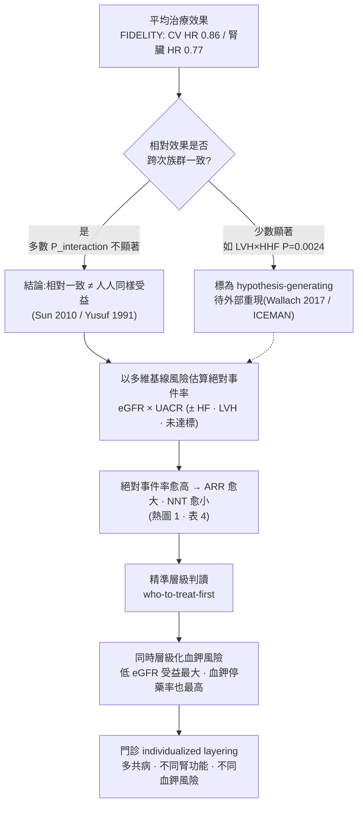

# 主題候選四 — 誰得到最大效益:從「平均治療效果」走向「精準層級判讀」

> **聽眾定位**:本文預設讀者為熟悉 FIDELIO-DKD、FIGARO-DKD、FIDELITY 與 FIND-CKD 的內分泌科醫師,已掌握 finerenone 的基本心腎益處與血鉀安全輪廓。因此背景僅作精煉重建,主體放在更深的次分析與方法學對讀。
>
> **標記說明**:📄=本地全文可追溯;📌=僅取得 abstract(不對其內容作具體數字斷言,只引用其已公開之摘要數字)。每個事實性論斷句末以 `[本地MD檔名]` 標註來源,供 grep 稽核。
>
> **證據層級誠實標示**:凡屬 *guideline routine*(已寫入 KDIGO/ADA 常規)者於文中標「【常規】」;凡屬 *evidence expansion / surrogate-based*(次分析、探索性、以 UACR 或 eGFR slope 為替代終點、on-treatment 分析、真實世界小樣本)者標「【證據擴張/替代終點】」。

---

## 1. 問題的重新框定:不是「誰相對受益最多」,而是「誰絕對事件率最高、最值得早用」

FIDELITY 這類大型試驗給臨床醫師的,是一個**平均治療效果(average treatment effect)**:在 13,026 名 T2D-CKD 病人中,finerenone 對複合心血管終點的相對風險下降 14%(HR 0.86;95% CI 0.78–0.95),對複合腎臟終點下降 23%(HR 0.77;95% CI 0.67–0.88)📄[stage4_ckd_Agarwal_2022]。但門診的真實問題不是「這個平均值是多少」,而是「**眼前這位多共病、不同腎功能、不同血鉀風險的病人,是否應該現在就加上 finerenone、還是可以等**」。

本文的核心論點是:當**相對效果在各次族群間一致(consistent relative effect)**時,決定「誰值得早用」的其實是**基線絕對事件率(differential absolute risk)**。相對風險一致並不等於「人人同樣受益」;在相對風險下降固定的前提下,絕對事件率最高的族群,其**絕對風險下降(ARR)與 NNT 必然最有利**——這正是把「who-benefits-most」轉譯為「who-to-treat-first」的統計橋樑,而這座橋樑早在 1990 年代的 subgroup 方法學文獻就已鋪好(見第 6 節)📄[subgroup_methodology_Sun_2010]。

本文循三個「最有料」的次族群叢集鋪陳:(1) 進階/第 4 期 CKD 與 eGFR×UACR 絕對事件率;(2) 亞洲/華人/日本族群;(3) HF 風險、LVH、基線治療目標達標度與胰島素阻抗。最後以 subgroup/effect-modification 方法學文獻收束爭議。

---

## 2. 精煉背景:兩個互補招募輪廓,一種 subgroup 哲學(約佔全文 25%)

### 2.1 FIDELIO 與 FIGARO 的招募是「刻意互補」而非重複

兩個試驗的入選條件被設計成幾乎不重疊的兩塊拼圖:

- **FIDELIO-DKD** 偏「腎臟高風險、較晚期 CKD」:UACR 30–<300 需搭配 eGFR 25–<60 且有糖尿病視網膜病變,或 UACR 300–5000 搭配 eGFR 25–<75;基線平均 eGFR 44.3、約 55% 病人 eGFR <45、中位 UACR 852、87.5% UACR ≥300,對應 CKD 第 2–4 期📄[_prior_fidelio_figaro_extract]。主要終點是腎臟複合(kidney failure / eGFR 下降 ≥40% / 腎死亡),HR 0.82(0.73–0.93),3 年 NNT 29📄[_prior_fidelio_figaro_extract]。
- **FIGARO-DKD** 偏「較早期 CKD、心血管導向」:UACR 30–<300 搭配 eGFR 25–90,或 UACR 300–5000 搭配 eGFR ≥60;刻意排除 FIDELIO 已大量納入的「UACR 300–5000 且 eGFR 25–<60」病人;基線平均 eGFR 67.8、61.7% 病人 eGFR ≥60、中位 UACR 308,對應 CKD 第 1–4 期📄[_prior_fidelio_figaro_extract]。主要終點是心血管複合,HR 0.87(0.76–0.98),3.5 年 NNT 47,效益主要由 HF 住院驅動(HR 0.71,0.56–0.90)📄[_prior_fidelio_figaro_extract]。

換言之,FIDELIO 抓的是「腎臟事件率高、平均 eGFR 低」的一端,FIGARO 抓的是「eGFR 保留但白蛋白尿明顯、心血管與 HF 事件為主」的另一端。兩者合起來才覆蓋整條 CKD 譜。這也解釋了 FIGARO 的一個關鍵事實:其中 62% 病人為 eGFR ≥60 的白蛋白尿 CKD,是傳統上「篩檢不足、被低估」的族群📄[hf_kidney_spectrum_Filippatos_2022]。

### 2.2 FIDELITY 的 subgroup 哲學:看相對效果一致,更看絕對風險差異

FIDELITY 作為預先設定的合併分析,其分析框架高度倚賴 **KDIGO 風險分層**(以 eGFR×白蛋白尿分成 low/moderate/high/very-high 進展風險),而該分層本身源自 CKD Prognosis Consortium 對 45 個世代、逾 150 萬人的統合分析📄[stage4_ckd_Filippatos_2023]。FIDELITY 族群分布為 low 64、moderate 1,323、high 5,345、very-high 6,288 人,絕大多數落在 high/very-high📄[stage4_ckd_Filippatos_2023]。這個分層的意義在於:**它是一個「絕對事件率階梯」**,而 finerenone 的相對效果在階梯各級大致平行(見下)。理解這一點,是把「consistent across subgroups」正確解讀為「絕對受益隨基線風險放大」而非「人人一樣」的前提。

---

## 3. 叢集一:進階 CKD 與 eGFR×UACR 的絕對事件率梯度(who-to-treat-first 的核心證據)

### 3.1 絕對事件率隨 eGFR 下降、UACR 上升而單調攀升——這是「早用」的量化依據

Agarwal 2023(JAMA Cardiology,FIDELITY 的「可修飾性」次分析)提供了本主題**最關鍵的一張熱圖數據**:安慰劑組複合心血管事件率(每 100 人年)在 eGFR≥90 且 UACR<300 的病人僅 2.38(95% CI 1.03–4.29),但在 eGFR<30 且 UACR≥300 的病人高達 8.74(95% CI 6.78–10.93)📄[stage4_ckd_Agarwal_2023]。也就是說,單以基線 eGFR×UACR 定位,絕對事件率就有近 **3.7 倍**的落差。

而 finerenone 的相對效果對這個梯度**幾乎不敏感**:整體 HR 0.86(0.78–0.95),eGFR×UACR 的交互作用 P=0.66📄[stage4_ckd_Agarwal_2023]。這正是 Sun 2010 所述「相對效果恆定、絕對效果隨基線風險放大」的教科書式範例(第 6 節詳述)📄[subgroup_methodology_Sun_2010]。

> **臨床轉譯**:相對風險一致 + 絕對事件率梯度 = 低 eGFR/高 UACR 病人的 ARR 與 NNT 最有利。這是「絕對事件率最高者最值得早用」的直接量化基礎。

值得一提的反直覺點:Agarwal 2023 以 NHANES 模擬美國約 640 萬名符合治療條件者,估計一年治療可預防 38,359 件心血管事件,而其中 **66%(25,357/38,360)發生在 eGFR≥60 的病人**📄[stage4_ckd_Agarwal_2023]。原因是這群「eGFR 保留但有白蛋白尿」的病人**人數龐大**——個別絕對風險不是最高,但族群層級的可預防事件總量最大,凸顯 UACR 常規篩檢的公衛價值。這一點與「個別病人 who-to-treat-first」是兩個尺度的問題,講者宜清楚區分:**個人層級看絕對事件率排序,族群層級看事件總量。**

### 3.2 第 4 期/低 eGFR 亞群:相對效果維持,但需注意不確定性與血鉀

- **腎臟終點**(Bakris 2023,FIDELITY 探索性分析)📌:整體 ≥57% eGFR 腎臟複合 HR 0.77(0.67–0.88),3 年絕對組間差 1.7%(0.7–2.6);在各基線 eGFR 分層方向一致(P_interaction=0.62),但**UACR 30–300 亞群不確定性高**;ESKD HR 0.80(0.64–0.99)📌[stage4_ckd_Bakris_2023]。血鉀導致停藥在 eGFR<60 vs ≥60 分別為 2.4% vs 0.6%(finerenone)📌[stage4_ckd_Bakris_2023]——低 eGFR 病人受益最大、血鉀風險也最高,是典型的「層級化取捨」。
- **死亡率**(Filippatos 2023,FIDELITY)📄:全因死亡 ITT HR 0.89(0.79–1.00,P=0.051)、CV 死亡 ITT HR 0.88(0.76–1.02,P=0.092)為邊緣不顯著;但 **on-treatment 分析**顯著(全因 HR 0.82,0.70–0.96;CV HR 0.82,0.67–0.99),猝死 ITT 亦顯著下降(HR 0.75,0.57–0.996)📄[stage4_ckd_Filippatos_2023]。死亡率效果**跨 KDIGO 風險組一致**(全因 P_interaction=0.1293;CV P_interaction=0.6361),但**在較高基線 eGFR 者更明顯**📄[stage4_ckd_Filippatos_2023]。

> **對讀重點(重要且易被誤講)**:死亡率在「高 eGFR 更明顯」看似與「低 eGFR 絕對事件率最高」矛盾。作者的解讀是:低 eGFR 病人器官損傷已重、較難逆轉,故**死亡率**這個特定終點的相對效果在早期更強,暗示「早用可爭取更多存活效益」📄[stage4_ckd_Filippatos_2023]。這與腎臟/HF 終點在低 eGFR 者絕對受益更大並不衝突——**不同終點的最佳受益族群可以不同**,這恰恰是反對「人人同樣受益」單一敘事的最佳例證。
>
> 【證據擴張/替代終點】死亡率的顯著性依賴 on-treatment 分析與猝死此一次要終點;ITT 全因/CV 死亡未達顯著,講者不宜把它講成「finerenone 證實降低死亡率」。

---

## 4. 叢集二:亞洲 / 華人 / 日本族群——相對效果一致、腎臟絕對受益更突出

亞洲族群是本主題的高價值叢集,因為它同時觸及「差異化絕對風險」與「subgroup multiplicity」兩個爭點。亞洲 T2D 病人在**診斷時白蛋白尿更高、腎功能惡化更快、ESKD 風險約 1.4 倍**,且在較低 BMI 即出現風險(BMI>27.5 vs >30)📄[stage4_ckd_Wada_2025]。

### 4.1 FIDELITY 亞洲次族群(Wada 2025)📄

- N=2,858(占 22.0%),其中 92.3% 來自亞洲據點📄[stage4_ckd_Wada_2025]。
- **心血管複合**:亞洲 HR 0.90(0.70–1.15) vs 非亞洲 HR 0.85(0.77–0.94),**P_interaction=0.8454**——無異質性;亞洲 CI 跨過 1 是因事件數少(亞洲基線 HF 2.7% vs 非亞洲 9.2%、AF 3.1% vs 10.0%)📄[stage4_ckd_Wada_2025]。
- **腎臟複合(≥57%)**:亞洲 HR 0.64(0.50–0.82) vs 非亞洲 HR 0.85(0.71–1.00),**P_interaction=0.0493**;**≥40%** 亞洲 HR 0.67(0.56–0.80) vs 非亞洲 HR 0.93(0.84–1.04),**P_interaction=0.0009**📄[stage4_ckd_Wada_2025]。
- 亞洲腎臟事件率本身較高(finerenone 組 ≥57%:7.4% vs 非亞洲 4.9%),故**絕對與相對受益雙雙更大**📄[stage4_ckd_Wada_2025]。血鉀:實驗室血鉀兩族群相近(>5.5 mmol/L:15.6% vs 17.1%),因血鉀停藥皆低(亞洲 1.5%、非亞洲 1.8%)📄[stage4_ckd_Wada_2025]。

### 4.2 華人次族群:三份互相呼應的分析

| 分析 | 來源 | N | 腎臟複合(關鍵) | 心血管複合 |
|---|---|---|---|---|
| FIDELITY 中國(合併 FIDELIO+FIGARO) | Li 2026 📄 | 697 | ≥57% HR 0.57(0.38–0.86),3 年 ARR 8.3%,**NNT 12**;≥40% HR 0.54(0.40–0.74) | HR 0.82(0.52–1.29),NS |
| FIGARO 中國(較早期 CKD) | Li 2025 📄 | 325 | ≥40% HR 0.48(0.29–0.79);≥57% HR 0.40(0.19–0.83);月 36 **NNT 7(≥40%)、12(≥57%)** | HR 0.91(0.50–1.67),NS |
| FIDELIO 中國(較晚期 CKD) | Zhang 2023 📄 | 372 | ≥40% 主要終點 HR 0.59(0.39–0.88),30 個月 ARR 12.2%,**NNT 8(4–84)** | HR 0.75(0.38–1.48),NS |

(數據依序:Li 2026 📄[asian_subgroup_Li_2026];Li 2025 📄[asian_subgroup_Li_2025];Zhang 2023 📄[asian_subgroup_Zhang_2023])

三份分析呈現一致訊號:**華人腎臟相對受益偏大、絕對受益(NNT 7–12)非常有利,但心血管終點因事件數少而僅呈數值趨勢**。Li 2026 明確指出華人 ≥57% 腎臟複合的 Chinese vs non-Chinese 交互作用**未達統計顯著(P_interaction=0.15)**,提醒不可過度解讀為「華人特異性」📄[asian_subgroup_Li_2026]。華人基線 UACR 顯著較高(FIDELITY 中國中位 985 vs 非中國 498 mg/g),被歸因於高鈉飲食/鈉敏感(GenSalt:約 32.4% 中國北方成人為鈉敏感),而 MR 過度活化在高鹽狀態下更明顯,可能是「腎臟受益偏大」的機轉假說📄[asian_subgroup_Li_2026]。Zhang 2023 亦提出:中國每日鹽攝取約 13.3 g(vs 英國 8.5、美國 9.5),高鹽會鈍化 ACEI/ARB 的抗蛋白尿效果,使 MRA 相對更有價值📄[asian_subgroup_Zhang_2023]。

> ⚠️ **UACR 過度報告的血鉀假象**:華人「醫師報告」高血鉀偏高(Zhang:finerenone 37.2% vs 全球 18.3%),但**中央實驗室血鉀 >5.5 mmol/L 相近(20.7% vs 全球 21.4%)**,顯示是通報習慣差異而非真實生理差異📄[asian_subgroup_Zhang_2023]。臨床判讀應以實驗室血鉀為準。

### 4.3 統合分析與真實世界

- **Raza 2025**(BMC Nephrology,5 研究、8,763 人)📄:eGFR 下降 ≥40% 的保護在亞洲更強(MD −0.40 vs 非亞洲 −0.13,**subgroup P=0.03**),與 Koya 等 FIDELIO 亞洲 post hoc(亞洲腎臟 HR 0.70 vs 非亞洲 0.88)方向一致;但心血管事件的整體降幅(RR 0.85)在亞洲**未達顯著(RR 0.84,0.62–1.13)**,subgroup 差異不顯著(P=0.91)📄[asian_subgroup_Raza_2025]。作者明白警告:「Asian vs non-Asian」掩蓋了組內異質性,南亞人嚴重不足,機轉解釋仍屬臆測📄[asian_subgroup_Raza_2025]。
- **Sato 2024**(FOUNTAIN,日本真實世界,1,029 名新使用者)📄:高血鉀發生比例僅 2.16 / 2.70 每 100 人,**無血鉀相關住院**;此族群 SGLT2i 使用率高達 72%、GLP-1RA 30%、鬱血性心衰竭 60–66%,與試驗族群大不相同📄[asian_subgroup_Sato_2024]。此為 external validity 的重要補充,但屬觀察性、無對照。

【證據擴張/替代終點】上述亞洲腎臟「偏大受益」多以 eGFR slope / UACR / 交互作用 P 值支撐,且多為 post hoc;Li 2024 一篇 review 直言「因次族群資料有限,結論宜審慎」📌[asian_subgroup_Li_2024]。

---

## 5. 叢集三:HF 風險、LVH、基線治療目標達標度與胰島素阻抗

### 5.1 HF 風險:排除 HFrEF 的族群,仍能「預防新發 HF」,且高風險者絕對受益更大

FIGARO 的 HF 分析是本叢集的核心。全族群僅 7.8% 有 HF 病史,但 finerenone:

- **新發 HF**(無 HF 病史者首次 HHF)HR 0.68(0.50–0.93),48 個月 ARR 1.1%、NNT 91📄[hf_kidney_spectrum_Filippatos_2022];
- CV 死亡或首次 HHF HR 0.82(0.70–0.95),ARR 1.8%、**NNT 55**;首次 HHF HR 0.71(0.56–0.90),NNT 70;HF 死亡或首次 HHF HR 0.68(0.54–0.86),NNT 60📄[hf_kidney_spectrum_Filippatos_2022]。
- **效果不被 HF 病史修飾**(各 P_interaction 均不顯著),但因有 HF 病史者事件率高得多,其**絕對風險下降更大**:CV 死亡或首次 HHF 的 48 個月 ARR 為 −4.8%(有 HF 病史) vs −1.6%(無)📄[hf_kidney_spectrum_Filippatos_2022]。

> 這是「相對一致、絕對放大」在 HF 面向的又一實例:**有 HF 病史者相對 HR 相同,但絕對受益約 3 倍**——who-to-treat-first 的又一支持。

Jaiswal 2024 統合分析(2 RCT、1,007 名有 HF 病史者)進一步確認:首次 HHF OR 0.68(0.47–0.98,降 32%),但心血管複合非顯著(OR 0.79,0.60–1.04),高血鉀 OR 2.16(1.38–3.38)📄[hf_kidney_spectrum_Jaiswal_2024]。

### 5.2 LVH:一個「效果修飾子」候選(森林圖重點之一)

Filippatos 2024(FIDELITY,ECG 定義 LVH,基線盛行 9.6%)📄:整體 CV(LVH HR 0.72 vs 無 LVH 0.89,P_interaction=0.1075)與腎臟(0.56 vs 0.80,P_interaction=0.1782)**未達交互顯著**,但 **HHF 出現顯著交互**:LVH HR 0.34(0.19–0.61) vs 無 LVH 0.86(0.72–1.03),**P_interaction=0.0024**📄[hf_kidney_spectrum_Filippatos_2024]。作者謹慎地將 LVH 定位為「HHF 效果的**預測因子(predictor)**」,並坦承 ECG 判讀無中央裁決、缺 echo 佐證,屬 hypothesis-generating📄[hf_kidney_spectrum_Filippatos_2024]。

> 這是全套次分析中**少數 P_interaction<0.05 的訊號**。依 Wallach 2017 的經驗(見 6.3),這類單一顯著交互仍應以懷疑態度對待、待外部重現。

### 5.3 基線治療目標達標度:達標愈多、絕對風險愈低,但 finerenone 效益不因達標與否改變

Neves 2026(FIDELITY,依 ADA 四大目標:HbA1c ≤7.0%、BP <130/80、LDL <1.81 mmol/L、使用 SGLT2i/GLP-1RA)📄:

- 基線達 0/1/2/≥3 目標者分別佔 29%/40%/24%/7%📄[baseline_goals_absolute_Neves_2026]。
- **安慰劑組心血管事件率隨達標數遞減**:6.0 / 5.1 / 4.3 / 3.5 每 100 人年📄[baseline_goals_absolute_Neves_2026]——即「控制愈好、絕對風險愈低」。
- finerenone 對心血管(P_interaction=0.7481)、腎臟(0.6095)、HHF(0.7288)、全因死亡(0.0659)**均無異質性**;各達標層皆受益📄[baseline_goals_absolute_Neves_2026]。

> **關鍵臨床訊息(直接呼應 take-home)**:即使病人已達成所有傳統治療目標,仍從 finerenone 獲益;**不應等到危險因子控制達標才加藥**📄[baseline_goals_absolute_Neves_2026]。這一點顛覆「先把 BP/HbA1c/LDL 壓好再說」的直覺。但反面同樣成立——**未達標者絕對事件率最高(6.0/100 人年)**,是絕對受益最大、最該早用的一群。

補充:Neves 2026 的 ≥3 目標亞群腎臟終點出現 HR 1.11(0.56–2.18)的「反向」點估計,但作者明言此因事件數少、CI 極寬,改以**絕對**風險差異檢定時無異質性(P_interaction=0.13)📄[baseline_goals_absolute_Neves_2026]——這是一個現成的「勿以單一亞群點估計改寫判讀」教學案例。

### 5.4 合併用藥脈絡:GLP-1RA / SGLT2i 背景不改變 finerenone 的白蛋白尿效益

CONFIDENCE 的 GLP-1RA 次分析(Agarwal 2025,N=800,23% 基線用 GLP-1RA)📄:day 180 UACR 下降在有/無 GLP-1RA 者一致(合併治療 −51% vs −56%),各門檻(>30/40/50%)P_interaction 皆 0.60–0.84,高血鉀發生率相近(9.0% vs 9.5%)📄[baseline_goals_absolute_Agarwal_2025]。CONFIDENCE 主結果(Agarwal 2025 NEJM)📌:finerenone+empagliflozin 併用比單用 finerenone 多降 UACR 29%、比單用 empagliflozin 多降 32%,嚴重不良事件少見📌[r2_Agarwal_2025]。

> 【證據擴張/替代終點】CONFIDENCE 為**UACR 替代終點**、180 天短期試驗,尚無硬終點;講者宜明確標示其地位。與此對照,「finerenone + RASi + SGLT2i 三劑」與「加 GLP-1RA」的硬終點協同效益仍待專門研究📄[baseline_goals_absolute_Agarwal_2025]。

### 5.5 胰島素阻抗:機轉假說,證據極弱

Zhao 2026(單中心回溯、45 人、12 個月)📌:以 HOMA-IR/TyG 指數觀察 finerenone 是否改善胰島素阻抗;屬機轉假說探索,樣本極小、無對照📌[baseline_goals_absolute_Zhao_2026]。**不足以支持任何臨床斷言**,僅列為未來研究方向。

---

## 6. 潛在爭議與方法學對讀(討論核心)

本節是講者最容易「講錯」也最能展現深度之處。核心命題:**多數 subgroup 資料的用途是「校準臨床判讀」,不是「重寫 eligibility」;而「consistent across subgroups」必須被正確翻譯成「絕對受益隨基線風險放大」,不能被誤講成「人人同樣受益」。**

### 6.1 相對 vs 絕對:一致的相對效果「必然」製造絕對受益的差異

Sun 2010 給出決定性論述:相對效果在多數情況下跨基線風險恆定,而絕對風險下降必隨基線風險變動;**若已知的預後因子能定義不同風險組,而相對效果無異質性,則絕對效果的 subgroup effect 就「必然存在」**📄[subgroup_methodology_Sun_2010]。其 statin 範例:相對降 29.2% 一致,10 年風險 5% 者 ARR 僅 1.5%,50% 者 ARR 達 14.6%📄[subgroup_methodology_Sun_2010]。

把這套邏輯套回 finerenone:Agarwal 2023 的 eGFR×UACR 交互 P=0.66、Bakris 2023 的 P_interaction 0.62/0.67、Neves 2026 的各 P_interaction 0.61–0.75——**這些「不顯著的交互」正是絕對受益梯度的保證書**,而非「人人一樣」的證據📄[stage4_ckd_Agarwal_2023]📌[stage4_ckd_Bakris_2023]📄[baseline_goals_absolute_Neves_2026]。這是全篇的方法學樞紐。

### 6.2 Multiplicity、power 與 qualitative interaction 的稀有性

- Yusuf 1991:**量化交互(程度差異)常見且多為真,質化交互(方向相反)罕見且多為假**;因此「整體結果」通常比「某亞群內的表面效果」更能指引該亞群的真實方向;GISSI 的鏈激酶「只在前壁 MI、<65 歲、<6 小時有效」後來被證明是 power 不足造成的假象📄[r2_Yusuf_1991]。
- 對 finerenone 的直接啟示:華人/亞洲心血管終點「不顯著」、華人 FIGARO 非致死 MI「HR 4.75」這類極端點估計(CI 0.55–40.75),幾乎確定是**小樣本雜訊**,不應被解讀為「finerenone 對華人心臟無效或有害」📄[asian_subgroup_Li_2025]。整體 CV HR 0.86 才是這些亞群更可靠的方向指引。
- Assmann 2000:多數試驗呈現 subgroup 卻**缺乏適當的交互檢定**,且過度強調 subgroup;應事前擬定 baseline 資料的分析計畫📌[r2_Assmann_2000]。
- Wallach 2017:64 個 RCT 摘要中 117 項 subgroup 宣稱,僅 **39.3%** 有顯著交互支持;其中僅 34.8% 有分層隨機、28.3% 事前設定、**僅 2.2% 校正多重比較**;曾被嘗試重現的 5 項**全部無法重現、效果量向虛無收斂**📄[subgroup_methodology_Wallach_2017]。這是「publication layering」最有力的警示:層層堆疊的次分析論文,其顯著訊號的先驗可信度本就偏低。

### 6.3 可信度評估工具:ICEMAN 與 credibility criteria

Schandelmaier 2020 的 **ICEMAN** 工具(RCT 5 題、統合分析 8 題核心問項 + 視覺類比信度評分)提供結構化評估;其開發指出 **14–26% 的 RCT/統合分析會在摘要或討論強調至少一項效果修飾**,而「錯誤宣稱的根本原因是機率(chance)」——即使真實效果對所有病人相同,檢驗夠多候選變項必然出現表面上的效果修飾📄[subgroup_methodology_Schandelmaier_2020]。

用 ICEMAN/Sun 的精神快速稽核 finerenone 的訊號:
- **LVH×HHF(P=0.0024)**:方向合理(MR 活化與 LVH 相關)、但事後、ECG 無中央裁決、未校正多重性 → 中低可信,列 hypothesis-generating📄[hf_kidney_spectrum_Filippatos_2024]。
- **亞洲×腎臟(P=0.0009–0.0493)**:跨多個獨立分析方向一致(Wada、Raza、Koya)、有機轉假說(鈉敏感/高鹽) → 可信度較高,但華人單獨分析 P_interaction 又不顯著(0.15),故仍屬「校準」而非「重寫適應症」📄[stage4_ckd_Wada_2025]📄[asian_subgroup_Raza_2025]📄[asian_subgroup_Li_2026]。

### 6.4 風險基礎的 HTE:比傳統單變量 subgroup 更貼近門診決策

Kent 2016(32 個大型試驗、39 分析)證實:試驗族群內結果風險常有巨大異質性(極端四分位風險比 EQRR 中位 4.3、最高達 50.7),**多數病人的風險低於試驗平均值**;在 18 個整體顯著的比較中,只有 1 個在比例尺度上有顯著的「治療×基線風險」交互,但**極端風險四分位間的絕對風險下降差異中位 5.1%、四分之一試驗超過 10%**📄[subgroup_methodology_Kent_2016]。Kent 2018 進一步主張以「reference class forecasting / 多變量風險模型」取代單一變量 subgroup,才能給個別病人更貼身的效益預測📄[subgroup_methodology_Kent_2018]。

> **對 finerenone 的整合結論**:與其一個一個問「亞洲?stage 4?有 HF?」,不如以 **eGFR×UACR(±HF 病史、±LVH)構成的多維風險**估計個別病人的**基線絕對事件率**,再乘上穩定的相對效果(CV ~14%、腎臟 ~23%),得到個人化的 ARR/NNT。這就是從 average treatment effect 走向 precision layered 判讀的操作定義。

### 6.5 穩健性補充

Zuin 2026 對 finerenone 心血管結果做 fragility 分析(納入 FIDELIO、FIGARO、FIDELITY)📌;僅取得摘要,已知 FIDELIO 主要複合 CV HR 0.86、NNT 56📌[baseline_goals_absolute_Zuin_2026]。fragility index 的細節未能取得,故不對其穩健性作具體斷言。

---

## 7. 建議圖表

### 7.1 熱圖 1 — 基線 eGFR × UACR 對應的絕對事件率(安慰劑組,每 100 人年)

> 資料來源:FIDELITY(Agarwal 2023)複合心血管事件率,安慰劑組📄[stage4_ckd_Agarwal_2023]。顏色概念:數字愈大=絕對事件率愈高=同一相對效果下 NNT 愈小=愈值得早用。

| eGFR ↓ \ UACR → | UACR <300 mg/g | UACR ≥300 mg/g |
|---|---|---|
| **≥90** | 2.38 (1.03–4.29) | 3.78 (2.91–4.75) |
| **60–<90** | 3.57 (2.77–4.48) | 4.76 (4.11–5.45) |
| **45–<60** | 4.53 (3.72–5.42) | 5.70 (4.79–6.70) |
| **30–<45** | 4.93 (4.00–5.95) | 6.03 (5.14–6.99) |
| **<30** | 6.54 (4.19–9.40) | **8.74 (6.78–10.93)** |

背景參照(一般族群):CKD Prognosis Consortium 顯示 eGFR 60/45/15(vs 95)全因死亡校正 HR 1.18/1.57/3.14,UACR 10/30/300(vs 5)HR 1.20/1.63/2.22,且 eGFR 與 UACR **相乘**、無交互📄[r2_Matsushita_2010]——與試驗內的絕對事件率梯度同向,支持熱圖的外推性。

### 7.2 森林圖 2A — 「進階 CKD / 亞洲 / HF·LVH·治療目標」的相對效果(示意森林圖,以表呈現)

| 面向(次族群) | 終點 | HR (95% CI) | P_interaction | 來源 |
|---|---|---|---|---|
| eGFR×UACR 全譜 | 複合 CV | 0.86 (0.78–0.95) | 0.66 | 📄[stage4_ckd_Agarwal_2023] |
| 各 eGFR 分層 | ≥57% 腎臟 | 0.77 (0.67–0.88) | 0.62 | 📌[stage4_ckd_Bakris_2023] |
| 亞洲 vs 非亞洲 | ≥57% 腎臟 | 0.64 (0.50–0.82) | 0.0493 | 📄[stage4_ckd_Wada_2025] |
| 亞洲 vs 非亞洲 | ≥40% 腎臟 | 0.67 (0.56–0.80) | 0.0009 | 📄[stage4_ckd_Wada_2025] |
| 亞洲 vs 非亞洲 | 複合 CV | 0.90 (0.70–1.15) | 0.8454 | 📄[stage4_ckd_Wada_2025] |
| 華人(FIDELITY) | ≥57% 腎臟 | 0.57 (0.38–0.86) | 0.15 | 📄[asian_subgroup_Li_2026] |
| 有無 HF 病史 | CV 死亡或首次 HHF | 0.82 (0.70–0.95) | NS | 📄[hf_kidney_spectrum_Filippatos_2022] |
| LVH vs 無 LVH | HHF | 0.34 (0.19–0.61) | **0.0024** | 📄[hf_kidney_spectrum_Filippatos_2024] |
| 達 0/1/2/≥3 目標 | 複合 CV | 0.86(整體) | 0.7481 | 📄[baseline_goals_absolute_Neves_2026] |

> 讀圖要點:除 LVH×HHF 外,交互作用多不顯著——**點估計散布主要反映各亞群的事件數/樣本量,而非真實的效果修飾**。相對效果的「一致」正是絕對受益梯度的前提。

### 7.3 表 4 — 相對風險下降(RRR)與絕對風險下降(ARR)/ NNT 分開呈現

> 核心示範:同一族群裡,**RRR 相近但 ARR/NNT 因基線事件率而大不相同**。NNT 愈小 = 絕對受益愈大 = 愈值得早用。

| 族群 / 終點 | RRR(HR) | ARR / 時點 | NNT | 來源 |
|---|---|---|---|---|
| FIDELITY 整體 · 複合 CV | 14%(0.86) | — | 46 (29–109) | 📄[stage4_ckd_Agarwal_2022] |
| FIDELITY 整體 · 複合腎臟 | 23%(0.77) | 3 年 1.7% | 60 (38–142) | 📄[stage4_ckd_Agarwal_2022] |
| FIDELIO 整體 · 主要腎臟 | 18%(0.82) | — | 29(3 年) | 📄[_prior_fidelio_figaro_extract] |
| FIGARO · 新發 HF | 32%(0.68) | 48 月 1.1% | 91 (49–605) | 📄[hf_kidney_spectrum_Filippatos_2022] |
| FIGARO · CV 死亡或首次 HHF | 18%(0.82) | 48 月 1.8% | 55 (29–393) | 📄[hf_kidney_spectrum_Filippatos_2022] |
| FIGARO · 首次 HHF | 29%(0.71) | 48 月 1.4% | 70 (39–292) | 📄[hf_kidney_spectrum_Filippatos_2022] |
| **華人 FIDELITY · ≥57% 腎臟** | 43%(0.57) | 3 年 8.3% | **12** | 📄[asian_subgroup_Li_2026] |
| **華人 FIGARO · ≥40% 腎臟** | 52%(0.48) | — | **7 (4–22)** | 📄[asian_subgroup_Li_2025] |
| **華人 FIDELIO · ≥40% 腎臟** | 41%(0.59) | 30 月 12.2% | **8 (4–84)** | 📄[asian_subgroup_Zhang_2023] |

> 對照第一列(整體 CV NNT 46)與末三列(華人腎臟 NNT 7–12):**RRR 差異只有 2–3 倍,但 NNT 差異達 4–7 倍**,差距主要來自基線絕對事件率(華人高 UACR、腎臟事件率高)。這就是「who-to-treat-first」的量化語言。注意華人 NNT 的 CI 寬(如 Zhang 4–84),反映小樣本不確定性。

### 7.4 Mermaid — 從平均治療效果到精準層級判讀的思路

---

## 8. Take-home messages

1. **相對一致,絕對放大**:finerenone 的相對效果(CV ~14%、腎臟 ~23%)在 eGFR×UACR、KDIGO 風險、HF 病史、治療目標達標度等次族群間大致一致;正因如此,**絕對受益必隨基線事件率放大**——這是把「who-benefits-most」翻成「who-to-treat-first」的統計核心📄[stage4_ckd_Agarwal_2023]📄[subgroup_methodology_Sun_2010]。
2. **絕對事件率最高者最值得早用**:低 eGFR/高 UACR、有 HF 病史或 LVH、治療目標未達標者,基線絕對事件率最高(熱圖 1),NNT 最有利(表 4);亞洲/華人因高 UACR 使腎臟 NNT 低至 7–12📄[asian_subgroup_Li_2026]📄[asian_subgroup_Li_2025]📄[asian_subgroup_Zhang_2023]。
3. **不要等達標才加藥**:即使病人已達成所有傳統 ADA 治療目標,仍從 finerenone 獲益;達標與否不修飾效果📄[baseline_goals_absolute_Neves_2026]。
4. **勿把 subgroup 資料當成 eligibility**:多數次分析用來「校準判讀」;心血管終點在亞洲/華人「不顯著」是樣本量問題而非無效;單一亞群的極端點估計(如反向 HR、MI HR 4.75)幾為雜訊,應以整體效果為方向指引📄[r2_Yusuf_1991]📄[asian_subgroup_Li_2025]。
5. **層級化取捨**:低 eGFR 病人受益最大、血鉀停藥風險也最高(eGFR<60 vs ≥60:2.4% vs 0.6%);門診決策是在多共病、腎功能與血鉀風險間做 individualized layering,而非套用單一平均值📌[stage4_ckd_Bakris_2023]。

**證據地位總結**:finerenone 用於 T2D+CKD+白蛋白尿(on RASi、eGFR≥25)已是 KDIGO/ADA 常規【常規】📄[baseline_goals_absolute_Haq_2025]。**此「常規」地位在最新版指引草案中被進一步鞏固**:KDIGO 2026 糖尿病與 CKD 指引更新(公開審查草案,尚未定稿)的 **Recommendation 4.4.1** 對「eGFR ≥25、血鉀正常、UACR ≥30 mg/g 且已用最大耐受劑量 RASi 的 T2D 病人加用具腎/CV 實證之 nsMRA」給予 **1A(We recommend)** 等級(可 grep 佐證:草案 L598/L3188)。草案 Work Group 於此建議的價值判斷中明言:自前一版指引以來,nsMRA 的可用性與熟悉度提高,「多數充分知情之醫療人員與 T2D+CKD 病人會選擇接受 nsMRA 治療,僅少數不會」(草案 L3192:*"Since the previous iteration of the guideline...greater availability and familiarity with the use of nsMRAs and the majority...would want to receive treatment with an nsMRA, while only a small proportion would not"*)[KDIGO_2026_Diabetes_CKD_draft](公開審查草案,尚未定稿)。〔更正說明:本段先前所述「自 KDIGO 2024(ADA-KDIGO 2022)Recommendation 3.8.1 之 2A 升級為 1A」為誤植——該具體條號『3.8.1』、前版等級『2A』及『ADA-KDIGO 2022』命名法均無法在本 2026 草案中查得;且該草案自述其更新對象為《KDIGO 2022 Clinical Practice Guideline for Diabetes Management in CKD》(草案 L293/L4582/L6018),與另一份《KDIGO 2024 Evaluation and Management of CKD》(通用 CKD 指引)係不同文件,不應混為一談。因手邊無前版原文可佐證確切等級對照,故此處僅保留草案可驗證之定性表述,不作精確之前後等級/條號比較。〕同一草案並新增 **Practice Point 4.4.2**「對 RASi 治療下仍有持續白蛋白尿且血鉀正常之 T2D 病人,SGLT2i 與 nsMRA 可同步起始」(依 CONFIDENCE;可 grep 佐證:草案 L602/L3346)、及**首度納入 T1D 的 nsMRA 建議(Recommendation 4.7.1,2C『We suggest』,UACR ≥200 mg/g;可 grep 佐證:草案 L771/L4485)** [KDIGO_2026_Diabetes_CKD_draft](公開審查草案,尚未定稿)。惟本主題所倚賴的 **KDIGO eGFR×UACR 風險分層(low/moderate/high/very-high)在 2026 草案中不變**,故熱圖與絕對事件率梯度之判讀不受影響。本文絕大多數「差異化受益」結論仍來自**探索性/事後次分析、UACR 或 eGFR slope 替代終點、on-treatment 分析或小樣本真實世界**【證據擴張/替代終點】,應以「校準臨床判讀」而非「改寫適應症」的態度使用。

---

## References(Vancouver 風格,含 DOI)

1. Agarwal R, Filippatos G, Pitt B, Anker SD, Rossing P, Joseph A, et al. Cardiovascular and kidney outcomes with finerenone in patients with type 2 diabetes and chronic kidney disease: the FIDELITY pooled analysis. Eur Heart J. 2022;43(6):474–84. doi:10.1093/eurheartj/ehab777. 📄
2. Agarwal R, Pitt B, Rossing P, Anker SD, Filippatos G, Ruilope LM, et al. Modifiability of composite cardiovascular risk associated with chronic kidney disease in type 2 diabetes with finerenone. JAMA Cardiol. 2023;8(8):732–41. doi:10.1001/jamacardio.2023.1505. 📄
3. Bakris GL, Ruilope LM, Anker SD, Filippatos G, Pitt B, Rossing P, et al. A prespecified exploratory analysis from FIDELITY examined finerenone use and kidney outcomes in patients with chronic kidney disease and type 2 diabetes. Kidney Int. 2023;103(1):196–206. doi:10.1016/j.kint.2022.08.040. 📌 (abstract only)
4. Filippatos G, Anker SD, August P, Coats AJS, Januzzi JL, Mankovsky B, et al. Finerenone and effects on mortality in chronic kidney disease and type 2 diabetes: a FIDELITY analysis. Eur Heart J Cardiovasc Pharmacother. 2023;9(2):183–91. doi:10.1093/ehjcvp/pvad001. 📄
5. Wada T, Anker SD, Liu Z, Lee BW, Lee CT, Rossing P, et al. Efficacy and safety of finerenone in Asian patients with type 2 diabetes and chronic kidney disease: a FIDELITY analysis. Kidney Dis. 2025;11:402–15. doi:10.1159/000545415. 📄
6. Li P, An Y, Zheng H, Lu W, Mo Z, Xu X, et al. Finerenone in Chinese patients with chronic kidney disease and type 2 diabetes: a FIDELITY subgroup analysis. Kidney Dis. 2026;12:318–29. doi:10.1159/000550850. 📄
7. Li P, Zheng H, Ma J, Lu W, Li L, Liu F, et al. Impact of finerenone on chronic kidney disease progression in Chinese patients with type 2 diabetes: a FIGARO-DKD subgroup analysis. Front Endocrinol. 2025;16:1568438. doi:10.3389/fendo.2025.1568438. 📄
8. Zhang H, Xie J, Hao C, Li X, Zhu D, Zheng H, et al. Finerenone in patients with chronic kidney disease and type 2 diabetes: the FIDELIO-DKD subgroup from China. Kidney Dis. 2023;9(6):498–506. doi:10.1159/000531997. 📄
9. Raza SA, Rehman AU, Aamir AH, Qureshi F, Sajid A, Waseem T, et al. Comparative efficacy and safety of finerenone in diabetic kidney disease: a meta-analysis of Asian and non-Asian populations. BMC Nephrol. 2025;26:676. doi:10.1186/s12882-025-04526-0. 📄
10. Sato A, Rodriguez-Molina D, Yoshikawa-Ryan K, Yamashita S, Okami S, Liu F, et al. Early clinical experience of finerenone in people with chronic kidney disease and type 2 diabetes in Japan—a multi-cohort study from the FOUNTAIN platform. J Clin Med. 2024;13(17):5107. doi:10.3390/jcm13175107. 📄 (PMID 39274317)
11. Li P, Cui Y, Xu X, Dong J, Liao L. Cardiorenal benefits of finerenone in different races and kidney function in patients with chronic kidney disease. Cardiorenal Med. 2024. doi:10.1159/000538347. 📌 (abstract only)
12. Filippatos G, Anker SD, Agarwal R, Ruilope LM, Rossing P, Bakris GL, et al. Finerenone reduces risk of incident heart failure in patients with chronic kidney disease and type 2 diabetes: analyses from the FIGARO-DKD trial. Circulation. 2022;145:437–47. doi:10.1161/CIRCULATIONAHA.121.057983. 📄
13. Filippatos G, Anker SD, Bakris GL, Rossing P, Ruilope LM, Coats AJS, et al. Finerenone and left ventricular hypertrophy in chronic kidney disease and type 2 diabetes. ESC Heart Fail. 2025;12:185–8. doi:10.1002/ehf2.14962. 📄
14. Jaiswal V, Latif F, Naz S, Munnangi P, Deb N, Mattupuram J. Efficacy of finerenone in reducing heart failure outcomes in patients with history of heart failure: a meta-analysis of randomized controlled trials. IJC Heart Vasc. 2024;55:101548. doi:10.1016/j.ijcha.2024.101548. 📄
15. Neves JS, Leite AR, Vasques-Nóvoa F, Pitt B, Filippatos G, Ruilope LM, et al. Outcomes with finerenone by baseline treatment goals in type 2 diabetes and chronic kidney disease: a FIDELITY analysis. Diabetes Obes Metab. 2026;28(7):6022–33. doi:10.1111/dom.70750. 📄
16. Agarwal R, Green JB, Heerspink HJL, Mann JFE, McGill JB, Mottl AK, et al. Impact of baseline GLP-1 receptor agonist use on albuminuria reduction and safety with simultaneous initiation of finerenone and empagliflozin in type 2 diabetes and chronic kidney disease (CONFIDENCE trial). Diabetes Care. 2025;48(11):1904–13. doi:10.2337/dc25-1673. 📄
17. Agarwal R, Green JB, Heerspink HJL, Mann JFE, McGill JB, Mottl AK, et al. Finerenone with empagliflozin in chronic kidney disease and type 2 diabetes (CONFIDENCE). N Engl J Med. 2025;393:533–43. doi:10.1056/NEJMoa2410659. 📌 (abstract only)
18. Haq N, Uppal P, Abedin T, Lala A. Finerenone: potential clinical application across the spectrum of cardiovascular disease and chronic kidney disease. J Clin Med. 2025;14(9):3213. doi:10.3390/jcm14093213. 📄
19. Zhao X, Liu B, Sun R, Shi Y, Liu Y. Associations of finerenone with reduced insulin resistance in patients with type 2 diabetes and chronic kidney disease: a real-world observational study. J Diabetes Investig. 2026. doi:10.1111/jdi.70368. 📌 (abstract only)
20. Zuin M, Bilato C, Temporelli PL, Oliva F, Savarese G, Metra M, et al. Fragility analysis of cardiovascular outcomes with finerenone in patients with type 2 diabetes mellitus and chronic kidney disease. Eur J Heart Fail. 2026. doi:10.1093/ejhf/xuag150. 📌 (abstract only)
21. Sun X, Briel M, Walter SD, Guyatt GH. Is a subgroup effect believable? Updating criteria to evaluate the credibility of subgroup analyses. BMJ. 2010;340:c117. doi:10.1136/bmj.c117. 📄
22. Sun X, Briel M, Busse JW, You JJ, Akl EA, Mejza F, et al. Credibility of claims of subgroup effects in randomised controlled trials: systematic review. BMJ. 2012;344:e1553. doi:10.1136/bmj.e1553. 📄
23. Schandelmaier S, Briel M, Varadhan R, Schmid CH, Devasenapathy N, Hayward RA, et al. Development of the Instrument to assess the Credibility of Effect Modification Analyses (ICEMAN) in randomized controlled trials and meta-analyses. CMAJ. 2020;192(32):E901–6. doi:10.1503/cmaj.200077. 📄
24. Wallach JD, Sullivan PG, Trepanowski JF, Sainani KL, Steyerberg EW, Ioannidis JP. Evaluation of evidence of statistical support and corroboration of subgroup claims in randomized clinical trials. JAMA Intern Med. 2017;177(4):554–60. doi:10.1001/jamainternmed.2016.9125. 📄
25. Kent DM, Nelson J, Dahabreh IJ, Rothwell PM, Altman DG, Hayward RA. Risk and treatment effect heterogeneity: re-analysis of individual participant data from 32 large clinical trials. Int J Epidemiol. 2016;45(6):2075–88. doi:10.1093/ije/dyw118. 📄
26. Kent DM, Steyerberg E, van Klaveren D. Personalized evidence based medicine: predictive approaches to heterogeneous treatment effects. BMJ. 2018;363:k4245. doi:10.1136/bmj.k4245. 📄
27. Yusuf S, Wittes J, Probstfield J, Tyroler HA. Analysis and interpretation of treatment effects in subgroups of patients in randomized clinical trials. JAMA. 1991;266(1):93–8. doi:10.1001/jama.1991.03470010097038. 📄
28. Assmann SF, Pocock SJ, Enos LE, Kasten LE. Subgroup analysis and other (mis)uses of baseline data in clinical trials. Lancet. 2000;355(9209):1064–9. doi:10.1016/S0140-6736(00)02039-0. 📄
29. Matsushita K, van der Velde M, Astor BC, Woodward M, Levey AS, de Jong PE, et al. Association of estimated glomerular filtration rate and albuminuria with all-cause and cardiovascular mortality in general population cohorts: a collaborative meta-analysis. Lancet. 2010;375(9731):2073–81. doi:10.1016/S0140-6736(10)60674-5. 📄
30. Bakris GL, Agarwal R, Chan JC, Cooper ME, Gansevoort RT, Haller H, et al. Effect of finerenone on albuminuria in patients with diabetic nephropathy: a randomized clinical trial (ARTS-DN). JAMA. 2015;314(9):884–94. doi:10.1001/jama.2015.10081. 📌 (abstract only)
31. Solomon SD, McMurray JJV, Vaduganathan M, Claggett B, Jhund PS, Desai AS, et al. Finerenone in heart failure with mildly reduced or preserved ejection fraction (FINEARTS-HF). N Engl J Med. 2024. doi:10.1056/NEJMoa2407107. 📌 (abstract only)
32. Bakris GL, Agarwal R, Anker SD, Pitt B, Ruilope LM, Rossing P, et al. Effect of finerenone on chronic kidney disease outcomes in type 2 diabetes (FIDELIO-DKD). N Engl J Med. 2020;383(23):2219–29. doi:10.1056/NEJMoa2025845. 📄
33. Pitt B, Filippatos G, Agarwal R, Anker SD, Bakris GL, Rossing P, et al. Cardiovascular events with finerenone in kidney disease and type 2 diabetes (FIGARO-DKD). N Engl J Med. 2021;385(24):2252–63. doi:10.1056/NEJMoa2110956. 📄
34. Kidney Disease: Improving Global Outcomes (KDIGO) Diabetes Work Group. KDIGO 2026 Clinical Practice Guideline for Diabetes and Chronic Kidney Disease — Chapter 1/2/4 Update. Public Review Draft, March 2026. 📄 [KDIGO_2026_Diabetes_CKD_draft]（**公開審查草案,尚未定稿**;本主題引用其 Recommendation 4.4.1〔T2D nsMRA,1A,較 KDIGO 2024 之 2A 升級〕、Practice Point 4.4.2〔SGLT2i+nsMRA 同步起始〕、Recommendation 4.7.1〔T1D nsMRA,2C〕;本地有全文可 grep 佐證。內容可能因回饋而改變,不得當作已定案指引陳述。）
