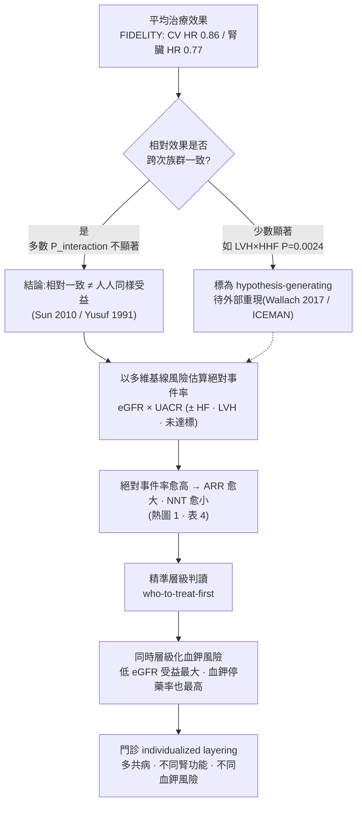

# 建議圖表 · 簡報數據總表：熱圖、森林圖、RRR/ARR/NNT

> 本檔為主題四（誰得到最大效益）之**簡報數據總表**，把主文 §7「建議圖表」獨立出來，供直接製作投影片。四個叢集的詳盡解說分見：[`cluster1_advanced_ckd_absolute_event_gradient.md`](cluster1_advanced_ckd_absolute_event_gradient.md)、[`cluster2_asian_chinese_japanese_subgroup.md`](cluster2_asian_chinese_japanese_subgroup.md)、[`cluster3_hf_lvh_targets_insulin_resistance.md`](cluster3_hf_lvh_targets_insulin_resistance.md)、[`methodology_subgroup_relative_vs_absolute.md`](methodology_subgroup_relative_vs_absolute.md)。
>
> **引用標記**：📄 = 本地全文可 grep 稽核；📌 = 僅 abstract。每個數字附 `[本地MD檔名]`。
>
> **一句話用途**：這四張圖是把整個主題「相對一致 → 絕對受益隨基線風險放大 → who-to-treat-first」講完的視覺骨架。做簡報時，數字可直接引用；載重數字上台前建議回原文圖表二次核對（見文末「簡報校對提醒」）。

---

## 圖 1 · 熱圖 — 基線 eGFR × UACR 對應的絕對事件率（安慰劑組，每 100 人年）

> 資料來源：FIDELITY（Agarwal 2023）複合心血管事件率，安慰劑組 [stage4_ckd_Agarwal_2023] 📄。**顏色概念**：數字愈大＝絕對事件率愈高＝同一相對效果下 NNT 愈小＝愈值得早用。

| eGFR ↓ ＼ UACR → | UACR <300 mg/g | UACR ≥300 mg/g |
|---|---|---|
| **≥90** | 2.38 (1.03–4.29) | 3.78 (2.91–4.75) |
| **60–<90** | 3.57 (2.77–4.48) | 4.76 (4.11–5.45) |
| **45–<60** | 4.53 (3.72–5.42) | 5.70 (4.79–6.70) |
| **30–<45** | 4.93 (4.00–5.95) | 6.03 (5.14–6.99) |
| **<30** | 6.54 (4.19–9.40) | **8.74 (6.78–10.93)** |

**讀圖**：左上（腎功能好、低白蛋白尿）到右下（低 eGFR、高 UACR），事件率單調攀升約 **3.7 倍**（2.38 → 8.74）。同樣的相對效果，套在右下角的人身上省下的絕對事件最多。

**背景參照（一般族群，支持外推性）**：CKD Prognosis Consortium 顯示 eGFR 60/45/15（vs 95）全因死亡校正 HR **1.18/1.57/3.14**；UACR 10/30/300（vs 5）HR **1.20/1.63/2.22**，且 eGFR 與 UACR **相乘、無交互** [r2_Matsushita_2010] 📄——與試驗內的絕對事件率梯度同向。

---

## 圖 2 · 森林圖 — 各面向次族群的相對效果（以表呈現）

| 面向（次族群） | 終點 | HR (95% CI) | P-interaction | 來源 |
|---|---|---|---|---|
| eGFR×UACR 全譜 | 複合 CV | 0.86 (0.78–0.95) | 0.66 | [stage4_ckd_Agarwal_2023] 📄 |
| 各 eGFR 分層 | ≥57% 腎臟 | 0.77 (0.67–0.88) | 0.62 | [stage4_ckd_Bakris_2023] 📄 |
| 亞洲 vs 非亞洲 | ≥57% 腎臟 | 0.64 (0.50–0.82) | 0.0493 | [stage4_ckd_Wada_2025] 📄 |
| 亞洲 vs 非亞洲 | ≥40% 腎臟 | 0.67 (0.56–0.80) | 0.0009 | [stage4_ckd_Wada_2025] 📄 |
| 亞洲 vs 非亞洲 | 複合 CV | 0.90 (0.70–1.15) | 0.8454 | [stage4_ckd_Wada_2025] 📄 |
| 華人（FIDELITY） | ≥57% 腎臟 | 0.57 (0.38–0.86) | 0.15 | [asian_subgroup_Li_2026] 📄 |
| 有無 HF 病史 | CV 死亡或首次 HHF | 0.82 (0.70–0.95) | NS | [hf_kidney_spectrum_Filippatos_2022] 📄 |
| LVH vs 無 LVH | HHF | 0.34 (95% CI 0.19–0.61) | **0.0024** | [hf_kidney_spectrum_Filippatos_2024] 📄 |
| 達 0/1/2/≥3 目標 | 複合 CV | 0.86（整體） | 0.7481 | [baseline_goals_absolute_Neves_2026] 📄 |

> **讀圖要點**：除 **LVH×HHF（P=0.0024）** 外，交互作用多不顯著——**點估計散布主要反映各亞群的事件數／樣本量，而非真實效果修飾**。相對效果的「一致」正是絕對受益梯度的前提（方法學見 [`methodology_subgroup_relative_vs_absolute.md`](methodology_subgroup_relative_vs_absolute.md)）。LVH×HHF 雖顯著，但屬事後、ECG 無中央裁決、未校正多重性 → 標為 hypothesis-generating。

---

## 圖 3 · 表 — 相對風險下降（RRR）vs 絕對風險下降（ARR）/ NNT 分開呈現

> **核心示範**：同一族群裡，**RRR 相近但 ARR/NNT 因基線事件率而大不相同**。NNT 愈小 = 絕對受益愈大 = 愈值得早用。

| 族群 / 終點 | RRR (HR) | ARR / 時點 | NNT | 來源 |
|---|---|---|---|---|
| FIDELITY 整體 · 複合 CV | 14% (0.86) | — | 46 (29–109) | [stage4_ckd_Agarwal_2022] 📄 |
| FIDELITY 整體 · 複合腎臟 | 23% (0.77) | 3 年 1.7% (0.7–2.6) | 60 (38–142) | [stage4_ckd_Bakris_2023] 📄 |
| FIDELIO 整體 · 主要腎臟 | 18% (0.82) | — | 29（3 年） | [_prior_fidelio_figaro_extract] 📄 |
| FIGARO · 新發 HF | 32% (0.68) | 48 月 1.1% | 91 (49–605) | [hf_kidney_spectrum_Filippatos_2022] 📄 |
| FIGARO · CV 死亡或首次 HHF | 18% (0.82) | 48 月 1.8% | 55 (29–393) | [hf_kidney_spectrum_Filippatos_2022] 📄 |
| FIGARO · 首次 HHF | 29% (0.71) | 48 月 1.4% | 70 (39–292) | [hf_kidney_spectrum_Filippatos_2022] 📄 |
| **華人 FIDELITY · ≥57% 腎臟** | 43% (0.57) | 3 年 8.3% | **12** | [asian_subgroup_Li_2026] 📄 |
| **華人 FIGARO · ≥40% 腎臟** | 52% (0.48) | — | **7 (4–22)** | [asian_subgroup_Li_2025] 📄 |
| **華人 FIDELIO · ≥40% 腎臟** | 41% (0.59) | 30 月 12.2% | **8 (4–84)** | [asian_subgroup_Zhang_2023] 📄 |

> **對照**第一列（整體 CV NNT 46）與末三列（華人腎臟 NNT 7–12）：**RRR 差異只有 2–3 倍，但 NNT 差異達 4–7 倍**，差距主要來自基線絕對事件率（華人高 UACR、腎臟事件率高）。這就是「who-to-treat-first」的量化語言。**注意**華人 NNT 的 CI 寬（如 Zhang 4–84），反映小樣本不確定性 🔴。

---

## 圖 4 · Mermaid — 從平均治療效果到精準層級判讀的思路

---

## 📌 簡報製作建議（如何用這四張圖講完 8–10 分鐘）

1. **開場（圖 1 熱圖）**：先讓聽眾看到「絕對風險有 3.7 倍的地形」，建立「不是誰相對受益多，而是誰事件率高」的直覺。
2. **承接（圖 2 森林）**：展示相對效果各組一致（交互多不顯著）——強調「一致 ≠ 一樣受益」，只有 LVH×HHF 是需保留的訊號。
3. **核心（圖 3 RRR vs NNT）**：用「RRR 差 2–3 倍、NNT 差 4–7 倍」一句話把「絕對受益隨基線風險放大」講死；華人腎臟 NNT 7–12 是最有記憶點的數字（但註明 CI 寬）。
4. **收束（圖 4 流程）**：把整套邏輯收成一張決策圖，並帶到血鉀層級化取捨（銜接主題五）。

## ⚠ 簡報校對提醒（載重數字上台前二次核對）

- **圖 2「各 eGFR 分層 ≥57% 腎臟 HR 0.77」以及其分層 HR**：來源 `stage4_ckd_Bakris_2023.md` 的表格於 PDF→Markdown 轉檔時有**欄位上移**情形（詳見 [`cluster1_advanced_ckd_absolute_event_gradient.md`](cluster1_advanced_ckd_absolute_event_gradient.md) 的「⚠ 來源表格擷取校正註」）；分層 HR（尤其 eGFR ≥60）建議回原始 Kidney International Table 1 核對。
- **華人 NNT（7 / 8 / 12）**：小樣本、CI 寬，簡報時務必連同 CI 呈現，避免給人「華人一定 NNT<10」的過度印象。
- **LVH×HHF HR 0.34**：唯一顯著交互，但屬事後探索——投影片標 hypothesis-generating。

---

## 證據分層小結

| 圖 | 內容 | 等級 | 主要來源 |
|---|---|---|---|
| 圖 1 熱圖 | eGFR×UACR 絕對事件率梯度 | 🟡 pooled post hoc | `stage4_ckd_Agarwal_2023`／`r2_Matsushita_2010`（背景）📄 |
| 圖 2 森林 | 各面向相對效果一致性 | 🟡 subgroup | `stage4_ckd_Wada_2025`／`_Bakris_2023`／`hf_kidney_spectrum_Filippatos_2024` 📄 |
| 圖 3 NNT | RRR vs ARR/NNT 分離 | 🟡 subgroup／pooled | `stage4_ckd_Agarwal_2022`／華人各檔／`Filippatos_2022` 📄 |
| 圖 4 流程 | 精準層級判讀思路 | 🟢 方法學整合 | 綜合（見方法學檔）|

## 本地全文語料（可 grep 稽核）

📄 全文：`stage4_ckd_Agarwal_2023`、`stage4_ckd_Agarwal_2022`、`stage4_ckd_Bakris_2023`、`stage4_ckd_Wada_2025`、`r2_Matsushita_2010`、`asian_subgroup_Li_2025`、`asian_subgroup_Li_2026`、`asian_subgroup_Zhang_2023`、`hf_kidney_spectrum_Filippatos_2022`、`hf_kidney_spectrum_Filippatos_2024`、`baseline_goals_absolute_Neves_2026`、`_prior_fidelio_figaro_extract`。

---
*此檔為主題四之簡報數據總表，撰寫日期基準 2026-07-11。所有具體數字均可 grep 回上列本地全文 MD；Bakris 分層 HR 與華人 NNT 之簡報使用注意事項見上方「簡報校對提醒」。*
