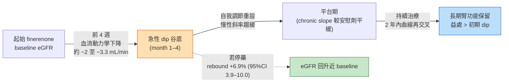
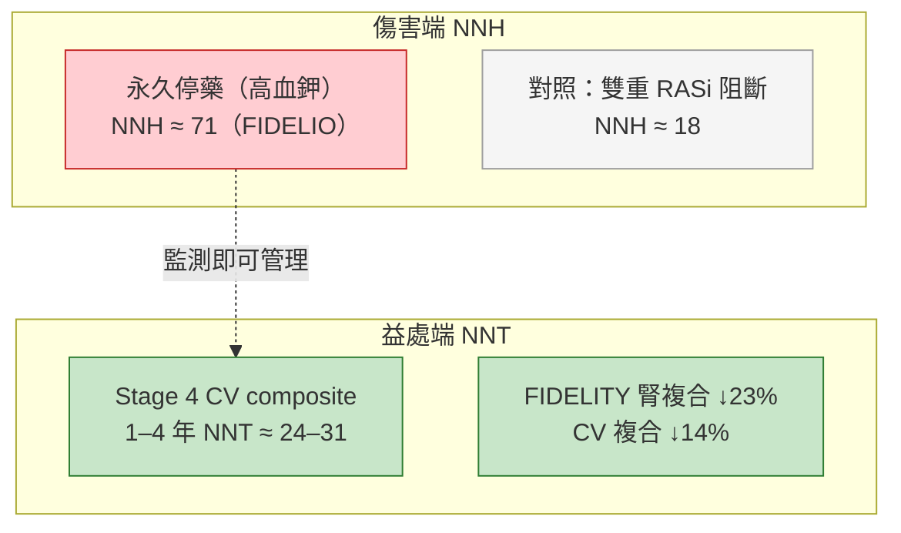
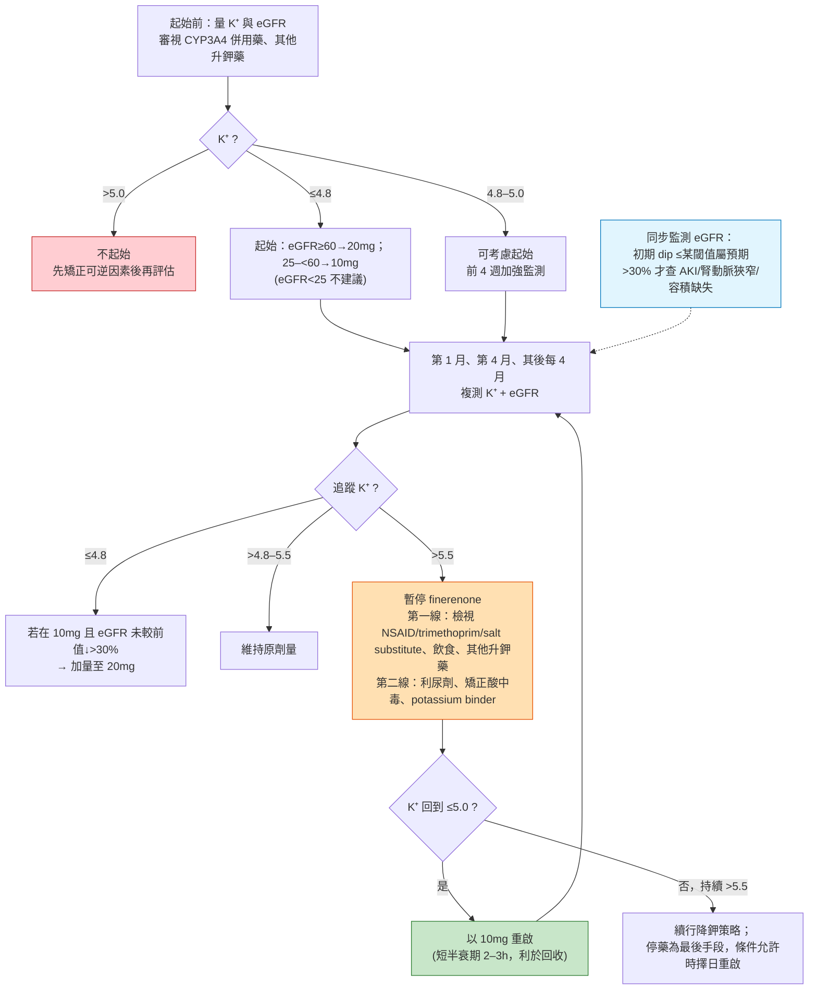

# 主題五 — 高血鉀與 eGFR dip 的安全工程學：把 finerenone 的風險「協定化」

> 聽眾定位：本文預設讀者已熟悉 FIDELIO-DKD、FIGARO-DKD、FIDELITY、FINEARTS-HF、FIND-CKD 的名稱與 finerenone 的心腎益處。因此本文不重述療效試驗，而聚焦於**安全性的可操作面向**：高血鉀、初期 eGFR dip、心衰場景中的腎臟不良事件、CYP3A4 交互作用，以及如何把這四件事整合成一套門診可執行的 potassium-aware prescribing workflow。
>
> 證據分級標註：文中凡屬**指引常規（guideline routine）**、**證據擴張／代理終點（evidence expansion / surrogate-based）**者於段落末明示。所有事實句末之 `[檔名]` 為本地全文來源，供 grep 稽核；本文所有引用均為本地全文（📄）。

---

## 1. 核心臨床問題：真正要擔心的是什麼？

在內分泌與腎臟共照門診裡，反對 finerenone 最常見的一句話是：「又多一種有效藥，但換來更多抽血與高血鉀風險。」這句話的前半段沒錯，後半段則需要被「工程化」地拆解。本文的立場是：**finerenone 的主要安全議題不是不可預測，而是需要 protocolized monitoring**——選對病人、抓對起始時點、審視併用藥、安排飲食與實驗室監測節奏、並在必要時導入 potassium binder。

要回答「風險可不可管理」，必須同時掌握四層資訊：(1) 官方 label 與 KDIGO 的安全框架（KDIGO 2024 定稿；並參 KDIGO 2026 公開審查草案，該草案將 nsMRA 建議自 2A 升級為 1A，尚未定稿）；(2) 各臨床場景（整體 pooled / stage 4 / 心衰 / combination）的高血鉀量化風險；(3) 初期 eGFR dip 的血流動力學本質與可逆性；(4) CYP3A4 交互作用的藥動學邊界。以下逐層展開。

---

## 2. 背景（精煉）：label 與 guideline 的安全框架

> 📎 **詳盡專科版**：本節之等級演進（KDIGO 2020→2022→2024→2026 的 2A→1A）與 EMA/FDA label 完整矩陣，另見獨立檔 [`label_guideline_safety_framework.md`](label_guideline_safety_framework.md)。

這一節刻意壓縮，只保留門診當下會查的數字。

### 2.1 KDIGO 的 nsMRA 定位（指引常規；2024 → 2026 草案有等級變化）

**KDIGO 2024（現行定稿）**：Recommendation 3.8.1，證據等級 **2A（suggest）**——對 T2D、eGFR >25 mL/min/1.73 m²、**血鉀正常**、且在最大耐受劑量 RASi 下仍有白蛋白尿（>30 mg/g）的成人，使用具腎或心血管益處證據的 nsMRA [label_guideline_safety_Kidney_2024]。Practice Point 3.8.3 明示：為降低高血鉀風險，應選擇**血鉀一貫正常**的病人，並在起始後**規律監測血鉀**（Figure 26）[label_guideline_safety_Kidney_2024]。KDIGO 的 Figure 26 監測邏輯直接改編自 FIDELIO/FIGARO 協定：K⁺ ≤4.8 起始並於第 1 個月、其後每 4 個月監測；K⁺ >5.5 暫停 [label_guideline_safety_Kidney_2024]。值得注意的是，KDIGO 工作小組自評這些鉀閾值「偏保守」，並指出在 K⁺ 5.5–6.0 mmol/L 之間繼續 MRA 亦可被認為適當——但同時保留 FDA 核准的「K⁺ <5.0 起始」規則 [label_guideline_safety_Kidney_2024]。

**KDIGO 2026 糖尿病與 CKD 指引更新・公開審查草案（尚未定稿）**：Chapter 4（Pharmacotherapy）把上述建議改列為 Recommendation 4.4.1，並**由 2A 升級為 1A（recommend）**——「We recommend adding a nonsteroidal mineralocorticoid receptor antagonist (nsMRA) with proven kidney or cardiovascular benefit for people with T2D, an eGFR ≥25 ml/min per 1.73 m², normal serum potassium concentration, and albuminuria (UACR ≥30 mg/g) while on maximum tolerated dose of RAS inhibitor (1A)」[KDIGO_2026_Diabetes_CKD_draft]。**較早版本 vs 2026 草案之變化**：適應人群與門檻（eGFR ≥25、血鉀正常、UACR ≥30 mg/g、最大耐受 RASi 上）不變，但等級自「suggest（2A）」升為「recommend（1A）」——Work Group 明言自前一版指引以來，nsMRA 的**可用性與熟悉度提高**，多數知情的醫療人員與病人在符合條件時會選擇使用 nsMRA、僅少數不會 [KDIGO_2026_Diabetes_CKD_draft]。（來源：KDIGO 2026 糖尿病與 CKD 指引更新・公開審查草案，Chapter 4，2026 年 3 月；尚未定稿，內容可能因回饋而改變）

監測邏輯在 2026 草案對應 **Practice Point 4.4.3**：「To mitigate risk of hyperkalemia, select people with consistently normal serum potassium concentration and monitor serum potassium regularly after initiation of an nsMRA」——即與 2024 版 Practice Point 3.8.3「選血鉀一貫正常者、起始後規律監測」措辭一致 [KDIGO_2026_Diabetes_CKD_draft]。草案並重申起始閾值：finerenone 試驗篩選採 K⁺ ≤4.8 mmol/L，惟依 FDA label，血鉀 >5.0 mmol/L 不得起始；多數高血鉀事件可用「暫停 72 小時」處理（短半衰期）[KDIGO_2026_Diabetes_CKD_draft]。「不同時使用類固醇型 MRA 與 nsMRA」則對應 2026 草案 **Practice Point 4.4.7**：「Do not use steroidal and nsMRA concurrently」[KDIGO_2026_Diabetes_CKD_draft]。（以上均引自 KDIGO 2026 公開審查草案・尚未定稿）

### 2.2 EMA 與 FDA label 的起始／監測／停藥規則（指引常規）

兩地 label 的骨架一致，但起始血鉀閾值的措辭有臨床可用的差異：

| 項目 | EMA SmPC | FDA (KERENDIA PI, rev. 8/2025) |
|---|---|---|
| K⁺ ≤4.8 | 可起始 | — |
| K⁺ >4.8–5.0 | **可考慮起始，但前 4 週須更密切監測** | 未細分（見下） |
| K⁺ >5.0 | **不建議起始** | **K⁺ >5.0 不得起始** |
| 起始劑量 | eGFR ≥60→20 mg；25–<60→10 mg；<25 不建議 | 同左 |
| 續用監測 | 起始/重啟/加量後 **4 週** 複測 K⁺ 與 eGFR，其後定期 | 定期監測 |
| K⁺ >5.5（CKD+T2D） | 暫停；K⁺ ≤5.0 時以 10 mg 重啟 | 同左 |

（EMA 欄位 [label_guideline_safety_European_2022]；FDA 欄位 [label_guideline_safety_Bayer_2025]）

EMA 對 CKD+T2D 之高血鉀採 >5.5 暫停、對心衰（LVEF ≥40%）則採 >6.0 暫停、>5.5–6.0 減量的階梯 [label_guideline_safety_European_2022]。FDA 心衰 label 亦有等價的 5.5/6.0 減量-暫停矩陣，並要求心衰病人維持期定期量 eGFR、於顯著腎功能惡化時考慮延後加量或中斷 [label_guideline_safety_Bayer_2025]。KDIGO 對照的 RASi 監測邏輯（Practice Point 3.6.2–3.6.4）則以「起始/加量後 2–4 週複測」「血清肌酸酐上升 <30% 內續用」為準 [label_guideline_safety_Kidney_2024]。**兩者頻率高度重疊**——這是回應「多做很多抽血」質疑的第一個支點：finerenone 的監測節奏，本質上與 CKD 病人本來就該有的 RASi 監測節奏一致 [label_guideline_safety_Wanner_2022]。

### 2.3 禁忌與交互作用（指引常規）

FDA 三項禁忌：對成分過敏、**併用強效 CYP3A4 抑制劑**、**腎上腺功能不全** [label_guideline_safety_Bayer_2025]。EMA 另列 Addison 氏病與強效 CYP3A4 抑制劑（itraconazole、ketoconazole、ritonavir、cobicistat、clarithromycin 等）為禁忌，並禁止與保鉀利尿劑及其他 MRA 併用 [label_guideline_safety_European_2022]。CYP3A4 的量化細節見 §5。

---

## 3. 高血鉀的工程學：把風險按場景拆開（表 5）

> 📎 **詳盡專科版**：按場景／研究設計／風險修飾因子（eGFR、baseline K⁺、SGLT2i、GLP-1RA、利尿劑、β-blocker）之完整拆解，另見獨立檔 [`hyperkalemia_engineering_by_scenario.md`](hyperkalemia_engineering_by_scenario.md)。

finerenone 的高血鉀風險並非單一數字，而是**隨 eGFR、baseline K⁺、併用藥、臨床場景而變**。以下把四個場景的核心安全數字並列，這正是回應「風險可不可管理」時最該放在同一張投影片的內容。

### 表 5. 不同場景的高血鉀發生率、住院率與停藥率（finerenone vs 安慰劑）

| 場景 | 高血鉀事件 | 住院（高血鉀） | 永久停藥（高血鉀） | 來源 |
|---|---|---|---|---|
| **FIDELITY pooled（CKD+T2D，n≈13,000）** | 14.0% vs 6.9% | 0.9% vs 0.2% | 1.7% vs 0.6% | [label_guideline_safety_European_2022] |
| — 實驗室 K⁺ >5.5 / >6.0 | 16.8% vs 7.4% / 3.3% vs 1.3% | — | — | [label_guideline_safety_European_2022] |
| **FIDELIO-DKD（進階 CKD 單試驗）** | ≥mild(K>5.5) 21.4% vs 9.2%；≥mod(K>6.0) 4.5% vs 1.4% | — | 藥物撤除 2.3% vs 0.9% | [pooled_safety_hyperkalemia_Agarwal_2022] |
| **Stage 4 CKD 亞群（eGFR <30，n=890）** | 26% vs 13% | 3% vs 1% | 3% vs 2% | [pooled_safety_hyperkalemia_Sarafidis_2023] |
| **FINEARTS-HF（HFmrEF/HFpEF）** | 9.7% vs 4.2% | 0.5% vs 0.2% | 0.4% vs 0.2% | [label_guideline_safety_European_2022] |
| **CONFIDENCE combo（very-high risk 亞群）** | 13.5%（combo）/ 11.4%（fine）/ 5.1%（empa） | — | — | [hf_renal_safety_Vaduganathan_2025] |

### 3.1 整體 pooled：雙倍相對風險，但絕對「臨床相關事件」低

先看跨試驗的統合視角：**KDIGO 2026 公開審查草案（尚未定稿）**為此次更新所做的新統合分析（7 studies、nsMRA[finerenone 或 esaxerenone] vs placebo、T2D+CKD）量化了「風險真實但可量化」的兩個數字——hyperkalemia（未細分）**RR 2.09（95% CI 1.82–2.39）**、serum potassium ≥5.5 mmol/L **RR 2.18（95% CI 1.98–2.40）**[KDIGO_2026_Diabetes_CKD_draft]；同一分析中腎複合終點 HR 0.84（0.77–0.92）、kidney failure HR 0.84（0.71–0.99）、HF/HHF HR 0.78（0.66–0.92）皆顯著獲益 [KDIGO_2026_Diabetes_CKD_draft]。也就是說，「相對風險約 2 倍」在最新彙整資料裡依然成立、且與下述單試驗數字方向一致——這正是「風險真實但可量化、可管理」論述的定量支點。（來源：KDIGO 2026 糖尿病與 CKD 指引更新・公開審查草案，Chapter 4）

兩份 2026 年最新的個體資料層級（IPD）合併分析把「相對風險約 2 倍、但絕對硬結局低」這條結論延伸到更廣的 CKD 譜、且方向完全一致：**INFINITY**（FIDELIO＋FIGARO＋FIND-CKD 三試驗 IPD 合併，n=14,574，首度納入**非糖尿病 CKD**）中任一高血鉀 14.3% vs 7.6%、因高血鉀永久停藥 1.7% vs 0.5%，作者並明示絕對「因高血鉀住院」發生率低、且**無任何可歸因於高血鉀之死亡** [pooled_safety_hyperkalemia_Neuen_2026]。**FINE-HEART**（FIDELIO＋FIGARO＋FINEARTS-HF 糖尿病/CKD 亞群 IPD 合併，n=14,180）則把絕對可管理性量成一個好記的門診數字——每處方約 **131** 人才造成 1 次高血鉀相關住院、實驗室 K>5.5 為 18% vs 8%、高血鉀相關永久停藥 2% vs 1%，兩組同樣**零高血鉀死亡** [hf_renal_safety_Ostrominski_2026]。（兩者皆為 prespecified IPD pooled 分析）

FIDELIO-DKD 的 post hoc 安全分析把高血鉀量化得最完整：finerenone 使 ≥mild 高血鉀的多變量 HR 達 **2.13（95% CI 1.86–2.45）**，但獨立風險因子清楚可辨——baseline K⁺ >5.0（HR 4.18）、eGFR <25（HR 2.04）、每倍 UACR（HR 1.12）、β-blocker（HR 1.18）皆升高風險，而 **利尿劑（HR 0.76）與 SGLT2i（HR 0.45）則降低風險** [pooled_safety_hyperkalemia_Agarwal_2022]。這組 HR 就是「選對病人」的操作清單。

關鍵在於：finerenone 造成的血鉀上升幅度小且平台化——組間平均差最大僅 **0.23 mmol/L（月 4）**，其後穩定 [pooled_safety_hyperkalemia_Agarwal_2022]；EMA 亦記載首月平均升幅 ≤0.2 mmol/L 後即穩定 [label_guideline_safety_European_2022]。FIDELIO 中投資者處置以「暫時撤藥」為主（11.0% 中斷、2.3% 撤除），僅 1 名（安慰劑組）因高血鉀住院期間洗腎 [pooled_safety_hyperkalemia_Agarwal_2022]。Wanner 等人的實務綜述則強調：13,000+ 病人、中位追蹤 3 年，**無任何可歸因於高血鉀的死亡** [label_guideline_safety_Wanner_2022]。（指引常規＋單試驗 post hoc）

一個常被忽略的機制學細節：FIDELIO 分析顯示，在月 4，「任一血鉀上升幅度所對應的後續高血鉀風險增幅，finerenone 反而**小於**安慰劑」（0.5 mmol/L 上升時，安慰劑對應 ~3.4 倍、finerenone 僅 ~2 倍後續風險）[pooled_safety_hyperkalemia_Agarwal_2022]。這暗示 finerenone 的短半衰期（CKD 中 2–3 小時、無活性代謝物）使其高血鉀比 spironolactone 更「可回收」[pooled_safety_hyperkalemia_Agarwal_2022][label_guideline_safety_Wanner_2022]。

### 3.2 Stage 4 CKD：發生率翻倍，但停藥率仍低

Stage 4 亞群（eGFR <30，平均 26.9）是「高血鉀最嚇人、但停藥最溫和」的教學案例。高血鉀 **26% vs 13%**，數字翻倍；然而永久停藥僅 **3% vs 2%**、住院 **3% vs 1%**、無高血鉀死亡 [pooled_safety_hyperkalemia_Sarafidis_2023]。同時此亞群仍保有心血管益處（CV composite HR 0.78，1 年 NNT 約 29；chronic eGFR slope 由 −3.2 改善至 −1.8 mL/min/年，差值 1.39，P=0.04）[pooled_safety_hyperkalemia_Sarafidis_2023]。**訊息**：eGFR 低不是禁忌，而是「監測要更勤」的訊號——這與 EMA「eGFR <60 與高齡者應更頻繁監測」的措辭一致 [label_guideline_safety_European_2022]。（單試驗亞群 post hoc；kidney composite 之比例風險假設在 2 年後不成立，須誠實標示為 exploratory [pooled_safety_hyperkalemia_Sarafidis_2023]）

### 3.3 心衰場景：高血鉀反而較輕，但「worsening renal function」較多

在 FINEARTS-HF（HFmrEF/HFpEF），高血鉀的**絕對**發生率反而低於 CKD 場景（9.7% vs 4.2%），永久停藥極低（0.4% vs 0.2%）[label_guideline_safety_European_2022]。Vardeny 的次分析顯示 finerenone 使 K⁺ >5.5 的 HR 為 **2.16（1.83–2.56）**、K⁺ >6.0 的 HR 2.07，但——關鍵——**即使病人在第 1 個月即升到 >5.5，finerenone 相對安慰劑的臨床益處仍維持**（有無經歷 K⁺ >5.5 的療效交互作用 P=0.72）[hf_renal_safety_Vardeny_2025]。這與 RALES／EMPHASIS-HF 的老觀察一致：MRA 的益處不會被中度血鉀上升抵銷 [hf_renal_safety_Vardeny_2025]。

心衰場景真正要留意的，反而是 **renal adverse events**：FDA label 記載 FINEARTS-HF 中「腎功能惡化相關不良事件」finerenone **18% vs 12%**（腎損傷 7% vs 4%、eGFR 下降 5% vs 4%、AKI 4% vs 2%），並致 **9% vs 4%** 的劑量調整、**2.0% vs 1.3%** 的住院——多數為輕中度 [label_guideline_safety_Bayer_2025]。EMA 版本數字相近（worsening renal function 17.7% vs 10.9%）[label_guideline_safety_European_2022]。**這是心衰用藥的門診重點**：不是高血鉀，而是初期 eGFR 下降被誤判為「腎損傷」而過早停藥（見 §4）。

### 3.4 Combination（CONFIDENCE）：合併 SGLT2i 未顯著放大高血鉀

CONFIDENCE 是同時起始 finerenone + empagliflozin 的關鍵短期試驗（UACR 為主終點，180 天）[hf_renal_safety_Green_2023]。**KDIGO 2026 公開審查草案（尚未定稿）**已把「SGLT2i + nsMRA 同步起始」正式寫入敘述——新增的 **Practice Point 4.4.2**：「For people with T2D treated with RASi who have persistent albuminuria and normal serum potassium, an SGLT2i and nsMRA can be initiated simultaneously」，其依據即 CONFIDENCE：合併治療於 day 180 的 UACR 降幅較 finerenone 單藥多 29%（LSM ratio 0.71；0.61–0.82）、較 empagliflozin 單藥多 32%（0.68；0.59–0.79）[KDIGO_2026_Diabetes_CKD_draft]。這是相對 2024 版的**新實務要點**，且草案明言合併治療「both safe and effective」——為下述「combination 未放大高血鉀」的門診論述提供指引層級的背書 [KDIGO_2026_Diabetes_CKD_draft]。（來源：KDIGO 2026 糖尿病與 CKD 指引更新・公開審查草案，Chapter 4；尚未定稿）Vaduganathan 的 KDIGO 風險分層分析提供了門診最想聽的一句話：**合併治療的高血鉀，數值上並未高於 finerenone 單藥、甚至略低**。以 very-high risk 亞群為例，投資者報告高血鉀 combo 13.5% vs finerenone 11.4% vs empagliflozin 5.1%；而實驗室 K⁺ >5.5：combo **19.6%** vs finerenone **22.3%** vs empagliflozin 10.3% [hf_renal_safety_Vaduganathan_2025]。作者明言「合併治療各 KDIGO 風險層的高血鉀率，數值上都比 finerenone 單藥略低」[hf_renal_safety_Vaduganathan_2025]——方向上與 FIDELIO 次分析中 SGLT2i 使用者高血鉀 HR 0.45 一致 [pooled_safety_hyperkalemia_Agarwal_2022]。

補充：合併 GLP-1RA 亦不放大風險——CONFIDENCE 中有／無 baseline GLP-1RA 者，combo 高血鉀率為 9.0% 與 9.5%，幾乎相同 [hf_renal_safety_Agarwal_2025]。FIDELITY 的 SGLT2i／GLP-1RA 次分析同樣總結「finerenone 的安全輪廓不因併用 SGLT2i 和／或 GLP-1RA 而改變，導致停藥或住院的高血鉀事件低」[pooled_safety_hyperkalemia_Singh_2026]。（combination 證據多以 UACR 為代理終點，屬 evidence expansion / surrogate-based）

---

## 4. 初期 eGFR dip：血流動力學、可逆，且不該觸發停藥（圖 6）

> 📎 **詳盡專科版**：dip 的量化、可逆性機轉、finerenone 的預後脫鉤、停藥代價，另見獨立檔 [`egfr_dip_hemodynamic_reversible.md`](egfr_dip_hemodynamic_reversible.md)。

### 4.1 dip 的本質與量化

KDIGO 2024 把「eGFR dip」寫入 Practice Point 2.1.4：啟動血流動力學活性療法後，**>30% 的 eGFR 下降才超出預期變異、才需評估**；10%–20% 的初期下降屬典型、且多為暫時、會隨自我調節重設而穩定或回復 [label_guideline_safety_Kidney_2024]。

finerenone 的 dip 幅度小。EMA 記載初期 eGFR 下降平均 **約 2 mL/min/1.73 m²**，隨時間衰減、於持續治療下看似可逆 [label_guideline_safety_European_2022]。FIDELIO 的 dose-exposure-response 模型（Goulooze）給出最精緻的量化：finerenone 組月 4 中位下降 **3.3 mL/min**（安慰劑 0.8），為**雙相型態**——一次性的急性 offset ＋ 疊加的慢性斜率趨緩；模型假設急性下降**完全可逆**即能良好擬合，包括停藥後資料；停藥後校正標準治療後的 eGFR **回升 6.9%（95% CI +3.9% 至 +10.0%）**，與模型預測的 20 mg 急性下降 5.4% 相稱 [egfr_dip_reversibility_Goulooze_2022]。兩組曲線在 2 年內再度交叉，長期益處逐漸壓過初期 dip [egfr_dip_reversibility_Goulooze_2022]。（模型／代理終點分析，evidence expansion）

### 圖 6. Acute eGFR dip 的可逆性示意（雙相型態）

（示意數據來源：[egfr_dip_reversibility_Goulooze_2022]、[label_guideline_safety_European_2022]）

### 4.2 dip 的預後意義：在 finerenone 身上「脫鉤」了

這是本主題最重要的深度見解之一。在 **RASi** 的歷史資料裡，初期 eGFR 下降與後續結局的關係並非全然良性但有可容忍閾值：Ku 等人整合 17 個 RASi 試驗（n=11,800）發現，**3 個月內 ≤13%（95% CI 8–17%）或 1 個月內 ≤21%（95% CI 15–27%）的 eGFR 下降，其腎衰竭風險仍優於「無下降」**——遠寬於傳統「肌酸酐上升 30% 就停藥」的教條 [r2_Ku_2024]。

而在 **finerenone** 身上，FINEARTS-HF 的 Matsumoto 前瞻分析把這件事推得更遠：≥15% 的初期 eGFR 下降在 finerenone 組達 **23.0% vs 安慰劑 13.4%（OR 1.95）**、≥30% 下降 4.9% vs 2.0%（OR 2.51）[hf_renal_safety_Matsumoto_2025]。但關鍵是預後——**初期 eGFR 下降在安慰劑組預示更差結局（adjusted RR 1.50, 95% CI 1.20–1.89），在 finerenone 組卻不然（adjusted RR 1.07, 95% CI 0.84–1.35；P-interaction 0.04）**；且 finerenone 的療效橫跨整個 eGFR 變化範圍皆一致（P-interaction 0.50）[hf_renal_safety_Matsumoto_2025]。作者的結論一句話可貼在門診牆上：「finerenone 的初期 eGFR 下降是**可預期**的，不應自動導致停用這個 disease-modifying 藥物」[hf_renal_safety_Matsumoto_2025]。（前瞻次分析；預後脫鉤屬 evidence expansion）

CONFIDENCE 補上「誰會 dip」的地形圖：>30% eGFR 下降（day 30）在 low/moderate risk（12.1%）與 high risk（8.2%）反而**比 very-high risk（4.4%）更常見**——因為 dip 幅度與 baseline eGFR 正相關，baseline 越高、可掉的越多 [hf_renal_safety_Vaduganathan_2025]。這提醒門診：**eGFR 較好的病人反而更可能出現看似驚人的初期 dip，需事先給病人「anticipatory guidance」以避免過早停藥** [hf_renal_safety_Vaduganathan_2025]。

### 4.3 停藥的代價：益處會隨之流失

若因 dip 或高血鉀而過早永久停藥，代價是實在的。FIDELITY 的停藥分析顯示：finerenone 對腎、心複合終點的效益在**治療中**（kidney HR 0.65；CV HR 0.79）明顯，**停藥後則衰減**（kidney HR 0.82；CV HR 0.93）[egfr_dip_reversibility_Singh_2026]。所幸兩組停藥率相當（22.8% vs 21.6%），因高血鉀停藥僅 1.7% vs 0.6% [egfr_dip_reversibility_Singh_2026]。low eGFR、high UACR、high baseline K⁺、高齡是停藥的最重要預測因子——**正是最該被保住治療的高風險族群** [egfr_dip_reversibility_Singh_2026]。這與 KDIGO 的核心倫理一致：「暫停 RASi 可以，但務必在不良事件解除後**重新啟動**，別讓病人被剝奪所需藥物」[label_guideline_safety_Kidney_2024]。（post hoc；stopping benefit 屬 evidence expansion）

---

## 5. CYP3A4 交互作用：把藥動學邊界變成處方規則

> 📎 **詳盡專科版**：PBPK／fm 拆解、完整 AUCR 定量表與處方規則轉譯，另見獨立檔 [`cyp3a4_interaction_prescribing_rules.md`](cyp3a4_interaction_prescribing_rules.md)。

finerenone 幾乎完全經 CYP3A4 代謝。Wendl 的 PBPK 模型估計總 fm_CYP3A4 約 **0.90–0.93**（腸壁 0.42 ＋ 肝 0.51），與 Heinig 之靜態估計（0.88–0.89，90% CI 涵蓋 0.83–0.94）一致 [label_guideline_safety_Wendl_2022]。這解釋了為何強效抑制劑被列為**禁忌**：

| CYP3A4 調節劑 | 分類 | 對 finerenone AUC 的預測倍率 (AUCR) | 處方意涵 |
|---|---|---|---|
| Itraconazole | 強效抑制 | **6.31** | 禁忌 |
| Clarithromycin | 強效抑制 | **5.28** | 禁忌 |
| Erythromycin | 中效抑制 | 3.48（實測） | 監測血鉀、調整劑量 |
| Verapamil | 中效抑制 | 2.70（實測） | 監測血鉀、調整劑量 |
| Fluvoxamine | 弱／中效抑制 | 1.57 | 監測血鉀 |
| Cimetidine | 弱效抑制 | 1.59 | 監測血鉀 |
| Efavirenz | 中效誘導 | **0.19** | 避免併用（療效流失） |
| Rifampicin | 強效誘導 | **0.07** | 避免併用 |

（全欄 [label_guideline_safety_Wendl_2022]）

臨床轉譯（指引常規）：FDA／EMA 將**強效 CYP3A4 抑制劑列為禁忌**；中／弱效抑制劑（erythromycin、verapamil、fluvoxamine）併用時，須於起始或調量時監測血鉀並調整 finerenone 劑量；**強／中效誘導劑（rifampicin、carbamazepine、phenytoin、St. John's wort、efavirenz）應避免併用**，因會使療效衰減 [label_guideline_safety_Bayer_2025][label_guideline_safety_European_2022][label_guideline_safety_Wendl_2022]。門診易被忽略的一項：**葡萄柚（汁）應避免**，因其為腸道 CYP3A4 抑制來源 [label_guideline_safety_Wanner_2022]。這一節可直接變成電子病歷的 hard-stop alert。

---

## 6. 常被忽視的另一端：hypokalemia，以及 nsMRA 的「雙向」電解質效應

把 finerenone 只當成「升鉀藥」是片面的。Pitt 的 FIDELITY hypokalemia 分析揭示：在這群 CKD+T2D 病人，**血鉀 <4.0 mmol/L 竟達 41.1%、<3.5 mmol/L 達 7.5%**，其累積發生率甚至**高於**高血鉀（安慰劑組 4 年 K<4.0 累積 57.2% vs K>5.5 僅 10%）[label_guideline_safety_Pitt_2025]。而 **finerenone 顯著減少 hypokalemia**：K<4.0（HR 0.63, 95% CI 0.60–0.66）、K<3.5（HR 0.46, 95% CI 0.40–0.53）[label_guideline_safety_Pitt_2025]。這很重要，因為低血鉀本身與更差結局相關——baseline K<4.0（vs 4.0–4.5）之 CV composite HR 1.16、arrhythmia HR 1.20；病程中最低 K<3.5 者 CV HR 1.53、心律不整 HR 1.67、全死因 HR 1.56 [label_guideline_safety_Pitt_2025]。

FINEARTS-HF 得到平行結論：finerenone 降低 K<3.5 風險（HR 0.46），而時間更新分析中 K<3.5 對應的主要結局風險（HR 2.49）甚至高於 K>5.5（HR 1.64）[hf_renal_safety_Vardeny_2025]。**臨床意涵**：nsMRA 把血鉀「往中央（4.0–5.0，最低風險帶）收斂」，門診敘事不該只算高血鉀那一邊的帳 [label_guideline_safety_Pitt_2025][hf_renal_safety_Vardeny_2025]。（post hoc；hypokalemia 保護屬 evidence expansion，是否中介療效未明）

---

## 7. Potassium binder 的角色：從「能不能用」到「能不能續用」

當病人反覆 K⁺ >5.5、或屬 stage 4／併多重升鉀藥時，potassium binder（patiromer、sodium zirconium cyclosilicate, SZC）是把「被迫停藥」轉為「持續治療」的工程手段。

- **AMBER（patiromer + spironolactone，eGFR 25–45 的 resistant HTN+CKD）**：patiromer 使 12 週仍續用 spironolactone 者由 66.2% 提升至 **85.7%（組間差 19.5%, 95% CI 10.0–29.0, P<0.0001）**——即以 binder 換取 MRA 的持續使用 [potassium_binders_monitoring_Agarwal_2019]。
- **DIAMOND（patiromer + RAASi，HFrEF）**：patiromer 使血鉀調整後平均變化 +0.03 vs 安慰劑 +0.13 mmol/L（組間差 −0.10）、並降低 K⁺ >5.5 事件（HR 0.63, 95% CI 0.45–0.87, P=0.006），使更多病人維持目標 RAASi 劑量 [potassium_binders_monitoring_Butler_2022]。
- **共識與比較**：KDIGO Table 27 並列 patiromer、SZC 與舊式 polystyrene sulfonate（SPS）之機轉、起效與副作用；新式 binder 長期耐受性與安全性優於 SPS，可協助「必要的 RASi/MRA」得以續用 [label_guideline_safety_Kidney_2024]。EMCREG 跨科共識同樣主張以 patiromer／SZC 取代不良反應顯著、慢性使用證據薄弱的 SPS [potassium_binders_monitoring_Kreitzer_2025]。

值得校準期望值：在 finerenone 樞紐試驗中，**binder 使用其實不普遍**（FIDELIO 試驗中新起用 binder 者 finerenone 10.9% vs 安慰劑 6.5%）——多數高血鉀靠「暫停／減量／飲食調整」即可處理，binder 是第二線工具而非常規 [pooled_safety_hyperkalemia_Agarwal_2022][label_guideline_safety_Wanner_2022]。KDIGO 的高血鉀處置階梯（Figure 32）亦把「檢視非 RASi 藥物＋飲食調整」列第一線、「利尿劑＋binder」列第二線、「減量或停 RASi/MRA」列為**最後手段** [label_guideline_safety_Kidney_2024]。飲食面，KDIGO 與 Wanner 都強調 CKD 早期不宜aggressive限鉀、飲食限制僅在確有高血鉀時作為治療而非預防 [label_guideline_safety_Kidney_2024][label_guideline_safety_Wanner_2022]。（binder 試驗以「續用率／血鉀」為終點，非硬結局；surrogate-based）

---

## 8. 爭議與對讀（discussion）：把「多一種藥＝多抽血＋更多高血鉀」翻譯成 benefit-risk

> 📎 **詳盡專科版**：完整 NNT/NNH 同尺權衡、誠實反方（counter-advocate）與一張投影片論述，另見獨立檔 [`benefit_risk_discussion_nnt_nnh.md`](benefit_risk_discussion_nnt_nnh.md)。

### 8.1 好講法不是否認風險，而是把風險工程化

反對意見的核心是「監測負擔 vs 益處」的權衡。正確的回應姿態是承認高血鉀確實加倍（相對風險 ~2 倍，跨試驗一致），但用三組事實把「絕對可管理性」講清楚：

1. **絕對硬結局極低**：pooled 住院 0.9% vs 0.2%、永久停藥 1.7% vs 0.6%、13,000+ 人零高血鉀死亡 [label_guideline_safety_European_2022][label_guideline_safety_Wanner_2022]。
2. **監測節奏本來就存在**：finerenone 的第 1 月／第 4 月／其後每 4 月，與 CKD 病人的 RASi 例行監測重疊 [label_guideline_safety_Wanner_2022][label_guideline_safety_Kidney_2024]。
3. **NNH 對照歷史**：FIDELIO 中約需處方 **71 名** finerenone 才有 1 名因高血鉀永久停藥——遠優於雙重 RASi 阻斷（VA NEPHRON-D 之 NNH 18）[pooled_safety_hyperkalemia_Agarwal_2022]。

### 8.2 用 NNT / NNH 平衡益處與負擔（權衡圖）

把「傷害端」與「益處端」放同一把尺：

（NNH [pooled_safety_hyperkalemia_Agarwal_2022]；Stage 4 NNT [pooled_safety_hyperkalemia_Sarafidis_2023]；FIDELITY 益處幅度 [egfr_dip_reversibility_Singh_2026][label_guideline_safety_Pitt_2025][label_guideline_safety_Kidney_2024]）

### 8.3 一張投影片回答「風險可不可管理」

把三個東西疊在同一張 slide：**(a) KDIGO 的 nsMRA 選人＋監測建議（2024 為 2A；2026 公開審查草案 Recommendation 4.4.1 升為 1A，並以 Practice Point 4.4.2 支持 SGLT2i+nsMRA 同步起始——尚未定稿）**、**(b) EMA/FDA label 的起始（K⁺ >5.0 不起始／4.8–5.0 加強監測）與暫停-重啟規則**、**(c) CONFIDENCE 的 combination 高血鉀數據（合併 SGLT2i 未放大、甚至略低）**。三者合起來的訊息是：風險有明確的「進入條件」「監測節奏」「退出與重啟規則」，而且加上 SGLT2i 這個現代標準搭配後，天平更偏向益處——2026 草案的 1A 升級與同步起始要點正是把這個天平寫進指引 [label_guideline_safety_Kidney_2024][KDIGO_2026_Diabetes_CKD_draft][label_guideline_safety_European_2022][label_guideline_safety_Bayer_2025][hf_renal_safety_Vaduganathan_2025]。

---

## 9. 門診可執行 workflow（流程圖 3）：K⁺ 監測與暫停-重啟 algorithm

> 📎 **詳盡專科版**：起始/監測/暫停-重啟決策流（CKD vs HF 閾值差異）、eGFR dip 平行分支與更頻繁監測觸發清單，另見獨立檔 [`outpatient_workflow_monitoring_algorithm.md`](outpatient_workflow_monitoring_algorithm.md)。

以下把 label 與 KDIGO 的規則整合成單一決策流。閾值採 CKD+T2D 適應症（心衰適應症之 5.5/6.0 減量矩陣見 §2.2）。

（起始/劑量/暫停-重啟規則 [label_guideline_safety_Bayer_2025][label_guideline_safety_European_2022]；監測頻率與降鉀階梯 [label_guideline_safety_Kidney_2024][label_guideline_safety_Wanner_2022]；eGFR dip 評估閾值 [label_guideline_safety_Kidney_2024][r2_Ku_2024]；重啟利於短半衰期 [pooled_safety_hyperkalemia_Agarwal_2022]）

**觸發更頻繁監測的情境**（Wanner 實務清單）：低 eGFR、高 baseline K⁺、既往高血鉀、併用升鉀藥或損害排鉀之藥、急性病（AKI、容積缺失、腸胃問題、感染）、新增 NSAID、手術、以及中度肝功能不全（Child-Pugh B）[label_guideline_safety_Wanner_2022]。

---

## 10. Take-home

1. **finerenone 的主要安全議題不是不可預測，而是需要 protocolized monitoring。** 高血鉀相對風險約 2 倍且跨場景一致，但絕對硬結局（住院、永久停藥、死亡）極低，且可用「選人＋節奏化監測＋暫停-重啟」管理 [label_guideline_safety_European_2022][pooled_safety_hyperkalemia_Agarwal_2022][label_guideline_safety_Wanner_2022]。
2. **初期 eGFR dip 屬血流動力學、可逆，且在 finerenone 身上與不良預後脫鉤**——不應自動觸發停藥；>30% 才需查因 [hf_renal_safety_Matsumoto_2025][egfr_dip_reversibility_Goulooze_2022][label_guideline_safety_Kidney_2024]。
3. **心衰場景的重點是 renal adverse events 的過度解讀，而非高血鉀**（FINEARTS 中 worsening renal function 18% vs 12%，多為輕中度）[label_guideline_safety_Bayer_2025][hf_renal_safety_Vardeny_2025]。
4. **CYP3A4 是硬規則**：強效抑制劑禁忌、誘導劑避免、葡萄柚避免、中弱效抑制劑監測血鉀 [label_guideline_safety_Wendl_2022][label_guideline_safety_Bayer_2025]。
5. **別忘了低血鉀那一端**：nsMRA 把血鉀往中央收斂，低血鉀比高血鉀更常見且同樣有害 [label_guideline_safety_Pitt_2025]。
6. **combination 與 binder 是放大益處、保住治療的工具**：合併 SGLT2i 不放大高血鉀（甚至略低）——KDIGO 2026 公開審查草案（尚未定稿）更以新增 Practice Point 4.4.2 正式支持「SGLT2i + nsMRA 同步起始」；patiromer/SZC 可把「被迫停藥」轉為「持續治療」[hf_renal_safety_Vaduganathan_2025][KDIGO_2026_Diabetes_CKD_draft][potassium_binders_monitoring_Butler_2022][potassium_binders_monitoring_Agarwal_2019]。
7. **指引等級正在上移（但尚未定案）**：KDIGO 2026 公開審查草案將 T2D 的 nsMRA 建議自 2024 版的 2A 升級為 **Recommendation 4.4.1（1A）**，並首度納入 T1D 建議（Recommendation 4.7.1，2C）；因屬公開審查草案、內容可能因回饋而改變，臨床引用時應標明「尚未定稿」[KDIGO_2026_Diabetes_CKD_draft][label_guideline_safety_Kidney_2024]。

**結論**：對願意執行 potassium-aware prescribing 的內分泌與腎臟共照團隊，finerenone 的 benefit-risk ratio 仍具吸引力——因為它的風險有明確的進入條件、監測節奏、以及退出與重啟規則。

---

## 證據性質摘要（誠實標示）

- **已屬 guideline routine**：KDIGO 2024 的選人與監測建議（Recommendation 3.8.1，2A）、EMA/FDA 的起始（K⁺ >5.0 不起始）／暫停-重啟／CYP3A4 禁忌規則、監測頻率。**注意等級變化**：KDIGO 2026 公開審查草案（尚未定稿）將此建議改列為 Recommendation 4.4.1 並**升級為 1A（recommend）**，並新增 Practice Point 4.4.2（SGLT2i+nsMRA 同步起始）；由於仍為草案、內容可能因回饋而改變，故「1A」尚不宜當成已定案指引陳述。
- **屬 evidence expansion（多為 post hoc／次分析）**：Stage 4 亞群安全與療效、FINEARTS eGFR dip 的預後脫鉤、停藥後益處流失、hypokalemia 保護、高血鉀機制學（月 4 風險增幅較小）。
- **surrogate-based（代理終點）**：Goulooze 的 dose-exposure-response 模型（UACR/eGFR）、CONFIDENCE 系列（UACR 為主終點）、potassium binder 試驗（以「續用率／血鉀」而非硬結局為終點）。

---

## References（Vancouver 風格）

1. Agarwal R, Joseph A, Anker SD, et al. Hyperkalemia Risk with Finerenone: Results from the FIDELIO-DKD Trial. J Am Soc Nephrol. 2022;33(1):225–237. doi:10.1681/ASN.2021070942. `[pooled_safety_hyperkalemia_Agarwal_2022]` 📄
2. Sarafidis P, Agarwal R, Pitt B, et al. Outcomes with Finerenone in Participants with Stage 4 CKD and Type 2 Diabetes: A FIDELITY Subgroup Analysis. Clin J Am Soc Nephrol. 2023;18(5):602–612. doi:10.2215/CJN.0000000000000149. `[pooled_safety_hyperkalemia_Sarafidis_2023]` 📄
3. Singh AK, Anker SD, Pitt B, et al. A FIDELITY Analysis on Finerenone With SGLT-2i and GLP-1RA in CKD. Kidney Int Rep. 2026;11:103704. doi:10.1016/j.ekir.2025.10.032. `[pooled_safety_hyperkalemia_Singh_2026]` 📄
4. Goulooze SC, Heerspink HJL, van Noort M, et al. Dose–Exposure–Response Analysis of the Nonsteroidal Mineralocorticoid Receptor Antagonist Finerenone on UACR and eGFR: An Analysis from FIDELIO-DKD. Clin Pharmacokinet. 2022;61(7):1013–1025. doi:10.1007/s40262-022-01124-3. `[egfr_dip_reversibility_Goulooze_2022]` 📄
5. Singh AK, Anker SD, Pitt B, et al. Effect of Finerenone Treatment Discontinuation on Kidney and Cardiovascular Outcomes: A FIDELITY Analysis. Am J Nephrol. 2026;56(1):1–12. doi:10.1159/000549873. `[egfr_dip_reversibility_Singh_2026]` 📄
6. Ku E, Tighiouart H, McCulloch CE, et al. Association between Acute Declines in eGFR during Renin-Angiotensin System Inhibition and Risk of Adverse Outcomes. J Am Soc Nephrol. 2024;35(10):1402–1411. doi:10.1681/ASN.0000000000000426. `[r2_Ku_2024]` 📄
7. Bayer HealthCare Pharmaceuticals Inc. KERENDIA (finerenone) US Prescribing Information (NDA 215341; rev. 8/2025). NIH DailyMed. `[label_guideline_safety_Bayer_2025]` 📄
8. European Medicines Agency / Bayer AG. Kerendia (finerenone) EPAR — Product Information (SmPC). EMEA/H/C/005200; initial authorisation 16 Feb 2022. `[label_guideline_safety_European_2022]` 📄
9. Kidney Disease: Improving Global Outcomes (KDIGO) CKD Work Group. KDIGO 2024 Clinical Practice Guideline for the Evaluation and Management of Chronic Kidney Disease. Kidney Int. 2024;105(4S):S117–S314. doi:10.1016/j.kint.2023.10.018. `[label_guideline_safety_Kidney_2024]` 📄
9a. Kidney Disease: Improving Global Outcomes (KDIGO) Diabetes Work Group. KDIGO 2026 Clinical Practice Guideline for Diabetes and Chronic Kidney Disease — Chapter 1/2/4 Update. **Public Review Draft, March 2026（公開審查草案，尚未定稿；僅 Chapter 1/2/4）**。關鍵條文：Recommendation 4.4.1（T2D，1A）、Practice Point 4.4.2（SGLT2i+nsMRA 同步起始）、Practice Point 4.4.3（選血鉀正常者、規律監測）、Practice Point 4.4.7（勿與類固醇型 MRA 併用）、Recommendation 4.7.1（T1D，2C，全新）；新統合分析 hyperkalemia RR 2.09（1.82–2.39）、K≥5.5 RR 2.18（1.98–2.40）。`[KDIGO_2026_Diabetes_CKD_draft]` 📄
10. Wanner C, Fioretto P, Kovesdy CP, et al. Potassium management with finerenone: Practical aspects. (Practical review). `[label_guideline_safety_Wanner_2022]` 📄
11. Wendl T, Frechen S, Gerisch M, Heinig R, Eissing T. Physiologically-based pharmacokinetic modeling to predict CYP3A4-mediated drug-drug interactions of finerenone. CPT Pharmacometrics Syst Pharmacol. 2022;11(2):199–211. doi:10.1002/psp4.12746. `[label_guideline_safety_Wendl_2022]` 📄
12. Pitt B, Agarwal R, Anker SD, et al. Hypokalaemia in patients with type 2 diabetes and chronic kidney disease: the effect of finerenone — a FIDELITY analysis. Eur Heart J Cardiovasc Pharmacother. 2025;11(1):11–19. doi:10.1093/ehjcvp/pvae074. `[label_guideline_safety_Pitt_2025]` 📄
13. Matsumoto S, Jhund PS, Henderson AD, et al. Initial Decline in Glomerular Filtration Rate With Finerenone in HFmrEF/HFpEF: A Prespecified Analysis of FINEARTS-HF. J Am Coll Cardiol. 2025;85(2):173–185. doi:10.1016/j.jacc.2024.11.020. `[hf_renal_safety_Matsumoto_2025]` 📄
14. Vardeny O, Vaduganathan M, Claggett BL, et al. Finerenone, Serum Potassium, and Clinical Outcomes in Heart Failure With Mildly Reduced or Preserved Ejection Fraction. JAMA Cardiol. 2025;10(1):— . doi:10.1001/jamacardio.2024.4539. `[hf_renal_safety_Vardeny_2025]` 📄
15. Vaduganathan M, Green JB, Heerspink HJL, et al. Simultaneous initiation of finerenone and empagliflozin across the spectrum of kidney risk in the CONFIDENCE trial. Nephrol Dial Transplant. 2026;41(1):161–170. doi:10.1093/ndt/gfaf160. `[hf_renal_safety_Vaduganathan_2025]` 📄
16. Agarwal R, Green JB, Heerspink HJL, et al. Impact of Baseline GLP-1 Receptor Agonist Use on Albuminuria Reduction and Safety With Simultaneous Initiation of Finerenone and Empagliflozin (CONFIDENCE Trial). (2025). `[hf_renal_safety_Agarwal_2025]` 📄
17. Green JB, Mottl AK, Bakris G, et al. Design of the COmbinatioN effect of FInerenone anD EmpaglifloziN (CONFIDENCE) study. Nephrol Dial Transplant. 2023;38(4):894–903. doi:10.1093/ndt/gfac198. `[hf_renal_safety_Green_2023]` 📄
18. Agarwal R, Rossignol P, Romero A, et al. Patiromer versus placebo to enable spironolactone use in patients with resistant hypertension and chronic kidney disease (AMBER). Lancet. 2019;394(10208):1540–1550. doi:10.1016/S0140-6736(19)32135-X. `[potassium_binders_monitoring_Agarwal_2019]` 📄
19. Butler J, Anker SD, Lund LH, et al. Patiromer for the management of hyperkalemia in heart failure with reduced ejection fraction: the DIAMOND trial. Eur Heart J. 2022;43(41):4362–4373. doi:10.1093/eurheartj/ehac401. `[potassium_binders_monitoring_Butler_2022]` 📄
20. Kreitzer N, Albert NM, Amin AN, et al. EMCREG-International Multidisciplinary Consensus Panel on Management of Hyperkalemia in Chronic Kidney Disease and Heart Failure. (2025). `[potassium_binders_monitoring_Kreitzer_2025]` 📄
21. Neuen BL, Heerspink HJL, Perkovic V, et al. Efficacy and safety of finerenone in patients with chronic kidney disease: an individual participant data pooled analysis (INFINITY). Lancet. 2026. doi:10.1016/S0140-6736(26)01009-3. `[pooled_safety_hyperkalemia_Neuen_2026]` 📄
22. Ostrominski JW, Filippatos G, Claggett BL, et al. Effect of Finerenone on Morbidity and Mortality in CKD (FINE-HEART pooled analysis: FIDELIO-DKD, FIGARO-DKD, FINEARTS-HF). 2026. doi:10.1016/j.jchf.2025.03.006. `[hf_renal_safety_Ostrominski_2026]` 📄
