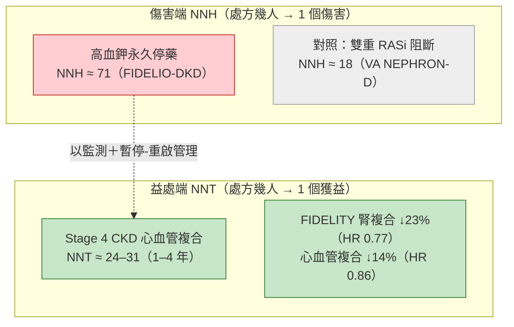

# 爭議與對讀：把「多一種藥＝多抽血＋更多高血鉀」翻譯成 benefit-risk

> 本文為主題五（高血鉀與 eGFR dip 的安全工程學）之延伸拆解，把主文 §8「爭議與對讀」獨立擴充成專科級 benefit-risk 論述。核心命題：反對 finerenone 的最強說法不是「它沒效」，而是「它讓門診多一種要抽血、要盯血鉀的藥」。正確的回應姿態**不是否認風險**，而是把「相對風險加倍」翻譯成「絕對可管理性」，並把**傷害端（NNH）與益處端（NNT）放上同一把尺**，同時誠實標示每個數字的試驗、設計與外推邊界。
>
> **引用標記慣例**：📄 = 本地全文可 grep 稽核；📌 = 僅取得 abstract（不對其未載內容作具體數字斷言）。每個數字句末以 `[本地MD檔名]` 標註來源供 grep 回溯。LLM 僅負責組織與改寫，所有作者／年份／數字均出自本地 MD 檔。
>
> **證據分層**：🟢 guideline routine（已進指引常規）｜🟡 evidence expansion（post hoc／次分析／surrogate／模型）｜🔴 尚待驗證（無直接 hard-outcome RCT，或屬未定稿草案）。
>
> **交叉連結**（勿重複內容）：label 起始／暫停-重啟矩陣見 `label_guideline_safety_framework.md`（§2）；高血鉀情境工程見 `hyperkalemia_engineering_by_scenario.md`（§3）；eGFR dip 可逆見 `egfr_dip_hemodynamic_reversible.md`（§4）；hypokalemia 雙向效應見 `hypokalemia_bidirectional_electrolyte.md`（§6）；binder 續用證據見 `potassium_binder_role.md`（§7）。

---

## 0. 一句話定位

反方主張成立的部分只有一句：finerenone 讓**高血鉀相對風險約 2 倍**，且需要例行血鉀監測。但「相對加倍」與「絕對可管理」是兩件事——當基期事件率極低、監測節奏本來就存在、退出與重啟規則明確時，2 倍的相對風險可以被工程化成一個「值得付的代價」。本文把這句話拆成可稽核的數字。

---

## 1. 反方核心主張，與正確的回應姿態

### 1.1 先承認：高血鉀確實加倍（跨試驗一致）🟡

不迴避事實。FIDELIO-DKD post hoc：treatment-emergent ≥mild hyperkalemia（K⁺ >5.5）為 **597/2785（21.4%）finerenone vs 256/2775（9.2%）placebo**；≥moderate（K⁺ >6.0）為 **126/2802（4.5%）vs 38/2796（1.4%）**；作者明言 hyperkalemia「was about twofold higher with finerenone than placebo and was the only AE/serious AE to demonstrate excess cases with finerenone」[pooled_safety_hyperkalemia_Agarwal_2022]。Wanner 的兩試驗對讀同樣量化：finerenone **14.0% vs placebo 6.9%，"more than doubled"**，且此差距是在「其他升鉀藥被禁用、baseline K⁺ >4.8 已被排除」的條件下仍出現 [label_guideline_safety_Wanner_2022]。**這一點不必辯，要辯的是「加倍之後會怎樣」。**

### 1.2 支點 (a)：絕對硬結局極低 🟡

相對加倍的另一面，是絕對事件率貼地。Pooled FIDELITY（>13,000 人）的臨床相關硬結局：

- **serious hyperkalaemia 1.1% vs 0.2%**、**hospitalisation due to hyperkalaemia 0.9% vs 0.2%**、**permanent discontinuation due to hyperkalaemia 1.7% vs 0.6%** [label_guideline_safety_European_2022]。
- 最硬的終點——死亡：**"there were no hyperkalemia-related deaths in more than 13,000 patients over a median follow-up of 3 years"** [label_guideline_safety_Wanner_2022]。
- 分試驗看差異隨 eGFR 走：FIDELIO（mean eGFR 較低）hyperkalemia 住院 **1.4% vs 0.3%**、永久停藥 **2.3% vs 0.9%**；FIGARO（mean eGFR 較高）住院 **0.6% vs 0.1%**、永久停藥 **1.2% vs 0.4%** [label_guideline_safety_Wanner_2022]。

> **翻譯**：「加倍」發生在一個基期極低的分母上。把相對風險換算成絕對，門診真正要面對的是「多約 1 個百分點的永久停藥、零高血鉀死亡」，而不是災難。

### 1.3 支點 (b)：監測節奏本來就與 CKD 例行監測重疊 🟢

「多抽血」的負擔常被高估。finerenone 樞紐試驗的血鉀量測節奏是 **Month 1、Month 4、其後每 4 個月**，Wanner 明白指出這「is actually similar with the usual biological monitoring recommended in CKD patients by the KDIGO 2012 guidelines」——即 UACR >300 mg/g 且 eGFR <60 者本就建議每年 3–4 次、UACR 30–300 者每年 2–3 次 [label_guideline_safety_Wanner_2022]。KDIGO 對 RASi 的監測要求（起始或調量後 2–4 週內測 creatinine 與 K⁺）同樣與此重疊 [label_guideline_safety_Wanner_2022][label_guideline_safety_Kidney_2024]。**新增的抽血次數趨近於零，因為這些病人本來就在抽。**

### 1.4 支點 (c)：NNH 對照歷史——遠優於雙重 RASi 阻斷 🟡

把「傷害的門檻」放進歷史脈絡才有意義。FIDELIO-DKD 的 number-needed-to-harm：**約需處方 71 名 finerenone 才有 1 名因高血鉀永久停藥**；對照過去被放棄的雙重 RAS 阻斷策略——**VA NEPHRON-D NNH 18、ALTITUDE 45、ORIENT 26**（皆為 severe hyperkalemia 之永久停藥）[pooled_safety_hyperkalemia_Agarwal_2022]。同一份 VA NEPHRON-D，severe hyperkalemia（K⁺ >6.0 或需急診／住院／透析）為 **losartan 4.4% vs losartan+lisinopril 9.9%** [pooled_safety_hyperkalemia_Agarwal_2022]。**finerenone 的傷害門檻比那些已被放棄的組合寬約 4 倍。**

---

## 2. 把 NNT 與 NNH 放上同一把尺

benefit-risk 的關鍵是「同尺對讀」：把傷害端與益處端都換成「處方幾人得 1 個事件」。

**傷害端**：高血鉀永久停藥 NNH ≈ 71（FIDELIO），對照雙重 RASi NNH ≈ 18 [pooled_safety_hyperkalemia_Agarwal_2022]。

**益處端**：在最脆弱、選擇最少的 **Stage 4 CKD（eGFR <30；890/13,023 ＝ 7%）** 亞群，finerenone 對心血管複合終點的 **HR 0.78（95% CI 0.57 to 1.07）**，Aalen–Johansen 對應之 NNT 為 **1 年 29、2 年 29、3 年 31、4 年 24** [pooled_safety_hyperkalemia_Sarafidis_2023]。全體 FIDELITY 的益處幅度：**腎複合 ↓23%（HR 0.77；95% CI 0.67–0.88）**、**心血管複合 ↓14%（HR 0.86；95% CI 0.78–0.95）** [label_guideline_safety_Wanner_2022]。

> **同尺結論**：即使在最容易高血鉀的 Stage 4 族群，「約 24–31 人得 1 個心血管獲益」的 NNT，與「約 71 人得 1 個高血鉀永久停藥」的 NNH 相比，天平明顯偏向益處——而且傷害那一端是可逆的（停藥即解），益處那一端是硬結局。

---

## 3. Counter-advocate（誠實反方）：對本論述的合理質疑與邊界

一份誠實的 benefit-risk 必須主動把對自己最不利的反問寫出來，逐一給出邊界，而非藏起來。

1. **「Stage 4 的 NNT 是 exploratory，且腎益處 2 年後翻盤」** ✅ 成立。Sarafidis 明載該分析為 **exploratory**；**心血管**複合方向一致，但**腎**複合的 proportional hazards 假設 **not met**——「a protective effect only shown up to 2 years, after which the direction of association was inconsistent」；腎複合 NNT 在 **3 年變 −40、4 年變 −20（負值即 NNH）** [pooled_safety_hyperkalemia_Sarafidis_2023]。**誠實邊界**：Stage 4 的心血管 NNT 可援引；腎益處**不可**宣稱長期持續，只能說「前 2 年 HR 0.63（95% CI 0.42–0.95）」。

2. **「combination 的證據多是 UACR surrogate，不是硬結局」** ✅ 成立。CONFIDENCE 的主要終點是 **180 天 UACR 變化**，屬代理終點 [hf_renal_safety_Vaduganathan_2025]。**誠實邊界**：合併治療「安全、UACR 更降」可講；「合併治療降低硬結局」目前**無**專屬 RCT，不可宣稱。

3. **「心衰場景的 worsening renal function 較多」** ✅ 成立。FINEARTS-HF：worsening renal function 事件 **17.7% finerenone vs 10.9% placebo** [label_guideline_safety_European_2022]。**誠實邊界**：CKD+T2D 的 benefit-risk 不能無縫外推到 HFmrEF/HFpEF；HF 場景的腎事件率較高，需按 HF 適應症的減量矩陣（見 `label_guideline_safety_framework.md` §2）管理。

4. **「真實世界的監測依從性未必像試驗那麼好」** ⚠️ 部分成立、無本地反證。試驗的低事件率建立在 structured routine monitoring 之上；Wanner 只證明「在試驗條件下」可管理 [label_guideline_safety_Wanner_2022]。**誠實邊界**：本地語料**無**真實世界依從性數據可 grep，故本論述的「可管理」嚴格說是「在被監測的前提下可管理」，不宜外推為「不監測也安全」。

5. **「binder 續用的證據以 surrogate 為終點」** ✅ 成立。AMBER／DIAMOND 等 binder 試驗以「MRA/RASi 續用率、血鉀」為終點，非硬結局（詳見 `potassium_binder_role.md` §）。**誠實邊界**：binder「讓病人留在有效治療上」是機轉合理的橋接，但其本身**未**證明改善死亡／腎衰。

---

## 4. 一張投影片回答「風險可不可管理」

把三層證據疊在同一張 slide，讓「進入條件—監測節奏—退出與重啟規則」一目了然：

**(a) KDIGO——選人＋監測（指引層）**
- 2024：nsMRA 為 **Recommendation 3.8.1，等級 2A**（suggest；normal serum potassium、eGFR >25、albuminuria、on max RASi）[label_guideline_safety_Kidney_2024]。
- 2026 公開審查草案：升為 **Recommendation 4.4.1，等級 1A**（recommend），並新增 **Practice Point 4.4.2**「SGLT2i 與 nsMRA 可同步起始（simultaneously）」——**尚未定稿** 🔴 [KDIGO_2026_Diabetes_CKD_draft]。
- 選人紀律不變：**Practice Point 4.4.3**——挑血鉀持續正常者、起始後規律監測 [KDIGO_2026_Diabetes_CKD_draft]。

**(b) EMA/FDA label——起始與暫停-重啟規則（監管層）**
- 起始：K⁺ **≤4.8 可起始**；**>4.8 到 5.0** 可考慮起始但首 4 週加強監測；**>5.0 不起始** [label_guideline_safety_European_2022]。
- 續用：起始／重啟／增量後 **4 週**複測 K⁺ 與 eGFR，其後定期 [label_guideline_safety_European_2022]。
- 退出-重啟（CKD+T2D）：K⁺ **>5.5 暫停**，降至 **≤5.0 以 10 mg 重啟** [label_guideline_safety_European_2022]。

**(c) CONFIDENCE——合併 SGLT2i 未放大高血鉀（試驗層）**
- 同步起始 finerenone+empagliflozin，**"combination therapy resulted in numerically lower rates of hyperkalemia compared with the finerenone arm alone in all KDIGO risk categories"**——合併不但沒放大，**數字上還略低** [hf_renal_safety_Vaduganathan_2025]。
- 機轉相符：SGLT2i 本身降高血鉀——Agarwal post hoc 中 **SGLT-2i use OR 0.45（95% CI 0.27–0.75）**降低 hyperkalemia 風險 [pooled_safety_hyperkalemia_Agarwal_2022]；KDIGO 2026 統合估計 **SGLT2i 降 hyperkalemia RR 0.79（95% CI 0.68–0.93）** [KDIGO_2026_Diabetes_CKD_draft]。
- AKI 亦不放大：CONFIDENCE 中 investigator-reported AKI「infrequent（≤3%）with combination therapy across KDIGO risk categories」[hf_renal_safety_Vaduganathan_2025]。

> **這張投影片的訊息**：風險有明確的**進入條件（K⁺ ≤5.0 才起始）**、**監測節奏（第 1／4 月及每 4 月，與 CKD 例行重疊）**、**退出與重啟規則（>5.5 暫停、≤5.0 重啟）**；再加上現代標準搭配 SGLT2i 後，天平更偏益處。2026 草案的 1A 升級與同步起始要點，正是把這個天平寫進指引——**但草案尚未定稿** 🔴。

---

## 5. Binder／飲食的定位校準：別把第二線工具當常規

反方常暗示「用了 finerenone 就得配 binder、逼病人吃無鉀餐」。實情相反：

- **樞紐試驗的 binder 使用其實不普遍**：FIDELIO-DKD 試驗中新起用 binder 者 **finerenone 10.9% vs placebo 6.5%**（Wanner 記為 10.8% vs 6.5%）；FIGARO-DKD 更低，**4.5% vs 2.8%** [pooled_safety_hyperkalemia_Agarwal_2022][label_guideline_safety_Wanner_2022]。多數高血鉀靠「暫停／減量／飲食微調」即處理，binder 是第二線。
- **KDIGO 高血鉀處置階梯（Figure 32，K⁺ >5.5）**：**第一線**＝檢視非 RASi 藥物（NSAID、trimethoprim）＋評估飲食鉀（飲食轉介、適度節制）；**第二線**＝適當使用利尿劑、優化 bicarbonate、licensed potassium exchange agents（即 binder）；**最後手段**＝減量或停 RASi/MRA（並附註「Discontinuation is associated with increased cardiovascular events…review and restart…at a later date」）[label_guideline_safety_Kidney_2024]。
- **CKD 早期不宜 aggressive 限鉀**：KDIGO 逐字——「In early stages of CKD, high intake of foods naturally rich in potassium appears to be protective against disease progression, and dietary restriction…may be harmful to cardiac health; therefore, such restriction is not endorsed」[label_guideline_safety_Kidney_2024]；Wanner 亦言 CKD 病人「do not require aggressive dietary potassium restriction until advanced stages or when the risk of hyperkalemia is considered high」[label_guideline_safety_Wanner_2022]。飲食限鉀是**確有高血鉀時的治療**，不是預防性常規。

> **校準後的敘事**：finerenone 的高血鉀多數用「監測＋暫停-重啟」即可管理；binder 與限鉀是保留給反覆 >5.5、Stage 4 或多重升鉀藥者的第二／末段工具，不是每個處方的附帶條件。續用證據以 surrogate 為終點（見 `potassium_binder_role.md`）。

---

## 6. 誠實邊界（Evidence limits）🟡🔴

- **Stage 4 NNT** 來自 Sarafidis 之 **exploratory** 次分析；心血管方向一致但腎複合 PH 假設不成立、2 年後翻為 NNH 🟡🔴 [pooled_safety_hyperkalemia_Sarafidis_2023]。
- **combination 未放大高血鉀** 為 CONFIDENCE 之 **UACR surrogate** 前瞻／次分析，非硬結局；且多數受試者屬 high／very-high risk，低風險子集小 🟡 [hf_renal_safety_Vaduganathan_2025]。
- **NNH 71 / 18 / 45 / 26** 為跨試驗換算，各屬其原始族群（FIDELIO／VA NEPHRON-D／ALTITUDE／ORIENT），設計與終點定義不同，並列僅作量級對照 🟡 [pooled_safety_hyperkalemia_Agarwal_2022]。
- **「可管理」建立在 structured monitoring 上**；本地語料無真實世界依從性數據可 grep，不宜外推為「不監測也安全」🔴。
- **KDIGO 2026 為公開審查草案，尚未定稿**；1A 升級與 PP 4.4.2 同步起始可能變動 🔴 [KDIGO_2026_Diabetes_CKD_draft]。
- **HF 場景** worsening renal function 較多（17.7% vs 10.9%），CKD+T2D 的 benefit-risk 不可無縫外推 🟡 [label_guideline_safety_European_2022]。

---

## 證據分層小結

| 論點 | 等級 | 主要本地全文來源 |
|------|------|------------------|
| 高血鉀相對風險約 2 倍（14.0% vs 6.9%；FIDELIO 21.4% vs 9.2%） | 🟡 post hoc | `pooled_safety_hyperkalemia_Agarwal_2022`、`label_guideline_safety_Wanner_2022` 📄 |
| 絕對硬結局極低（住院 0.9% vs 0.2%、永久停藥 1.7% vs 0.6%、零高血鉀死亡） | 🟡 pooled | `label_guideline_safety_European_2022`、`label_guideline_safety_Wanner_2022` 📄 |
| 監測節奏與 CKD 例行重疊（M1/M4/每 4 月） | 🟢 guideline | `label_guideline_safety_Wanner_2022`、`label_guideline_safety_Kidney_2024` 📄 |
| NNH 對照（71 vs 雙重 RASi 18/45/26） | 🟡 換算 | `pooled_safety_hyperkalemia_Agarwal_2022` 📄 |
| Stage 4 心血管 NNT 24–31（exploratory） | 🟡🔴 | `pooled_safety_hyperkalemia_Sarafidis_2023` 📄 |
| Stage 4 腎益處 2 年後翻為 NNH | 🔴 邊界 | `pooled_safety_hyperkalemia_Sarafidis_2023` 📄 |
| FIDELITY 益處（腎 ↓23% HR 0.77、CV ↓14% HR 0.86） | 🟡 pooled | `label_guideline_safety_Wanner_2022` 📄 |
| KDIGO 選人+監測（2024 2A → 2026 草案 1A + PP 4.4.2 同步起始） | 🟢/🔴 草案 | `label_guideline_safety_Kidney_2024`、`KDIGO_2026_Diabetes_CKD_draft` 📄 |
| label 進入/暫停-重啟規則（>5.0 不起始、>5.5 暫停、≤5.0 重啟） | 🟢 label | `label_guideline_safety_European_2022` 📄 |
| combination 未放大高血鉀（CONFIDENCE 數字略低；SGLT2i RR 0.79） | 🟡 surrogate | `hf_renal_safety_Vaduganathan_2025`、`KDIGO_2026_Diabetes_CKD_draft` 📄 |
| binder 使用不普遍（FIDELIO 10.9% vs 6.5%）、階梯第二線 | 🟡/🟢 | `pooled_safety_hyperkalemia_Agarwal_2022`、`label_guideline_safety_Kidney_2024` 📄 |
| 「風險 → hard outcome 淨損益」之專屬 RCT | 🔴 尚無 | —（誠實揭露） |

## 本地全文語料（可 grep 稽核）

📄 全文：`pooled_safety_hyperkalemia_Agarwal_2022`（FIDELIO 高血鉀 post hoc／NNH／binder）、`pooled_safety_hyperkalemia_Sarafidis_2023`（FIDELITY Stage 4 亞群 NNT）、`label_guideline_safety_European_2022`（EMA 產品文件／pooled 硬結局／label 閾值）、`label_guideline_safety_Wanner_2022`（兩試驗鉀管理對讀／FIDELITY 益處幅度／監測節奏）、`label_guideline_safety_Kidney_2024`（KDIGO 2024 Rec 3.8.1 2A／Figure 32 階梯／飲食）、`KDIGO_2026_Diabetes_CKD_draft`（草案 Rec 4.4.1 1A／PP 4.4.2 同步起始／SGLT2i RR 0.79）、`hf_renal_safety_Vaduganathan_2025`（CONFIDENCE KDIGO 分層安全性）。交叉連結：`egfr_dip_reversibility_Singh_2026`（FIDELITY 停藥使益處流失）。

---

## References（本地可稽核）

1. Agarwal R, et al. Investigating new treatment opportunities for hyperkalemia and outcomes with finerenone in FIDELIO-DKD (hyperkalemia post hoc; NNH context). 2022. 📄 [pooled_safety_hyperkalemia_Agarwal_2022]
2. Sarafidis P, et al. Outcomes with finerenone in participants with stage 4 CKD and type 2 diabetes: a FIDELITY subgroup analysis. 2023. 📄 [pooled_safety_hyperkalemia_Sarafidis_2023]
3. European Medicines Agency. Kerendia (finerenone) product information / assessment (pooled FIDELITY safety; initiation & withhold thresholds). 2022. 📄 [label_guideline_safety_European_2022]
4. Wanner C, Fioretto P, Kovesdy CP, et al. Potassium management with finerenone: practical aspects. *Endocrinol Diabetes Metab.* 2022. 📄 [label_guideline_safety_Wanner_2022]
5. Kidney Disease: Improving Global Outcomes (KDIGO) CKD Work Group. KDIGO 2024 Clinical Practice Guideline for CKD (Rec 3.8.1; Figure 32; dietary potassium). 📄 [label_guideline_safety_Kidney_2024]
6. Kidney Disease: Improving Global Outcomes (KDIGO). KDIGO 2026 Diabetes & CKD Guideline — public review draft (Rec 4.4.1 1A; Practice Points 4.4.2/4.4.3; SGLT2i hyperkalemia RR). Not finalized. 📄 [KDIGO_2026_Diabetes_CKD_draft]
7. Vaduganathan M, et al. Simultaneous initiation of finerenone and empagliflozin across the spectrum of kidney risk in the CONFIDENCE trial. 2025. 📄 [hf_renal_safety_Vaduganathan_2025]
8. Singh V, et al. Predictors and consequences of finerenone discontinuation in FIDELITY. 2026. 📄 [egfr_dip_reversibility_Singh_2026]

---
*此檔為主題五之延伸拆解，撰寫日期基準 2026-07-11。所有具體數字均可 grep 回上列本地全文 MD。Stage 4 NNT 屬 exploratory 且腎益處 2 年後翻轉；combination 未放大高血鉀屬 UACR surrogate；KDIGO 2026 為未定稿草案；「可管理」以 structured monitoring 為前提——上述四項為明示之誠實邊界。「風險 → hard-outcome 淨損益」之專屬前瞻 RCT 目前不存在。*
