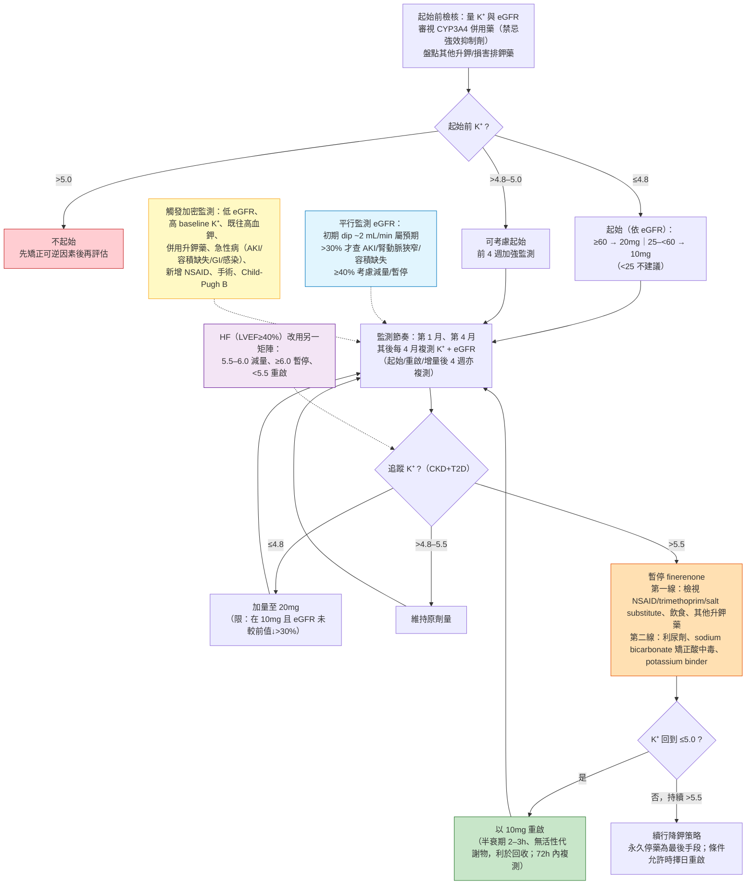

# 門診可執行 workflow：K⁺ 監測與暫停-重啟 algorithm

> 本文為主題五（高血鉀與 eGFR dip 的安全工程學）之延伸拆解，把主文 §9「門診可執行 workflow」獨立擴充成專科化、可直接照做的門診決策流。核心命題：finerenone 的安全性不是靠「小心」，而是靠一套有明確**進入條件、監測節奏、退出與重啟規則**的 protocol——把「看到一個 K⁺ 數字」變成「照流程走下一步」。
>
> **引用標記慣例**：📄 = 本地全文可 grep 稽核；📌 = 僅取得 abstract（不對其未載內容作具體數字斷言）。每個閾值／劑量／百分比句末以 `[本地MD檔名]` 標註來源供 grep 回溯。LLM 僅負責組織與改寫，所有數字均出自本地 MD 檔。
>
> **證據分層**：🟢 guideline routine（已進 label／指引常規）｜🟡 evidence expansion（trial 衍生、實務共識、post hoc）｜🔴 尚待驗證（未定稿草案或缺直接 hard-outcome 佐證）。
>
> **交叉連結（勿重複內容）**：起始前 CYP3A4 併用藥審查見 `cyp3a4_interaction_prescribing_rules.md`（§5）；CKD vs HF 暫停矩陣的完整版見 `label_guideline_safety_framework.md`（§2）；場景化高血鉀工程見 `hyperkalemia_engineering_by_scenario.md`（§3）；eGFR dip 之血流動力學可逆性見 `egfr_dip_hemodynamic_reversible.md`（§4）；雙向電解質（含低血鉀）見 `hypokalemia_bidirectional_electrolyte.md`（§6）；potassium binder 角色見 `potassium_binder_role.md`（§7）。

---

## 0. 一句話定位

finerenone 的門診管理可濃縮成三個問句：**能不能起始？（K⁺ 與 eGFR 閾值）→ 起始後何時複測？（1 月、4 月、其後每 4 月）→ 追蹤數字往哪走？（加量／維持／暫停-重啟）**。三個問句都有 label 與 KDIGO 明文答案，門診只要對號入座。

---

## 1. 起始前檢核（Pre-initiation checklist）🟢

label 的起始前要求極精簡但不可略：**在所有病人起始前量 serum potassium 與 eGFR，並據以給藥**[label_guideline_safety_Bayer_2025]。專科落地時把它拆成四項並行檢核：

1. **量 K⁺**：這是進入門檻的第一道閘（見 §2）。FDA label 明訂 **K⁺ >5.0 mEq/L 不得起始**[label_guideline_safety_Bayer_2025]；EMA 則細分為 ≤4.8 可起始、>4.8 至 5.0 可考慮起始並加強監測、>5.0 不起始[label_guideline_safety_European_2022]。trial 的實際入選門檻更嚴：FIDELIO-DKD／FIGARO-DKD／CONFIDENCE 皆要求篩選期 K⁺ 一致 ≤4.8 mmol/L，臨床選人也應鎖定「持續」達到此目標者[KDIGO_2026_Diabetes_CKD_draft]🔴。
2. **量 eGFR**：決定起始劑量（見 §2），並作為日後 dip 監測的基線[label_guideline_safety_Bayer_2025]。
3. **審視 CYP3A4 併用藥**：強效 CYP3A4 抑制劑為**禁忌**（itraconazole、clarithromycin、ketoconazole、ritonavir 等），葡萄柚汁應避免；中／弱效抑制劑需在起始／調量時加測 K⁺[label_guideline_safety_Wanner_2022]。完整清單與處置規則交叉見 `cyp3a4_interaction_prescribing_rules.md`。
4. **盤點其他升鉀／損害排鉀藥**：不得與保鉀利尿劑（amiloride、triamterene）及其他 MRA（spironolactone、eplerenone、esaxerenone）併用；與 K⁺ 補充劑、含鉀鹽替代品、trimethoprim／複方磺胺併用需加強監測（必要時暫停 finerenone）[label_guideline_safety_Wanner_2022][label_guideline_safety_European_2022]。

> 起始前的目標是把**可逆的升鉀因素先清掉**，再讓 finerenone 進場——這樣後續一旦 K⁺ 上升，才知道是藥物本身還是背景干擾。

---

## 2. 起始決策（依 K⁺ 閾值 × eGFR 劑量）🟢

### 2.1 K⁺ 閘門（EMA 三分法）

| 起始前 K⁺（mmol/L） | 決策 |
|---|---|
| ≤ 4.8 | 可起始[label_guideline_safety_European_2022] |
| > 4.8 至 5.0 | 可考慮起始，**前 4 週加強監測** serum potassium[label_guideline_safety_European_2022] |
| > 5.0 | **不起始**，先矯正可逆因素後再評估[label_guideline_safety_European_2022][label_guideline_safety_Bayer_2025] |

### 2.2 eGFR → 起始劑量（CKD+T2D）

| eGFR（mL/min/1.73 m²） | 起始劑量 |
|---|---|
| ≥ 60 | 20 mg once daily[label_guideline_safety_Bayer_2025] |
| ≥ 25 至 < 60 | 10 mg once daily[label_guideline_safety_Bayer_2025] |
| < 25 | 不建議起始[label_guideline_safety_Bayer_2025] |

CKD+T2D 的**目標劑量為 20 mg once daily**[label_guideline_safety_Bayer_2025]。（心衰 LVEF≥40% 之起始劑量相同，但目標劑量依起始 eGFR 為 40 mg 或 20 mg，且 HF 病人 eGFR<25 亦不建議起始——完整 HF 劑量與暫停矩陣見 `label_guideline_safety_framework.md`）[label_guideline_safety_Bayer_2025]。

---

## 3. 監測節奏（Monitoring cadence）🟢

trial 用的節奏就是門診該抄的節奏：**第 1 月、第 4 月、其後每 4 月**複測 serum potassium（＋eGFR）[label_guideline_safety_Wanner_2022][label_guideline_safety_Kidney_2024]。此節奏與 KDIGO 對 CKD 病人建議的常規生化監測一致（UACR>300 且 eGFR<60 者一年 3–4 次）[label_guideline_safety_Wanner_2022]。

**額外複測時機**：EMA 要求在**起始／重啟／增量後 4 週**再測 K⁺ 與 eGFR，其後才轉為 periodically[label_guideline_safety_European_2022]；KDIGO 糖尿病指引對 RASi 亦是「起始或調量後 2–4 週」內複測 creatinine 與 K⁺[label_guideline_safety_Wanner_2022][KDIGO_2026_Diabetes_CKD_draft]。**creatinine／eGFR 必須與 K⁺ 同時監測**（KDIGO Figure 26 註）[label_guideline_safety_Kidney_2024]。

---

## 4. 追蹤 K⁺ 分岔（CKD+T2D 劑量調整）🟢

依 label 的三段式分岔（CKD+T2D 適應症）：

| 追蹤 K⁺（mmol/L） | 在 10 mg | 在 20 mg |
|---|---|---|
| ≤ 4.8 | 增量至 20 mg（*但若 eGFR 較前值下降 >30% 則維持 10 mg*） | 維持 20 mg |
| > 4.8 至 5.5 | 維持 10 mg | 維持 20 mg |
| > 5.5 | 暫停；K⁺ ≤5.0 時以 10 mg 重啟 | 暫停；K⁺ ≤5.0 時以 10 mg 重啟 |

（分岔規則[label_guideline_safety_European_2022][label_guideline_safety_Bayer_2025]；「eGFR 較前值下降 >30% 則維持 10 mg」為 EMA Table 2 註腳明文[label_guideline_safety_European_2022]。）

**K⁺ >5.5 的降鉀階梯**（暫停後的第一線／第二線）：
- **第一線（先找可逆因素）**：檢視並停用／調整 NSAID、trimethoprim、含鉀鹽替代品與其他升鉀藥；moderate dietary potassium intake（減少高鉀食物）；盤點其他共病用藥[label_guideline_safety_Kidney_2024][label_guideline_safety_Wanner_2022]。
- **第二線（藥理降鉀）**：加用利尿劑（potassium-wasting diuretics）、以 sodium bicarbonate 矯正代謝性酸中毒、必要時加 potassium binder[label_guideline_safety_Wanner_2022][label_guideline_safety_Kidney_2024]。binder 在 trial 中屬 investigator discretion、使用率不高（FIDELIO-DKD 10.8% vs 6.5%、FIGARO-DKD 4.5% vs 2.8%）[label_guideline_safety_Wanner_2022]；細節見 `potassium_binder_role.md`。

---

## 5. 暫停-重啟規則（Hold–Restart）🟢

- **暫停門檻（CKD+T2D）**：K⁺ >5.5 mmol/L 暫停 finerenone[label_guideline_safety_European_2022][label_guideline_safety_Bayer_2025]。
- **重啟門檻**：K⁺ 回到 **≤5.0 mmol/L 時以 10 mg once daily 重啟**[label_guideline_safety_Bayer_2025][label_guideline_safety_European_2022]；重啟後 4 週再複測（見 §3）[label_guideline_safety_European_2022]。
- **為何暫停有效**：finerenone **半衰期短、僅 2–3 小時且無活性代謝物**，故停藥即可讓 K⁺ 快速回收——高血鉀「可用停藥處置」[label_guideline_safety_Wanner_2022][pooled_safety_hyperkalemia_Agarwal_2022]。KDIGO 2026 草案據此指出**多數高血鉀事件可用 72 小時的暫停處理**（暫停後 72 小時內複測 K⁺）[KDIGO_2026_Diabetes_CKD_draft]🔴。
- **持續 >5.5 怎麼辦**：續行 §4 降鉀策略；**永久停藥是最後手段**，KDIGO 的核心倫理是暫停後務必在事件解除、條件允許時擇日重啟，別讓高風險病人被剝奪所需藥物[label_guideline_safety_Kidney_2024]。trial 資料佐證此代價值得承受：因高血鉀永久停藥僅 **1.7% vs 0.6%（finerenone vs placebo）**，且 13,000 餘人、追蹤中位 3 年**無任何高血鉀相關死亡**[label_guideline_safety_Wanner_2022][label_guideline_safety_European_2022]。

---

## 6. CKD vs HF 的閾值差異（同一支藥、兩套矩陣）🟢

門診最容易踩雷之處：**暫停/減量閾值依適應症不同**。

| 情境 | 維持區 | 減量 | 暫停 |
|---|---|---|---|
| **CKD+T2D** | K⁺ ≤5.5 續用 | —（僅暫停後降階至 10 mg 重啟） | K⁺ **>5.5** 暫停，≤5.0 以 10 mg 重啟[label_guideline_safety_Bayer_2025][label_guideline_safety_European_2022] |
| **HF（LVEF≥40%）** | K⁺ <5.5 續用 | K⁺ **5.5 至 <6.0** 減量一階 | K⁺ **≥6.0** 暫停，K⁺ <5.5 以 10 mg 重啟[label_guideline_safety_Bayer_2025][label_guideline_safety_European_2022] |

也就是說 HF 適應症把「5.5–6.0」設為**減量帶**而非暫停帶、暫停門檻抬高到 ≥6.0，重啟門檻放寬到 <5.5[label_guideline_safety_European_2022]。這與 KDIGO 2024 Figure 26 註腳的判斷相呼應：工作組認為 5.5 的閾值「偏保守」，**K⁺ 5.5–6.0 者續用 MRA 亦屬合理**[label_guideline_safety_Kidney_2024]。HF 的完整三劑量（10/20/40 mg）暫停矩陣見 `label_guideline_safety_framework.md`。

> 誠實邊界：CKD 用 >5.5、HF 用 ≥6.0，差異來自 label 對兩適應症之分別核准，非同一 RCT 頭對頭比較；跨適應症外推須依實際核准情境判讀。

---

## 7. eGFR dip 平行監測分支（別把 dip 誤讀成停藥理由）🟡

K⁺ 監測的同一次抽血就把 eGFR 一起看，但**兩者用不同的判讀尺**：

- **初期 dip 屬預期**：finerenone 初期 eGFR 平均下降約 **2 mL/min/1.73 m²**，隨時間衰減、於持續治療下 appeared reversible[label_guideline_safety_European_2022]。
- **>30% 才啟動評估**：KDIGO PP 2.1.4 明訂「起始血流動力學活性療法者，後續 GFR 下降 >30% 才超出預期變異、需評估」[label_guideline_safety_Kidney_2024]；此時查 **AKI、容積缺失、腎動脈狹窄、共病用藥**（利尿劑、NSAID）[label_guideline_safety_Kidney_2024]。RASi 歷史更寬：Ku 的 17 試驗、n=11,800 整合顯示 **3 個月 ≤13%（95% CI 8% 至 17%）或 1 個月 ≤21%（95% CI 15% 至 27%）** 的下降，其 kidney failure 風險仍優於「無下降」（13% 閾值處 adjusted HR 1.02，95% CI 0.86 至 1.22）[r2_Ku_2024]。
- **≥40% 的 EMA 額外提示**：eGFR 較前值下降 ≥40% 時考慮減量或暫停，穩定後再上調[label_guideline_safety_European_2022]。
- **劑量互動**：即使 K⁺ 允許增量，**若 eGFR 較前值下降 >30% 仍維持 10 mg 不加量**[label_guideline_safety_European_2022]。

dip 的血流動力學可逆性完整論述（含 Matsumoto 脫鉤、Goulooze 模型）見 `egfr_dip_hemodynamic_reversible.md`。

---

## 8. 觸發更頻繁監測的情境（Wanner 實務清單）🟢

以下任一出現時，把 §3 的節奏改密：

- **低 eGFR**（EMA：eGFR <60 及高齡者風險較高、應更頻繁監測）[label_guideline_safety_European_2022][label_guideline_safety_Wanner_2022]。
- **高 baseline K⁺**、**既往高血鉀episode**[label_guideline_safety_European_2022][label_guideline_safety_Wanner_2022]。
- **併用升鉀或損害排鉀之藥**（含 K⁺ 補充劑、鹽替代品）[label_guideline_safety_Wanner_2022]。
- **急性病**：AKI、容積缺失、腸胃問題（腹瀉等）、感染[label_guideline_safety_Wanner_2022]。
- **新增 NSAID**、**手術**（surgery）[label_guideline_safety_Wanner_2022]。
- **中度肝功能不全（Child-Pugh B）**：應考慮額外的 K⁺ 監測（重度肝損害則不應使用）[label_guideline_safety_Wanner_2022]。

---

## 9. 整合決策流程圖（Mermaid）

**逐節點文字說明**：
- **S（起始前檢核）**：量 K⁺／eGFR、審 CYP3A4、盤點升鉀藥[label_guideline_safety_Bayer_2025][label_guideline_safety_Wanner_2022]。
- **C1（K⁺ 閘門）**：>5.0 不起始／>4.8–5.0 加強監測起始／≤4.8 起始[label_guideline_safety_European_2022][label_guideline_safety_Bayer_2025]。
- **I1（eGFR 劑量）**：≥60→20mg、25–<60→10mg、<25 不建議[label_guideline_safety_Bayer_2025]。
- **M（節奏）**：1 月、4 月、其後每 4 月；調量後 4 週加測[label_guideline_safety_Wanner_2022][label_guideline_safety_European_2022][label_guideline_safety_Kidney_2024]。
- **C2（追蹤分岔）**：≤4.8 加量、>4.8–5.5 維持、>5.5 暫停[label_guideline_safety_European_2022][label_guideline_safety_Bayer_2025]。
- **HOLD/RESTART**：>5.5 暫停、≤5.0 以 10mg 重啟；半衰期 2–3h[label_guideline_safety_Bayer_2025][pooled_safety_hyperkalemia_Agarwal_2022][label_guideline_safety_Wanner_2022]。
- **ES（eGFR 分支）**：>30% 才評估、≥40% 考慮減量[label_guideline_safety_Kidney_2024][label_guideline_safety_European_2022][r2_Ku_2024]。
- **HFNOTE**：HF 改用 5.5–6.0 減量／≥6.0 暫停矩陣[label_guideline_safety_European_2022][label_guideline_safety_Bayer_2025]。

---

## 10. 指引升級的方向（誠實揭露草案狀態）🔴

KDIGO 2026 糖尿病 CKD 指引**草案（尚未定稿、依 2025 年 7 月文獻）**把 nsMRA 從 2024 版的建議強度上修：**Recommendation 4.4.1 為 1A**——對 T2D、eGFR ≥25、normal serum potassium、UACR ≥30 mg/g 且已用最大耐受 RASi 者，建議加用有實證的 nsMRA[KDIGO_2026_Diabetes_CKD_draft]。並以 **Practice Point 4.4.2** 支持在持續白蛋白尿且 K⁺ 正常者**同步起始 SGLT2i 與 nsMRA**（CONFIDENCE 佐證可安全併起）[KDIGO_2026_Diabetes_CKD_draft]。此升級把「選人＋監測即可安全」的天平正式寫入指引，但因屬公開審查草案，臨床採用仍應以正式定稿與在地核准為準。

---

## 11. 誠實邊界（Evidence limits）

- §1–§6 的閾值、劑量、監測節奏皆出自 label（FDA／EMA）與 KDIGO 2024，屬 🟢 guideline routine。
- §5 的「72 小時暫停」與 §10 的 1A／同步起始，出自 **KDIGO 2026 草案（未定稿）**，標 🔴。
- §7 的 dip 判讀（Ku 之 13%／21% 閾值）為 **17 個 RASi 試驗整合**、以 kidney failure 為終點，屬跨 class 外推至 finerenone 之 🟡 evidence expansion。
- 具體百分比（永久停藥 1.7% vs 0.6%、binder 使用率 10.8%/6.5%、4.5%/2.8%）專屬其原始 trial 族群（FIDELIO/FIGARO），外推須保留。

---

## 證據分層小結

| 論點 | 等級 | 主要本地全文來源 |
|------|------|------------------|
| 起始前量 K⁺+eGFR、K⁺>5.0 不起始 | 🟢 label | `label_guideline_safety_Bayer_2025` 📄 |
| K⁺ 三分法（≤4.8／>4.8–5.0／>5.0） | 🟢 label | `label_guideline_safety_European_2022` 📄 |
| eGFR→劑量（≥60→20mg；25–<60→10mg；<25 不建議） | 🟢 label | `label_guideline_safety_Bayer_2025` 📄 |
| 監測節奏（1 月、4 月、每 4 月；調量後 4 週） | 🟢 | `label_guideline_safety_Wanner_2022`、`label_guideline_safety_European_2022`、`label_guideline_safety_Kidney_2024` 📄 |
| 追蹤分岔（≤4.8 加量／>4.8–5.5 維持／>5.5 暫停） | 🟢 label | `label_guideline_safety_European_2022`、`label_guideline_safety_Bayer_2025` 📄 |
| 暫停 >5.5、≤5.0 以 10mg 重啟；半衰期 2–3h | 🟢🟡 | `label_guideline_safety_Bayer_2025`、`pooled_safety_hyperkalemia_Agarwal_2022`、`label_guideline_safety_Wanner_2022` 📄 |
| CKD（>5.5）vs HF（≥6.0）閾值差異 | 🟢 label | `label_guideline_safety_European_2022`、`label_guideline_safety_Bayer_2025` 📄 |
| eGFR dip >30% 才評估、Ku 13%/21% 閾值 | 🟡 | `label_guideline_safety_Kidney_2024`、`r2_Ku_2024` 📄 |
| 加密監測觸發清單（Child-Pugh B、急性病等） | 🟢 | `label_guideline_safety_Wanner_2022` 📄 |
| 72h 暫停、1A 升級、SGLT2i 同步起始 | 🔴 草案 | `KDIGO_2026_Diabetes_CKD_draft` 📄（未定稿） |

## 本地全文語料（可 grep 稽核）

📄 全文：`label_guideline_safety_Bayer_2025`（FDA/DailyMed 2025 label）、`label_guideline_safety_European_2022`（EMA 產品文件）、`label_guideline_safety_Kidney_2024`（KDIGO 2024 PP 2.1.4/3.6.3/3.6.4、Figure 26）、`label_guideline_safety_Wanner_2022`（finerenone 鉀管理實務）、`pooled_safety_hyperkalemia_Agarwal_2022`（FIDELIO 高血鉀 post hoc，半衰期 2–3h）、`r2_Ku_2024`（17 RASi 試驗整合 dip 閾值）、`KDIGO_2026_Diabetes_CKD_draft`（2026 糖尿病 CKD 指引草案，未定稿）。

---

## References（本地可稽核）

1. Bayer HealthCare Pharmaceuticals Inc. KERENDIA (finerenone) US Prescribing Information, NDA 215341, revised 8/2025. 📄 [label_guideline_safety_Bayer_2025]
2. European Medicines Agency. Kerendia (finerenone) product information (SmPC 4.2/4.4/4.8). 2022. 📄 [label_guideline_safety_European_2022]
3. Kidney Disease: Improving Global Outcomes (KDIGO) CKD Work Group. KDIGO 2024 Clinical Practice Guideline for the Evaluation and Management of CKD (PP 2.1.4, 3.6.3, 3.6.4, Figure 26). *Kidney Int.* 2024;105(4S):S117-S314. 📄 [label_guideline_safety_Kidney_2024]
4. Wanner C, Fioretto P, Kovesdy CP, et al. Potassium management with finerenone: practical aspects. *Endocrinol Diabetes Metab.* 2022;5:e360. 📄 [label_guideline_safety_Wanner_2022]
5. Agarwal R, Joseph A, Anker SD, et al. Hyperkalemia risk with finerenone: results from the FIDELIO-DKD trial. *J Am Soc Nephrol.* 2022;33(1):225-237. 📄 [pooled_safety_hyperkalemia_Agarwal_2022]
6. Ku E, et al. Subacute declines in eGFR after RAS inhibitor initiation and risk of kidney failure: pooled analysis of 17 trials (n=11,800). 2024. 📄 [r2_Ku_2024]
7. Kidney Disease: Improving Global Outcomes (KDIGO). KDIGO 2026 Clinical Practice Guideline for Diabetes Management in CKD — public review draft (Rec 4.4.1, PP 4.4.2/4.4.3). 尚未定稿. 📄 [KDIGO_2026_Diabetes_CKD_draft]

---
*此檔為主題五之延伸拆解，撰寫日期基準 2026-07-11。所有閾值／劑量／百分比均可 grep 回上列本地全文 MD。§1–§6 為 label／KDIGO 2024 常規（🟢）；§5 的 72h 與 §10 的 1A/同步起始出自 KDIGO 2026 草案、未定稿（🔴）；§7 的 dip 閾值屬跨 class 外推之 evidence expansion（🟡）。*
