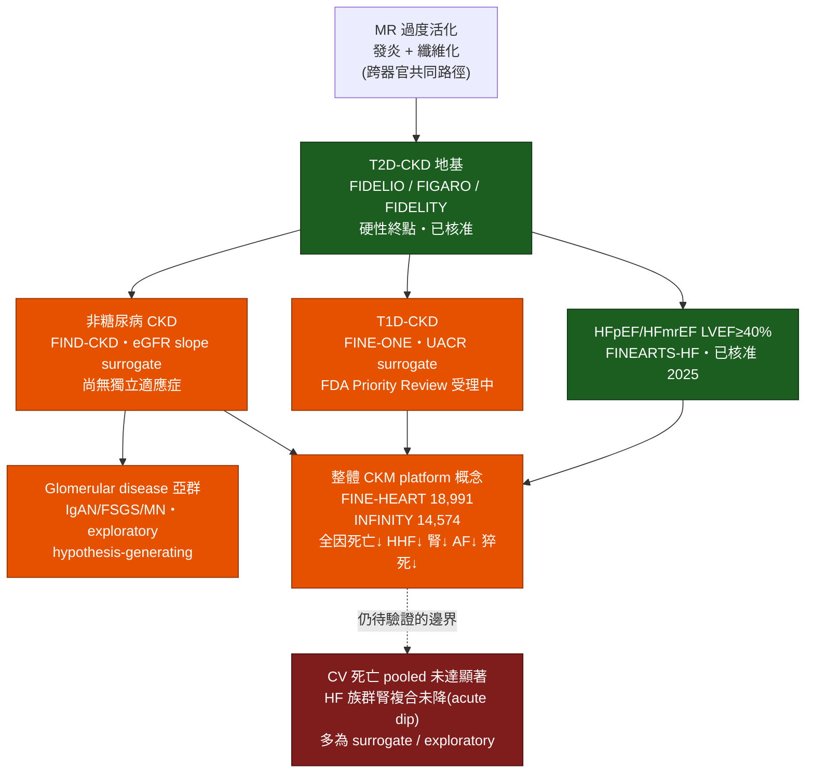

# 主題候選六 — 超越 T2D 的心腎版圖：finerenone 從 diabetic kidney disease 走向 CKM platform 的證據臨界點

> **讀者定位**：內分泌科學術聽眾,預設已熟悉 FIDELIO-DKD / FIGARO-DKD / FIDELITY / FIND-CKD 與 finerenone 在 T2D-CKD 的核心心腎益處。本文背景從簡,重心放在 2024–2026 的次分析、亞群分析與 pooled analysis 所帶來的「重新定位」訊號,以及與之並置的方法學保留。
>
> **證據分級標註慣例**:本文於每一段落末端以 `[本地MD檔名]` 標記事實來源供 grep 稽核;引用型態以 📄(取得本地全文/OA 全文)與 📌(僅取得 abstract,不對其未載內容作具體數字斷言)區分。文中並明確標示各項證據屬 **guideline routine(已進指引常規)**、**evidence expansion(證據擴張中)** 或 **surrogate-based(以替代終點為主)**。

---

## 1. 精煉背景:T2D-CKD 這塊已被指引固化的地基(約佔全文 25%)

finerenone 作為 T2D-CKD 治療的證據核心,由三份文件構成,此處僅作極簡複習以供後文對讀。

**FIDELIO-DKD** 收 5734 名 T2D-CKD 病人,以 kidney failure / 持續 eGFR 下降 ≥40% / 腎因死亡的**腎臟複合終點為 primary**,HR 0.82(95% CI 0.73–0.93,P=0.001);關鍵次要 CV 複合終點 HR 0.86(0.75–0.99,P=0.03)[FIDELIO-DKD_NEJMoa2025845.md] 📄。**FIGARO-DKD** 收 7437 人,將設計反轉,以 CV 死亡 / 非致死性 MI / 非致死性 stroke / HHF 的**心血管複合終點為 primary**,HR 0.87(0.76–0.98,P=0.03),益處主要由 HHF 驅動(HR 0.71,0.56–0.90)[FIGARO-DKD_NEJMoa2110956.md] 📄。

**FIDELITY** 將兩試驗合併(排除 GCP violation 後 N=13,026),CV 複合終點 HR 0.86(0.78–0.95,P=0.0018)、以 ≥57% eGFR 下降定義的腎臟複合終點 HR 0.77(0.67–0.88,P=0.0002),ESKD 降 20%(HR 0.80,0.64–0.99)[FIDELITY_Agarwal_2022.md] 📄。

這三份構成的敘事非常清楚:**在具白蛋白尿的 T2D-CKD、且已在 RAS 阻斷背景上,finerenone 同時降低腎臟進展與 HHF**。此一結論已屬 **guideline routine**——多數多專科指引強推,並要求疊加於最大耐受 RASi(±SGLT2i)之上[fine_heart_pooled_Vaduganathan_2024.md] 📄。

**指引位階更新(較早版本 vs 2026 草案之變化)**:在較早的 **KDIGO 2024 CKD 指引**中,T2D 的 nsMRA 為 **2A 級「suggest」(Recommendation 3.8.1:"We suggest a nonsteroidal mineralocorticoid receptor antagonist with proven kidney or cardiovascular benefit for adults with T2D, an eGFR >25 ml/min per 1.73 m², normal serum potassium concentration, and albuminuria (>30 mg/g) despite maximum tolerated dose of RAS inhibitor (2A)")**[guideline_kdigo2024_ckd_Levin_2024.md] 📄;而 **KDIGO 2026 糖尿病與 CKD 指引更新(公開審查草案,尚未定稿)** 已將對應條文改列為 **Recommendation 4.4.1(1A / recommend)**——"We recommend adding a nonsteroidal mineralocorticoid receptor antagonist (nsMRA) with proven kidney or cardiovascular benefit for people with T2D, an eGFR ≥25 ml/min per 1.73 m², normal serum potassium concentration, and albuminuria (UACR ≥30 mg/g) while on maximum tolerated dose of RAS inhibitor (1A)"[KDIGO_2026_Diabetes_CKD_draft] 📄。兩相對讀即由「suggest(2A)」轉為「recommend(1A)」;草案並敘明其理由為:自前一版指引以來,Work Group 判斷 nsMRA 之可用性與臨床熟悉度已提高,且多數知情之醫療人員與病人會選擇使用(draft 未載明具體舊條號/等級代碼,「2A→1A」之對比係並置 KDIGO 2024 條文與 2026 草案條文所得)[KDIGO_2026_Diabetes_CKD_draft] 📄。同一草案並將 nsMRA 定位為疊加於 foundational therapy(SGLT2i + RASi + statin)之上的 "additional risk-based" 治療(Figure 19),且新增 **Practice Point 4.4.2:SGLT2i 與 nsMRA 可同步起始**(依 CONFIDENCE:合併治療 day 180 UACR 較 finerenone 單藥多降 29%〔LSM ratio 0.71;0.61–0.82〕、較 empagliflozin 多降 32%〔0.68;0.59–0.79〕)、**4.4.3 選血鉀一貫正常者並規律監測、4.4.4 優先選有腎/CV 實證之 nsMRA、4.4.7 不與類固醇型 MRA 併用**[KDIGO_2026_Diabetes_CKD_draft] 📄。此外,為此次更新所做之新統合分析(7 studies,nsMRA vs placebo,T2D+CKD)顯示 kidney composite HR 0.84(0.77–0.92)、kidney failure HR 0.84(0.71–0.99)、HF/HHF HR 0.78(0.66–0.92),而 all-cause mortality RR 0.90(0.81–1.00)、CV mortality RR 0.88(0.76–1.02)、nonfatal stroke RR 1.01(0.83–1.22)、nonfatal MI RR 0.92(0.75–1.13)均未達顯著,高血鉀 RR 2.09(1.82–2.39)、K≥5.5 RR 2.18(1.98–2.40)[KDIGO_2026_Diabetes_CKD_draft] 📄。*(以上均為 KDIGO 2026 公開審查草案 Chapter 4,尚未定稿、內容可能因回饋而改變。)*

真正的科學張力不在於「finerenone 在 T2D-CKD 有沒有效」,而在於:**它的心腎益處到底是不是 T2D-specific?** 從機轉看,mineralocorticoid receptor(MR)過度活化所驅動的發炎與纖維化,並非糖尿病專屬;它是跨越多種 CKD 病因、以及跨越心腎代謝(cardiovascular-kidney-metabolic, CKM)光譜的共同路徑[find_ckd_nondiab_Neuen_2026.md] 📄[fine_heart_pooled_Vaduganathan_2024.md] 📄。2023 年 AHA Presidential Advisory 正式將 CKM syndrome 定義為一個以異常/過量脂肪組織為底、逐步收斂至臨床 CVD 的四階段連續光譜,並將 MRA 列入 CKM 治療藥物之一——這為 finerenone 的「跨疾病」定位提供了概念框架[finearts_hfpef_ckm_Claudel_2023.md] 📄。

以下四個新板塊,正是 2024–2026 年把這個「是否 T2D-specific」的問題逐一拆解的證據。

---

## 2. 板塊一:T1D-CKD — FINE-ONE 打破近三十年的空白(surrogate-based / evidence expansion)

自 1990 年代以來,T1D-CKD 幾乎沒有新的陽性第三期試驗;約 20–30% 的美國 T1D 成人合併 CKD,長期只能沿用 RASi[fine_one_t1d_Bayer_2026.md] 📄。

**FINE-ONE**(NCT05901831)是一個關鍵性、全球、雙盲、第三期試驗,收 242 名 T1D + CKD(eGFR 25 至 <90、UACR 200 至 <5000 mg/g、已用 ACEi/ARB)成人,隨機給 finerenone 10/20 mg 或 placebo,**primary 為 6 個月 UACR 相對變化**[fine_one_t1d_Heerspink_2026.md] 📌。結果:finerenone 組 UACR 降 34%(GMR 0.66,95% CI 0.60–0.73),placebo 組降 12%(GMR 0.88,0.79–0.98),換算為**placebo-corrected 約 25% 額外下降**(GMR 0.75,95% CI 0.65–0.87,P<0.001)[fine_one_t1d_Heerspink_2026.md] 📌。安全訊號與 T2D 經驗一致但**高血鉀明顯增加:10.1% vs 3.3%**,其中 1.7% 因高血鉀停藥(vs 0%);6 個月 eGFR 變化 −5.6 vs −2.7 mL/min/1.73m²(差 −2.9,95% CI −5.1 至 −0.7),且於 washout 期回復——為典型 haemodynamic acute dip[fine_one_t1d_Heerspink_2026.md] 📌[fine_one_t1d_Bayer_2026.md] 📄。

一份 exploratory 分析進一步顯示:UACR 效果**不因基線 HbA1c 三分位或糖尿病病程而異**(P interaction 分別 0.41、0.70),且 6 個月 HbA1c 未改變(組間差 +0.04%,P=0.74)——支持 finerenone 的抗白蛋白尿作用獨立於血糖控制[fine_one_t1d_Beernink_2026.md] 📌。

**關鍵方法學保留(誠實對讀)**:FINE-ONE 的 primary **是 UACR,一個 bridging biomarker,而非硬腎臟終點**。設計文件明白寫道,UACR 之所以能作為 T1D 註冊的橋接生物標記,是基於 T2D 試驗中「UACR 治療效果與腎臟結局效果相關」這一外推,並經法規回饋同意在符合條件下採用[fine_one_t1d_Heerspink_2023.md] 📌。換言之,**T1D 的證據強度目前仍是 surrogate-based,不等同 FIDELIO/FIGARO 的硬終點等級**。

**核准狀態(截至 2026-07-08 必須精確陳述)**:FDA 已於 2026 年 5 月**「接受」sNDA 並授予 Priority Review**,若獲准將成為**首個** T1D-CKD 適應症的 MRA——但這仍屬 priority review 之受理,**尚非既成核准**[fine_one_t1d_Bayer_2026.md] 📄。

**指引時態更新——從「證據擴張」推進到(草案)指引建議**:**KDIGO 2026 糖尿病與 CKD 指引更新(公開審查草案,尚未定稿)** 已**首度納入 T1D 的 nsMRA 建議——Recommendation 4.7.1(2C / suggest)**:"We suggest adding an nsMRA with proven kidney or cardiovascular benefit for people with T1D, eGFR ≥25 ml/min per 1.73 m², normal serum potassium concentration, and albuminuria (UACR ≥200 mg/g) while on maximum tolerated dose of RASi (2C)";Work Group 係將 T2D 的大型 RCT 證據外推至 T1D、以 albuminuria 為 "bridging biomarker",並因 indirectness 作單一 GRADE 降級,故僅支持 Level 2 建議[KDIGO_2026_Diabetes_CKD_draft] 📄。**三點必須並置標明**:(a) 這是**指引草案而非法規核准**——FDA 對 T1D-CKD 之 sNDA 仍在 priority review、尚未核准;(b) **2C(低等級 suggest)與 T2D 的 1A(Rec 4.4.1)存在明顯位階差**,反映證據強度不同;(c) 依據仍是 **FINE-ONE 的 UACR 替代終點**(bridging biomarker),而非硬腎臟終點。此為把「T1D 從證據擴張推進到(草案)指引建議」的重要時態更新,惟該草案 Chapter 4 尚未定稿、內容可能因回饋而改變[KDIGO_2026_Diabetes_CKD_draft] 📄。

---

## 3. 板塊二:非糖尿病 CKD — FIND-CKD 首度以硬性腎臟斜率立論(evidence expansion,主終點為 surrogate)

**FIND-CKD**(NCT05047263)是**首個**在非糖尿病病因 CKD 檢驗 finerenone 的第三期試驗,收 1584 人(finerenone 793 / placebo 791),eGFR 25 至 <90、UACR 200 至 ≤3500 mg/g、已用 RASi;**primary 為 total eGFR slope(baseline 至 month 32 的年變化率)**[find_ckd_nondiab_Heerspink_2026.md] 📄。基線以慢性腎絲球腎炎(57.0%,其中 IgAN 26.3%)與高血壓/缺血性腎病變(29.0%)為主,約半數經腎切片確診[glomerular_subgroup_Heerspink_2025.md] 📄。

結果:total eGFR slope −3.3(95% CI −3.6 至 −3.1)vs placebo −4.0(−4.3 至 −3.8),**差 0.7 mL/min/1.73m²/年(95% CI 0.3–1.1,P<0.001)**;階層檢定的**關鍵次要 cardiorenal 複合終點 HR 0.77(95% CI 0.60–0.99,P=0.04)**;分拆的腎臟複合 HR 0.78(0.60–1.01)、CV 複合 HR 0.60(0.27–1.33,寬信賴區間,事件少)。高血鉀 17.0% vs 13.3%,因高血鉀停藥 1.5% vs 0.1%,住院 0.9% vs 0.6%[find_ckd_nondiab_Heerspink_2026.md] 📄。

**方法學保留**:primary 是 **eGFR slope(surrogate)**,不是 kidney failure 本身;設計文件援引 66 個 RCT 的 meta-analysis(0.75 mL/min/1.73m²/年的斜率效果對應 57% GFR 下降/腎衰竭終點的中位 HR 0.74)為斜率之效度背書,但仍屬替代終點外推;且 CV 複合的信賴區間極寬,不足以獨立支撐 CV 益處[glomerular_subgroup_Heerspink_2025.md] 📄。**核准狀態:尚無非糖尿病 CKD 之獨立適應症**——此板塊屬 evidence expansion。

---

## 4. 板塊三:Glomerular disease — 最引人但層級最低的 exploratory subgroup(exploratory / surrogate-based)

FIND-CKD 內含一個**預先指定的 exploratory 亞群分析**:903 名(57.0%)investigator-reported glomerular disease,含 IgAN 416(46.1%)、FSGS 215(23.8%)、膜性腎病變 90(10.0%);此分析組 finerenone 446 vs placebo 457[glomerular_subgroup_Neuen_2026.md] 📄。

結果:total eGFR slope −3.50 vs −4.23 mL/min/1.73m²/年(**差 0.73,95% CI 0.22–1.24**);**month 12 白蛋白尿降 42%(95% CI 35%–48%)**;kidney failure 或 ≥40% eGFR 下降為 7.42 vs 9.60 events/100 patient-years(**HR 0.74,95% CI 0.57–0.97**)[glomerular_subgroup_Neuen_2026.md] 📄。取得本地全文後可補一項強化內部一致性的細節:903 人中有 712 人(78.8%)於納入前已接受腎切片,在僅限此腎切片確診病例的敏感度分析,腎複合益處幾乎相同(7.52 vs 10.31 events/100 patient-years,HR 0.74,95% CI 0.55–0.99)[glomerular_subgroup_Neuen_2026.md] 📄。

這是本主題中**臨床上最吸睛**的一塊:在以 IgAN 與 FSGS 為主、目前治療選項有限的族群,finerenone 同時改善斜率、白蛋白尿與一個硬性腎臟複合。**但誠實地說,這是層級最低的證據**:它是一個 subgroup 內的 exploratory outcome(≥40% 而非 ≥57% 閾值),trial 本身並非以此為 powered primary,不能作為個別腎絲球疾病(如 IgAN)之確證。這屬 **exploratory + surrogate-based**,適合作為 hypothesis-generating,不宜直接改變 practice。

---

## 5. 板塊四:HFpEF/HFmrEF 與 CKM pooling — 從器官終點走向整體 CKM platform(pooled / 詮釋邊界最寬)

### 5.1 FINEARTS-HF 本體:EF 光譜一致,但「HF 內的腎臟益處」出現反向訊號

在 HFmrEF/HFpEF(LVEF ≥40%),finerenone 降低 CV 死亡與惡化 HF 事件,且此益處**橫跨整個 LVEF 光譜一致**(LVEF <50% RR 0.84、50–<60% RR 0.80、≥60% RR 0.94;P interaction=0.70;連續變項 P interaction=0.28)[finearts_hfpef_ckm_Docherty_2025.md] 📄。

但**這裡出現一個對讀時不可略過的反向訊號**:在 FINEARTS-HF 的 HF 族群,finerenone **並未**降低 ≥50% eGFR 下降/腎衰竭的腎臟複合終點——事件反而數值上較多(75 vs 55,HR 1.33,95% CI 0.94–1.89),主因是治療初期 −2.9 mL/min/1.73m² 的 acute eGFR dip,而 3 個月後的 chronic slope 並無差異(+0.2,95% CI −0.1 至 +0.4;total slope 差 −0.7);不過 finerenone 確實降低新發微量/巨量白蛋白尿 24%/38%[finearts_hfpef_ckm_Mc_2025.md] 📄。**這說明 finerenone 的「腎臟保護」在低白蛋白尿的 HF 族群並不自動成立,腎臟益處與 albuminuric CKD 背景高度綁定**——是本主題最重要的邊界提醒之一。

### 5.2 FINE-HEART pooled analysis:18,991 人的整體 CKM 效果

**FINE-HEART**(預先指定,FIDELIO-DKD + FIGARO-DKD + FINEARTS-HF,participant-level pooled,N=18,991,中位追蹤 2.9 年)是目前 finerenone 跨 CKM 光譜最大的整合分析[fine_heart_pooled_Vaduganathan_2024.md] 📄:

- **Primary(CV 死亡):HR 0.89(95% CI 0.78–1.01,P=0.076)——未達顯著**(納入未定死因的敏感度分析則 HR 0.88,0.79–0.98,P=0.025)。
- 全因死亡 HR 0.91(0.84–0.99,P=0.027);HHF HR 0.83(0.75–0.92,P<0.001);腎臟複合 HR 0.80(0.72–0.90,P<0.001,主由 FIDELIO/FIGARO 驅動);CV 死亡或 HHF HR 0.85(0.78–0.93)[fine_heart_pooled_Vaduganathan_2024.md] 📄。
- 效果橫跨 CKM 疾病負擔(1/2/3 個條件)一致(P interaction=0.94);2307 人(12.1%)同時具 HF+CKD+DM 三條件[fine_heart_pooled_Vaduganathan_2024.md] 📄。
- 安全:高血鉀相關**永久停藥 1.3% vs 0.5%、住院 0.8% vs 0.2%,無高血鉀死亡**;整體 serious AE 反而較低(34.6% vs 36.6%),無 AKI 過量[fine_heart_pooled_Vaduganathan_2024.md] 📄。

延伸的 FINE-HEART 次分析進一步描繪「整體 CKM 效果」:
- **新發心房顫動/撲動**:286(3.9%)vs 345(4.7%),HR 0.83(95% CI 0.71–0.97,P=0.019),橫跨 CKM 條件數一致[finearts_hfpef_ckm_Pabon_2025.md] 📄。
- **猝死(sudden death)**:418(2.2%),HR 0.81(95% CI 0.67–0.98,P=0.034),跨 trial 與 CKM 條件一致(並附 Ameri 等 2026 JACC editorial comment)[finearts_hfpef_ckm_Foa_2026.md] 📌。
- **JASN 的 CKD 導向 FINE-HEART 子集**(14,180 人):CV 死亡或 HHF HR 0.83(0.75–0.93,P=0.001);腎臟複合益處隨基線 UACR 升高而增大(P interaction=0.04);在納入 FINEARTS-HF 中「具白蛋白尿 CKD 但無糖尿病」者的敏感度分析,CV 死亡/HHF 益處**不隨 HbA1c 而異(P interaction=0.59)**——這是 pooled 層面首度把「非糖尿病」納入 CV 益處外推的探索性訊號[finearts_hfpef_ckm_Ostrominski_2026.md] 📄。

### 5.3 2026 Lancet(INFINITY):把糖尿病與非糖尿病 CKD 併在同一張森林圖

最新的 individual participant data meta-analysis(**INFINITY**;FIDELIO-DKD + FIGARO-DKD + **FIND-CKD**,14,574 人)是本主題「重新定位」論述的收束點:composite kidney outcome HR 0.76(95% CI 0.68–0.86)、kidney failure 單獨 0.85(0.74–0.99);composite CV HR 0.80(0.70–0.91),含 HHF 0.78(0.66–0.92)與 CV 死亡 0.82(0.67–0.999);全因死亡 0.88(0.79–0.99)。**效果一致於 glycaemic status、CKD 病因、基線 eGFR、白蛋白尿與 SGLT2i 使用與否**,作者據此主張 finerenone 為「跨病因 CKD 的 foundational therapy」[find_ckd_nondiab_Neuen_2026.md] 📄。

---

## 表 6:finerenone 跨 CKM 光譜的證據階梯

| 族群 | 代表證據 | 樣本 | 主要終點類型 | 關鍵結果 | 證據層級 | 核准狀態(2026-07-08) |
|---|---|---|---|---|---|---|
| **T2D-CKD** | FIDELIO/FIGARO/FIDELITY | 13,026(pooled) | **硬性**腎/CV 複合 | 腎 HR 0.77;CV HR 0.86 | guideline routine | ✅ 已核准(2021 起) |
| **HFpEF/HFmrEF (LVEF≥40%)** | FINEARTS-HF + Docherty | 6,001 | 硬性 CV死亡+惡化HF | 跨 EF 一致(P int 0.70) | 已核准 | ✅ 已核准(2025/07) |
| **T1D-CKD** | FINE-ONE | 242 | **surrogate**(6mo UACR) | −25% UACR;高血鉀 10.1% vs 3.3% | surrogate-based | 🟡 FDA 受理 Priority Review,尚未核准;**KDIGO 2026 草案 Rec 4.7.1(2C)suggest(公開審查草案・尚未定稿)**[KDIGO_2026_Diabetes_CKD_draft] |
| **非糖尿病 CKD** | FIND-CKD | 1,584 | **surrogate**(eGFR slope)+ 次要 cardiorenal | slope 差 0.7;cardiorenal HR 0.77 | evidence expansion | ❌ 無獨立適應症 |
| **Glomerular disease** | FIND-CKD 亞群(JAMA) | 903 | **exploratory** slope/白蛋白尿/腎複合 | 白蛋白尿 −42%;腎複合 HR 0.74 | exploratory | ❌ 無 |
| **整體 CKM(跨病因)** | FINE-HEART / INFINITY | 18,991 / 14,574 | pooled 全因死亡・HHF・腎複合 | 全因死亡 0.91;HHF 0.83;腎 0.80;CV死亡 NS | pooled(詮釋邊界最寬) | ❌ 概念層次,非適應症 |

---

## 圖:finerenone 的 indication expansion tree(Mermaid)

---

## 森林圖 3:diabetic vs non-diabetic CKD 的 pooled 腎/心血管結局對讀

下表以 HR(95% CI)並列呈現,凸顯「非糖尿病 CKD 的點估計與糖尿病一致、但單一試驗信賴區間較寬,須靠 pooled 才收斂」。`◄──●──►` 為信賴區間之示意刻度(左為 favours finerenone)。

| 結局 / 來源 | HR (95% CI) | 示意(HR=1 於右側 `┊`) |
|---|---|---|
| **腎臟複合** | | |
| FIDELITY(T2D,硬終點 ≥57%) | 0.77 (0.67–0.88) | `◄─●─► ┊` [FIDELITY_Agarwal_2022.md] 📄 |
| FIND-CKD(非DM,cardiorenal 次要) | 0.77 (0.60–0.99) | `◄──●───►┊` [find_ckd_nondiab_Heerspink_2026.md] 📄 |
| Glomerular 亞群(非DM,exploratory) | 0.74 (0.57–0.97) | `◄──●──►┊` [glomerular_subgroup_Neuen_2026.md] 📄 |
| INFINITY(DM+非DM pooled) | 0.76 (0.68–0.86) | `◄─●─►┊` [find_ckd_nondiab_Neuen_2026.md] 📄 |
| **心血管複合** | | |
| FIDELITY(T2D) | 0.86 (0.78–0.95) | `◄─●─►┊` [FIDELITY_Agarwal_2022.md] 📄 |
| FIND-CKD(非DM,CV 複合) | 0.60 (0.27–1.33) | `◄────●──────►` 跨越 1 [find_ckd_nondiab_Heerspink_2026.md] 📄 |
| INFINITY(DM+非DM pooled) | 0.80 (0.70–0.91) | `◄─●──►┊` [find_ckd_nondiab_Neuen_2026.md] 📄 |
| **全因死亡** | | |
| FINE-HEART(CKM pooled) | 0.91 (0.84–0.99) | `◄●►┊` [fine_heart_pooled_Vaduganathan_2024.md] 📄 |
| INFINITY(CKD pooled) | 0.88 (0.79–0.99) | `◄─●►┊` [find_ckd_nondiab_Neuen_2026.md] 📄 |

**判讀**:腎臟複合的點估計在糖尿病與非糖尿病間高度重疊(0.74–0.77),支持「腎臟益處非 T2D-specific」;但非糖尿病單一試驗(FIND-CKD)的 CV 複合信賴區間極寬且跨越 1,**CV 益處的外推目前只在 pooled 層次才收斂,個別非糖尿病試驗尚無法獨立證實**。

---

## 6. Discussion:證據興奮與方法學謹慎的並置

**支持「重新定位為 CKM platform」的論證鏈**:(1)機轉上,MR 過度活化是跨病因、跨器官的共同驅動,不是糖尿病專屬[find_ckd_nondiab_Neuen_2026.md] 📄;(2)T1D(UACR)、非糖尿病 CKD(eGFR slope)、glomerular disease(白蛋白尿+腎複合)三個新族群的方向一致[fine_one_t1d_Heerspink_2026.md] 📌[find_ckd_nondiab_Heerspink_2026.md] 📄[glomerular_subgroup_Neuen_2026.md] 📄;(3)pooled 層次(FINE-HEART 18,991、INFINITY 14,574)在全因死亡、HHF、腎複合、新發 AF、猝死均見一致益處,且橫跨 CKM 條件數與 glycaemic status[fine_heart_pooled_Vaduganathan_2024.md] 📄[finearts_hfpef_ckm_Pabon_2025.md] 📄[finearts_hfpef_ckm_Ostrominski_2026.md] 📄。這確實是一幅正在快速逼近「跨病因 CKD / CKM platform」的圖像。

**但方法學上必須逐項打折(反方論點最強之處)**:

1. **T1D 仍是 surrogate**。FINE-ONE 的 primary 是 UACR、一個經法規同意的 bridging biomarker,而非硬腎臟終點;它證明的是抗白蛋白尿效果,不是 kidney failure 之降低[fine_one_t1d_Heerspink_2023.md] 📌。

2. **非糖尿病 CKD 以 eGFR slope 為 primary**。FIND-CKD 之硬性 cardiorenal 複合僅為階層次要(HR 0.77,信賴區間上界貼近 1),CV 複合信賴區間寬到無法解讀;slope 之效度雖有 meta-analysis 背書,仍屬替代終點[find_ckd_nondiab_Heerspink_2026.md] 📄[glomerular_subgroup_Heerspink_2025.md] 📄。

3. **Glomerular disease 是 exploratory subgroup**,以較寬鬆的 ≥40% eGFR 閾值定義腎複合,非 powered 確證,不能推及個別腎絲球疾病(如 IgAN 專屬適應症)[glomerular_subgroup_Neuen_2026.md] 📄。

4. **HF 與 CKD 的 pooling 會擴張詮釋邊界**。最能說明此點的是:在純 HF 族群(FINEARTS-HF),finerenone **未**降低腎臟複合,事件甚至數值偏高(HR 1.33),因低白蛋白尿背景下腎益處不成立、且存在 acute eGFR dip[finearts_hfpef_ckm_Mc_2025.md] 📄。把這樣的族群併入「CKD 益處」敘事時,腎臟訊號實際由 FIDELIO/FIGARO 驅動,pooling 的方向一致並不代表每個子族群都獨立受益[fine_heart_pooled_Vaduganathan_2024.md] 📄。

5. **Pooled 的 CV 死亡 primary 本身未達顯著**(FINE-HEART HR 0.89,P=0.076),作者因此把信心轉向全因死亡與「一系列」次要終點——這是合理但需誠實標示的解讀重心轉移[fine_heart_pooled_Vaduganathan_2024.md] 📄。

6. **高血鉀是跨族群一致的代價**,且在腎功能較差族群更明顯:T1D 10.1% vs 3.3%、非糖尿病 CKD 17.0% vs 13.3%——擴大到腎臟科族群時的監測負擔不可低估[fine_one_t1d_Heerspink_2026.md] 📌[find_ckd_nondiab_Heerspink_2026.md] 📄。

> **關於外部 editorial**:本主題 brief 指定並置 NEJM 之 T1D editorial 與 Lancet「Finerenone: kidney protection beyond type 2 diabetes」editorial;此兩篇評論**未取得本地全文**,依硬規則不對其內容作具體引述。本地可稽核之伴隨評論僅有 Foà 猝死分析所附的 Ameri 等 2026 JACC editorial comment(見 References)[finearts_hfpef_ckm_Foa_2026.md] 📌。

---

## 7. Take-home:不是「脫離 T2D」,而是逼近一個更廣的 platform——但 practice change 須分三層

finerenone 的定位正在快速從「T2D-CKD 專藥」擴張為「跨病因 CKD / CKM platform」的候選,但把興奮轉為處置,必須嚴格區分三個層次:

1. **已核准(可即時 practice)**:T2D-CKD(2021 起)與 HFpEF/HFmrEF LVEF≥40%(2025/07)——硬終點、指引常規[fine_one_t1d_Bayer_2026.md] 📄。

2. **可外推 / 受理中(謹慎、個案化,待標籤)**:T1D-CKD 已獲 FDA Priority Review 受理,證據為 UACR surrogate,**尚未核准**,現階段屬 off-label 之個案判斷[fine_one_t1d_Bayer_2026.md] 📄[fine_one_t1d_Heerspink_2026.md] 📌;非糖尿病 CKD(尤其高白蛋白尿之 glomerular disease)有一致方向訊號,但主終點為 slope、且 glomerular 為 exploratory,適合作為與腎臟科共同決策的 hypothesis,而非常規[find_ckd_nondiab_Heerspink_2026.md] 📄[glomerular_subgroup_Neuen_2026.md] 📄。

3. **尚待驗證(僅概念)**:整體「CKM platform」概念由 pooled analysis 支撐,但 CV 死亡 pooled 未達顯著、HF 族群腎益處不成立、多屬 surrogate/exploratory——這是 research agenda,不是 label[fine_heart_pooled_Vaduganathan_2024.md] 📄[finearts_hfpef_ckm_Mc_2025.md] 📄。

對內分泌科醫師的實務訊息:finerenone 的「版圖」確實正在超越 T2D,但在你的診間,**唯一已可依標籤處方的擴張是 HFpEF/HFmrEF;T1D-CKD 值得追蹤法規進展;非糖尿病與腎絲球疾病則屬與腎臟科協作、以個案為單位的證據外推**——並且無論走到哪一格,高血鉀監測都必須同步升級。

---

## References(Vancouver style,含 DOI)

1. Bakris GL, Agarwal R, Anker SD, et al. Effect of finerenone on chronic kidney disease outcomes in type 2 diabetes (FIDELIO-DKD). N Engl J Med. 2020;383(23):2219-2229. doi:10.1056/NEJMoa2025845. 📄 [FIDELIO-DKD_NEJMoa2025845.md]

2. Pitt B, Filippatos G, Agarwal R, et al. Cardiovascular events with finerenone in kidney disease and type 2 diabetes (FIGARO-DKD). N Engl J Med. 2021;385(24):2252-2263. doi:10.1056/NEJMoa2110956. 📄 [FIGARO-DKD_NEJMoa2110956.md]

3. Agarwal R, Filippatos G, Pitt B, et al. Cardiovascular and kidney outcomes with finerenone in patients with type 2 diabetes and chronic kidney disease: the FIDELITY pooled analysis. Eur Heart J. 2022;43(6):474-484. doi:10.1093/eurheartj/ehab777. 📄 [FIDELITY_Agarwal_2022.md]

4. Heerspink HJL, Birkenfeld AL, Cherney DZI, et al. Finerenone in type 1 diabetes and chronic kidney disease (FINE-ONE). N Engl J Med. 2026;394(10):947-957. doi:10.1056/NEJMoa2512854. 📌 [fine_one_t1d_Heerspink_2026.md]

5. Bayer AG; Halpern L (Pharmacy Times). KERENDIA (finerenone) granted FDA Priority Review for type 1 diabetes and chronic kidney disease [press release / trade coverage]. May 21 & 25, 2026. 📄 [fine_one_t1d_Bayer_2026.md]

6. Beernink JM, Heerspink HJL, Birkenfeld AL, et al. Effect of finerenone on albuminuria in type 1 diabetes by baseline HbA1c level and diabetes duration: an exploratory analysis of the FINE-ONE trial. Diabetes Care. 2026. doi:10.2337/dc26-0882. 📌 [fine_one_t1d_Beernink_2026.md]

7. Heerspink HJL, Birkenfeld AL, Cherney DZI, et al. Rationale and design of the FINE-ONE trial. Diabetes Res Clin Pract. 2023;204:110908. doi:10.1016/j.diabres.2023.110908. 📌 [fine_one_t1d_Heerspink_2023.md]

8. Heerspink HJL, Neuen BL, Agarwal R, et al. Finerenone in persons with chronic kidney disease without diabetes (FIND-CKD). N Engl J Med. 2026. doi:10.1056/NEJMoa2604625. 📄 [find_ckd_nondiab_Heerspink_2026.md]

9. Heerspink HJL, Agarwal R, Bakris GL, et al. Design and baseline characteristics of the FIND-CKD randomized trial. Nephrol Dial Transplant. 2025;40(2):308-319. doi:10.1093/ndt/gfae132. 📄 [glomerular_subgroup_Heerspink_2025.md]

10. Neuen BL, Perkovic V, Agarwal R, et al. Finerenone in patients with chronic kidney disease due to glomerular diseases: a randomized clinical trial (FIND-CKD prespecified exploratory subgroup). JAMA. 2026. doi:10.1001/jama.2026.9923. 📄 [glomerular_subgroup_Neuen_2026.md]

11. Neuen BL, Heerspink HJL, Perkovic V, et al. Efficacy and safety of finerenone in patients with chronic kidney disease: an individual participant data pooled analysis (INFINITY). Lancet. 2026. doi:10.1016/S0140-6736(26)01009-3. 📄 [find_ckd_nondiab_Neuen_2026.md]

12. Vaduganathan M, Filippatos G, Claggett BL, et al. Finerenone in heart failure and chronic kidney disease with type 2 diabetes: FINE-HEART pooled analysis. Nat Med. 2024. doi:10.1038/s41591-024-03264-4. 📄 [fine_heart_pooled_Vaduganathan_2024.md]

13. Docherty KF, Henderson AD, Jhund PS, et al. Efficacy and safety of finerenone across the ejection fraction spectrum in HFmrEF/HFpEF: a prespecified analysis of FINEARTS-HF. Circulation. 2025;151(1):45-58. doi:10.1161/CIRCULATIONAHA.124.072011. 📄 [finearts_hfpef_ckm_Docherty_2025.md]

14. Mc Causland FR, Vaduganathan M, Claggett BL, et al. Finerenone and kidney outcomes in patients with heart failure: the FINEARTS-HF trial. J Am Coll Cardiol. 2025;85(2):159-168. doi:10.1016/j.jacc.2024.10.091. 📄 [finearts_hfpef_ckm_Mc_2025.md]

15. Pabon MA, Filippatos G, Claggett BL, et al. Finerenone reduces new-onset atrial fibrillation across the spectrum of cardio-kidney-metabolic syndrome: the FINE-HEART pooled analysis. J Am Coll Cardiol. 2025;85(17):1649-1660. doi:10.1016/j.jacc.2025.03.429. 📄 [finearts_hfpef_ckm_Pabon_2025.md]

16. Foà A, Pabon MA, Filippatos G, et al. Effects of finerenone on sudden death across the cardio-kidney-metabolic landscape: a FINE-HEART analysis. J Am Coll Cardiol. 2026. doi:10.1016/j.jacc.2026.04.045. 📌 [finearts_hfpef_ckm_Foa_2026.md]（伴隨評論:Ameri P, Cannatà A, Pontremoli R. J Am Coll Cardiol. 2026. doi:10.1016/j.jacc.2026.05.031）

17. Ostrominski JW, Filippatos G, Claggett BL, et al. Effect of finerenone on morbidity and mortality in CKD (FINE-HEART). J Am Soc Nephrol. 2026;37(2):312-325. doi:10.1681/ASN.0000000823. 📄 [finearts_hfpef_ckm_Ostrominski_2026.md]

18. Ostrominski JW, Harrington J, Claggett BL, et al. Anthropometric measures, cardiovascular outcomes, and treatment effects of finerenone in CKM disease: pooled participant-level analysis of 3 global trials. J Am Coll Cardiol. 2025;86(20):1781-1801. doi:10.1016/j.jacc.2025.08.039. 📄 [finearts_hfpef_ckm_Ostrominski_2025.md]

19. Claudel SE, Verma A. Cardiovascular-kidney-metabolic syndrome: a step toward multidisciplinary and inclusive care. Cell Metab. 2023;35(12):2104-2106. doi:10.1016/j.cmet.2023.10.015. 📄 [finearts_hfpef_ckm_Claudel_2023.md]

20. Kidney Disease: Improving Global Outcomes (KDIGO) Diabetes Work Group. KDIGO 2026 Clinical Practice Guideline for Diabetes and Chronic Kidney Disease — Chapter 1/2/4 Update. **Public Review Draft, March 2026(公開審查草案・尚未定稿,僅 Chapter 1/2/4;內容可能因回饋而改變)**. 關鍵條文:Rec 4.4.1(T2D,nsMRA,*1A*;較早的 KDIGO 2024 CKD 指引對應條文為 Rec 3.8.1〔2A〕,見下列參考文獻 21;草案本身未載明舊條號/等級代碼);Practice Points 4.4.2(SGLT2i+nsMRA 同步起始,依 CONFIDENCE)/4.4.3/4.4.4/4.4.7;Rec 4.7.1(T1D,nsMRA,*2C*,全新)。📄 [KDIGO_2026_Diabetes_CKD_draft]

21. Kidney Disease: Improving Global Outcomes (KDIGO) CKD Work Group. KDIGO 2024 Clinical Practice Guideline for the Evaluation and Management of Chronic Kidney Disease. Kidney Int. 2024;105(4S):S117-S314. 關鍵條文:**Recommendation 3.8.1(nsMRA,T2D,eGFR >25、血鉀正常、albuminuria >30 mg/g、despite max-tolerated RASi,*2A*「We suggest…」)**;Practice Point 3.8.1。此為 2026 草案 Rec 4.4.1 之前一版對應條文,提供「2A→1A」對比之較早版本依據。📄 [guideline_kdigo2024_ckd_Levin_2024.md]

---

*本文所有事實性數字均可經句末 `[本地MD檔名]` 於 06_beyond_t2d_cardiorenal_landscape/原始PDF 目錄下之對應 MD 檔案 grep 稽核。LLM 僅執行組織與改寫,未新增任何外部未見之數值或引用。*
