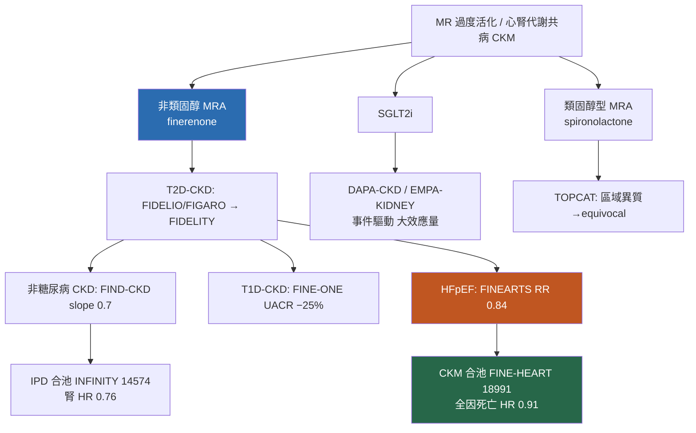

# 主題六 — 超越 T2D 的心腎版圖：專科醫師版深度解析 companion

> **對象**：內分泌／腎臟／心臟專科醫師（已讀過主文 `06_beyond_t2d_cardiorenal_landscape.md`）。
> **定位**：本文不重述主文架構,而是對六篇關鍵 finerenone 試驗做「單篇深挖」,並用**非 finerenone 的相似試驗**做對讀,把臨床試驗解讀寫到 specialist 層級。
>
> **簡報版（Claude Artifact 投影片）**:同內容之專科演講 slide deck 見 `06_slides_deep_dive.html`（可直接瀏覽器開啟；含跨試驗森林圖、HR 1.33 反向訊號拆解、三層 take-home）。線上版:https://claude.ai/code/artifact/49278c8c-7b86-4a0f-96e6-1b81d8231e80
>
> **硬規則與可追溯性標記**:所有數字均附 `[本地MD檔名]`。
> - 📄 = 本地有全文(或版本記錄全文)可支撐該數字。
> - 📌 = 僅取得 abstract/結構式摘要,對其未載內容**不作**具體數字斷言。
> - ❌ = 本地連 abstract 都未取得(僅有 metadata),**完全不引用其數字**,僅作定性背景並誠實標示。

---

## 卡 A｜FINE-ONE — finerenone 在第 1 型糖尿病 CKD

### 1. 這篇試驗回答的一個核心問題
> **在 T1D 合併蛋白尿型 CKD、且已用足 ACEi/ARB 的病人,加上 finerenone 能否再壓低白蛋白尿?**(近三十年來第一個對 T1D-CKD 交出正結果的第 3 期試驗。)

### 2. 關鍵數據
- 相位 3、隨機、雙盲;T1D+CKD,eGFR 25–<90、UACR 200–<5000 mg/g、須在 ACEi/ARB 上;**N=242**,主要終點為 6 個月 UACR 相對變化 📌 [fine_one_t1d_Heerspink_2026.md]
- Finerenone 使 UACR 降 **34%**(GMR 0.66;95% CI 0.60–0.73),placebo 降 12%(GMR 0.88;0.79–0.98)📌 [fine_one_t1d_Heerspink_2026.md]
- **安慰劑校正後多降 25%**:GMR 0.75(95% CI 0.65–0.87;**P<0.001**)📌 [fine_one_t1d_Heerspink_2026.md]
- 高血鉀 **10.1% vs 3.3%**;因高血鉀停藥 1.7% vs 0 📌 [fine_one_t1d_Heerspink_2026.md]
- 6 個月 eGFR 變化 **−5.6 vs −2.7**(差 −2.9;95% CI −5.1 至 −0.7),**washout 後回到基線**(典型 acute dip 可逆)📌 [fine_one_t1d_Heerspink_2026.md]
- 探索分析:療效不隨基線 HbA1c 三分位(P interaction=0.41)或糖尿病病程(P interaction=0.70)而異;HbA1c 本身不變(組間差 +0.04%,P=0.74)📌 [fine_one_t1d_Beernink_2026.md]

### 3. 與相似(非 finerenone)試驗的差異對讀 — FINE-ONE ↔ Lewis 1993(captopril)
| 面向 | FINE-ONE 2026 📌 | Lewis 1993 / Collaborative Study Group 📌 |
|---|---|---|
| 藥理類別 | 非類固醇 MRA(RASi 之上加藥) | ACEi(當年是背景治療本身) |
| 族群 | T1D + CKD,UACR 200–<5000,已在 RASi | IDDM + 糖尿病腎病,蛋白尿≥500 mg/d,Cr≤2.5 |
| N | 242 | 409(captopril 207 / placebo 202) |
| 終點類型 | **替代終點**(6 個月 UACR 相對變化,bridging biomarker) | **硬終點**(血清肌酸酐加倍) |
| 效應量 | UACR 安慰劑校正 −25%(P<0.001) | Cr 加倍 25 vs 43 例(P=0.007),**風險降 48%**;死亡/透析/移植複合降 50% [cmp_Lewis_1993.md] |
| 意義 | RASi 之上的**增量**效果 | 確立 RASi 為 T1D 腎病基石 |

**對讀重點**:Lewis 1993 用「三年、硬終點」證明 ACEi;FINE-ONE 在同一族群卻只用「6 個月、UACR 替代終點、N=242」就完成註冊路徑——這不是試驗品質退步,而是 **surrogate endpoint 30 年成熟的結果**(見卡 F 與深層看點)。FINE-ONE 明確把 finerenone 定位為 **RASi 基石之上的加藥**,而非取代 ACEi;兩者回答的是不同世代的問題。

### 4. 最精華 / 深層臨床試驗解讀
- **為何 T1D 敢用 N=242、6 個月的小試驗註冊?** 設計論文說得很白:UACR 被當作 **bridging biomarker（BB）**,前提是「finerenone 對 UACR 的效果在 T2D 試驗中與腎臟硬終點療效相關」,再經法規機構(FDA/EMA)事前同意可作橋接 📌 [fine_one_t1d_Heerspink_2023.md]。這是把 T2D 累積的 surrogate 證據「外推」到 T1D 的監理創新。
- **acute dip 的教科書式呈現**:−5.6 vs −2.7 的 6 個月 eGFR 差、且 washout 後回到基線,正是 MRA/RASi/SGLT2i 共有的血流動力學急性下降(非結構性腎損傷)。這一點在解讀所有 finerenone 腎臟數據時是關鍵前提(卡 D 的反向訊號就卡在這裡)。
- **HTE 檢驗**:Beernink 分析顯示療效不隨 HbA1c 或病程異質——對「T1D 血糖控制差是否吃掉藥效」的臨床疑慮給了否定答案 📌 [fine_one_t1d_Beernink_2026.md]。
- 誠實限制:本卡所有數字均來自 **abstract/結構式摘要**(NEJM 全文付費牆),故不對次族群細節、KM 曲線、安全性細目作全文級斷言。

---

## 卡 B｜FIND-CKD — finerenone 在非糖尿病 CKD

### 1. 這篇試驗回答的一個核心問題
> **把 finerenone 的腎臟保護,從「T2D-CKD」擴張到「非糖尿病 CKD」,能否用 eGFR slope 證明?**(FIDELIO/FIGARO 明確排除非糖尿病族群留下的缺口。)

### 2. 關鍵數據 📄(本地有 NEJM 全文文字)
- N=**1584**(finerenone 793 / placebo 791),eGFR 25–<90、UACR 200–≤3500、在 RASi 上;主要終點 = **total eGFR slope 至 month 32** 📄 [FIND-CKD_NEJMoa2604625.md]
- Total slope **−3.3(95% CI −3.6 至 −3.1)vs −4.0(−4.3 至 −3.8)**,差 **0.7(0.3 至 1.1);P<0.001** 📄 [FIND-CKD_NEJMoa2604625.md]
- 基線→month 3 的變化率,finerenone 比 placebo 相差 1.2 mL/min/1.73m²(急性期效應),**month 3 之後 finerenone 慢性下降較緩**;停藥後 finerenone 組 eGFR 回升 📄 [FIND-CKD_NEJMoa2604625.md]
- 複合腎臟或 CV 事件:**HR 0.77(0.60–0.99);P=0.04**;腎臟複合 HR 0.78(0.60–1.01);CV 複合 HR 0.60(0.27–1.33)📄 [FIND-CKD_NEJMoa2604625.md]
- 高血鉀 **17.0% vs 13.3%**;因高血鉀停藥 1.5% vs 0.1%;住院 0.9% vs 0.6% 📄 [FIND-CKD_NEJMoa2604625.md]
- 病因學:慢性腎絲球腎炎 57.0%(IgAN 26.3%、FSGS 13.6%)、高血壓/缺血性腎病 29.0% 📄 [glomerular_subgroup_Heerspink_2025.md(FIND-CKD 設計論文)]

### 3. 與相似(非 finerenone)試驗的差異對讀 — FIND-CKD ↔ DAPA-CKD 非糖尿病亞群 / EMPA-KIDNEY
| 面向 | FIND-CKD 📄 | DAPA-CKD 非糖尿病亞群 📄 | EMPA(Herrington IPD meta)📌 |
|---|---|---|---|
| 藥理 | 非類固醇 MRA(抗發炎/抗纖維化) | SGLT2i(管球回饋+血流動力學) | SGLT2i |
| 主要證據型態 | **eGFR slope**(連續替代終點) | **事件複合終點**(≥50% eGFR/ESKD/腎或 CV 死亡) | slope + 事件 |
| 效應量 | slope 差 0.7 mL/min/yr;複合 HR 0.77 | 非糖尿病亞群主要複合 **HR 0.50(0.35–0.72)**;腎絲球腎炎 0.43(0.26–0.71)[cmp_Wheeler_2021.md] | 慢性 eGFR 下降**減緩 64%**;kidney failure HR 0.66(0.55–0.79)[cmp_Herrington_2025.md] |
| 基線腎功能 | mean eGFR 46.7 | 41.7(較低) | 38.7(最低)[glomerular_subgroup_Heerspink_2025.md 之 Table 3] |

**對讀重點**:
- **終點哲學不同**:SGLT2i 的非糖尿病 CKD 證據是「事件驅動、HR 型」且效應量很大(DAPA-CKD 非糖尿病 HR 0.50);finerenone 的 FIND-CKD 走「slope 驅動」路線,slope 差 0.7、複合 HR 0.77 較溫和但**達標且與其 T2D 表現一致**。這反映兩者定位互補——FIND-CKD 設計論文本身即把 SGLT2i 使用列為分層因子(17% 已在 SGLT2i),並指向 CONFIDENCE 試驗探討 finerenone+empagliflozin 合併 📄 [glomerular_subgroup_Heerspink_2025.md]。
- **機轉互補**:SGLT2i 主打管球回饋+代謝;finerenone 主打 MR 過度活化→發炎/纖維化。Herrington IPD meta 特別證明 SGLT2i 的腎益處「**不論急性 dip 大小**」都存在 📌 [cmp_Herrington_2025.md];finerenone 的 acute dip 亦可逆(見上)——兩藥的 acute dip 都是「良性血流動力學」而非毒性。

### 4. 最精華 / 深層臨床試驗解讀
- **為何 FIND-CKD 選 total eGFR slope 當主要終點?** 因為在高 eGFR、慢進展的非糖尿病 CKD,硬終點(ESKD)太稀少,事件驅動試驗要極大 N/極長追蹤。Inker 2019 的 47 RCT/60,620 人 meta 顯示 total slope 對硬終點的 R²=0.97,且**≥0.75 mL/min/yr 的 slope 效應**即以 ≥96% 機率預測臨床獲益 📄 [cmp_Inker_2019.md]——FIND-CKD 觀察到的 0.7 差值恰在此門檻附近,是「剛好夠格」的替代終點證據。
- **兩段式 spline 的用意**:把 acute slope(0→3 月)與 chronic slope(3 月後)拆開,正是 Greene 2019 模擬強調的——**有急性效應的藥,total slope 可能造成偽結論**,必須分段解讀 📄 [cmp_Greene_2019.md]。FIND-CKD 用 month 3 為 change point 就是防這一手。
- **57% vs 40% 門檻的選擇**:FIND-CKD 用 ≥57% eGFR 下降(而非 FIDELIO 的 ≥40%)當複合腎終點,目的是讓 finerenone 的急性血流動力學下降「不會被誤計為疾病進展」 📄 [glomerular_subgroup_Heerspink_2025.md]。

---

## 卡 C｜FIND-CKD 的 glomerular(腎絲球疾病)亞群

### 1. 這篇試驗回答的一個核心問題
> **在以 IgAN 為主的腎絲球疾病中,finerenone 的 slope 與白蛋白尿獲益是否成立?**(把非糖尿病 CKD 進一步下鑽到「免疫/結構性腎絲球病變」。)

### 2. 關鍵數據 📌(JAMA 結構式摘要)
- 903/1584(**57.0%**)為 investigator-reported 腎絲球疾病:IgAN 416(46.1%)、FSGS 215(23.8%)、膜性腎病 90(10.0%);分析 finerenone 446 vs placebo 457 📌 [glomerular_subgroup_Neuen_2026.md]
- Total eGFR slope **−3.50 vs −4.23**;差 **0.73(95% CI 0.22–1.24)**📌 [glomerular_subgroup_Neuen_2026.md]
- 12 個月白蛋白尿降 **42%(95% CI 35%–48%)**📌 [glomerular_subgroup_Neuen_2026.md]
- Kidney failure 或 ≥40% eGFR 下降:**HR 0.74(0.57–0.97)**;7.42 vs 9.60 事件/100 病人年 📌 [glomerular_subgroup_Neuen_2026.md]

### 3. 與相似(非 finerenone)試驗的差異對讀 — glomerular ↔ PROTECT(sparsentan)/ DAPA-CKD IgAN
把「同一個 IgAN 問題」用三種藥理讀:
| 試驗/藥 | 對照 | eGFR 慢性 slope | 蛋白尿/白蛋白尿降幅 | 腎終點 |
|---|---|---|---|---|
| **FIND-CKD glomerular**(finerenone)📌 | placebo(RASi 上) | total −3.50 vs −4.23,差 0.73 | UACR −42%(12mo) | KF/≥40% HR 0.74(0.57–0.97) [glomerular_subgroup_Neuen_2026.md] |
| **PROTECT**(sparsentan,dual ETA/AT1)📌 | **irbesartan**(active) | 慢性 −2.7 vs −3.8,差 1.1(p=0.037) | UPCR −42.8% vs −4.4%(GLSM 0.60) | 複合腎衰 RR 0.7(0.4–1.2)[cmp_Rovin_2023.md] |
| **DAPA-CKD IgAN 亞群**(dapagliflozin)📌 | placebo | −3.5 vs −4.7 | UACR −26% | 主要複合 4% vs 15%,**HR 0.29(0.12–0.73)**[cmp_Wheeler_2021_IgAN.md] |
| SGLT2i in IgAN(scoping review)📄 | — | 早 dip 後穩定 | 蛋白尿 ~23–48% | 一致但 IgAN 專屬 RCT 有限 [cmp_Phongphithakchai_2026.md] |

**對讀重點**:
- **白蛋白尿降幅**:finerenone(−42%)與 sparsentan(−42.8% vs irbesartan 的 −4.4%)在數量級上相當,均遠大於 SGLT2i 單獨在 IgAN 的 ~26%。但**對照組不同**——PROTECT 用 active comparator(irbesartan),所以那 −42.8% 是「相對於已最大化 ARB」的額外降幅;finerenone/dapagliflozin 是相對 placebo(於 RASi 之上)。比較效應量時務必辨明分母。
- **腎終點效應量**:DAPA-CKD IgAN 的 HR 0.29 看似驚人,但事件數少(6 vs 20)、CI 寬;finerenone 的 HR 0.74(0.57–0.97)事件基礎較大、較穩。三藥指向「多管齊下皆有效」,支持 IgAN 的 pillar therapy 概念。
- **機轉互補**:sparsentan(內皮素+AT1)、SGLT2i(管球回饋)、finerenone(MR/抗纖維化)作用點不同,理論上可疊加。

### 4. 最精華 / 深層臨床試驗解讀
- 這是 **prespecified exploratory subgroup**,非 confirmatory:P 值/CI 應以「支持一致性」而非「獨立證明」來讀。
- **白蛋白尿作為 IgAN 的替代終點特別站得住腳**:Heerspink 2019 顯示替代性在**基線白蛋白尿高**時最強(R² 0.72,若基線 >30 mg/g)📄 [cmp_Heerspink_2019.md];IgAN 族群基線 UACR ~840 mg/g,正落在替代終點最可信的區間。
- 誠實限制:JAMA 全文付費,本卡僅 abstract 級,不對亞群森林圖/交互作用 P 值作全文斷言。

---

## 卡 D｜FINEARTS-HF 的腎臟結果（Mc Causland 2025）— 那個「HR 1.33」反向訊號

### 1. 這篇試驗回答的一個核心問題
> **在 HFmrEF/HFpEF(而非 CKD)族群,finerenone 對腎臟到底是保護、中性、還是有害?**(主試驗證明 HF 獲益後,腎臟複合終點卻出現 >1 的 HR。)

### 2. 關鍵數據 📄(HAL 全文 pre-proof)
- FINEARTS-HF 主試驗:N=6001,LVEF≥40%;主要複合(total worsening HF + CV 死亡)**RR 0.84(0.74–0.95;P=0.007)**;worsening HF RR 0.82;CV 死亡 8.1% vs 8.7%,HR 0.93(0.78–1.11)📌 [finearts_hfpef_ckm_Solomon_2024.md]
- 腎臟族群基線:mean eGFR **62±20**、**median UACR 僅 18(7–67)mg/g**(低白蛋白尿背景!)📄 [finearts_hfpef_ckm_Mc_2025.md]
- 複合腎終點(≥50% eGFR 下降/腎衰):**75 vs 55 事件;HR 1.33(0.94–1.89)** ⟵ **反向訊號** 📄 [finearts_hfpef_ckm_Mc_2025.md]
- ≥57% 版本:41 vs 31 事件;HR 1.28(0.80–2.05)📄 [finearts_hfpef_ckm_Mc_2025.md]
- eGFR 動態:**acute dip −2.9(−3.4 至 −2.4)**;**chronic slope +0.2(−0.1 至 +0.4),無差異**;total slope 差 −0.7(−0.9 至 −0.4)📄 [finearts_hfpef_ckm_Mc_2025.md]
- UACR 6 個月降 **30%(25–34%)**;新發 macroalbuminuria HR 0.62(0.53–0.73)、microalbuminuria HR 0.76(0.68–0.83)📄 [finearts_hfpef_ckm_Mc_2025.md]

### 3. 與相似(非 finerenone）試驗的差異對讀 — FINEARTS ↔ TOPCAT / DELIVER / EMPEROR-Preserved
| 試驗/藥 | HFpEF 主要結果 | 腎臟訊號 | 關鍵爭議 |
|---|---|---|---|
| **FINEARTS-HF**(finerenone,非類固醇 MRA)📌📄 | 主要複合 **RR 0.84(0.74–0.95)** 達標 | **腎複合 HR 1.33**(反向,acute dip 驅動) | 首個在 HFmrEF/HFpEF 陽性的 MRA |
| **TOPCAT**(spironolactone,類固醇 MRA)❌主文/📌區域分析 | 主試驗**主要終點未達顯著**(全文本地未取得,不引數字)❌ [cmp_Pitt_2014.md] | — | Pfeffer 區域分析:俄/喬 vs 美洲**事件率差 ~4 倍**,spironolactone 僅在美洲(n=1767)顯著,俄/喬(n=1678)無效且無鉀/肌酐反應 📌 [cmp_Pfeffer_2015.md] |
| **DELIVER**(dapagliflozin,SGLT2i)📌 | 主要複合 **HR 0.82(0.73–0.92;P<0.001)**;worsening HF 0.79;CV 死亡 0.88(0.74–1.05)[cmp_Solomon_2022.md] | SGLT2i 腎益處在 HF 中一致(Herrington)[cmp_Herrington_2025.md] | LVEF≥60% 亞群仍有效 |
| **EMPEROR-Preserved**(empagliflozin)❌ | 本地僅 metadata,**不引數字** ❌ [cmp_Anker_2021.md] | — | — |

**對讀重點——為何「非類固醇 MRA 在 HFpEF 成功、類固醇型 equivocal」?**
- **族群/區域混雜(TOPCAT 的教訓)**:TOPCAT 的等效模糊很大部分來自區域異質——Pfeffer 分析顯示俄/喬事件率極低、且對 spironolactone 無藥效反應(無高血鉀、無肌酐上升),稀釋了整體效果 📌 [cmp_Pfeffer_2015.md]。FINEARTS-HF 以 total(recurrent)worsening HF 事件為主要終點、且富集近期惡化病人,統計效率更高。
- **腎臟訊號的方向差異**:spironolactone 在美洲確實推高肌酐/高血鉀(即急性腎功能下降),FINEARTS 的 finerenone 也有 acute dip;差別在 finerenone 的 **chronic slope 無惡化(+0.2,無差異)**——見下段機轉拆解。

### 4. 最精華 / 深層臨床試驗解讀:HR 1.33 反向訊號的機轉拆解
這是本主題最值得專科醫師咀嚼的一點。腎複合 HR 1.33 **並非** finerenone 傷腎的證據,而是三個因素疊加的「統計假象」:
1. **acute dip 被計入複合腎終點**:finerenone 造成 −2.9 mL/min/1.73m² 的急性血流動力學下降;在一個**低白蛋白尿(median UACR 18)、腎功能相對保存(eGFR 62)**的 HF 族群,慢性進展事件本就稀少(75 vs 55,總量低),於是 acute dip 觸發的「≥50% 下降」在短期內被過度計數,把 HR 推過 1。
2. **chronic slope 才是真相**:一旦看 month 3 之後的 chronic slope,finerenone 與 placebo **無差異(+0.2;−0.1 至 +0.4)**——沒有持續性腎損傷 📄 [finearts_hfpef_ckm_Mc_2025.md]。這正是 Greene 2019 警告的情境:**有急性效應的藥,用 total-based 腎事件終點會產生偽陽性(此處是偽有害)** 📄 [cmp_Greene_2019.md]。
3. **白蛋白尿方向完全相反**:finerenone 降 UACR 30%、把新發 macroalbuminuria 風險砍 38%(HR 0.62)📄 [finearts_hfpef_ckm_Mc_2025.md]——若真傷腎,白蛋白尿應上升而非下降。
> **結論**:HR 1.33 是 acute dip × 低事件背景 × total-based 終點三者交互的產物;chronic slope 無害 + 白蛋白尿改善,共同排除真實腎損傷。這是「同一數字在不同終點框架下講出相反故事」的經典教材。

---

## 卡 E｜FINE-HEART pooled（Vaduganathan 2024, Nature Medicine）

### 1. 這篇試驗回答的一個核心問題
> **把三個 finerenone 第 3 期試驗合池,能否在單一試驗力所不及的「CV 死亡/總死亡」上,拿到有意義的訊號?**

### 2. 關鍵數據 📄(Europe PMC 全文 XML)
- FIDELIO + FIGARO + **FINEARTS**,**N=18,991**;中位追蹤 2.9 年 📄 [fine_heart_pooled_Vaduganathan_2024.md]
- **主要終點 CV 死亡:4.4% vs 5.0%;HR 0.89(0.78–1.01);P=0.076 ⟵ 未達顯著** 📄 [fine_heart_pooled_Vaduganathan_2024.md]
- 敏感度分析(納入 undetermined death):6.6% vs 7.4%;HR 0.88(0.79–0.98);**P=0.025** 📄 [fine_heart_pooled_Vaduganathan_2024.md]
- **全因死亡:HR 0.91(0.84–0.99);P=0.027** 📄 [fine_heart_pooled_Vaduganathan_2024.md]
- HF 住院 HR 0.83(0.75–0.92;P<0.001);腎複合 HR 0.80(0.72–0.90;P<0.001)📄 [fine_heart_pooled_Vaduganathan_2024.md]
- 高血鉀致停藥 1.3% vs 0.5%、致住院 0.8% vs 0.2%,**無高血鉀致死** 📄 [fine_heart_pooled_Vaduganathan_2024.md]

### 3. 與相似(非 finerenone）試驗的差異對讀
FINE-HEART 沒有單一 SGLT2i 對照物;最有意義的對讀是**跨藥類的「合池才有力的死亡終點」共性**:SGLT2i 也是靠 EMPEROR/DELIVER/DAPA 等大型單試驗或合池才在 CV 死亡取得訊號(如 DELIVER CV 死亡 HR 0.88,單試驗未顯著 [cmp_Solomon_2022.md])。兩藥類的共同教訓:**CV 死亡是低頻終點,單一試驗常 underpowered,合池是必要手段但引入詮釋限制**。

### 4. 最精華 / 深層臨床試驗解讀:CV 死亡未達顯著 → 轉向全因死亡的競爭風險與 endpoint hierarchy
- **為何主要終點失手、作者卻更相信全因死亡?** 因為 **CV 死亡對「undetermined death」如何歸類極度敏感**:把未定死因算進去,HR 就從 0.89(P=0.076)變 0.88(P=0.025)。當死因裁定的分類邊界會翻轉統計結論時,**competing-risk 較少、分類爭議較小的全因死亡反而更 robust**——這是作者明文選擇 all-cause death 作為可信訊號的邏輯 📄 [fine_heart_pooled_Vaduganathan_2024.md]。
- **endpoint hierarchy 的現實**:全因死亡 HR 0.91 顯著、CV 死亡 HR 0.89 不顯著,看似矛盾,實則反映 CV 死亡是全因死亡的子集且受裁定雜訊放大;讀者不應因「主要終點未達標」就否定整體死亡獲益。
- **合池的詮釋限制**:三試驗族群/終點定義不同(FINEARTS 收非糖尿病、低白蛋白尿、含急性 HF 場景;urgent HF visit 只在 FINEARTS 收集),腎益處幾乎全由 FIDELIO/FIGARO 驅動;未校正多重比較 📄 [fine_heart_pooled_Vaduganathan_2024.md]。

---

## 卡 F｜INFINITY IPD meta-analysis（Neuen 2026, Lancet）

### 1. 這篇試驗回答的一個核心問題
> **把 finerenone 的 CKD 證據(含新的非糖尿病 FIND-CKD)做 individual participant data 合池後,腎/CV/死亡獲益是否「跨病因、跨血糖、跨 eGFR/白蛋白尿」一致?**

### 2. 關鍵數據 📌(Europe PMC 結構式摘要)
- FIDELIO + FIGARO + **FIND-CKD**,**N=14,574**;PROSPERO CRD420251269149 📌 [find_ckd_nondiab_Neuen_2026.md]
- 複合腎終點:**HR 0.76(0.68–0.86)**,降 24%;kidney failure alone HR 0.85(0.74–0.99)📌 [find_ckd_nondiab_Neuen_2026.md]
- 複合 CV 終點:HR 0.80(0.70–0.91);HHF 0.78(0.66–0.92);CV 死亡 **0.82(0.67–0.999)**;全因死亡 0.88(0.79–0.99)📌 [find_ckd_nondiab_Neuen_2026.md]
- 腎益處「**不論血糖狀態、CKD 病因、基線 eGFR、白蛋白尿、是否用 SGLT2i**」皆一致 📌 [find_ckd_nondiab_Neuen_2026.md]

### 3. 與相似(非 finerenone）試驗的差異對讀
這是 finerenone 版的「SGLT2i 大合池」對應物。SGLT2i 有 Herrington 2025 的 23,340 人 IPD meta(跨糖尿病/HF/CKD 一致,慢性 slope 減 64%)[cmp_Herrington_2025.md];finerenone 有 INFINITY 的 14,574 人。**兩者殊途同歸地把各自藥類定位為「跨病因 foundational therapy」**,且都強調「效果不隨 SGLT2i 背景使用而異」——為兩藥合併使用(CONFIDENCE 型設計)鋪路。

### 4. 最精華 / 深層臨床試驗解讀:IPD meta-analysis 的詮釋限制
- **CV 死亡的 CI 上限「0.999」**:剛好擦邊顯著,提醒這是合池才勉強達標的低頻終點,單試驗均無法證明。
- **IPD 合池 vs FINE-HEART 的差別**:INFINITY 是**純 CKD**三試驗(含非糖尿病 FIND-CKD)、以腎終點為主軸;FINE-HEART 是**含 HF 的 CKM**三試驗(含 FINEARTS)、以 CV 死亡為主軸。兩者共用 FIDELIO/FIGARO,但問的問題不同——不要把兩個「三試驗合池」混為一談。
- **一致性 ≠ 同質效應量**:HTE 檢定「不顯著」只代表沒偵測到交互作用,受限於各次族群 power;非糖尿病腎益處主要靠 FIND-CKD 的 slope 外推,事件級證據仍較薄。
- 誠實限制:INFINITY 本地僅 abstract,森林圖/交互作用 P 值不作全文斷言。

---

## 跨藥理類別的橫向對比表（finerenone vs SGLT2i vs 類固醇型 MRA）

| 臨床情境 | 非類固醇 MRA（finerenone） | SGLT2i | 類固醇型 MRA（spironolactone） |
|---|---|---|---|
| **非糖尿病 CKD** | FIND-CKD:slope 差 0.7(0.3–1.1);複合 HR 0.77(0.60–0.99)📄 [FIND-CKD_NEJMoa2604625.md] | DAPA-CKD 非糖尿病:主要複合 **HR 0.50(0.35–0.72)**📄 [cmp_Wheeler_2021.md];EMPA meta 慢性 slope −64%,KF HR 0.66 📌 [cmp_Herrington_2025.md] | 無大型註冊 RCT;小型研究降白蛋白尿但高血鉀限制使用 📄 [glomerular_subgroup_Heerspink_2025.md] |
| **HFpEF/HFmrEF** | FINEARTS-HF:主要複合 **RR 0.84(0.74–0.95)**📌 [finearts_hfpef_ckm_Solomon_2024.md] | DELIVER:HR 0.82(0.73–0.92)📌 [cmp_Solomon_2022.md];EMPEROR-Preserved(本地無數字)❌ [cmp_Anker_2021.md] | TOPCAT 主試驗未達顯著(本地無數字)❌ [cmp_Pitt_2014.md];美洲亞群才顯著 📌 [cmp_Pfeffer_2015.md] |
| **IgAN / 腎絲球疾病** | FIND-CKD glomerular:slope 差 0.73;UACR −42%;KF/≥40% HR 0.74(0.57–0.97)📌 [glomerular_subgroup_Neuen_2026.md] | DAPA-CKD IgAN:HR 0.29(0.12–0.73);UACR −26% 📌 [cmp_Wheeler_2021_IgAN.md];scoping review 一致 📄 [cmp_Phongphithakchai_2026.md]（對照:PROTECT sparsentan UPCR −42.8% vs irbesartan 📌 [cmp_Rovin_2023.md]） | 無 IgAN 註冊終點資料 |
| **機轉定位** | MR 過度活化→抗發炎/抗纖維化;acute dip 可逆、chronic slope 才是真相 | 管球回饋+滲透利尿+代謝;益處不隨 acute dip 大小而異 📌 [cmp_Herrington_2025.md] | MR 阻斷但選擇性低→高血鉀/肌酐上升較明顯,限制實用性 |
| **T2D-CKD 錨點(FIDELITY)** | 主要 CV 複合 HR 0.86(0.78–0.95);腎複合 HR 0.77(0.67–0.88);UACR −32% 📄 [FIDELITY_Agarwal_2022.md] | — | — |

---

## 臨床試驗解讀的六個深層看點（方法學收斂）

1. **Surrogate endpoint hierarchy(替代終點的位階)**
   硬終點(ESKD/Cr 加倍)→ GFR slope → 白蛋白尿,三層替代性遞減但速度遞增。Inker 2019(47 RCT,total slope R²=0.97,門檻 ≥0.75 mL/min/yr → ≥96% 機率獲益)📄 [cmp_Inker_2019.md] 與 Heerspink 2019(白蛋白尿降 30% → HR ~0.68,基線高時 R² 0.72)📄 [cmp_Heerspink_2019.md] 是 FIND-CKD 用 slope、FINE-ONE 用 UACR 註冊的方法學靠山。

2. **Acute dip vs chronic slope(必須分段讀)**
   MRA/SGLT2i/RASi 皆有可逆的急性血流動力學下降。Greene 2019 模擬明言:**有急性效應時 total slope 會誤導,應看 chronic slope** 📄 [cmp_Greene_2019.md]。這是 FIND-CKD 設 month-3 change point、FINE-ONE 觀察 washout 可逆、FINEARTS HR 1.33 之所以是假象的**同一條方法學主線**。

3. **FINEARTS HR 1.33 反向訊號的三因子拆解**
   acute dip(−2.9)× 低白蛋白尿/低事件背景(median UACR 18、eGFR 62)× total-based 腎終點 = 偽有害;而 chronic slope 無差異 + UACR −30%/新發 macroalbuminuria HR 0.62 反證無真實腎損傷 📄 [finearts_hfpef_ckm_Mc_2025.md]。

4. **CV 死亡未達顯著 → 全因死亡的競爭風險與 endpoint hierarchy**
   FINE-HEART CV 死亡 HR 0.89(P=0.076),對 undetermined death 分類敏感;競爭風險/裁定雜訊較小的全因死亡 HR 0.91(P=0.027)反而更 robust——作者據此把可信訊號放在全因死亡 📄 [fine_heart_pooled_Vaduganathan_2024.md]。低頻終點「主要終點失手不等於無效」。

5. **IPD / 合池 meta-analysis 的詮釋限制**
   FINE-HEART(CKM,含 HF)與 INFINITY(純 CKD,含非糖尿病)雖都合三試驗,問的問題不同;腎益處多由 FIDELIO/FIGARO 驅動,非糖尿病與 HF 情境的事件級證據較薄;多重比較未校正;CI 常擦邊(如 INFINITY CV 死亡上限 0.999)📄 [fine_heart_pooled_Vaduganathan_2024.md] 📌 [find_ckd_nondiab_Neuen_2026.md]。

6. **HTE(治療效應異質性)的正確讀法**
   Beernink(HbA1c/病程 P interaction 0.41/0.70)、FINE-HEART(CKM 負荷、eGFR、UACR、SGLT2i 背景)、INFINITY(血糖/病因/eGFR/白蛋白尿)一致「無交互作用」📌📄——但「無顯著交互作用」只代表未偵測到異質、受各次族群 power 限制,不等於效應量真的相同;族群差異(如 TOPCAT 區域異質 📌 [cmp_Pfeffer_2015.md])仍可能決定成敗。

---

## References（Vancouver + DOI;僅列本地有檔者）

**Finerenone 試驗(六張卡)**
1. Heerspink HJL, Birkenfeld AL, Cherney DZI, et al. Finerenone in type 1 diabetes and chronic kidney disease (FINE-ONE). N Engl J Med. 2026;394(10):947-957. doi:10.1056/NEJMoa2512854 📌
2. Beernink JM, Heerspink HJL, Birkenfeld AL, et al. Effect of finerenone on albuminuria in type 1 diabetes by baseline HbA1c and diabetes duration: exploratory analysis of FINE-ONE. Diabetes Care. 2026. doi:10.2337/dc26-0882 📌
3. Heerspink HJL, Birkenfeld AL, Cherney DZI, et al. Rationale and design of the FINE-ONE trial. Diabetes Res Clin Pract. 2023;204:110908. doi:10.1016/j.diabres.2023.110908 📌
4. Heerspink HJL, Neuen BL, Agarwal R, et al. Finerenone in persons with chronic kidney disease without diabetes (FIND-CKD). N Engl J Med. 2026. doi:10.1056/NEJMoa2604625 📄
5. Heerspink HJL, Agarwal R, Bakris GL, et al. Design and baseline characteristics of the FIND-CKD trial. Nephrol Dial Transplant. 2025;40(2):308-319. doi:10.1093/ndt/gfae132 📄
6. Neuen BL, Perkovic V, Agarwal R, et al. Finerenone in patients with CKD due to glomerular diseases: a randomized clinical trial. JAMA. 2026. doi:10.1001/jama.2026.9923 📌
7. Mc Causland FR, Vaduganathan M, Claggett BL, et al. Finerenone and kidney outcomes in patients with heart failure: the FINEARTS-HF trial. J Am Coll Cardiol. 2025;85(2):159-168. doi:10.1016/j.jacc.2024.10.091 📄
8. Solomon SD, McMurray JJV, Vaduganathan M, et al. Finerenone in heart failure with mildly reduced or preserved ejection fraction (FINEARTS-HF primary). [abstract] 2024. 📌
9. Vaduganathan M, Filippatos G, Claggett BL, et al. Finerenone in heart failure and CKD with type 2 diabetes: FINE-HEART pooled analysis. Nat Med. 2024. doi:10.1038/s41591-024-03264-4 📄
10. Neuen BL, Heerspink HJL, Perkovic V, et al. Efficacy and safety of finerenone in CKD: an individual participant data pooled analysis (INFINITY). Lancet. 2026. doi:10.1016/S0140-6736(26)01009-3 📌
11. Agarwal R, Filippatos G, Pitt B, et al. Cardiovascular and kidney outcomes with finerenone in T2D and CKD: FIDELITY pooled analysis. (本地檔) 📄

**方法學 / 替代終點**
12. Inker LA, Heerspink HJL, Tighiouart H, et al. GFR slope as a surrogate end point for kidney disease progression: a meta-analysis. J Am Soc Nephrol. 2019;30(9):1735-1745. doi:10.1681/ASN.2019010007 📄
13. Greene T, Ying J, Vonesh EF, et al. Performance of GFR slope as a surrogate end point: a statistical simulation. J Am Soc Nephrol. 2019;30(9):1756-1769. doi:10.1681/ASN.2019010009 📄
14. Heerspink HJL, Greene T, Tighiouart H, et al. Change in albuminuria as a surrogate endpoint for CKD progression: a meta-analysis. Lancet Diabetes Endocrinol. 2019;7(2):128-139. doi:10.1016/S2213-8587(18)30314-0 📄
15. Waijer SW, Gansevoort RT, Heerspink HJL. Change in albuminuria as a surrogate endpoint. Curr Opin Nephrol Hypertens. 2019;28(6):519-526. doi:10.1097/MNH.0000000000000541 📄

**Comparator 試驗(非 finerenone)**
16. Wheeler DC, Stefánsson BV, Jongs N, et al. Effects of dapagliflozin on major adverse kidney and CV events in diabetic and non-diabetic CKD: DAPA-CKD prespecified analysis. Lancet Diabetes Endocrinol. 2021;9(1):22-31. doi:10.1016/S2213-8587(20)30369-7 📄(全文為影像頁,數字取自封面/首頁摘要)
17. Wheeler DC, Toto RD, Stefánsson BV, et al. Dapagliflozin on major adverse kidney events in IgA nephropathy: DAPA-CKD prespecified analysis. Kidney Int. 2021. doi:10.1016/j.kint.2021.03.033 📌
18. Rovin BH, Barratt J, Heerspink HJL, et al. Sparsentan versus irbesartan in IgA nephropathy (PROTECT): 2-year results. Lancet. 2023. doi:10.1016/S0140-6736(23)02302-4 📌
19. Phongphithakchai A, Klangbud WK, Srithongkul T, et al. Efficacy of SGLT2 inhibitors in preventing ESKD in IgA nephropathy: a scoping review. Front Med. 2026. doi:10.3389/fmed.2026.1812783 📄(HTML 全文;精確數值有限)
20. Herrington WG, Che ZJ, Sardell R, et al. Effects of empagliflozin on acute and chronic kidney outcomes: an IPD meta-analysis. Lancet Diabetes Endocrinol. 2025;13(12):1003-1014. doi:10.1016/S2213-8587(25)00222-0 📌
21. Solomon SD, McMurray JJV, Claggett B, et al. Dapagliflozin in heart failure with mildly reduced or preserved ejection fraction (DELIVER). N Engl J Med. 2022;387(12):1089-1098. doi:10.1056/NEJMoa2206286 📌
22. Pfeffer MA, Claggett B, Assmann SF, et al. Regional variation in patients and outcomes in the TOPCAT trial. Circulation. 2015;131(1):34-42. doi:10.1161/CIRCULATIONAHA.114.013255 📌
23. Pitt B, Pfeffer MA, Assmann SF, et al. Spironolactone for heart failure with preserved ejection fraction (TOPCAT). N Engl J Med. 2014;370(15):1383-1392. doi:10.1056/NEJMoa1313731 ❌（本地僅 metadata,未引數字）
24. Anker SD, Butler J, Filippatos G, et al. Empagliflozin in heart failure with a preserved ejection fraction (EMPEROR-Preserved). N Engl J Med. 2021;385(16):1451-1461. doi:10.1056/NEJMoa2107038 ❌（本地僅 metadata,未引數字）
25. Lewis EJ, Hunsicker LG, Bain RP, Rohde RD. The effect of ACE inhibition on diabetic nephropathy (Collaborative Study Group). N Engl J Med. 1993;329(20):1456-1462. doi:10.1056/NEJM199311113292004 📌

---

### 誠實標示(comparator 取得層級)
- **無全文、僅 abstract(📌,不作全文級斷言)**:FINE-ONE 系列、FINEARTS 主試驗、INFINITY、Wheeler 2021 IgAN、Rovin 2023(PROTECT)、Herrington 2025(EMPA meta)、DELIVER、Pfeffer 2015(TOPCAT 區域)、Lewis 1993、glomerular Neuen 2026。
- **完全無 abstract/僅 metadata(❌,完全未引數字)**:Pitt 2014(TOPCAT 主試驗)、Anker 2021(EMPEROR-Preserved)。此二者在 HFpEF 對讀中僅作定性背景。
- **有全文(📄)**:FIND-CKD(NEJM 全文文字)、FIND-CKD 設計論文、FINE-HEART(Nat Med 全文)、Mc Causland 2025(HAL 全文)、Inker 2019、Greene 2019、Heerspink 2019、Waijer 2019、Wheeler 2021 DAPA-CKD(影像頁,數字取自首頁摘要)、Phongphithakchai 2026(HTML 全文)、FIDELITY(本地檔)。
