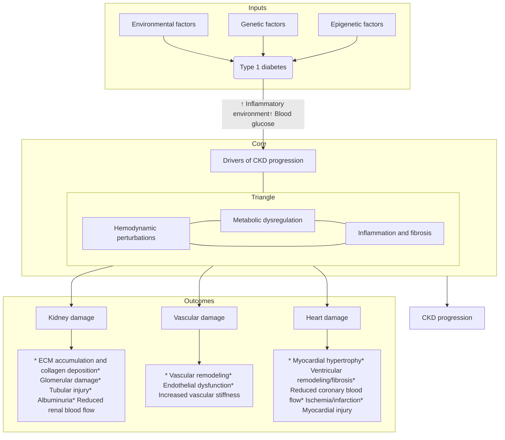
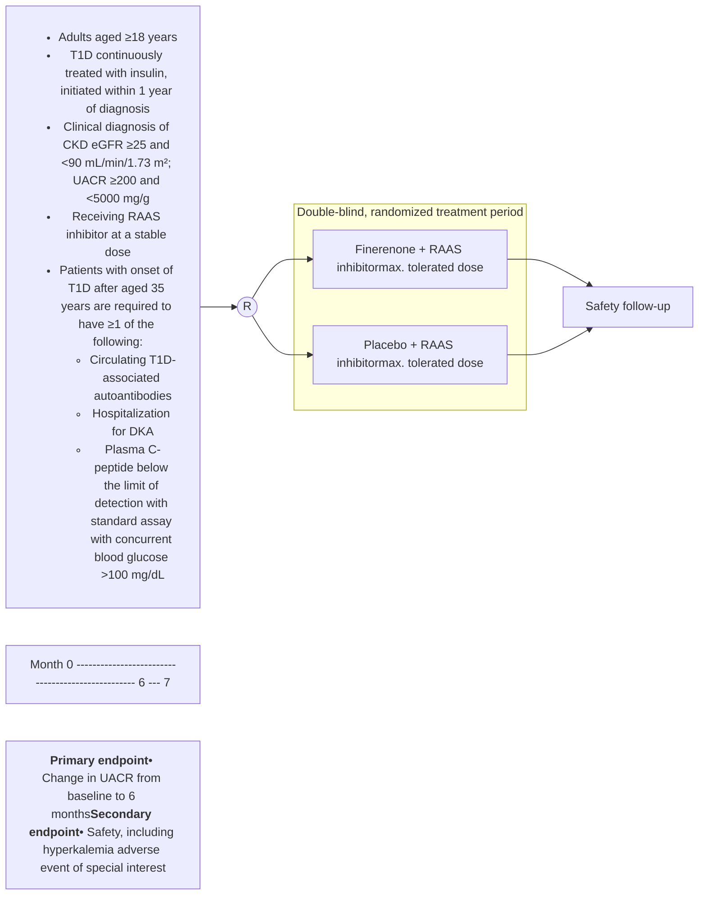

Check for updates

Received: 5 April 2024 | Revised: 20 June 2024 | Accepted: 22 June 2024

DOI: 10.1111/dom.15773

REVIEW ARTICLE

WILEY

# The potential role of finerenone in patients with type 1 diabetes and chronic kidney disease

Maria Adelaida Escobar Vasco MD | Samuel H. Fantaye MD | Sapna Raghunathan MD | Carolina Solis-Herrera MD

Division of Endocrinology, University of Texas Health, San Antonio, Texas, USA

### Abstract

Chronic kidney disease (CKD) represents a global health concern, associated with an increased risk of cardiovascular morbidity and mortality and decreased quality of life. Many patients with type 1 diabetes (T1D) will develop CKD over their lifetime. Uncontrolled glucose levels, which occur in patients with T1D as well as type 2 diabetes (T2D), are associated with substantial mortality and cardiovascular disease burden. T2D and T1D share common pathological features of CKD, which is thought to be driven by haemodynamic dysfunction, metabolic disturbances, and subsequently an influx of inflammatory and profibrotic mediators, both of which are major interrelated contributors to CKD progression. The mineralocorticoid receptor is also involved, and, under conditions of oxidative stress, salt loading and hyperglycaemia, it switches from homeostatic regulator to pathophysiological mediator by promoting oxidative stress, inflammation and fibrosis. Progressive glomerular and tubular injury leads to macroalbuminuria a progressive reduction in the glomerular filtration rate and eventually end-stage renal disease. Finerenone, a non-steroidal, selective mineralocorticoid receptor antagonist, is approved for treatment of patients with CKD associated with T2D; however, the benefit of finerenone in patients with T1D has yet to be determined. This narrative review will discuss treatment of CKD in T1D and the potential future role of finerenone in this setting.

### KEYWORDS

cardiovascular disease, chronic kidney disease, finerenone, type 1 diabetes

**Correspondence**

Carolina Solis-Herrera, Division of Endocrinology, University of Texas Health, 8435 Wurzbach Rd, San Antonio, TX 78229, USA.

Email: solisherrera@uthscsa.edu

## 1 | INTRODUCTION

Chronic kidney disease (CKD) represents a global health problem, associated with an increased risk of cardiovascular (CV) morbidity and mortality and decreased quality of life.<sup>1–3</sup> CKD is estimated to occur in approximately 10% of the European population (pooled data from 11 countries) and 14% of the US population.<sup>4,5</sup> CKD is categorized based on a patient's urinary albumin-to-creatinine ratio (UACR) and estimated glomerular filtration rate (eGFR; (Figure 1)<sup>6</sup>); most (approximately 70%) people diagnosed with CKD have stage 3 disease, based on an eGFR between 30 and <60 ml/min/1.73 m<sup>2</sup>.<sup>4</sup>

Diabetes is the leading cause of CKD worldwide and is present in approximately 40% of patients with CKD and approximately 40% with end-stage kidney disease (or kidney failure).<sup>4,5,7,8</sup> The percentage of kidney disease in the case of type 1 diabetes (T1D) could be higher; a study that followed a cohort of patients with T1D for 50 years

This is an open access article under the terms of the [Creative Commons Attribution-NonCommercial License](https://creativecommons.org/licenses/by-nc/4.0/), which permits use, distribution and reproduction in any medium, provided the original work is properly cited and is not used for commercial purposes.
© 2024 The Author(s). *Diabetes, Obesity and Metabolism* published by John Wiley & Sons Ltd.

Diabetes Obes Metab. 2024;1–12.

[wileyonlinelibrary.com/journal/dom](https://wileyonlinelibrary.com/journal/dom)

<page_number>1</page_number>

2 | WILEY ESCOBAR VASCO ET AL.

<table>
  <thead>
    <tr><th colspan="3"> </th><th colspan="3">Albuminuria categories<br/>Description and range</th></tr>
    <tr><th colspan="3" rowspan="3">CKD is classified based on:<br/>• Cause (C)<br/>• GFR (G)<br/>• Albuminuria (A)</th><th>A1</th><th>A2</th><th>A3</th></tr>
    <tr>
        <th>Normal to mildly<br/>increased</th>
        <th>Moderately<br/>increased</th>
        <th colspan="2">Severely<br/>increased</th>
    </tr>
    <tr>
        <th>&lt;30 mg/g<br/>&lt;3 mg/mmol</th>
        <th>30–299 mg/g<br/>3–29 mg/mmol</th>
        <th colspan="2">≥300 mg/g<br/>≥30 mg/mmol</th>
    </tr>
  </thead>
  <tbody>
    <tr>
        <td rowspan="6">GFR categories (mL/min/1.73 m²)<br/>Description and range</td>
        <td>G1</td>
        <td>Normal or high</td>
        <td>≥90</td>
        <td>Screen<br/>1</td>
        <td>Treat<br/>1</td>
        <td>Treat and refer<br/>3</td>
    </tr>
    <tr>
        <td>G2</td>
        <td>Mildly decreased</td>
        <td>60–89</td>
        <td>Screen<br/>1</td>
        <td>Treat<br/>1</td>
        <td>Treat and refer<br/>3</td>
    </tr>
    <tr>
        <td>G3a</td>
        <td>Mildly to<br/>moderately decreased</td>
        <td>45–59</td>
        <td>Treat<br/>1</td>
        <td>Treat<br/>2</td>
        <td>Treat and refer<br/>3</td>
    </tr>
    <tr>
        <td>G3b</td>
        <td>Moderately to<br/>severely decreased</td>
        <td>30–44</td>
        <td>Treat<br/>2</td>
        <td>Treat and refer<br/>3</td>
        <td>Treat and refer<br/>3</td>
    </tr>
    <tr>
        <td>G4</td>
        <td>Severely decreased</td>
        <td>15–29</td>
        <td>Treat and refer*<br/>3</td>
        <td>Treat and refer*<br/>3</td>
        <td>Treat and refer<br/>4+</td>
    </tr>
    <tr>
        <td>G5</td>
        <td>Kidney failure</td>
        <td>&lt;15</td>
        <td>Treat and refer<br/>4+</td>
        <td>Treat and refer<br/>4+</td>
        <td>Treat and refer<br/>4+</td>
    </tr>
  </tbody>
</table>

Legend for CKD risk heatmap

**FIGURE 1** American Diabetes Association-KDIGO Kidney Disease: Improving Global Outcomes (ADA-KDIGO) heatmap representing the risk for chronic kidney disease (CKD) progression using glomerular filtration rate (GFR) and albuminuria measurement categories.<sup>6</sup> Green, low risk (if no other markers of kidney disease, no CKD); orange, high risk; red, very high risk; yellow, moderately increased risk. The figure notes the risk of CKD progression, suggested frequency of visits, and referral to nephrology according to estimated (e)GFR and albuminuria (urinary albumin-to-creatinine ratio mg/day). The numbers in the boxes are a guide to the frequency of screening or monitoring (number of times per year). Green reflects no evidence of CKD by eGFR or albuminuria (urinary albumin-to-creatinine ratio mg/day), with screening indicated once per year. For monitoring of prevalent CKD, the suggested monitoring varies from once per year (yellow) to four times or more per year [i.e. every 1-3 months (deep red)] according to risks of CKD progression and CKD complications. The ADA-KDIGO consensus report<sup>6</sup> noted that these are general parameters only, based on expert opinion, and the patient's underlying comorbid conditions and disease state must be considered, as well as the likelihood of impacting a change in management for any individual patient.

suggested that up to 88% will develop nephropathy [presence of micro- or macroalbuminuria (eGFR not measured)], and 60% may develop kidney failure.<sup>9</sup> Globally, T1D incidence has increased by 3%-4% since 1990 and is predicted to continue to rise over the next two decades.<sup>10,11</sup> Furthermore, up to 88% of patients with T1D may develop CKD over their lifetime.<sup>9</sup> Without a clear understanding of what is causing the continued increased incidence of T1D, and therefore without being able to target pathological features at the source or stop the disease from occurring in the first place, effective treatment strategies are still required to treat the expanding T1D population and limit the subsequent burden being caused by progression to CKD and kidney failure. Furthermore, the most common cause of death among individuals with kidney failure is CV disease (CVD) or cardiac based.<sup>12</sup>

Finerenone, a non-steroidal, selective mineralocorticoid receptor antagonist (MRA) with anti-inflammatory and antifibrotic properties, has shown a reduced risk of clinically important CV and kidney outcomes compared with placebo across a broad spectrum of patients with CKD associated with type 2 diabetes (T2D).<sup>13–15</sup> Consequently, finerenone was approved in 2021 for the treatment of CKD associated with T2D<sup>16</sup> and is indicated to reduce the risk of sustained eGFR decline, kidney failure, CV death, non-fatal myocardial infarction and hospitalization for heart failure.<sup>16</sup>

However, the benefit of finerenone in patients with T1D has not yet been determined, and it is therefore currently not approved for T1D. In this narrative review, we discuss the treatment of CKD in T1D and the potential future role of finerenone in this setting.

## 2 | METHODS: LITERATURE SEARCH

PubMed searches were used to find applicable articles for inclusion in the review manuscript. The following search terms were used in three separate search strings: (a) search 1: (‘type 1 diabetes’ OR ‘insulin-dependent diabetes’ OR ‘insulin dependent’ OR ‘juvenile diabetes’) AND (‘prevalence’ OR ‘incidence’ OR ‘frequency’); (b) search 2: (‘type 1 diabetes’ OR ‘insulin-dependent diabetes’ OR ‘insulin dependent’ OR ‘juvenile diabetes’) AND (‘kidney’ OR ‘renal’ OR ‘cardiorenal’ OR ‘cardio\*’); (c) search 3: (‘finerenone’) AND (‘kidney’ OR ‘renal’ OR ‘cardio\*’ OR ‘cardiac\*’). Searches were performed on 20 April 2024,

14631326, 0, Downloaded from [https://dom-pubs.pericles-prod.literatumonline.com/doi/10.1111/dom.15773](https://dom-pubs.pericles-prod.literatumonline.com/doi/10.1111/dom.15773) by EBMG ACCESS - ETHIOPIA, Wiley Online Library on [23/07/2024]. See the Terms and Conditions ([https://onlinelibrary.wiley.com/terms-and-conditions](https://onlinelibrary.wiley.com/terms-and-conditions)) on Wiley Online Library for rules of use; OA articles are governed by the applicable Creative Commons License

ESCOBAR VASCO ET AL. —WILEY— 3

limited to article title only, English, humans and the last 5 years; case study type articles, letters, commentaries and editorials were excluded. Search 1 was limited further to guideline articles, review articles, systematic reviews, meta-analyses and observational study articles only. Search 2 was not limited beyond the initial article-type limitation criteria. Search 3 was limited further to clinical trials, randomized controlled trials (RCTs), and observational study articles only. These initial searches produced 514 articles (Figure S1). Search results were downloaded from PubMed into the EndNote X9.3.3 program, where the articles were screened using EndNote's search features as follows: removal of duplicate articles; manual review of article titles and removal of non-relevant articles; review of full text and removal of non-relevant articles. Ongoing or planned clinical trials using the keyword 'finerenone' via the Clinicaltrials.gov search feature were reviewed and applicable studies were included. Additional papers and resources not included in the original PubMed searches were also included if recommended by the authors or were manually accessed if considered relevant to a statement in the review; these included resources available via the Centers for Disease Control and Prevention website, Food and Drug Administration product labels, clinical treatment guideline articles applicable to CKD and diabetes and newly cited studies on Clinicaltrials.gov.

# 3 | TYPE 1 DIABETES

T1D is an immune-mediated disease in which CD4<sup>+</sup> and CD8<sup>+</sup> T cells drive pancreatic $\beta$-cell destruction and disease pathogenesis.<sup>17,18</sup> For example, CD4<sup>+</sup> T cells include type 17 helper T cells (Th17) and impaired T regulatory subsets that may have specific roles in the pathology of T1D.<sup>19,20</sup> One such 'role' of Th17 cells in T1D disease pathogenesis may be Th17-mediated recruitment and/or activation of the M1-like macrophage phenotype in the pancreatic islet that increases inflammation and leucocyte infiltration, thus contributing to the destruction of $\beta$ cells.<sup>21</sup> As a multifactorial disease, it is thought that genetic, epigenetic and environmental factors all play a part in the pathogenesis of T1D.<sup>22,23</sup> Globally in 2021, approximately 8.4 million individuals were living with T1D; 18% were aged <20 years, 64% were aged between 20 and 59 years, and 19% were aged $\ge$60 years.<sup>11</sup> Cases are predicted to rise to approximately 17 million by 2040.<sup>11</sup> Based on these epidemiological projections and the fact that the principal treatment for T1D is insulin therapy,<sup>24</sup> patients may expect to have many decades of managing their blood sugar levels with insulin; children diagnosed with T1D might expect to live to 65 years in high-income countries.<sup>11</sup> Consequently, many with T1D are expected to develop CKD over their lifetime.<sup>9</sup>

# 4 | CHRONIC KIDNEY DISEASE ASSOCIATED WITH TYPE 1 DIABETES

Uncontrolled glucose levels are associated with substantial mortality and CVD burden,<sup>25</sup> which is why an important goal in the management of diabetes is to achieve optimal glycaemic and optimal blood pressure control.<sup>26</sup> However, results of an analysis using electronic health record data from real-world clinical practice showed that optimal glycaemic control is not achieved in the vast majority of adults with T1D.<sup>27</sup> Furthermore, patients living with T1D may experience long periods of hyperglycaemia through poorly controlled disease,<sup>28</sup> and at least one in five patients with T1D might be expected to develop CKD,<sup>8,29</sup> with over 70% potentially developing albuminuria by 50 years of T1D duration.<sup>9</sup> Furthermore, mortality from CKD is expected to rise, with it becoming the fifth leading global cause of years of life lost by 2040.<sup>30</sup>

CKD associated with diabetes may be categorized into one of five stages based on levels of glomerular filtration and albuminuria,<sup>6,26</sup> which may reflect the pathological progression of the disease over time that occurs under conditions of hyperglycaemia. This CKD staging is also described in the Kidney Disease Improving Global Outcomes (KDIGO) heat map (Figure 1), although this is not specific to just CKD in people who also have diabetes.

The pathogenesis of CKD in patients with diabetes is complex and is thought to be driven by haemodynamic dysfunction, metabolic disturbances and inflammatory and profibrotic mediators (Figure 2).<sup>11,23,31–35</sup> Under normal physiological conditions [normal glomerular filtration and normoalbuminuria (UACR <30 mg/g)], the kidney functions by filtering small proteins and waste products from the blood and maintaining homeostasis by regulating the concentration and volume of body fluids. However, high glucose levels lead to haemodynamic dysfunction by triggering the release of renin and subsequent activation of the renin-angiotensin-aldosterone system (RAAS), resulting in intraglomerular hypertension, hyperfiltration, and a systemic increase in arterial blood pressure,<sup>31,33,36</sup> which can be reversed through the RAAS blockade.<sup>37</sup> Upregulation of the RAAS in CKD triggers overactivation of the MR, which is expressed on many cell types.<sup>38</sup> Such overactivation (via aldosterone interaction with the MR) leads to enhanced expression of proinflammatory cytokines and other mediators involved in the inflammatory cascade, resulting in glomerular injury and pathological inflammation in the kidneys.<sup>35,39,40</sup> Moreover, expression of aldosterone stimulates plasminogen activator inhibitor-1, which acts synergistically with transforming growth factor-$\beta$, which promotes fibrosis when expressed in excess.<sup>41</sup>

Metabolic disturbances are also central to the pathogenesis of CKD associated with diabetes. Impaired glucose metabolism leads to an influx of advanced glycation end products (AGEs) and reactive oxygen species.<sup>31,32</sup> The presence of AGEs and their interaction with their receptors (RAGEs) disrupt normal cellular function, which induces a cascade of proinflammatory cytokines.<sup>31,32</sup> The metabolic imbalance also induces activation of the protein kinase C pathway, which leads to impaired glomerular blood flow and filtration, albuminuria, extracellular matrix accumulation and collagen deposition.<sup>42</sup> These changes may not manifest until 5-10 years after the initial diagnosis of diabetes, with microalbuminuria often being the first clinical sign of CKD associated with diabetes.<sup>33</sup>

Inflammation and fibrosis are major interrelated contributors to CKD progression. Under physiological conditions, the MR functions

<page_number>

3
</page_number>

14631326, 0, Downloaded from [https://dom-pubs.pericles-prod.literatumonline.com/doi/10.1111/dom.15773](https://dom-pubs.pericles-prod.literatumonline.com/doi/10.1111/dom.15773) by EBMG ACCESS - ETHIOPIA, Wiley Online Library on [23/07/2024]. See the Terms and Conditions ([https://onlinelibrary.wiley.com/terms-and-conditions](https://onlinelibrary.wiley.com/terms-and-conditions)) on Wiley Online Library for rules of use; OA articles are governed by the applicable Creative Commons License

4 | WILEY ESCOBAR VASCO ET AL.

14631326, 0, Downloaded from https://dom-pubs.pericles-prod.literatumonline.com/doi/10.1111/dom.15773 by EBMG ACCESS - ETHIOPIA, Wiley Online Library on [23/07/2024]. See the Terms and Conditions (https://onlinelibrary.wiley.com/terms-and-conditions) on Wiley Online Library for rules of use; OA articles are governed by the applicable Creative Commons License




# CKD progression

**FIGURE 2** Key drivers in the development and progression of chronic kidney disease (CKD) in type 1 diabetes.<sup>22,23,31–35</sup> ECM, extracellular matrix.

primarily as a homeostatic regulator of diverse biological processes, such as electrolyte and fluid homeostasis in the kidney.<sup>34,43,44</sup> Under conditions of oxidative stress, salt loading, and hyperglycaemia, over-activation of the MR ‘switches’ the principal role of the MR from homeostatic regulator to pathophysiological mediator by promoting oxidative stress, inflammation and fibrosis.<sup>34,44</sup> Progressive glomerular and tubular injury within the kidney through continued disrupted metabolic pathways and the influx of proinflammatory and profibrotic mediators results in leakage of large proteins (normally in the blood only) into the filtrate, such as the protein albumin (albuminuria), as well as a progressive reduction in GFR and eventual kidney failure.<sup>31–33,42</sup> The progression of CKD and the development of an inflammatory and fibrotic environment not only impacts the kidneys but also leads to CV damage (Figure 2).

younger age, lower eGFR (per every 10 ml/min increment), and increased blood glucose (per 1% increase in glycated haemoglobin) and systolic blood pressure (per 10 mmHg increase).<sup>45,46</sup> Furthermore, in the large Diabetes Control and Complications Trial (DCCT) and its follow-up trial, the Epidemiology of Diabetes Interventions and Complications (EDIC) study, higher long-term cumulative glycaemic exposure was shown to be the strongest independent factor associated with the incidence of macroalbuminuria and reduced eGFR in patients with T1D.<sup>47</sup> These findings suggest the importance of maintaining good glycaemic control in patients with T1D. Furthermore, continued lifetime intensive glucose control may help reduce the progression to kidney failure in patients with T1D.<sup>48</sup> However, the risk of progression to kidney failure is significantly associated with increased albuminuria; therefore, by definition, having CKD associated with T1D and taking kidney-protective treatments in the presence of albuminuria does not eliminate progression to kidney failure.<sup>45,49</sup> This may indicate a need to introduce intensive treatments earlier in the algorithm before progression to CKD, and specifically those that prevent

Despite the use of renoprotective treatments for patients with T1D, rates of progression to kidney failure remain high.<sup>9,45,46</sup> Results from two cohort studies have identified several risk factors associated with the development of kidney failure in patients with T1D, including

ESCOBAR VASCO ET AL. WILEY 5

<page_number>

20
</page_number>

<aside>
14631326, 0, Downloaded from https://dom-pubs.pericles-prod.literatumonline.com/doi/10.1111/dom.15773 by EBMG ACCESS - ETHIOPIA, Wiley Online Library on [23/07/2024]. See the Terms and Conditions (https://onlinelibrary.wiley.com/terms-and-conditions) on Wiley Online Library for rules of use; OA articles are governed by the applicable Creative Commons License
</aside>

or reduce albuminuria. The risk is also not limited to the kidney, as CVD is significantly associated with increased glycaemia (measured by glycated haemoglobin) or albuminuria. Interestingly, patients with T1D may have a greater risk of cardiorenal disease (heart failure or CKD) than those with T2D, although this may have been driven by the greater risk for CKD in those with T1D<sup>50</sup>; kidney failure is also increased in patients with T1D.<sup>51</sup> Taken together, these findings highlight the devastating potential of T1D and indicate a need to consider a holistic approach for the management of CKD in patients with T1D.

Treatments recommended for use in CKD associated with T2D have also been recommended for use in the treatment algorithm for T1D; RAAS inhibitors as first-line treatments, calcium channel blockers or diuretics, steroidal MRAs [in patients with hypertension resistance, possibly including antagonism of MRs in T cells (CD8+)<sup>52</sup>] and cholesterol-lowering drugs are recommended for both phenotypes (Figure 3).<sup>26</sup> Although some benefit has been shown with these drugs, and they are included in treatment guidelines for diabetes and CKD, not all may be suitable for patients with T1D and CKD. In a systematic review and meta-analysis that included 26 placebo-controlled RCTs of RAAS inhibitors in patients with CKD associated with T1D or T2D, RAAS inhibitors showed renoprotective effects but failed to show a reduction in all-cause mortality or CV events.<sup>53</sup> This finding suggests that other treatments may be necessary to enable both renoprotective and cardioprotective effects. Sodium-glucose cotransporter 2 (SGLT2) inhibitors have shown significant cardiorenal benefit in phase 3 trials involving patients with CKD, many of whom also had T2D.<sup>54–56</sup> Reducing the risk of CVD and kidney failure is possible with SGLT2 inhibitors in patients with T1D,<sup>57</sup> although no studies are ongoing or have shown improved CV and kidney outcomes in patients with CKD associated with T1D receiving an SGLT2 inhibitor. Furthermore, SGLT2 inhibitors are not included in treatment guideline recommendations for CKD associated with T1D (Figure 3). In addition, SGLT2 inhibitors previously approved for T1D (dapagliflozin and sotagliflozin) have been withdrawn in Europe because of concerns over the risk of diabetic ketoacidosis,<sup>58–60</sup> although a placebo-controlled phase 3 trial (taking place in Canada) is planned that will investigate the effect of sotagliflozin on eGFR in patients with T1D and DKD (NCT06217302). Another future possibility is glucagon-like peptide-1 (GLP-1) receptor agonists (GLP-1 RAs)—recent results from the FLOW trial involving the GLP-1 RA semaglutide showed positive kidney and CV benefits of this drug in patients with CKD associated with T2D.<sup>61</sup> However, no drug interventional trials are planned or ongoing for GLP-1 RAs in CKD associated with T1D (ClinicalTrials.gov, search May 2024).

Treatments that counter raised biomarker levels in patients with T1D have been assessed with mixed success. Low insulin levels and hyperglycaemia further contribute to the inflammatory milieu, which is central to vascular endothelial dysfunction and atherosclerosis,<sup>62</sup> suggesting that lipid-lowering treatments may be effective in T1D.<sup>63</sup> However, RCTs that assess outcomes with lipid-lowering drugs tend to enrol mixed populations of T2D and T1D, with the majority having T2D, which limits the extrapolation to those with T1D.<sup>63</sup> Another marker that is raised in patients with T1D is urate. The CKD-PERL trial

investigated whether allopurinol would improve kidney outcomes; however, the study failed to show evidence of a clinically meaningful benefit of serum urate lowering with allopurinol on kidney outcomes in patients with T1D and CKD.<sup>64</sup>

# 5 | TREATMENT GUIDELINES FOR CHRONIC KIDNEY DISEASE IN TYPE 1 DIABETES

As part of a holistic approach to the management of CKD in patients with T1D, clinical practice guidelines initially recommend lifestyle optimization (healthy diet, exercise, smoking cessation, weight management) to prevent CKD progression before the introduction of any drug therapies.<sup>6,26</sup> Within the holistic framework, the principal goal is to prevent diabetes-related complications, including CKD and CVD, which, alongside lifestyle optimization, requires pharmacological intervention aimed at maintaining good glycaemic, blood pressure and lipid control.<sup>6</sup>

Early pharmacological intervention is essential for patients with T1D to reduce the risk of progression to kidney failure and CVD, which are associated with hyperglycaemia and albuminuria.<sup>45,49</sup> Screening for albuminuria and reduced eGFR allows for early identification of CKD and helps guide clinicians in their decision-making. Annual screening of urinary albumin (e.g. by spot UACR) and eGFR is recommended for people who have had T1D for at least 5 years, with the frequency of monitoring increasing as the disease progresses (Figure 1).<sup>6,65</sup> Screening will not only probably improve outcomes for patients but will also help reduce the health care burden associated with the progression of disease and will save lives.<sup>66</sup>

First-line therapies recommended for patients with CKD associated with T1D depend on the presence or risk of comorbidities. Moderate- or high-intensity statins are recommended to prevent atherosclerotic CVD in patients with T1D and CKD.<sup>6,26</sup> RAAS inhibitors (angiotensin-converting enzyme inhibitors or angiotensin II receptor blockers) are also recommended as first-line therapies for patients with T1D when albuminuria and hypertension are present.<sup>6,26</sup> Despite this recommendation, RAAS inhibitors are underused in patients with CKD.<sup>67,68</sup> Furthermore, RAAS blockade alone may be insufficient to improve kidney and heart outcomes in patients with CKD associated with diabetes<sup>53</sup>; therefore, a more intensive combination or 'pillar' approach may be necessary.<sup>32</sup> Several studies have shown an improvement in kidney and CV outcomes with combination therapy in patients with CKD associated with T2D or those with T2D with an increased risk of CVD versus standard of care with RAAS inhibitors alone. Classes of drugs combined with RAAS inhibitors (maximum tolerated dose) in these studies included SGLT2 inhibitors,<sup>54–56</sup> non-steroidal MRAs (finerenone)<sup>13,14</sup> and GLP-1 RAs.<sup>69–72</sup> Currently, there is limited evidence that a three-pillar therapy approach, i.e. RAAS inhibitor + SGLT2 inhibitor + non-steroidal MRA (as proposed by Blazek and Bakris in 2022<sup>73</sup>), or a four-pillar approach, i.e. with the addition of a GLP-1

<page_number>6</page_number>

WILEY

ESCOBAR VASCO <small>ET AL.</small>

```mermaid
graph TD
    T1[Type 1 diabetes] --> T1_GC[Based on insulinmanagement +lifestyle management]
    T2[Type 2 diabetes] --> T2_GC["Metformin (if eGFR ≥30)+/or SGLR2-i (if eGFR ≥20)+ GLP-1 RA(if resistant hyperglycemia)+ lifestyle management"]

    T1_GC --> T1_S[Yearly starting 5 yearsafter diagnosis<sup>†</sup>]
    T2_GC --> T2_S[Yearly startingat diagnosis<sup>†</sup>]

    T1_S --> ACE_ARB
    T2_S --> ACE_ARB

    ACE_ARB["ACEi or ARB (first-line; to maximum tolerated dose)if HTN and albuminuria present<sup>‡</sup>"] --> Statin[Statin (moderate or high intensity)]

    Statin --> T1_PM
    Statin --> T2_PM

    subgraph T1_PM [ ]
        T1_MRA["• ns-MRA - finerenone?"]
    end

    subgraph T2_PM [ ]
        T2_KCV["• <u>Kidney andCV benefit:</u>SGLT2-i (if eGFR ≥20);OR/AND finerenone(if eGFR ≥25,UACR ≥30 mg/g[despite maximumtolerated RAASi], andnormal serum K<sup>+</sup>);GLP-1 RA?<sup>§</sup>"]
        T2_CV["• <u>CV benefit:</u>OR/AND a GLP-1RA if individualizedglycemic target notmet with metforminand/or an SGLT2-i,or are unable to usethese drugs"]
    end

    GC_L[Glycemiccontrol] --- T1_GC
    S_L[Screeningfor CKD] --- T1_S
    PM_L["Pharmacologicmanagementof CKD,albuminuria,and riskfactors"] --- T1_PM

    T2_GC --- GC_R[Glycemiccontrol]
    T2_S --- S_R[Screeningfor CKD]
    T2_PM --- PM_R["Pharmacologicmanagementof CKD,albuminuria,and riskfactors"]

    style T1 fill:#fff,stroke:#4CAF50,stroke-width:2px
    style T2 fill:#fff,stroke:#2196F3,stroke-width:2px
    style T1_GC fill:#4CAF50,color:#fff
    style T1_S fill:#4CAF50,color:#fff
    style T2_GC fill:#2196F3,color:#fff
    style T2_S fill:#2196F3,color:#fff
    style ACE_ARB fill:#607D8B,color:#fff
    style Statin fill:#607D8B,color:#fff
    style T1_PM fill:#4CAF50,stroke:#4CAF50
    style T1_MRA fill:#4CAF50,color:#fff,stroke:none
    style T2_PM fill:#2196F3,stroke:#2196F3
    style T2_KCV fill:#2196F3,color:#fff,stroke:none,text-align:left
    style T2_CV fill:#2196F3,color:#fff,stroke:none,text-align:left
    style GC_L fill:#fff,stroke:#4CAF50
    style S_L fill:#fff,stroke:#4CAF50
    style PM_L fill:#fff,stroke:#4CAF50
    style GC_R fill:#fff,stroke:#2196F3
    style S_R fill:#fff,stroke:#2196F3
    style PM_R fill:#fff,stroke:#2196F3
```

**FIGURE 3** Proposed treatment pathway for CKD associated with type 1 diabetes and treatment pathway for CKD associated with type 2 diabetes (adult patients). Figure is based on Kidney Disease Improving Global Outcomes (KDIGO) and American Diabetes Association (ADA) clinical practice guidelines and the 2022 KDIGO-ADA consensus report. Treatments and management should be personalized based on patient clinical history, comorbidities, and contraindications. <sup>†</sup>If established CKD, UACR and eGFR should be monitored one to four times per year depending on CKD stage<sup>65</sup>; <sup>‡</sup>Ref. 26 (practice point 1.2.1) HTN does not need to be present; a calcium channel blocker and/or a diuretic may also be considered if HTN and a steroidal MRA for resistant HTN (if eGFR ≥45). <sup>§</sup>Based on the recent (2024) results from the FLOW trial with the GLP-1RA semaglutide.<sup>61</sup> ACEi, angiotensin-converting-enzyme inhibitor; ARB, angiotensin receptor blocker; CKD, chronic kidney disease; CV, cardiovascular; eGFR estimated glomerular filtration rate (ml/min per 1.73 m<sup>2</sup>); GLP-1 RA, glucagon-like peptide-1 agonist; HTN, hypertension; K<sup>+</sup>, potassium; MRA, mineralocorticoid receptor antagonist; ns-MRA, non-steroidal mineralocorticoid receptor antagonist; RAASi, renin-angiotensin-aldosterone system inhibitor; SGLR2-i, sodium-glucose cotransporter-2 inhibitor; UACR, urinary albumin-to-creatinine ratio (mg/g).

14631326, 0, Downloaded from https://dom-pubs.pericles-prod.literatumonline.com/doi/10.1111/dom.15773 by EBMG ACCESS - ETHIOPIA, Wiley Online Library on [23/07/2024]. See the Terms and Conditions (https://onlinelibrary.wiley.com/terms-and-conditions) on Wiley Online Library for rules of use; OA articles are governed by the applicable Creative Commons License

14631326, 0, Downloaded from [https://dom-pubs.pericles-prod.literatumonline.com/doi/10.1111/dom.15773](https://dom-pubs.pericles-prod.literatumonline.com/doi/10.1111/dom.15773) by EBMG ACCESS - ETHIOPIA, Wiley Online Library on [23/07/2024]. See the Terms and Conditions ([https://onlinelibrary.wiley.com/terms-and-conditions](https://onlinelibrary.wiley.com/terms-and-conditions)) on Wiley Online Library for rules of use; OA articles are governed by the applicable Creative Commons License

ESCOBAR VASCO ET AL. —WILEY— 7

<page_number>

7
</page_number>

RA (as proposed by Naaman and Bakris in 2023<sup>32</sup>), is the optimal treatment strategy. The risk of CKD progression and CV events was reduced in a small subgroup of patients with T2D who received a triple combination (RAAS inhibitor + SGLT2 inhibitor + finerenone) in the FIDELIO-DKD clinical trial, although efficacy was shown to be independent of the inclusion of an SGLT2 inhibitor in the combination, and small patient numbers somewhat limit the conclusions that can be drawn from this post hoc analysis.<sup>74</sup> In T1D, there is currently no evidence for the benefit of a triple combination with an SGLT2 inhibitor and finerenone on the background of a RAAS inhibitor. Consequently, SGLT2 inhibitors and/or non-steroidal MRAs (finerenone) are not currently recommended in the United States for use in people with T1D and CKD.<sup>6,26</sup> Despite the use of RAAS inhibitors in patients with T1D and CKD, patients remain at high risk for kidney failure.<sup>45,46</sup> Therefore, new combination treatment options for patients with T1D and CKD are needed with different mechanisms of action that can work together to decrease residual CV risk and CKD progression.

# 6 | IS THERE A PLACE FOR FINERENONE IN TYPE 1 DIABETES?

The causes of T1D and T2D are different, but the downstream physiological effects of persistent hyperglycaemia in CKD are similar (Figure 2; Graphical abstract). Chronic hyperglycaemia causes increased generation of reactive oxygen species and promotes the secretion of proinflammatory mediators, which are major factors, along with profibrotic factors that drive CKD progression and its vascular complications.<sup>31,75,76</sup> Furthermore, uncontrolled glucose levels are associated with substantial mortality and CVD burden,<sup>25</sup> which is why an important goal in the management of diabetes is to achieve optimal glycaemic control along with optimal blood pressure control.<sup>26</sup>

Finerenone blocks the pathological overactivity of the MR through its antifibrotic and anti-inflammatory effects in the kidneys, vasculature and heart.<sup>38,77–81</sup> For example, MR activation in cytes polarizes macrophages (tissue monocytes) towards the

**TABLE 1** Overview of finerenone phase 3 clinical trials in patients with chronic kidney disease associated with type 2 diabetes mellitus.

<table>
  <thead>
    <tr>
        <th>Trial ID</th>
        <th>Treatment arms</th>
        <th>Median follow-up, years</th>
        <th>Primary endpoint (finerenone vs. placebo)</th>
        <th>AEs of special interest (finerenone vs. placebo)</th>
    </tr>
  </thead>
  <tbody>
    <tr>
        <td>FIDELIO-DKD<sup>13</sup></td>
        <td>Finerenone + ACEi/ARB (N = 2833) vs. Placebo + ACEi/ARB (N = 2841)</td>
        <td>2.6</td>
        <td>Time to kidney failure, sustained decrease of ≥40% in eGFR from baseline over a period of ≥4 weeks, or death from renal causes 17.8% vs. 21.1% [HR 0.82 (95% CI, 0.73-0.93), p = .001]</td>
        <td>Hyperkalaemia (related to study drug): 11.8% vs. 4.8%<br/>Serious hyperkalaemia: 1.6% vs. 0.4%<br/>Permanent discontinuation because of hyperkalaemia: 2.3% vs. 0.9%<br/>No sexual side effect reported</td>
    </tr>
    <tr>
        <td>FIGARO-DKD<sup>14</sup></td>
        <td>Finerenone + ACEi/ARB (N = 3686) vs. Placebo + ACEi/ARB (N = 3666)</td>
        <td>3.4</td>
        <td>Time to death from CV causes, non-fatal MI, non-fatal stroke, or hospitalization for HF 12.4% vs. 14.2% [HR 0.87 (95% CI, 0.76-0.98), p = .03]</td>
        <td>Hyperkalaemia (related to study drug): 6.5% vs. 3.1%<br/>Serious hyperkalaemia: 0.7% vs. 0.1%<br/>Permanent discontinuation because of hyperkalaemia: 1.2% vs. 0.4%<br/>No sexual side effect reported</td>
    </tr>
    <tr>
        <td rowspan="2">FIDELITY—pooled analysis of FIDELIO-DKD and FIGARO-DKD<sup>15</sup></td>
        <td rowspan="2">Finerenone + ACEi/ARB (N = 6519) vs. Placebo + ACEi/ARB (N = 6507)</td>
        <td rowspan="2">3.0</td>
        <td>Time to CV death, non-fatal MI, non-fatal stroke, or hospitalization for HF 12.7% vs. 14.4% [HR 0.86 (95% CI, 0.78-0.95), p = .0018]</td>
        <td>Hyperkalaemia (related to study drug): 8.8% vs. 3.8%</td>
    </tr>
    <tr>
        <td>Time to kidney failure, sustained decrease of ≥57% in eGFR from baseline over ≥4 weeks, or renal death 5.5% vs. 7.1% [HR 0.77 (95% CI, 0.67-0.88), p = .0002]</td>
        <td>Serious hyperkalaemia: 1.1% vs. 0.2%<br/>Permanent discontinuation because of hyperkalaemia: 1.7% vs. 0.6%<br/>No sexual side effect reported</td>
    </tr>
  </tbody>
</table>

*Note:* ACEis and ARBs are types of renin-angiotensin-aldosterone system inhibitors.

Abbreviations: ACEi, angiotensin-converting enzyme inhibitor; AE, adverse event; ARB, angiotensin receptor blocker; CI, confidence interval; CV, cardiovascular; eGFR, estimated glomerular filtration rate; HF, heart failure; HR, hazard ratio; MI, myocardial infarction; SOC, standard of care.

8 | WILEY ESCOBAR VASCO ET AL.

proinflammatory M1-like phenotype.<sup>82</sup> Results from an in vitro preclinical study with finerenone showed that this non-steroidal MRA can switch the dominant macrophage phenotype from the M1-like phenotype to the anti-inflammatory M2 phenotype via inhibition of the MR.<sup>83</sup> In addition, finerenone downregulated the amount of renal ROR$\gamma$t $\gamma\delta$-positive T cells in a preclinical model of cardiorenal damage.<sup>84</sup> ROR$\gamma$t $\gamma\delta$ is the master transcription factor for Th17 T-cell differentiation<sup>20</sup> and Th17 cells are associated with proinflammatory processes and have an important role in T1D pathogenesis (Section 3). These results with finerenone are interesting given that both islet M1 macrophages and Th17 cells are implicated in the destruction of $\beta$-cells in T1D, and both macrophages and T cells express the MR.<sup>85</sup> Whether finerenone has potential pancreatic islet protective effects as well as kidney and CV protective effects requires evaluation in studies. In addition, results from a preclinical model of finerenone in CKD associated with T1D support a kidney and CV protective role of finerenone in this patient population. Munich-Wistar-Frömter rats who had experimentally induced CKD associated with T1D had improved kidney function results and reduced vascular damage (compared with untreated rats and controls) after 6 weeks of finerenone treatment and these effects were attributed to finerenone's anti-inflammatory, antifibrotic and osteogenic factor effects.<sup>86</sup> In summary, these downstream mechanisms of finerenone support its use in CKD associated with T1D or T2D.

Finerenone is indicated to reduce the risk of sustained eGFR decline, kidney failure, CV death, non-fatal myocardial infarction and hospitalization for heart failure in adult patients with CKD associated with T2D.<sup>16</sup> The indication was granted in 2021 based on data from

the FIDELIO-DKD phase 3 clinical trial and updated in 2022 to include data from the FIGARO-DKD phase 3 clinical trial. Both trials showed statistically significant slowing of CKD progression and CV event risk reduction with finerenone compared with placebo, both on a background of maximum tolerated RAAS inhibitors<sup>13,14</sup>; the key data (including results from the FIDELITY pooled analysis<sup>15</sup>) are summarized in Table 1. Table 1 also presents a results overview for the prespecified FIDELITY pooled analysis using data from FIDELIO-DKD and FIGARO-DKD. Currently, finerenone is not approved for T1D, but studies such as the FINE-ONE study are ongoing.

# 7 | FINERENONE IN TYPE 1 DIABETES: FINE-ONE STUDY OVERVIEW

Given the similar downstream pathophysiological effects in T1D and T2D, it is not unreasonable to propose that the kidney and CV protective effects shown in trials with finerenone in patients with CKD associated with T2D may be applicable for patients with CKD associated with T1D. However, it is appropriate to test this hypothesis in a clinical trial involving patients who have CKD associated with T1D because doing so will provide important efficacy and safety information relevant for this population of patients. FINE-ONE is a phase 3 placebo-controlled, double-blind, randomized trial of finerenone added to the standard of care in patients with CKD and T1D (Figure 4) (NCT05901831). The study started in February 2024, will enrol approximately 220 participants, and is expected to be completed in October 2025. This is a global study that will be conducted across sites in North America (United States, Canada), Europe



**FIGURE 4** Study overview for the FINE-ONE phase 3 placebo-controlled, double-blind, randomized trial (NCT05901831). AESI, adverse event of special interest; CKD, chronic kidney disease; DKA, diabetic ketoacidosis; eGFR, estimated glomerular filtration rate; HF, heart failure; R, randomization; RAAS, renin-angiotensin-aldosterone system; T1D, type 1 diabetes; UACR, urinary albumin-to-creatinine ratio.

14631326, 0, Downloaded from [https://dom-pubs.pericles-prod.literatumonline.com/doi/10.1111/dom.15773](https://dom-pubs.pericles-prod.literatumonline.com/doi/10.1111/dom.15773) by EBMG ACCESS - ETHIOPIA, Wiley Online Library on [23/07/2024]. See the Terms and Conditions ([https://onlinelibrary.wiley.com/terms-and-conditions](https://onlinelibrary.wiley.com/terms-and-conditions)) on Wiley Online Library for rules of use; OA articles are governed by the applicable Creative Commons License

ESCOBAR VASCO ET AL.

WILEY

9

<page_number>
14631326, 0, Downloaded from https://dom-pubs.pericles-prod.literatumonline.com/doi/10.1111/dom.15773 by EBMG ACCESS - ETHIOPIA, Wiley Online Library on [23/07/2024]. See the Terms and Conditions (https://onlinelibrary.wiley.com/terms-and-conditions) on Wiley Online Library for rules of use; OA articles are governed by the applicable Creative Commons License
</page_number>

(Denmark, Germany, Italy, Spain, United Kingdom) and Asia (China, South Korea).

Those eligible to participate in FINE-ONE will be adults (aged ≥18 years) with T1D continuously treated with insulin after initiation within 1 year of diagnosis. For those whose onset of T1D was after age 35 years, participants are also required to have at least one of the following inclusion criteria: circulating T1D-associated autoantibodies, hospitalization for diabetic ketoacidosis, and/or plasma C-peptide below the limit of detection with the standard assay (with concurrent blood glucose >100 mg/dl). Participants will also be required to have a clinical diagnosis of CKD (at screening), defined as an eGFR ≥25 and <90 ml/min/1.73 m<sup>2</sup>, and an UACR ≥200 and <5000 mg/g. All those participating in the study are required to have been receiving RAAS inhibitor treatment at a stable dose, ideally with the dose unchanged for at least 4 weeks before screening. Excluded from the study will be those with T2D and those receiving an SGLT2 or SGLT1 inhibitor and/or GLP-1 RA within 8 weeks before screening.

The purpose of FINE-ONE is to determine if finerenone, on the background of a RAAS inhibitor, reduces the progression of kidney disease. To that end, the change in UACR from baseline to 6 months is being assessed as the primary outcome measure. The study will also assess the safety of finerenone by recording treatment-emergent adverse or serious adverse events over 7 months. In addition, as finerenone has been known to cause hyperkalaemia (Table 1), this adverse event will also be assessed as an adverse event of special interest.

# 8 | CONCLUSION

For the growing population with T1D and CKD, treatment options are limited. Combination therapy is recommended to manage CV risk and protect renal function holistically. The first-in-class non-steroidal MRA finerenone is approved for use in adults with CKD and T2D to reduce the risk of sustained eGFR decline, kidney failure, CV death, non-fatal myocardial infarction and hospitalization for heart failure. Because hyperglycaemia and a similar pathophysiology of CKD are central to both phenotypes, it provides a clear rationale for investigating finerenone as an add-on to the standard of care in the setting of CKD with T1D. Such an approach may help establish whether the complementary modes of action offer clinical benefits, as seen in patients with CKD and T2D. Finerenone is not yet indicated for use in patients with CKD and T1D, but the ongoing phase 3 FINE-ONE study is investigating the potential benefit of finerenone (relative to placebo) in this patient group.

## AUTHOR CONTRIBUTIONS

The work submitted for publication is original and has not been published elsewhere for print or electronic publication consideration. The authors affirm that each person listed as the authors participated in the work in a substantive manner. MAEV, SHF, SR and CS-H contributed to the idea and design of this review article and critiqued each draft and approved the final draft for submission.

## ACKNOWLEDGMENTS

Medical writing support was provided by Simon Rhead, PhD, consultant working with Alligent, part of Envision Pharma Group, and Lisa Moore, PhD, of Alligent, and this support was funded by Bayer Corporation. Envision Pharma Group's services complied with international guidelines for Good Publication Practice (GPP4). Bayer Corporation funded the medical writing support provided by Alligent and the open access fee for the article.

## CONFLICT OF INTEREST STATEMENT

MAEV, SHF and SR report no conflicts of interest. CS-H is on the Advisory Board for Bayer and Novo Nordisk and the Speakers' Bureau for Novo Nordisk.

## PEER REVIEW

The peer review history for this article is available at [https://www.webofscience.com/api/gateway/wos/peer-review/10.1111/dom.15773](https://www.webofscience.com/api/gateway/wos/peer-review/10.1111/dom.15773).

## DATA AVAILABILITY STATEMENT

Data sharing is not applicable to this article as no datasets were generated or analyzed during the current study.

## ORCID

Maria Adelaida Escobar Vasco [https://orcid.org/0009-0004-2175-2903](https://orcid.org/0009-0004-2175-2903)

Samuel H. Fantaye [https://orcid.org/0009-0004-1116-4788](https://orcid.org/0009-0004-1116-4788)

Sapna Raghunathan [https://orcid.org/0000-0002-3292-8984](https://orcid.org/0000-0002-3292-8984)

Carolina Solis-Herrera [https://orcid.org/0000-0002-6215-9418](https://orcid.org/0000-0002-6215-9418)

## REFERENCES

1. Kobo O, Abramov D, Davies S, et al. CKD-associated cardiovascular mortality in the United States: temporal trends from 1999 to 2020. *Kidney Med.* 2023;5:100597.

2. KDOQI. KDOQI clinical practice guidelines and clinical practice recommendations for diabetes and chronic kidney disease. *Am J Kidney Dis.* 2007;49:S12-S154.

3. Kefale B, Alebachew M, Tadesse Y, Engidawork E. Quality of life and its predictors among patients with chronic kidney disease: a hospital-based cross sectional study. *PLoS One.* 2019;14:e0212184.

4. Sundström J, Bodegard J, Bollmann A, et al. Prevalence, outcomes, and cost of chronic kidney disease in a contemporary population of 2.4 million patients from 11 countries: the CaReMe CKD study. *Lancet Reg Health Eur.* 2022;20:100438.

5. Centers for Disease Control and Prevention (CDC). Chronic Kidney Disease in the United States. 2023. Available at: [https://www.cdc.gov/kidneydisease/pdf/CKD-Factsheet-H.pdf](https://www.cdc.gov/kidneydisease/pdf/CKD-Factsheet-H.pdf). Accessed September 20, 2023

6. de Boer IH, Khunti K, Sadusky T, et al. Diabetes management in chronic kidney disease: a consensus report by the American Diabetes Association (ADA) and kidney disease: improving global outcomes (KDIGO). *Diabetes Care.* 2022;45:3075-3090.

7. Kovesdy CP. Epidemiology of chronic kidney disease: an update 2022. *Kidney Int Suppl.* 2011;12(1):7-11.

8. Majeed MS, Ahmed F, Teeling M. The prevalence of chronic kidney disease and albuminuria in patients with type 1 and type 2 diabetes attending a single centre. *Cureus.* 2022;14:e32248.

10 | WILEY | ESCOBAR VASCO ET AL.

9. Costacou T, Orchard TJ. Cumulative kidney complication risk by 50 years of type 1 diabetes: the effects of sex, age, and calendar year at onset. *Diabetes Care*. 2018;41:426-433.

10. Norris JM, Johnson RK, Stene LC. Type 1 diabetes-early life origins and changing epidemiology. *Lancet Diabetes Endocrinol*. 2020;8: 226-238.

11. Gregory GA, Robinson TIG, Linklater SE, et al. International Diabetes federation Diabetes atlas type 1 Diabetes in adults special interest G, Magliano DJ, Maniam J, Orchard TJ, rai P, ogle GD: global incidence, prevalence, and mortality of type 1 diabetes in 2021 with projection to 2040: a modelling study. *Lancet Diabetes Endocrinol*. 2022;10: 741-760.

12. Bhandari SK, Zhou H, Shaw SF, et al. Causes of death in end-stage kidney disease: comparison between the United States renal data system and a large integrated health care system. *Am J Nephrol*. 2022; 53:32-40.

13. Bakris GL, Agarwal R, Anker SD, et al. Effect of finerenone on chronic kidney disease outcomes in type 2 diabetes. *N Engl J Med*. 2020;383: 2219-2229.

14. Pitt B, Filippatos G, Agarwal R, et al. Cardiovascular events with finerenone in kidney disease and type 2 diabetes. *N Engl J Med*. 2021;385: 2252-2263.

15. Agarwal R, Filippatos G, Pitt B, et al. Cardiovascular and kidney outcomes with finerenone in patients with type 2 diabetes and chronic kidney disease: the FIDELITY pooled analysis. *Eur Heart J*. 2022;43: 474-484.

16. US Food and Drug Administration (FDA). Kerendia (Finerenone). Prescribing Information. Available at: [https://labeling.bayerhealthcare.com/html/products/pi/Kerendia_PI.pdf](https://labeling.bayerhealthcare.com/html/products/pi/Kerendia_PI.pdf). Accessed September 27, 2023

17. Atkinson MA, Eisenbarth GS, Michels AW. Type 1 diabetes. *Lancet*. 2014;383:69-82.

18. Phillips JM, Parish NM, Raine T, et al. Type 1 diabetes development requires both CD4+ and CD8+ T cells and can be reversed by depleting antibodies targeting both T cell populations. *Rev Diabet Stud*. 2009;6:97-103.

19. Li Y, Liu Y, Chu CQ. Th17 cells in type 1 Diabetes: role in the genesis and regulation by gut microbiome. *Mediators Inflamm*. 2015; 2015:638470.

20. Luckheeram RV, Zhou R, Verma AD, Xia B. CD4(+)T cells: differentiation and functions. *Clin Dev Immunol*. 2012;2012:925135.

21. Martin-Orozco N, Chung Y, Chang SH, Wang YH, Dong C. Th17 cells promote pancreatic inflammation but only induce diabetes efficiently in lymphopenic hosts after conversion into Th1 cells. *Eur J Immunol*. 2009;39:216-224.

22. Zajec A, Trebušak Podkrajšek K, Tesovnik T, et al. Pathogenesis of type 1 diabetes: established facts and new insights. *Genes (Basel)*. 2022;13:706.

23. Dedrick S, Sundaresh B, Huang Q, et al. The role of gut microbiota and environmental factors in type 1 diabetes pathogenesis. *Front Endocrinol*. 2020;11:78.

24. American Diabetes Association Professional Practice C. 9. Pharmacologic approaches to glycemic treatment: standards of Care in Diabetes-2024. *Diabetes Care*. 2024;47:S158-S178.

25. Navarro-Pérez J, Orozco-Beltran D, Gil-Guillen V, et al. Mortality and cardiovascular disease burden of uncontrolled diabetes in a registry-based cohort: the ESCARVAL-risk study. *BMC Cardiovasc Disord*. 2018;18:180.

26. Kidney Disease. Improving global outcomes Diabetes work Group: KDIGO 2022 clinical practice guideline for diabetes management in chronic kidney disease. *Kidney Int*. 2022;102:S1-S127.

27. Pettus JH, Zhou FL, Shepherd L, et al. Incidences of severe hypoglycemia and diabetic ketoacidosis and prevalence of microvascular complications stratified by age and glycemic control in U.S. adult patients with type 1 diabetes: a real-world study. *Diabetes Care*. 2019;42:2220-2227.

28. Holman N, Woch E, Dayan C, et al. National trends in hyperglycemia and diabetic ketoacidosis in children, adolescents, and young adults with type 1 diabetes: a challenge due to age or stage of development, or is new thinking about service provision needed? *Diabetes Care*. 2023;46:1404-1408.

29. Piscitelli P, Viazzi F, Fioretto P, et al. Predictors of chronic kidney disease in type 1 diabetes: a longitudinal study from the AMD annals initiative. *Sci Rep*. 2017;7:3313.

30. Foreman KJ, Marquez N, Dolgert A, et al. Forecasting life expectancy, years of life lost, and all-cause and cause-specific mortality for 250 causes of death: reference and alternative scenarios for 2016-40 for 195 countries and territories. *Lancet*. 2018;392:2052-2090.

31. Tuttle KR, Agarwal R, Alpers CE, et al. Molecular mechanisms and therapeutic targets for diabetic kidney disease. *Kidney Int*. 2022;102: 248-260.

32. Naaman SC, Bakris GL. Diabetic nephropathy: update on pillars of therapy slowing progression. *Diabetes Care*. 2023;46:1574-1586.

33. Mora-Fernández C, Domínguez-Pimentel V, de Fuentes MM, Górriz JL, Martínez-Castelao A, Navarro-González JF. Diabetic kidney disease: from physiology to therapeutics. *J Physiol*. 2014;592:3997- 4012.

34. Buonafine M, Bonnard B, Jaisser F. Mineralocorticoid receptor and cardiovascular disease. *Am J Hypertens*. 2018;31:1165-1174.

35. Bauersachs J, Jaisser F, Toto R. Mineralocorticoid receptor activation and mineralocorticoid receptor antagonist treatment in cardiac and renal diseases. *Hypertension*. 2015;65:257-263.

36. Peti-Peterdi J, Kang JJ, Toma I. Activation of the renal renin-angiotensin system in diabetes–new concepts. *Nephrol Dial Transplant*. 2008;23:3047-3049.

37. Momoniat T, Ilyas D, Bhandari S. ACE inhibitors and ARBs: managing potassium and renal function. *Cleve Clin J Med*. 2019;86:601-607.

38. Lerma EV, Wilson DJ. Finerenone: a mineralocorticoid receptor antagonist for the treatment of chronic kidney disease associated with type 2 diabetes. *Expert Rev Clin Pharmacol*. 2022;15:501-513.

39. Kawarazaki H, Ando K, Fujita M, et al. Mineralocorticoid receptor activation: a major contributor to salt-induced renal injury and hypertension in young rats. *Am J Physiol Renal Physiol*. 2011;300:F1402- F1409.

40. Barrera-Chimal J, Lima-Posada I, Bakris GL, Jaisser F. Mineralocorticoid receptor antagonists in diabetic kidney disease - mechanistic and therapeutic effects. *Nat Rev Nephrol*. 2022;18:56-70.

41. Huang W, Xu C, Kahng KW, Noble NA, Border WA, Huang Y. Aldosterone and TGF-beta1 synergistically increase PAI-1 and decrease matrix degradation in rat renal mesangial and fibroblast cells. *Am J Physiol Renal Physiol*. 2008;294:F1287-F1295.

42. Pan D, Xu L, Guo M. The role of protein kinase C in diabetic vascular complications. *Front Endocrinol*. 2022;13:973058.

43. Gomez-Sanchez E, Gomez-Sanchez CE. The multifaceted mineralocorticoid receptor. *Compr Physiol*. 2014;4:965-994.

44. Kolkhof P, Jaisser F, Kim SY, Filippatos G, Nowack C, Pitt B. Steroidal and novel non-steroidal mineralocorticoid receptor antagonists in heart failure and cardiorenal diseases: comparison at bench and side. *Handb Exp Pharmacol*. 2017;243:271-305.

45. Rosolowsky ET, Skupien J, Smiles AM, et al. Risk for ESRD in type 1 diabetes remains high despite renoprotection. *J Am Soc Nephrol*. 2011;22:545-553.

46. Skupien J, Smiles AM, Valo E, et al. Variations in risk of end-stage renal disease and risk of mortality in an international study of patients with type 1 diabetes and advanced nephropathy. *Diabetes Care*. 2019;42:93-101.

47. Perkins BA, Bebu I, de Boer IH, et al. Complications trial /epidemiology of Diabetes I, complications research G: risk factors

14631326, 0, Downloaded from [https://dom-pubs.pericles-prod.literatumonline.com/doi/10.1111/dom.15773](https://dom-pubs.pericles-prod.literatumonline.com/doi/10.1111/dom.15773) by EBMG ACCESS - ETHIOPIA, Wiley Online Library on [23/07/2024]. See the Terms and Conditions ([https://onlinelibrary.wiley.com/terms-and-conditions](https://onlinelibrary.wiley.com/terms-and-conditions)) on Wiley Online Library for rules of use; OA articles are governed by the applicable Creative Commons License

ESCOBAR VASCO ET AL.

WILEY

11

<aside>
14631326, 0, Downloaded from https://dom-pubs.pericles-prod.literatumonline.com/doi/10.1111/dom.15773 by EBMG ACCESS - ETHIOPIA, Wiley Online Library on [23/07/2024]. See the Terms and Conditions (https://onlinelibrary.wiley.com/terms-and-conditions) on Wiley Online Library for rules of use; OA articles are governed by the applicable Creative Commons License
</aside>

for kidney disease in type 1 diabetes. *Diabetes Care*. 2019;42: 883-890.

48. Herman WH, Braffett BH, Kuo S, et al. What are the clinical, quality-of-life, and cost consequences of 30 years of excellent vs. poor glycemic control in type 1 diabetes? *J Diabetes Complications*. 2018;32: 911-915.

49. Diabetes Control and Complications Trial (DCCT)/Epidemiology of Diabetes Interventions and Complications (EDIC) Study Research Group. Intensive diabetes treatment and cardiovascular outcomes in type 1 diabetes: the DCCT/EDIC study 30-year follow-up. *Diabetes Care*. 2016;39:686-693.

50. Kristofi R, Bodegard J, Norhammar A, et al. Cardiovascular and renal disease burden in type 1 compared with type 2 diabetes: a country nationwide observational study. *Diabetes Care*. 2021;44: 1211-1218.

51. Lee YB, Han K, Kim B, et al. Risk of end-stage renal disease from chronic kidney disease defined by decreased glomerular filtration rate in type 1 diabetes: a comparison with type 2 diabetes and the effect of metabolic syndrome. *Diabetes Metab Res Rev*. 2019;35:e3197.

52. Sun XN, Li C, Liu Y, et al. T-cell mineralocorticoid receptor controls blood pressure by regulating interferon-gamma. *Circ Res*. 2017;120: 1584-1597.

53. Wang K, Hu J, Luo T, et al. Effects of angiotensin-converting enzyme inhibitors and angiotensin ii receptor blockers on all-cause mortality and renal outcomes in patients with diabetes and albuminuria: a systematic review and meta-analysis. *Kidney Blood Press Res*. 2018;43: 768-779.

54. Heerspink HJL, Stefansson BV, Correa-Rotter R, et al. Dapagliflozin in patients with chronic kidney disease. *N Engl J Med*. 2020;383:1436-1446.

55. Perkovic V, Jardine MJ, Neal B, et al. Canagliflozin and renal outcomes in type 2 diabetes and nephropathy. *N Engl J Med*. 2019;380: 2295-2306.

56. EMPA-Kidney Collaborative Group, Herrington WG, Staplin N, et al. Empagliflozin in patients with chronic kidney disease. *N Engl J Med*. 2023;388:117-127.

57. Stougaard EB, Rossing P, Vistisen D, et al. Sotagliflozin, a dual sodium-glucose co-transporter-1 and sodium-glucose co-transporter-2 inhibitor, reduces the risk of cardiovascular and kidney disease, as assessed by the steno T1 risk engine in adults with type 1 diabetes. *Diabetes Obes Metab*. 2023;25:1874-1882.

58. European Medicines Agency. Public Statement: Zynquista—Withdrawal of the Marketing Authorisation in the European Union. Available at: https://www.ema.europa.eu/en/documents/public-statement/public-statement-zynquista-withdrawal-marketing-authorisation-european-union_en.pdf#:approximately:text=On%2022%20March%202022%2C%20the%20European%20Commission%20withdrew,the%20product%20in%20the%20EU%20for%20commercial%20reasons. Accessed September 26, 2023

59. European Medicines Agency. Public Statement: Forxiga 5mg Should No Longer Be Used for the Treatment of Type 1 Diabetes Mellitus. Available at: [https://www.ema.europa.eu/en/medicines/dhpc/forxiga](https://www.ema.europa.eu/en/medicines/dhpc/forxiga). Accessed 09/26/2023

60. Letter to healthcare professionals. Forxiga (Dapaliflozin) 5 mg Should No Longer Be Used for Treatment of Type 1 Diabetes Mellitus. 2021. https://assets.publishing.service.gov.uk/media/619374948fa8f5037ffaa083/20211102-uk-dhpc-forxiga-T1D-withdrawal.pdf#:approximately:text=Dapagliflozin%205mg%20should%20no%20longer%20be%20used%20for,decision%20to%20remove%20the%20T1DM%20indication%20for%20dapagliflozin

61. Perkovic V, Tuttle KR, Rossing P, et al. Investigators: effects of semaglutide on chronic kidney disease in patients with type 2 diabetes. *N Engl J Med*. 2024. doi:10.1056/NEJMoa2403347

62. Schofield J, Ho J, Soran H. Cardiovascular risk in type 1 diabetes mellitus. *Diabetes Ther*. 2019;10:773-789.

63. Tell S, Nadeau KJ, Eckel RH. Lipid management for cardiovascular risk reduction in type 1 diabetes. *Curr Opin Endocrinol Diabetes Obes*. 2020;27:207-214.

64. Doria A, Galecki AT, Spino C, et al. Serum urate lowering with allopurinol and kidney function in type 1 diabetes. *N Engl J Med*. 2020;382: 2493-2503.

65. American Diabetes Association Professional Practice C. 11. Chronic kidney disease and risk management: standards of Care in Diabetes-2024. *Diabetes Care*. 2024;47:S219-S230.

66. Cusick MM, Tisdale RL, Chertow GM, Owens DK, Goldhaber-Fiebert JD. Population-wide screening for chronic kidney disease: a cost-effectiveness analysis. *Ann Intern Med*. 2023;176:788-797.

67. Murphy DP, Drawz PE, Foley RN. Trends in angiotensin-converting enzyme inhibitor and angiotensin ii receptor blocker use among those with impaired kidney function in the United States. *J Am Soc Nephrol*. 2019;30:1314-1321.

68. Arora N, Katz R, Bansal N. ACE inhibitor/angiotensin receptor blocker use patterns in advanced CKD and risk of kidney failure and death. *Kidney Med*. 2020;2:248-257.

69. Marso SP, Daniels GH, Brown-Frandsen K, et al. Liraglutide and cardiovascular outcomes in type 2 diabetes. *N Engl J Med*. 2016;375: 311-322.

70. Marso SP, Bain SC, Consoli A, et al. Semaglutide and cardiovascular outcomes in patients with type 2 diabetes. *N Engl J Med*. 2016;375: 1834-1844.

71. Gerstein HC, Sattar N, Rosenstock J, et al. Investigators A-OT: cardiovascular and renal outcomes with efpeglenatide in type 2 diabetes. *N Engl J Med*. 2021;385:896-907.

72. Gerstein HC, Colhoun HM, Dagenais GR, et al. Dulaglutide and cardiovascular outcomes in type 2 diabetes (REWIND): a double-blind, randomised placebo-controlled trial. *Lancet*. 2019;394:121-130.

73. Blazek O, Bakris GL. The evolution of ‘pillars of therapy’ to reduce heart failure risk and slow diabetic kidney disease progression. *Am Heart J Plus*. 2022;19:100187.

74. Rossing P, Filippatos G, Agarwal R, et al. Finerenone in predominantly advanced CKD and type 2 diabetes with or without sodium-glucose cotransporter-2 inhibitor therapy. *Kidney Int Rep*. 2022;7:36-45.

75. Araujo LS, Torquato BGS, da Silva CA, et al. Renal expression of cytokines and chemokines in diabetic nephropathy. *BMC Nephrol*. 2020; 21:308.

76. Burgos-Móron E, Abad-Jiménez Z, Marañón AM, et al. Relationship between oxidative stress, ER stress, and inflammation in type 2 diabetes: the battle continues. *J Clin Med*. 2019;8:1385.

77. Agarwal R, Kolkhof P, Bakris G, et al. Steroidal and non-steroidal mineralocorticoid receptor antagonists in cardiorenal medicine. *Eur Heart J*. 2021;42:152-161.

78. Amazit L, Le Billan F, Kolkhof P, et al. Finerenone impedes aldosterone-dependent nuclear import of the mineralocorticoid receptor and prevents genomic recruitment of steroid receptor coactivator-1. *J Biol Chem*. 2015;290:21876-21889.

79. Grune J, Beyhoff N, Smeir E, et al. Selective mineralocorticoid receptor cofactor modulation as molecular basis for finerenone's antifibrotic activity. *Hypertension*. 2018;71:599-608.

80. Grune J, Benz V, Brix S, et al. Steroidal and nonsteroidal mineralocorticoid receptor antagonists cause differential cardiac gene expression in pressure overload-induced cardiac hypertrophy. *J Cardiovasc Pharmacol*. 2016;67:402-411.

81. Kolkhof P, Delbeck M, Kretschmer A, et al. Finerenone, a novel selective nonsteroidal mineralocorticoid receptor antagonist protects from rat cardiorenal injury. *J Cardiovasc Pharmacol*. 2014;64:69-78.

82. van der Heijden C, Deinum J, Joosten LAB, Netea MG, Riksen NP. The mineralocorticoid receptor as a modulator of innate immunity and atherosclerosis. *Cardiovasc Res*. 2018;114:944-953.

83. Barrera-Chimal J, Estrela GR, Lechner SM, et al. The myeloid mineralocorticoid receptor controls inflammatory and fibrotic responses after

<page_number>

11
</page_number>

14631326, 0, Downloaded from [https://dom-pubs.pericles-prod.literatumonline.com/doi/10.1111/dom.15773](https://dom-pubs.pericles-prod.literatumonline.com/doi/10.1111/dom.15773) by EBMG ACCESS - ETHIOPIA, Wiley Online Library on [23/07/2024]. See the Terms and Conditions ([https://onlinelibrary.wiley.com/terms-and-conditions](https://onlinelibrary.wiley.com/terms-and-conditions)) on Wiley Online Library for rules of use; OA articles are governed by the applicable Creative Commons License

<page_number>12</page_number> WILEY ESCOBAR VASCO ET AL.

renal injury via macrophage interleukin-4 receptor signaling. *Kidney Int.* 2018;93:1344-1355.

84. Luettges K, Bode M, Diemer JN, et al. Finerenone reduces renal ROR-gammat gammadelta T cells and protects against Cardiorenal damage. *Am J Nephrol.* 2022;53:552-564.

85. Bene NC, Alcaide P, Wortis HH, Jaffe IZ. Mineralocorticoid receptors in immune cells: emerging role in cardiovascular disease. *Steroids.* 2014;91:38-45.

86. Sanz-Gomez M, Manzano-Lista FJ, Vega-Martin E, et al. Finerenone protects against progression of kidney and cardiovascular damage in a model of type 1 diabetes through modulation of proinflammatory and osteogenic factors. *Biomed Pharmacother.* 2023;168: 115661.

# SUPPORTING INFORMATION

Additional supporting information can be found online in the Supporting Information section at the end of this article.

> **How to cite this article:** Escobar Vasco MA, Fantaye SH, Raghunathan S, Solis-Herrera C. The potential role of finerenone in patients with type 1 diabetes and chronic kidney disease. *Diabetes Obes Metab.* 2024;1-12. doi:10.1111/dom.15773