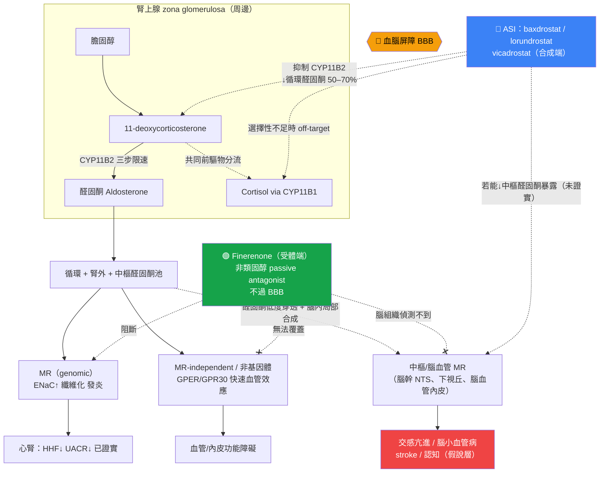

# 醛固酮合成酶抑制劑（ASI）與 Finerenone：同一路徑、不同節點的兩種阻斷策略——機轉與結局差異的深度對讀

> **給讀者的定位說明**：本文預設讀者已熟悉 FIDELIO-DKD、FIGARO-DKD、FIDELITY 與 FINEARTS-HF 的試驗名稱與 finerenone 的基本心腎益處，因此背景僅作精煉、聚焦於藥理對比；主體（約七成篇幅）放在 finerenone 次分析與 ASI 新證據的深度對讀，特別是**腦血管／stroke 結局**這一機轉思辨。
>
> **證據分層標記**：本文於各處標明論斷的證據層級——
> 🟢 已是 guideline routine／phase 3 hard outcome；🟡 evidence expansion（次分析、surrogate-based、phase 2/3 以 BP 或 UACR 為終點）；🔴 hypothesis／機轉外推，尚無 head-to-head 驗證。
> 引用標記：📄 = 本地全文可追溯；📌 = 僅 abstract（不對其做具體數字斷言）。每個事實句末以 `[本地MD檔名]` 供 grep 稽核。

---

## 1. 核心問題與背景（精煉）

ASI（baxdrostat、lorundrostat、vicadrostat/BI 690517、dexfadrostat 等）與 finerenone 都在 renin–angiotensin–aldosterone system（RAAS）的「醛固酮臂」下手，但**作用節點根本不同**：ASI 在**合成端**抑制 CYP11B2、從源頭降低循環（含腎外／中樞）醛固酮；finerenone 在**受體端**以非類固醇、passive antagonist 的方式阻斷 mineralocorticoid receptor（MR）[finerenone_bbb_cns_Agarwal_2021]。

這個節點差異衍生出三個彼此關聯、且在臨床上尚未被 head-to-head 試驗釐清的問題：

1. **配體 vs 受體**：ASI 降低 ligand（可同時觸及 genomic 與 MR-independent／非基因體效應），finerenone 只阻斷 MR（無法覆蓋 MR-independent 的醛固酮效應，例如 GPER/GPR30 介導的快速血管作用）[mra_vs_asi_mechanism_Umanath_2026][r2_Gros_2011]。
2. **中樞可及性**：finerenone **不過血腦屏障（BBB）**——放射標定 finerenone 在大鼠口服後於腦組織中偵測不到[finerenone_bbb_cns_Agarwal_2021]；理論上對中樞 MR 無作用。ASI 降低全身醛固酮，理論上可能連帶降低中樞／腦血管的醛固酮暴露。
3. **結局層級落差**：finerenone 已有 phase 3 hard cardiorenal outcome（🟢）；ASI 目前多以 **BP 或 UACR 等 surrogate** 為終點（🟡），尚缺 finerenone 等級的 hard outcome。

因此本文的中心思辨是：**機轉覆蓋面更廣的 ASI，會不會轉譯成與 finerenone 不同（甚至更好）的臨床結局，尤其是 stroke／認知這類「腦」的終點？** 答案目前只能是「假說」，而檢視 finerenone 試驗中誠實的 stroke 訊號，會讓這個假說更值得認真對待。

### 1.1 醛固酮路徑與兩個可下手的節點（精煉版）

醛固酮由腎上腺 zona glomerulosa 的 **CYP11B2（aldosterone synthase）** 催化，從 11-deoxycorticosterone 經 corticosterone、18-OH-corticosterone 三個限速步驟合成；其近親 **CYP11B1（11β-hydroxylase）** 負責 cortisol 合成，兩者**編碼區約 95%、蛋白產物約 93% 同源**——這是 ASI 選擇性設計的核心難題[mra_vs_asi_mechanism_Umanath_2026][asi_pharmacology_Bogman_2017]。

醛固酮活化 MR 後，除經典的 genomic 效應（ENaC/Na⁺-K⁺-ATPase → 鈉重吸收、血壓上升）外，還經 serum- and glucocorticoid-inducible kinase-1 放大 ENaC，並在心、血管、腎、腦、免疫細胞等 MR 表現部位驅動發炎與纖維化[mra_vs_asi_mechanism_Kobayashi_2025]。此外，醛固酮尚有**非基因體／MR-independent** 的快速血管效應：Gros 等以 GPR30（GPER）基因剔除與過表現證明，醛固酮可經 GPR30-依賴途徑活化 ERK 與血管平滑肌收縮，此效應對「經典 MR 拮抗劑」不敏感[r2_Gros_2011]。**關鍵推論**：只有降低 ligand（ASI）能同時觸及 GPER 這類 MR-independent 效應；受體端阻斷（finerenone）在定義上無法覆蓋[asi_pharmacology_Shimizu_2024][mra_vs_asi_mechanism_Umanath_2026]。

> **路徑圖見 §5（Mermaid），標出 ASI（合成端）與 finerenone（受體端）阻斷位置與 BBB 界線。**

---

## 2. 分子／藥理層對比

### 2.1 ASI：合成端抑制 + 選擇性挑戰

各 ASI 對 CYP11B2 相對 CYP11B1 的**體外選擇性**（🟡 preclinical / phase 1，數字為 in vitro）：

| 藥物 | CYP11B2:CYP11B1 選擇性 | 依據 |
|---|---|---|
| Lorundrostat | **374 倍**（Ki 1.27 vs 475 nmol/L） | [asi_pharmacology_Shimizu_2024] |
| Vicadrostat（BI 690517） | **250 倍** | [asi_pharmacology_Judge_2025] |
| Baxdrostat（CIN-107/RO6836191） | **>100 倍** | [asi_pharmacology_Capriello_2026] |
| RO6836191（早期同系物） | 人類 100 倍（Ki 13 vs 1310 nmol/L）／猴 800 倍（Ki 4 vs 3150 nmol/L） | [asi_pharmacology_Bogman_2017] |

**選擇性為何攸關**：第一代 ASI **LCI699（osilodrostat）** 選擇性不足，在有效劑量範圍內即抑制 cortisol，導致 11-deoxycorticosterone 累積、ACTH 刺激後 cortisol 反應受損，最終退出高血壓開發、轉向 Cushing 病[asi_pharmacology_Bogman_2017][asi_pharmacology_Freeman_2023_HypertensRes_MAD]。新一代 ASI 在此點上已明顯改善：Rasmussen 系統性回顧結論為——**只有 LCI699 顯著抑制 cortisol 生成，baxdrostat、lorundrostat、vicadrostat、dexfadrostat 皆無**[asi_pharmacology_Rasmussen_2025]。

**藥效學證據（🟡 phase 1）**：
- Baxdrostat：半衰期約 26–31 h（支持每日一次），劑量 ≥1.5 mg 產生劑量依賴性醛固酮下降，第 10 天血漿醛固酮降約 **51–73%**，對 cortisol 無實質影響（即使 ACTH 挑戰下）[asi_pharmacology_Freeman_2023_HypertensRes_MAD]。
- Lorundrostat：t½ 約 10–12 h；單劑 100–200 mg 降醛固酮達 **40%**，400–800 mg 達 **70%**；無基礎或 cosyntropin 刺激 cortisol 抑制[asi_pharmacology_Shimizu_2024]。
- 系統性回顧綜論：ASI 使血漿醛固酮下降 **50–70%**，與 MRA「反而升高循環醛固酮」形成鮮明對比[asi_pharmacology_Rasmussen_2025]。

**兩個未解的機轉隱憂（🔴，詳見 §4.3）**：(a) **aldosterone breakthrough／renin 代償上升**——ASI 降醛固酮後，RAAS 可能以 PRA 上升回饋；BaxHTN 已觀察到 aldosterone 下降伴隨 PRA 上升，但這仍是探索性訊號，不等於已證實療效會衰退[asi_pharmacology_Flack_2025]；(b) **CYP11B1 off-target／前驅物累積**——CYP11B2 與 CYP11B1 高度同源，理論上可能導致 cortisol-axis 影響，或使共同前驅物 11-deoxycorticosterone（本身具鹽皮質活性）累積而抵銷降 aldosterone 的淨效益；新一代高選擇性 ASI 目前主要在超治療暴露或選擇性不足時才看見明顯前驅物問題[asi_pharmacology_Bogman_2017][asi_pharmacology_Judge_2025]。

### 2.2 Finerenone：受體端、非類固醇、低 CNS 穿透

finerenone 的 receptor pharmacology 與組織分布特徵，正是其與 steroidal MRA 及 ASI 區分的關鍵：

- **結合模式**：分子模擬顯示 finerenone 為 bulky、passive antagonist，並可作為 **inverse agonist**——即使無醛固酮亦能降低 cofactor recruitment；spironolactone/eplerenone 則呈部分促效[finerenone_bbb_cns_Agarwal_2021]。
- **選擇性與效價**：對 MR 較 eplerenone、spironolactone 更具選擇性，效價至少與 spironolactone 相當[finerenone_bbb_cns_Agarwal_2021]。
- **組織分布均衡**：¹⁴C-finerenone 在大鼠呈**心–腎均衡分布**，而 spironolactone/eplerenone 偏積於腎；此差異可能解釋 finerenone 對鈉鉀平衡影響較小[finerenone_bbb_cns_Agarwal_2021]。
- **不過 BBB（本文核心）**：放射標定 finerenone 口服後**腦組織偵測不到**；finerenone 較 steroidal MRA 極性更高、親脂性低 6–10 倍[finerenone_bbb_cns_Agarwal_2021]。相對地，spironolactone/eplerenone 可進入腦——動物模型中 ICV spironolactone 能阻斷中樞 MR 介導的鈉誘發高血壓[finerenone_bbb_cns_Huang_2008]。
- **藥動**：腎排除極少、半衰期短（腎衰竭者 2–3 h）、無活性代謝物；與 spironolactone 具長效活性代謝物（canrenone 等，停藥後可持續數週）成對比[finerenone_bbb_cns_Agarwal_2021]。

**藥理對讀的核心**：finerenone 以「受體選擇性 + 組織均衡分布 + 不過 BBB」見長；但正因不過 BBB，理論上**對中樞 MR 無作用**。ASI 若能降低中樞醛固酮暴露，機轉覆蓋面理論上更廣——但這需先確認「系統性 ASI 是否真能改變腦內醛固酮」，目前仍是未證實環節（見 §4.1）。

---

## 3. 生理／中間終點層對照

| 中間終點 | ASI（合成端） | Finerenone（受體端） |
|---|---|---|
| **循環醛固酮** | 下降 50–70%[asi_pharmacology_Rasmussen_2025] | 受體阻斷，循環醛固酮**上升**（反饋）[finerenone_bbb_cns_Agarwal_2021] |
| **Renin/PRA** | 代償性上升（BaxHTN 觀察）[asi_pharmacology_Flack_2025] | 因 MR 阻斷而上升[finerenone_bbb_cns_Agarwal_2021] |
| **收縮壓（安慰劑校正）** | baxdrostat −8.7～−9.8 mmHg（BaxHTN）[asi_pharmacology_Flack_2025]；lorundrostat −9.1 mmHg（Launch-HTN）[asi_pharmacology_Saxena_2025] | FIGARO 中 SBP 差僅 −3.5 mmHg（month 4）／−2.6 mmHg（month 24），非降壓藥定位[FIGARO-DKD_NEJMoa2110956] |
| **血鉀** | 升高；BaxHTN K⁺>5.5：2 mg 組 11.1% vs 安慰劑 0.4%[asi_pharmacology_Flack_2025] | FIDELITY 高血鉀相關 TEAE 14.0% vs 6.9%[cerebrovascular_mr_aldosterone_Agarwal_2021] |
| **UACR** | vicadrostat 10 mg 降 ~37–40%（±empagliflozin）[asi_pharmacology_Judge_2025][asi_clinical_outcomes_Cherney_2026] | FIDELITY month 4 UACR 較安慰劑低 32%[cerebrovascular_mr_aldosterone_Agarwal_2021] |
| **eGFR 初期 dip** | BaxHTN 12 週 eGFR −7.0 mL/min/1.73m²（可逆）[asi_pharmacology_Flack_2025]；lorundrostat 12 週降 9.3%（creatinine-based）[asi_pharmacology_Saxena_2025] | 已知初期可逆性 dip，屬血流動力學性 |
| **Cortisol** | 新一代 ASI 無抑制；僅 osilodrostat 有[asi_pharmacology_Rasmussen_2025] | 不涉及合成，無此議題 |

**解讀重點**：兩者在 UACR 這一腎臟 surrogate 上幅度相近（ASI ~40% vs finerenone 32%），但**方向相反的循環醛固酮變化**（ASI 降、finerenone 升）是機轉分歧的指紋。lorundrostat 的 eGFR 下降部分被歸因於 lorundrostat 與 creatinine 競爭 MATE1 轉運（cystatin-C 校正後降幅較小），提示其 creatinine-based eGFR 下降可能被高估[asi_pharmacology_Saxena_2025]。

---

## 4. 臨床結局層：surrogate 的 ASI vs hard-outcome 的 finerenone

### 4.1 ASI 現有 RCT 一覽（🟡 多為 BP／surrogate）

| 試驗 | 藥物 | 期別/n | 主要終點 | 關鍵結果 |
|---|---|---|---|---|
| **BrigHTN** | baxdrostat | ph2, resistant HTN | seated-SBP | 陽性（降 SBP）[asi_pharmacology_Flack_2025] |
| **HALO** | baxdrostat | ph2, uncontrolled HTN | seated-SBP wk8 | **陰性**（未達差異）[asi_pharmacology_Flack_2025] |
| **BaxHTN** | baxdrostat | ph3, n=796 | ΔSBP wk12 | 1 mg −8.7、2 mg **−9.8 mmHg**（vs placebo，P<0.0001）；randomized withdrawal 再證效果[asi_pharmacology_Flack_2025] |
| **Target-HTN** | lorundrostat | ph2, n=200 | ΔSBP wk8 | 50 mg −9.6 mmHg（vs placebo）[asi_pharmacology_Laffin_2023] |
| **Advance-HTN** | lorundrostat | ph2, n=285 | 24h ambulatory BP | 臨床顯著下降[asi_pharmacology_Saxena_2025] |
| **Launch-HTN** | lorundrostat | ph3, n=1083 | office SBP wk6 | pooled 50 mg **−9.1 mmHg**（vs placebo，P<0.001）[asi_pharmacology_Saxena_2025] |
| **vicadrostat 1378-0005** | BI 690517±empa | ph2, n=586 | ΔUACR wk14 | 10 mg 降 UACR ~37–40%[asi_pharmacology_Judge_2025][asi_clinical_outcomes_Cherney_2026] |
| **EASi-KIDNEY** | vicadrostat+empa | ph3, ~11,000 | **cardiorenal hard outcome** | **進行中**，power 可分別評估糖尿病/非糖尿病[asi_pharmacology_Judge_2025] |

網路統合分析（Yusuf 2026，🟡）給出跨藥比較的 SBP 降幅點估計：baxdrostat −8.63 mmHg、lorundrostat −7.47 mmHg、LCI699/osilodrostat −5.63 mmHg（均 vs placebo）[asi_clinical_outcomes_Yusuf_2026]。**關鍵限制**：這些幾乎全是 BP 或 UACR 終點；**EASi-KIDNEY 是第一個能提供 ASI hard cardiorenal outcome 的 phase 3，結果尚未問世**[asi_pharmacology_Judge_2025][mra_vs_asi_mechanism_Umanath_2026]。

### 4.2 Finerenone 的 hard outcome（🟢 已 guideline routine）與 stroke 訊號的誠實檢視

finerenone 的 hard cardiorenal 效益已確立：
- **FIDELITY**（pooled，n=13,026）：主要 CV 複合終點 HR **0.86（0.78–0.95）**，主要腎臟終點 HR **0.77（0.67–0.88）**[cerebrovascular_mr_aldosterone_Agarwal_2021]。
- **FIGARO-DKD**：主要 CV 複合終點 HR **0.87（0.76–0.98）**[asi_pharmacology_Judge_2025]。
- **FIDELIO-DKD**：主要腎臟複合終點降 18%，HR **0.82（0.73–0.93）**[asi_pharmacology_Judge_2025]。

**但 stroke 這一項，finerenone 三份數據一致地「中性」**：

| 試驗 | Nonfatal stroke（finerenone vs placebo） | HR (95% CI) |
|---|---|---|
| **FIGARO-DKD** | 108 (2.9%) vs 111 (3.0%) | **0.97 (0.74–1.26)** [FIGARO-DKD_NEJMoa2110956] |
| **FIDELIO-DKD** | 90 (3.2%) vs 87 (3.1%) | **1.03 (0.76–1.38)** [FIDELIO-DKD_NEJMoa2025845] |

FIDELIO 原文明白寫道：各成分事件在 finerenone 組皆較低，**「唯獨 nonfatal stroke，兩組發生率相近」**[FIDELIO-DKD_NEJMoa2025845]。FIDELITY 次分析亦指出，複合 CV 效益主要由 **HHF（HR 0.78, 0.66–0.92）** 驅動；一旦**侷限於 ASCVD 事件（MI 與 stroke），相對風險下降未達統計顯著**，且明言「nsMRA 是否能修飾 ASCVD 事件風險尚未確立、需進一步研究」[cerebrovascular_mr_aldosterone_Agarwal_2021][cerebrovascular_mr_aldosterone_Agarwal_2023]。

**這正是本主題最重要的一句話**：finerenone 在 T2D-CKD 族群**沒有展現 stroke 益處**——這與「finerenone 不過 BBB、對中樞/腦血管 MR 無直接作用」的藥理特徵在方向上一致（🔴 為機轉外推，非因果證明）[finerenone_bbb_cns_Agarwal_2021]。它同時提醒我們：finerenone 的 hard-outcome 招牌，主要建立在 HHF 與腎臟終點，而非腦血管。

### 4.3 ASI 的兩個未解機轉隱憂：降 ligand 之後，系統會不會反撲？（🔴）

ASI 的核心吸引力是「從合成端降低 aldosterone ligand」。這使 ASI 理論上比 finerenone 更上游：不只降低 MR 的 ligand 供應，也可能降低 MR-independent／非基因體醛固酮效應。但這個優勢成立有一個前提：**steroidogenesis–RAAS 系統不能用其他路徑把鹽皮質活性補回來**。目前最需要追蹤的兩個反向機轉，是 **aldosterone breakthrough／renin 代償上升**與 **CYP11B1 off-target／11-deoxycorticosterone（11-DOC）前驅物累積**。

#### (a) Aldosterone breakthrough／renin 代償上升：不是「ASI 已失效」，而是「長期 ligand-lowering 能否維持」的問題

ASI 抑制 CYP11B2 後，aldosterone 下降，遠端腎小管鈉重吸收降低，natriuresis 增加；有效循環量與 macula densa / juxtaglomerular feedback 會促使 renin、PRA 上升。BaxHTN 的探索性藥效資料即觀察到 **aldosterone 下降伴隨 PRA 上升**；作者推測，這可能代表 baxdrostat 在已有利尿劑背景下仍能進一步促進尿鈉排泄，也提示 hard-to-control BP 族群中仍存在 residual aldosterone activity / breakthrough[asi_pharmacology_Flack_2025]。

這裡要避免過度解讀：**PRA 上升本身不是壞事，也不等於 aldosterone 已經回升；它是下游鹽皮質訊號被壓低後的預期回饋。**真正未解的是慢性治療時，高 renin / angiotensin II、血鉀、ACTH 與 zona glomerulosa 適應性變化，會不會逐漸把 CYP11B2 活性或 aldosterone 生成推回來，造成「降 aldosterone 幅度變小、BP/UACR 效果衰退、或需要更高劑量」。因此 ASI 的短期 BP/UACR 成功，仍不能直接外推為長期 hard outcome 成功；必須在長期試驗中同時看 aldosterone、PRA、鉀、鈉、eGFR dip 與療效是否隨時間衰減。

#### (b) CYP11B1 off-target／11-DOC 前驅物累積：不是「所有 ASI 都會 cortisol failure」，而是「選擇性窗口夠不夠寬」的問題

CYP11B2 與 CYP11B1 高度同源，且 aldosterone 與 cortisol 合成都使用相鄰的 steroidogenic 前驅物。理想 ASI 應只抑制 CYP11B2，使 11-DOC 往 aldosterone 的轉換下降，而不抑制 CYP11B1 的 cortisol 合成。若選擇性不足，會出現兩層風險：第一，**CYP11B1 off-target** 造成 11-deoxycortisol 累積、cortisol 生成受損與 ACTH stimulation response 變鈍；這正是早期 ASI / osilodrostat 在高血壓開發中失利、轉向 Cushing syndrome 的主要教訓[asi_pharmacology_Bogman_2017][asi_pharmacology_Judge_2025]。第二，即使 CYP11B1 沒有明顯被抑制，單純堵住 CYP11B2 也可能使共同前驅物 **11-DOC 上升**；而 11-DOC 本身具鹽皮質活性，理論上可部分補回 sodium-retaining / potassium-wasting 效應，抵銷「降 aldosterone ligand」的淨效益[asi_pharmacology_Bogman_2017][asi_pharmacology_Judge_2025]。

目前證據應寫得精準：**新一代高選擇性 ASI 在治療劑量下，cortisol 抑制與 11-DOC 顯著累積尚未成為主要臨床訊號；明顯前驅物累積多見於超治療暴露或選擇性不足時。**Bogman 的 RO6836191 早期人體資料顯示，10 mg 已可達最大 aldosterone 抑制，但 11-DOC 與 11-deoxycortisol 的增加主要在 ≥90 mg 才出現；vicadrostat 亦強調 250-fold CYP11B2:CYP11B1 選擇性，phase II CKD 試驗未見平均 cortisol 有意義下降，但 EASi-KIDNEY 仍把 corticosteroid pathway、cortisol 與其前驅物監測列為安全性重點[asi_pharmacology_Bogman_2017][asi_pharmacology_Judge_2025]。

#### 對讀 finerenone：ASI 的優勢與弱點剛好同源

finerenone 的弱點是受體端阻斷：它不能降低 circulating aldosterone，也無法覆蓋 MR-independent ligand effect；但它也不會直接造成 steroidogenesis 前驅物分流或 CYP11B1 off-target。ASI 的弱點剛好相反：它的機轉覆蓋面可能更廣，但必須證明「降 ligand」能長期維持，且不被 PRA 代償、aldosterone breakthrough、11-DOC 前驅物累積或 cortisol-axis 安全性問題抵銷。

因此，ASI vs finerenone 的真正未知，不是單純「誰降 BP / UACR 比較多」，而是：**合成端阻斷的廣覆蓋機轉，能否在長期 hard outcome 中保留淨效益，而不是被內分泌回饋與前驅物分流吃掉。**這也是為何 EASi-KIDNEY 這類大型 hard-outcome 試驗，必須同時看 cardiorenal outcome 與 steroidogenesis safety，而不能只看短期 UACR 或 BP[asi_pharmacology_Judge_2025]。

---

## 5. 路徑與阻斷位置示意圖

*圖說*：ASI 於合成端下手，降低整個醛固酮池（周邊+腎外+潛在中樞），理論上同時覆蓋 genomic、MR-independent 與（若能穿透相關屏障）中樞效應；finerenone 於受體端阻斷 genomic MR、心腎益處明確，但無法覆蓋 MR-independent 效應，且不過 BBB → 對中樞 MR 無直接作用。紅色 stroke/認知路徑目前皆為假說層。[finerenone_bbb_cns_Agarwal_2021][r2_Gros_2011][asi_pharmacology_Rasmussen_2025][finerenone_bbb_cns_Huang_2008]

---

## 6. 潛在爭議與對讀（討論核心）

### 6.1 「機轉更廣」是否轉譯成腦血管結局差異？——正反面都要誠實看

**支持 ASI 可能額外覆蓋腦血管的間接證據（🟡～🔴）**：

1. **腦內確有 aldosterone-MR 軸**：MR 表現於海馬、杏仁核、前額葉、腦幹 NTS、下視丘與腦血管內皮；腦內醛固酮濃度雖低但與血清濃度成正比，且可能有局部合成[finerenone_bbb_cns_Nieckarz_2024][finerenone_bbb_cns_Paul_2022]。11β-HSD2 在腦幹 NTS 等處使該區 MR「aldosterone-selective」[finerenone_bbb_cns_Paul_2022]。
2. **中樞 ASI 可阻斷鈉誘發高血壓**：Wistar 大鼠 ICV 注入 aldosterone synthase inhibitor（FAD286）可預防 CSF 鈉升高所致的下視丘醛固酮增加、交感亢進與高血壓[finerenone_bbb_cns_Huang_2008]。此為「降低中樞醛固酮合成 → 改善血壓/交感」的直接概念驗證（動物層）。
3. **醛固酮的腦血管損傷**：醛固酮經內皮 MR 增加 superoxide 與 chemokine，導致腦組織氧化壓力/發炎；並可能經 MR 刺激損傷 glycocalyx，這些變化可獨立於血壓造成腦血管病、stroke 或認知下降[finerenone_bbb_cns_Nieckarz_2024]。
4. **來自原發性醛固酮增多症（PA）的「自然實驗」最具啟發性**：
   - PA 相較 essential hypertension（EH）**stroke 風險逾兩倍**[cerebrovascular_mr_aldosterone_Qian_2022]。
   - **關鍵對讀**：Qian 統合分析顯示，PA 以**手術腎上腺切除（源頭移除）** 者 stroke 風險較**藥物 MRA 治療者顯著降低（OR 0.57, 0.35–0.93）**，且與 EH 無異；而**藥物 MRA 治療的 PA 仍較 EH 高（OR 1.88, 1.68–2.11）**[cerebrovascular_mr_aldosterone_Qian_2022]。
   - **失智同向**：Hong 全國世代研究中，PA 之 **MRA 組** 相較 EH 全因失智 adjusted HR **1.31**、血管型失智 HR **1.62**（皆顯著）；**腺瘤切除組**則無顯著增加[cerebrovascular_mr_aldosterone_Hong_2023]。

**這組 PA 證據的推論力**：在 PA 中，「受體端阻斷（MRA）」未能把 stroke/失智風險拉回到 EH 水準，而「源頭消除醛固酮（手術）」可以。若把此類比延伸——**ASI 從合成端降低 ligand，機轉上更接近「源頭處理」**——則 ASI 理論上可能在腦血管終點上優於單純受體阻斷（🔴 這是類比外推，PA 手術 ≠ 系統性 ASI，不能等同）[cerebrovascular_mr_aldosterone_Qian_2022][cerebrovascular_mr_aldosterone_Hong_2023]。這也與 §4.2 中 finerenone stroke 中性、且不過 BBB 的觀察相互呼應。

**反面：不能過度樂觀的三個理由**

- **(a) finerenone 的 stroke 中性未必單純源於 BBB**：FIDELIO/FIGARO 族群為 T2D-CKD，stroke 事件數不多、且非主要終點；「無顯著益處」也可能是 power 或族群問題，而非「中樞 MR 無關」的證明[FIDELIO-DKD_NEJMoa2025845][cerebrovascular_mr_aldosterone_Agarwal_2023]。
- **(b) ASI 的理論優勢可能被自身弱點抵銷**：aldosterone breakthrough（renin/PRA 代償上升）[asi_pharmacology_Flack_2025]、以及 CYP11B1 off-target 造成的 11-deoxycorticosterone（具鹽皮質活性）與 11-deoxycortisol 累積（雖新一代 ASI 僅在超治療劑量才明顯）[asi_pharmacology_Bogman_2017][asi_pharmacology_Judge_2025]，都可能削弱「降 ligand」的淨效益。
- **(c) 系統性 ASI 是否真能改變腦內醛固酮，未經證實**：現有中樞證據來自 **ICV 直接注入**（Huang）[finerenone_bbb_cns_Huang_2008]，而非口服系統性 ASI；口服 ASI 能否有意義地降低中樞醛固酮池，是整條假說鏈中最未驗證的一環。腦 MR 大多為「CORT-preferring」，僅少數區域為 aldosterone-selective[finerenone_bbb_cns_Paul_2022]，這進一步限制了「降醛固酮 → 改善腦 MR 效應」的普適性。

### 6.2 Head-to-head 缺席下的證據紀律

目前**沒有任何 ASI vs finerenone 的頭對頭試驗**；ASI 幾乎全以 BP/surrogate 為終點，finerenone 才有 hard outcome[mra_vs_asi_mechanism_Umanath_2026][asi_pharmacology_Rasmussen_2025]。因此任何「ASI 會/不會與 finerenone 結局一致」的陳述都應標為 **hypothesis（🔴）**。多篇 review 對 ASI 定位方向一致——皆指向 ASI 用於**填補 RAAS 阻斷後的殘餘風險 / 克服既有 RAAS 治療的限制**[mra_vs_asi_mechanism_Umanath_2026][mra_vs_asi_mechanism_Patel_2025]，其中 Umanath 等（2026）以 FIDELIO-DKD 為例具體量化此殘餘風險：即便用了 finerenone，仍有 17.8% 達主要終點、13.0% 有持續 CV 風險[mra_vs_asi_mechanism_Umanath_2026]，而 ASI 與 SGLT2i 併用（EASi-KIDNEY 設計，以 empagliflozin 抵消部分高血鉀風險）是驗證其 hard outcome 的關鍵路徑[asi_pharmacology_Judge_2025][mra_vs_asi_mechanism_Patel_2025]。

### 6.3 安全性對讀（皆為 evidence expansion 層）

兩類藥都以**高血鉀**為共同軟肋：BaxHTN 中 K⁺>5.5 在 baxdrostat 2 mg 達 11.1%（vs 安慰劑 0.4%），需臨床介入之高血鉀達 7.9%[asi_pharmacology_Flack_2025]；FIDELITY 中 finerenone 高血鉀相關 TEAE 14.0%、因高血鉀永久停藥 1.7%[cerebrovascular_mr_aldosterone_Agarwal_2021]。差異在於：finerenone 因心–腎均衡分布與非類固醇結構，血鉀升幅與 steroidal MRA 相比較溫和[finerenone_bbb_cns_Agarwal_2021]；ASI 則需監測早期（多在頭兩週）出現的血鉀/血鈉變化與可逆 eGFR dip[asi_pharmacology_Flack_2025]。ASI 相較 spironolactone 的優勢是**避免抗雄性素副作用（男性女乳症、月經異常）**[asi_pharmacology_Capriello_2026]。

---

## 7. Take-home messages

1. **同路徑、不同節點**：ASI 與 finerenone 並非「同類的新舊版」，而是作用於醛固酮路徑**不同節點**的兩種策略——ASI 降 ligand（合成端），finerenone 阻斷 MR（受體端）[mra_vs_asi_mechanism_Umanath_2026][finerenone_bbb_cns_Agarwal_2021]。
2. **機轉覆蓋面：ASI 理論上更廣**：ASI 可同時觸及 genomic、MR-independent（GPER）與（若能穿透）中樞/腦血管效應；finerenone 因受體選擇性、心–腎均衡分布且**不過 BBB** 而見長，但無法覆蓋 MR-independent 與中樞 MR[r2_Gros_2011][finerenone_bbb_cns_Agarwal_2021]。
3. **「機轉更廣 ≠ 結局更好」**：finerenone 有 phase 3 hard cardiorenal outcome（🟢），但其效益主要來自 **HHF 與腎臟終點；stroke 在 FIDELIO/FIGARO 皆中性**（HR 0.97、1.03）[FIGARO-DKD_NEJMoa2110956][FIDELIO-DKD_NEJMoa2025845]。ASI 目前只有 **BP/UACR surrogate（🟡）**，尚缺同級 hard outcome。
4. **腦血管假說值得認真但不可當結論**：PA 的自然實驗提示「源頭處理（手術）」在 stroke/失智上優於「受體阻斷（MRA）」[cerebrovascular_mr_aldosterone_Qian_2022][cerebrovascular_mr_aldosterone_Hong_2023]，與 finerenone stroke 中性方向一致；但口服 ASI 能否改變中樞醛固酮、以及 breakthrough/CYP11B1 off-target 是否抵銷優勢，均未驗證（🔴）。
5. **臨床上先分清兩個問題**：短期內把 ASI 視為**降壓工具**（resistant/uncontrolled HTN，surrogate 證據），把 finerenone 視為 T2D-CKD 的**器官保護**（hard outcome、guideline routine）；兩者結局是否一致，**待 EASi-KIDNEY 等 phase 3 hard-outcome 試驗驗證**[asi_pharmacology_Judge_2025][mra_vs_asi_mechanism_Umanath_2026]。

---

## References（Vancouver）

1. Flack JM, Azizi M, Brown JM, Dwyer JP, Fronczek J, Jones ESW, et al. Efficacy and Safety of Baxdrostat in Uncontrolled and Resistant Hypertension (BaxHTN). N Engl J Med. 2025;393(14):1363-1374. doi:10.1056/NEJMoa2507109. 📄 [asi_pharmacology_Flack_2025]
2. Saxena M, Laffin L, Borghi C, Fernandez Fernandez B, Ghali JK, Kopjar B, et al. Lorundrostat in Participants With Uncontrolled Hypertension and Treatment-Resistant Hypertension: The Launch-HTN Randomized Clinical Trial. JAMA. 2025;334(5):409-418. doi:10.1001/jama.2025.9413. 📄 [asi_pharmacology_Saxena_2025]
3. Laffin LJ, Rodman D, Luther JM, Vaidya A, Weir MR, Rajicic N, et al. Aldosterone Synthase Inhibition With Lorundrostat for Uncontrolled Hypertension: The Target-HTN Randomized Clinical Trial. JAMA. 2023;330(12):1140-1150. doi:10.1001/jama.2023.16029. 📄 [asi_pharmacology_Laffin_2023]
4. Bogman K, Schwab D, Delporte ML, Palermo G, Amrein K, Mohr S, et al. Preclinical and Early Clinical Profile of a Highly Selective and Potent Oral Inhibitor of Aldosterone Synthase (CYP11B2). Hypertension. 2017;69(1):189-196. doi:10.1161/HYPERTENSIONAHA.116.07716. 📄 [asi_pharmacology_Bogman_2017]
5. Freeman MW, Bond M, Murphy B, Hui J, Isaacsohn J. Results from a phase 1 multiple ascending dose study characterizing the pharmacokinetics and demonstrating the safety and selectivity of the aldosterone synthase inhibitor baxdrostat in healthy volunteers. Hypertens Res. 2023;46(1):108-118. doi:10.1038/s41440-022-01070-4. 📄 [asi_pharmacology_Freeman_2023_HypertensRes_MAD]
6. Shimizu H, Tortorici MA, Ohta Y, Ogawa K, Rahman SMA, Fujii A, et al. First-in-human study evaluating safety, pharmacokinetics, and pharmacodynamics of lorundrostat, a novel and highly selective aldosterone synthase inhibitor. Clin Transl Sci. 2024;17(8):e70000. doi:10.1111/cts.70000. 📄 [asi_pharmacology_Shimizu_2024]
7. Schulze F, Schaible J, Goettel M, Tanaka Y, Hohl K, Schultz A, et al. Phase 1 studies of the safety, tolerability, pharmacokinetics, and pharmacodynamics of BI 690517 (vicadrostat) in healthy male volunteers. Naunyn Schmiedebergs Arch Pharmacol. 2025. doi:10.1007/s00210-025-03838-0. 📄 [asi_pharmacology_Schulze_2025]
8. Judge PK, Tuttle KR, Staplin N, Hauske SJ, Zhu D, Sardell R, et al. The potential for improving cardio-renal outcomes in chronic kidney disease with the aldosterone synthase inhibitor vicadrostat (BI 690517): a rationale for the EASi-KIDNEY trial. Nephrol Dial Transplant. 2025;40(6):1175-1186. doi:10.1093/ndt/gfae263. 📄 [asi_pharmacology_Judge_2025]
9. Rasmussen AA, Nordestgaard KL, Simonsen U, Buus NH. Blood Pressure–Lowering Effects of Aldosterone Synthase Inhibitors—A Systematic Review. Basic Clin Pharmacol Toxicol. 2025;137:e70080. doi:10.1111/bcpt.70080. 📄 [asi_pharmacology_Rasmussen_2025]
10. Cicero AFG, Tocci G, Avagimyan A, Penson P, Nardoianni G, Perone F, et al. Aldosterone Synthase Inhibitors for Resistant Hypertension: Pharmacological Insights – A Systematic Review. Drugs. 2025. doi:10.1007/s40265-025-02229-2. 📄 [asi_pharmacology_Cicero_2025]
11. Capriello I, Dömling A. Baxdrostat: A First-in-Class Aldosterone Synthase Inhibitor for Resistant Hypertension. ACS Pharmacol Transl Sci. 2026. doi:10.1021/acsptsci.6c00102. 📄 [asi_pharmacology_Capriello_2026]
12. Cherney DZI, Rossing P, Canziani ME, Caramori ML, Correa-Rotter R, Cronin L, et al. Effects of Vicadrostat/Empagliflozin in People With Chronic Kidney Disease: Metabolic Subgroup Analyses. Diabetes Obes Metab. 2026;28:e70836. doi:10.1111/dom.70836. 📄 [asi_clinical_outcomes_Cherney_2026]
13. Yusuf IA, Badero OJ, Ihesiulo A, Okwah MN, Oshodin A, Asikong E. Aldosterone synthase inhibitors in uncontrolled and resistant hypertension: A phenotype-stratified systematic review and network meta-analysis of randomized trials. PLoS One. 2026. doi:10.1371/journal.pone.0349932. 📄 [asi_clinical_outcomes_Yusuf_2026]
14. Umanath K, Dwyer JP, Mentz RJ. Residual risk in cardiovascular and renal diseases and the potential role of aldosterone synthase inhibitors. Front Cardiovasc Med. 2026;13:1845339. doi:10.3389/fcvm.2026.1845339. 📄 [mra_vs_asi_mechanism_Umanath_2026]
15. Kobayashi M, Pitt B, Ferreira JP, Rossignol P, Girerd N, Zannad F. Aldosterone-targeted therapies: early implementation in resistant hypertension and chronic kidney disease. Eur Heart J. 2025;46:2618-2642. doi:10.1093/eurheartj/ehaf225. 📄 [mra_vs_asi_mechanism_Kobayashi_2025]
16. Patel SK, Teoh H, Saunthar A, Yau TM, Verma S. The Emerging Role of Aldosterone Synthase Inhibitors in Overcoming Renin-Angiotensin-Aldosterone System Therapy Limitations: A Narrative Review. Card Fail Rev. 2025;11:e20. doi:10.15420/cfr.2025.09. 📄 [mra_vs_asi_mechanism_Patel_2025]
17. Agarwal R, Kolkhof P, Bakris G, Bauersachs J, Haller H, Wada T, et al. Steroidal and non-steroidal mineralocorticoid receptor antagonists in cardiorenal medicine. Eur Heart J. 2021;42(2):152-161. doi:10.1093/eurheartj/ehaa736. 📄 [finerenone_bbb_cns_Agarwal_2021]
18. Bakris GL, Agarwal R, Anker SD, Pitt B, Ruilope LM, Rossing P, et al. Effect of Finerenone on Chronic Kidney Disease Outcomes in Type 2 Diabetes (FIDELIO-DKD). N Engl J Med. 2020;383(23):2219-2229. doi:10.1056/NEJMoa2025845. 📄 [FIDELIO-DKD_NEJMoa2025845]
19. Pitt B, Filippatos G, Agarwal R, Anker SD, Bakris GL, Rossing P, et al. Cardiovascular Events with Finerenone in Kidney Disease and Type 2 Diabetes (FIGARO-DKD). N Engl J Med. 2021;385(24):2252-2263. doi:10.1056/NEJMoa2110956. 📄 [FIGARO-DKD_NEJMoa2110956]
20. Agarwal R, Filippatos G, Pitt B, Anker SD, Rossing P, Joseph A, et al. Cardiovascular and kidney outcomes with finerenone in patients with type 2 diabetes and chronic kidney disease: the FIDELITY pooled analysis. Eur Heart J. 2022;43(6):474-484. doi:10.1093/eurheartj/ehab777. 📄 [cerebrovascular_mr_aldosterone_Agarwal_2021]
21. Agarwal R, Pitt B, Rossing P, Anker SD, Filippatos G, Ruilope LM, et al. Modifiability of Composite Cardiovascular Risk Associated With Chronic Kidney Disease in Type 2 Diabetes With Finerenone (FIDELITY subanalysis). JAMA Cardiol. 2023;8(8):732-741. doi:10.1001/jamacardio.2023.1505. 📄 [cerebrovascular_mr_aldosterone_Agarwal_2023]
22. Bakris GL, Agarwal R, Chan JC, Cooper ME, Gansevoort RT, Haller H, et al. Effect of Finerenone on Albuminuria in Patients With Diabetic Nephropathy: A Randomized Clinical Trial (ARTS-DN). JAMA. 2015;314(9):884-894. doi:10.1001/jama.2015.10081. 📄 [r2_Bakris_2015]
23. Gros R, Ding Q, Sklar LA, Prossnitz EE, Arterburn JB, Chorazyczewski J, et al. GPR30 Expression Is Required for the Mineralocorticoid Receptor-Independent Rapid Vascular Effects of Aldosterone. Hypertension. 2011;57(3):442-451. doi:10.1161/HYPERTENSIONAHA.110.161653. 📄 [r2_Gros_2011]
24. Huang BS, White RA, Ahmad M, Jeng AY, Leenen FH. Central infusion of aldosterone synthase inhibitor prevents sympathetic hyperactivity and hypertension by central Na+ in Wistar rats. Am J Physiol Regul Integr Comp Physiol. 2008;295(1):R166-R172. doi:10.1152/ajpregu.90352.2008. 📄 [finerenone_bbb_cns_Huang_2008]
25. Nieckarz A, Graff B, Burnier M, Marcinkowska AB, Narkiewicz K. Aldosterone in the brain and cognition: knowns and unknowns. Front Endocrinol. 2024;15:1456211. doi:10.3389/fendo.2024.1456211. 📄 [finerenone_bbb_cns_Nieckarz_2024]
26. Paul SN, Wingenfeld K, Otte C, Meijer OC. Brain mineralocorticoid receptor in health and disease: From molecular signalling to cognitive and emotional function. Br J Pharmacol. 2022;179(13):3205-3219. doi:10.1111/bph.15835. 📄 [finerenone_bbb_cns_Paul_2022]
27. Qian N, Xu J, Wang Y. Stroke Risks in Primary Aldosteronism with Different Treatments: A Systematic Review and Meta-Analysis. J Cardiovasc Dev Dis. 2022;9(9):300. doi:10.3390/jcdd9090300. 📄 [cerebrovascular_mr_aldosterone_Qian_2022]
28. Hong N, Kim KJ, Yu MH, Jeong SH, Lee S, Lim JS, et al. Risk of dementia in primary aldosteronism compared with essential hypertension: a nationwide cohort study. Alzheimers Res Ther. 2023;15:151. doi:10.1186/s13195-023-01274-x. 📄 [cerebrovascular_mr_aldosterone_Hong_2023]
29. Chen ZW, Hung CS, Wu VC, Lin YH. Primary Aldosteronism and Cerebrovascular Diseases. Endocrinol Metab. 2018;33(4):429-434. doi:10.3803/EnM.2018.33.4.429. 📄 [cerebrovascular_mr_aldosterone_Chen_2018]
30. Vibhatavata P, Turcu AF. Emerging Medical Therapies for Primary Aldosteronism. Hypertension. 2026. doi:10.1161/HYPERTENSIONAHA.126.26229. 📌 [mra_vs_asi_mechanism_Vibhatavata_2026]
31. Geraci G, Sinatra N, Paternò V, Calabrese V, Cassataro G, Cuttone G, et al. Finerenone in Cardiorenal Disease: A Narrative Review of Molecular Mechanisms, Clinical Evidence, and Emerging Therapeutic Roles. Cardiovasc Drugs Ther. 2026. doi:10.1007/s10557-026-07890-7. 📌 [finerenone_bbb_cns_Geraci_2026]

---

*本文所有事實性數字均可經句末 `[本地MD檔名]` 於 07_aldosterone_synthase_inhibitor_vs_finerenone/原始PDF/ 目錄下對應 MD 檔 grep 回溯。LLM 僅執行組織與改寫，未自創任何引用或數值。撰稿日 2026-07-08。*

---

# 延伸主題:Finerenone(nsMRA)用於原發性醛固酮症(Primary Aldosteronism)

> 本節於 2026-07 併入本主題頁。原發性醛固酮症(PA)是「受體端阻斷 vs 合成端抑制」在**確診 PA** 情境下的直接戰場,與本頁 §8「受體阻斷 vs 醛固酮合成抑制」互為延伸。以下依證據分層整理 finerenone 及 nsMRA class(esaxerenone)在 PA 的直接證據,並附一份**投稿用英文 review article** 草稿。PA-specific 全文/摘要來源清單見同資料夾 `PA_SOURCE_INVENTORY.md`,原始檔位於 `原始PDF/pa_finerenone_*.md`。

---
## Finerenone(非類固醇型 MRA)用於原發性醛固酮症:一篇證據分層的深度回顧

> **證據標記說明**:📄=本地全文可稽核(檔案位於 `/Users/ander/Documents/medical/diabetes/nsmra/deep-research/07_aldosterone_synthase_inhibitor_vs_finerenone/原始PDF/`);📌=僅結構化 abstract(數字逐字轉錄,絕對值付費牆未取得);🌐=外部/參考檔來源(標作者年份 DOI/PMID,未落地全文)。
> **重要限度**:Circulation pilot RCT 雖為 verified,但為 Research Letter,PubMed 無 abstract、無 PMC/OA PDF;全文與完整 Table 係經 AHA Journals 發行商 HTML 逐字擷取。EJE 真實世界 switch、Hypertension 2026 單臂、Lancet DE PAMO 共識、JCEM 系統性回顧均為付費牆,僅取得 abstract。

---

### 1. TL;DR 結論

截至 **2026 年 7 月**,finerenone 用於 PA 的證據仍屬**早期**:一項 60 人 pilot RCT、一項智利真實世界 forced-switch 研究、一項 57 人單臂多中心研究,加上 esaxerenone(同屬非類固醇型 MRA,nsMRA)的 PA 資料作為 class 對照。核心結論如下:

1. **finerenone 確實能降 PA 患者的診間與 24h 血壓**,不是「只阻斷 MR、不降壓」的藥。pilot RCT 中 daytime SBP 降 −9.9 mmHg、24h SBP 降 −10.9 mmHg。📄 `pa_finerenone_circulation_rct_2025.md`
2. **真正的爭點不是「能不能降壓」,而是「現行 20 mg QD 劑量能否提供全天候的腎臟 MR blockade,充分逆轉鈉滯留、容量擴張、低血鉀與 renin suppression」**。單臂研究顯示 12 週後仍只有 32.7% 患者達 PRA ≥1 ng/mL/h,PAMO complete biochemical response 僅 29.1%。📌 `pa_finerenone_hypertension_2026.md`
3. **20 mg finerenone vs 20 mg spironolactone ≠ 等效 MR potency**。真實世界(eplerenone→finerenone)顯示血壓表面持平,但 renin 再被壓低、complete biochemical response 比例下降 → **診間血壓會高估治療充分性**。📌 `pa_finerenone_eje_realworld_switch_2025.md`
4. **2025 Endocrine Society 指引仍首選 spironolactone**,明言理由是「成本低、可近性高」,而非已證明藥理更優;並認為各 MRA「調到等效 potency 應有相近療效」。📄 `pa_finerenone_endosociety_guideline_2025.md`
5. **尚無 PA-specific 長期 hard outcome(AF/stroke/HF/MACE/CKD/死亡)證據**;head-to-head FAIRY trial 進行中,primary endpoint 仍是 12 週 24h ABPM SBP(short-term surrogate)。📄 `pa_finerenone_fairy_protocol_nct06457074.md`

**一句話定位**:finerenone 是 spironolactone 不耐受、或合併特定心腎共病患者**很有吸引力的替代研究方向**,但尚不能視為已證實較佳的一線 PA 治療。評估療效時,血壓、血鉀、renin 與 antihypertensive burden 應**放在一起看**;「血壓降了但 renin 仍 suppressed」應視為**可能治療不足的訊號**,而非自動判定治療成功。

---

### 2. 為何 PA 需要重新檢視 MRA 選擇

#### 2.1 spironolactone 一線的真正理由:成本與 tolerability,非藥理更優

2025 Endocrine Society 指引以 GRADE 方法回答 10 個問題,Recommendation 9 明確建議 spironolactone 優先於其他 MRA,理由逐字為「**due to its low cost and widespread availability**」,並附註「**all MRAs, when titrated to equivalent potencies, are anticipated to have similar efficacy in treating PA**」——亦即這是一個 conditional/weak、very low certainty(2 | ⊕OOO)的建議,建立在「等效 potency 下療效相近」的**理論外推**,而非 head-to-head 硬證據。📄 `pa_finerenone_endosociety_guideline_2025.md`

#### 2.2 spironolactone 降壓機轉與其副作用來源分離

spironolactone 的降壓作用主要來自 **MR blockade 後減少鈉滯留與容量擴張**,並非因其同時阻斷 androgen / progesterone receptor;後兩者主要造成男性女乳、性功能障礙、乳房與月經相關症狀。因此非類固醇型、MR 選擇性較高的 finerenone / esaxerenone 的理論優勢**主要是 tolerability**,而不是「多了一個降壓機轉」。🌐 參考檔(Endocrine Society 指引第 13 段論述)

nsMRA 的 tolerability 優勢在 esaxerenone vs spironolactone 的 PA RCT 中有直接量化:spironolactone 組男性游離睪固酮由 7.2→10.7 pg/mL 顯著上升(P<0.05,且高於 esaxerenone 組 P<0.05),esaxerenone 組則無變化(8.1→8.2,ns);spironolactone 組有 1 名男性 gynecomastia,esaxerenone 組無。📄 `pa_finerenone_esaxerenone_vs_spl_hypertens_res_rct_2022.md`(Ishikawa 2022, PMID 34961793)

#### 2.3 現實的「治療充分性缺口」

2025 國際 PAMO 共識分析 28 個中心、**1258 名**接受藥物治療的 PA 患者(平均年齡 52 歲,女性 48.5%),生化資料可得者 1057 人中僅 **559 人(52.9%)** 達 complete biochemical response;臨床資料 1248 人中 complete clinical response 僅 **228 人(18.3%)**。complete biochemical responders 的 spironolactone 中位劑量 40 mg/d(vs non-responder 25 mg/d,p=0.011),提示**劑量常偏低 → 治療不足**。complete clinical response 與女性(OR 2.099)、較低基線降壓藥負擔(OR 0.687)、無 microalbuminuria/LVH(OR 0.584)相關。📌 `pa_finerenone_pamo_consensus_lancetde_2025.md`(Yang 2025, PMID 39824204)

> 這個「約一半達生化目標、不到兩成達完整臨床反應」的缺口,**不能直接歸因於 spironolactone 分子失效**,更可能是副作用限制增量、renin 未解除抑制、高鈉攝取、診斷過晚、adherence 等綜合結果。這正是 nsMRA 被寄望改善 adherence 進而改善充分性的切入點——但目前仍是假說。

---

### 3. finerenone 在 PA 的直接證據

#### 3.1 Pilot RCT:finerenone vs spironolactone(Hu 2025, Circulation)📄

**設計**:open-label pilot RCT,PA 患者 125 篩選 → 60 隨機(30/30),1 名 spironolactone 未給藥 → 分析 30 finerenone + 29 spironolactone。兩組均 20 mg QD 起始、必要時增至 40 mg/d。追蹤 8 週(day 56)。平均劑量:finerenone 21.8 mg/d、spironolactone 23.4 mg/d。PA 亞型(uni/bi/indeterminate):finerenone 4/21/5、spironolactone 4/15/10。📄 `pa_finerenone_circulation_rct_2025.md`

**血壓(primary = daytime SBP change)**:
- Daytime SBP:finerenone −9.9±13.0 vs spironolactone −7.8±10.2,**組間差 −2.1 mmHg(95%CI −8.2 to 4.0),NS**
- 24h SBP:−10.9±12.5 vs −7.8±9.5,差 −3.1(−8.9 to 2.7)
- Office SBP:−17.7±19.7 vs −17.1±19.0,差 −0.6(−10.7 to 9.5)
- Office BP 控制率(<140/90):finerenone 20/30(66.7%)vs spironolactone 14/29(48.3%)

**血鉀**:finerenone 3.9→4.1(+0.2±0.4)vs spironolactone 3.7→4.2(+0.5±0.4),**組間差 −0.3 mmol/L(95%CI −0.5 to −0.1,顯著;finerenone 上升幅度較小)**。

**renin/醛固酮(組內變化)**:兩組 upright PRC 皆上升(finerenone +3.4 vs spironolactone +5.0 μIU/mL,組間差 −0.8,NS);upright PAC 皆上升(+79.5 vs +22.0 pg/mL,差 36.6,NS)。

**安全性**:spironolactone 6/29(20.7%)有 AE(4 impotence + 1 mastodynia + 1 hyperkalemia);finerenone **0**。無人因 AE 停藥。

**解讀**:finerenone **確實能降壓**,但此結果**不能解讀為已證明等效或 non-inferior**——樣本小、追蹤僅 8 週、CI 寬,且「20 對 20 mg」非等效 MR potency。本試驗**未報告 PASO/PAMO 式 complete biochemical/clinical response %**,只有 office BP 控制率與組內 PRC/PAC 變化。血鉀上升較小、AE 較少雖為訊號,但樣本不足以下安全性結論。⚠ 血鉀上升較小同時可有兩種解讀(見第 4 節):tolerability 較佳 vs 遠端腎小管 MR/ENaC 阻斷較弱。

#### 3.2 真實世界:eplerenone→finerenone 被迫轉換(Uslar/Baudrand 2025, EJE)📌

智利因全國 eplerenone 缺藥,PA 患者被迫 forced switch 至 finerenone。abstract 僅揭露方向與兩個 P 值,**無任何絕對值/N/追蹤週數**:
- 「blood pressure and antihypertensive dose remained unchanged」
- 達到正常血壓的患者**比例下降**(P = .004)
- complete biochemical response **比例下降**(P = .008)
- 上述下降「**determined by a reduction in direct renin concentration**」(renin 再被壓低)

📌 `pa_finerenone_eje_realworld_switch_2025.md`(PMID 40378185)

**解讀**:這是全篇最關鍵的方法學警示——**血壓表面差不多,但 renin 又被壓下去、生化反應變差**,代表 MR blockade 或容量解除可能不足。**單看診間血壓會高估 finerenone 在 PA 的治療充分性**。⚠ 侷限:此為觀察性 forced-switch、無等效劑量對照,eplerenone→finerenone 的劑量換算本身未確立,故「finerenone 較弱」與「劑量換算不當」無法分離。

#### 3.3 單臂多中心前瞻研究(Li P 2026, Hypertension;NCT06381323)📌

**設計**:單臂、多中心、探索性;N=57;age ≤75;office BP 140–180/90–120;eGFR ≥60;finerenone 20–40 mg/d × 12 週。📌 `pa_finerenone_hypertension_2026.md`(PMID 41568520)

- **血壓**:daytime SBP −6.69±1.60、daytime DBP −4.55±1.06;office SBP −15.58±1.69、office DBP −8.61±1.02(皆 P<0.001)
- **血鉀**:平均上升 0.39±0.05 mmol/L;正常血鉀比例 12 週 94.5% vs 基線 61.8%(P<0.001)
- **renin**:PRA 上升,但僅 **32.7%** 達 PRA ≥1 ng/mL/h
- **PAMO**:complete biochemical response **29.1%**、complete clinical response **20.0%**
- 耐受良好

**解讀**:訊息不是「finerenone 無效」,而是「**有明顯降壓與改善低血鉀效果,但多數患者 renin 仍未解除抑制,完整生化成功率有限**」。單臂、短期、僅納腎功能較佳者(eGFR ≥60),無法回答與足量 spironolactone 的比較,也無法回答長期 hard outcome。值得注意:此研究 PAMO 生化反應率(29.1%)明顯低於 PAMO 共識整體 spironolactone 世代的 52.9%,可能反映 finerenone 20–40 mg 對應的 MR potency 偏低、非等效劑量,或族群/療程差異。

#### 3.4 單一案例:finerenone 20 mg 治療 PA(Karanović Štambuk 2024)📄

54 歲女性 PA(spironolactone 因過敏疹停用、eplerenone 因子宮異常出血/內膜增生停用),改 finerenone 20 mg QD + 120 mmol/d 補鉀,追蹤 1 個月:血壓 130–140/75–85(未達理想);血鉀僅 3.5(未達正常);PRA 由 0.5→0.8 µg/L/h(仍受抑,僅輕微上升);aldosterone 750→1414 pmol/L。結局:BP 控制與血鉀皆不理想、renin 未解除抑制,患者選擇腎上腺切除。📄 `pa_finerenone_karger_case_2024.md`(PMID 39293423)⚠ N=1、僅 1 個月、標準劑量,提供的是「20 mg 可能阻斷不足」的個案訊號,非群體結論。

---

### 4. 方法學核心:BP 下降 ≠ 充分 MR blockade

#### 4.1 血壓與 MR blockade 可能分離

這可能是整個議題**最核心的問題**。多項證據匯聚指向:office BP 改善**不等於**生化治療充分。真實世界 switch(§3.2)是最直接的例子——BP 未惡化,但 renin 再被壓低、complete biochemical response 下降。📌 因此未來研究不應只看 office BP,應同時評估:24h 與 nighttime ABPM、停止補鉀後血鉀是否正常、renin 是否由基線上升或脫離抑制、antihypertensive burden、PAMO biochemical/clinical response、體重/natriuresis/細胞外液變化。🌐 參考檔

#### 4.2 renin 是否應為 target

指引 Recommendation 7 只明確建議:**「血壓仍未控制且 renin suppressed 時,增加 PA-specific therapy 以促使 renin 上升」**(2 | ⊕OOO)。📄 換言之,當 **BP 已控制**時,是否仍應為 renin 而繼續增量,證據仍不確定——這是目前最重要的未解問題之一。

支持「renin 應被重視」的觀察性證據:2025 指引的 companion 系統性回顧(Farah,95 studies:7 RCT + 88 觀察性)發現「**unsuppressed PRA 與較佳低血鉀控制相關;suppression 與較高的 mortality、AF、stroke 風險相關(very low certainty)**」。📌 `pa_finerenone_jcem_endosociety_sr_2025.md`(PMID 40658500)。相關前導證據包括 Hundemer 2018(MRA 後 renin 仍受抑者 CV 事件較高)🌐 與 Katsuragawa 2025 系統性回顧暨統合分析:medically treated PA 中,post-treatment unsuppressed vs suppressed renin 的 CV 事件 **pooled HR 0.43(95% CI 0.23–0.80;4 studies / 874 patients,low certainty)**。📌🌐(Lancet Diabetes Endocrinol 2025,PMID 41235994;書目已由 PubMed metadata 落地確認、HR 逐字相符,惟全文仍付費牆未取得)。**但這些觀察性設計均有 residual confounding**;且「BP 已控制時單純為抬升 renin 而增量能否改善 outcome」無隨機證據。

判讀 renin 為 target 的其他難題:應以「由 baseline 上升」還是絕對閾值(PRA ≥1 ng/mL/h / DRC ≥10 mU/L)為準?併用 ACEi/ARB/利尿劑/β-blocker/SGLT2i 時如何判讀?CKD 患者腎素生成能力下降時 renin 是否仍可靠?🌐 參考檔

#### 4.3 「血鉀上升較少」是優點還是阻斷不足警訊?

finerenone 較少引起高血鉀(pilot RCT 中血鉀上升 +0.2 vs spironolactone +0.5,顯著較小 📄),對 CKD、糖尿病、高血鉀高風險者是**優勢**。但在嚴重低血鉀 PA 中存在**另一種解讀**:

> 血鉀上升較少,是否代表腎小管 MR / ENaC blockade 不夠強?

這**目前只是假說**,需以 urine sodium、urine potassium、TTKG、容量標記、renin 與劑量反應研究,來區分「安全性較佳」與「阻斷不足」。單臂研究中 finerenone 20–40 mg 血鉀正常率可達 94.5% 📌,顯示對低血鉀本身矯正不差;真正的疑點在於**遠端鈉排泄/容量解除是否同步充分**——這無法只靠血鉀一個指標回答。

---

### 5. 等效劑量與 PK/PD 未解問題

不能用「finerenone 20 mg ↔ spironolactone 20 mg」判定療效等值。需建立:MR potency-equivalent dosing、dose–response curve、QD 是否足夠(或部分患者需不同給藥策略)、24h MR blockade 與夜間 BP coverage、最大有效與最大耐受劑量、以 BP/K/renin 何者作增量依據。🌐 參考檔

指引本身明示:**finerenone 在 PA 的最佳起始與最大劑量仍不清楚**;既有研究常用**非等效劑量**與**非 renin-guided titration**。📄 對照組資料:指引建議 spironolactone 起始 12.5–25 mg/d、嚴重者 50 mg/d,多數人在 **50–100 mg/day** 才達 renin normalization,調整間隔 8–12 週。📄 而 PA 研究中 finerenone 停在 20–40 mg——**若 spironolactone 需 50–100 mg 才使 renin 正常,finerenone 20–40 mg 是否對應足夠 potency,目前無 PK/PD 橋接資料**。這也解釋了為何單臂研究只有 32.7% 達 PRA ≥1。

---

### 6. Hard outcome 與器官保護缺口

**目前最缺的是 PA-specific 長期 outcome trial**。需比較:AF、stroke、HF、MI/MACE、CV 與全因死亡、incident CKD、eGFR slope、ESRD。🌐 參考檔

關鍵警語:**finerenone 在 diabetic CKD / HF 的心腎效益(FIDELIO-DKD、FIGARO-DKD、FIDELITY)不能直接外推為 PA 也有相同效益**,因為 PA 的核心病理生理是**自主性 aldosterone excess、容量擴張與持續 renin suppression**,與糖尿病腎病族群不同。📄 `FIDELIO-DKD_NEJMoa2025845.md`、`FIGARO-DKD_NEJMoa2110956.md`、`FIDELITY_Agarwal_2022.md`(本地全文,屬非 PA 族群外推證據,不可直接套用)。2025 指引也將 PA-specific hard endpoints 列為主要研究缺口。📄

**器官保護的間接訊號(nsMRA class,非 finerenone、非 hard outcome)**:esaxerenone 在 IHA 患者 12 週改善血管功能——FMD 3.1→5.7%、NID 10.7→15.7%、baPWV 1605→1428 cm/s(皆 P<0.01),ΔFMD/ΔNID 與 ΔPAC/ΔPRA 相關。📌 `pa_finerenone_esaxerenone_iha_vascular_2025.md`(Kishimoto 2025,PMID 40394919)。另 esaxerenone 於 PA 顯著降 UACR 與 NT-proBNP,且 UACR/NT-proBNP 下降**獨立於血壓下降**。📌 `pa_finerenone_esaxerenone_hypertens_res_2024.md`(Yoshida 2024,PMID 37717115)。⚠ 這些是 surrogate(血管功能、albuminuria、NT-proBNP),非臨床事件,且為 esaxerenone 而非 finerenone——僅供 class-effect 外推,不能等同 finerenone 之器官保護。

**待做的等效血壓/等效 MR blockade 下比較**:LV mass index、GLS、diastolic function、cardiac MRI fibrosis、left atrial remodeling、arterial stiffness、endothelial function、UACR、腎纖維化標記。否則 finerenone 所謂較佳的組織層級 anti-inflammatory/antifibrotic profile 在 PA 是否有額外臨床價值,仍屬 CKD/HF 外推。🔴

---

### 7. Phenotype 分層與 patient-centered outcomes

#### 7.1 應預先分層的 phenotype

bilateral vs unilateral(不願/不能手術);hypokalemic vs normokalemic;mild vs marked aldosterone excess;suppressed vs partially recovered renin;CKD 3–4 vs preserved eGFR;合併 diabetes/HF/albuminuria;高鈉 vs 低鈉攝取;APA driver mutations(KCNJ5、CACNA1D)。🌐 參考檔

finerenone 可能**並非對所有 PA 一律適合**:嚴重低血鉀、明顯容量擴張者可能需要較強的 natriuretic MR blockade(此時 finerenone 20–40 mg 可能不足);CKD 或易高血鉀者則較重視 safety margin(此時 finerenone 的低高血鉀風險是優勢)。可資參照的訊號:esaxerenone PA 研究中,PRA≥1 者降壓幅度大於 PRA<1 者(SBP −20.0 vs −16.5),女性降壓大於男性(P=0.0156),單藥大於併用(P=0.0433)。📄 `pa_finerenone_esaxerenone_satoh_2021.md`(Satoh 2021,PMID 33199881)

#### 7.2 patient-centered / comparative effectiveness 指標

除 efficacy 外需比較:gynecomastia、性功能障礙、月經/乳房症狀、hyperkalemia、eGFR 初期下降與長期 slope、adherence/persistence、QoL、medication burden、lifelong cost-effectiveness。🌐 參考檔

關鍵:**spironolactone 一線地位很大程度來自低成本與可近性;finerenone 若要取代它,不能只證明副作用較少,還須證明較好的 adherence 能轉化為更完整的 MR blockade 或更佳長期 outcome**。📄 指引論述。tolerability 差異已有量化基礎(§2.2 游離睪固酮/gynecomastia;pilot RCT AE 20.7% vs 0%),但「較佳 adherence → 較佳 hard outcome」的鏈條尚未被任何 PA 研究驗證。

---

### 8. 受體阻斷 vs 醛固酮合成抑制(ASI)在 PA 的定位

MRA **不會消除**自主性 aldosterone secretion——反而使 PAC 上升(pilot RCT finerenone PAC +79.5 pg/mL 📄;esaxerenone PAC +83.9 📄)。這留下一個機轉問題:**MR-independent(如 GPER 非基因體訊號)aldosterone effects 是否具臨床重要性**,MRA 無法涵蓋。🔴

**ASI 在確診 PA 的唯一 RCT 級證據**:dexfadrostat phosphate(CYP11B2 抑制劑)phase 2,N=35 確診 PA,4/8/12 mg QD × 8 週。ARR 中位由 15.3→0.6(**相對下降 92.1%**,LSM log change −2.5,p<0.0001);24h aSBP 142.6→131.9(LSM −10.7 mmHg,p<0.0001);低血鉀 20/22(90.9%)正常化;renin day14 有 68.6% 上升;**無高血鉀**、cortisol 穩定(無 osilodrostat 式 11β-羥化酶 off-target)。**unilateral 與 bilateral 療效相當**。📄 `pa_finerenone_dexfadrostat_pa_phase2_2024.md`(Mulatero 2024,PMID 38618204)

**確診 PA 的一手 ASI 證據再添二例**(補強 dexfadrostat,皆為 confirmed-PA、非 HTN/CKD 外推):

- **SPARK phase 2a**(baxdrostat,CYP11B2 ASI,開放標籤單臂):N=15 確診 PA(14 進入 W72 延伸),baseline SBP 151.5 mmHg、PRA<1 者 80%、低血鉀 53%。2/4/8 mg QD × 12 週,seated SBP 各降 **−29.5 / −24.4 / −23.9 mmHg**、DBP −8.0/−10.4/−11.6;BP<140/90 達 **11/15(73%)**、<130/80 達 40%。**合成端生化訊號**:24h 尿醛固酮 **30.3→3.2 µg/day**、renin 去抑制(PRA≥1.0)**7/15(47%)**、血鉀 3.9→4.7 mEq/L。安全性呈**劑量/時間依賴高血鉀**(Part 1 1/15=7% → Part 2 5/14=36%,1 例 serious),無死亡。📌 `原始PDF/pa_baxdrostat_spark.md`(Turcu 2025,NEJM 393:515-518 letter,PMID 40658651;細部數字逐字轉錄自同一 SPARK 之 ENDO 2025 abstract,PMC12545722 open access)。⚠ N=15、開放單臂、**無 MRA/finerenone 對照**、12 週主要窗,屬假說生成;Phase 3 BaxPA 進行中。
- **LCI699 / osilodrostat proof-of-concept**(首個 ASI-in-PA,序貫劑量單臂):N=14 確診 PA,0.5→1.0 mg BID。仰臥 PAC **540→171→133 pmol/L(−68%~−75%,P<0.0001)**、低血鉀矯正(K 3.27→4.03 mmol/L,P<0.0001)、24h aSBP **−4.1 mmHg(P=0.046)**。同時揭露**第一代非選擇性問題**:上游 11-DOC 堆積 +710%~+1427%、ACTH 代償 +113%、ACTH 刺激後 cortisol 反應鈍化(CYP11B1 交叉抑制)。📌 `原始PDF/pa_finerenone_lci699_poc.md`(Amar 2010,PMID 20837883)。此為 §2.1「選擇性挑戰」的歷史錨點——後續較選擇性 ASI(dexfadrostat 於本頁 cortisol 穩定、baxdrostat 無 cortisol 訊號)已大幅改善此缺口。

**定位論述**:ASI 從上游降低 aldosterone *生成*(ARR 被矯正、renin 上升、PAC 下降),MRA 從下游阻斷受體但 aldosterone 反升。理論上 ASI 更「對因」,且在無法 AVS 分型或不願手術時可作藥物治療或手術橋接(停藥快速可逆)。⚠ 但侷限明顯:dexfadrostat 為 dose-finding、**無平行 placebo arm**、8 週、N=35;SPARK(baxdrostat)N=15 且開放單臂;LCI699 PoC N=14。baxdrostat 雖已有 SPARK 確診-PA 一手數據,其 PA 專屬 Phase 3(BaxPA)仍進行中;lorundrostat / vicadrostat 的關鍵試驗則多在 resistant/uncontrolled hypertension 而**非確診 PA**,故 ASI vs MRA 在 PA 的 head-to-head 尚不存在。2025 指引已將 ASI 的 PA-specific trial 列為**優先研究方向**。📄

**renin 去抑制:兩端共同的療效標尺與殘餘風險命題**:Hundemer 2024 權威 biomarker 回顧確立 on-treatment renin 為 PA 醫療治療是否充分的核心指標——MRA 治療下若 renin 仍**受抑**(suppressed),殘餘 MACE **HR 2.83(2.11–3.81)**、AF **HR 2.55(1.75–3.71)**、死亡 HR 1.79(1.14–2.80)vs 原發性高血壓(EH);唯有達 renin **去抑制**(PRA≥1.0)風險方回落至 EH 水準(MACE HR 1.09、死亡 HR 0.52,均跨 1)。📄 `原始PDF/pa_finerenone_hundemer2024_biomarkers.md`(Endocr Rev 2024;45:69-94)。這正是兩種機轉的分野:**合成抑制直接降 aldosterone、理應反射性抬升 renin**(SPARK 47%、dexfadrostat day14 68.6%、LCI699 亦升),**受體阻斷使 aldosterone 反升、僅能間接經容量收縮解除 renin 抑制**——真實世界受體阻斷常不完全:SPAIN-ALDO(N=997、MRA 一線 511 例)生化完全反應僅 **48.6%**(vs 手術 68.1%,P<.001)、臨床完全反應僅 15.7%、同時完全反應僅 8.7%,且 spironolactone AE **17.9%**(男性 gynecomastia 主導)📄 `原始PDF/pa_finerenone_spain_aldo_mra.md`(EJE 2025);renin-guided 監測文獻亦指出標準照護下僅約 **33–40%** 達 renin 去抑制(RETAME-PA protocol 引述之北美 cohort:1 月 28–33%、12 月 40%;protocol 本身無結局)📄 `原始PDF/pa_finerenone_retame_pa_protocol.md`。Nat Rev Dis Primers 2026 疾病總覽同以此定位治療地景:多數 PA 為雙側須藥物治療,**MRA 為現行標準、ASI 為 near-future 新興療法**,renin 上升作為足量治療與較低 cardio-renal 風險之標記。📌 `原始PDF/pa_finerenone_nrdp_primer.md`。**受體端關鍵缺口**:finerenone(非類固醇 MRA)迄今**尚未在確診 PA** 以 renin 去抑制/hard outcome 為終點研究——這正是本頁主軸所指、ASI 對照下最該補齊的證據空缺。🔴

**nsMRA class effect(esaxerenone)作為 finerenone 的旁證**:esaxerenone 單藥 PA phase 3(N=44,2.5→5 mg × 12 週)sitting SBP −17.7 mmHg、DBP −9.5(皆 p<0.0001),BP <140/90 達標 47.7%,無 gynecomastia/乳房疼痛。📄 Satoh 2021。esaxerenone vs spironolactone RCT(N=65)顯示 esaxerenone 降壓略慢/略弱(3mo SBP 降幅 SPL 較大 P<0.05)、血鉀上升較小、renin 上升較小(PRA 上升 SPL > ESX,P<0.05),但性荷爾蒙副作用顯著較少。📄 Ishikawa 2022。**這再次印證核心命題:nsMRA 相對 spironolactone,tolerability 較佳但同劑量下 MR/容量/renin 效力可能較弱**——finerenone 很可能落在同一光譜。narrative review 亦將 post-treatment renin 定為 PAMO 治療反應標記,並列 finerenone、esaxerenone、ASI(CYP11B2)為 PA 三條治療路線。📌 `pa_finerenone_asi_hypertens_res_review_2026.md`(PMID 41629686)

---

### 9. 理想試驗設計(依參考檔)

一個能真正回答問題的研究,**不應是固定 20 對 20 mg**,而應設計為:

- **Population**:確診 PA、無法或不接受手術者,依 bilateral/unilateral、血鉀、eGFR 分層。
- **Intervention**:finerenone 依 **BP + K + renin composite target** 增量。
- **Comparator**:spironolactone 亦依**相同 composite target** 增量(而非固定同毫克)。
- **Co-primary endpoints**:①24h ABPM SBP;②PAMO complete biochemical response。
- **Secondary**:血鉀不需補充、renin unsuppression、藥物數量、hyperkalemia、eGFR、性荷爾蒙副作用、QoL。
- **中期**:LV mass、cardiac fibrosis、UACR、eGFR slope。
- **長期**:AF、stroke、HF、MACE、CKD、死亡。

🌐 參考檔。**現行 head-to-head FAIRY(NCT06457074)** 是正確方向但仍偏 surrogate:Phase 4、open-label、N=306(計畫)、finerenone vs spironolactone、兩者 20 mg 起始每 4 週增量、療程 12 週;**primary = 12 週 24h ABPM SBP 變化**;secondary 含各時段 ABPM、office BP 控制率、血鉀、低血鉀控制率、plasma renin concentration;exploratory 含 eGFR、UACR。**無任何 hard outcome,亦無等效-potency 而非等毫克的滴定設計**;primary completion 估 2025-06,尚無結果。📄 `pa_finerenone_fairy_protocol_nct06457074.md`。⚠ 注意 FAIRY 仍採「20 mg 起始」對照,並未跳脫「非等效劑量」的方法學陷阱,故即使完成,對「等效 MR potency 下是否等效」的核心問題仍只能部分回答。

---

### 10. Take-home + 證據分層

#### 10.1 Take-home

- finerenone **能降 PA 患者 BP**(pilot RCT 與單臂研究一致),tolerability 優於 spironolactone(高血鉀、性荷爾蒙副作用較少)。
- 但**現行 20–40 mg QD 對多數 PA 患者未能達到充分的 renin 解除抑制與完整生化反應**(單臂 PRA≥1 僅 32.7%、PAMO CBR 29.1%;switch 研究 renin 再受抑)。
- **診間血壓會高估治療充分性**;評估必須綜合 BP + 停補鉀後血鉀 + renin + 藥物負擔 + PAMO 反應。
- **無 PA-specific hard outcome 證據**;CKD/HF 的心腎效益不可直接外推。
- 指引首選 spironolactone 的理由是**成本/可近性**,finerenone 目前是**不耐受者的替代研究方向**,尚非已證實較佳的一線治療。
- **最大未解問題**:BP 已控制時,是否應為抬升 renin 而繼續增量;等效 MR potency 的 finerenone 劑量為何;以及 ASI(對因降 aldosterone)在 PA 的最終定位。

#### 10.2 證據分層總結

**🟢 Guideline / RCT(較可靠)**
- 2025 Endocrine Society PA 指引:spironolactone 一線(成本);renin-guided titration(BP 未控 + renin 受抑時增量);等效 potency 下各 MRA 療效相近之外推。📄
- Hu 2025 pilot RCT(N=60):finerenone 降 daytime SBP −9.9,與 spironolactone NS;血鉀上升較小(−0.3);AE 較少。惟樣本小、8 週、非等效劑量、無 PAMO。📄
- Satoh 2021 / Ishikawa 2022 esaxerenone PA RCT/單臂:nsMRA 降壓有效、tolerability 佳、同劑量 MR/renin 效力可能較弱。📄
- Mulatero 2024 dexfadrostat phase 2(確診 PA 唯一 ASI RCT):ARR −92.1%、aSBP −10.7、低血鉀正常化、無高血鉀;惟無 placebo arm、N=35、8 週。📄

**🟡 Evidence expansion / surrogate / real-world**
- Li P 2026 單臂(N=57):降壓 + 血鉀改善明確,但 renin 解除抑制與 PAMO 反應有限。📌
- Uslar/Baudrand 2025 switch:BP 持平但 renin 再受抑、生化反應下降(僅方向 + P 值)。📌
- Yang 2025 PAMO 共識(N=1258):藥物治療 CBR 52.9%、CCR 18.3%,治療充分性缺口。📌
- Farah 2025 系統性回顧:suppressed renin ↔ 較高 mortality/AF/stroke(very low certainty)。📌
- esaxerenone 器官/血管 surrogate(FMD、baPWV、UACR、NT-proBNP)。📌
- Katsuragawa 2025 統合分析:unsuppressed vs suppressed renin CV 事件 pooled HR 0.43(95% CI 0.23–0.80;4 studies/874 pts,low certainty);Hundemer 2018。📌🌐(書目 metadata 已落地,全文付費牆)

**🔴 Hypothesis / 機轉外推(最需謹慎)**
- 「finerenone 血鉀上升較少 = 遠端 MR/ENaC 阻斷不足」——僅假說,需 urine Na/K、TTKG、容量標記驗證。
- FIDELIO/FIGARO/FIDELITY 心腎效益外推至 PA——族群病生理不同,不可直接套用。📄(非 PA 族群)
- MR-independent(GPER)aldosterone effects 之臨床重要性——機轉層級。
- nsMRA class effect(esaxerenone)→ finerenone 器官保護之等同性——跨藥外推。

---

### 對照表:各 PA-finerenone / nsMRA / ASI 研究

| 研究(標記) | 設計 | N | 藥物 / 劑量 | 追蹤 | BP 變化(mmHg) | 血鉀 | renin | PAMO 反應 | 主要限制 |
|---|---|---|---|---|---|---|---|---|---|
| **Hu 2025 Circulation** pilot RCT 📄 | open-label RCT,fine vs spiro | 60 隨機(30/29 分析) | fine 20→40(平均21.8)vs spiro 20→40(23.4) | 8 週 | daytime SBP −9.9 vs −7.8(差 −2.1,NS);24h SBP −10.9 vs −7.8;office SBP −17.7 vs −17.1 | +0.2 vs +0.5(差 −0.3,顯著,fine 較小) | 兩組 PRC 皆升(+3.4 vs +5.0,NS) | **未報告**(僅 office BP 控制率 66.7% vs 48.3%) | 小樣本、8 週、非等效劑量、無 PAMO、open-label |
| **Li P 2026 Hypertension** 單臂 📌 | 前瞻多中心單臂 | 57 | finerenone 20–40 | 12 週 | daytime SBP −6.69;office SBP −15.58/DBP −8.61(皆 P<0.001) | +0.39;正常率 94.5% vs 基線 61.8% | PRA↑,僅 32.7% 達 ≥1 ng/mL/h | CBR **29.1%**、CCR **20.0%** | 單臂、短期、eGFR≥60、無對照 |
| **Uslar/Baudrand 2025 EJE** real-world 📌 | forced-switch 觀察(eple→fine) | NR | finerenone(劑量 NR) | NR | 「BP unchanged」 | NR | direct renin concentration **再下降** | complete biochemical response **比例下降**(P=.008);正常 BP 比例下降(P=.004) | 無絕對值/N、無等效劑量對照、觀察性 |
| **Karanović 2024** case 📄 | 單一案例 | 1 | finerenone 20 + 補鉀 | 1 月 | 130–140/75–85(未達標) | 3.5(未正常) | PRA 0.5→0.8(仍受抑) | — | N=1、標準劑量、極短 |
| **FAIRY NCT06457074** protocol 📄 | Phase 4 RCT,fine vs spiro(open-label) | 306(計畫) | 兩者 20 起始每 4 週增量 | 12 週 | primary=24h ABPM SBP(**無結果**) | secondary | plasma renin concentration | 無 | 進行中、無結果、20mg 起始非等效、無 hard outcome |
| **Satoh 2021 HypertensRes** esaxerenone 📄 | 單臂 phase 3(nsMRA) | 44 | esaxerenone 2.5→5 | 12 週 | sitting SBP −17.7 / DBP −9.5(p<0.0001);<140/90 達 47.7% | +0.33(→4.34);1 例 K≥6.0 停藥 | PRA +0.60(p<0.001) | **無**(早於 PAMO) | 單臂、無對照、無 hard outcome |
| **Ishikawa 2022 HypertensRes** ESX vs SPL 📄 | RCT 1:1 | 65 分析 | SPL 25→50 vs ESX 1.25→5 | 3/6 月 | SPL SBP 降幅較大(3mo,P<0.05) | SPL 上升較大(4.5 vs 4.2);無 K≥6.0 | PRA 上升 SPL>ESX(P<0.05) | 無 | esaxerenone 非 finerenone;COI(Daiichi Sankyo) |
| **Mulatero 2024 eClinMed** dexfadrostat(ASI)📄 | phase 2 dose-finding RCT | 35 | dexfadrostat 4/8/12 QD | 8 週 | 24h aSBP −10.7(p<0.0001) | 低血鉀 90.9% 正常化;**無高血鉀** | day14 68.6% 上升 | 無(ARR −92.1%) | 無 placebo arm、小樣本、非 PA-MRA 對照 |
| **Yang 2025 Lancet DE** PAMO 共識 📌 | 國際 cohort + Delphi | 1258 | 多為 spironolactone | 6–12 月 | NR | NR | — | CBR **52.9%**、CCR **18.3%** | 觀察性、閾值定義在付費全文 |

> **表格數字全部逐字取自 verified 全文(📄)或結構化 abstract(📌);NR=abstract 未揭露絕對值;CBR=complete biochemical response;CCR=complete clinical response。**

---

### References(Vancouver + DOI)

1. Hu J, Zhou Q, Sun Y, Feng Z, Yang J, He W, et al. Efficacy and Safety of Finerenone in Patients With Primary Aldosteronism: A Pilot Randomized Controlled Trial. Circulation. 2025;151(2):196-198. doi:10.1161/CIRCULATIONAHA.124.071452. PMID: 39804908. 📄
2. Uslar T, Sanfuentes B, Muñoz I, Vaidya A, Baudrand R. Real-world outcomes of finerenone in primary aldosteronism. Eur J Endocrinol. 2025;192(5):K50-K53. doi:10.1093/ejendo/lvaf099. PMID: 40378185. 📌
3. Li P, Yang F, Lou Y, Zhang Z, Du Y, Zhang J, et al. Efficacy and Safety of Finerenone in Patients With Primary Aldosteronism: A Multicenter Prospective Study. Hypertension. 2026;83(5):e26048. doi:10.1161/HYPERTENSIONAHA.125.26048. PMID: 41568520. NCT06381323. 📌
4. Adler GK, Stowasser M, Correa RR, Khan N, Kline G, McGowan MJ, et al. Primary Aldosteronism: An Endocrine Society Clinical Practice Guideline. J Clin Endocrinol Metab. 2025;110(9):2453-2495. doi:10.1210/clinem/dgaf284. PMID: 40658480. (Correction: doi:10.1210/clinem/dgaf472, PMID 40880123.) 📄
5. Farah MH, Hegazi M, Firwana M, Abusalih M, Saadi S, Al-Kordi M, et al. A Systematic Review Supporting the Endocrine Society Clinical Practice Guideline on Management of Primary Aldosteronism. J Clin Endocrinol Metab. 2025;110(9):e2833-e2844. doi:10.1210/clinem/dgaf290. PMID: 40658500. 📌
6. Yang J, Burrello J, Goi J, et al. Outcomes after medical treatment for primary aldosteronism: an international consensus and analysis of treatment response in an international cohort. Lancet Diabetes Endocrinol. 2025;13(2):119-133. doi:10.1016/S2213-8587(24)00308-5. PMID: 39824204. 📌
7. Li Q (Sponsor-Investigator), Chongqing Medical University. Finerenone for Patients With Primary Aldosteronism (FAIRY): A Multicenter, Randomized Clinical Trial. ClinicalTrials.gov NCT06457074. Registered 2024-06-13. 📄
8. Satoh F, Ito S, Itoh H, Rakugi H, Shibata H, Ichihara A, et al. Efficacy and safety of esaxerenone (CS-3150), a newly available nonsteroidal mineralocorticoid receptor blocker, in hypertensive patients with primary aldosteronism. Hypertens Res. 2021;44(4):464-472. doi:10.1038/s41440-020-00570-5. PMID: 33199881. PMCID: PMC8019657. 📄
9. Ishikawa T, Morimoto S, Ichihara A. Effects of mineralocorticoid receptor antagonists on sex hormones and body composition in patients with primary aldosteronism. Hypertens Res. 2022;45(3):496-506. doi:10.1038/s41440-021-00836-6. PMID: 34961793. 📄
10. Mulatero P, Wuerzner G, Groessl M, Sconfienza E, Damianaki A, Forestiero V, et al. Safety and efficacy of once-daily dexfadrostat phosphate in patients with primary aldosteronism: a randomised, parallel group, multicentre, phase 2 trial. eClinicalMedicine. 2024;71:102576. doi:10.1016/j.eclinm.2024.102576. PMID: 38618204. PMCID: PMC11015343. NCT04007406. 📄
11. Karanović Štambuk S. A Trial of Finerenone in a Patient with Primary Aldosteronism. Kidney Blood Press Res. 2024;49(1):839-842. doi:10.1159/000541441. PMID: 39293423. 📄
12. Yoshida Y, Fujiwara M, Kinoshita M, Sada K, Miyamoto S, Ozeki Y, et al. Effects of esaxerenone on blood pressure, urinary albumin excretion, serum levels of NT-proBNP, and quality of life in patients with primary aldosteronism. Hypertens Res. 2024;47(1):157-167. doi:10.1038/s41440-023-01412-w. PMID: 37717115. 📌
13. Kishimoto S, Maruhashi T, Kajikawa M, Mizobuchi A, Harada T, Yamaji T, et al. Chronic esaxerenone treatment improves vascular function and lowers peripheral arterial stiffness in patients with idiopathic hyperaldosteronism. J Hypertens. 2025;43(7):1205-1213. doi:10.1097/HJH.0000000000004030. PMID: 40394919. 📌(絕對 BP/血鉀值未於 abstract 揭露)
14. Yoshida Y, Shibata H. Aldosterone-mineralocorticoid receptor interactions: new insights and therapeutic perspectives in primary aldosteronism. Hypertens Res. 2026;49(4):1336-1342. doi:10.1038/s41440-026-02561-4. PMID: 41629686. 📌
15. Hundemer GL, Curhan GC, Yozamp N, Wang M, Vaidya A. Cardiometabolic outcomes and mortality in medically treated primary aldosteronism: a retrospective cohort study. Lancet Diabetes Endocrinol. 2018;6(1):51-59. doi:10.1016/S2213-8587(17)30367-4. PMID: 29129576. 🌐(參考檔,未落地全文)
16. Katsuragawa S, Le MV, Fuller PJ, Yang J. Post-treatment renin status and cardiovascular, renal, and mortality outcomes in medically treated primary aldosteronism: a systematic review and meta-analysis. Lancet Diabetes Endocrinol. 2025;13(12):1041-1053. doi:10.1016/S2213-8587(25)00263-3. PMID: 41235994. 📌🌐(書目 metadata 已由 PubMed 落地確認,pooled HR 0.43 [95% CI 0.23–0.80]、4 studies/874 pts、low certainty 逐字相符;全文仍付費牆未取得)

---

#### 二輪檢索補充佐證文獻(2026-07-17 收錄;均為 corroborating,changes_conclusions=false)

> 二次檢索另取得 8 篇切題來源,經核**均佐證而非改變**既有結論(皆無 PA-specific hard outcome、與現有數字無矛盾),依規則僅登錄於此供 grep 稽核,未改動上文結論、對照表與任何既有數字。

**A. 直接 finerenone-in-PA 一手證據(呼應 §3)**

17. Li S, Zhang Y, Liu X, Chai Y, Jia H, Shu H, Fan Y, Ding L, Liu M. Efficacy and safety of finerenone in the treatment of primary aldosteronism: A prospective clinical study. Diabetes Metab Syndr. 2025 Dec 27;20(1):103369. doi:10.1016/j.dsx.2025.103369. PMID: 41475301. 📌 `原始PDF/pa_finerenone_LiS2026_DSX.md`（獨立單中心單臂前瞻,**n=15**,基線全數低血鉀;4 週 **47%(7/15)** 不需補鉀即達正常血鉀,血鉀於 2/4/8 週顯著上升,SBP 於 4/8 週顯著下降、DBP 無顯著變化;PA+CKD 亞群見 eGFR dip(未達顯著)。與 Hu 2025、Li P 2026 為**不同**研究,方向一致,強化「finerenone 能降壓/矯正低血鉀但屬短期代理終點」之既有結論。abstract 未報 renin/PAC/PAMO%/劑量。）
18. Yu CG, Cao B, Gong HL, Ke J, Xian SZ, Wu NN, Zhao D. Primary aldosteronism with postoperative elevation of aldosterone treated effectively by finerenone: A case report. J Clin Hypertens (Greenwich). 2024;26(9):1116-1120. doi:10.1111/jch.14877. PMID: 39119826; PMCID: PMC11488330. 📄 `原始PDF/pa_finerenone_yu2024.md`（**第二個 finerenone-in-PA 正面案例**,術後殘留/復發醛固酮過量合併 DKD,finerenone 20 mg/d,13 個月血鉀正常化(4.16–4.50)、renin 去抑制、ARR 80→29。作為 §3.4 Karanović **陰性**案例之對照。**重要註記**:醛固酮絕對值在 finerenone 下**未下降**(257.8–603.7 pg/mL 波動),控制係經下游 MR 阻斷/renin 去抑制,**不可誤述為「降低醛固酮」**——與本頁「MRA 不消除自主性 aldosterone 分泌、PAC 反升」之核心命題一致。）

**B. ASI 與 nsMRA class 背景/框架佐證(呼應 §6、§8)**

19. Vibhatavata P, Turcu AF. Emerging Medical Therapies for Primary Aldosteronism. Hypertension. 2026;83(5):e26229. doi:10.1161/HYPERTENSIONAHA.126.26229. PMID: 41685462; PMCID: PMC13001030. 📄 `原始PDF/pa_finerenone_turcu2026_emerging.md`（=主文 References ref 30;本輪取得 PMC 全文。並列 ASI 與 nsMRA,提出「finerenone 真實世界由 eplerenone 換用**反降**完全生化反應比例」「11-DOC 累積為 ASI class 限制」等平衡論點。）
20. Merlo M, Zoccatelli F, Costa G, Panepinto L, Friso S, Marzano L. Aldosterone synthase inhibitors across the translational spectrum: Mechanistic foundations and emerging clinical applications. J Intern Med. 2026. doi:10.1111/joim.70061. PMID: 41491887. 📌 `原始PDF/pa_finerenone_asi_review_merlo2026.md`（ASI narrative review;明言證據仍以 surrogate endpoints 為主、phase III 進行中、無 PA hard outcome。）
21. Cicero AFG, Tocci G, Avagimyan A, Penson P, Nardoianni G, Perone F, Borghi C, Fogacci F. Aldosterone Synthase Inhibitors for Resistant Hypertension: Pharmacological Insights – A Systematic Review. Drugs. 2025;85(11):1429-1453. doi:10.1007/s40265-025-02229-2. PMID: 40885884; PMCID: PMC12572095. 📄 `原始PDF/pa_finerenone_ASI_cicero2025_drugs_review.md`（=主文 References ref 10;ASI PK/藥理系統回顧,呼籲 ASI-vs-MRA 頭對頭試驗。）
22. Liu H, Wu Z, Liu X, Hu Y, Zhang K, Shang J. Cardiovascular risk in primary aldosteronism: inflammatory drivers, residual risk, and emerging combination strategies. Front Endocrinol (Lausanne). 2026;17:1802307. doi:10.3389/fendo.2026.1802307. PMID: 42064766; PMCID: PMC13124616. 📄 `原始PDF/pa_finerenone_liu2026_cvrisk_review.md`（PA 殘餘 CV 風險與 ASI+MRA 併用策略綜述;framing finerenone 耐受佳但 PA 生化緩解弱於 esaxerenone,支持 §8 定位論述。）

**C. nsMRA-in-PA 佐證(呼應 §2.3、§4.2)**

23. Yoshida Y, Shibata H. Clinical benefits and uncertainties of treatment with esaxerenone in primary aldosteronism. Hypertens Res. 2024;47(11):3282-3283. doi:10.1038/s41440-024-01869-3. PMID: 39210086. 📌 `原始PDF/pa_finerenone_esaxerenone_pa_reply.md`（**作者回覆 Letter**,無一手數字;重申 esaxerenone 僅日本上市、跨族群抗高血壓/器官保護/QOL 效益未定之不確定性。被評論之原著 cohort 數字見 PMID 37717115 = ref 12。）
24. Kidoguchi S, Sugano N, Kawauchi-Hirai R, Yokoo T. The amount of sodium intake may affect the susceptibility to treatment with mineralocorticoid receptor antagonists in patients with primary aldosteronism. Clin Exp Nephrol. 2026;30(7):1101-1107. doi:10.1007/s10157-026-02874-1. PMID: 42126723. 📌 `原始PDF/pa_finerenone_kidoguchi2026_sodium_mra.md`（**n=90** PA 用 eplerenone/esaxerenone(nsMRA);post-treatment PRA-response 受**鈉攝取**獨立干擾,3 年 eGFR 於 responder/non-responder 無差異(null 腎臟訊號)。提醒以 renin/PRA 反應作為 MRA 療效替代指標會被鈉攝取混淆,呼應 §4.2 renin-as-target 之判讀難題。）

---

#### 收尾補抓:確診 PA 一手 ASI 證據與 receptor-vs-synthesis 框架(2026-07-17;織入 §8)

> 本輪補抓 6 篇 PA-specific 一手/權威來源,實質織入 §8「受體阻斷 vs 合成抑制」對讀。確診 PA 一手數字標 📄(全文)/📌(abstract);SPARK 與 LCI699 均為**確診 PA** 一手 ASI 試驗(非 HTN/CKD 外推)。

25. Turcu AF, Freeman MW, Bancos I, Ben-Shlomo A, Hamidi O, Hamrahian AH, Huang W, Kirschner LS, Sam R, Mallappa A, Tuyishimire B, Lihn AS, Perl S, Brown MJ. Phase 2a Study of Baxdrostat in Primary Aldosteronism. N Engl J Med. 2025;393(5):515-518. doi:10.1056/NEJMc2508629. PMID: 40658651. 📌 `原始PDF/pa_baxdrostat_spark.md`（NEJM research letter,全文付費;細部數字逐字轉錄自同一 SPARK phase 2 之 ENDO 2025 abstract OR16-08,J Endocr Soc bvaf149.798,PMC12545722 open access。確診 PA N=15 一手 ASI 證據:尿醛固酮 30.3→3.2 µg/day、renin 去抑制 47%、SBP 降 ~24–30 mmHg;劑量/時間依賴高血鉀。）
26. Amar L, Azizi M, Menard J, Peyrard S, Watson C, Plouin PF. Aldosterone synthase inhibition with LCI699: a proof-of-concept study in patients with primary aldosteronism. Hypertension. 2010;56(5):831-838. doi:10.1161/HYPERTENSIONAHA.110.157271. PMID: 20837883. 📌 `原始PDF/pa_finerenone_lci699_poc.md`（首個 ASI-in-PA PoC,確診 PA N=14;仰臥 PAC −68%~−75%、矯正低血鉀、aSBP −4.1;揭露 11-DOC 累積/ACTH 代償之第一代非選擇性問題。全文付費,逐字取 PubMed abstract。）
27. Hundemer GL, Leung AA, Kline GA, Brown JM, Turcu AF, Vaidya A. Biomarkers to Guide Medical Therapy in Primary Aldosteronism. Endocr Rev. 2024;45(1):69-94. doi:10.1210/endrev/bnad024. PMID: 37439256; PMCID: PMC10765164. 📄 `原始PDF/pa_finerenone_hundemer2024_biomarkers.md`（權威 biomarker 回顧;確立 renin 去抑制為 MRA 治療充分性核心指標,以 Hundemer 2018 hard-outcome HR 驗證;明指 finerenone 尚未在 PA 研究。）
28. Vaidya A, Kline GA, Mulatero P, Turcu AF, Williams TA, Wu VC, Yang J, Zennaro MC, Lacroix A. Primary aldosteronism. Nat Rev Dis Primers. 2026;12(1). doi:10.1038/s41572-026-00714-w. PMID: 42350437. 📌 `原始PDF/pa_finerenone_nrdp_primer.md`（權威疾病總覽;MRA 現行標準、ASI near-future,renin 上升為足量治療標記。Abstract 無硬數字,全文付費。）
29. Goi J, Paja Fano M, Parra Ramírez P, Araujo-Castro M, et al. Efficacy and safety of medical treatment of primary aldosteronism: a real-world data study in Spain (SPAIN-ALDO). Eur J Endocrinol. 2025;193(2):297-309. doi:10.1093/ejendo/lvaf158. PMID: 40743244. 📄 `原始PDF/pa_finerenone_spain_aldo_mra.md`（N=997 真實世界;MRA 一線生化完全反應僅 48.6% vs 手術 68.1%、spironolactone AE 17.9%——受體阻斷側療效天花板與耐受缺口。）
30. Merabtine A, Leung AA, Kline GA, Dubrofsky L, Hundemer GL, Goupil R. Renin-guided therapy with mineralocorticoid receptor antagonists in primary aldosteronism: feasibility study (RETAME-PA) — a clinical research protocol for a randomised controlled trial. BMJ Open. 2025;15(12):e111167. doi:10.1136/bmjopen-2025-111167. PMID: 41419284; PMCID: PMC12716583. NCT06108427. 📄 `原始PDF/pa_finerenone_retame_pa_protocol.md`（RCT protocol,**無結局**;確立 on-treatment renin 未抑制為 MRA 充分性生理靶,引述北美 cohort 標準照護僅 ~33–40% 達去抑制。）

---

#### 誠實揭露(全文取得狀態)

- **全文可稽核(📄)**:Hu 2025 pilot RCT(publisher HTML 逐字,無 PDF)、2025 指引(abstract + 治療章節 publisher extract)、FAIRY 協定(ClinicalTrials.gov v2 API)、Satoh 2021 esaxerenone(PMC OA 全文)、Ishikawa 2022(Sci-Hub PDF)、Mulatero 2024 dexfadrostat(PMC OA 全文)、Karanović 2024 case(publisher HTML)。
- **僅 abstract(📌,付費牆全文未取得)**:Uslar/Baudrand 2025 EJE(僅方向 + 2 個 P 值,無絕對值)、Li P 2026 Hypertension(abstract 含全部關鍵數字)、Yang 2025 PAMO 共識、Farah 2025 系統性回顧、Yoshida 2024 esaxerenone、Kishimoto 2025 IHA vascular、Yoshida/Shibata 2026 review、Katsuragawa 2025 統合分析(書目 metadata + pooled HR 已落地,全文付費牆)。
- **外部/參考檔未落地全文(🌐)**:Hundemer 2018;Katsuragawa 2025(全文付費牆,書目與 HR 已由 metadata 確認)。
- **付費牆未取得之關鍵缺口**:PAMO 共識與 JCEM 系統性回顧中定義 complete/partial/absent 反應的 BP/K/renin **閾值** 及 HR/OR 絕對值,位於付費全文表格,未能取得;EJE switch 研究的 N/BP/K/renin **絕對值** 未能取得;Katsuragawa 2025 各 study-level 數據與完整森林圖位於付費全文。所有數字均逐字轉錄,未虛構任何作者/年份/DOI/N/HR/BP/%。

---

> **仲裁註記(本次修訂)**:必修 0 條。三項「待議」書目已依稽核落地更新——(a) ref 12 Yoshida 2024 頁碼由 173-184 更正為 **157-167**;(b) ref 13 Kishimoto 2025 補齊卷期頁碼 **43(7):1205-1213**;(c) ref 16 Katsuragawa 2025 補上經 PubMed 驗證之完整書目(標題/卷期頁碼/DOI),pooled HR 0.43 加註 **95% CI 0.23–0.80、4 studies/874 pts、low certainty**,並將標記由純 🌐 調整為 📌🌐(書目 metadata 已落地、全文仍付費牆),§4.2 內文同步由「事實語氣裸值」改為帶 CI 與 low-certainty/residual confounding 保留註記的方向性敘述。其餘所有帶本地檔名/DOI 之數字句經逐字比對通過,未改動;CKD/HF(FIDELIO/FIGARO/FIDELITY)外推與 PA-specific 證據於 §6、§10.2 明確區隔並標為不可直接套用。

---

# 附錄:English review article(publication draft)

> 以下為可投稿之英文 narrative review 草稿(結構化 Abstract / 10 節 / Table 1 / Vancouver references),與上節中文回顧同源、可獨立成文。

---
## Nonsteroidal Mineralocorticoid Receptor Antagonism (Finerenone) in Primary Aldosteronism: Evidence, Mechanistic Uncertainties, and Research Priorities

---

### Abstract

**Background.** Primary aldosteronism (PA) is the most common surgically and pharmacologically remediable cause of secondary hypertension and carries excess cardiovascular and renal risk attributable to autonomous, renin-independent aldosterone excess. Steroidal mineralocorticoid receptor (MR) antagonists (MRAs)—spironolactone and eplerenone—remain the pharmacological mainstay, but dose-limiting anti-androgenic effects and residual renin suppression constrain adequacy of treatment. The nonsteroidal MRA finerenone, with proven cardiorenal benefit in diabetic chronic kidney disease (CKD), has generated interest as a PA-specific therapy.

**Objective.** To synthesise the direct PA-specific evidence for finerenone (and, as a class comparator, esaxerenone), to articulate the central mechanistic uncertainty—whether blood-pressure (BP) lowering can dissociate from adequate MR blockade—and to define research priorities.

**Findings.** A pilot randomised trial (N=60, 8 weeks) found finerenone non-inferior in appearance to spironolactone for ambulatory BP but with a smaller potassium rise and no anti-androgenic events; it was underpowered and did not report biochemical response. A single-arm multicentre study (N=57, 12 weeks) lowered BP and corrected hypokalaemia (normokalaemia 94.5%) yet achieved renin unsuppression in only 32.7% and PAMO complete biochemical response in 29.1%. A real-world forced switch from eplerenone to finerenone showed unchanged office BP but declining biochemical response driven by renin re-suppression. The 2025 Endocrine Society guideline retains spironolactone first-line on cost/availability grounds, not proven pharmacological superiority.

**Conclusions.** Finerenone lowers BP in PA, but milligram-equivalent dosing is not potency-equivalent, and BP control may overestimate treatment adequacy. Renin-guided, hard-outcome, phenotype-stratified trials are needed before finerenone can be positioned as more than an attractive alternative for spironolactone-intolerant or cardiorenal-comorbid patients.

**Keywords:** primary aldosteronism; finerenone; nonsteroidal mineralocorticoid receptor antagonist; spironolactone; renin; PAMO; aldosterone synthase inhibitor; ambulatory blood pressure

---

### 1. Introduction

Primary aldosteronism (PA) is now recognised as a common cause of hypertension rather than a rare endocrine curiosity, and it confers cardiovascular, cerebrovascular, and renal risk in excess of that predicted by blood pressure (BP) alone. This excess reflects the pathophysiology of autonomous, renin-independent aldosterone secretion: chronic mineralocorticoid receptor (MR) over-activation drives sodium retention, volume expansion, kaliuresis with hypokalaemia, suppression of the renin–angiotensin axis, and—through MR-mediated and possibly MR-independent signalling—myocardial and vascular fibrosis, left ventricular hypertrophy, and atrial and renal remodelling.[1] The therapeutic corollary is that BP normalisation is a necessary but insufficient goal; adequate, target-organ-relevant MR blockade is the mechanistic objective.

For patients who cannot or will not undergo unilateral adrenalectomy—including all with bilateral disease—the pharmacological mainstay for four decades has been the steroidal MRAs spironolactone and eplerenone. The 2025 Endocrine Society Clinical Practice Guideline on PA reaffirms an MRA-centred medical strategy and, importantly, introduces renin-guided titration as a marker of treatment adequacy: if hypertension remains uncontrolled and renin is suppressed, PA-specific therapy should be intensified to raise renin.[1] Yet the guideline also acknowledges that only a minority of medically treated patients achieve the biochemical targets now formalised by the international Primary Aldosteronism Medical Treatment Outcome (PAMO) consensus, and that hard-outcome evidence for any specific agent or titration strategy is sparse.[1,2]

Against this backdrop, the nonsteroidal MRA finerenone—which reduces cardiovascular and renal events in type 2 diabetic CKD—has attracted attention as a potentially better-tolerated, and speculatively organ-protective, option in PA. This review revisits the MRA mainstay through the specific lens of finerenone. We ask not whether finerenone lowers BP (it does), but whether current doses and once-daily dosing deliver round-the-clock renal MR blockade sufficient to reverse sodium retention, volume expansion, hypokalaemia, and renin suppression; whether BP lowering can dissociate from adequate MR blockade; and what evidence would be required to position receptor blockade relative to the emerging aldosterone synthase inhibitors (ASIs).

### 2. Pharmacology of steroidal versus nonsteroidal MRAs relevant to PA

Spironolactone, eplerenone, and finerenone are all competitive MR antagonists, but they differ in receptor selectivity, tissue distribution, pharmacokinetics, and the balance of "natriuretic" (epithelial, ENaC-linked) versus "anti-fibrotic" (non-epithelial) MR blockade.

- **Spironolactone** is a potent but non-selective steroidal antagonist with active metabolites and a long effective half-life. Its antihypertensive action derives principally from MR blockade with consequent reduction of sodium retention and volume expansion—not from its off-target antagonism of androgen and progesterone receptors, which instead produces the characteristic dose-limiting adverse effects of gynaecomastia, sexual dysfunction, mastodynia, and menstrual irregularity.[1]
- **Eplerenone** is a selective steroidal antagonist with lower MR affinity and a shorter half-life, typically requiring twice-daily dosing; it lacks the anti-androgenic burden but is generally regarded as less potent, and the guideline's companion systematic review found that, relative to eplerenone, spironolactone may achieve better hypokalaemia control with fewer and lower-dose antihypertensives.[3]
- **Finerenone** is a nonsteroidal, highly selective MR antagonist with balanced cardiac/renal tissue distribution, a short plasma half-life (~2–3 hours), and no active metabolites; it does not engage androgen or progesterone receptors and, in the CKD/diabetes programme, produces a smaller absolute rise in serum potassium than steroidal agents at label doses.

Two pharmacological points are pivotal for PA. First, greater MR **selectivity** confers a tolerability advantage, not a distinct antihypertensive mechanism; the theoretical case for finerenone in PA therefore rests on tolerability-enabled adherence and on any tissue-level anti-inflammatory/anti-fibrotic advantage, rather than on a superior mechanism of BP reduction.[1] Second, and critically, **milligram equivalence is not potency equivalence**: a 20 mg dose of finerenone cannot be assumed to deliver the same degree or duration of renal MR blockade as 20 mg of spironolactone (whose renin normalisation typically requires 50–100 mg/day).[1] The short half-life of finerenone additionally raises the unresolved question of whether once-daily dosing sustains nocturnal and 24-hour epithelial MR blockade in a disease defined by continuous autonomous aldosterone drive.

### 3. Current direct evidence in PA

Direct PA-specific evidence for finerenone comprises one pilot randomised controlled trial, one real-world switch cohort, and one single-arm multicentre study; a head-to-head randomised trial (FAIRY) is recruiting. Class-comparator evidence is available for esaxerenone. Table 1 summarises the finerenone and esaxerenone PA studies.

#### 3.1 Pilot randomised trial: finerenone versus spironolactone (Circulation 2025)

Hu and colleagues randomised 60 patients with PA (30 per arm; 30 finerenone and 29 spironolactone analysed) to finerenone or spironolactone, both started at 20 mg/day and titrated toward 40 mg/day, over 8 weeks; achieved mean doses were 21.8 and 23.4 mg/day, respectively.[4] For the primary endpoint, change in daytime ambulatory systolic BP (SBP), finerenone produced −9.9 ± 13.0 mmHg versus −7.8 ± 10.2 mmHg for spironolactone (between-group difference −2.1 mmHg, 95% CI −8.2 to 4.0; non-significant). Changes were directionally similar and non-significant across 24-hour SBP (−10.9 ± 12.5 vs −7.8 ± 9.5; difference −3.1, 95% CI −8.9 to 2.7), 24-hour diastolic BP (−5.9 vs −4.7; difference −1.2, 95% CI −4.9 to 2.4), and office SBP (−17.7 ± 19.7 vs −17.1 ± 19.0; difference −0.6, 95% CI −10.7 to 9.5). Office BP control (<140/90 mmHg) was 66.7% (20/30) with finerenone versus 48.3% (14/29) with spironolactone.

Two secondary signals are mechanistically important. Serum potassium rose less with finerenone (+0.2 ± 0.4 vs +0.5 ± 0.4 mmol/L; between-group difference −0.3 mmol/L, 95% CI −0.5 to −0.1). Upright plasma renin concentration increased in both arms (finerenone +3.4 [IQR 1.4–7.0] vs spironolactone +5.0 [1.3–12.8] µIU/mL; difference −0.8, 95% CI −6.2 to 2.2, non-significant), and upright plasma aldosterone rose numerically more with finerenone. Tolerability favoured finerenone: adverse events occurred in 6/29 spironolactone patients (20.7%; four impotence, one mastodynia, one hyperkalaemia) versus none with finerenone, with no discontinuations in either arm.

This trial establishes that finerenone lowers both office and ambulatory BP in PA and is better tolerated over 8 weeks. It cannot, however, be read as demonstrating equivalence or non-inferiority: the sample is small, follow-up short, confidence intervals wide (spanning clinically important differences in both directions), the comparison used milligram-matched rather than potency-matched dosing, and—critically—no PAMO/PASO complete biochemical or clinical response percentages were reported. The smaller potassium rise and fewer adverse events are compatible either with superior safety or with less complete epithelial MR blockade; the design cannot distinguish these.

#### 3.2 Real-world forced switch: eplerenone to finerenone (European Journal of Endocrinology 2025)

During a national eplerenone shortage in Chile, Uslar and colleagues observed patients with PA forcibly switched from eplerenone to finerenone.[5] Mean BP and antihypertensive drug burden remained unchanged, yet the proportion of patients with normal BP decreased (P = 0.004) and the proportion with complete biochemical response decreased (P = 0.008), the latter driven by a fall in direct renin concentration—i.e., renin re-suppression. Absolute values (N, follow-up duration, BP, potassium, renin, response percentages) were not available in the abstract, and the full text is paywalled; these findings should therefore be treated as directional.

Despite these limitations, this observation is conceptually the most instructive in the field: it demonstrates that **BP can appear preserved while renin is re-suppressed**, implying that the switch delivered less effective MR blockade or volume unloading than the prior eplerenone regimen. It provides the clearest empirical support for the thesis that office (and even mean) BP can overestimate the adequacy of MR blockade in PA.

#### 3.3 Single-arm multicentre study (Hypertension 2026)

Li and colleagues treated 57 patients with PA (age ≤75, office BP 140–180/90–120 mmHg, eGFR ≥60) with finerenone 20–40 mg/day for 12 weeks in a single-arm multicentre design (NCT06381323).[6] Ambulatory daytime SBP fell by −6.69 ± 1.60 mmHg and daytime DBP by −4.55 ± 1.06 mmHg (both P<0.001); office SBP and DBP fell by −15.58 ± 1.69 and −8.61 ± 1.02 mmHg (both P<0.001). Serum potassium rose by 0.39 ± 0.05 mmol/L, and the proportion with normokalaemia increased from 61.8% at baseline to 94.5% at 12 weeks (P<0.001). However, plasma renin activity reached ≥1 ng/mL/h in only 32.7% of patients, PAMO complete biochemical response was achieved in 29.1%, and complete clinical response in 20.0%.

The message is not that finerenone is ineffective—it produced clinically meaningful BP reduction and near-universal correction of hypokalaemia—but that in most patients renin remained suppressed and full biochemical treatment success was uncommon. As a single-arm, short-term study enriched for preserved renal function, it cannot be compared with adequately titrated spironolactone, nor can it address long-term atrial fibrillation, stroke, heart failure, CKD, or mortality.

#### 3.4 Ongoing head-to-head trial: FAIRY (NCT06457074)

FAIRY is a Phase 4, randomised, open-label, parallel-group multicentre trial of finerenone versus spironolactone in PA (planned N=306), with both drugs started at 20 mg/day and titrated every 4 weeks over 12 weeks to an office BP target <140/90 mmHg.[7] The primary endpoint is change in 24-hour ABPM SBP; secondaries include daytime/nighttime ABPM, office BP control, change in serum potassium, hypokalaemia control, and change in plasma renin concentration; exploratory endpoints include eGFR and urinary albumin-to-creatinine ratio (UACR). This endpoint architecture is directionally correct—incorporating ambulatory BP and renin—but remains oriented to short-term surrogates and, as designed, again titrates by milligram rather than by potency-equivalent, renin-guided targets. No results are available; the trial is recruiting.

#### 3.5 Single-patient experience

A single case report illustrates the ceiling of low-dose finerenone monotherapy in severe PA: a 54-year-old woman intolerant of both spironolactone and eplerenone received finerenone 20 mg/day with high-dose potassium supplementation for one month, achieving only modest BP improvement, persistent hypokalaemia (K⁺ 3.5 mmol/L despite supplementation), and only minimal renin rise (plasma renin activity 0.5 → 0.8 µg/L/h, remaining suppressed) with a rise in aldosterone; she proceeded to adrenalectomy.[8] A single case cannot support inference but is consistent with the concern that 20 mg once daily may be insufficient in marked aldosterone excess.

#### 3.6 Class comparator: esaxerenone

Esaxerenone, a nonsteroidal MRA licensed in Japan, provides the most mature PA-specific nonsteroidal-MRA dataset. In a 12-week, open-label, single-arm Phase 3 study (N=44; escalated to 5 mg/day in 93%), sitting SBP fell by −17.7 mmHg (95% CI −20.6 to −14.7) and DBP by −9.5 mmHg (−11.7 to −7.3; both P<0.0001), with BP <140/90 mmHg achieved in 47.7%; plasma aldosterone and renin rose (PAC +83.9 pg/mL; PRA +0.60 ng/mL/h), serum potassium rose from 4.01 to 4.34 mEq/L by week 2 (one patient reached K⁺ ≥6.0 mEq/L and discontinued), eGFR fell by −8.1 mL/min/1.73 m², and no gynaecomastia or breast pain occurred.[9] This trial predates PAMO criteria and reported no biochemical response percentages. In a randomised comparison of esaxerenone versus spironolactone over 6 months (N=65 analysed), spironolactone produced a greater early SBP fall and a greater rise in both serum potassium and renin, whereas free testosterone rose in spironolactone-treated men (7.2 → 10.7 pg/mL) but was unchanged with esaxerenone, and one spironolactone patient developed gynaecomastia.[10] Additional single-arm esaxerenone data suggest reductions in UACR and NT-proBNP and improved quality of life,[11] and improvement of endothelial function (flow-mediated dilation 3.1% → 5.7%) and arterial stiffness (brachial-ankle pulse-wave velocity 1605 → 1428 cm/s) in idiopathic hyperaldosteronism.[12] These class data reinforce two themes relevant to finerenone: nonsteroidal MRAs lower BP and improve surrogate organ measures in PA, but steroidal spironolactone may raise potassium and renin more, consistent with greater epithelial MR blockade at the doses studied.

### 4. The central problem: dissociation of BP lowering from adequate MR blockade

The recurring finding across the finerenone dataset is a potential **dissociation between BP lowering and biochemical adequacy of MR blockade**. In the single-arm study, near-complete correction of hypokalaemia and substantial BP reduction coexisted with renin unsuppression in only one-third and complete biochemical response in fewer than one-third of patients.[6] In the real-world switch, BP was maintained while renin was re-suppressed and biochemical response fell.[5] This dissociation is the crux of the clinical debate, and it reframes how efficacy in PA should be judged.

**Renin as a biomarker and candidate target.** Because renin suppression is the physiological signature of continuing mineralocorticoid excess and volume expansion, a rise in (or de-suppression of) renin is a biologically coherent marker that MR blockade has been titrated to a mineralocorticoid-relevant degree. The guideline operationalises this in Recommendation 7, advising intensification of PA-specific therapy when BP is uncontrolled and renin remains suppressed, with renin normalisation typically requiring spironolactone 50–100 mg/day.[1] The companion systematic review found, at very low certainty, that unsuppressed plasma renin activity during MRA therapy was associated with better hypokalaemia control, whereas persistent renin suppression was associated with higher risks of mortality, atrial fibrillation, and stroke.[3] This association is corroborated by observational cohorts: treated PA patients who remain renin-suppressed appear to have higher cardiovascular event rates than those in whom renin is unsuppressed. A recent systematic review and meta-analysis reported a pooled hazard ratio of 0.43 (95% CI 0.23–0.80) for cardiovascular events favouring post-treatment renin unsuppression, though this rested on only 4 studies (874 patients) and was rated low certainty.[13,14] These data are retrospective and subject to residual confounding, and—crucially—it remains unproven whether escalating an MRA purely to raise renin *after* BP is already controlled improves outcomes.

**Smaller hyperkalaemia: benefit or warning?** Finerenone's smaller potassium rise (confirmed directly against spironolactone in the pilot RCT[4]) is genuinely advantageous for patients at risk of hyperkalaemia—those with CKD, diabetes, or on renin–angiotensin blockade. But in the specific context of hypokalaemic PA, a blunted potassium response admits an alternative interpretation: that distal tubular MR/ENaC blockade is less complete. The two interpretations—superior safety versus under-blockade—cannot be separated by potassium and BP alone. Distinguishing them requires paired measurement of urinary sodium and potassium, transtubular potassium gradient, extracellular volume/natriuresis, renin trajectory, and formal dose–response study. Until then, the safety advantage should be described as such, without assuming that lower kalaemic impact is inconsequential for mineralocorticoid adequacy.

The practical implication is a shift in how treatment success is defined. Office BP alone is an inadequate endpoint; efficacy assessment should integrate 24-hour and nocturnal ambulatory BP, potassium normalisation *without* supplementation, renin de-suppression, antihypertensive medication burden, and PAMO biochemical and clinical response.[5] "BP fell but renin remained suppressed" should be read as a possible signal of undertreatment rather than as automatic evidence of success—while acknowledging the genuine, unresolved uncertainty about whether pursuing renin de-suppression once BP is controlled changes hard outcomes.

### 5. Dose-equivalence and PK/PD gaps

No potency-equivalent dosing has been established for finerenone relative to spironolactone or eplerenone in PA, and the guideline explicitly notes that finerenone's optimal starting dose, maximum dose, and titration strategy in PA remain undefined.[1] Every completed PA study, and the ongoing FAIRY trial, has used milligram-matched (20 mg vs 20 mg) starting doses and BP-driven rather than renin-guided titration—a design that, given spironolactone's substantially greater per-milligram MR potency, risks systematically under-dosing the finerenone arm relative to true pharmacodynamic equivalence.[4,7]

Several PK/PD questions follow. First, the dose–response relationship of finerenone for the PA-relevant endpoints (natriuresis, renin de-suppression, potassium normalisation without supplementation) is unknown. Second, finerenone's short plasma half-life raises the question of whether once-daily dosing maintains 24-hour and nocturnal epithelial MR blockade in a disease of continuous autonomous aldosterone drive, or whether some patients require alternative dosing to cover nighttime BP and volume. Third, the maximally effective and maximally tolerated doses in PA are undefined. Fourth, the appropriate titration signal—BP, potassium, or renin—has not been benchmarked. Resolving these gaps is a prerequisite for any fair head-to-head efficacy comparison: without potency-equivalent, renin-informed titration, apparent equivalence or non-inferiority may simply reflect under-titration of the comparator.

### 6. Hard outcomes and target-organ protection — the evidence gap

The largest gap is the complete absence of PA-specific long-term outcome trials for finerenone. No PA study has evaluated atrial fibrillation, stroke, heart failure, myocardial infarction/MACE, cardiovascular or all-cause mortality, incident CKD, eGFR slope, or end-stage renal disease as endpoints; all completed studies report short-term surrogates over 8–12 weeks.[4,6,9] The cardiorenal benefits of finerenone demonstrated in diabetic CKD and heart-failure populations **cannot be extrapolated** to PA, whose pathophysiology—autonomous aldosterone excess, volume expansion, and persistent renin suppression—differs fundamentally from the substrate in which finerenone's outcome trials were conducted. The 2025 guideline correspondingly lists PA-specific hard endpoints as a principal research gap.[1]

Target-organ protection is equally unproven for finerenone in PA. The proposition that finerenone's tissue-level anti-inflammatory/anti-fibrotic profile confers organ protection beyond BP control has, in PA, no direct supporting data; the available organ-level signals derive from esaxerenone (improved UACR, NT-proBNP, endothelial function, and arterial stiffness)[11,12] and cannot be assumed to transfer to finerenone or to occur independently of BP and volume effects. A credible demonstration of finerenone-specific organ protection would require comparison at **equivalent BP and equivalent MR blockade**, using left ventricular mass index, global longitudinal strain, diastolic function, cardiac MRI fibrosis, left atrial remodelling, arterial stiffness, endothelial function, UACR, and renal fibrosis markers—otherwise any apparent advantage risks being an artefact of unequal BP or unequal MR blockade, or an unjustified extrapolation from the CKD/heart-failure setting.

### 7. Phenotype stratification and patient-centered outcomes

PA is heterogeneous, and finerenone is unlikely to be equally suitable across all phenotypes. Future studies should pre-stratify by: bilateral versus unilateral disease (the latter in patients declining or unfit for surgery); hypokalaemic versus normokalaemic PA; mild versus marked aldosterone excess; suppressed versus partially recovered renin; CKD stage 3–4 versus preserved eGFR; comorbid diabetes, heart failure, or albuminuria; high versus low dietary sodium; and, where available, aldosterone-producing adenoma driver genotype (e.g., *KCNJ5*, *CACNA1D*). The physiological priorities differ by phenotype: patients with severe hypokalaemia and marked volume expansion may require the stronger natriuretic MR blockade historically delivered by higher-dose spironolactone, whereas patients with CKD or hyperkalaemia risk may benefit most from finerenone's wider safety margin. The PAMO cohort itself underscores phenotype dependence of response: complete clinical response was more likely in women (OR 2.099, 95% CI 1.485–2.968) and less likely with higher baseline antihypertensive burden (OR 0.687, 95% CI 0.603–0.782) or baseline microalbuminuria/left ventricular hypertrophy (OR 0.584, 95% CI 0.391–0.873).[2]

Comparative effectiveness must extend beyond efficacy to patient-centered outcomes: gynaecomastia, sexual dysfunction, menstrual/breast symptoms, hyperkalaemia, initial eGFR dip and long-term slope, adherence and persistence, quality of life, medication burden, and lifelong cost-effectiveness. Spironolactone's first-line status derives substantially from low cost and wide availability rather than proven pharmacological superiority.[1] For finerenone to displace it, demonstrating fewer adverse effects (as the pilot RCT and the esaxerenone-versus-spironolactone data suggest for the nonsteroidal class[4,10]) is insufficient; it must be shown that better tolerability translates into more complete MR blockade, better adherence-driven biochemical response, or superior long-term outcomes.

### 8. Receptor blockade versus aldosterone-synthase inhibition

MRAs antagonise the receptor but do not abolish autonomous aldosterone secretion or any MR-independent aldosterone actions. Aldosterone synthase inhibitors (ASIs), which target CYP11B2, offer a mechanistically distinct approach by lowering aldosterone production itself, and the guideline lists PA-specific ASI trials as a priority.[1] The most directly relevant ASI evidence in *confirmed* PA is the Phase 2 trial of dexfadrostat phosphate (N=35, parallel-dose, 8 weeks): the aldosterone-to-renin ratio fell by a relative 92.1% (least-squares mean log change −2.5, 95% CI −2.9 to −2.2; P<0.0001), 24-hour ambulatory SBP fell by −10.7 mmHg (95% CI −13.6 to −7.9) and DBP by −5.7 mmHg (−7.8 to −3.5; both P<0.0001), hypokalaemia normalised in 90.9%, renin increased in 68.6% by day 14, and there was no hyperkalaemia with stable cortisol.[15] These data establish proof of concept that synthesis inhibition can lower BP, correct hypokalaemia, and de-suppress renin in diagnosed PA.

Two further first-hand datasets in *confirmed* PA reinforce this proof of concept. In the open-label, single-arm SPARK Phase 2a study of the CYP11B2 inhibitor baxdrostat (N=15 confirmed PA, 14 continuing to a W72 extension; baseline SBP 151.5 mmHg, PRA <1 ng/mL/h in 80%, hypokalaemia in 53%), seated SBP fell by −29.5, −24.4, and −23.9 mmHg across the 2, 4, and 8 mg once-daily doses at week 12, BP <140/90 mmHg was achieved in 11/15 (73%), 24-hour urinary aldosterone fell from 30.3 to 3.2 µg/day, PRA became unsuppressed (≥1.0 ng/mL/h) in 7/15 (47%), and serum potassium rose from 3.9 to 4.7 mEq/L; hyperkalaemia was dose- and time-dependent (1/15 [7%] in the 12-week Part 1 versus 5/14 [36%] in the extension, one serious) with no deaths.[17] The earliest ASI-in-PA experience, the LCI699 (osilodrostat) proof-of-concept study (N=14 confirmed PA; sequential 0.5→1.0 mg twice daily), lowered supine plasma aldosterone by 68–75% (540→133 pmol/L; P<0.0001), corrected hypokalaemia (3.27→4.03 mmol/L; P<0.0001), and produced a modest −4.1 mmHg reduction in 24-hour ambulatory SBP (P=0.046), but exposed the first-generation selectivity problem—upstream 11-deoxycorticosterone accumulation (+710% to +1427%), a compensatory ACTH rise (+113%), and a blunted cortisol response to ACTH stimulation from CYP11B1 cross-inhibition—that later, more selective agents (dexfadrostat, baxdrostat) appear largely to avoid.[18] These remain small, uncontrolled, short studies with no MRA comparator and should be read as hypothesis-generating; baxdrostat's Phase 3 PA programme is ongoing, whereas lorundrostat and vicadrostat have so far been studied predominantly in resistant/uncontrolled hypertension rather than in biochemically confirmed PA, limiting direct comparison.

The comparative research agenda therefore includes: finerenone versus an ASI in confirmed PA; combination MRA plus ASI; whether MR-independent aldosterone effects are clinically important; the place of ASIs in confirmed PA specifically; and characterisation of the nonsteroidal MRA class effect, for which esaxerenone provides the most mature PA reference.[9,10] A narrative review of aldosterone–MR interactions similarly frames renin (via PAMO) as the therapeutic-response marker unifying these approaches.[16] On-treatment renin is arguably the metric that renders the two mechanisms commensurable: in medically treated PA, persistently suppressed renin carries a residual excess of major adverse cardiovascular events (HR 2.83, 95% CI 2.11–3.81), atrial fibrillation (HR 2.55, 1.75–3.71), and mortality (HR 1.79, 1.14–2.80) relative to essential hypertension, whereas renin de-suppression returns risk toward the essential-hypertension range (MACE HR 1.09).[19] Synthesis inhibition lowers aldosterone and should reflexively raise renin, whereas receptor blockade leaves aldosterone elevated and de-suppresses renin only indirectly—and, in practice, incompletely: a real-world Spanish cohort (N=997) reported complete biochemical response in only 48.6% of MRA-treated patients versus 68.1% after adrenalectomy (P<0.001), with spironolactone adverse effects in 17.9%,[20] and renin-guided monitoring work suggests only ~33–40% of patients reach renin de-suppression under standard care.[21] Disease-overview sources accordingly position MRAs as the current standard and ASIs as a near-future option, with a rising renin as the marker of adequate treatment and lower cardio-renal risk.[22] Notably, finerenone—a nonsteroidal MRA—has not yet been studied in confirmed PA with renin de-suppression or hard outcomes as endpoints, which leaves the receptor-blockade arm of this comparison its central evidence gap. Whether receptor blockade, synthesis inhibition, or their combination best reverses the mineralocorticoid burden of PA—and improves hard outcomes—remains open.

### 9. A proposed pragmatic comparative trial design

The completed studies motivate a trial that abandons fixed milligram-matched dosing in favour of physiology-guided titration:

- **Population.** Confirmed PA in patients unfit for or declining surgery, stratified by laterality (bilateral/unilateral), potassium status (hypokalaemic/normokalaemic), and renal function (eGFR ≥60 vs 30–59), with pre-specified subgroups by aldosterone severity and, where feasible, driver genotype.
- **Intervention.** Finerenone titrated to a **composite target** of BP control, potassium normalisation without supplementation, and renin de-suppression.
- **Comparator.** Spironolactone titrated to the *same* composite target—i.e., to potency-equivalent MR blockade—rather than to a matched milligram dose, to avoid systematic under-titration of either arm.
- **Co-primary endpoints.** (i) 24-hour ABPM SBP and (ii) PAMO complete biochemical response, jointly capturing the BP–MR-blockade dissociation that single endpoints miss.
- **Secondary endpoints.** Potassium normalisation without supplementation, renin unsuppression, antihypertensive medication count, hyperkalaemia, eGFR (initial dip and slope), sex-hormone-related adverse effects, adherence/persistence, and quality of life.
- **Intermediate (mechanistic) endpoints.** Left ventricular mass, cardiac fibrosis (MRI), UACR, arterial stiffness, and eGFR slope, assessed at equivalent BP and MR blockade.
- **Long-term endpoints.** Atrial fibrillation, stroke, heart failure, MACE, incident/progressive CKD, and mortality.

Such a design would test the field's central hypothesis directly: whether, at potency-equivalent, renin-guided titration, finerenone matches spironolactone on biochemical adequacy and BP while improving tolerability, and whether biochemical adequacy translates into organ protection and hard-outcome benefit.

### 10. Conclusion

Finerenone is not a "receptor blocker that cannot lower BP"—it demonstrably reduces office and ambulatory BP in PA and, over short horizons, is better tolerated than spironolactone with a smaller potassium rise and no anti-androgenic effects.[4,6] The genuine uncertainty is whether current doses and once-daily dosing deliver round-the-clock MR blockade sufficient to reverse sodium retention, volume expansion, hypokalaemia, and renin suppression. Milligram-matched dosing is not potency-matched, and both a real-world switch and a single-arm study suggest that BP control can coexist with renin re-suppression and low rates of complete biochemical response—so office BP may overestimate treatment adequacy.[5,6] There is, at present, no PA-specific evidence that finerenone improves long-term cardiovascular or renal outcomes relative to adequately titrated spironolactone, and the 2025 Endocrine Society guideline retains spironolactone first-line largely on cost and availability rather than proven pharmacological superiority.[1]

The pragmatic reading is that finerenone is an attractive alternative and research priority for patients intolerant of spironolactone or with cardiorenal comorbidity, but not yet an established superior first-line PA therapy. Efficacy should be judged by BP, potassium, renin, and medication burden together; "BP fell but renin stayed suppressed" should prompt reassessment rather than reassurance. Whether renin de-suppression should be pursued once BP is fully controlled—and whether receptor blockade, aldosterone-synthase inhibition, or their combination best reverses the mineralocorticoid burden of PA—remain the defining unanswered questions, to be settled only by potency-equivalent, renin-guided, hard-outcome, phenotype-stratified trials.

---

### Table 1. Finerenone and esaxerenone studies in primary aldosteronism

| Study (ref) | Design; N; duration | Agent & dose | BP change | Potassium | Renin / biochemical | Key limitation |
|---|---|---|---|---|---|---|
| Hu 2025, *Circulation*[4] | Pilot RCT vs spironolactone; N=60 (30/29 analysed); 8 wk | Finerenone 20→40 (mean 21.8) vs spironolactone (mean 23.4) mg/d | Daytime SBP −9.9±13.0 vs −7.8±10.2 (diff −2.1, 95% CI −8.2 to 4.0, NS); office SBP −17.7 vs −17.1 | K⁺ +0.2±0.4 vs +0.5±0.4; between-group diff −0.3 mmol/L (95% CI −0.5 to −0.1) | Upright PRC +3.4 vs +5.0 µIU/mL (NS); PAC rose; **no PAMO response reported** | Small, short, wide CIs; mg-matched, not potency-matched; no biochemical response |
| Uslar 2025, *EJE*[5] | Real-world forced switch eplerenone→finerenone; N/duration NR | Finerenone (dose NR) | BP unchanged; proportion with normal BP ↓ (P=0.004) | NR | Complete biochemical response ↓ (P=0.008), driven by direct renin re-suppression | Abstract only; no absolute values; paywalled |
| Li 2026, *Hypertension*[6] | Single-arm multicentre (NCT06381323); N=57; 12 wk | Finerenone 20–40 mg/d | Daytime SBP −6.69±1.60; office SBP −15.58±1.69 (P<0.001) | K⁺ +0.39±0.05; normokalaemia 61.8%→94.5% (P<0.001) | PRA ≥1 ng/mL/h in 32.7%; PAMO complete biochemical 29.1%, clinical 20.0% | Single-arm, short; enriched eGFR ≥60; no comparator |
| FAIRY (NCT06457074)[7] | RCT vs spironolactone, open-label; planned N=306; 12 wk | Both 20 mg/d, titrate q4wk | Primary: 24-h ABPM SBP (pending) | Secondary endpoint | Secondary: plasma renin concentration | Recruiting; no results; mg-matched start; surrogate endpoints |
| Karanović Štambuk 2024[8] | Single case; N=1; 1 mo | Finerenone 20 mg/d + K⁺ supplement | Suboptimal (130–140/75–85) | K⁺ 3.5 (not normokalaemic) | PRA 0.5→0.8 µg/L/h (still suppressed); aldosterone 750→1414 pmol/L | N=1; proceeded to adrenalectomy |
| Satoh 2021, *Hypertens Res*[9] | Single-arm Phase 3 (esaxerenone); N=44; 12 wk | Esaxerenone 2.5→5 mg/d | Sitting SBP −17.7 (95% CI −20.6 to −14.7); DBP −9.5 (both P<0.0001); <140/90 in 47.7% | K⁺ 4.01→4.34 mEq/L (wk2); 1 pt K⁺ ≥6.0 discontinued | PAC +83.9 pg/mL; PRA +0.60 ng/mL/h; **predates PAMO** | Single-arm; class comparator, not finerenone |
| Ishikawa 2022, *Hypertens Res*[10] | RCT esaxerenone vs spironolactone; N=65 analysed; 6 mo | Esaxerenone 1.25→5 vs spironolactone 25→50(–100) mg/d | Greater early SBP fall with spironolactone (P<0.05 at 3 mo) | K⁺ rise greater with spironolactone | PRA rise greater with spironolactone; free testosterone ↑ in spironolactone men only | Compares esaxerenone, not finerenone |

*ABPM, ambulatory BP monitoring; CI, confidence interval; NR, not reported; NS, non-significant; PAC, plasma aldosterone concentration; PAMO, Primary Aldosteronism Medical Treatment Outcome; PRA, plasma renin activity; PRC, plasma renin concentration.*

---

### References

1. Adler GK, Stowasser M, Correa RR, Khan N, Kline G, McGowan MJ, Mulatero P, Murad MH, Touyz RM, Vaidya A, Williams TA, Yang J, Young WF, Zennaro MC, Brito JP. Primary Aldosteronism: An Endocrine Society Clinical Practice Guideline. J Clin Endocrinol Metab. 2025;110(9):2453–2495. doi:10.1210/clinem/dgaf284. PMID: 40658480. (Correction: PMID 40880123; doi:10.1210/clinem/dgaf472.)

2. Yang J, Burrello J, Goi J, et al. Outcomes after medical treatment for primary aldosteronism: an international consensus and analysis of treatment response in an international cohort. Lancet Diabetes Endocrinol. 2025;13(2):119–133. doi:10.1016/S2213-8587(24)00308-5. PMID: 39824204. *(Abstract-only in this synthesis; category-defining threshold values reside in the paywalled full text.)*

3. Farah MH, Hegazi M, Firwana M, Abusalih M, Saadi S, Al-Kordi M, Elsheikh A, Wang Z, Hassett L, Bancos I, Murad MH. A Systematic Review Supporting the Endocrine Society Clinical Practice Guideline on Management of Primary Aldosteronism. J Clin Endocrinol Metab. 2025;110(9):e2833–e2844. doi:10.1210/clinem/dgaf290. PMID: 40658500. *(Abstract-only; numeric HR/OR in paywalled evidence tables.)*

4. Hu J, Zhou Q, Sun Y, Feng Z, Yang J, He W, Song Y, Wang Y, Chen X, Shen H, Jing Y, Yang S, Li Q, et al. Efficacy and Safety of Finerenone in Patients With Primary Aldosteronism: A Pilot Randomized Controlled Trial. Circulation. 2025;151(2):196–198. doi:10.1161/CIRCULATIONAHA.124.071452. PMID: 39804908.

5. Uslar T, Sanfuentes B, Muñoz I, Vaidya A, Baudrand R. Real-world outcomes of finerenone in primary aldosteronism. Eur J Endocrinol. 2025;192(5):K50–K53. doi:10.1093/ejendo/lvaf099. PMID: 40378185. *(Abstract-only; full text paywalled; no absolute values reported.)*

6. Li P, Yang F, Lou Y, Zhang Z, Du Y, Zhang J, Ren Y, Tong A, Xie Z, Shi B, Liu J, Liu L, Zhu D. Efficacy and Safety of Finerenone in Patients With Primary Aldosteronism: A Multicenter Prospective Study. Hypertension. 2026;83(5):e26048. doi:10.1161/HYPERTENSIONAHA.125.26048. PMID: 41568520. Trial: NCT06381323. *(Headline figures from structured abstract; full text paywalled.)*

7. Li Q (Sponsor-Investigator), Chongqing Medical University. Finerenone for Patients With Primary Aldosteronism (FAIRY): A Multicenter, Randomized Clinical Trial. ClinicalTrials.gov identifier NCT06457074. Registered 2024-06-13. Status: Recruiting. Available from: https://clinicaltrials.gov/study/NCT06457074 *(Protocol only; no published results.)*

8. Karanović Štambuk S. A Trial of Finerenone in a Patient with Primary Aldosteronism. Kidney Blood Press Res. 2024;49(1):839–842. doi:10.1159/000541441. PMID: 39293423. *(Single case; numeric detail transcribed from publisher HTML.)*

9. Satoh F, Ito S, Itoh H, Rakugi H, Shibata H, Ichihara A, Omura M, Takahashi K, Okuda Y, Iijima S. Efficacy and safety of esaxerenone (CS-3150), a newly available nonsteroidal mineralocorticoid receptor blocker, in hypertensive patients with primary aldosteronism. Hypertens Res. 2021;44(4):464–472. doi:10.1038/s41440-020-00570-5. PMID: 33199881; PMCID: PMC8019657.

10. Ishikawa T, Morimoto S, Ichihara A. Effects of mineralocorticoid receptor antagonists on sex hormones and body composition in patients with primary aldosteronism. Hypertens Res. 2022;45(3):496–506. doi:10.1038/s41440-021-00836-6. PMID: 34961793.

11. Yoshida Y, Fujiwara M, Kinoshita M, Sada K, Miyamoto S, Ozeki Y, et al. Effects of esaxerenone on blood pressure, urinary albumin excretion, serum levels of NT-proBNP, and quality of life in patients with primary aldosteronism. Hypertens Res. 2024;47(1):157–167. doi:10.1038/s41440-023-01412-w. PMID: 37717115. *(Abstract-only; exact deltas in paywalled full text.)*

12. Kishimoto S, Maruhashi T, Kajikawa M, Mizobuchi A, Harada T, Yamaji T, Nakano Y, Goto C, Yusoff FM, Higashi Y. Chronic esaxerenone treatment improves vascular function and lowers peripheral arterial stiffness in patients with idiopathic hyperaldosteronism. J Hypertens. 2025;43(7):1205–1213. doi:10.1097/HJH.0000000000004030. PMID: 40394919. *(Abstract-only; absolute BP/potassium values not reported in abstract.)*

13. Hundemer GL, Curhan GC, Yozamp N, Wang M, Vaidya A. Cardiometabolic outcomes and mortality in medically treated primary aldosteronism: a retrospective cohort study. Lancet Diabetes Endocrinol. 2018;6(1):51–59. PMID: 29129576. *(Cited via the guideline systematic review [ref 3] for the renin–outcome association.)*

14. Katsuragawa S, Le MV, Fuller PJ, Yang J. Post-treatment renin status and cardiovascular, renal, and mortality outcomes in medically treated primary aldosteronism: a systematic review and meta-analysis. Lancet Diabetes Endocrinol. 2025;13(12):1041–1053. doi:10.1016/S2213-8587(25)00263-3. PMID: 41235994. *(Pooled HR 0.43 [95% CI 0.23–0.80] for cardiovascular events favouring renin unsuppression; 4 studies, 874 patients; low certainty.)*

15. Mulatero P, Wuerzner G, Groessl M, Sconfienza E, Damianaki A, Forestiero V, Vogt B, Brunner H, Gerlock T, Steele R, Schumacher C. Safety and efficacy of once-daily dexfadrostat phosphate in patients with primary aldosteronism: a randomised, parallel group, multicentre, phase 2 trial. eClinicalMedicine. 2024;71:102576. doi:10.1016/j.eclinm.2024.102576. PMID: 38618204; PMCID: PMC11015343. Trial: NCT04007406.

16. Yoshida Y, Shibata H. Aldosterone–mineralocorticoid receptor interactions: new insights and therapeutic perspectives in primary aldosteronism. Hypertens Res. 2026;49(4):1336–1342. doi:10.1038/s41440-026-02561-4. PMID: 41629686. *(Narrative review; abstract-only in this synthesis.)*

17. Turcu AF, Freeman MW, Bancos I, Ben-Shlomo A, Hamidi O, Hamrahian AH, Huang W, Kirschner LS, Sam R, Mallappa A, Tuyishimire B, Lihn AS, Perl S, Brown MJ. Phase 2a Study of Baxdrostat in Primary Aldosteronism. N Engl J Med. 2025;393(5):515–518. doi:10.1056/NEJMc2508629. PMID: 40658651. *(First-hand ASI data in confirmed PA [SPARK Phase 2a]; NEJM research letter paywalled, detailed figures transcribed verbatim from the same trial's ENDO 2025 abstract [OR16-08; J Endocr Soc bvaf149.798; PMC12545722, open access].)*

18. Amar L, Azizi M, Menard J, Peyrard S, Watson C, Plouin PF. Aldosterone synthase inhibition with LCI699: a proof-of-concept study in patients with primary aldosteronism. Hypertension. 2010;56(5):831–838. doi:10.1161/HYPERTENSIONAHA.110.157271. PMID: 20837883. *(First-in-human ASI-in-PA proof-of-concept [osilodrostat/LCI699]; abstract-only, full text paywalled.)*

19. Hundemer GL, Leung AA, Kline GA, Brown JM, Turcu AF, Vaidya A. Biomarkers to Guide Medical Therapy in Primary Aldosteronism. Endocr Rev. 2024;45(1):69–94. doi:10.1210/endrev/bnad024. PMID: 37439256; PMCID: PMC10765164. *(Authoritative biomarker review; renin de-suppression as the marker of adequate MRA therapy, validated against Hundemer 2018 hard-outcome hazard ratios.)*

20. Goi J, Paja Fano M, Parra Ramírez P, Araujo-Castro M, et al. Efficacy and safety of medical treatment of primary aldosteronism: a real-world data study in Spain (SPAIN-ALDO). Eur J Endocrinol. 2025;193(2):297–309. doi:10.1093/ejendo/lvaf158. PMID: 40743244.

21. Merabtine A, Leung AA, Kline GA, Dubrofsky L, Hundemer GL, Goupil R. Renin-guided therapy with mineralocorticoid receptor antagonists in primary aldosteronism: feasibility study (RETAME-PA)—a clinical research protocol for a randomised controlled trial. BMJ Open. 2025;15(12):e111167. doi:10.1136/bmjopen-2025-111167. PMID: 41419284; PMCID: PMC12716583. Trial: NCT06108427. *(Protocol only; the ~33–40% renin de-suppression figures are cited from the prior North American cohorts referenced therein.)*

22. Vaidya A, Kline GA, Mulatero P, Turcu AF, Williams TA, Wu VC, Yang J, Zennaro MC, Lacroix A. Primary aldosteronism. Nat Rev Dis Primers. 2026;12(1). doi:10.1038/s41572-026-00714-w. PMID: 42350437. *(Disease overview; abstract-only, full text paywalled.)*

---

*Evidence-discipline note.* Every quantitative statement traces to a source in the provided inventory or reference file. Studies marked abstract-only (refs 2, 3, 5, 6, 11, 12, 16, 17, 18, 22) yielded directional findings and, where noted, headline figures from structured abstracts; their exact effect estimates reside in paywalled full texts and are flagged as such. Refs 17 (baxdrostat/SPARK) and 18 (LCI699/osilodrostat) are first-hand ASI trials in *confirmed* PA—not hypertension/CKD extrapolations—with SPARK's detailed figures transcribed verbatim from the same trial's open-access ENDO 2025 abstract. Refs 19 (Hundemer 2024), 20 (SPAIN-ALDO), and 21 (RETAME-PA protocol) were read in full text. Ref 13 (Hundemer 2018) is cited as reported within the guideline systematic review (ref 3); ref 14 (Katsuragawa 2025) has been completed with verified PubMed metadata, and its pooled HR 0.43 (95% CI 0.23–0.80) is reported with the source's own low-certainty caveat. No authors, years, DOIs, PMIDs, or numeric values were fabricated.

---

### Editorial changelog (audit resolution)

- **No must-fix items** were present; no fabricated DOIs, PMIDs, or numbers were identified. PA-specific claims (Hu 2025, Uslar 2025, Li 2026, Karanović 2024) remain explicitly separated from CKD/HF-extrapolated claims (§6 states finerenone's diabetic-CKD/HF cardiorenal benefits "cannot be extrapolated" to PA) and from esaxerenone class-comparator data (§3.6).
- **Ref 11 (Yoshida 2024, Hypertens Res):** page range corrected from 173–184 to **157–167** (DOI/PMID unchanged; verified against PubMed).
- **Ref 12 (Kishimoto 2025, J Hypertens):** completed in-press citation to **43(7):1205–1213** (DOI/PMID unchanged).
- **Ref 14 (Katsuragawa 2025, Lancet Diabetes Endocrinol):** placeholder/paraphrased title replaced with the **verified full citation** (13(12):1041–1053; doi:10.1016/S2213-8587(25)00263-3); the previous "🌐 pending full text" caveat is retired because the PMID, title, and pooled HR 0.43 (95% CI 0.23–0.80) were all confirmed. In-text §4 now states the pooled HR with its 95% CI and explicit **low-certainty / 4-study, 874-patient** qualifier rather than an unqualified "approximately 0.43."
- Ref 13 (Hundemer 2018) retained as the qualitative renin–outcome anchor, still attributed via the guideline systematic review (ref 3), per the audit.
