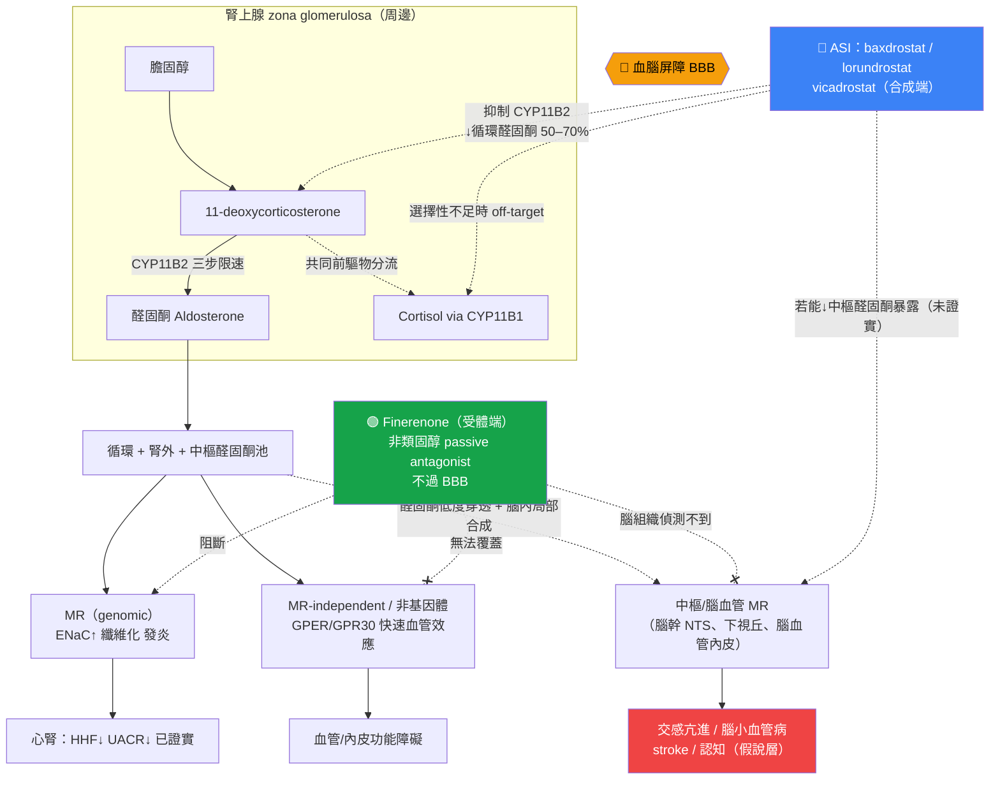

# 醛固酮合成酶抑制劑（ASI）與 Finerenone：同一路徑、不同節點的兩種阻斷策略——機轉與結局差異的深度對讀

> **給讀者的定位說明**：本文預設讀者已熟悉 FIDELIO-DKD、FIGARO-DKD、FIDELITY 與 FINEARTS-HF 的試驗名稱與 finerenone 的基本心腎益處，因此背景僅作精煉、聚焦於藥理對比；主體（約七成篇幅）放在 finerenone 次分析與 ASI 新證據的深度對讀，特別是**腦血管／stroke 結局**這一機轉思辨。
>
> **證據分層標記**：本文於各處標明論斷的證據層級——
> 🟢 已是 guideline routine／phase 3 hard outcome；🟡 evidence expansion（次分析、surrogate-based、phase 2/3 以 BP 或 UACR 為終點）；🔴 hypothesis／機轉外推，尚無 head-to-head 驗證。
> 引用標記：📄 = 本地全文可追溯；📌 = 僅 abstract（不對其做具體數字斷言）。每個事實句末以 `[本地MD檔名]` 供 grep 稽核。

---

## 1. 核心問題與背景（精煉）

ASI（baxdrostat、lorundrostat、vicadrostat/BI 690517、dexfadrostat 等）與 finerenone 都在 renin–angiotensin–aldosterone system（RAAS）的「醛固酮臂」下手，但**作用節點根本不同**：ASI 在**合成端**抑制 CYP11B2、從源頭降低循環（含腎外／中樞）醛固酮；finerenone 在**受體端**以非類固醇、passive antagonist 的方式阻斷 mineralocorticoid receptor（MR）[finerenone_bbb_cns_Agarwal_2021]。

這個節點差異衍生出三個彼此關聯、且在臨床上尚未被 head-to-head 試驗釐清的問題：

1. **配體 vs 受體**：ASI 降低 ligand（可同時觸及 genomic 與 MR-independent／非基因體效應），finerenone 只阻斷 MR（無法覆蓋 MR-independent 的醛固酮效應，例如 GPER/GPR30 介導的快速血管作用）[mra_vs_asi_mechanism_Umanath_2026][r2_Gros_2011]。
2. **中樞可及性**：finerenone **不過血腦屏障（BBB）**——放射標定 finerenone 在大鼠口服後於腦組織中偵測不到[finerenone_bbb_cns_Agarwal_2021]；理論上對中樞 MR 無作用。ASI 降低全身醛固酮，理論上可能連帶降低中樞／腦血管的醛固酮暴露。
3. **結局層級落差**：finerenone 已有 phase 3 hard cardiorenal outcome（🟢）；ASI 目前多以 **BP 或 UACR 等 surrogate** 為終點（🟡），尚缺 finerenone 等級的 hard outcome。

因此本文的中心思辨是：**機轉覆蓋面更廣的 ASI，會不會轉譯成與 finerenone 不同（甚至更好）的臨床結局，尤其是 stroke／認知這類「腦」的終點？** 答案目前只能是「假說」，而檢視 finerenone 試驗中誠實的 stroke 訊號，會讓這個假說更值得認真對待。

### 1.1 醛固酮路徑與兩個可下手的節點（精煉版）

醛固酮由腎上腺 zona glomerulosa 的 **CYP11B2（aldosterone synthase）** 催化，從 11-deoxycorticosterone 經 corticosterone、18-OH-corticosterone 三個限速步驟合成；其近親 **CYP11B1（11β-hydroxylase）** 負責 cortisol 合成，兩者**編碼區約 95%、蛋白產物約 93% 同源**——這是 ASI 選擇性設計的核心難題[mra_vs_asi_mechanism_Umanath_2026][asi_pharmacology_Bogman_2017]。

醛固酮活化 MR 後，除經典的 genomic 效應（ENaC/Na⁺-K⁺-ATPase → 鈉重吸收、血壓上升）外，還經 serum- and glucocorticoid-inducible kinase-1 放大 ENaC，並在心、血管、腎、腦、免疫細胞等 MR 表現部位驅動發炎與纖維化[mra_vs_asi_mechanism_Kobayashi_2025]。此外，醛固酮尚有**非基因體／MR-independent** 的快速血管效應：Gros 等以 GPR30（GPER）基因剔除與過表現證明，醛固酮可經 GPR30-依賴途徑活化 ERK 與血管平滑肌收縮，此效應對「經典 MR 拮抗劑」不敏感[r2_Gros_2011]。**關鍵推論**：只有降低 ligand（ASI）能同時觸及 GPER 這類 MR-independent 效應；受體端阻斷（finerenone）在定義上無法覆蓋[asi_pharmacology_Shimizu_2024][mra_vs_asi_mechanism_Umanath_2026]。

> **路徑圖見 §5（Mermaid），標出 ASI（合成端）與 finerenone（受體端）阻斷位置與 BBB 界線。**

---

## 2. 分子／藥理層對比

### 2.1 ASI：合成端抑制 + 選擇性挑戰

各 ASI 對 CYP11B2 相對 CYP11B1 的**體外選擇性**（🟡 preclinical / phase 1，數字為 in vitro）：

| 藥物 | CYP11B2:CYP11B1 選擇性 | 依據 |
|---|---|---|
| Lorundrostat | **374 倍**（Ki 1.27 vs 475 nmol/L） | [asi_pharmacology_Shimizu_2024] |
| Vicadrostat（BI 690517） | **250 倍** | [asi_pharmacology_Judge_2025] |
| Baxdrostat（CIN-107/RO6836191） | **>100 倍** | [asi_pharmacology_Capriello_2026] |
| RO6836191（早期同系物） | 人類 100 倍（Ki 13 vs 1310 nmol/L）／猴 800 倍（Ki 4 vs 3150 nmol/L） | [asi_pharmacology_Bogman_2017] |

**選擇性為何攸關**：第一代 ASI **LCI699（osilodrostat）** 選擇性不足，在有效劑量範圍內即抑制 cortisol，導致 11-deoxycorticosterone 累積、ACTH 刺激後 cortisol 反應受損，最終退出高血壓開發、轉向 Cushing 病[asi_pharmacology_Bogman_2017][asi_pharmacology_Freeman_2023_HypertensRes_MAD]。新一代 ASI 在此點上已明顯改善：Rasmussen 系統性回顧結論為——**只有 LCI699 顯著抑制 cortisol 生成，baxdrostat、lorundrostat、vicadrostat、dexfadrostat 皆無**[asi_pharmacology_Rasmussen_2025]。

**藥效學證據（🟡 phase 1）**：
- Baxdrostat：半衰期約 26–31 h（支持每日一次），劑量 ≥1.5 mg 產生劑量依賴性醛固酮下降，第 10 天血漿醛固酮降約 **51–73%**，對 cortisol 無實質影響（即使 ACTH 挑戰下）[asi_pharmacology_Freeman_2023_HypertensRes_MAD]。
- Lorundrostat：t½ 約 10–12 h；單劑 100–200 mg 降醛固酮達 **40%**，400–800 mg 達 **70%**；無基礎或 cosyntropin 刺激 cortisol 抑制[asi_pharmacology_Shimizu_2024]。
- 系統性回顧綜論：ASI 使血漿醛固酮下降 **50–70%**，與 MRA「反而升高循環醛固酮」形成鮮明對比[asi_pharmacology_Rasmussen_2025]。

**兩個未解的機轉隱憂（🔴，詳見 §4.3）**：(a) **aldosterone breakthrough／renin 代償上升**——ASI 降醛固酮後，RAAS 可能以 PRA 上升回饋；BaxHTN 已觀察到 aldosterone 下降伴隨 PRA 上升，但這仍是探索性訊號，不等於已證實療效會衰退[asi_pharmacology_Flack_2025]；(b) **CYP11B1 off-target／前驅物累積**——CYP11B2 與 CYP11B1 高度同源，理論上可能導致 cortisol-axis 影響，或使共同前驅物 11-deoxycorticosterone（本身具鹽皮質活性）累積而抵銷降 aldosterone 的淨效益；新一代高選擇性 ASI 目前主要在超治療暴露或選擇性不足時才看見明顯前驅物問題[asi_pharmacology_Bogman_2017][asi_pharmacology_Judge_2025]。

### 2.2 Finerenone：受體端、非類固醇、低 CNS 穿透

finerenone 的 receptor pharmacology 與組織分布特徵，正是其與 steroidal MRA 及 ASI 區分的關鍵：

- **結合模式**：分子模擬顯示 finerenone 為 bulky、passive antagonist，並可作為 **inverse agonist**——即使無醛固酮亦能降低 cofactor recruitment；spironolactone/eplerenone 則呈部分促效[finerenone_bbb_cns_Agarwal_2021]。
- **選擇性與效價**：對 MR 較 eplerenone、spironolactone 更具選擇性，效價至少與 spironolactone 相當[finerenone_bbb_cns_Agarwal_2021]。
- **組織分布均衡**：¹⁴C-finerenone 在大鼠呈**心–腎均衡分布**，而 spironolactone/eplerenone 偏積於腎；此差異可能解釋 finerenone 對鈉鉀平衡影響較小[finerenone_bbb_cns_Agarwal_2021]。
- **不過 BBB（本文核心）**：放射標定 finerenone 口服後**腦組織偵測不到**；finerenone 較 steroidal MRA 極性更高、親脂性低 6–10 倍[finerenone_bbb_cns_Agarwal_2021]。相對地，spironolactone/eplerenone 可進入腦——動物模型中 ICV spironolactone 能阻斷中樞 MR 介導的鈉誘發高血壓[finerenone_bbb_cns_Huang_2008]。
- **藥動**：腎排除極少、半衰期短（腎衰竭者 2–3 h）、無活性代謝物；與 spironolactone 具長效活性代謝物（canrenone 等，停藥後可持續數週）成對比[finerenone_bbb_cns_Agarwal_2021]。

**藥理對讀的核心**：finerenone 以「受體選擇性 + 組織均衡分布 + 不過 BBB」見長；但正因不過 BBB，理論上**對中樞 MR 無作用**。ASI 若能降低中樞醛固酮暴露，機轉覆蓋面理論上更廣——但這需先確認「系統性 ASI 是否真能改變腦內醛固酮」，目前仍是未證實環節（見 §4.1）。

---

## 3. 生理／中間終點層對照

| 中間終點 | ASI（合成端） | Finerenone（受體端） |
|---|---|---|
| **循環醛固酮** | 下降 50–70%[asi_pharmacology_Rasmussen_2025] | 受體阻斷，循環醛固酮**上升**（反饋）[finerenone_bbb_cns_Agarwal_2021] |
| **Renin/PRA** | 代償性上升（BaxHTN 觀察）[asi_pharmacology_Flack_2025] | 因 MR 阻斷而上升[finerenone_bbb_cns_Agarwal_2021] |
| **收縮壓（安慰劑校正）** | baxdrostat −8.7～−9.8 mmHg（BaxHTN）[asi_pharmacology_Flack_2025]；lorundrostat −9.1 mmHg（Launch-HTN）[asi_pharmacology_Saxena_2025] | FIGARO 中 SBP 差僅 −3.5 mmHg（month 4）／−2.6 mmHg（month 24），非降壓藥定位[FIGARO-DKD_NEJMoa2110956] |
| **血鉀** | 升高；BaxHTN K⁺>5.5：2 mg 組 11.1% vs 安慰劑 0.4%[asi_pharmacology_Flack_2025] | FIDELITY 高血鉀相關 TEAE 14.0% vs 6.9%[cerebrovascular_mr_aldosterone_Agarwal_2021] |
| **UACR** | vicadrostat 10 mg 降 ~37–40%（±empagliflozin）[asi_pharmacology_Judge_2025][asi_clinical_outcomes_Cherney_2026] | FIDELITY month 4 UACR 較安慰劑低 32%[cerebrovascular_mr_aldosterone_Agarwal_2021] |
| **eGFR 初期 dip** | BaxHTN 12 週 eGFR −7.0 mL/min/1.73m²（可逆）[asi_pharmacology_Flack_2025]；lorundrostat 12 週降 9.3%（creatinine-based）[asi_pharmacology_Saxena_2025] | 已知初期可逆性 dip，屬血流動力學性 |
| **Cortisol** | 新一代 ASI 無抑制；僅 osilodrostat 有[asi_pharmacology_Rasmussen_2025] | 不涉及合成，無此議題 |

**解讀重點**：兩者在 UACR 這一腎臟 surrogate 上幅度相近（ASI ~40% vs finerenone 32%），但**方向相反的循環醛固酮變化**（ASI 降、finerenone 升）是機轉分歧的指紋。lorundrostat 的 eGFR 下降部分被歸因於 lorundrostat 與 creatinine 競爭 MATE1 轉運（cystatin-C 校正後降幅較小），提示其 creatinine-based eGFR 下降可能被高估[asi_pharmacology_Saxena_2025]。

---

## 4. 臨床結局層：surrogate 的 ASI vs hard-outcome 的 finerenone

### 4.1 ASI 現有 RCT 一覽（🟡 多為 BP／surrogate）

| 試驗 | 藥物 | 期別/n | 主要終點 | 關鍵結果 |
|---|---|---|---|---|
| **BrigHTN** | baxdrostat | ph2, resistant HTN | seated-SBP | 陽性（降 SBP）[asi_pharmacology_Flack_2025] |
| **HALO** | baxdrostat | ph2, uncontrolled HTN | seated-SBP wk8 | **陰性**（未達差異）[asi_pharmacology_Flack_2025] |
| **BaxHTN** | baxdrostat | ph3, n=796 | ΔSBP wk12 | 1 mg −8.7、2 mg **−9.8 mmHg**（vs placebo，P<0.0001）；randomized withdrawal 再證效果[asi_pharmacology_Flack_2025] |
| **Target-HTN** | lorundrostat | ph2, n=200 | ΔSBP wk8 | 50 mg −9.6 mmHg（vs placebo）[asi_pharmacology_Laffin_2023] |
| **Advance-HTN** | lorundrostat | ph2, n=285 | 24h ambulatory BP | 臨床顯著下降[asi_pharmacology_Saxena_2025] |
| **Launch-HTN** | lorundrostat | ph3, n=1083 | office SBP wk6 | pooled 50 mg **−9.1 mmHg**（vs placebo，P<0.001）[asi_pharmacology_Saxena_2025] |
| **vicadrostat 1378-0005** | BI 690517±empa | ph2, n=586 | ΔUACR wk14 | 10 mg 降 UACR ~37–40%[asi_pharmacology_Judge_2025][asi_clinical_outcomes_Cherney_2026] |
| **EASi-KIDNEY** | vicadrostat+empa | ph3, ~11,000 | **cardiorenal hard outcome** | **進行中**，power 可分別評估糖尿病/非糖尿病[asi_pharmacology_Judge_2025] |

網路統合分析（Yusuf 2026，🟡）給出跨藥比較的 SBP 降幅點估計：baxdrostat −8.63 mmHg、lorundrostat −7.47 mmHg、LCI699/osilodrostat −5.63 mmHg（均 vs placebo）[asi_clinical_outcomes_Yusuf_2026]。**關鍵限制**：這些幾乎全是 BP 或 UACR 終點；**EASi-KIDNEY 是第一個能提供 ASI hard cardiorenal outcome 的 phase 3，結果尚未問世**[asi_pharmacology_Judge_2025][mra_vs_asi_mechanism_Umanath_2026]。

### 4.2 Finerenone 的 hard outcome（🟢 已 guideline routine）與 stroke 訊號的誠實檢視

finerenone 的 hard cardiorenal 效益已確立：
- **FIDELITY**（pooled，n=13,026）：主要 CV 複合終點 HR **0.86（0.78–0.95）**，主要腎臟終點 HR **0.77（0.67–0.88）**[cerebrovascular_mr_aldosterone_Agarwal_2021]。
- **FIGARO-DKD**：主要 CV 複合終點 HR **0.87（0.76–0.98）**[asi_pharmacology_Judge_2025]。
- **FIDELIO-DKD**：主要腎臟複合終點降 18%，HR **0.82（0.73–0.93）**[asi_pharmacology_Judge_2025]。

**但 stroke 這一項，finerenone 三份數據一致地「中性」**：

| 試驗 | Nonfatal stroke（finerenone vs placebo） | HR (95% CI) |
|---|---|---|
| **FIGARO-DKD** | 108 (2.9%) vs 111 (3.0%) | **0.97 (0.74–1.26)** [FIGARO-DKD_NEJMoa2110956] |
| **FIDELIO-DKD** | 90 (3.2%) vs 87 (3.1%) | **1.03 (0.76–1.38)** [FIDELIO-DKD_NEJMoa2025845] |

FIDELIO 原文明白寫道：各成分事件在 finerenone 組皆較低，**「唯獨 nonfatal stroke，兩組發生率相近」**[FIDELIO-DKD_NEJMoa2025845]。FIDELITY 次分析亦指出，複合 CV 效益主要由 **HHF（HR 0.78, 0.66–0.92）** 驅動；一旦**侷限於 ASCVD 事件（MI 與 stroke），相對風險下降未達統計顯著**，且明言「nsMRA 是否能修飾 ASCVD 事件風險尚未確立、需進一步研究」[cerebrovascular_mr_aldosterone_Agarwal_2021][cerebrovascular_mr_aldosterone_Agarwal_2023]。

**這正是本主題最重要的一句話**：finerenone 在 T2D-CKD 族群**沒有展現 stroke 益處**——這與「finerenone 不過 BBB、對中樞/腦血管 MR 無直接作用」的藥理特徵在方向上一致（🔴 為機轉外推，非因果證明）[finerenone_bbb_cns_Agarwal_2021]。它同時提醒我們：finerenone 的 hard-outcome 招牌，主要建立在 HHF 與腎臟終點，而非腦血管。

### 4.3 ASI 的兩個未解機轉隱憂：降 ligand 之後，系統會不會反撲？（🔴）

ASI 的核心吸引力是「從合成端降低 aldosterone ligand」。這使 ASI 理論上比 finerenone 更上游：不只降低 MR 的 ligand 供應，也可能降低 MR-independent／非基因體醛固酮效應。但這個優勢成立有一個前提：**steroidogenesis–RAAS 系統不能用其他路徑把鹽皮質活性補回來**。目前最需要追蹤的兩個反向機轉，是 **aldosterone breakthrough／renin 代償上升**與 **CYP11B1 off-target／11-deoxycorticosterone（11-DOC）前驅物累積**。

#### (a) Aldosterone breakthrough／renin 代償上升：不是「ASI 已失效」，而是「長期 ligand-lowering 能否維持」的問題

ASI 抑制 CYP11B2 後，aldosterone 下降，遠端腎小管鈉重吸收降低，natriuresis 增加；有效循環量與 macula densa / juxtaglomerular feedback 會促使 renin、PRA 上升。BaxHTN 的探索性藥效資料即觀察到 **aldosterone 下降伴隨 PRA 上升**；作者推測，這可能代表 baxdrostat 在已有利尿劑背景下仍能進一步促進尿鈉排泄，也提示 hard-to-control BP 族群中仍存在 residual aldosterone activity / breakthrough[asi_pharmacology_Flack_2025]。

這裡要避免過度解讀：**PRA 上升本身不是壞事，也不等於 aldosterone 已經回升；它是下游鹽皮質訊號被壓低後的預期回饋。**真正未解的是慢性治療時，高 renin / angiotensin II、血鉀、ACTH 與 zona glomerulosa 適應性變化，會不會逐漸把 CYP11B2 活性或 aldosterone 生成推回來，造成「降 aldosterone 幅度變小、BP/UACR 效果衰退、或需要更高劑量」。因此 ASI 的短期 BP/UACR 成功，仍不能直接外推為長期 hard outcome 成功；必須在長期試驗中同時看 aldosterone、PRA、鉀、鈉、eGFR dip 與療效是否隨時間衰減。

#### (b) CYP11B1 off-target／11-DOC 前驅物累積：不是「所有 ASI 都會 cortisol failure」，而是「選擇性窗口夠不夠寬」的問題

CYP11B2 與 CYP11B1 高度同源，且 aldosterone 與 cortisol 合成都使用相鄰的 steroidogenic 前驅物。理想 ASI 應只抑制 CYP11B2，使 11-DOC 往 aldosterone 的轉換下降，而不抑制 CYP11B1 的 cortisol 合成。若選擇性不足，會出現兩層風險：第一，**CYP11B1 off-target** 造成 11-deoxycortisol 累積、cortisol 生成受損與 ACTH stimulation response 變鈍；這正是早期 ASI / osilodrostat 在高血壓開發中失利、轉向 Cushing syndrome 的主要教訓[asi_pharmacology_Bogman_2017][asi_pharmacology_Judge_2025]。第二，即使 CYP11B1 沒有明顯被抑制，單純堵住 CYP11B2 也可能使共同前驅物 **11-DOC 上升**；而 11-DOC 本身具鹽皮質活性，理論上可部分補回 sodium-retaining / potassium-wasting 效應，抵銷「降 aldosterone ligand」的淨效益[asi_pharmacology_Bogman_2017][asi_pharmacology_Judge_2025]。

目前證據應寫得精準：**新一代高選擇性 ASI 在治療劑量下，cortisol 抑制與 11-DOC 顯著累積尚未成為主要臨床訊號；明顯前驅物累積多見於超治療暴露或選擇性不足時。**Bogman 的 RO6836191 早期人體資料顯示，10 mg 已可達最大 aldosterone 抑制，但 11-DOC 與 11-deoxycortisol 的增加主要在 ≥90 mg 才出現；vicadrostat 亦強調 250-fold CYP11B2:CYP11B1 選擇性，phase II CKD 試驗未見平均 cortisol 有意義下降，但 EASi-KIDNEY 仍把 corticosteroid pathway、cortisol 與其前驅物監測列為安全性重點[asi_pharmacology_Bogman_2017][asi_pharmacology_Judge_2025]。

#### 對讀 finerenone：ASI 的優勢與弱點剛好同源

finerenone 的弱點是受體端阻斷：它不能降低 circulating aldosterone，也無法覆蓋 MR-independent ligand effect；但它也不會直接造成 steroidogenesis 前驅物分流或 CYP11B1 off-target。ASI 的弱點剛好相反：它的機轉覆蓋面可能更廣，但必須證明「降 ligand」能長期維持，且不被 PRA 代償、aldosterone breakthrough、11-DOC 前驅物累積或 cortisol-axis 安全性問題抵銷。

因此，ASI vs finerenone 的真正未知，不是單純「誰降 BP / UACR 比較多」，而是：**合成端阻斷的廣覆蓋機轉，能否在長期 hard outcome 中保留淨效益，而不是被內分泌回饋與前驅物分流吃掉。**這也是為何 EASi-KIDNEY 這類大型 hard-outcome 試驗，必須同時看 cardiorenal outcome 與 steroidogenesis safety，而不能只看短期 UACR 或 BP[asi_pharmacology_Judge_2025]。

---

## 5. 路徑與阻斷位置示意圖

*圖說*：ASI 於合成端下手，降低整個醛固酮池（周邊+腎外+潛在中樞），理論上同時覆蓋 genomic、MR-independent 與（若能穿透相關屏障）中樞效應；finerenone 於受體端阻斷 genomic MR、心腎益處明確，但無法覆蓋 MR-independent 效應，且不過 BBB → 對中樞 MR 無直接作用。紅色 stroke/認知路徑目前皆為假說層。[finerenone_bbb_cns_Agarwal_2021][r2_Gros_2011][asi_pharmacology_Rasmussen_2025][finerenone_bbb_cns_Huang_2008]

---

## 6. 潛在爭議與對讀（討論核心）

### 6.1 「機轉更廣」是否轉譯成腦血管結局差異？——正反面都要誠實看

**支持 ASI 可能額外覆蓋腦血管的間接證據（🟡～🔴）**：

1. **腦內確有 aldosterone-MR 軸**：MR 表現於海馬、杏仁核、前額葉、腦幹 NTS、下視丘與腦血管內皮；腦內醛固酮濃度雖低但與血清濃度成正比，且可能有局部合成[finerenone_bbb_cns_Nieckarz_2024][finerenone_bbb_cns_Paul_2022]。11β-HSD2 在腦幹 NTS 等處使該區 MR「aldosterone-selective」[finerenone_bbb_cns_Paul_2022]。
2. **中樞 ASI 可阻斷鈉誘發高血壓**：Wistar 大鼠 ICV 注入 aldosterone synthase inhibitor（FAD286）可預防 CSF 鈉升高所致的下視丘醛固酮增加、交感亢進與高血壓[finerenone_bbb_cns_Huang_2008]。此為「降低中樞醛固酮合成 → 改善血壓/交感」的直接概念驗證（動物層）。
3. **醛固酮的腦血管損傷**：醛固酮經內皮 MR 增加 superoxide 與 chemokine，導致腦組織氧化壓力/發炎；並可能經 MR 刺激損傷 glycocalyx，這些變化可獨立於血壓造成腦血管病、stroke 或認知下降[finerenone_bbb_cns_Nieckarz_2024]。
4. **來自原發性醛固酮增多症（PA）的「自然實驗」最具啟發性**：
   - PA 相較 essential hypertension（EH）**stroke 風險逾兩倍**[cerebrovascular_mr_aldosterone_Qian_2022]。
   - **關鍵對讀**：Qian 統合分析顯示，PA 以**手術腎上腺切除（源頭移除）** 者 stroke 風險較**藥物 MRA 治療者顯著降低（OR 0.57, 0.35–0.93）**，且與 EH 無異；而**藥物 MRA 治療的 PA 仍較 EH 高（OR 1.88, 1.68–2.11）**[cerebrovascular_mr_aldosterone_Qian_2022]。
   - **失智同向**：Hong 全國世代研究中，PA 之 **MRA 組** 相較 EH 全因失智 adjusted HR **1.31**、血管型失智 HR **1.62**（皆顯著）；**腺瘤切除組**則無顯著增加[cerebrovascular_mr_aldosterone_Hong_2023]。

**這組 PA 證據的推論力**：在 PA 中，「受體端阻斷（MRA）」未能把 stroke/失智風險拉回到 EH 水準，而「源頭消除醛固酮（手術）」可以。若把此類比延伸——**ASI 從合成端降低 ligand，機轉上更接近「源頭處理」**——則 ASI 理論上可能在腦血管終點上優於單純受體阻斷（🔴 這是類比外推，PA 手術 ≠ 系統性 ASI，不能等同）[cerebrovascular_mr_aldosterone_Qian_2022][cerebrovascular_mr_aldosterone_Hong_2023]。這也與 §4.2 中 finerenone stroke 中性、且不過 BBB 的觀察相互呼應。

**反面：不能過度樂觀的三個理由**

- **(a) finerenone 的 stroke 中性未必單純源於 BBB**：FIDELIO/FIGARO 族群為 T2D-CKD，stroke 事件數不多、且非主要終點；「無顯著益處」也可能是 power 或族群問題，而非「中樞 MR 無關」的證明[FIDELIO-DKD_NEJMoa2025845][cerebrovascular_mr_aldosterone_Agarwal_2023]。
- **(b) ASI 的理論優勢可能被自身弱點抵銷**：aldosterone breakthrough（renin/PRA 代償上升）[asi_pharmacology_Flack_2025]、以及 CYP11B1 off-target 造成的 11-deoxycorticosterone（具鹽皮質活性）與 11-deoxycortisol 累積（雖新一代 ASI 僅在超治療劑量才明顯）[asi_pharmacology_Bogman_2017][asi_pharmacology_Judge_2025]，都可能削弱「降 ligand」的淨效益。
- **(c) 系統性 ASI 是否真能改變腦內醛固酮，未經證實**：現有中樞證據來自 **ICV 直接注入**（Huang）[finerenone_bbb_cns_Huang_2008]，而非口服系統性 ASI；口服 ASI 能否有意義地降低中樞醛固酮池，是整條假說鏈中最未驗證的一環。腦 MR 大多為「CORT-preferring」，僅少數區域為 aldosterone-selective[finerenone_bbb_cns_Paul_2022]，這進一步限制了「降醛固酮 → 改善腦 MR 效應」的普適性。

### 6.2 Head-to-head 缺席下的證據紀律

目前**沒有任何 ASI vs finerenone 的頭對頭試驗**；ASI 幾乎全以 BP/surrogate 為終點，finerenone 才有 hard outcome[mra_vs_asi_mechanism_Umanath_2026][asi_pharmacology_Rasmussen_2025]。因此任何「ASI 會/不會與 finerenone 結局一致」的陳述都應標為 **hypothesis（🔴）**。多篇 review 對 ASI 定位方向一致——皆指向 ASI 用於**填補 RAAS 阻斷後的殘餘風險 / 克服既有 RAAS 治療的限制**[mra_vs_asi_mechanism_Umanath_2026][mra_vs_asi_mechanism_Patel_2025]，其中 Umanath 等（2026）以 FIDELIO-DKD 為例具體量化此殘餘風險：即便用了 finerenone，仍有 17.8% 達主要終點、13.0% 有持續 CV 風險[mra_vs_asi_mechanism_Umanath_2026]，而 ASI 與 SGLT2i 併用（EASi-KIDNEY 設計，以 empagliflozin 抵消部分高血鉀風險）是驗證其 hard outcome 的關鍵路徑[asi_pharmacology_Judge_2025][mra_vs_asi_mechanism_Patel_2025]。

### 6.3 安全性對讀（皆為 evidence expansion 層）

兩類藥都以**高血鉀**為共同軟肋：BaxHTN 中 K⁺>5.5 在 baxdrostat 2 mg 達 11.1%（vs 安慰劑 0.4%），需臨床介入之高血鉀達 7.9%[asi_pharmacology_Flack_2025]；FIDELITY 中 finerenone 高血鉀相關 TEAE 14.0%、因高血鉀永久停藥 1.7%[cerebrovascular_mr_aldosterone_Agarwal_2021]。差異在於：finerenone 因心–腎均衡分布與非類固醇結構，血鉀升幅與 steroidal MRA 相比較溫和[finerenone_bbb_cns_Agarwal_2021]；ASI 則需監測早期（多在頭兩週）出現的血鉀/血鈉變化與可逆 eGFR dip[asi_pharmacology_Flack_2025]。ASI 相較 spironolactone 的優勢是**避免抗雄性素副作用（男性女乳症、月經異常）**[asi_pharmacology_Capriello_2026]。

---

## 7. Take-home messages

1. **同路徑、不同節點**：ASI 與 finerenone 並非「同類的新舊版」，而是作用於醛固酮路徑**不同節點**的兩種策略——ASI 降 ligand（合成端），finerenone 阻斷 MR（受體端）[mra_vs_asi_mechanism_Umanath_2026][finerenone_bbb_cns_Agarwal_2021]。
2. **機轉覆蓋面：ASI 理論上更廣**：ASI 可同時觸及 genomic、MR-independent（GPER）與（若能穿透）中樞/腦血管效應；finerenone 因受體選擇性、心–腎均衡分布且**不過 BBB** 而見長，但無法覆蓋 MR-independent 與中樞 MR[r2_Gros_2011][finerenone_bbb_cns_Agarwal_2021]。
3. **「機轉更廣 ≠ 結局更好」**：finerenone 有 phase 3 hard cardiorenal outcome（🟢），但其效益主要來自 **HHF 與腎臟終點；stroke 在 FIDELIO/FIGARO 皆中性**（HR 0.97、1.03）[FIGARO-DKD_NEJMoa2110956][FIDELIO-DKD_NEJMoa2025845]。ASI 目前只有 **BP/UACR surrogate（🟡）**，尚缺同級 hard outcome。
4. **腦血管假說值得認真但不可當結論**：PA 的自然實驗提示「源頭處理（手術）」在 stroke/失智上優於「受體阻斷（MRA）」[cerebrovascular_mr_aldosterone_Qian_2022][cerebrovascular_mr_aldosterone_Hong_2023]，與 finerenone stroke 中性方向一致；但口服 ASI 能否改變中樞醛固酮、以及 breakthrough/CYP11B1 off-target 是否抵銷優勢，均未驗證（🔴）。
5. **臨床上先分清兩個問題**：短期內把 ASI 視為**降壓工具**（resistant/uncontrolled HTN，surrogate 證據），把 finerenone 視為 T2D-CKD 的**器官保護**（hard outcome、guideline routine）；兩者結局是否一致，**待 EASi-KIDNEY 等 phase 3 hard-outcome 試驗驗證**[asi_pharmacology_Judge_2025][mra_vs_asi_mechanism_Umanath_2026]。

---

## References（Vancouver）

1. Flack JM, Azizi M, Brown JM, Dwyer JP, Fronczek J, Jones ESW, et al. Efficacy and Safety of Baxdrostat in Uncontrolled and Resistant Hypertension (BaxHTN). N Engl J Med. 2025;393(14):1363-1374. doi:10.1056/NEJMoa2507109. 📄 [asi_pharmacology_Flack_2025]
2. Saxena M, Laffin L, Borghi C, Fernandez Fernandez B, Ghali JK, Kopjar B, et al. Lorundrostat in Participants With Uncontrolled Hypertension and Treatment-Resistant Hypertension: The Launch-HTN Randomized Clinical Trial. JAMA. 2025;334(5):409-418. doi:10.1001/jama.2025.9413. 📄 [asi_pharmacology_Saxena_2025]
3. Laffin LJ, Rodman D, Luther JM, Vaidya A, Weir MR, Rajicic N, et al. Aldosterone Synthase Inhibition With Lorundrostat for Uncontrolled Hypertension: The Target-HTN Randomized Clinical Trial. JAMA. 2023;330(12):1140-1150. doi:10.1001/jama.2023.16029. 📄 [asi_pharmacology_Laffin_2023]
4. Bogman K, Schwab D, Delporte ML, Palermo G, Amrein K, Mohr S, et al. Preclinical and Early Clinical Profile of a Highly Selective and Potent Oral Inhibitor of Aldosterone Synthase (CYP11B2). Hypertension. 2017;69(1):189-196. doi:10.1161/HYPERTENSIONAHA.116.07716. 📄 [asi_pharmacology_Bogman_2017]
5. Freeman MW, Bond M, Murphy B, Hui J, Isaacsohn J. Results from a phase 1 multiple ascending dose study characterizing the pharmacokinetics and demonstrating the safety and selectivity of the aldosterone synthase inhibitor baxdrostat in healthy volunteers. Hypertens Res. 2023;46(1):108-118. doi:10.1038/s41440-022-01070-4. 📄 [asi_pharmacology_Freeman_2023_HypertensRes_MAD]
6. Shimizu H, Tortorici MA, Ohta Y, Ogawa K, Rahman SMA, Fujii A, et al. First-in-human study evaluating safety, pharmacokinetics, and pharmacodynamics of lorundrostat, a novel and highly selective aldosterone synthase inhibitor. Clin Transl Sci. 2024;17(8):e70000. doi:10.1111/cts.70000. 📄 [asi_pharmacology_Shimizu_2024]
7. Schulze F, Schaible J, Goettel M, Tanaka Y, Hohl K, Schultz A, et al. Phase 1 studies of the safety, tolerability, pharmacokinetics, and pharmacodynamics of BI 690517 (vicadrostat) in healthy male volunteers. Naunyn Schmiedebergs Arch Pharmacol. 2025. doi:10.1007/s00210-025-03838-0. 📄 [asi_pharmacology_Schulze_2025]
8. Judge PK, Tuttle KR, Staplin N, Hauske SJ, Zhu D, Sardell R, et al. The potential for improving cardio-renal outcomes in chronic kidney disease with the aldosterone synthase inhibitor vicadrostat (BI 690517): a rationale for the EASi-KIDNEY trial. Nephrol Dial Transplant. 2025;40(6):1175-1186. doi:10.1093/ndt/gfae263. 📄 [asi_pharmacology_Judge_2025]
9. Rasmussen AA, Nordestgaard KL, Simonsen U, Buus NH. Blood Pressure–Lowering Effects of Aldosterone Synthase Inhibitors—A Systematic Review. Basic Clin Pharmacol Toxicol. 2025;137:e70080. doi:10.1111/bcpt.70080. 📄 [asi_pharmacology_Rasmussen_2025]
10. Cicero AFG, Tocci G, Avagimyan A, Penson P, Nardoianni G, Perone F, et al. Aldosterone Synthase Inhibitors for Resistant Hypertension: Pharmacological Insights – A Systematic Review. Drugs. 2025. doi:10.1007/s40265-025-02229-2. 📄 [asi_pharmacology_Cicero_2025]
11. Capriello I, Dömling A. Baxdrostat: A First-in-Class Aldosterone Synthase Inhibitor for Resistant Hypertension. ACS Pharmacol Transl Sci. 2026. doi:10.1021/acsptsci.6c00102. 📄 [asi_pharmacology_Capriello_2026]
12. Cherney DZI, Rossing P, Canziani ME, Caramori ML, Correa-Rotter R, Cronin L, et al. Effects of Vicadrostat/Empagliflozin in People With Chronic Kidney Disease: Metabolic Subgroup Analyses. Diabetes Obes Metab. 2026;28:e70836. doi:10.1111/dom.70836. 📄 [asi_clinical_outcomes_Cherney_2026]
13. Yusuf IA, Badero OJ, Ihesiulo A, Okwah MN, Oshodin A, Asikong E. Aldosterone synthase inhibitors in uncontrolled and resistant hypertension: A phenotype-stratified systematic review and network meta-analysis of randomized trials. PLoS One. 2026. doi:10.1371/journal.pone.0349932. 📄 [asi_clinical_outcomes_Yusuf_2026]
14. Umanath K, Dwyer JP, Mentz RJ. Residual risk in cardiovascular and renal diseases and the potential role of aldosterone synthase inhibitors. Front Cardiovasc Med. 2026;13:1845339. doi:10.3389/fcvm.2026.1845339. 📄 [mra_vs_asi_mechanism_Umanath_2026]
15. Kobayashi M, Pitt B, Ferreira JP, Rossignol P, Girerd N, Zannad F. Aldosterone-targeted therapies: early implementation in resistant hypertension and chronic kidney disease. Eur Heart J. 2025;46:2618-2642. doi:10.1093/eurheartj/ehaf225. 📄 [mra_vs_asi_mechanism_Kobayashi_2025]
16. Patel SK, Teoh H, Saunthar A, Yau TM, Verma S. The Emerging Role of Aldosterone Synthase Inhibitors in Overcoming Renin-Angiotensin-Aldosterone System Therapy Limitations: A Narrative Review. Card Fail Rev. 2025;11:e20. doi:10.15420/cfr.2025.09. 📄 [mra_vs_asi_mechanism_Patel_2025]
17. Agarwal R, Kolkhof P, Bakris G, Bauersachs J, Haller H, Wada T, et al. Steroidal and non-steroidal mineralocorticoid receptor antagonists in cardiorenal medicine. Eur Heart J. 2021;42(2):152-161. doi:10.1093/eurheartj/ehaa736. 📄 [finerenone_bbb_cns_Agarwal_2021]
18. Bakris GL, Agarwal R, Anker SD, Pitt B, Ruilope LM, Rossing P, et al. Effect of Finerenone on Chronic Kidney Disease Outcomes in Type 2 Diabetes (FIDELIO-DKD). N Engl J Med. 2020;383(23):2219-2229. doi:10.1056/NEJMoa2025845. 📄 [FIDELIO-DKD_NEJMoa2025845]
19. Pitt B, Filippatos G, Agarwal R, Anker SD, Bakris GL, Rossing P, et al. Cardiovascular Events with Finerenone in Kidney Disease and Type 2 Diabetes (FIGARO-DKD). N Engl J Med. 2021;385(24):2252-2263. doi:10.1056/NEJMoa2110956. 📄 [FIGARO-DKD_NEJMoa2110956]
20. Agarwal R, Filippatos G, Pitt B, Anker SD, Rossing P, Joseph A, et al. Cardiovascular and kidney outcomes with finerenone in patients with type 2 diabetes and chronic kidney disease: the FIDELITY pooled analysis. Eur Heart J. 2022;43(6):474-484. doi:10.1093/eurheartj/ehab777. 📄 [cerebrovascular_mr_aldosterone_Agarwal_2021]
21. Agarwal R, Pitt B, Rossing P, Anker SD, Filippatos G, Ruilope LM, et al. Modifiability of Composite Cardiovascular Risk Associated With Chronic Kidney Disease in Type 2 Diabetes With Finerenone (FIDELITY subanalysis). JAMA Cardiol. 2023;8(8):732-741. doi:10.1001/jamacardio.2023.1505. 📄 [cerebrovascular_mr_aldosterone_Agarwal_2023]
22. Bakris GL, Agarwal R, Chan JC, Cooper ME, Gansevoort RT, Haller H, et al. Effect of Finerenone on Albuminuria in Patients With Diabetic Nephropathy: A Randomized Clinical Trial (ARTS-DN). JAMA. 2015;314(9):884-894. doi:10.1001/jama.2015.10081. 📄 [r2_Bakris_2015]
23. Gros R, Ding Q, Sklar LA, Prossnitz EE, Arterburn JB, Chorazyczewski J, et al. GPR30 Expression Is Required for the Mineralocorticoid Receptor-Independent Rapid Vascular Effects of Aldosterone. Hypertension. 2011;57(3):442-451. doi:10.1161/HYPERTENSIONAHA.110.161653. 📄 [r2_Gros_2011]
24. Huang BS, White RA, Ahmad M, Jeng AY, Leenen FH. Central infusion of aldosterone synthase inhibitor prevents sympathetic hyperactivity and hypertension by central Na+ in Wistar rats. Am J Physiol Regul Integr Comp Physiol. 2008;295(1):R166-R172. doi:10.1152/ajpregu.90352.2008. 📄 [finerenone_bbb_cns_Huang_2008]
25. Nieckarz A, Graff B, Burnier M, Marcinkowska AB, Narkiewicz K. Aldosterone in the brain and cognition: knowns and unknowns. Front Endocrinol. 2024;15:1456211. doi:10.3389/fendo.2024.1456211. 📄 [finerenone_bbb_cns_Nieckarz_2024]
26. Paul SN, Wingenfeld K, Otte C, Meijer OC. Brain mineralocorticoid receptor in health and disease: From molecular signalling to cognitive and emotional function. Br J Pharmacol. 2022;179(13):3205-3219. doi:10.1111/bph.15835. 📄 [finerenone_bbb_cns_Paul_2022]
27. Qian N, Xu J, Wang Y. Stroke Risks in Primary Aldosteronism with Different Treatments: A Systematic Review and Meta-Analysis. J Cardiovasc Dev Dis. 2022;9(9):300. doi:10.3390/jcdd9090300. 📄 [cerebrovascular_mr_aldosterone_Qian_2022]
28. Hong N, Kim KJ, Yu MH, Jeong SH, Lee S, Lim JS, et al. Risk of dementia in primary aldosteronism compared with essential hypertension: a nationwide cohort study. Alzheimers Res Ther. 2023;15:151. doi:10.1186/s13195-023-01274-x. 📄 [cerebrovascular_mr_aldosterone_Hong_2023]
29. Chen ZW, Hung CS, Wu VC, Lin YH. Primary Aldosteronism and Cerebrovascular Diseases. Endocrinol Metab. 2018;33(4):429-434. doi:10.3803/EnM.2018.33.4.429. 📄 [cerebrovascular_mr_aldosterone_Chen_2018]
30. Vibhatavata P, Turcu AF. Emerging Medical Therapies for Primary Aldosteronism. Hypertension. 2026. doi:10.1161/HYPERTENSIONAHA.126.26229. 📌 [mra_vs_asi_mechanism_Vibhatavata_2026]
31. Geraci G, Sinatra N, Paternò V, Calabrese V, Cassataro G, Cuttone G, et al. Finerenone in Cardiorenal Disease: A Narrative Review of Molecular Mechanisms, Clinical Evidence, and Emerging Therapeutic Roles. Cardiovasc Drugs Ther. 2026. doi:10.1007/s10557-026-07890-7. 📌 [finerenone_bbb_cns_Geraci_2026]

---

*本文所有事實性數字均可經句末 `[本地MD檔名]` 於 07_aldosterone_synthase_inhibitor_vs_finerenone/原始PDF/ 目錄下對應 MD 檔 grep 回溯。LLM 僅執行組織與改寫，未自創任何引用或數值。撰稿日 2026-07-08。*
