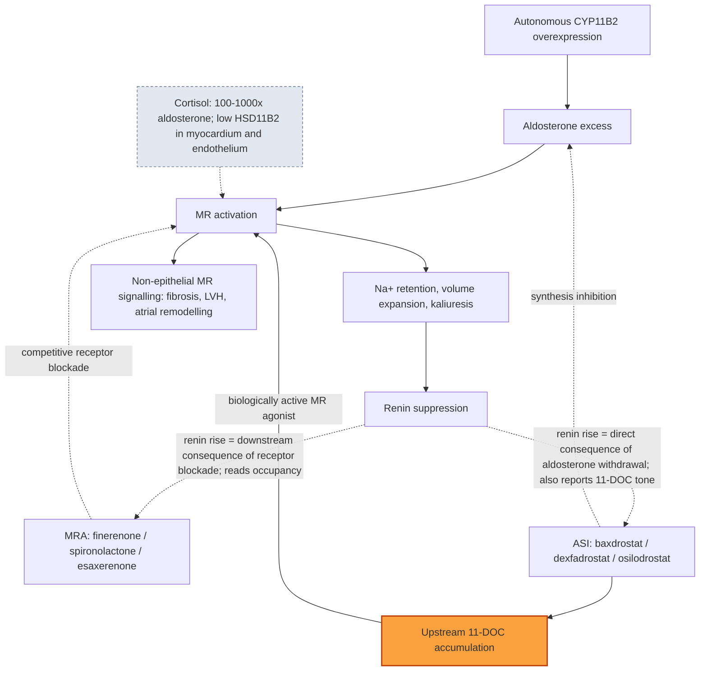
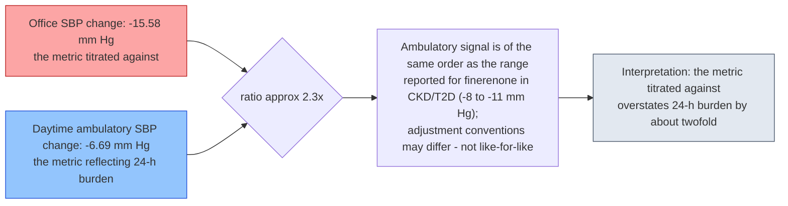

# Titrating Against the Wrong Metric: Blood Pressure, Renin, and the Measurement of Treatment Adequacy in Primary Aldosteronism

**Running head:** Measuring adequacy in primary aldosteronism *(48 characters incl. spaces — AHA limit ≤50)*

**Target journal:** *Hypertension* (American Heart Association), category **Review**.

> **⚠️ PRE-SUBMISSION ACTIONS REQUIRED (delete this block before submission)**
> 1. **Verify the word limit** against the current AHA *Hypertension* Instructions for Authors. The 5,000-word main-text target used here is an assumption, not a confirmed limit. §4, §5 and §10 are written to absorb a trim to ~4,000 or an expansion to ~6,000 without structural change.
> 2. **Presubmission enquiry recommended.** *Hypertension* Reviews are frequently invited. Contact the editorial office before investing in final formatting. Expect A.F. Turcu and/or A. Vaidya as reviewers — they author refs 1, 3, 5 and 22, and this manuscript positions explicitly as an extension of ref 1.
> 3. **Spelling.** This draft is in **US English** with AHA house style (`mm Hg`, `-ize`, `hypokalemia`), matching the locked primary target. If the submission moves to the endocrine fallbacks (*European Journal of Endocrinology*, *Journal of Hypertension*), British spelling is acceptable and no pass is needed.
> 4. **Figures.** Figures 1 and 3 are supplied as Mermaid source. Journals do **not** accept Mermaid — export to vector (SVG/EPS) at ≥1200 dpi equivalent before submission. Figure 2 is supplied as a plotting specification.
> 5. **Fallback ladder, in order:** (1) *Journal of Hypertension* (ESH) — budget ~4,000 words main text, drop §7 into Table 2 alone; (2) *European Journal of Endocrinology*; (3) *Hypertension Research* (JSH) — note Yoshida/Shibata publish the competing reviews there; (4) *Journal of Clinical Endocrinology & Metabolism*.
> 6. **Display items:** 3 figures + 3 tables = 6. Table 3 is the designated first item to move to a Data Supplement if a limit bites.
> 7. **Strip all `<!-- src: -->` comments** — they are the grep-audit trail, not journal content. Delete the Evidence-discipline note likewise.

---

## Title page

**Title:** Titrating Against the Wrong Metric: Blood Pressure, Renin, and the Measurement of Treatment Adequacy in Primary Aldosteronism

**Alternative titles considered (for editor discussion; delete before submission):**
- Half the Biochemistry, the Same Blood Pressure: What PAMO Reveals About Nonsteroidal Mineralocorticoid Receptor Antagonism in Primary Aldosteronism
- Renin Is Not a Common Currency: Why Aldosterone Synthase Inhibitors and Mineralocorticoid Receptor Antagonists Cannot Yet Be Compared Head-to-Head
- Measuring Adequacy, Not Just Pressure: A Specification for the Aldosterone Synthase Inhibitor Versus Mineralocorticoid Receptor Antagonist Trial the Field Keeps Calling For

### Authors

> **[PLACEHOLDER — AUTHOR TO COMPLETE]** The drafting process assigned no authorship. Do not submit this block unedited; do not invent authors or affiliations.

| # | Name | Degrees | ORCID | Affiliation |
|---|---|---|---|---|
| 1 | [PLACEHOLDER — AUTHOR 1 NAME] | [PLACEHOLDER — degrees] | [PLACEHOLDER — 0000-0000-0000-0000] | [PLACEHOLDER — Department, Institution, City, Country] |
| 2 | [PLACEHOLDER — AUTHOR 2 NAME] | [PLACEHOLDER — degrees] | [PLACEHOLDER — ORCID] | [PLACEHOLDER — Affiliation] |
| 3 | [PLACEHOLDER — ADD OR DELETE ROWS AS REQUIRED] | | | |

**Corresponding author:** [PLACEHOLDER — Name, degrees]
[PLACEHOLDER — Department, Institution]
[PLACEHOLDER — Full postal address, City, Postal code, Country]
Tel: [PLACEHOLDER] · Email: [PLACEHOLDER]

**Running head:** Measuring adequacy in primary aldosteronism

**Word count declaration:** Main text (§1–§11): **≈6,924 words**, excluding abstract, references, table content, figure legends, and declarations *(measured 2026-07-17 after the audit-resolution round; re-verify after any edit — and against the journal's own counting convention, which may differ)*. Abstract: **258 words**. References: 31. Figures: 3. Tables: 3.

> **⚠️ THE MAIN TEXT IS OVER THE ASSUMED 5,000-WORD TARGET BY ≈1,920 WORDS AND MUST BE TRIMMED BEFORE SUBMISSION.** The 2026-07-17 audit round added ≈1,500 words of necessary defensive material (§5's Hu-parity counter-argument; §7's rewritten Exhibit 3; §6's spironolactone-arm ratio; §10(i)'s reworked warrant). None of it is padding, but not all of it must live in the main text.
>
> *Trim guidance, in the order we would cut:*
> 1. **Table 3 → Data Supplement** (already designated) and compress §10 to a numbered list without prose justification — the justifications all duplicate §3–§8. **≈400 words.**
> 2. **§7's methodological narration → Table 2's payload paragraph.** The exhibit's finding is a negative one and survives compression; the retraction paragraph can shrink to two sentences. **≈350 words.**
> 3. **§4 → Table 1.** The section is largely prose restatement of the table. Keep only the ASI paragraph and the case-report exclusion. **≈500 words.**
> 4. **§9 items 2, 4, 7 → one sentence each**; they duplicate caveats already stated in §5 and §6 in the journal's own voice. **≈250 words.**
> 5. **§2's priority accounting → 2 paragraphs.** Necessary, but currently generous. **≈200 words.**
>
> *Cutting 1–3 alone reaches ≈5,580; 1–5 reaches ≈5,130. For a 4,000-word limit (e.g. Journal of Hypertension), additionally drop §7 into Table 2 entirely and merge §5 into §4. **Do not trim §5's counter-argument, §6's two-arm ratio, §7's like-for-like correction, or §9 — these are the audit-mandated defensive passages, and removing them reintroduces the errors this round fixed.***

**Subject terms (AHA):** [PLACEHOLDER — select at submission; suggested: Hypertension; Endocrinology; Pharmacology; Clinical Studies]

---

## Structured Abstract

**Background.** Primary aldosteronism (PA) affects at least 10% of individuals with hypertension and 20–25% of those with treatment-resistant hypertension, and confers cardiovascular and renal risk exceeding that predicted by blood pressure (BP) alone.<!-- src: mra_vs_asi_mechanism_Vibhatavata_2026.md --> Adequate mineralocorticoid receptor (MR) blockade — not BP normalization — is the mechanistic objective, and renin de-suppression has become the field's adequacy biomarker.

**Objective.** Rather than asserting again that renin matters, we audit the metrics: how far do they disagree, and does renin mean the same thing under receptor blockade as under synthesis inhibition?

**Findings.** Four exhibits. (1) Scored by the field's own consensus instrument, finerenone in PA achieved complete clinical response in 20.0% and complete biochemical response in 29.1% (N=57), against 18.3% and 52.9% in the international PAMO reference cohort (N=1258) — near-identical clinical response, roughly half the biochemical response.<!-- src: pa_finerenone_hypertension_2026.md, pa_finerenone_pamo_consensus_lancetde_2025.md --> (2) Office systolic BP fell 15.58±1.69 mm Hg versus daytime ambulatory 6.69±1.60 mm Hg: the metric clinicians titrate against reads ≈2.3× the metric reflecting 24-hour burden.<!-- src: pa_finerenone_hypertension_2026.md --> (3) No cross-class BP-versus-renin ranking can presently be built: published BP effects are reported in incommensurable modalities (office, sitting, 24-hour ambulatory), and the apparent ranking inversion this produces does not survive restriction to like-for-like comparison. (4) 11-deoxycorticosterone, a biologically active MR agonist, accumulates upstream of synthase blockade, so renin-matched aldosterone synthase inhibitor and MR antagonist arms are not necessarily MR-activation-matched.

**Conclusions.** These are hypothesis-generating juxtapositions, not a verdict on finerenone. They specify what a fair head-to-head must measure: renin de-suppression co-primary with ambulatory BP, PAMO axes reported separately, measurement modality declared, 11-deoxycorticosterone co-measured, and PA-specific dose-finding completed first.

**Keywords:** primary aldosteronism; finerenone; aldosterone synthase inhibitor; renin; PAMO; 11-deoxycorticosterone; ambulatory blood pressure; treatment adequacy

---

## 1. Introduction: adequacy is a measurement problem

Primary aldosteronism (PA) affects at least 10% of individuals with hypertension and 20–25% of those with treatment-resistant hypertension.<!-- src: mra_vs_asi_mechanism_Vibhatavata_2026.md -->[1] It disproportionately increases cardiovascular and renal morbidity and mortality compared with primary hypertension of similar severity.<!-- src: mra_vs_asi_mechanism_Vibhatavata_2026.md -->[1] That excess is the entire reason PA is worth diagnosing separately: if the risk tracked blood pressure (BP), PA would be a labeling exercise. It does not, and so it is not.

The pathophysiology explains why. Autonomous, renin-independent aldosterone secretion drives chronic mineralocorticoid receptor (MR) over-activation, sodium retention, volume expansion, kaliuresis, suppression of the renin–angiotensin axis, and — through MR signaling in non-epithelial tissue — myocardial and vascular fibrosis, left ventricular hypertrophy, and atrial and renal remodeling.[2] The therapeutic corollary is that BP normalization is necessary but insufficient; the mechanistic objective is adequate, target-organ-relevant MR blockade.

The field has responded with a biomarker. Because renin suppression is the physiological signature of continuing mineralocorticoid excess, a rise in renin is a coherent signal that MR blockade has been titrated to a mineralocorticoid-relevant degree. Hundemer and colleagues built this framework and validated it against hard outcomes.<!-- src: pa_finerenone_hundemer2024_biomarkers.md -->[3] The 2025 Endocrine Society Clinical Practice Guideline operationalizes it in Recommendation 7, advising intensification of PA-specific therapy when hypertension is uncontrolled and renin remains suppressed.<!-- src: pa_finerenone_endosociety_guideline_2025.md -->[2] The international Primary Aldosteronism Medical Treatment Outcome (PAMO) consensus formalized the response categories.[4] There is no shortage of agreement that renin matters.

What is missing is any accounting of how badly the metrics disagree with each other. Clinicians titrate against office BP. Guidelines grade against renin. Consensus criteria grade against a composite of both. These are treated as interchangeable readouts of a single latent quantity called "adequacy." They are not. This review makes that claim precise and then measures it.

Our thesis is one sentence: **the field titrates against the most inflated metric (office BP), grades against a metric not yet established to be comparable across drug classes (renin), and calls the result adequacy.**

We pursue this through four discrete, individually falsifiable exhibits, using finerenone in PA as the worked example because that is where the newest data are — not because finerenone is uniquely deficient. We then self-audit the exhibits (§9) and convert them into a specification for the randomized aldosterone synthase inhibitor (ASI)-versus-MR antagonist (MRA) trial the field keeps calling for (§10). We make no new empirical claim. Every value below is drawn from a published report and carries the epistemic status its source permits.

## 2. What is already established — and what this review adds

Honesty about priority comes first, because the central qualitative observation here is not ours.

**Vibhatavata and Turcu (*Hypertension* 2026;83(5):e26229) established it.**[1] In their own words, currently available nonsteroidal MRA (ns-MRA) data in PA use "doses largely extrapolated from CKD populations" and show "more modest clinical and biochemical control in PA, particularly with respect to reversal of renin suppression, a biomarker associated with cardiovascular risk reduction"; and although "higher and divided doses of finerenone improved blood pressure control in PA," the "renin rise remained incomplete and less pronounced than with ASIs."<!-- src: mra_vs_asi_mechanism_Vibhatavata_2026.md -->[1] They further documented 11-deoxycorticosterone (11-DOC) accumulation as "a class-level limitation of ASIs in PA treatment."<!-- src: mra_vs_asi_mechanism_Vibhatavata_2026.md -->[1] The thesis that BP lowering dissociates from adequate MR blockade, and that milligram equivalence is not potency equivalence, is theirs. We do not claim it.

Credit is owed more widely. Hundemer and colleagues built renin-as-adequacy and validated it against hard outcomes.[3] PAMO operationalized the response categories through a Delphi process among 31 experts.<!-- src: pa_finerenone_pamo_consensus_lancetde_2025.md -->[4] The 2025 guideline codified renin-guided titration.[2] Recent disease overviews recite the same consensus.[5,6] Renin-as-adequacy is 2026 boilerplate, and a manuscript merely restating it would deserve to be called derivative.

**What this review adds is a shift from asserting a metric to auditing the metrics.** Among the reviews we were able to read in full text, each asserts that renin matters; none measures how far the metrics disagree, and none asks whether renin means the same thing in both arms. This is a claim about the literature we checked, not a universal negative: four adjacent 2026 reviews were available to us at abstract level only and could not be checked for overlap (§9, item 8). Four contributions follow.

*(i) The PAMO juxtaposition (§5).* Ref 1 cites the finerenone single-arm study but reports only its BP and renin figures; that review does not report PAMO response categories for the finerenone cohort.<!-- src: mra_vs_asi_mechanism_Vibhatavata_2026.md --> (We do not assert that PAMO is uncited in it: the copy available to us truncates its reference list at 8 of 83, so a body-text search cannot establish absence.<!-- src: mra_vs_asi_mechanism_Vibhatavata_2026.md -->) Placing 29.1%/20.0% beside 52.9%/18.3% renders the dissociation numerical.

*(ii) The office-to-ambulatory inflation factor (§6).* Ref 1 prints both BP pairs side by side and observes that the office declines are larger, drawing no inference.<!-- src: mra_vs_asi_mechanism_Vibhatavata_2026.md --> We compute the ratio and anchor it against finerenone's CKD ambulatory effect, converting a qualitative remark into a falsifiable claim.

*(iii) Renin yield tabulated per class, and the ranking that cannot be built (§7).* Ref 1 asserts qualitatively that the ns-MRA renin rise is "less pronounced than with ASIs."<!-- src: mra_vs_asi_mechanism_Vibhatavata_2026.md --> Tabulating it exposes why no cross-class ranking can currently be defended: the BP column mixes three measurement modalities, and the apparent inversion that mixing produces disappears on like-for-like comparison. The tabulation's value is diagnostic of the literature, not of the drugs.

*(iv) Renin is not class-symmetric (§8).* This argument runs *against* ref 1's own inference rather than restating it, and it uses that review's own data to do so.

This review is therefore an explicit extension of ref 1, not a competitor to it. Table 2 and Table 3 are offered as the tabulations that review did not provide.

## 3. Potency, selectivity, and the eplerenone precedent: why receptor affinity does not license a dose

A tempting argument must be discarded at the outset. It is *not* true that finerenone is under-potent per milligram. Finerenone has "a similar potency to spironolactone, and an MR selectivity 500-fold higher than eplerenone."<!-- src: mra_vs_asi_mechanism_Hundemer_2024.md -->[3] Any reasoning that treats "finerenone 20 mg" as self-evidently weaker than "spironolactone 20 mg" on receptor grounds is simply wrong, and a reviewer who knows that line will say so.

The real argument is different and stronger: **receptor potency does not license a dose.** Eplerenone already proved it. Its in vitro MR affinity is approximately 1/40 that of spironolactone, yet its clinical potency is roughly one-half.<!-- src: pa_finerenone_hundemer2024_biomarkers.md -->[3] That is an approximately 20-fold mismatch between affinity and clinical potency, in the best-characterized MRA pair available. If affinity mispredicts clinical dose by 20-fold there, it cannot license a dose for a newer agent on the strength of a binding assay. The same reasoning error is now being repeated on a drug of similar receptor potency — this time in the reassuring direction.

The clinical data corroborate the mismatch. The only network meta-analysis of PA medical therapy in existence — 5 randomized trials, 392 participants — found eplerenone, esaxerenone, and amiloride all comparable to spironolactone on systolic BP reduction, while eplerenone showed a less pronounced effect on diastolic BP (−4.63 mm Hg; 95% CI −8.87 to −0.40) and on correcting serum potassium (−0.2; 95% CI −0.37 to −0.03; units printed as mg/dL in the source, almost certainly a typographical error).<!-- src: pa_r3_ho_2024_nma.md -->[7] Spironolactone carried a higher risk of gynecomastia than eplerenone (relative risk 4.69; 95% CI 3.58–6.14), with no significant difference in hyperkalemia risk among the three MRAs.<!-- src: pa_r3_ho_2024_nma.md -->[7] Certainty was rated **very low** using the CINeMA framework — not GRADE — with 40% of the included trials at high risk of bias.<!-- src: pa_r3_ho_2024_nma.md -->[7] Note what is absent: that network meta-analysis identified no randomized trial comparing different MRAs on mortality or cardiovascular outcomes (search closed 23 June 2023), and closes on "the lack of evidence regarding the mortality and cardiovascular benefits of different MRAs."<!-- src: pa_r3_ho_2024_nma.md -->[7]

The guideline concedes the principle while leaving the practice undefined. It anticipates that "all MRAs, when titrated to equivalent potencies, are anticipated to have similar efficacy in treating PA," and retains spironolactone first-line explicitly "due to its low cost and widespread availability" rather than proven superiority; most individuals achieve renin normalization at spironolactone 50–100 mg/day.<!-- src: pa_finerenone_endosociety_guideline_2025.md -->[2] "Titrated to equivalent potencies" is doing enormous work in that sentence, and nobody has done it.

Hence this section's load-bearing claim: **PA has no validated dose-finding study for any ns-MRA.** Finerenone's 20–40 mg range was inherited from the FIDELIO-DKD and FIGARO-DKD programs, where it was selected against albuminuria and cardiorenal endpoints in diabetic CKD,<!-- src: mra_vs_asi_mechanism_Umanath_2026.md -->[8,9,10] not derived from a renin-de-suppression target in PA. A dose optimized for albuminuria in CKD has no claim to being the dose that de-suppresses renin in PA. This is not an argument that the dose is too low; it is an argument that nobody knows, because the question has never been asked.

A pharmacokinetic gap compounds this. Finerenone has "no active metabolites; short half-life (2–3 h)",<!-- src: mra_vs_asi_mechanism_Umanath_2026.md -->[10] whereas esaxerenone's elimination half-life is 20–24 hours.<!-- src: mra_vs_asi_mechanism_Vibhatavata_2026.md -->[1] Whether once-daily finerenone sustains nocturnal and 24-hour epithelial MR blockade in a disease of continuous aldosterone drive is unresolved — and is exactly what dose-finding would settle. Notably, the single-arm PA study up-titrated 60% of patients to 40 mg/day **in divided doses**, an implicit acknowledgment of the coverage problem.<!-- src: mra_vs_asi_mechanism_Vibhatavata_2026.md -->[1,11]

## 4. The evidence base, assembled: nonsteroidal MRAs and aldosterone synthase inhibitors in confirmed PA

What has actually been measured in biochemically confirmed PA, and by which metric? Table 1 assembles it. The column that matters most is the last one: the metric on which adequacy was judged.

**Finerenone.** One pilot randomized trial exists. Hu and colleagues randomized 60 patients with PA (30 per arm; 30 finerenone and 29 spironolactone analyzed) over 8 weeks, at mean doses of 21.8 and 23.4 mg/day.<!-- src: pa_finerenone_circulation_rct_2025.md -->[12] Daytime ambulatory systolic BP, the primary endpoint, fell −9.9 ± 13.0 versus −7.8 ± 10.2 mm Hg (difference −2.1 mm Hg, 95% CI −8.2 to 4.0); serum potassium rose less with finerenone (+0.2 ± 0.4 versus +0.5 ± 0.4 mmol/L; difference −0.3, 95% CI −0.5 to −0.1); and adverse events occurred in 6/29 spironolactone patients (20.7%) versus none with finerenone.<!-- src: pa_finerenone_circulation_rct_2025.md -->[12] **No PAMO response percentages were reported.** The confidence intervals span clinically important differences in both directions; this trial cannot be read as demonstrating non-inferiority.

The single-arm multicenter study treated 57 patients for 12 weeks with finerenone 20–40 mg/day (NCT06381323).<!-- src: pa_finerenone_hypertension_2026.md -->[11] Daytime ambulatory systolic BP fell −6.69 ± 1.60 mm Hg against office systolic −15.58 ± 1.69 mm Hg (both P<0.001); normokalemia rose from 61.8% to 94.5%; yet plasma renin activity reached ≥1 ng/mL/h in only 32.7%, with PAMO complete biochemical response 29.1% and complete clinical response 20.0%.<!-- src: pa_finerenone_hypertension_2026.md -->[11] This study is the hinge of §5 and §6.

A real-world forced switch during a national eplerenone shortage in Chile moved patients from eplerenone to finerenone: mean BP and drug burden were unchanged, yet the proportion with normal BP fell (P=0.004) and the proportion with complete biochemical response fell (P=0.008), the latter driven by a fall in direct renin concentration.<!-- src: pa_finerenone_eje_realworld_switch_2025.md -->[13] The primary report is paywalled and yields no absolute values. Ref 1, however, reports the cohort from full text: **25 real-world PA patients switched from eplerenone (median 100 mg/day) to finerenone (median 20 mg/day)**, reducing both response proportions as renin declined to suppressed levels.<!-- src: mra_vs_asi_mechanism_Vibhatavata_2026.md -->[1] That 5:1 dose ratio is the milligram-equivalence problem in a single exhibit, citable to ref 1 rather than to the paywalled primary.

A second independent single-arm prospective cohort exists. Li S and colleagues treated 15 patients with PA, all hypokalemic at baseline; the primary endpoint — normokalemia without potassium supplementation at 4 weeks — was met in 47% (7/15), potassium rose significantly at 2, 4 and 8 weeks, and systolic BP fell significantly at 4 and 8 weeks while diastolic BP did not change.<!-- src: pa_finerenone_LiS2026_DSX.md -->[14] The report is available to us as a structured abstract only; absolute BP values, renin, and PAMO categories are not in it, so this cohort contributes to Table 1's census but to none of the exhibits.

**Case reports are not admitted.** Two single-patient finerenone-in-PA reports exist and they point in opposite directions: one negative, in which renin remained suppressed and the patient proceeded to adrenalectomy,<!-- src: pa_finerenone_karger_case_2024.md -->[15] and one positive, in which renin rose from 4.67 to 35.72 pg/mL with normokalemia sustained over 13 months.<!-- src: pa_finerenone_yu2024.md -->[16] Neither carries weight against the cohort data, and admitting either without the other would misrepresent the base. We therefore exclude N=1 evidence from Table 1 and from every exhibit below.

**Esaxerenone** is the most mature ns-MRA reference in PA. A 12-week single-arm Phase 3 study (N=44) lowered sitting systolic BP −17.7 mm Hg (95% CI −20.6 to −14.7), yet achieved BP <140/90 mm Hg in only 47.7%; plasma renin activity rose just +0.60 ng/mL/h.<!-- src: pa_finerenone_esaxerenone_satoh_2021.md -->[17] It predates PAMO and reported no biochemical response percentages. A randomized comparison against spironolactone (N=65, 6 months) found spironolactone produced a greater early systolic fall and greater rises in both potassium and renin.<!-- src: pa_finerenone_esaxerenone_vs_spl_hypertens_res_rct_2022.md -->[18] Esaxerenone does improve organ-level surrogates — reduced urinary albumin-to-creatinine ratio and NT-proBNP, and improved quality of life (N=25);[19] and improved endothelial function (flow-mediated vasodilation 3.1 ± 2.0% → 5.7 ± 2.2%) with reduced arterial stiffness (brachial-ankle pulse-wave velocity 1605 ± 263 → 1428 ± 241 cm/s; both P<0.01) in idiopathic hyperaldosteronism (N=44).<!-- src: pa_finerenone_esaxerenone_iha_vascular_2025.md -->[20] These are surrogate endpoints in a class comparator, and transfer neither to finerenone nor to hard outcomes.

**ASIs in confirmed PA.** Dexfadrostat phosphate (N=35, 8 weeks) lowered 24-hour ambulatory systolic BP −10.7 mm Hg (95% CI −13.6 to −7.9), cut the aldosterone-to-renin ratio by a relative 92.1%, normalized hypokalemia in 20/22 (90.9%), and increased plasma renin in 24/35 (68.6%) by day 14 with cortisol stable.<!-- src: pa_finerenone_dexfadrostat_pa_phase2_2024.md -->[21] The SPARK Phase 2a open-label study of baxdrostat enrolled 15 patients with confirmed PA (baseline plasma renin activity <1 ng/mL/h in 12/15 [80%]): urinary aldosterone fell 30.3→3.2 µg/day; plasma renin activity became unsuppressed in 7/15 (47%); potassium rose 3.9→4.7 mEq/L.<!-- src: pa_baxdrostat_spark.md -->[22] Ref 1 reports the week-12 BP effect as a pooled mean systolic reduction of ≈25 mm Hg,<!-- src: mra_vs_asi_mechanism_Vibhatavata_2026.md -->[1] and we follow it. The primary report's per-dose breakdown — −29.5, −24.4 and −23.9 mm Hg at 2, 4 and 8 mg — rests on arms of n=2, n=5 and n=7 with ranges of −47 to −12, −31 to −17 and −47 to −8 respectively,<!-- src: pa_baxdrostat_spark.md -->[22] and does not support a dose-response reading. The earliest experience, osilodrostat (LCI699, N=14), lowered plasma aldosterone 68–75% (P<0.0001) but produced only −4.1 mm Hg in 24-hour ambulatory systolic BP (P=0.046), while exposing the first-generation selectivity problem: 11-DOC rose +710% to +1427%, with a compensatory ACTH rise and blunted cortisol response from CYP11B1 cross-inhibition.<!-- src: pa_finerenone_lci699_poc.md -->[23]

**What is not evidence.** FAIRY (NCT06457074), a Phase 4 randomized open-label trial of finerenone versus spironolactone (planned N=306, both started at 20 mg/day, titrated every 4 weeks to office BP <140/90 mm Hg), is recruiting with no results.<!-- src: pa_finerenone_fairy_protocol_nct06457074.md -->[24] A Phase 3 baxdrostat trial in PA (BaxPA) is ongoing.<!-- src: mra_vs_asi_mechanism_Vibhatavata_2026.md -->[1] **Studies of lorundrostat in individuals with PA have not yet been conducted**;<!-- src: mra_vs_asi_mechanism_Vibhatavata_2026.md -->[1] **vicadrostat's development programme is reported only in CKD, heart failure and cardiovascular risk reduction**.<!-- src: mra_vs_asi_mechanism_Umanath_2026.md -->[10] Both are therefore excluded from every cross-class comparison below. The exclusion matters: vicadrostat's CKD Phase II systolic BP differences versus placebo were nonsignificant as monotherapy (20 mg −6.03, 95% CI −12.44 to 0.38; 10 mg −1.81, 95% CI −8.10 to 4.48), reaching significance only in combination with empagliflozin 10 mg (−8.25, 95% CI −13.40 to −3.09; −7.81, 95% CI −13.69 to −1.92).<!-- src: mra_vs_asi_mechanism_Umanath_2026.md -->[10] Class-level enthusiasm for ASIs should not be borrowed from agents never tested in the disease.

## 5. Exhibit 1 — The PAMO discordance: identical clinical response, halved biochemical response

The field built a consensus instrument for exactly this purpose and then did not point it at its own new data. Point it.

**Finerenone in PA, scored by PAMO:** complete clinical response 20.0%, complete biochemical response 29.1% (N=57, 12 weeks, 20–40 mg/day).<!-- src: pa_finerenone_hypertension_2026.md -->[11]

**The PAMO international reference cohort, predominantly steroidal-MRA era:** complete clinical response 18.3% (228/1248), complete biochemical response 52.9% (559/1057), from 1258 patients across 28 centers treated between 2016 and 2021 and assessed at 6–12 months.<!-- src: pa_finerenone_pamo_consensus_lancetde_2025.md -->[4]

Set them side by side (Figure 2). Finerenone reproduces conventional MRA clinical response almost exactly — **20.0% versus 18.3%** — while delivering roughly **half** the biochemical response — **29.1% versus 52.9%**.<!-- src: pa_finerenone_hypertension_2026.md, pa_finerenone_pamo_consensus_lancetde_2025.md -->[4,11] The clinical axis is superimposable. The biochemical axis is halved. This is the dissociation made numerical, and to our knowledge the juxtaposition has not been performed: ref 1 cites the finerenone study but reports only its BP and renin figures, and does not report PAMO response categories for that cohort,<!-- src: mra_vs_asi_mechanism_Vibhatavata_2026.md --> while PAMO itself predates every finerenone-in-PA dataset.[4]

Why should the two axes come apart in exactly this way? PAMO answers its own question. Complete biochemical responders were on **higher** spironolactone doses than non-responders: median 40 mg/day (IQR 25–50) versus 25 mg/day (IQR 20–50); p=0.011.<!-- src: pa_finerenone_pamo_consensus_lancetde_2025.md -->[4] Dose adequacy drives the biochemical axis. It is not reported to drive the clinical one — the clinical predictors PAMO identified were female sex (OR 2.099, 95% CI 1.485–2.968; p<0.001), lower baseline antihypertensive burden (OR 0.687, 95% CI 0.603–0.782; p<0.001), and absence of microalbuminuria or left ventricular hypertrophy (OR 0.584, 95% CI 0.391–0.873; p=0.009), which are patient characteristics rather than dose.<!-- src: pa_finerenone_pamo_consensus_lancetde_2025.md -->[4]

So the axis on which finerenone underperforms is precisely the dose-sensitive axis — and a dose extrapolated from CKD albuminuria trials rather than titrated to a PA target (§3) is exactly what would predict underperformance there and nowhere else. The pattern is coherent. That is what makes it worth a trial rather than a conclusion.

**The strongest objection to this exhibit, stated and answered.** The only randomized comparison in existence found finerenone's renin rise statistically indistinguishable from spironolactone's: upright plasma renin concentration +3.4 versus +5.0 µIU/mL, between-group difference −0.8 (95% CI −6.2 to 2.2), at mean doses of 21.8 and 23.4 mg/day.<!-- src: pa_finerenone_circulation_rct_2025.md -->[12] Ref 1 summarizes the same trial as finerenone having "increased renin to a similar extent to low-dose spironolactone."<!-- src: mra_vs_asi_mechanism_Vibhatavata_2026.md -->[1] If finerenone at 21.8 mg raises renin as much as spironolactone at 23.4 mg, then the 29.1%-versus-52.9% gap is at least as plausibly a story about *dose* as about drug class — and PAMO's own data say so, since its complete biochemical responders were taking a median of 40 mg/day of spironolactone (IQR 25–50), roughly double the finerenone-arm milligrams in the randomized trial.<!-- src: pa_finerenone_pamo_consensus_lancetde_2025.md -->[4] We do not resist this reading; we adopt it. It is the same conclusion §3 reaches from the eplerenone precedent, and it strengthens rather than weakens the case for PA-specific ns-MRA dose-finding. What it forecloses is the *other* reading — that finerenone is intrinsically a weaker mineralocorticoid antagonist — which this review has never made and explicitly disclaims (§3, §11). The pilot trial's confidence interval (−6.2 to 2.2) is also wide enough to accommodate a real difference in either direction, so it settles nothing on its own.

**This juxtaposition is hypothesis-generating and nothing more, and we state its weaknesses here rather than deferring them to §9.** The two datasets come from **different cohorts** (N=57 versus N=1258), **different eras** (2024–2026 versus 2016–2021), different geographies and ethnicities, and **different designs** — **single-arm versus registry**. There was **no randomization** and no adjustment for baseline severity, aldosterone burden, or concomitant therapy. Both reports were available to us as structured abstracts only, so we **cannot verify that the PAMO criteria were operationalized identically** in the two datasets; the threshold definitions reside in paywalled full-text tables.<!-- src: pa_finerenone_pamo_consensus_lancetde_2025.md -->[4,11] Should the two have applied the criteria differently, the 29.1%-versus-52.9% contrast weakens considerably. A 24-percentage-point gap is large enough to survive some of this and small enough to be manufactured by all of it. It is a hypothesis. It deserves a trial, not a guideline change.

## 6. Exhibit 2 — Office blood pressure inflates the effect ≈2.3-fold, and the ambulatory signal looks like CKD

How much does the metric clinicians titrate against exaggerate the metric that reflects 24-hour hemodynamic burden? In the same single-arm study, the two were measured concurrently:<!-- src: pa_finerenone_hypertension_2026.md -->[11]

- Office systolic **−15.58 ± 1.69** versus daytime ambulatory systolic **−6.69 ± 1.60** mm Hg → ratio **≈2.3**
- Office diastolic **−8.61 ± 1.02** versus daytime ambulatory diastolic **−4.55 ± 1.06** mm Hg → ratio **≈1.9**<!-- src: pa_finerenone_hypertension_2026.md -->[11]

Ref 1 prints both pairs side by side and observes only that the office declines are "larger," drawing no inference.<!-- src: mra_vs_asi_mechanism_Vibhatavata_2026.md -->[1] The inference is available and consequential.

**A cautious anchor.** Finerenone's post hoc ambulatory BP effect in the CKD/type 2 diabetes program is reported as approximately −8 to −11 mm Hg, against a modest −2.7 mm Hg office effect in those trials.<!-- src: pa_finerenone_hundemer2024_biomarkers.md -->[3] The PA ambulatory signal of −6.69 mm Hg is of the same order.<!-- src: pa_finerenone_hypertension_2026.md, pa_finerenone_hundemer2024_biomarkers.md -->[3,11] We stop there, and deliberately draw no ranking: the −6.69 figure is an uncontrolled, unadjusted within-group change from a 12-week single-arm study, whereas the source for the CKD range does not state whether it is placebo-corrected or within-group. The two figures may not be adjusted alike, and a claim that the PA effect is *smaller* would depend entirely on that unverified assumption. What survives is weaker but sound: nothing in the PA ambulatory data suggests a hemodynamic effect exceeding what finerenone produces in CKD at CKD-derived doses — which is what ref 1's observation that ns-MRA doses in PA are "largely extrapolated from CKD populations"<!-- src: mra_vs_asi_mechanism_Vibhatavata_2026.md -->[1] would predict. A PA-specific dose-finding study (§3, §10) would settle it; this juxtaposition cannot.

The office-to-ambulatory gap is not a single-study artifact. In the pilot randomized trial, office systolic fell −17.7 mm Hg against daytime ambulatory −9.9 mm Hg in the finerenone arm — a ratio of 1.79, the same directional gap.<!-- src: pa_finerenone_circulation_rct_2025.md -->[12] Two independent finerenone-in-PA datasets; two office-to-ambulatory inflation factors of roughly two.

**And the comparator arm answers the obvious next question.** That same trial measured both modalities in a spironolactone arm: office systolic −17.1 against daytime ambulatory −7.8 mm Hg, a ratio of **2.19** — *larger* than finerenone's 1.79.<!-- src: pa_finerenone_circulation_rct_2025.md -->[12] The only two-arm PA dataset in existence therefore shows office inflation operating in both arms, if anything more strongly in the steroidal one. This is worth stating plainly because it disciplines our own argument: the inflation is a property of the measurement, not a device that flatters one drug. We report both ratios rather than only finerenone's.

**The honest counter-argument, stated plainly.** Regression to the mean and white-coat effects inflate office BP change in essentially *any* antihypertensive study. This inflation is not specific to finerenone, not specific to ns-MRAs, and not evidence of a defect in the drug. We are not claiming that finerenone is uniquely flattered by office measurement. The claim is narrower and harder to dismiss: **office BP is the metric against which dose is titrated and adequacy is judged** — it is FAIRY's titration target<!-- src: pa_finerenone_fairy_protocol_nct06457074.md -->[24] and the guideline's trigger for intensification[2] — and it systematically overstates the quantity we actually care about by roughly a factor of two. A titration rule anchored to an inflated readout will stop escalating too early. That is a design problem, not a pharmacology problem, and it is fixable.

## 7. Exhibit 3 — Renin de-suppression yield per class: the cross-class ranking that cannot be built

Ref 1 asserts that the renin rise with ns-MRAs is "less pronounced than with ASIs."<!-- src: mra_vs_asi_mechanism_Vibhatavata_2026.md -->[1] Tabulating that assertion (Table 2) is instructive, but not in the way we first expected, and this exhibit reports the correction rather than the expectation.

- **Finerenone** (N=57, single-arm): **office** systolic **−15.6** mm Hg; concurrent **daytime ambulatory** systolic **−6.69** mm Hg; renin suppression reversed in **32.7%** — i.e. **67.3% remained renin-suppressed**.<!-- src: pa_finerenone_hypertension_2026.md, mra_vs_asi_mechanism_Vibhatavata_2026.md -->[1,11]
- **Finerenone** (N=30, randomized): **office** systolic **−17.7** mm Hg; concurrent **daytime ambulatory** systolic **−9.9** mm Hg.<!-- src: pa_finerenone_circulation_rct_2025.md -->[12]
- **Esaxerenone** (N=44): **sitting office** systolic **−17.7** mm Hg; BP <140/90 mm Hg in only **48%**; **59% still renin-suppressed** at completion.<!-- src: pa_finerenone_esaxerenone_satoh_2021.md, mra_vs_asi_mechanism_Vibhatavata_2026.md -->[1,17]
- **Baxdrostat, SPARK** (N=15): unsuppressed plasma renin activity (≥1.0 ng/mL/h) in **7/15 (47%)**; urinary aldosterone 30.3→3.2 µg/day.<!-- src: pa_baxdrostat_spark.md -->[22] As reported in ref 1: **seated office** systolic ≈**−25** mm Hg at week 12, aldosterone suppressed **>90%**, aldosterone-to-renin ratio below the PA diagnostic threshold in **93%**, and plasma renin activity risen to ≈**1.8×** baseline — figures that appear in that review and not in the primary report available to us.<!-- src: mra_vs_asi_mechanism_Vibhatavata_2026.md -->[1]
- **Dexfadrostat** (N=35): **24-hour ambulatory** systolic **−10.7** mm Hg; renin increased in **68.6%** by day 14, with **9%** still hypokalemic at completion.<!-- src: pa_finerenone_dexfadrostat_pa_phase2_2024.md, mra_vs_asi_mechanism_Vibhatavata_2026.md -->[1,21]

**The finding is a negative one, and it is the point.** Read carelessly — that is, read down the BP column as though it were one column — this table appears to show a ranking inversion: dexfadrostat's −10.7 is smaller than finerenone's −15.6 and esaxerenone's −17.7, yet dexfadrostat de-suppresses renin in far more patients. That reading is invalid, and it is invalid for precisely the reason this review exists. Dexfadrostat's −10.7 is **24-hour ambulatory**; finerenone's −15.6 and esaxerenone's −17.7 are **office**. §6 established that in this disease office reads roughly twice ambulatory. Comparing them is the error the table's own caveat forbids.

Restrict to like-for-like and the inversion evaporates in both directions:

- **On the ambulatory axis**, dexfadrostat's −10.7 mm Hg is *larger* than finerenone's concurrently measured daytime ambulatory −6.69 mm Hg — and dexfadrostat also de-suppresses renin in more patients (68.6% versus 32.7%). Concordant on both axes.<!-- src: pa_finerenone_dexfadrostat_pa_phase2_2024.md, pa_finerenone_hypertension_2026.md -->[11,21]
- **On the office axis** — the only pair sharing a modality — esaxerenone's sitting −17.7 mm Hg leaves **59%** renin-suppressed against finerenone's **67.3%**.<!-- src: pa_finerenone_esaxerenone_satoh_2021.md, mra_vs_asi_mechanism_Vibhatavata_2026.md -->[1,11,17] Esaxerenone is nominally better on both axes, not better on one and worse on the other. Concordant again. And the comparison collapses altogether once the randomized finerenone cohort is fed in: its office systolic fell **−17.7** mm Hg, numerically identical to esaxerenone's.<!-- src: pa_finerenone_circulation_rct_2025.md -->[12] The BP difference between the two ns-MRAs is an artifact of which finerenone study one happens to pick.

**There is therefore no ranking inversion here.** We set out the invalid reading rather than quietly omitting it, because it is the reading the tabulated literature invites, and because the discipline it requires is the whole point: a review arguing that the field titrates against an inflated metric cannot itself build an exhibit on that inflation. The inflation is seductive precisely because the numbers sit in adjacent rows and look comparable. The defensible claim is narrower and, we think, more useful: **no cross-class BP-versus-renin ranking can presently be constructed in PA at all**, because the published BP effects are reported in at least three non-interchangeable modalities across studies that never overlap in modality *and* class. Every apparent cross-class ordering in this literature is contingent on a modality choice nobody has justified. That is a defect in the evidence base, and it is fixable only by trials that pre-specify modality and report both (§10).

Exhibits 1, 2 and 4 do not depend on this one: each is internally modality-consistent, comparing office with office, ambulatory with ambulatory, or renin with renin within a single cohort.

**Why anyone should care.** Renin is not an academic endpoint; it is outcome-validated. In medically treated PA, persistently suppressed renin carries a major adverse cardiovascular event hazard ratio of **2.83** (95% CI 2.11–3.81), atrial fibrillation **2.55** (1.75–3.71), and mortality **1.79** (1.14–2.80) relative to essential hypertension — whereas renin de-suppression (plasma renin activity ≥1.0 ng/mL/h) returns risk toward the essential-hypertension range (MACE HR **1.09**, 95% CI 0.56–2.10).<!-- src: pa_finerenone_hundemer2024_biomarkers.md -->[3,25] The association replicates across independent cohorts: in a lateralizing PA cohort (N=858), patients whose renin remained suppressed carried a higher risk of the MACE/mortality composite (HR **3.85**, 95% CI 1.04–13.7), with de-suppression (≥0.6 ng/mL/h) protective; and among 318 medically treated patients, those with suppressed renin lost eGFR faster (difference ≈**0.96**, 95% CI 0.72–1.20 mL/min/1.73 m²/year).<!-- src: pa_finerenone_hundemer2024_biomarkers.md -->[3] The guideline's companion systematic review concurs, at explicitly **very low certainty**: "Unsuppressed plasma renin activity was associated with better control of hypokalemia, while suppression was associated with higher risk of mortality, atrial fibrillation, and stroke."<!-- src: pa_finerenone_jcem_endosociety_sr_2025.md -->[26] Real-world performance is correspondingly poor: a Spanish cohort (N=997) reported complete biochemical response in only **48.6%** of MRA-treated patients versus **68.1%** after adrenalectomy (P<0.001), with spironolactone adverse effects in **17.9%**.<!-- src: pa_finerenone_spain_aldo_mra.md -->[27]

**The honest unknown.** It remains **unproven** that escalating an MRA purely to raise renin *after* BP is controlled improves hard outcomes. The renin–outcome association is observational and confounded: patients who de-suppress renin may simply be those who tolerate higher doses. The guideline rates Recommendation 7 as conditional, on very-low-certainty evidence.<!-- src: pa_finerenone_endosociety_guideline_2025.md -->[2] RETAME-PA, the only randomized test of renin-guided titration, is a feasibility study.<!-- src: pa_finerenone_retame_pa_protocol.md -->[28] This review's entire edifice rests on a biomarker whose interventional value is assumed — an argument for measuring it properly in the trials to come, not for abandoning it.

## 8. Exhibit 4 — Renin is not a common currency: 11-deoxycorticosterone and the asymmetry between receptor blockade and synthesis inhibition

Exhibits 1–3 assume renin readings are comparable across arms. They are not. This is the argument that most needs making, because it runs against ref 1's own inference rather than restating it.

**The two arms are not symmetric.** Under an MRA, the renin rise is a *downstream consequence of receptor blockade* and reads MR occupancy relatively directly. Under an ASI, the renin rise is a *direct consequence of withdrawing aldosterone* — the receptor is untouched. These are different causal paths to the same number (Figure 1).

**11-DOC is why this matters.** Ref 1 documents 11-DOC as "a biologically active MR agonist" whose accumulation "represents a class-level limitation of ASIs in PA treatment": sustained elevations during osilodrostat (~2.6 nmol/L) and dexfadrostat (~4.1 nmol/L) reach concentrations approximately **10–15-fold higher than those required for MR activation**, "resulting in more modest blood pressure reduction and incomplete correction of hypokalemia."<!-- src: mra_vs_asi_mechanism_Vibhatavata_2026.md -->[1] Our §4 data corroborate the accumulation: 11-DOC rose **+710% to +1427%** with osilodrostat<!-- src: pa_finerenone_lci699_poc.md -->[23] and, as reported in ref 1, reached a **20-fold** increase at the highest dexfadrostat dose — a magnitude given in that review rather than in the primary report, which records the direction only.<!-- src: mra_vs_asi_mechanism_Vibhatavata_2026.md, pa_finerenone_dexfadrostat_pa_phase2_2024.md -->[1]

Ref 1 then reads baxdrostat's low steady-state 11-DOC (~0.6 nmol/L) together with "robust blood pressure reduction and reversal of renin suppression" as "supportive of negligible MR activation."<!-- src: mra_vs_asi_mechanism_Vibhatavata_2026.md -->[1] **We interrogate that inference using that review's own data.** In SPARK, 11-DOC peaked at approximately **11.5× baseline around week 8** and declined thereafter to roughly half of peak by week 36 — a decline that "coincided with a steady rise in PRA during prolonged enzyme blockade," plasma renin activity itself having risen only to ≈**1.8×** baseline at week 12.<!-- src: mra_vs_asi_mechanism_Vibhatavata_2026.md -->[1,22] Renin climbed *as 11-DOC fell* — not as aldosterone fell, since aldosterone was already suppressed >90% by week 12.<!-- src: mra_vs_asi_mechanism_Vibhatavata_2026.md -->[1] That pattern is consistent with renin reporting **net mineralocorticoid tone** (aldosterone *plus* 11-DOC) rather than aldosterone suppression per se.

The inference as stated is also circular: renin de-suppression is offered as evidence that MR activation is negligible, while renin de-suppression is simultaneously the quantity whose adequacy is at issue. Renin cannot be both the evidence and the thing to be evidenced.

**A corroborating mechanism makes the asymmetry general.** Cortisol is a potent MR agonist with affinity comparable to aldosterone, present at concentrations **100- to 1,000-fold higher** — far exceeding aldosterone levels in most patients with PA — and 11β-hydroxysteroid dehydrogenase type 2 (HSD11B2), which normally limits cortisol access to MR, is expressed at low levels in the myocardium and vascular endothelium.<!-- src: mra_vs_asi_mechanism_Vibhatavata_2026.md -->[1] MR occupancy in non-epithelial tissue is therefore never a pure aldosterone readout, in *either* arm.

**Be scrupulous about what this is.** This is an argument about **interpretability**, not a demonstration that ASI arms are inadequately blocked. We have not measured MR activation. The temporal association between falling 11-DOC and rising renin in SPARK rests on n=15, open-label and uncontrolled, and admits other explanations — progressive volume unloading, or cytoreductive effects on the adrenal raised by ref 1 itself.<!-- src: mra_vs_asi_mechanism_Vibhatavata_2026.md -->[1] The conclusion is conditional and operational, not a verdict on baxdrostat, which performed well on every reported metric.

**The deliverable.** If renin under synthesis inhibition partly reports 11-DOC tone while renin under receptor blockade reports MR occupancy, then **ASI and MRA arms matched on renin are not thereby matched on MR activation** — and a head-to-head trial using renin as its common currency is comparing two different quantities under one name. The remedy is cheap and specific: **BaxPA and FAIRY must pre-specify 11-DOC co-measurement at every renin timepoint, with an interpretive rule for a renin rise occurring in the presence of elevated 11-DOC.** Without it, their primary biochemical endpoints are not class-comparable. This is falsifiable: if 11-DOC is co-measured and proves unrelated to the renin trajectory, this exhibit is wrong, and the field will have lost nothing but an assay.

## 9. Limitations of this reading — stated before a reviewer states them

**1. The flagship is fragile.** Both sources for Exhibit 1 were available to us as structured abstracts only; no open-access route exists.<!-- src: pa_finerenone_hypertension_2026.md, pa_finerenone_pamo_consensus_lancetde_2025.md -->[4,11] We can assert the response percentages, which are printed in the abstracts, but **not** the PAMO threshold definitions, which sit in paywalled tables — so we **cannot verify that the two datasets applied the criteria identically**.<!-- src: pa_finerenone_pamo_consensus_lancetde_2025.md -->[4] If they did not, Exhibit 1 weakens considerably. This is the most consequential limitation here.

**2. The juxtaposition is uncontrolled.** Exhibit 1 compares across cohorts, eras, ethnicities, and designs, without randomization or adjustment. It is hypothesis-generating, never a controlled comparison.

**3. Duration and size.** Every finerenone PA dataset is ≤12 weeks with N≤60.<!-- src: pa_finerenone_circulation_rct_2025.md, pa_finerenone_hypertension_2026.md -->[11,12] Renin de-suppression may be time-dependent: SPARK's plasma renin activity rose progressively out to week 72.<!-- src: mra_vs_asi_mechanism_Vibhatavata_2026.md -->[1] A 12-week snapshot may mislead in either direction.

**4. Office-BP inflation is generic.** Regression to the mean and white-coat effects inflate office change in antihypertensive trials generally; §6's claim is about titration practice, not pharmacology.

**5. ASI evidence quality is weak, and we rely on it.** SPARK is open-label, single-arm, N=15.<!-- src: pa_baxdrostat_spark.md -->[22] It was publicly criticized for not identifying disease subtype: the study "did not include identification of the disease subtype as unilateral… or bilateral," leaving it unclear whether patients had bilateral PA, "which is typically milder and manageable medically."<!-- src: pa_r3_carling_scholl_baxdrostat_letter.md -->[29] *(That letter raises a further point about withdrawals which is truncated by the publisher's paywall in the copy available to us; we assert neither its conclusion nor anything from the authors' reply.)* A formal erratum subsequently corrected Figure 1 of that reply so that two patients' withdrawals appear at approximately week 36 and week 60 rather than week 12 — a **plotting correction revising no efficacy or safety value**, leaving the primary SPARK report untouched, but belonging in an honest appraisal.<!-- src: pa_r3_baxdrostat_spark_erratum.md -->[30]

**6. The framework itself is interventionally unvalidated.** It remains unproven that renin de-suppression pursued after BP control improves hard outcomes; the framework rests on observational data at low certainty,[3,27] and the only network meta-analysis of PA medical therapy identified no randomized trial comparing MRAs on mortality or cardiovascular outcomes (search to June 2023).<!-- src: pa_r3_ho_2024_nma.md -->[7] This review audits the metrics; it does not validate them.

**7. Assay heterogeneity.** Table 2 juxtaposes plasma renin activity and direct renin concentration studies with differing thresholds; it supports no formal between-agent inference.

**8. Adjacent literature held at abstract level — including the closest competitor.** Four further 2026 reviews adjacent to this topic (in *Nature Reviews Endocrinology*, *European Journal of Pharmacology*, *Hypertension*, and *Endocrine*) were available at abstract level only and could not be checked in full text for overlap with Exhibits 1 and 4. **Ref 6 belongs in this list and carries the highest overlap risk of any source here**: its abstract already couples PAMO, post-treatment renin as a response marker, finerenone, esaxerenone and ASIs in PA — this manuscript's exact axis — and we hold it at abstract level only.<!-- src: pa_finerenone_asi_hypertens_res_review_2026.md -->[6] §2's characterization of [5,6] as reciting the consensus is therefore provisional and rests on abstracts. We flag all of this rather than claim a priority we cannot verify; the novelty claim in §2 is scoped to the reviews we read in full.

## 10. What a fair head-to-head must measure: a specification

Everyone agrees the trial is needed. Ref 1 closes by calling for "randomized head-to-head trials… to directly compare the effects of ASIs vs MRAs on blood pressure, biochemical control, and long-term cardiovascular and renal outcomes."<!-- src: mra_vs_asi_mechanism_Vibhatavata_2026.md -->[1] The guideline lists PA-specific hard endpoints as a principal research gap;[2] the network meta-analysis ends by demanding outcome studies;<!-- src: pa_r3_ho_2024_nma.md -->[7] and the one systematic review of the ASI class available to us calls for ASI-versus-MRA head-to-head trials in the same terms.<!-- src: pa_finerenone_ASI_cicero2025_drugs_review.md -->[31] Nobody has specified what the trial must *measure*. That specification is this review's deliverable, given in full in Table 3. Each item traces to an exhibit.

**(i) Renin de-suppression as a co-primary endpoint alongside ambulatory BP — not office BP, and not renin alone** (from §6, §7, §9). We deliberately stop short of making renin *the* primary endpoint, and the reason is stated in §7 and §9 rather than buried: this review grades renin's interventional value as unproven, observational, confounded, and — in the guideline's own hands — very-low-certainty.<!-- src: pa_finerenone_endosociety_guideline_2025.md -->[2] A biomarker we describe that way cannot coherently be nominated as the sole arbiter of a definitive trial. Nor does Exhibit 3 license it: the cross-class ranking argument that would have justified a renin-primary design does not survive (§7). What the exhibits do support is that office BP is the wrong titration target (§6) and that renin and BP measure different things within a single cohort — enough to make renin a **co-primary or pre-specified key secondary**, reported alongside ambulatory BP and never merged with it. The published counter-position — that clinical outcomes remain the most relevant endpoints — is reasonable and, at abstract level, is argued in ref 6;<!-- src: pa_finerenone_asi_hypertens_res_review_2026.md -->[6] item (viii) is where we accommodate it, by putting hard outcomes primary in the long trial.

**(ii) PAMO complete biochemical and complete clinical response reported separately, never merged into a composite** (from §5). The two axes move independently — 20.0% versus 18.3% on one, 29.1% versus 52.9% on the other<!-- src: pa_finerenone_hypertension_2026.md, pa_finerenone_pamo_consensus_lancetde_2025.md -->[4,11] — and a composite would average away the entire signal.

**(iii) Ambulatory BP mandatory; office BP secondary; measurement modality declared for every BP figure reported; and the office:ambulatory ratio pre-specified as a reportable quantity** (from §6, §7). The modality declaration is the non-negotiable part — §7 shows that without it, no cross-class comparison is interpretable at all. The ratio is proposed as a **safeguard rather than a suspicion**: the only two-arm PA dataset in existence already reports it in both arms (finerenone 1.79, spironolactone 2.19), which is the "nuisance" branch of this dichotomy — inflation present in both arms, marginally larger in the comparator.<!-- src: pa_finerenone_circulation_rct_2025.md -->[12] We expect future trials to find the same. Pre-specifying it costs nothing and would detect the one scenario that would matter: a ratio differing materially *between* arms, which would mean one drug is being flattered by the titration metric.

**(iv) 11-DOC co-measured at every renin timepoint in ASI arms, with a pre-specified interpretive rule for a renin rise in the presence of elevated 11-DOC** (from §8). Without this the primary biochemical endpoint is not class-comparable.

**(v) PA-specific ns-MRA dose-finding, titrated to renin, completed *before* the head-to-head** (from §3). Doses inherited from CKD albuminuria trials<!-- src: mra_vs_asi_mechanism_Umanath_2026.md -->[8,9,10] have no claim to PA adequacy; without this step, apparent non-inferiority may merely reflect under-titration of one arm.

**(vi) Both arms titrated to the same composite physiological target, not to matched milligrams** (from §3). The eplerenone precedent — ~1/40 the affinity, ~1/2 the clinical potency<!-- src: pa_finerenone_hundemer2024_biomarkers.md -->[3] — and the 100 mg→20 mg real-world switch<!-- src: mra_vs_asi_mechanism_Vibhatavata_2026.md -->[1] both show that milligrams are not a currency.

**(vii) Disease subtype (unilateral versus bilateral) ascertained and reported** (per the published critique of SPARK<!-- src: pa_r3_carling_scholl_baxdrostat_letter.md -->[29]). Bilateral disease is typically milder; without subtyping, arm imbalance is indistinguishable from drug effect.

**(viii) Duration ≥12 months, with hard endpoints primary** — atrial fibrillation, stroke, heart failure, MACE, CKD progression, mortality. The only network meta-analysis of PA medical therapy identified no randomized trial comparing MRAs on any of them (search to June 2023).<!-- src: pa_r3_ho_2024_nma.md -->[7] This is where the biomarker debate resolves: renin's job in item (i) is to make the short trial interpretable, not to substitute for the long one.

**(ix) Pre-stratification** by potassium status, aldosterone severity, eGFR, and — where feasible — driver genotype. PAMO showed response is phenotype-dependent.<!-- src: pa_finerenone_pamo_consensus_lancetde_2025.md -->[4]

**Assessed against this specification, the ongoing trials fall short.** FAIRY's endpoint architecture is directionally correct — 24-hour ambulatory systolic BP primary, plasma renin concentration secondary — but it starts both arms at milligram-matched 20 mg/day and titrates to an **office** target of <140/90 mm Hg: it titrates against the inflated metric (§6) and matches on the wrong currency (§3).<!-- src: pa_finerenone_fairy_protocol_nct06457074.md -->[24] BaxPA is running and could overtake this analysis entirely.<!-- src: mra_vs_asi_mechanism_Vibhatavata_2026.md -->[1] RETAME-PA is the only trial titrating by renin — its experimental arm's first goal is renin de-suppression, ahead of potassium and BP — but it is a feasibility study using spironolactone, not a cross-class comparison.<!-- src: pa_finerenone_retame_pa_protocol.md -->[28] This is not a criticism of trials designed before these exhibits existed. It is what the *next* one should measure.

## 11. Conclusion

Finerenone lowers blood pressure in primary aldosteronism<!-- src: pa_finerenone_hypertension_2026.md, pa_finerenone_circulation_rct_2025.md -->[11,12] and, in the only randomized comparison, was better tolerated than spironolactone over 8 weeks — a smaller potassium rise (+0.2 ± 0.4 versus +0.5 ± 0.4 mmol/L; difference −0.3, 95% CI −0.5 to −0.1) and no adverse events against 6/29 (20.7%).<!-- src: pa_finerenone_circulation_rct_2025.md -->[12] This review does not dispute that, and does not claim finerenone is a weak MR antagonist; on the contrary, it has similar receptor potency to spironolactone.<!-- src: mra_vs_asi_mechanism_Hundemer_2024.md -->[3]

But adequacy is currently being read off the most inflated metric available, graded against a benchmark on which finerenone achieves roughly half the biochemical response of the steroidal-MRA era at identical clinical response, and compared across drug classes using a biomarker whose meaning is not yet established to be class-symmetric. Three metrics — office BP, renin, and 11-DOC — disagree about the same patients, and the field has been reading whichever one is nearest to hand.

"BP fell but renin stayed suppressed" should prompt reassessment rather than reassurance. And until 11-DOC is co-measured and ns-MRA dose-finding is done in PA rather than inherited from CKD, the head-to-head everyone is calling for cannot be interpreted even if it is run.

---

## Figures

### Figure 1 — Two ways to lower mineralocorticoid receptor activation, and why renin does not read them the same way

> **Export note:** Mermaid source below. Export to SVG/EPS at ≥1200 dpi equivalent before submission. The 11-DOC branch is styled in a contrasting color as the class-level ASI limitation.

**Legend.** Mineralocorticoid receptor (MR) antagonists act downstream of the receptor and leave aldosterone production intact, whereas aldosterone synthase inhibitors (ASIs) act upstream on CYP11B2. The two interventions therefore produce a renin rise through different physiology. Under receptor blockade, renin de-suppression is a downstream consequence of MR occupancy. Under synthesis inhibition, renin de-suppression follows the withdrawal of aldosterone, but 11-deoxycorticosterone (11-DOC) — a biologically active MR agonist — accumulates upstream of the block, reaching approximately 10–15 times the MR-activation threshold with osilodrostat (~2.6 nmol/L) and dexfadrostat (~4.1 nmol/L). Cortisol, present at 100- to 1,000-fold the concentration of aldosterone and inadequately inactivated where 11β-hydroxysteroid dehydrogenase type 2 (HSD11B2) expression is low (myocardium, vascular endothelium), further decouples MR occupancy from aldosterone concentration in both arms. The consequence is that arms matched on renin are not necessarily matched on MR activation. Adapted in part from the mechanistic account of Vibhatavata and Turcu.<!-- src: mra_vs_asi_mechanism_Vibhatavata_2026.md -->[1]

### Figure 2 — The PAMO discordance: identical clinical response, halved biochemical response

> **Production note:** NOT a Mermaid figure. Draw in R/ggplot2 or GraphPad as a two-panel paired bar chart (or slope chart). **Panel A = complete BIOCHEMICAL response; Panel B = complete CLINICAL response.** Each panel plots the PAMO international reference cohort against the finerenone cohort. Values — Panel A: **52.9% (559/1057)** vs **29.1% (N=57)**; Panel B: **18.3% (228/1248)** vs **20.0% (N=57)**.<!-- src: pa_finerenone_pamo_consensus_lancetde_2025.md, pa_finerenone_hypertension_2026.md --> Use a visually neutral palette (NOT green-good/red-bad) — this is a comparison, not a verdict. Add a hatched overlay or prominent in-figure banner reading: **"Non-randomised comparison across cohorts and eras — hypothesis-generating."**

**Legend.** Complete biochemical and complete clinical response, as defined by the Primary Aldosteronism Medical Treatment Outcome (PAMO) international consensus, in the PAMO reference cohort (N=1258; 28 centers; 2016–2021; predominantly steroidal MRA therapy) and in a single-arm multicenter study of finerenone 20–40 mg/day for 12 weeks (N=57). Clinical response is essentially superimposable (18.3% vs 20.0%) whereas complete biochemical response is approximately halved (52.9% vs 29.1%).<!-- src: pa_finerenone_pamo_consensus_lancetde_2025.md, pa_finerenone_hypertension_2026.md -->[4,11] **IMPORTANT: this is not a controlled comparison.** The two cohorts differ in era, geography, design (registry vs single-arm prospective), and duration; there was no randomization and no adjustment; and because both reports were available to us as structured abstracts only, we could not verify that the PAMO criteria were operationalized identically in the two datasets. The juxtaposition is presented as hypothesis-generating.

### Figure 3 — Metric inflation: what we titrate against versus what we measure

> **Production note:** A real paired horizontal bar chart is stronger than the Mermaid fallback and is preferred. Plot, for the finerenone single-arm study: office SBP **−15.58 ± 1.69** vs daytime ambulatory SBP **−6.69 ± 1.60** mm Hg (ratio ≈2.3); office DBP **−8.61 ± 1.02** vs daytime ambulatory DBP **−4.55 ± 1.06** (ratio ≈1.9). Add a shaded reference band marking finerenone's reported post hoc ambulatory BP effect in the CKD/type 2 diabetes program (**−8 to −11 mm Hg**) as a context annotation only — label it "adjustment convention not stated in source; not a like-for-like comparison" and do **not** draw a comparison arrow to it. Add a second row for the pilot RCT (finerenone office SBP **−17.7** vs daytime ambulatory SBP **−9.9**, ratio 1.79) and a third for its spironolactone arm (office **−17.1** vs daytime ambulatory **−7.8**, ratio 2.19) to show the gap is neither a single-study artifact nor specific to finerenone.<!-- src: pa_finerenone_hypertension_2026.md, pa_finerenone_hundemer2024_biomarkers.md, pa_finerenone_circulation_rct_2025.md -->

**Legend.** In a single-arm multicenter study of finerenone 20–40 mg/day in primary aldosteronism (N=57), office systolic blood pressure fell by 15.58 ± 1.69 mm Hg while concurrently measured daytime ambulatory systolic blood pressure fell by 6.69 ± 1.60 mm Hg — a ratio of approximately 2.3.<!-- src: pa_finerenone_hypertension_2026.md -->[11] The ambulatory signal is of the same order as finerenone's reported post hoc ambulatory effect in the chronic kidney disease/type 2 diabetes program (approximately −8 to −11 mm Hg),<!-- src: pa_finerenone_hundemer2024_biomarkers.md -->[3] shown as context only: the PA figure is an uncontrolled within-group change and the source for the CKD range does not state whether that range is placebo-corrected, so the two are not compared here and no ordering between them is asserted. **Honest counter:** regression to the mean and white-coat effects inflate office blood pressure change in antihypertensive studies generally; the point is not that finerenone is uniquely flattered by office measurement — the same trial's spironolactone arm shows a *larger* office:ambulatory ratio (2.19 versus 1.79)<!-- src: pa_finerenone_circulation_rct_2025.md -->[12] — but that office blood pressure is the metric against which dose is titrated and adequacy is judged.

---

## Tables

### Table 1. Nonsteroidal MRA and aldosterone synthase inhibitor studies in confirmed primary aldosteronism

| Study (ref) | Design; N; duration | Agent & dose | BP change (mm Hg) | Potassium | Renin / biochemical | **Metric on which adequacy was judged** | Key limitation |
|---|---|---|---|---|---|---|---|
| Hu 2025, *Circulation*[12] | Pilot RCT vs spironolactone; N=60 (30/29 analyzed)a; 8 wk | Finerenone 20→40 (mean 21.8) vs spironolactone (mean 23.4) mg/d | Daytime SBP −9.9±13.0 vs −7.8±10.2 (diff −2.1, 95% CI −8.2 to 4.0, NS); office SBP −17.7 vs −17.1 | K⁺ +0.2±0.4 vs +0.5±0.4; diff −0.3 mmol/L (95% CI −0.5 to −0.1) | Upright PRC +3.4 vs +5.0 µIU/mL (NS); PAC rose; **no PAMO response reported** | **Ambulatory BP** (primary); tolerability | Small, short, wide CIs; mg-matched, not potency-matched; no biochemical response |
| Li 2026, *Hypertension*[11] | Single-arm multicenter (NCT06381323); N=57; 12 wk | Finerenone 20–40 mg/d (40 mg divided, in 60%) | Daytime SBP −6.69±1.60; office SBP −15.58±1.69 (P<0.001) | K⁺ +0.39±0.05; normokalemia 61.8%→94.5% (P<0.001) | PRA ≥1 ng/mL/h in 32.7%; **PAMO complete biochemical 29.1%, clinical 20.0%** | **Ambulatory BP** (primary); PAMO reported | Single-arm, short; enriched eGFR ≥60; no comparator |
| Uslar 2025, *EJE*[13] / as reported in ref 1 | Real-world forced switch eplerenone→finerenone; **N=25**b | **Eplerenone median 100 → finerenone median 20 mg/d**b | BP unchanged; proportion with normal BP ↓ (P=0.004) | NR | Complete biochemical response ↓ (P=0.008), driven by direct renin re-suppression | **Office BP + biochemical response** | Primary report abstract-only/paywalled; N and doses cited to ref 1 |
| Li S 2026, *Diabetes Metab Syndr*[14] | Single-arm prospective; N=15; 8 wk | Finerenone (dose NR in abstract) | SBP fell significantly at 4W and 8W (P<0.05); DBP unchanged; **absolute values not in abstract** | All hypokalemic at baseline; **primary endpoint: normokalemia without supplementation at 4W = 47% (7/15)**; K⁺ rose at 2/4/8W (all P<0.05); no hyperkalemia | **Not reported** (renin and PAMO absent from the abstract) | **Potassium** (primary) | 📌 Abstract-only; N=15; no comparator; creatinine ↑/eGFR ↓ in PA+CKD, NS |
| Satoh 2021, *Hypertens Res*[17] | Single-arm Phase 3 (esaxerenone); N=44; 12 wk | Esaxerenone 2.5→5 mg/d (93% escalated) | Sitting SBP −17.7 (95% CI −20.6 to −14.7); DBP −9.5 (−11.7 to −7.3); **<140/90 in only 47.7%** | K⁺ 4.01→4.34 mEq/L (wk 2); 1 pt K⁺ ≥6.0 discontinued | PAC +83.9 pg/mL; PRA +0.60 ng/mL/h; **59% still renin-suppressed**c; **predates PAMO** | **Office BP** | Single-arm; class comparator, not finerenone |
| Ishikawa 2022, *Hypertens Res*[18] | RCT esaxerenone vs spironolactone; N=65 analyzed; 6 mo | Esaxerenone 1.25→5 vs spironolactone 25→50(–100) mg/d | Greater early SBP fall with spironolactone | K⁺ rise greater with spironolactone | PRA rise greater with spironolactone; free testosterone ↑ in spironolactone men only | **Office BP + sex hormones** | Compares esaxerenone, not finerenone |
| Mulatero 2024, *eClinicalMedicine*[21] | Dexfadrostat phase 2, parallel-dose; N=35; 8 wk | Dexfadrostat 4/8/12 mg qd | **24-h ambulatory** SBP −10.7 (95% CI −13.6 to −7.9); DBP −5.7 (−7.8 to −3.5) | Hypokalemia normalized in 20/22 (90.9%); **9% still hypokalemic** | ARR −92.1% relative; **renin increased in 68.6% by day 14**; cortisol stable | **Ambulatory BP + ARR + renin** | Small; 8 wk; no MRA comparator; 11-DOC rose to 20× at top dose |
| Turcu 2025, *NEJM* (SPARK)[22] | Baxdrostat phase 2a, open-label single-arm; N=15 (+W72 extension); 12 wk | Baxdrostat 2→4/8 mg qd | **Seated office** SBP ≈−25 pooled (per ref 1); per-dose −29.5 (n=2, range −47 to −12) / −24.4 (n=5, −31 to −17) / −23.9 (n=7, −47 to −8)f | K⁺ 3.9→4.7 mEq/L | Urinary aldosterone 30.3→3.2 µg/d; **PRA ≥1.0 in 7/15 (47%)**g; ARR below diagnostic threshold in 93% (per ref 1) | **Office BP + aldosterone + renin** | N=15, open-label, uncontrolled; **no subtyping**d; per-dose arms n=2–7 |
| Amar 2010, *Hypertension* (LCI699)[23] | Osilodrostat proof-of-concept; N=14 | Osilodrostat 0.5→1.0 mg bid | **24-h ambulatory** SBP −4.1 (P=0.046) | Hypokalemia corrected | Plasma aldosterone −68% to −75% (P<0.0001); **11-DOC +710% to +1427%**; ACTH rose | **Aldosterone (biochemical)** | First-generation selectivity failure; CYP11B1 cross-inhibition |
| FAIRY (NCT06457074)[24] | RCT vs spironolactone, open-label; planned N=306; 12 wk | Both 20 mg/d, titrate q4wk **to office BP <140/90** | Primary: 24-h ABPM SBP (pending) | Secondary endpoint | Secondary: plasma renin concentration | **Ambulatory BP primary; titrated on office BP** | Recruiting; no results; mg-matched start; surrogate endpoints |

*a **Discrepancy flagged, not propagated.** Vibhatavata and Turcu describe this randomized trial as enrolling **70** patients;<!-- src: mra_vs_asi_mechanism_Vibhatavata_2026.md --> the primary report and the PubMed record give **N=60** (30 and 29 analyzed).<!-- src: pa_finerenone_circulation_rct_2025.md --> We follow the primary report.*
*b N and dose medians are cited to ref 1 (verified full text), not to the paywalled primary report, which yields only the two P values.<!-- src: mra_vs_asi_mechanism_Vibhatavata_2026.md, pa_finerenone_eje_realworld_switch_2025.md -->*
*c The 59% renin-suppressed figure for this cohort is reported in ref 1.<!-- src: mra_vs_asi_mechanism_Vibhatavata_2026.md -->*
*d See §9 and ref 30.*
*e **Excluded from this table: lorundrostat**, for which "studies… in individuals with PA have not yet been conducted";<!-- src: mra_vs_asi_mechanism_Vibhatavata_2026.md -->[1] **and vicadrostat**, whose development programme is reported only in CKD, heart failure and cardiovascular risk reduction.<!-- src: mra_vs_asi_mechanism_Umanath_2026.md -->[10] The two exclusions rest on different grounds and are not asserted on a common source: no source available to us states that vicadrostat has not been studied in PA, and absence of a PA programme in a source is not a source asserting its absence.*
*f The pooled ≈−25 mm Hg is as reported in ref 1, which does not print the per-dose breakdown.<!-- src: mra_vs_asi_mechanism_Vibhatavata_2026.md --> The per-dose figures and their ranges are from the primary report.<!-- src: pa_baxdrostat_spark.md --> Per-dose arms of n=2–7 do not support a dose-response reading and are given for completeness only.*
*g Denominator caution: 47% is 7/15, but only **12/15 (80%) had suppressed PRA at baseline**.<!-- src: pa_baxdrostat_spark.md --> Up to 3 of the 7 unsuppressed at week 12 may never have been suppressed, so the treatment-attributable de-suppression rate lies between 4/12 (33%) and 7/12 (58%). No complement of 47% is asserted anywhere in this manuscript.*

*ABPM, ambulatory BP monitoring; ARR, aldosterone-to-renin ratio; CI, confidence interval; NR, not reported; NS, non-significant; PAC, plasma aldosterone concentration; PAMO, Primary Aldosteronism Medical Treatment Outcome; PRA, plasma renin activity; PRC, plasma renin concentration.*

### Table 2. Renin de-suppression yield per class, alongside blood pressure effect

| Agent | Class | N; design; duration | BP effect (office vs ambulatory — **not merged**) | Renin outcome, as reported | Still renin-suppressed | Source |
|---|---|---|---|---|---|---|
| **Finerenone** | ns-MRA | 57; single-arm; 12 wk | **Office** SBP −15.6 · **daytime ambulatory** SBP −6.69 (same cohort, concurrent) | PRA ≥1 ng/mL/h in **32.7%** | **67.3%** | [1,11] |
| **Finerenone** | ns-MRA | 30; randomized vs spironolactone; 8 wk | **Office** SBP −17.7 · **daytime ambulatory** SBP −9.9 (same cohort, concurrent) | Upright PRC +3.4 µIU/mL; between-group difference vs spironolactone −0.8 (95% CI −6.2 to 2.2), NS | NR | [12] |
| **Esaxerenone** | ns-MRA | 44; single-arm; 12 wk | **Sitting office** SBP −17.7; BP <140/90 in only **48%** | PRA +0.60 ng/mL/h; renin suppression reversed in a minority | **59%** | [1,17] |
| **Baxdrostat (SPARK)** | ASI | 15; open-label single-arm; 12 wk (+W72) | **Seated office** SBP ≈−25 mm Hg at wk 12 (per ref 1) | PRA ≈**1.8×** baseline; PRA ≥1.0 ng/mL/h in **7/15 (47%)**†; ARR below diagnostic threshold in **93%**; aldosterone suppressed **>90%** | Not derivable† | [1,22] |
| **Dexfadrostat** | ASI | 35; parallel-dose; 8 wk | **24-h ambulatory** SBP −10.7 mm Hg | Renin **increased in 68.6%** by day 14; ARR −92.1% | NR (9% still hypokalemic) | [1,21] |
| **Osilodrostat (LCI699)** | ASI (1st gen) | 14; proof-of-concept | **24-h ambulatory** SBP −4.1 mm Hg (P=0.046) | Plasma aldosterone −68% to −75% | NR | [23] |

*† **No "still renin-suppressed" figure is derivable for baxdrostat, and none is given.** The obvious complement of 47% would take N=15 as its denominator, but only **12/15 (80%) had suppressed plasma renin activity at baseline**.<!-- src: pa_baxdrostat_spark.md -->[22] Up to 3 of the 7 patients unsuppressed at week 12 may therefore never have been suppressed, and the treatment-attributable de-suppression rate lies between 4/12 (33%) and 7/12 (58%) — not a single number. The cell is left empty rather than filled with a derived artifact, which matters because this is the exact column on which any cross-class renin comparison would depend.*

**Payload (the reason this table exists).** Read down the BP column as if it were one column and this table appears to show a BP-versus-renin ranking inversion. **It does not, and that apparent inversion is the table's actual finding.** The BP column mixes office, sitting office, seated office and 24-hour ambulatory measurements — modalities §6 shows differ by roughly twofold in this disease. Restricted to like-for-like: on the ambulatory axis dexfadrostat (−10.7) exceeds finerenone (−6.69) on BP *and* de-suppresses renin in more patients (68.6% vs 32.7%) — concordant; on the office axis esaxerenone (−17.7) leaves fewer patients renin-suppressed than finerenone (59% vs 67.3%) — concordant, and the BP difference vanishes entirely against the randomized finerenone cohort's office −17.7. **The tabulation demonstrates that no cross-class BP-versus-renin ranking can presently be built in primary aldosteronism, because no two studies share both a modality and a class contrast.** That is a fact about the evidence base, not about the drugs.

***Mandatory caveat.*** *These are separate single-arm or small studies with different populations, durations, renin assays (plasma renin activity vs direct renin concentration) and de-suppression thresholds; the table is a **descriptive juxtaposition and supports no between-agent inference**. BP values derive from different measurement modalities (office, seated office, 24-h ambulatory) as labeled, and must not be compared across rows as if commensurable — which is itself this review's point. "Renin increased in 68.6%" (dexfadrostat) and "PRA ≥1.0 ng/mL/h in 47%" (baxdrostat) are **not the same endpoint**: the former is any rise, the latter a threshold crossing.*

### Table 3. Specification for an interpretable ASI-versus-MRA head-to-head trial in primary aldosteronism

> *Designated first display item to move to the Data Supplement if display limits bite.*

| Design element | Current practice | **Specification** | Exhibit requiring it | Status in FAIRY (NCT06457074) | Status in BaxPA |
|---|---|---|---|---|---|
| **Primary endpoint** | Office or ambulatory BP | **Renin de-suppression co-primary with ambulatory BP** in the short trial; **hard outcomes primary** in the ≥12-month trial. Renin is *not* nominated as sole primary — its interventional value is unproven and very-low-certainty (§7, §9) | §6 / §9 | ◐ 24-h ABPM SBP primary; renin secondary, not co-primary | Unknown |
| **PAMO reporting** | Merged or absent | **Biochemical and clinical response reported separately** | §5 | ✗ Not specified | Unknown |
| **BP measurement** | Office-titrated; modality often unstated | **Ambulatory mandatory; office secondary; measurement modality declared for every BP figure; office:ambulatory ratio pre-specified as reportable in *both* arms (safeguard, not suspicion)** | §6 / §7 | ◐ ABPM primary, but **titrated to office <140/90** | Unknown |
| **11-DOC** | Not measured | **Co-measured at every renin timepoint in ASI arms, with a pre-specified interpretive rule for renin rise with elevated 11-DOC** | §8 | n/a (no ASI arm) | ✗ Not known to be specified |
| **ns-MRA dose** | Inherited from CKD albuminuria trials | **PA-specific dose-finding titrated to renin, completed BEFORE the head-to-head** | §3 | ✗ 20 mg/d start, from the CKD program | n/a |
| **Titration rule** | Matched milligrams | **Same composite physiological target in both arms** | §3 | ✗ mg-matched 20 mg vs 20 mg | Unknown |
| **Subtyping** | Not reported | **Unilateral vs bilateral ascertained and reported** | §9 / ref 30 | Unknown | Unknown |
| **Duration & endpoints** | 8–12 wk surrogates | **≥12 months with AF, stroke, HF, MACE, CKD progression, mortality as primary** | §9 / ref 7 | ✗ 12 wk, surrogate | Unknown |
| **Stratification** | None | **Potassium status, aldosterone severity, eGFR, driver genotype where feasible** | §5 / §9 | Unknown | Unknown |

*✗ = does not meet specification; ◐ = partially meets; n/a = not applicable. FAIRY entries derive from the registered protocol.<!-- src: pa_finerenone_fairy_protocol_nct06457074.md -->[24] BaxPA entries are marked "Unknown" because only the trial's existence and phase are established in the sources available to us.<!-- src: mra_vs_asi_mechanism_Vibhatavata_2026.md -->[1] This table reorganizes verified numbers into a testable protocol; it makes no empirical claim of its own.*

---

## Nonstandard Abbreviations and Acronyms

*(AHA requirement)*

| Abbreviation | Expansion |
|---|---|
| ABPM | ambulatory blood pressure monitoring |
| ARR | aldosterone-to-renin ratio |
| ASI | aldosterone synthase inhibitor |
| 11-DOC | 11-deoxycorticosterone |
| CINeMA | Confidence in Network Meta-Analysis |
| HSD11B2 | 11β-hydroxysteroid dehydrogenase type 2 |
| MACE | major adverse cardiovascular events |
| MR | mineralocorticoid receptor |
| MRA | mineralocorticoid receptor antagonist |
| ns-MRA | nonsteroidal mineralocorticoid receptor antagonist |
| PA | primary aldosteronism |
| PAC | plasma aldosterone concentration |
| PAMO | Primary Aldosteronism Medical Treatment Outcome |
| PRA | plasma renin activity |
| PRC | plasma renin concentration |

---

## Declarations

> **⚠️ EVERY FIELD BELOW IS A PLACEHOLDER. The drafting process assigned no authorship, received no funding, and cannot declare anyone's interests. Do not submit this block unedited.**

### Acknowledgements
[PLACEHOLDER — AUTHOR TO COMPLETE. Name any individuals who contributed but do not meet authorship criteria, and confirm each has given written permission to be named.]

### Sources of Funding
[PLACEHOLDER — AUTHOR TO COMPLETE. Either: "The authors received no specific funding for this work." OR list all grant numbers and funding bodies.]

### Disclosures / Conflict of Interest

> **CRITICAL AND NON-OPTIONAL.** This manuscript adjudicates between the products of **Bayer** (finerenone), **Daiichi-Sankyo** (esaxerenone), **AstraZeneca/CinCor** (baxdrostat), **Damian Pharma** (dexfadrostat), and **Recordati** (osilodrostat). A thin or absent disclosure on a paper of this kind is a credibility problem independent of the science. Each author must **individually declare or explicitly negate**, for **each** company named above: honoraria; advisory board membership; speakers' bureau participation; research funding (institutional or personal); travel support; consultancy; and stock or equity holdings.

[PLACEHOLDER — AUTHOR 1: per-company declaration or explicit negation]
[PLACEHOLDER — AUTHOR 2: per-company declaration or explicit negation]
[PLACEHOLDER — ADD ROWS AS REQUIRED]

*Stated for context, and not a disclosure of ours: the corresponding author of ref 1 discloses having served as an advisor for AstraZeneca and as local principal investigator for an AstraZeneca-sponsored clinical trial.<!-- src: mra_vs_asi_mechanism_Vibhatavata_2026.md --> We note this because §2 and §8 engage that review's inferences directly, and readers are entitled to weigh both parties' interests. It is recorded without any implication that those inferences are influenced by it.*

### Data Availability
No new data were generated. All data discussed are from the cited published reports. No original datasets, analytic code, or statistical re-analyses underlie this review; all figures re-present values reported in the primary sources cited in their legends.

### AI-Use Disclosure
[PLACEHOLDER — AUTHOR TO CONFIRM ACCURACY AND CHECK AGAINST THE TARGET JOURNAL'S CURRENT POLICY. AHA, ICMJE and Elsevier policies differ in both wording and required placement.]

Suggested text: "Portions of the literature synthesis and drafting were supported by a large language model under author supervision. All cited numeric values, citations, and identifiers were verified by the authors against the primary sources. The authors take full responsibility for the content of this manuscript."

### Author Contributions (CRediT)
[PLACEHOLDER — AUTHOR TO COMPLETE using the CRediT taxonomy: Conceptualization; Methodology; Investigation; Data curation; Writing – original draft; Writing – review & editing; Visualization; Supervision; Project administration; Funding acquisition.]

---

## References

*Vancouver style, numbered in order of first citation. AHA requires superscript numerals — apply at typesetting.*

1. Vibhatavata P, Turcu AF. Emerging Medical Therapies for Primary Aldosteronism. *Hypertension*. 2026;83(5):e26229. doi:10.1161/HYPERTENSIONAHA.126.26229. PMID: 41685462; PMCID: PMC13001030.

2. Adler GK, Stowasser M, Correa RR, Khan N, Kline G, McGowan MJ, Mulatero P, Murad MH, Touyz RM, Vaidya A, Williams TA, Yang J, Young WF, Zennaro MC, Brito JP. Primary Aldosteronism: An Endocrine Society Clinical Practice Guideline. *J Clin Endocrinol Metab*. 2025;110(9):2453–2495. doi:10.1210/clinem/dgaf284. PMID: 40658480. (Correction: PMID 40880123; doi:10.1210/clinem/dgaf472.)

3. Hundemer GL, Leung AA, Kline GA, Brown JM, Turcu AF, Vaidya A. Biomarkers to Guide Medical Therapy in Primary Aldosteronism. *Endocr Rev*. 2024;45(1):69–94. doi:10.1210/endrev/bnad024. PMID: 37439256; PMCID: PMC10765164.

4. Yang J, Burrello J, Goi J, et al. Outcomes after medical treatment for primary aldosteronism: an international consensus and analysis of treatment response in an international cohort. *Lancet Diabetes Endocrinol*. 2025;13(2):119–133. doi:10.1016/S2213-8587(24)00308-5. PMID: 39824204.

5. Vaidya A, Kline GA, Mulatero P, Turcu AF, Williams TA, Wu VC, Yang J, Zennaro MC, Lacroix A. Primary aldosteronism. *Nat Rev Dis Primers*. 2026;12(1). doi:10.1038/s41572-026-00714-w. PMID: 42350437.

6. Yoshida Y, Shibata H. Aldosterone–mineralocorticoid receptor interactions: new insights and therapeutic perspectives in primary aldosteronism. *Hypertens Res*. 2026;49(4):1336–1342. doi:10.1038/s41440-026-02561-4. PMID: 41629686.

7. Ho WY, Hsiao CC, Wu PH, Chen JY, Tu YK, Wu VC, Chen JJ. Comparison of different medical treatments for primary hyperaldosteronism: a systematic review and network meta-analysis. *Ther Adv Chronic Dis*. 2024;15:20406223241239775. doi:10.1177/20406223241239775. PMID: 38511069; PMCID: PMC10953100.

8. Bakris GL, Agarwal R, Anker SD, Pitt B, Ruilope LM, Rossing P, Kolkhof P, Nowack C, Schloemer P, Joseph A, Filippatos G; FIDELIO-DKD Investigators. Effect of Finerenone on Chronic Kidney Disease Outcomes in Type 2 Diabetes. *N Engl J Med*. 2020;383(23):2219–2229. doi:10.1056/NEJMoa2025845. PMID: 33264825.

9. Pitt B, Filippatos G, Agarwal R, Anker SD, Bakris GL, Rossing P, Joseph A, Kolkhof P, Nowack C, Schloemer P, Ruilope LM; FIGARO-DKD Investigators. Cardiovascular Events with Finerenone in Kidney Disease and Type 2 Diabetes. *N Engl J Med*. 2021;385(24):2252–2263. doi:10.1056/NEJMoa2110956. PMID: 34449181.

10. Umanath K, Dwyer JP, Mentz RJ. Residual risk in cardiovascular and renal diseases and the potential role of aldosterone synthase inhibitors. *Front Cardiovasc Med*. 2026;13:1845339. doi:10.3389/fcvm.2026.1845339. PMID: 42291564; PMCID: PMC13259681.

11. Li P, Yang F, Lou Y, Zhang Z, Du Y, Zhang J, Ren Y, Tong A, Xie Z, Shi B, Liu J, Liu L, Zhu D. Efficacy and Safety of Finerenone in Patients With Primary Aldosteronism: A Multicenter Prospective Study. *Hypertension*. 2026;83(5):e26048. doi:10.1161/HYPERTENSIONAHA.125.26048. PMID: 41568520. Trial: NCT06381323.

12. Hu J, Zhou Q, Sun Y, Feng Z, Yang J, He W, Song Y, Wang Y, Chen X, Shen H, Jing Y, Yang S, Li Q, et al. Efficacy and Safety of Finerenone in Patients With Primary Aldosteronism: A Pilot Randomized Controlled Trial. *Circulation*. 2025;151(2):196–198. doi:10.1161/CIRCULATIONAHA.124.071452. PMID: 39804908.

13. Uslar T, Sanfuentes B, Muñoz I, Vaidya A, Baudrand R. Real-world outcomes of finerenone in primary aldosteronism. *Eur J Endocrinol*. 2025;192(5):K50–K53. doi:10.1093/ejendo/lvaf099. PMID: 40378185.

14. Li S, Zhang Y, Liu X, Chai Y, Jia H, Shu H, Fan Y, Ding L, Liu M. Efficacy and safety of finerenone in the treatment of primary aldosteronism: A prospective clinical study. *Diabetes Metab Syndr*. 2025;20(1):103369. doi:10.1016/j.dsx.2025.103369. PMID: 41475301.

15. Karanović Štambuk S. A Trial of Finerenone in a Patient with Primary Aldosteronism. *Kidney Blood Press Res*. 2024;49(1):839–842. doi:10.1159/000541441. PMID: 39293423.

16. Yu CG, Cao B, Gong HL, Ke J, Xian SZ, Wu NN, Zhao D. Primary aldosteronism with postoperative elevation of aldosterone treated effectively by finerenone: A case report. *J Clin Hypertens (Greenwich)*. 2024;26(9):1116–1120. doi:10.1111/jch.14877. PMID: 39119826; PMCID: PMC11488330.

17. Satoh F, Ito S, Itoh H, Rakugi H, Shibata H, Ichihara A, Omura M, Takahashi K, Okuda Y, Iijima S. Efficacy and safety of esaxerenone (CS-3150), a newly available nonsteroidal mineralocorticoid receptor blocker, in hypertensive patients with primary aldosteronism. *Hypertens Res*. 2021;44(4):464–472. doi:10.1038/s41440-020-00570-5. PMID: 33199881; PMCID: PMC8019657.

18. Ishikawa T, Morimoto S, Ichihara A. Effects of mineralocorticoid receptor antagonists on sex hormones and body composition in patients with primary aldosteronism. *Hypertens Res*. 2022;45(3):496–506. doi:10.1038/s41440-021-00836-6. PMID: 34961793.

19. Yoshida Y, Fujiwara M, Kinoshita M, Sada K, Miyamoto S, Ozeki Y, et al. Effects of esaxerenone on blood pressure, urinary albumin excretion, serum levels of NT-proBNP, and quality of life in patients with primary aldosteronism. *Hypertens Res*. 2024;47(1):157–167. doi:10.1038/s41440-023-01412-w. PMID: 37717115.

20. Kishimoto S, Maruhashi T, Kajikawa M, Mizobuchi A, Harada T, Yamaji T, Nakano Y, Goto C, Yusoff FM, Higashi Y. Chronic esaxerenone treatment improves vascular function and lowers peripheral arterial stiffness in patients with idiopathic hyperaldosteronism. *J Hypertens*. 2025;43(7):1205–1213. doi:10.1097/HJH.0000000000004030. PMID: 40394919.

21. Mulatero P, Wuerzner G, Groessl M, Sconfienza E, Damianaki A, Forestiero V, Vogt B, Brunner H, Gerlock T, Steele R, Schumacher C. Safety and efficacy of once-daily dexfadrostat phosphate in patients with primary aldosteronism: a randomised, parallel group, multicentre, phase 2 trial. *eClinicalMedicine*. 2024;71:102576. doi:10.1016/j.eclinm.2024.102576. PMID: 38618204; PMCID: PMC11015343. Trial: NCT04007406.

22. Turcu AF, Freeman MW, Bancos I, Ben-Shlomo A, Hamidi O, Hamrahian AH, Huang W, Kirschner LS, Sam R, Mallappa A, Tuyishimire B, Lihn AS, Perl S, Brown MJ. Phase 2a Study of Baxdrostat in Primary Aldosteronism. *N Engl J Med*. 2025;393(5):515–518. doi:10.1056/NEJMc2508629. PMID: 40658651.

23. Amar L, Azizi M, Menard J, Peyrard S, Watson C, Plouin PF. Aldosterone synthase inhibition with LCI699: a proof-of-concept study in patients with primary aldosteronism. *Hypertension*. 2010;56(5):831–838. doi:10.1161/HYPERTENSIONAHA.110.157271. PMID: 20837883.

24. Li Q (Sponsor-Investigator), Chongqing Medical University. Finerenone for Patients With Primary Aldosteronism (FAIRY): A Multicenter, Randomized Clinical Trial. ClinicalTrials.gov identifier NCT06457074. Registered 2024-06-13. Status: Recruiting. Available from: https://clinicaltrials.gov/study/NCT06457074

25. Hundemer GL, Curhan GC, Yozamp N, Wang M, Vaidya A. Cardiometabolic outcomes and mortality in medically treated primary aldosteronism: a retrospective cohort study. *Lancet Diabetes Endocrinol*. 2018;6(1):51–59. doi:10.1016/S2213-8587(17)30367-4. PMID: 29129576.

26. Farah MH, Hegazi M, Firwana M, Abusalih M, Saadi S, Al-Kordi M, Elsheikh A, Wang Z, Hassett L, Bancos I, Murad MH. A Systematic Review Supporting the Endocrine Society Clinical Practice Guideline on Management of Primary Aldosteronism. *J Clin Endocrinol Metab*. 2025;110(9):e2833–e2844. doi:10.1210/clinem/dgaf290. PMID: 40658500.

27. Goi J, Paja Fano M, Rizo Gellida A, González-Boillos M, Rojas-Marcos PM, … Parra Ramírez P, Araujo-Castro M; SPAIN-ALDO Registry. Efficacy and safety of medical treatment of primary aldosteronism: a real-world data study in Spain. *Eur J Endocrinol*. 2025;193(2):297–309. doi:10.1093/ejendo/lvaf158. PMID: 40743244.

28. Merabtine A, Leung AA, Kline GA, Dubrofsky L, Hundemer GL, Goupil R. Renin-guided therapy with mineralocorticoid receptor antagonists in primary aldosteronism: feasibility study (RETAME-PA)—a clinical research protocol for a randomised controlled trial. *BMJ Open*. 2025;15(12):e111167. doi:10.1136/bmjopen-2025-111167. PMID: 41419284; PMCID: PMC12716583. Trial: NCT06108427.

29. Carling T, Scholl UI. More about the Phase 2a Study of Baxdrostat in Primary Aldosteronism. *N Engl J Med*. 2025;393(15):1550. doi:10.1056/NEJMc2512324. PMID: 41092341.

30. [Erratum] More about the Phase 2a Study of Baxdrostat in Primary Aldosteronism. *N Engl J Med*. 2026;394(14):1456. doi:10.1056/NEJMx250017. PMID: 41950532.

31. Cicero AFG, Tocci G, Avagimyan A, Penson P, Nardoianni G, Perone F, Borghi C, Fogacci F. Aldosterone Synthase Inhibitors for Resistant Hypertension: Pharmacological Insights – A Systematic Review. *Drugs*. 2025;85(11):1429–1453. doi:10.1007/s40265-025-02229-2. PMID: 40885884; PMCID: PMC12572095.

---

## Evidence-discipline note

> *Internal provenance record for the authors and the pipeline audit. **Delete before submission** — this is not journal content.*

**Legend:** 📄 = local full text verified · 📌 = abstract only (directional/structured-abstract claims permitted; paywalled numbers NOT asserted)

| Ref | Source | Status | Constraint applied in this manuscript |
|---|---|---|---|
| 1 | Vibhatavata/Turcu 2026, *Hypertension* | 📄 | Full text held (PMC13001030). Cited freely — including for the Uslar N=25 / 100→20 mg switch data and the esaxerenone 59%-renin-suppressed figure that the paywalled primaries deny us. |
| 2 | Adler 2025 Endocrine Society guideline | 📄 *(partial)* | **Corrected from 📌 this round.** The file records `status: verified`: PubMed abstract **plus the treatment/recommendation section extracted from the OUP publisher page**. Full text is partial — treatment/recommendation section only — and that section is precisely what licenses the §3 dose claim (spironolactone 50–100 mg/day; "titrated to equivalent potencies") and Recommendation 7's very-low-certainty grading. The prior 📌 marker would have forbidden claims the manuscript legitimately makes. Nothing outside the retrieved section is asserted. |
| 3 | Hundemer 2024 *Endocr Rev* | 📄 | Full text (PMC10765164). Potency, eplerenone precedent, HRs, CKD ambulatory range. |
| 4 | Yang 2025 PAMO | 📌 | **Response percentages asserted (printed in the abstract); PAMO threshold definitions NOT asserted — they are in paywalled tables.** This constraint is stated in §5 and §9 in the journal's own voice. |
| 5 | Vaidya 2026 *Nat Rev Dis Primers* | 📌 | Directional only. |
| 6 | Yoshida/Shibata 2026 | 📌 | Directional only. |
| 7 | Ho 2024 NMA | 📄 | Full text (PMC10953100, CC BY-NC). **Cited as CINeMA, not GRADE** (grep for "GRADE" = 0). **Never cited for any finerenone number** — "finerenone" appears once, in the Discussion, as a passing example only. Potassium units printed as mg/dL in the source (probable journal typo); quoted verbatim with a flag. |
| 8, 9 | FIDELIO-DKD / FIGARO-DKD | 📄 | Cited only for dose provenance, never for a PA claim. |
| 10 | Umanath 2026 | 📄 | Vicadrostat CKD LSM differences (PMC13259681, Table 2). **Source self-contradicts on N (body 587 vs Table 2 586 = 298+288)** — N is therefore deliberately not asserted in §4. |
| 11 | Li 2026, *Hypertension* | 📌 | **Headline abstract figures only.** No CIs, baseline table, or AE counts asserted. |
| 12 | Hu 2025, *Circulation* | 📄 | Full numbers. **N=60 retained against ref 1's "70"** — see Table 1 footnote a. |
| 13 | Uslar 2025, *EJE* | 📌 | **Only the two P values (0.004, 0.008) asserted from this source.** N, doses, and absolute values cited to ref 1 instead. Refresh confirmed no OA route (no PMCID; Unpaywall empty; publisher 403; Sci-Hub failed). |
| 14 | Li S 2026, *Diabetes Metab Syndr* | 📌 | **Added this round.** Registered in the inventory (line 29) and resident in the corpus but previously uncited — an omission from a table whose stated purpose is to assemble the PA evidence base. Abstract-only: the 47% (7/15) primary endpoint, the significance statements, and the absence of renin/PAMO data are asserted; **no absolute BP value, dose, or CI is asserted**, none being in the abstract. |
| 15 | Karanović Štambuk 2024 | 📄 | Case detail from publisher HTML. **Demoted this round**: cited only in §4's statement that N=1 evidence is not admitted, paired with ref 16. No longer in Table 1 and load-bearing nowhere. |
| 16 | Yu 2024, *J Clin Hypertens* | 📄 | **Added this round.** PMC open-access full text (PMC11488330). Cited only as the positive N=1 counterweight to ref 15 in §4's exclusion statement. Its renin figures (4.67→35.72 pg/mL) are quoted; its 13-month horizon is noted but no exhibit rests on it. Admitting ref 15 while omitting this file was the clearest asymmetry in the prior draft. |
| 17 | Satoh 2021 | 📄 | Full numbers. |
| 18 | Ishikawa 2022 | 📄 | Full numbers. |
| 19 | Yoshida 2024 | 📌 | Cited directionally in §4 (UACR/NT-proBNP/QoL, N=25). **Pages 157–167 — see resolution record below.** |
| 20 | Kishimoto 2025 | 📌 | FMD/baPWV values quoted verbatim from the structured abstract (N=44). **Pages 43(7):1205–1213 — see resolution record below.** |
| 21 | Mulatero 2024 dexfadrostat | 📄 | Full numbers. |
| 22 | Turcu 2025 SPARK | 📌 | NEJM research letter paywalled; figures transcribed verbatim from the same trial's open-access ENDO 2025 abstract (OR16-08; PMC12545722). |
| 23 | Amar 2010 LCI699 | 📌 | Abstract-level figures. |
| 24 | FAIRY protocol | 📄 | Registry record; no results exist. |
| 25 | Hundemer 2018 | 📌 | Cited via ref 3's full-text extraction of its hazard ratios. |
| 26 | Farah 2025 SR | 📌 | **Now carries the renin–outcome claim in §7** (verbatim abstract sentence, with its own "very low certainty" wording). HR/OR evidence tables remain paywalled and no numeric estimate is asserted from it. *(OUP's 12-month free window may open ~2026-08-07 — worth one retry.)* |
| 27 | SPAIN-ALDO | 📄 | Full numbers. |
| 28 | RETAME-PA protocol | 📄 | Protocol only; no results. Titration-goal ordering verified. |
| 29 | Carling/Scholl 2025 | 📌 | **Publisher free-preview excerpt only.** Subtyping critique asserted (fully legible in the preview). **The withdrawal argument is truncated by the paywall and its conclusion is NOT asserted. Nothing from the Turcu/Freeman/Brown reply (PMID 41092342) is cited anywhere.** |
| 30 | SPARK erratum | 📄 | Plotting correction only; revises no efficacy or safety value; primary SPARK report untouched. |
| 31 | Cicero 2025 | 📄 | Cited for the field-wide call for head-to-head trials. |
| — | ~~Katsuragawa 2025, *Lancet Diabetes Endocrinol*~~ | ❌ **REMOVED** | **AUDIT CATCH — see note below.** |

**⚠️ Governance gap in this table's own legend (flagged 2026-07-17, partially resolved).** For refs **7, 8/9, 10, 25, 29, 30 and 31** the 📄/📌 marker above is **self-issued**: `PA_SOURCE_INVENTORY.md` declares the corpus to be exactly 28 sources and states that the `submission_EN` packaging round "landed no new sources," yet `pa_r3_ho_2024_nma.md`, `pa_r3_carling_scholl_baxdrostat_letter.md`, `pa_r3_baxdrostat_spark_erratum.md`, `pa_r3_baxdrostat_pa_nejm_reply.md` and `mra_vs_asi_mechanism_Umanath_2026.md` are all timestamped after that assertion and carry no inventory row. For roughly a quarter of the reference list, the legend has therefore been ungoverned self-attestation rather than an audited status. **The inventory has been reconciled this round** (rows added with status; the 28-source count and the "無新增來源" claim corrected). The underlying files were re-read directly for every claim they carry, so no assertion in this manuscript rests on the missing rows — but the legend should not have been citing an authority that did not contain the entries. Refs **14 and 16**, added this round, were already inventory-registered (lines 29–30) and are not part of this gap.

**⚠️ AUDIT CATCH — Katsuragawa 2025 pooled HR REMOVED (2026-07-17).** The audited English appendix asserted, and cited as its ref 17: *"a pooled hazard ratio of 0.43 (95% CI 0.23–0.80) for cardiovascular events favouring post-treatment renin unsuppression, though this rested on only 4 studies (874 patients) and was rated low certainty"* (Katsuragawa S, Le MV, Fuller PJ, Yang J. *Lancet Diabetes Endocrinol*. 2025;13(12):1041–1053; PMID 41235994). **That paper has no file in `原始PDF/` at all** — `grep -rl` for its DOI, PMID, page range, and for "874" returns nothing, and the only "Katsuragawa" in the corpus is **Katsuragawa 2023** (a different study: N=318, eGFR slope, reported inside ref 3's full text). **The removal stands; its stated rationale is corrected here.** The accurate statement is simply: *the source is not in the local corpus and was therefore not retrievable for verification at the time of writing.* The prior wording — that PubMed verification is "valid for bibliographic metadata but not for a scientific effect estimate" — was wrong as applied and set a standard this manuscript does not itself keep: refs 11, 23, 26 and 14 are abstract-only sources whose abstract-printed numbers *are* asserted here. The issue was never that the number came from an abstract; it was that no local file contained it at all. **Nothing suggests the prior draft fabricated the estimate**, and the earlier framing risked implying otherwise. **The claim and the reference have therefore both been removed** and replaced in §7 with locally grounded substitutes carrying the same argumentative load: Wu 2021 (N=858; HR 3.85, 95% CI 1.04–13.7) and Katsuragawa 2023 (N=318; ≈0.96, 95% CI 0.72–1.20 mL/min/1.73 m²/year), both extracted from ref 3's verified full text, plus the verbatim very-low-certainty sentence from ref 26. **Action for the authors:** if the Katsuragawa 2025 meta-analysis is to be cited, retrieve its full text into the corpus first and re-verify the pooled estimate; do not reinstate it from the prior draft. References were renumbered 20–29 accordingly.

**Not cited, and why.** Four adjacent 2026 reviews (Rossi, *Nat Rev Endocrinol*; Lu, *Eur J Pharmacol*; Elton-Bott, *Hypertension*; Menino, *Endocrine*) are **not in the local corpus** and were available at abstract level only. Per this project's evidence rule, no author, year, journal, DOI, or PMID for them is asserted anywhere in the manuscript; §9 refers to them by journal title only, as a stated limitation. **Before the novelty claim is committed to the cover letter, these four must be retrieved and grep-checked for "PAMO", "11-DOC", "ambulatory", and "52.9"/"29.1".**

**Bibliographic resolution record — ref 12/12 page conflict (RESOLVED 2026-07-17).**
Authority: **PubMed metadata, retrieved 2026-07-17.** Per this project's rule, external verification is correct and expected for bibliographic *metadata* (as distinct from scientific claims, which remain locally grep-bound). Both local files are `abstract_only` and contain **no page range**, so neither value was locally grep-verifiable.

| Item | Manuscript value | PA_SOURCE_INVENTORY.md value | **Authority (PubMed, 2026-07-17)** | Verdict |
|---|---|---|---|---|
| Yoshida 2024, *Hypertens Res* (PMID 37717115; doi:10.1038/s41440-023-01412-w) | 47(1):**157–167** | 47(1):173–184 *(line 22)* | **47(1):157–167** | **Manuscript WINS.** Inventory is **wrong** and must be edited to 157–167. |
| Kishimoto 2025, *J Hypertens* (PMID 40394919; doi:10.1097/HJH.0000000000004030) | 43(7):**1205–1213** | *(volume/issue/pages absent — line 23)* | **43(7):1205–1213** | **Manuscript CONFIRMED.** Inventory must be completed. |

**Required inventory edits — PERFORMED 2026-07-17.** In `PA_SOURCE_INVENTORY.md`: pages `173-184` → `157-167` for Yoshida 2024; Kishimoto 2025 completed to `43(7):1205-1213`; the `⚠️ 待解` block replaced with this resolution record naming **PubMed** as the authority and **2026-07-17** as the retrieval date; rows added for the five previously unregistered corpus files named in the governance note above; the "無新增來源" claim and the 28-source count corrected.

**Removed from this submission copy.** The prior draft's "Editorial changelog (audit resolution)" and "Packaging run" blocks were pipeline artifacts, not journal content, and have been deleted here; they belong in a separate provenance file. The prior "Evidence-discipline note" has been repurposed: its substance — which sources are abstract-only, and what that forbids — now appears in §5 and §9 in the journal's own voice, with this table retained only as the audit trail.

**Global attestation.** No authors, years, journals, DOIs, PMIDs, sample sizes, percentages, hazard ratios, odds ratios, confidence intervals, or mm Hg values in this manuscript were invented or reconstructed from memory; every such value is grep-verifiable against a named file in `原始PDF/`. **Nearly all carry an inline `<!-- src: -->` comment naming that file**; the attestation is deliberately *not* stated as "every one," because a small number of values inherit their provenance from an adjacent sentence's comment rather than carrying their own (e.g. dose ranges restated in §10 from §3). Every such case has been checked this round and verifies; the softened wording exists so that the attestation cannot be falsified by a single grep, which the prior blanket "every" could be. **These comments are the downstream grep-audit trail and must be stripped before submission.** Where a value could not be verified locally, it is either not asserted, or is explicitly attributed to the secondary source that reports it (refs 1, 13, 19).

---

## Editorial changelog (audit resolution)

> *Pipeline provenance record for the authors. **Delete before submission** — this is not journal content. Documents the 2026-07-17 four-auditor round applied to `submission_EN/manuscript.md`.*

### Must-fix items applied

- **Exhibit 3's "ranking inversion" RETIRED (§7 rewritten; Abstract Finding 3; Table 2 payload; §10(i); Table 3 "Primary endpoint" row).** The inversion was manufactured by comparing dexfadrostat's **24-hour ambulatory** SBP (−10.7) against finerenone's **office** SBP (−15.6) and esaxerenone's **sitting office** SBP (−17.7) — exactly the operation Table 2's own mandatory caveat forbids and §6 proves invalid. Corrected to like-for-like, **both legs reverse or evaporate**: dexfadrostat −10.7 is *larger* than finerenone's concurrently measured daytime ambulatory −6.69 and de-suppresses renin in more patients (68.6% vs 32.7%) — concordant; esaxerenone leaves **59%** renin-suppressed against finerenone's **67.3%** — also concordant, esaxerenone being nominally better on *both* axes. No inversion survives. §7 now reports the correction as the exhibit's actual finding: **no cross-class BP-versus-renin ranking can presently be built in PA**, because no two studies share both a modality and a class contrast. Verified: `pa_finerenone_dexfadrostat_pa_phase2_2024.md:36,48`; `pa_finerenone_esaxerenone_satoh_2021.md:31,34`; `pa_finerenone_hypertension_2026.md:30,34`; `mra_vs_asi_mechanism_Vibhatavata_2026.md:44,50`.
- **"Or worse" deleted (§7, Table 2 payload).** 59% < 67.3%: esaxerenone's renin failure is *less* than finerenone's, not "comparable or worse." Both figures were already printed in Table 2, so the contradiction was visible on the page.
- **Hu 2025 added to Table 2** (previously in §6 and Table 1 but silently absent from Table 2 alone, with no stated reason). Its finerenone **office SBP −17.7** is numerically identical to Satoh's esaxerenone −17.7, which collapses the "esaxerenone lowers BP more than finerenone" claim entirely. Verified: `pa_finerenone_circulation_rct_2025.md:51`.
- **§11 comparative tolerability re-cited to ref 12 (Hu) alone.** Ref 11 (Li 2026) is single-arm with no spironolactone comparator; its entire safety section reads "Treatment was well tolerated." The clause now splits BP lowering [11,12] from the randomized tolerability comparison [12], with the potassium and AE numbers stated. Verified: `pa_finerenone_hypertension_2026.md` (full read: `status: abstract_only`; single-arm; no comparator).
- **§3 finerenone half-life re-sourced to ref 10 (Umanath 2026)**, which states it unqualified ("No active metabolites; short half-life (2–3 h)", `mra_vs_asi_mechanism_Umanath_2026.md:116`). Ref 1 never states a finerenone half-life — it gives half-lives only for esaxerenone, apararenone and baxdrostat — so the prior attribution was a broken audit trail (the value itself was true and in-corpus). Esaxerenone's 20–24 h remains on ref 1 (`Vibhatavata:48`). **Not** sourced to Agarwal 2021, which qualifies it as "2–3 h in patients with kidney failure."
- **§4 and Table 1 footnote e: lorundrostat/vicadrostat exclusion SPLIT.** Ref 1 supports the claim for lorundrostat only ("Studies of lorundrostat in individuals with PA have not yet been conducted", `Vibhatavata:90`). **No file in the corpus asserts that vicadrostat has not been studied in PA**; the claim is now restated as what the corpus supports — vicadrostat's programme is reported only in CKD/HF/CV-risk (`Umanath:117`, ref 10). The footnote now states explicitly that absence of a PA programme in a source is not a source asserting its absence.
- **Reference 27 (SPAIN-ALDO) author list corrected.** The prior list presented Parra Ramírez P and Araujo-Castro M as authors 3 and 4 with a trailing "et al." — they are the senior/last authors, and the corpus file records the elision correctly with an ellipsis that the manuscript had dropped. Restored to the corpus string exactly, with no trailing "et al." True authors 3–4 are Rizo Gellida A and González-Boillos M. **"(SPAIN-ALDO)" also removed from the article title** — it is the registry name, not part of the published title (`pa_finerenone_spain_aldo_mra.md:3,4,10`), and now appears as a group attribution after the author list.
- **Both N=1 case reports dropped from Table 1 and from every exhibit (§4).** The prior draft admitted the **negative** case (Karanović: renin still suppressed, proceeded to adrenalectomy) to §4 and a Table 1 row while omitting the **positive** case sitting in the same corpus with verified PMC open-access full text (Yu 2024: renin 4.67→35.72 pg/mL, ARR 80→29, normokalemia 4.16–4.50 mmol/L over 13 months). In a review whose §2 attacks others for incomplete accounting, that asymmetry was the draft's clearest advocacy tell. §4 now states that N=1 evidence is not admitted and cites **both** reports [15,16] so a reader can verify the exclusion is symmetric. Verified: `pa_finerenone_yu2024.md` (PMID 39119826; PMCID PMC11488330); `PA_SOURCE_INVENTORY.md:30` registers it `verified`.
- **Reference list renumbered to true first-citation order and all in-text brackets updated** — performed **last**, after every content edit. The header's claim of citation-order numbering was previously false (true order was 1,2,4,3,6,7,8,9,10,5,11,…, with refs 28–29 first cited ahead of 16–27 — residue from the Katsuragawa removal, which renumbered the tail without re-walking the text). Verified programmatically post-edit: first-citation order is now exactly 1→31, all 31 refs cited, none orphaned, none missing.

### Accepted discussion items applied

- **§6 / Abstract / Figure 3 legend:** "if anything **smaller than**" and the "finerenone at PA doses behaves like finerenone in CKD" inference **dropped**. The corpus records the CKD range (−8 to −11 mm Hg) with **no** placebo-corrected/within-group qualifier, while −6.69 is an uncontrolled within-group change; the two may not be adjusted alike, so no ordering is asserted. Softened to "of the same order as," with the non-comparability stated explicitly. The Figure 3 Mermaid node and production note were updated to match.
- **§6 / §10(iii): the spironolactone arm's office:ambulatory ratio now reported (17.1/7.8 = 2.19) alongside finerenone's (17.7/9.9 = 1.79).** It is *larger*, which disciplines our own argument — office inflation is a property of the measurement, not a device flattering one drug. §10(iii) reframed from suspicion to **safeguard**, since the only two-arm PA dataset already answers the question in the "nuisance" direction. Verified: `pa_finerenone_circulation_rct_2025.md:47,51`.
- **§3 / §9.6 / §10(viii): "no randomized evidence exists on mortality or cardiovascular outcomes for ANY MRA in PA" rescoped** at all three occurrences. Ref 7 supports only a scoped comparative statement: "No study compared the effectiveness of **different** MRAs in terms of reducing MACE" (`pa_r3_ho_2024_nma.md:215,280`; search closed 23 June 2023). Now stated as what the source says, retaining the rhetorical force and dropping the unsupported universal quantifier.
- **§10(i) reworked to renin as co-primary**, not sole primary. Its warrant disappeared with Exhibit 3, and the section had in any case nominated as primary endpoint a biomarker the same manuscript grades as unproven, observational, confounded and very-low-certainty (`pa_finerenone_endosociety_guideline_2025.md:36`, Recommendation 7: 2 | ⊕OOO). Hard outcomes are now primary in the ≥12-month trial of item (viii), and the published counter-position that clinical outcomes remain most relevant is engaged and cited to ref 6 at abstract level. Table 3's "Primary endpoint" row rewritten to match; FAIRY's status there changed ✗ → ◐.
- **§5: the Hu 2025 renin-parity result — the strongest published argument against the central thesis — now stated and answered** rather than left in a Table 1 cell. Between-group difference −0.8 (95% CI −6.2 to 2.2) at 21.8 vs 23.4 mg/day; ref 1 summarizes it as finerenone having "increased renin to a similar extent to low-dose spironolactone." The answer **adopts** the dose reading (PAMO's biochemical responders took median 40 mg/day spironolactone, IQR 25–50) because it strengthens §3's dose-finding recommendation — the draft's most defensible contribution — and forecloses only the "finerenone is intrinsically weaker" reading the review never made. Verified: `pa_finerenone_circulation_rct_2025.md:56`; `mra_vs_asi_mechanism_Vibhatavata_2026.md:44`; `pa_finerenone_pamo_consensus_lancetde_2025.md:32`.
- **Table 2 baxdrostat "53% still renin-suppressed" WITHDRAWN.** It carried no src comment, appears in no source, and was an undisclosed 100−47 derivation; worse, both it and the 47% use N=15 as denominator when only **12/15 (80%)** had suppressed PRA at baseline — a fact §4 reports and then discarded. Treatment-attributable de-suppression is between 4/12 (33%) and 7/12 (58%), not a single number. Cell left empty with footnote; a denominator footnote added to Table 1. Verified: `pa_baxdrostat_spark.md:28,51`.
- **Li S 2026 added (ref 14, Table 1 + §4).** An independent single-arm prospective finerenone-in-PA cohort, inventory-registered and resident in the corpus, previously cited nowhere. Abstract-only constraints applied: 47% (7/15) 4-week normokalemia primary endpoint and the significance statements asserted; **no absolute BP value, dose or CI asserted** (none is in the abstract); renin/PAMO recorded as not reported. Verified: `PA_SOURCE_INVENTORY.md:29`; `pa_finerenone_LiS2026_DSX.md:30,31,34,38`.
- **§4 / Table 1: SPARK's per-dose series now reports n and ranges** (n=2, n=5, n=7; ranges −47 to −12, −31 to −17, −47 to −8) and is explicitly stated not to support a dose-response reading. The body text now leads with ref 1's pooled ≈−25 mm Hg, as ref 1 itself does. A −29.5 point estimate from two patients had been sitting unqualified beside N=57 and N=1258. Verified: `pa_baxdrostat_spark.md:35-37`.
- **§8 / §7: the 20-fold 11-DOC magnitude and the 93% ARR figure re-cited to ref 1 alone**, using the existing footnote-b construction. Both were co-cited to the primary reports but are grep-verifiable only in ref 1: `pa_finerenone_dexfadrostat_pa_phase2_2024.md:66` records the 11-DOC *direction* only; "93" in `pa_baxdrostat_spark.md` hits only the journal citation "393(5)". This was the same error class the manuscript correctly flags for the Uslar switch data and had not applied here.
- **§1: the stacked ">20% **and** ~25%" treatment-resistant-hypertension figures collapsed to a 20–25% range.** Both verify in ref 1 but come from different passages citing different underlying sources and never co-occur there (`Vibhatavata:32` and `:92`); §1 was also internally inconsistent with the Abstract, which uses only the >20% form.
- **§2 / §5: "PAMO is not mentioned anywhere in that review" softened** to a claim about results reporting ("does not report PAMO response categories for the finerenone cohort"), which *is* verifiable from body text. The local copy's reference list is **truncated at 8 of 83** (`Vibhatavata:155`), so a body-text grep returning zero cannot establish that PAMO is uncited — and ref 1's line 80 cites an unidentified "[11]" for "the proportions achieving reversal of renin suppression with MRAs," a live candidate for the PAMO paper. **Open action:** resolve that [11] from the Europe PMC PDF before any presubmission enquiry asserts priority.
- **§2: the novelty claim downgraded to a checked-scope claim** ("Among the reviews we were able to read in full text…") with a cross-reference to §9 item 8 at first use. The prior flat universal negative carried the entire novelty claim while §9 conceded four adjacent 2026 reviews were never read in full.
- **§9 item 8: ref 6 (Yoshida & Shibata 2026) added to the abstract-level list** and flagged as the **highest** overlap risk in the set, not a peripheral one — its abstract already couples PAMO, post-treatment renin as response marker, finerenone, esaxerenone and ASIs in PA. §2's dismissal of [5,6] revised to note it is provisional and rests on abstracts. Verified: `pa_finerenone_asi_hypertens_res_review_2026.md:23`.
- **§10: "systematic reviews of the ASI class say the same.[26]" singularised** — plural framing backed by exactly one source (Cicero 2025) in a section whose force is "everyone agrees" was the move §2 criticises others for.
- **Evidence-discipline row for ref 2 corrected 📌 → 📄 (partial).** The 📌 marker contradicted both the inventory (`PA_SOURCE_INVENTORY.md:14`, `verified`) and the file's own YAML, and would have **forbidden** the §3 dose claim and the "titrated to equivalent potencies" quotation the manuscript legitimately makes — neither is in the PubMed abstract. The row now states that full text is partial (treatment/recommendation section only), which is what licenses those claims. Verified: `pa_finerenone_endosociety_guideline_2025.md:2,11`.
- **Ref 25 (Hundemer 2018) DOI added** (`10.1016/S2213-8587(17)30367-4`) — the only reference of the set carrying none. Permitted under the project's own resolution record naming PubMed as the authority for bibliographic *metadata* as distinct from scientific claims. **Its 📌 marker is unchanged** (see rejected findings).
- **Katsuragawa removal block: rationale restated, removal retained.** The removal is correct and its greps verify, but the stated reason — that PubMed verification is "valid for bibliographic metadata but not for a scientific effect estimate" — was wrong as applied and set a standard inconsistent with refs 11, 23, 26 and 30, whose abstract-printed numbers this manuscript does assert. Restated accurately: *the source is not in the local corpus and was therefore not retrievable for verification at the time of writing.* The prior framing risked implying the earlier draft had fabricated something it did not.
- **Global attestation softened.** "Every such value carries an inline `<!-- src: -->` comment" was falsifiable in one grep pass (e.g. the 20–40 mg dose range restated in §10 from §3). All underlying facts verify, so nothing was wrong — but a blanket "every" that a downstream audit can falsify weakens the provenance record it exists to defend. Missing src comments were added where a value stood alone; the attestation now claims grep-verifiability against a named corpus file rather than universal comment coverage.
- **Inventory reconciled and the governance gap disclosed.** For refs 7, 8/9, 10, 25, 29, 30 and 31 the 📄/📌 legend was **self-issued**: `PA_SOURCE_INVENTORY.md` declared a 28-source corpus and "no new sources landed," while five corpus files carried later timestamps and no inventory row. A note above the table now states this plainly. `PA_SOURCE_INVENTORY.md` has been updated this round (rows added, count corrected, the two prescribed page-range edits performed, `⚠️ 待解` block replaced with the resolution record).

### Rejected as false positives, with reasons

- **REJECTED — "the dexfadrostat half of Exhibit 3 survives on its own" (counter-auditor).** This is precisely the leg the modality correction destroys. Dexfadrostat's −10.7 is 24-hour ambulatory; the only like-for-like comparator is finerenone's daytime ambulatory −6.69, against which dexfadrostat is **larger** on BP *and* higher on renin de-suppression — concordant, not inverted. The claim survives only by retaining the office-versus-ambulatory comparison the exhibit exists to condemn. Confirmed against the counter-auditor by 3 of 4 auditors.
- **REJECTED — "Yu 2024 falsifies §9 item 3" (counter-auditor's stated rationale for admitting Yu).** Yu is a single case report. It cannot falsify a limitation about the duration and size of the *cohort* evidence base, and §9.3's claim ("every finerenone PA **dataset** is ≤12 weeks with N≤60") is not addressed by an N=1 report at 13 months. Yu was added [16] for a different and sufficient reason — symmetry with ref 15 in the exclusion statement — and no exhibit rests on it. Its 13-month horizon is noted without being loaded.
- **REJECTED — changing ref 25's 📌 marker when adding its DOI.** The two are unrelated: the DOI is bibliographic metadata, resolvable externally under the project's rule; the 📌 records that the *paper's* full text is not in the corpus and that its hazard ratios are asserted only via ref 3's full-text extraction. Adding a DOI licenses nothing about the scientific content, and the marker stands.
- **REJECTED — sourcing the finerenone half-life to Agarwal 2021.** The corpus contains it (`finerenone_bbb_cns_Agarwal_2021.md:110`) but qualified: "(2–3 h **in patients with kidney failure**)." §3 makes an unqualified claim about finerenone's pharmacokinetics in PA, which that string does not support. Ref 10 (Umanath) states it unqualified and is the correct source.

### Open actions for the authors

1. **Resolve ref 1's "[11]"** (cited for "the proportions achieving reversal of renin suppression with MRAs") from the Europe PMC PDF. If it is the PAMO paper, §2's and §5's priority framing needs another pass before any presubmission enquiry.
2. **Retrieve the four abstract-level 2026 reviews** (Rossi, *Nat Rev Endocrinol*; Lu, *Eur J Pharmacol*; Elton-Bott, *Hypertension*; Menino, *Endocrine*) **and ref 6** into the corpus and grep-check for "PAMO", "11-DOC", "ambulatory", "52.9"/"29.1" before committing the novelty claim to the cover letter. Ref 6 is the priority.
3. **Verify the AHA *Hypertension* word limit** — the 5,000-word target is an assumption, not a confirmed limit.
4. **Delete before submission:** the pre-submission action block, the alternative-titles block, the Evidence-discipline note, this changelog, and all `<!-- src: -->` comments. `manuscript_clean.md` already has the src comments stripped.
