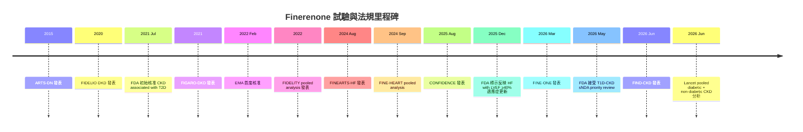
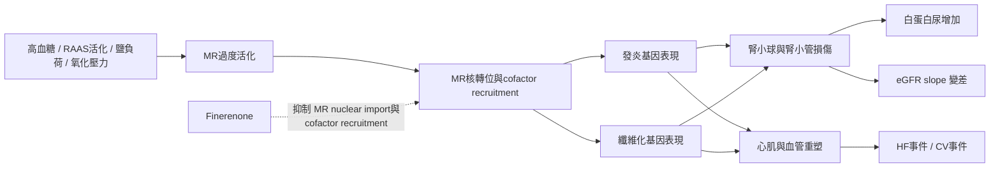

# Finerenone 心腎保護深度研析與進階演講題庫

## 執行摘要

對已熟悉 FIDELIO-DKD、FIGARO-DKD 這些基本試驗名稱的內分泌科醫師而言，finerenone 在 2026 年的真正價值，已經不只是「T2D 合併 CKD 時可加上的非類固醇 MRA」，而是提供了一個可重新組織心腎代謝治療架構的切入點：一方面，它在 T2D 合併 CKD 的證據已由 FIDELIO-DKD 與 FIGARO-DKD 的互補設計，進一步被 FIDELITY 個體層級 pooled analysis 鞏固；另一方面，近兩年的新資料把問題推向更深層：機轉與生物標記、與 SGLT2i／GLP-1RA 的分工與疊加、不同腎病表型之異質性、以及跨出 T2D 的非糖尿病 CKD 與 T1D 擴張。這些才是目前最值得做成「進階演講」的主軸。citeturn19search1turn19search0turn26search5turn14search9turn37search21turn12search3

若演講希望符合「約兩成回顧既有試驗、七成深入新洞見」的比例，我最推薦優先考慮六個主題方向：第一，**finerenone 與類固醇 MRA 的真正差異：從 MR 共因子調控到臨床表型**；第二，**albuminuria 與 eGFR slope 能解釋多少長期腎保護**；第三，**ACEi/ARB、SGLT2i、GLP-1RA、nsMRA 的排序與同時起始策略**；第四，**誰得到最大效益：stage 4 CKD、亞洲族群、基線 HF 風險與治療目標達成度**；第五，**高血鉀與 eGFR dip 的安全工程學**；第六，**超越 T2D：FINE-ONE、FIND-CKD、glomerular disease 亞群與從 CKD 到 CKM 的外推邏輯**。這六題各自都能把「已知試驗」轉化成更高階的臨床判讀。citeturn33search0turn33search1turn17search2turn35search14turn14search9turn15search1turn16search0turn36search0turn34search0turn37search21turn12search3turn39search0turn27search2

從實務角度看，finerenone 的臨床地位目前最穩固的場景仍是 **T2D、albuminuric CKD、已接受最大耐受 RAS inhibition、eGFR >25 mL/min/1.73m²，且血鉀正常**；KDIGO 2024 明確支持在此類病人使用具腎臟或心血管益處的 nsMRA，且實務上可加在 RASi 與 SGLT2i 之上。FDA 2025 標示亦維持 CKD associated with T2D 適應症，同時新增 HF with LVEF ≥40% 的適應症；EMA 現行產品資訊同樣同時列有 T2D-associated albuminuric CKD 與 symptomatic chronic HF with LVEF ≥40% 適應症。citeturn20view2turn20view1turn7view5turn11view0

然而，值得在演講中強調的是：**新證據已走在現行 CKD 與 diabetes guideline 前面**。FINE-ONE 顯示 T1D 合併 CKD 可達成約 25% 的 UACR 額外下降，但目前主要仍是 surrogate-based extension；FIND-CKD 則首次在 non-diabetic CKD 以 eGFR slope 為主要終點，並顯示慢化 eGFR 下降與降低 kidney-cardiovascular composite risk；同時，2026 年 Lancet 的 pooled 分析把 diabetic 與 non-diabetic CKD 放在一起，支持 finerenone 的益處不應再被視為「僅限 T2D 腎病」的現象。也正因如此，現代的 finerenone 演講若只講 FIDELIO 與 FIGARO，會顯得證據框架過時。citeturn37search21turn30search9turn12search3turn13search1turn38search0turn37search2

## 證據版圖與試驗對照

finerenone 的藥理學差異，是其臨床故事能成立的前提。它是高選擇性的非類固醇 MR antagonist；分子與細胞層級研究顯示，finerenone 可抑制 aldosterone-dependent MR nuclear import，並阻斷 steroid receptor coactivator-1 的 recruitment，與傳統 steroidal MRA 在共因子調節與基因轉錄上的模式不同；動物研究則顯示其具有明顯的抗纖維化與改善心肌變形參數效果。這些資料可作為「為何它不是只是比較乾淨的 spironolactone」的 mechanistic foundation。citeturn33search0turn33search3turn33search1turn33search4turn32search6

### 主要試驗與發展路徑對照表

| 試驗 | 族群與設計重點 | 主要終點 | 關鍵結果 | 演講中的角色 |
|---|---|---|---|---|
| ARTS-DN | T2D、persistent albuminuria、已用 ACEi/ARB 的 phase 2b | UACR 變化 | 顯示 finerenone 可劑量相依地降低 albuminuria，奠定長期 outcome study 的合理性。citeturn31search0turn31search3 | 用 1–2 張投影片交代「從 surrogate 到 hard outcome」的起點 |
| FIDELIO-DKD | 較偏腎臟高風險的 T2D+CKD | Kidney composite | HR 0.82；亦降低 CV composite。citeturn8view0turn9view0 | 「腎臟主場」的支柱試驗 |
| FIGARO-DKD | 較早期或較偏心血管風險的 T2D+CKD | CV composite | HR 0.87，主要由 HF hospitalization 訊號驅動。citeturn8view1turn9view0 | 「心血管主場」的支柱試驗 |
| FIDELITY | FIDELIO+FIGARO 個體層級 pooled analysis | CV 與 kidney composite | CV 事件約下降 14%，kidney 事件約下降 23%，HF hospitalization 風險約下降 22%。citeturn20view1turn26search12turn26search8 | 最適合做 forest plot 與異質性解析的核心資料庫 |
| FINEARTS-HF | Symptomatic HF，LVEF ≥40% | Total worsening HF events + CV death | Primary RR 0.84；total HF events RR 0.82。citeturn9view1turn40search0turn40search1 | 把 finerenone 從「糖尿病腎藥」提升為「CKM drug」 |
| CONFIDENCE | CKD+T2D，finerenone vs empagliflozin vs simultaneous combination | Day 180 UACR 變化 | 組合治療 UACR 降幅 52%，比 finerenone 單藥多 29%，比 empagliflozin 單藥多 32%；但高血鉀未被明顯抵消。citeturn15search13turn15search16turn15search1turn15search2 | 最適合講「排序與同時起始」 |
| FINE-ONE | T1D+CKD 的 phase 3 | 6 個月 UACR 變化 | 相對 placebo 約 25% 額外 UACR 下降；高血鉀 10.1% vs 3.3%。citeturn37search21turn30search9turn30search14 | 最佳「超越 T2D」主軸 |
| FIND-CKD | Non-diabetic CKD，phase 3 | Total eGFR slope 至 32 個月 | eGFR slope 差約 +0.7 mL/min/1.73m²/yr；key secondary kidney-cardiovascular composite HR 0.77。citeturn13search4turn13search1turn13search16 | 最佳「surrogate endpoint 與 indication expansion」主軸 |
| FIND-CKD glomerular disease 亞群 | FIND-CKD 中 glomerular disease 903 人 prespecified exploratory analysis | eGFR slope / kidney failure 或 ≥40% eGFR decline | eGFR slope 差 0.73 mL/min/1.73m²/yr；12 個月 albuminuria 降 42%；腎事件風險下降。citeturn39search0turn39search1 | 最適合做「病因學異質性」延伸 |
| FINE-HEART pooled analysis | FIDELIO、FIGARO、FINEARTS-HF 共 18,991 人 participant-level pooled analysis | Multiple CKM outcomes | All-cause death HR 0.91；HF hospitalization HR 0.83；kidney composite HR 0.80；CV death未達顯著。citeturn27search2turn27search5turn27search14 | 最佳「從 CKD drug 到 CKM platform」總結圖 |

FDA 2025 標示顯示 Kerendia 初始美國核准為 2021 年，且在 2025 年 7 月新增 HF with LVEF ≥40% 適應症；EMA 現行資訊則顯示首度核准日期為 2022 年 2 月 16 日，並同時納入 albuminuric T2D-CKD 與 symptomatic chronic HF with LVEF ≥40% 適應症。這些里程碑對演講很重要，因為它們能把 trial story 與 real-world prescribing legitimacy 連起來。citeturn7view5turn11view0turn11view2

下圖可直接用於演講前段，快速交代 finerenone 證據與法規里程碑。時間與節點依原始論文、FDA/EMA 標示與 2026 年 5 月的 FDA priority review 新聞整理。citeturn31search0turn19search1turn19search0turn26search5turn7view5turn11view2turn40search0turn14search9turn37search21turn12search3turn19news36

## 進階演講主題庫

### 主題候選一

#### Finerenone 不是比較安全的 spironolactone而已

| 面向 | 建議內容 |
|---|---|
| 核心臨床 / 科學問題 | 為何 finerenone 可以在血壓下降幅度相對有限的情況下，仍產生穩定的心腎保護？它與 spironolactone / eplerenone 的差異，究竟是「副作用差」還是「生物學不同」？citeturn33search0turn33search1turn32search19 |
| 必備背景 | 必須先交代 MR 在腎與心血管組織中的 non-epithelial effects、finerenone 的非類固醇選擇性、抑制 MR nuclear import 與 cofactor recruitment 的分子證據，以及 preclinical antifibrotic 資料。臨床上以 ARTS-DN、FIDELIO-DKD、FIGARO-DKD 為最小背景包。citeturn33search0turn33search3turn33search1turn31search0turn19search1turn19search0 |
| 建議呈現的資料 / 分析 | 可把資料分成三層：第一層是 molecular mechanism；第二層是 biomarker 層，包括 UACR、NT-proBNP 與其他 inflammation/fibrosis-related biomarkers；第三層是 clinical phenotypes。值得引用 FIGARO-DKD biomarker analysis，以及 FINEARTS-HF 中 natriuretic peptide 變化。citeturn17search3turn17search9turn17search1turn17search10 |
| 潛在爭議與對讀 | 反方常會質疑：若臨床效益主要來自 MR blockade，為何不用更便宜的 steroidal MRA？這一題的回應不是只談 gynecomastia，而是強調 finerenone 在 receptor pharmacology、cofactor modulation、trial population 與 regulatory-indicated outcomes 上都不同；但也要誠實承認，目前 head-to-head long-term kidney outcome data 仍不足。citeturn33search0turn33search1turn32search19turn31search4 |
| 建議圖表 / 表格 | **表 1：steroidal MRA 與 finerenone 的藥理學差異**；**流程圖 1：MR 過度活化 → 發炎/纖維化 → 白蛋白尿與 HF 事件**；**圖 2：ARTS-DN→FIDELIO/FIGARO 的轉譯路徑**。Mechanism flowchart 建議用 mermaid。 |
| 優先來源 | 英文原著優先：Amazit 2015 J Biol Chem、Grune 2018 Hypertension、ARTS-DN、FIGARO biomarker analysis、FINEARTS-HF natriuretic peptide analysis。繁中可輔助使用台灣藥訊或中文仿單做 nomenclature 與教學圖說，但不應取代 primary sources。citeturn33search0turn33search1turn31search0turn17search9turn17search10turn18search4 |
| 投影片 / 時間配置 | 建議 **24 張 / 40 分鐘**：前 5 張講 ARTS-DN、FIDELIO、FIGARO；中間 14 張講 receptor biology、biomarkers、BP-independent effect；最後 5 張講臨床定位與與 steroidal MRA 的比較。 |
| Take-home messages | 這個主題最適合把 finerenone 從「guideline drug」講成「pathobiology-targeting drug」。對內分泌科醫師而言，重點不是它屬於哪一類降壓藥，而是它處理了 glucose、BP、RAS blockade 之外的 residual inflammatory-fibrotic risk。citeturn33search0turn33search1turn17search12 |

### 主題候選二

#### 從白蛋白尿到硬終點

| 面向 | 建議內容 |
|---|---|
| 核心臨床 / 科學問題 | albuminuria reduction 在 finerenone 故事中究竟只是 companion biomarker，還是近似 mechanism-linked surrogate？eGFR slope 在 FIND-CKD 成為 primary endpoint，對內分泌科醫師意味著什麼？citeturn17search2turn35search14turn12search3 |
| 必備背景 | 需先回顧 ARTS-DN 的 dose-dependent UACR lowering、FIDELIO/FIGARO/ FIDELITY 的 kidney outcomes，並補上 eGFR slope surrogate qualification 的方法學背景。若聽眾熟悉 trial name，但不熟悉 surrogate validation，這一題會很有教育價值。citeturn31search0turn26search5turn35search7turn35search14 |
| 建議呈現的資料 / 分析 | 必講 **Impact of Finerenone-Induced Albuminuria Reduction on CKD Outcomes**，其中 ≥30% UACR 降幅在 finerenone 組明顯更常見，且 UACR 變化可中介相當比例的 kidney 與部分 CV benefit；再接 FIND-CKD 的 total eGFR slope 結果與非糖尿病 CKD 的證據延伸。見解若更進一步，可加入 acute vs chronic slope 的解讀。citeturn17search2turn17search21turn13search4turn13search1turn35search3 |
| 潛在爭議與對讀 | 爭議點有三個：第一，albuminuria 下降是否足以推定 long-term kidney protection；第二，FINE-ONE 使用 UACR，FIND-CKD 使用 eGFR slope，是否讓 indication expansion 顯得「endpoint softer」；第三，mediation analysis 能否等同於 mechanistic explanation。可搭配 EMA 對 eGFR slope surrogate 的資格化過程與 2026 Lancet editorial 作為方法學與臨床角度的對照。citeturn35search7turn37search2turn30search4 |
| 建議圖表 / 表格 | **表 2：albuminuria、eGFR slope、hard kidney composite 的 endpoint hierarchy**；**森林圖 1：FIDELIO、FIGARO、FIDELITY、FIND-CKD 的腎臟效應量**；**圖 3：UACR responder vs non-responder 的事件曲線**；**Mermaid 圖 2：Surrogate pathway from MR blockade to kidney outcomes**。 |
| 優先來源 | 第一優先：ARTS-DN、FIDELIO-DKD、FIGARO-DKD、FIDELITY、Impact of Finerenone-Induced Albuminuria Reduction、FIND-CKD 原著。第二優先：EMA eGFR slope qualification 文件。第三優先：2026 Lancet editorial。citeturn31search0turn19search1turn19search0turn26search5turn17search2turn12search3turn35search7turn37search2 |
| 投影片 / 時間配置 | 建議 **22–26 張 / 40–45 分鐘**。前 4–5 張只回顧 trial chronology；後段著重「eGFR dip、total slope、chronic slope、UACR mediation、why endpoints matter」。 |
| Take-home messages | 這一題最能把「知道試驗名稱」提升成「懂 endpoint logic」。若講得好，聽眾會更能判斷：哪些新適應症擴張值得提前關注，哪些仍須保留 methodological humility。citeturn17search2turn35search14turn12search3 |

### 主題候選三

#### 第四支柱還是提早聯用

| 面向 | 建議內容 |
|---|---|
| 核心臨床 / 科學問題 | 在 RASi 與 SGLT2i 已成標準後，finerenone 應該「序列加上」還是「同步起始」？GLP-1RA 在其中是補糖代謝、補 ASCVD，還是也參與腎保護分工？CONFIDENCE 是否足以改變目前加藥節奏？citeturn20view1turn14search9turn16search2 |
| 必備背景 | 需要熟悉 KDIGO 2024 對 nsMRA 的位置、ADA/KDIGO consensus 的 layered therapy 概念，以及 CONFIDENCE 的設計：finerenone、empagliflozin 與兩者 combination 的三臂比較。citeturn20view2turn25view2turn14search9 |
| 建議呈現的資料 / 分析 | 這一題的核心資料是 CONFIDENCE 主文、hyperkalemia JACC analysis、baseline UACR/eGFR/HbA1c exploratory analyses，以及 acute hemodynamic safety papers。也應補上 FIDELITY 中伴隨 SGLT2i / GLP-1RA 的 subgroup 或 post hoc analyses，用來說明真實臨床的 combination logic。citeturn15search13turn15search1turn35search16turn35search11turn16search2turn16search7 |
| 潛在爭議與對讀 | 最大爭議是：CONFIDENCE 的主要結果是 UACR，而不是 hard renal outcome；第二個爭議是，SGLT2i 並未在短期內顯著「抵消」finerenone 的 hyperkalemia risk；第三個爭議則是費用、複方負擔與依從性。這一題很適合搭配 NEJM editorial **Combination Therapy for CKD and Diabetes** 作為正方，JACC hyperkalemia paper 作為保留方。citeturn14search1turn14search7turn15search1turn15search2 |
| 建議圖表 / 表格 | **表 3：ACEi/ARB、SGLT2i、GLP-1RA、finerenone 的作用層次與主要事件型態**；**圖 4：CONFIDENCE 三臂 trial schema**；**圖 5：UACR reduction 與 acute eGFR dip 對照圖**；**平衡圖 1：albuminuria benefit vs hyperkalemia burden**。 |
| 優先來源 | 第一優先：CONFIDENCE 原著與 NEJM editorial。第二優先：JACC hyperkalemia analysis、CONFIDENCE 的 hemodynamic safety 與 baseline exploratory analyses。第三優先：KDIGO 2024 與 ADA/KDIGO consensus。繁中可補入 2024 台灣 DKD 指引或台灣會議教材，但主證據仍以英文原著為準。citeturn14search9turn14search1turn15search1turn35search16turn34search11turn20view2turn29search0 |
| 投影片 / 時間配置 | 建議 **24 張 / 40 分鐘**。前 4 張回顧 FIDELITY 與 guideline position；中間 14 張講 CONFIDENCE 與 add-on / simultaneous initiation；最後 6 張講真實世界 sequencing、門診策略與未解問題。 |
| Take-home messages | 這是最貼近門診決策的題目。最強訊息不是「所有人都該同步三藥起始」，而是：**finerenone 應被視為與 SGLT2i 互補、而不是互斥的 cardiorenal pillar**；但目前若要主張同時起始成為普遍標準，仍需等待 longer-term outcome confirmation。citeturn20view1turn14search9turn15search1 |

### 主題候選四

#### 誰得到最大效益

| 面向 | 建議內容 |
|---|---|
| 核心臨床 / 科學問題 | finerenone 的效益是否在所有 T2D-CKD 病人都一樣？stage 4 CKD、亞洲族群、已有 HF 風險者、或基線治療目標未達標者，是否呈現不同的絕對效益與安全輪廓？citeturn16search0turn16search1turn36search0turn34search0 |
| 必備背景 | 要先讓聽眾重建 FIDELIO 與 FIGARO 的互補招募輪廓：一個偏腎臟高風險，一個偏較早期 CKD / CV event。之後再導入 FIDELITY 的 subgroup philosophy：看 consistent relative effect，但更重視 differential absolute risk。citeturn8view0turn8view1turn26search5 |
| 建議呈現的資料 / 分析 | 可選三個最有料的 subgroup clusters：其一，stage 4 CKD 分析；其二，Asian / Chinese subpopulation；其三，baseline treatment goals、baseline HF history 或 insulin resistance analyses。這三組資料合起來，最能讓內分泌科醫師思考「不是誰相對受益最多，而是誰絕對事件率最高、最值得早用」。citeturn16search0turn16search20turn36search0turn36search4turn34search0turn34search7turn34search16 |
| 潛在爭議與對讀 | 反方會指出 subgroup analyses 的 multiplicity、power limitation 與 publication layering 問題，這是合理的。講者應主動強調：大多 subgroup data 用來**校準臨床判讀**，不是用來重寫 eligibility。最值得避免的是把「consistent across subgroups」誤講成「人人都同樣受益」。citeturn16search0turn36search0turn34search0 |
| 建議圖表 / 表格 | **森林圖 2：stage 4 CKD、Asian、baseline HF / treatment goals 的 subgroup effect**；**熱圖 1：基線 eGFR × UACR × absolute event rate**；**表 4：relative risk reduction 與 absolute risk reduction 分開呈現**。 |
| 優先來源 | FIDELITY 原著為底，再加 stage 4 CKD、HF outcomes by kidney spectrum、Asian/Chinese、baseline treatment goals 分析。若講者想要在亞洲內分泌科場域更有說服力，亞洲 / 中國亞群資料可優先納入。citeturn26search5turn16search0turn16search1turn36search0turn36search4turn34search0 |
| 投影片 / 時間配置 | 建議 **20–24 張 / 35–40 分鐘**。這題不需要花太多篇幅重講主試驗，可直接從 pooled trial architecture 切入。 |
| Take-home messages | 這一題最適合讓聽眾從「平均治療效果」走向「精準層級判讀」。對內分泌科醫師尤其有用，因為門診通常是在多共病、不同腎功能與不同血鉀風險之間進行 individualized layering。citeturn16search0turn36search0turn34search0 |

### 主題候選五

#### 高血鉀與 eGFR dip 的安全工程學

| 面向 | 建議內容 |
|---|---|
| 核心臨床 / 科學問題 | finerenone 的安全問題，真正要擔心的是什麼？高血鉀、初期 eGFR dip、HF 場景中的 renal adverse events、以及與 CYP3A4 交互作用，該如何整合成一套門診 workflow？citeturn9view2turn7view5turn11view0 |
| 必備背景 | 需要掌握官方標示與 guideline framing。KDIGO 2024 建議於 T2D-CKD、eGFR >25、正常血鉀且仍有 albuminuria 時使用 nsMRA，並規律監測 potassium；EMA 產品資訊明示 K >5.0 mmol/L 不建議起始，4.8–5.0 則須更密切監測。citeturn20view2turn20view1turn11view0 |
| 建議呈現的資料 / 分析 | CKD with T2D pooled safety 中，hyperkalemia 14.0% vs 6.9%，住院 0.9% vs 0.2%，永久停藥 1.7% vs 0.6%。stage 4 CKD 亞群中，hyperkalemia 26% vs 13%，但永久停藥仍低。CONFIDENCE 短期分析則顯示 combination 並未顯著降低 hyperkalemia 相對 finerenone 單藥的機率；同时，acute eGFR dip 多屬 hemodynamic 且具可逆性。FINEARTS-HF 另提示 HF 場景中 worsening renal function 事件較安慰劑多。citeturn9view2turn16search20turn15search1turn15search2turn35search11turn35search19turn9view2 |
| 潛在爭議與對讀 | 最常見反對意見是「多一種有效藥，但換來更多抽血與高血鉀風險」。這題的好講法不是否認風險，而是把風險工程化：選對病人、起始時點、併用藥檢視、飲食與實驗室監測節奏。可把 KDIGO 2024、官方 label 與 CONFIDENCE hyperkalemia data 放在同一張 slide，直接回答「風險可不可管理」。citeturn20view1turn7view5turn15search1 |
| 建議圖表 / 表格 | **表 5：不同場景的 hyperkalemia incidence、住院率、停藥率**；**圖 6：acute eGFR dip 的可逆性示意圖**；**流程圖 3：門診監測與 dose adjustment algorithm**；**權衡圖 2：NNT / NNH 概念圖**。 |
| 優先來源 | 官方標示與 guideline 必列第一：FDA label、EMA product information、KDIGO 2024。其後是 stage 4 CKD、CONFIDENCE hyperkalemia analysis、FINEARTS-HF safety data。繁中可補充醫院中文仿單或藥品衛教，但僅作本地實務轉譯。citeturn7view5turn11view0turn20view2turn16search20turn15search1turn9view2turn18search2 |
| 投影片 / 時間配置 | 建議 **18–22 張 / 30–35 分鐘**，若安排在院內 CME，這題反而可能比純 trial review 更受歡迎。 |
| Take-home messages | finerenone 的主要安全議題不是不可預測，而是需要**protocolized monitoring**。對願意做 potassium-aware prescribing 的內分泌科與腎臟共同照護團隊而言，其 benefit-risk ratio 仍具吸引力。citeturn20view1turn9view2turn16search20 |

### 主題候選六

#### 超越 T2D 的心腎版圖

| 面向 | 建議內容 |
|---|---|
| 核心臨床 / 科學問題 | finerenone 的 cardiorenal benefit 是否真的是「T2D-specific」？FINE-ONE、FIND-CKD、glomerular disease 亞群與 FINE-HEART pooled analysis，是否足以把它重新定位成更廣義的 CKM therapy？citeturn37search21turn12search3turn39search0turn27search2 |
| 必備背景 | 需要先用 3–4 張投影片複習 FIDELIO、FIGARO、FIDELITY 的 T2D-CKD evidence core，然後快速切到四個新板塊：T1D、non-diabetic CKD、glomerular disease、HFpEF/HFmrEF / CKM pooling。這題適合學術演講或大會 symposium。citeturn19search1turn19search0turn26search5turn40search0 |
| 建議呈現的資料 / 分析 | 必列 FINE-ONE：UACR 約 25% 額外下降；FIND-CKD：total eGFR slope 改善與 key secondary composite HR 0.77；glomerular disease 亞群：12 個月 albuminuria 降 42%，eGFR slope 差 0.73；FINE-HEART：all-cause death、HF hospitalization、kidney outcomes 皆改善，但 CV death 未達顯著。最後可補 2026 Lancet pooled diabetic + non-diabetic CKD analysis。citeturn37search21turn30search9turn13search1turn13search16turn39search0turn39search1turn27search14turn27search5turn38search0turn38search1 |
| 潛在爭議與對讀 | 這題的反方論點最強：T1D 仍以 UACR surrogate 為主、non-diabetic CKD 以 eGFR slope 作 primary endpoint、glomerular disease 是 exploratory subgroup、HF 與 CKD pooling 可能擴張詮釋邊界。這些疑慮都合理，因此很適合引用 NEJM 的 T1D editorial 與 Lancet 的 **Finerenone: kidney protection beyond type 2 diabetes**，把「證據興奮」與「方法學謹慎」擺在一起。另可點出截至 2026-07-08，FDA 僅表示已接受 T1D-CKD sNDA priority review，尚非既成核准。citeturn30search4turn37search2turn19news36 |
| 建議圖表 / 表格 | **表 6：T2D-CKD、T1D-CKD、non-diabetic CKD、glomerular disease、HFpEF/HFmrEF 的 finerenone 證據階梯**；**Mermaid 圖 4：indication expansion tree**；**森林圖 3：diabetic vs non-diabetic CKD pooled outcomes**。 |
| 優先來源 | 第一優先：FINE-ONE、FIND-CKD、glomerular disease JAMA、FINE-HEART pooled analysis、Lancet pooled diabetic + non-diabetic CKD、相關 NEJM / Lancet editorials。第二優先：Reuters 的 FDA priority review update。繁中可搭配 2024 台灣 DKD guideline executive summary，說明當前本地指引仍主要以 T2D-DKD 為框架。citeturn37search21turn12search3turn39search0turn27search2turn38search0turn30search4turn37search2turn19news36turn29search0 |
| 投影片 / 時間配置 | 建議 **26–30 張 / 45 分鐘**，其中只有前 5–6 張回顧舊 trials；其餘全部講 extension、heterogeneity 與 regulatory implications。 |
| Take-home messages | 這是目前「新穎度最高」的題目。最重要的結論不是說 finerenone 已經完全脫離 T2D，而是：**證據正在快速逼近一個更廣的 CKM / CKD platform 概念，但真正的 practice change 仍需區分已核准、可外推、與尚待驗證三個層次。**citeturn37search21turn12search3turn27search2turn19news36 |

## 視覺化與投影片設計

若只做一場 40 分鐘左右的演講，我建議採用 **5:15:4** 的投影片節奏：前 **5 張** 快速回顧 ARTS-DN、FIDELIO-DKD、FIGARO-DKD、FIDELITY 與 guideline position；中間 **15 張** 完整鋪陳其中一個進階主題；最後 **4 張** 做 safety、實務 workflow、爭議與 take-home。這種分配最能符合「約 20% 舊試驗、約 70% 新洞見」的要求，同時不讓聽眾覺得 trial recap 過長。

若要做一張真正有教學力的機轉圖，建議不要畫成單純的「aldosterone→MR→bad things」；應把 **MR nuclear signaling、inflammation/fibrosis、albuminuria、eGFR slope 與 HF phenotype** 串在同一張圖裡，才能把 mechanistic and clinical translation 一次講清楚。下圖可直接作為簡報初稿。其概念來自 finerenone 對 MR nuclear import / cofactor recruitment 的分子研究，並結合其在 biomarker 與 cardiorenal outcome trials 中的表現。citeturn33search0turn33search1turn17search3turn17search1

若要把數據圖做得更像高水準大會報告，建議至少準備四種圖型。第一種是 **trial timeline**，用來幫聽眾重新整理證據世代；第二種是 **forest plot**，用來比較 kidney composite、CV composite、HF hospitalization 在不同 trial/ subgroup 間的方向與穩定性；第三種是 **mechanism flowchart**，讓 mechanistic story 不致流於口號；第四種是 **safety-vs-efficacy tradeoff chart**，把 hyperkalemia incidence、住院率、停藥率與 event reduction 放在同一張圖。真正的說服力，通常來自把 benefit 與 cost 放在一起，而不是只展示 hazard ratio。citeturn9view0turn9view2turn15search1turn16search20

若希望更貼近內分泌科場域，我建議加入一張**「四大支柱對照表」**：RASi、SGLT2i、GLP-1RA、nsMRA 各自主要作用層次、主要心腎終點強項、常見副作用、何時最該優先加上。這張表本身不是 trial 結果，但能把 endocrinology audience 熟悉的 glucose-lowering world，和 nephrology / cardiology 的 event-driven world 連起來。KDIGO 2024 與 ADA/KDIGO consensus 都支持這種 layered, comprehensive cardiorenal risk reduction 架構。citeturn20view2turn25view2turn24view0

## 優先文獻地圖

若要準備一場真正扎實的 finerenone 進階演講，文獻蒐集應按層級排序，而不是按出版年份排序。**第一層一定是原始 outcome trials 與官方標示**：ARTS-DN、FIDELIO-DKD、FIGARO-DKD、FIDELITY、FINEARTS-HF、CONFIDENCE、FINE-ONE、FIND-CKD、glomerular disease JAMA、FINE-HEART pooled analysis，以及 FDA / EMA label。這一層定義「已知且最可辯護的事實」。citeturn31search0turn19search1turn19search0turn26search5turn40search0turn14search9turn37search21turn12search3turn39search0turn27search2turn7view5turn11view0

**第二層是關鍵次分析與 mechanistic-analytic papers**，最值得優先看的是：albuminuria mediation analysis、stage 4 CKD analysis、HF outcomes by kidney risk、SGLT2i / GLP-1RA concomitant use analyses、CONFIDENCE hyperkalemia 與 early hemodynamic safety papers、FIGARO biomarker paper、Asian/Chinese subpopulation papers、baseline treatment goals paper。這一層決定你的演講能不能超越「把 trial 結果重念一遍」。citeturn17search2turn16search0turn16search1turn16search2turn15search1turn35search16turn17search9turn36search0turn36search4turn34search0

**第三層是 guideline 與 consensus documents**。最該優先放進投影片的是 KDIGO 2024 CKD guideline、ADA/KDIGO 2022 consensus、ADA 2025/2026 CKD risk management section，以及 2024 Taiwan DKD guideline executive summary。原因不是因為這些文件最新，而是因為它們定義了當下「何者已標準化、何者仍在演變中」。例如 KDIGO 2024 仍以 T2D、albuminuria、RASi 背景下的 nsMRA 為主體推薦；因此任何超越 T2D 的演講，都應主動標示哪些內容屬於 evidence expansion，而非既有 guideline routine。citeturn20view2turn25view2turn21search0turn22search0turn29search0

**第四層是高影響 editorial / response pieces**，它們很適合放在 discussion slide，而不是背景 slide。優先推薦四篇：NEJM 的 **FINEARTS-HF — The Latest Masterpiece for MRAs in Heart Failure**、NEJM 的 **Combination Therapy for CKD and Diabetes**、NEJM 的 **Finerenone for Diabetic Kidney Disease in Type 1 Diabetes**、以及 Lancet 的 **Finerenone: kidney protection beyond type 2 diabetes**。這四篇剛好對應 HF、combination strategy、T1D extension、non-diabetic expansion 四大爭議節點。citeturn40search7turn14search1turn30search4turn37search2

若考量使用者指定的語言偏好，實務上可採取以下原則：**凡有繁體中文且具「官方或學會」地位者，可優先用於 nomenclature、本地 guideline 對接與適應症翻譯；凡涉及結論、效益量、爭議與方法學，優先用英文 primary literature 與 official label。** 可優先採用的繁中輔助來源包括 2024 Taiwan DKD guideline executive summary、糖尿病學會指引入口與中文仿單 / 醫院藥訊；但它們應當是輔助，不應取代原始論文。citeturn29search0turn29search2turn18search2turn18search4

綜合來看，**最值得做成高階內分泌科演講的 finerenone 題目，不是單一 trial review，而是 trial architecture 加上 mechanism、surrogate interpretation、combination strategy、phenotype heterogeneity 與 indication expansion 的整合式敘事**。如果只能選一題，我會優先推薦「**第四支柱還是提早聯用：finerenone 與 SGLT2i / GLP-1RA 的排序與同時起始**」；如果要追求新穎度最高，則是「**超越 T2D 的心腎版圖**」；如果要追求最具學術辨識度與討論深度，則是「**從白蛋白尿到硬終點**」。這三題最能讓熟悉基本 trial 名稱的臨床醫師，真正得到新的臨床與科學洞見。citeturn14search9turn15search1turn37search21turn12search3turn17search2turn35search14