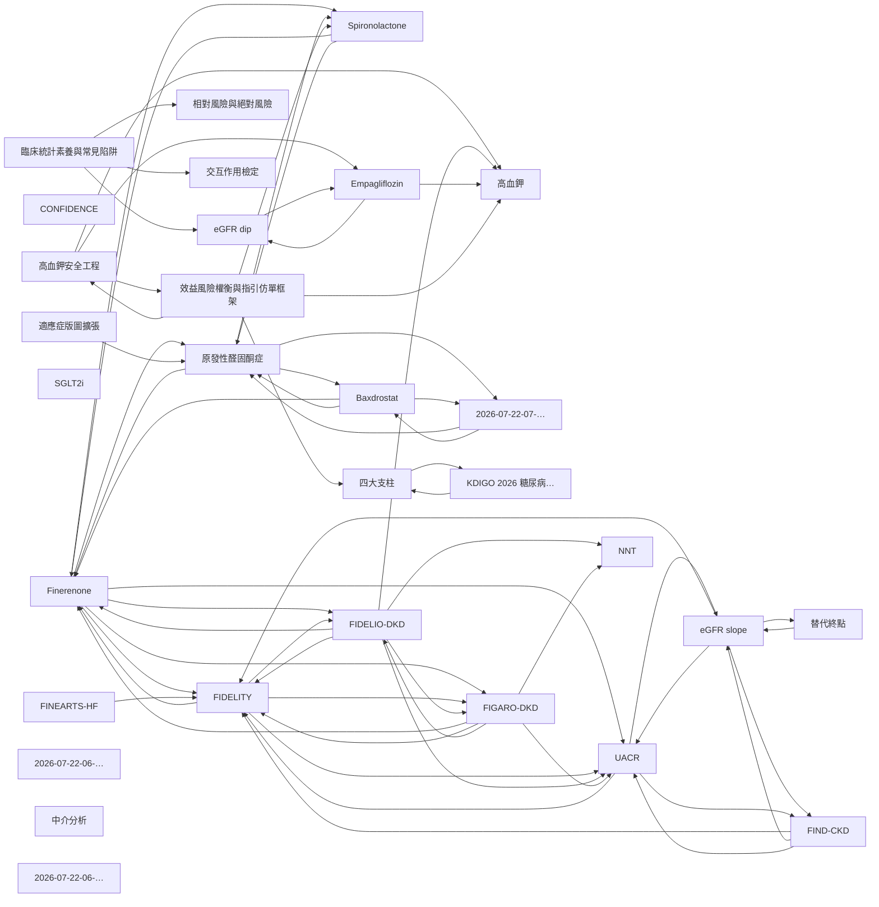

# 知識圖譜

> 自動生成 | 2026-07-22 | 全庫共 203 個節點、2400 條關聯
> 下圖只畫**度數最高的 30 個節點**與其中權重最高的關聯，避免圖過密。完整互動版見 `wiki/knowledge-graph.html`。

## 圖譜結構說明

Louvain 社群偵測把 203 個節點分成 11 個社群，社群名取自該群最具代表性的頁面：

| 社群 | 節點數 | 說明 |
|------|--------|------|
| 臨床統計素養與常見陷阱 | 41 | 橫切全庫的方法學與統計概念，是最大的一群——反映七個主題各有一份統計迷思檔 |
| 合成端 vs 受體端：ASI 與原發性醛固酮症 | 32 | 主題七自成一個相對獨立的知識塊 |
| 四大支柱與加藥策略 | 26 | CONFIDENCE、SGLT2i、序列 vs 同步起始 |
| 替代終點方法學 | 22 | UACR、eGFR slope、終點資格化 |
| 效益風險權衡與指引仿單框架 | 18 | NNT/NNH、KDIGO、仿單條文 |
| eGFR dip 與腎絲球血流動力學 | 16 | 血流動力學可逆性 |
| 適應症版圖擴張 | 14 | T1D、非糖尿病 CKD、HF |
| 受體藥理與 nsMRA 分野 | 12 | 受體選擇性、解離動力學 |
| 因果中介分析 | 9 | UACR/SBP/血鉀 三條中介路徑 |
| 高血鉀安全工程 | 9 | 場景別監測 |
| 低血鉀 | 4 | 電解質帳的另一端，目前素材最少 |

## 樞紐節點（度數前 10）

| 節點 | 度數 |
|------|------|
| Finerenone | 129 |
| FIDELITY | 94 |
| 高血鉀 | 75 |
| UACR | 59 |
| CONFIDENCE | 58 |
| 替代終點 | 58 |
| FINEARTS-HF | 55 |
| Spironolactone | 53 |
| eGFR dip | 50 |
| SGLT2i | 46 |

## 查看方式

- **互動式（推薦）**：雙擊 `wiki/knowledge-graph.html`（建議 Chrome / Firefox；Safari 若提示「已阻止指令碼」，可在 `wiki/` 下跑 `python3 -m http.server 8000` 再訪問）
- **Mermaid 靜態圖**：本檔，Obsidian / VS Code（Markdown Preview Enhanced）/ GitHub / Typora 皆可渲染

> 圖譜洞察（surprising connections、bridge nodes）因圖規模超出腳本預算（203 節點 / 2400 邊，上限 250 / 1000）而降級，僅保留基礎權重與社群偵測。
